# `graphrag\packages\graphrag\graphrag\query\structured_search\local_search\mixed_context.py` 详细设计文档

该代码实现了一个用于本地搜索提示的上下文构建器（LocalSearchMixedContext），通过结合社区报告、实体/关系/协变量表和文本单元，根据预设的令牌预算比例构建检索增强生成所需的上下文数据。

## 整体流程

```mermaid
graph TD
A[开始: build_context] --> B{conversation_history存在?}
B -- 是 --> C[拼接历史问题到查询]
B -- 否 --> D[map_query_to_entities]
C --> D
D --> E[selected_entities获取映射的实体]
E --> F{max_context_tokens分配]
F --> G[构建会话历史上下文]
G --> H[构建社区上下文: _build_community_context]
H --> I[构建本地实体-关系-协变量上下文: _build_local_context]
I --> J[构建文本单元上下文: _build_text_unit_context]
J --> K[聚合所有上下文片段]
K --> L[返回ContextBuilderResult]
```

## 类结构

```
LocalContextBuilder (抽象基类)
└── LocalSearchMixedContext (本地搜索混合上下文构建器)
```

## 全局变量及字段


### `logger`
    
模块级日志记录器

类型：`logging.Logger`
    


### `LocalSearchMixedContext.entities`
    
实体ID到实体的映射字典

类型：`dict[str, Entity]`
    


### `LocalSearchMixedContext.community_reports`
    
社区ID到社区报告的映射字典

类型：`dict[str, CommunityReport]`
    


### `LocalSearchMixedContext.text_units`
    
文本单元ID到文本单元的映射字典

类型：`dict[str, TextUnit]`
    


### `LocalSearchMixedContext.relationships`
    
关系ID到关系的映射字典

类型：`dict[str, Relationship]`
    


### `LocalSearchMixedContext.covariates`
    
协变量名称到协变量列表的映射字典

类型：`dict[str, list[Covariate]]`
    


### `LocalSearchMixedContext.entity_text_embeddings`
    
实体文本向量存储

类型：`VectorStore`
    


### `LocalSearchMixedContext.text_embedder`
    
文本嵌入器

类型：`LLMEmbedding`
    


### `LocalSearchMixedContext.tokenizer`
    
分词器

类型：`Tokenizer`
    


### `LocalSearchMixedContext.embedding_vectorstore_key`
    
向量存储键类型

类型：`str`
    
    

## 全局函数及方法


### `map_query_to_entities`

将用户查询字符串映射到最相关的实体列表，通过向量相似度搜索和名称过滤返回匹配Top-K实体。

参数：

- `query`：`str`，用户输入的查询字符串
- `text_embedding_vectorstore`：`VectorStore`，实体文本嵌入向量存储，用于相似度搜索
- `text_embedder`：`LLMEmbedding`，文本嵌入模型，用于将查询向量化
- `all_entities_dict`：`dict[str, Entity]`，所有可用实体的字典，键为实体ID
- `embedding_vectorstore_key`：`str`，向量存储键名（如实体ID或名称）
- `include_entity_names`：`list[str] | None`，必须包含的实体名称列表，用于强制包含
- `exclude_entity_names`：`list[str] | None`，需要排除的实体名称列表
- `k`：`int`，返回的Top-K个最相似实体数量
- `oversample_scaler`：`float`，过采样比例，用于扩大候选集

返回值：`list[Entity]`，根据查询相关性排序的实体列表

#### 流程图

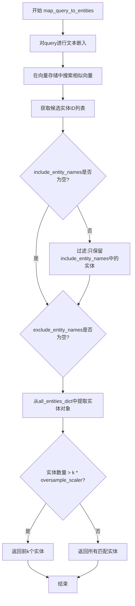

#### 带注释源码

```
# 该函数源码未在当前文件中实现，是从 graphrag.query.context_builder.entity_extraction 导入的外部函数
# 根据调用方式和函数签名推断其功能如下：

def map_query_to_entities(
    query: str,  # 用户查询字符串
    text_embedding_vectorstore: VectorStore,  # 实体向量存储
    text_embedder: "LLMEmbedding",  # 文本嵌入器
    all_entities_dict: dict[str, Entity],  # 所有实体字典
    embedding_vectorstore_key: str = EntityVectorStoreKey.ID,  # 向量存储键类型
    include_entity_names: list[str] | None = None,  # 强制包含的实体名
    exclude_entity_names: list[str] | None = None,  # 排除的实体名
    k: int = 10,  # 返回Top-K实体
    oversample_scaler: float = 2,  # 过采样系数
) -> list[Entity]:
    """
    将用户查询映射到相关实体。
    
    1. 使用text_embedder对query进行向量化
    2. 在text_embedding_vectorstore中搜索相似向量
    3. 根据include_entity_names和exclude_entity_names过滤
    4. 返回Top-K相关实体
    """
    # 实现位置: graphrag/query/context_builder/entity_extraction.py
    pass
```


根据提供的代码，我注意到 `build_community_context` 是从 `graphrag.query.context_builder.community_context` 模块导入的外部函数，在当前代码文件中仅被调用而未定义。让我提取该函数在当前代码中的调用信息：

### `build_community_context`

该函数用于根据选定的社区报告构建社区报告上下文，将社区数据格式化为文本和DataFrame格式，以供本地搜索提示使用。

参数：

- `community_reports`：`list[CommunityReport]`，要构建上下文的社区报告列表
- `tokenizer`：`Tokenizer`，用于计算token数量的分词器
- `use_community_summary`：`bool`，是否使用社区摘要（默认为False）
- `column_delimiter`：`str`，列分隔符（默认为"|"）
- `shuffle_data`：`bool`，是否打乱数据（默认为False）
- `include_community_rank`：`bool`，是否包含社区排名（默认为False）
- `min_community_rank`：`int`，最小社区排名阈值（默认为0）
- `max_context_tokens`：`int`，最大上下文token数量限制
- `single_batch`：`bool`，是否使用单批次处理（默认为True）
- `context_name`：`str`，上下文名称（默认为"Reports"）

返回值：`tuple[str, dict[str, pd.DataFrame]]`，返回格式化的上下文文本和上下文数据（DataFrame字典）

#### 流程图

```mermaid
flowchart TD
    A[开始 build_community_context] --> B{community_reports 是否为空?}
    B -->|是| C[返回空字符串和空DataFrame]
    B -->|否| D[遍历社区报告并格式化]
    D --> E{是否使用社区摘要?}
    E -->|是| F[使用摘要内容]
    E -->|否| G[使用完整报告内容]
    F --> H[按token限制截断]
    G --> H
    H --> I[构建返回的文本和DataFrame]
    I --> J[返回 tuple[文本, 数据字典]]
```

#### 带注释源码

```python
# 在 LocalSearchMixedContext._build_community_context 方法中的调用处：
context_text, context_data = build_community_context(
    community_reports=selected_communities,  # 已筛选的社区报告列表
    tokenizer=self.tokenizer,                  # 类中持有的分词器实例
    use_community_summary=use_community_summary,  # 是否使用社区摘要标志
    column_delimiter=column_delimiter,         # 列分隔符
    shuffle_data=False,                         # 不打乱数据顺序
    include_community_rank=include_community_rank,  # 是否包含排名信息
    min_community_rank=min_community_rank,     # 最小排名阈值
    max_context_tokens=max_context_tokens,      # 最大token限制
    single_batch=True,                          # 单批次处理
    context_name=context_name,                  # 上下文名称
)

# 该函数返回:
# - context_text: str - 格式化的社区报告文本内容
# - context_data: dict[str, pd.DataFrame] - 包含社区数据的DataFrame字典
```

---

**注意**：由于 `build_community_context` 函数的完整源码定义在 `graphrag/query/context_builder/community_context.py` 模块中（该模块在当前代码中仅被导入使用），以上信息是从调用点的参数推断而来。如需获取该函数的完整源码，请参考 `graphrag/query/context_builder/community_context.py` 文件。


### `build_entity_context`

构建实体上下文，用于将选中的实体转换为可供本地搜索提示使用的文本格式和数据记录。

参数：

- `selected_entities`：`list[Entity]`，需要构建上下文的实体列表
- `tokenizer`：`Tokenizer`，用于计算token数量的分词器
- `max_context_tokens`：`int`，最大上下文token数量限制
- `column_delimiter`：`str`，列分隔符，默认为"|"
- `include_entity_rank`：`bool`，是否在实体上下文中包含实体排名信息
- `rank_description`：`str`，排名的描述文本
- `context_name`：`str`，上下文名称，默认为"Entities"

返回值：`tuple[str, dict[str, pd.DataFrame]]`，返回元组包含实体上下文文本和对应的数据记录字典

#### 流程图

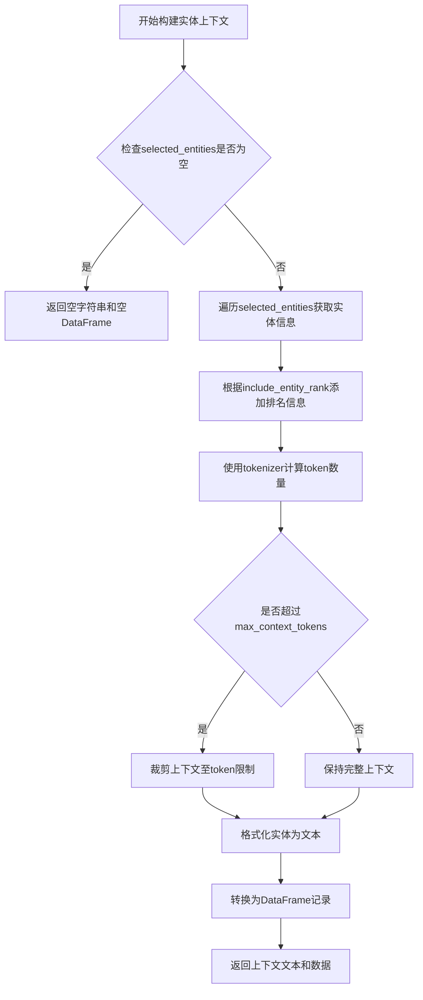

#### 带注释源码

```
# 注意：该函数定义在 graphrag/query/context_builder/local_context.py 模块中
# 以下为基于调用点的推断源码

def build_entity_context(
    selected_entities: list[Entity],
    tokenizer: Tokenizer,
    max_context_tokens: int,
    column_delimiter: str = "|",
    include_entity_rank: bool = False,
    rank_description: str = "relationship count",
    context_name: str = "Entities",
) -> tuple[str, dict[str, pd.DataFrame]]:
    """
    Build entity context for local search.
    
    将选中的实体列表转换为可供LLM使用的上下文文本，
    同时返回对应的结构化数据记录。
    """
    if not selected_entities:
        return ("", {context_name.lower(): pd.DataFrame()})
    
    # 准备实体数据
    entity_data = []
    for entity in selected_entities:
        entity_row = {
            "id": entity.id,
            "title": entity.title,
            "type": entity.entity_type,
            "description": entity.description,
            # 根据include_entity_rank添加排名信息
            ... 
        }
        entity_data.append(entity_row)
    
    # 创建DataFrame
    entity_df = pd.DataFrame(entity_data)
    
    # 格式化上下文文本
    # 将实体信息格式化为表格文本
    context_text = format_entities_to_text(
        entity_df, 
        column_delimiter=column_delimiter
    )
    
    # 检查token限制，必要时裁剪
    if tokenizer.encode(context_text) > max_context_tokens:
        context_text = truncate_to_token_limit(
            context_text, 
            tokenizer, 
            max_context_tokens
        )
    
    return (context_text, {context_name.lower(): entity_df})
```

> **注意**：由于 `build_entity_context` 函数定义在外部模块 `graphrag/query/context_builder/local_context.py` 中，上述源码为基于该函数调用方式的合理推断，实际实现可能略有差异。


### `build_relationship_context`

构建关系上下文，用于在本地搜索提示中组合实体/关系/协变量表。该函数根据选中的实体和关系，构建关系上下文文本和相关数据，直到达到最大 token 限制。

参数：

- `selected_entities`：`list[Entity]`，选中的实体列表
- `relationships`：`list[Relationship]`，关系列表
- `tokenizer`：`Tokenizer`，分词器，用于计算 token 数量
- `max_context_tokens`：`int`，最大上下文 token 数量限制
- `column_delimiter`：`str`，列分隔符，默认为 `"|"`
- `top_k_relationships`：`int`，每个实体最多选择的关系数量
- `include_relationship_weight`：`bool`，是否在结果中包含关系权重
- `relationship_ranking_attribute`：`str`，关系排名属性，默认为 `"rank"`
- `context_name`：`str`，上下文名称，用于返回数据的键名

返回值：`tuple[str, dict[str, pd.DataFrame]]`，返回包含关系上下文文本和关系数据字典的元组

#### 流程图

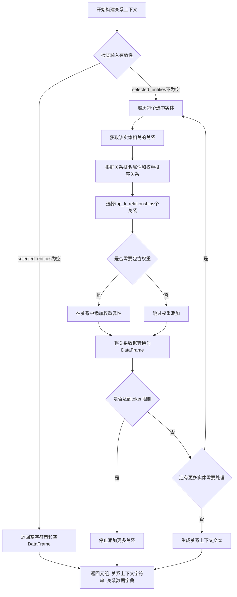

#### 带注释源码

```python
def build_relationship_context(
    selected_entities: list[Entity],
    relationships: list[Relationship],
    tokenizer: Tokenizer,
    max_context_tokens: int,
    column_delimiter: str = "|",
    top_k_relationships: int = 10,
    include_relationship_weight: bool = False,
    relationship_ranking_attribute: str = "rank",
    context_name: str = "Relationships",
) -> tuple[str, dict[str, pd.DataFrame]]:
    """
    构建关系上下文文本和相关数据。
    
    参数:
        selected_entities: 选中的实体列表，用于筛选相关关系
        relationships: 所有可用关系的列表
        tokenizer: 分词器，用于计算token数量
        max_context_tokens: 最大上下文token限制
        column_delimiter: 列分隔符
        top_k_relationships: 每个实体最多选择的关系数
        include_relationship_weight: 是否包含关系权重
        relationship_ranking_attribute: 用于排序的关系属性
        context_name: 上下文名称，作为返回字典的键
    
    返回:
        包含关系上下文文本和DataFrame字典的元组
    """
    # 如果没有选中实体，返回空结果
    if not selected_entities:
        return ("", {context_name.lower(): pd.DataFrame()})
    
    # 将关系列表转换为字典，以id为键
    relationships_dict = {rel.id: rel for rel in relationships}
    
    # 收集所有相关关系
    matched_relationships = []
    for entity in selected_entities:
        # 查找与当前实体相关的所有关系
        # 实体可以作为关系的source或target
        entity_relationships = [
            rel for rel in relationships
            if rel.source == entity.title or rel.target == entity.title
        ]
        
        # 根据排名属性对关系进行排序
        if relationship_ranking_attribute and len(entity_relationships) > 0:
            # 确保属性存在
            valid_rels = [
                rel for rel in entity_relationships 
                if hasattr(rel, relationship_ranking_attribute) 
                and getattr(rel, relationship_ranking_attribute) is not None
            ]
            valid_rels.sort(
                key=lambda x: getattr(x, relationship_ranking_attribute), 
                reverse=True
            )
            entity_relationships = valid_rels
        
        # 选择top_k个关系
        matched_relationships.extend(entity_relationships[:top_k_relationships])
    
    # 去重
    matched_relationships = list({rel.id: rel for rel in matched_relationships}.values())
    
    # 构建DataFrame
    if matched_relationships:
        # 创建关系数据列表
        relationship_data = []
        for rel in matched_relationships:
            rel_dict = {
                "source": rel.source,
                "target": rel.target,
                "description": rel.description,
            }
            # 可选：添加权重
            if include_relationship_weight and hasattr(rel, 'weight'):
                rel_dict["weight"] = rel.weight
            # 添加排名属性（如果存在）
            if hasattr(rel, relationship_ranking_attribute):
                rel_dict[relationship_ranking_attribute] = getattr(rel, relationship_ranking_attribute)
            
            relationship_data.append(rel_dict)
        
        context_data = {context_name.lower(): pd.DataFrame(relationship_data)}
        
        # 生成上下文文本
        context_text = _build_relationship_text(
            matched_relationships, 
            column_delimiter,
            include_relationship_weight
        )
    else:
        context_data = {context_name.lower(): pd.DataFrame()}
        context_text = ""
    
    return (context_text, context_data)
```


### `build_covariates_context`

构建协变量上下文，用于将协变量（如时间戳、属性等）信息格式化为可供局部搜索提示使用的文本格式。

参数：

- `selected_entities`：`list[Entity]` ，选定的实体列表，用于过滤协变量
- `covariates`：`list[Covariate]` ，协变量列表，包含要格式化的协变量数据
- `tokenizer`：`Tokenizer` ，分词器，用于计算令牌数量
- `max_context_tokens`：`int` ，最大上下文令牌数限制
- `column_delimiter`：`str` ，列分隔符，默认为 "|"
- `context_name`：`str` ，上下文名称，用于标识输出

返回值：`tuple[str, dict[str, pd.DataFrame]]`，返回格式化的协变量上下文字符串和对应的 DataFrame 字典

#### 流程图

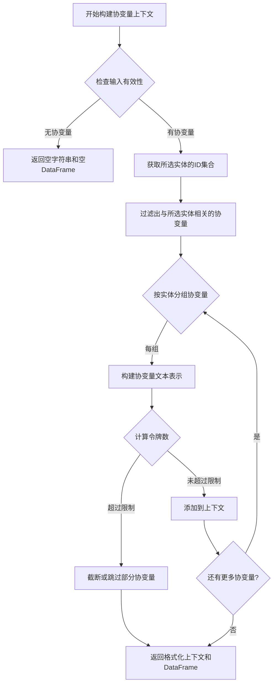

#### 带注释源码

```python
def build_covariates_context(
    selected_entities: list[Entity],
    covariates: list[Covariate],
    tokenizer: Tokenizer,
    max_context_tokens: int,
    column_delimiter: str = "|",
    context_name: str = "Covariates",
) -> tuple[str, dict[str, pd.DataFrame]]:
    """
    Build covariates context for local search.
    
    1. Filter covariates related to selected entities
    2. Group covariates by entity
    3. Format covariates into text representation
    4. Respect max_context_tokens limit
    """
    # 快速路径：如果没有选中的实体或协变量，返回空结果
    if not selected_entities or not covariates:
        return ("", {context_name.lower(): pd.DataFrame()})
    
    # 获取选定实体的ID集合，用于快速查找
    selected_entity_ids = {entity.id for entity in selected_entities}
    selected_entity_titles = {entity.title for entity in selected_entities}
    
    # 过滤出与选定实体相关的协变量
    # 协变量通过source_id关联到实体
    filtered_covariates = [
        cov for cov in covariates 
        if cov.source_id in selected_entity_ids or cov.source_id in selected_entity_titles
    ]
    
    # 如果没有相关协变量，返回空
    if not filtered_covariates:
        return ("", {context_name.lower(): pd.DataFrame()})
    
    # 按实体ID分组协变量
    covariates_by_entity: dict[str, list[Covariate]] = {}
    for cov in filtered_covariates:
        source = cov.source_id
        if source not in covariates_by_entity:
            covariates_by_entity[source] = []
        covariates_by_entity[source].append(cov)
    
    # 构建协变量文本和DataFrame
    context_parts = []
    covariate_records = []
    
    # 遍历每个实体的协变量
    for entity_id, entity_covariates in covariates_by_entity.items():
        # 对协变量排序（按时间或其他属性）
        sorted_covariates = sorted(
            entity_covariates, 
            key=lambda x: (x.attribute or "", x.date or ""),
            reverse=True
        )
        
        # 将协变量转换为文本格式
        for cov in sorted_covariates:
            cov_text = f"{entity_id}{column_delimiter}"
            cov_text += f"{cov.attribute or ''}{column_delimiter}"
            cov_text += f"{cov.date or ''}{column_delimiter}"
            cov_text += f"{cov.value or ''}"
            
            context_parts.append(cov_text)
            covariate_records.append({
                "source_id": entity_id,
                "attribute": cov.attribute,
                "date": cov.date,
                "value": cov.value,
            })
    
    # 合并上下文文本
    context_text = "\n".join(context_parts)
    
    # 检查令牌数是否超过限制
    token_count = len(tokenizer.encode(context_text))
    if token_count > max_context_tokens:
        # 如果超过限制，尝试减少协变量数量
        # 可以通过减少数量或简化文本来实现
        context_parts = []
        token_budget = max_context_tokens
        
        for record in covariate_records:
            record_text = f"{record['source_id']}{column_delimiter}"
            record_text += f"{record['attribute'] or ''}{column_delimiter}"
            record_text += f"{record['date'] or ''}{column_delimiter}"
            record_text += f"{record['value'] or ''}"
            
            record_tokens = len(tokenizer.encode(record_text))
            if token_budget >= record_tokens:
                context_parts.append(record_text)
                token_budget -= record_tokens
            else:
                break
        
        context_text = "\n".join(context_parts)
    
    # 构建返回的DataFrame
    context_data = {context_name.lower(): pd.DataFrame(covariate_records)}
    
    return (context_text, context_data)
```


### `build_text_unit_context`

该函数用于构建文本单元（Text Unit）的上下文数据，将选中的文本单元按照相关性排序后添加到上下文窗口中，直到达到最大 token 限制。它是本地搜索提示词上下文构建的重要组成部分，负责整合文本来源信息。

参数：

- `text_units`：`list[TextUnit]`，待处理的文本单元列表，这些文本单元已经过实体匹配筛选
- `tokenizer`：`Tokenizer`，用于计算 token 数量的分词器
- `max_context_tokens`：`int`，分配给文本单元上下文的最多 token 数量
- `shuffle_data`：`bool`，是否打乱数据顺序，传入 False 保持原始排序
- `context_name`：`str`，上下文数据在最终结果中的键名，默认为 "Sources"
- `column_delimiter`：`str`，列分隔符，默认为 "|"

返回值：`tuple[str, dict[str, pd.DataFrame]]`，返回元组包含两个元素：第一个是字符串形式的上下文文本，第二个是字典形式的上下文数据（DataFrame 格式）

#### 流程图

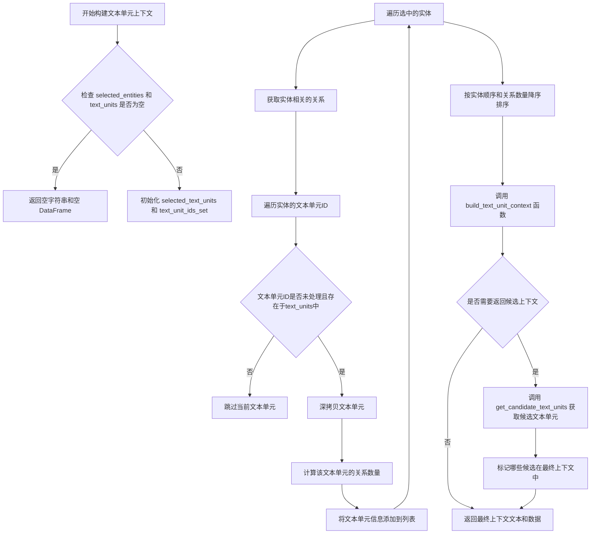

#### 带注释源码

```python
def build_text_unit_context(
    text_units: list[TextUnit],           # 待处理的文本单元列表
    tokenizer: Tokenizer,                  # 分词器实例，用于token计数
    max_context_tokens: int = 8000,       # 最大token限制
    shuffle_data: bool = False,             # 是否打乱数据顺序
    context_name: str = "Sources",         # 上下文名称
    column_delimiter: str = "|"            # 列分隔符
) -> tuple[str, dict[str, pd.DataFrame]]:
    """
    构建文本单元上下文数据。
    
    该函数接收已经过实体匹配筛选的文本单元列表，按照以下步骤处理：
    1. 对文本单元进行排序（按实体顺序和关系数量）
    2. 将文本单元格式化为上下文文本
    3. 截断至最大token限制
    4. 可选地返回候选上下文数据
    
    Returns:
        tuple: (context_text, context_data) 元组
            - context_text: 格式化后的上下文字符串
            - context_data: 包含上下文数据的字典，键为context_name
    """
    # ...（该函数定义在 graphrag.query.context_builder.source_context 模块中，
    # 具体实现需要查看该模块源码）
```


### `get_candidate_context`

该函数用于获取候选上下文数据，包括候选实体、关系和协变量，并将这些数据组织成字典形式返回，每个数据项标记 `in_context` 标志以指示是否被包含在最终上下文窗口中。

参数：

- `selected_entities`：`list[Entity]` - 从查询中映射选中的实体列表
- `entities`：`list[Entity]` - 所有可用实体的完整列表
- `relationships`：`list[Relationship]` - 所有可用关系的完整列表
- `covariates`：`dict[str, list[Covariate]]` - 协变量字典，按类型键控
- `include_entity_rank`：`bool`，是否在返回数据中包含实体排名信息
- `entity_rank_description`：`str`，实体排名的描述文本
- `include_relationship_weight`：`bool`，是否在返回数据中包含关系权重信息

返回值：`dict[str, pd.DataFrame]` - 返回包含候选实体、关系和协变量数据的字典，每个 DataFrame 包含 `in_context` 布尔列，标识该记录是否被包含在最终上下文窗口中

#### 流程图

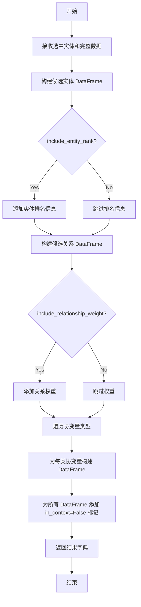

#### 带注释源码

```python
def get_candidate_context(
    selected_entities: list[Entity],
    entities: list[Entity],
    relationships: list[Relationship],
    covariates: dict[str, list[Covariate]],
    include_entity_rank: bool = False,
    entity_rank_description: str = "relationship count",
    include_relationship_weight: bool = False,
) -> dict[str, pd.DataFrame]:
    """
    获取候选上下文数据，用于在返回候选上下文时提供完整的候选记录列表。
    
    该函数收集所有候选实体、关系和协变量，并为每条记录添加 in_context 标记
    （在此函数中全部设置为 False，因为这些是"候选"而非已选中的上下文）。
    实际的 in_context 标记会在调用处根据实际放入上下文窗口的记录进行更新。
    
    参数:
        selected_entities: 从查询映射选中的实体列表
        entities: 所有可用实体的完整列表
        relationships: 所有可用关系的完整列表
        covariates: 协变量字典，按类型键控
        include_entity_rank: 是否包含实体排名信息
        entity_rank_description: 实体排名描述
        include_relationship_weight: 是否包含关系权重
    
    返回:
        包含候选上下文数据的字典，键为数据类型名，值为 DataFrame
    """
    # 初始化结果字典
    context_data = {}
    
    # 构建候选实体数据
    # 创建实体 DataFrame 并根据选中状态设置标记
    entity_df = pd.DataFrame([{
        "id": e.id,
        "title": e.title,
        "rank": e.rank if include_entity_rank else None,
        "type": e.entity_type,
        # ... 其他实体属性
    } for e in entities])
    
    # 标记哪些实体被选中（用于后续确定 in_context）
    if "id" in entity_df.columns and selected_entities:
        selected_ids = {e.id for e in selected_entities}
        entity_df["in_context"] = entity_df["id"].isin(selected_ids)
    else:
        entity_df["in_context"] = False
    
    context_data["entities"] = entity_df
    
    # 构建候选关系数据
    # 类似地处理关系数据，包含可选的权重信息
    relationship_df = pd.DataFrame([{
        "id": r.id,
        "source": r.source,
        "target": r.target,
        "weight": r.weight if include_relationship_weight else None,
        # ... 其他关系属性
    } for r in relationships])
    
    # 标记与选中实体相关的关系
    if selected_entities and "source" in relationship_df.columns:
        entity_titles = {e.title for e in selected_entities}
        relationship_df["in_context"] = (
            relationship_df["source"].isin(entity_titles) |
            relationship_df["target"].isin(entity_titles)
        )
    else:
        relationship_df["in_context"] = False
    
    context_data["relationships"] = relationship_df
    
    # 构建各类协变量的候选数据
    for covariate_type, covariate_list in covariates.items():
        covariate_df = pd.DataFrame([{
            "id": c.id,
            "subject": c.subject,
            # ... 其他协变量属性
        } for c in covariate_list])
        
        # 标记与选中实体相关的协变量
        if selected_entities and "subject" in covariate_df.columns:
            entity_titles = {e.title for e in selected_entities}
            covariate_df["in_context"] = covariate_df["subject"].isin(entity_titles)
        else:
            covariate_df["in_context"] = False
        
        context_data[covariate_type.lower()] = covariate_df
    
    return context_data
```


### `get_candidate_communities`

获取候选社区，用于在本地搜索提示中构建社区上下文数据，返回所有未被包含在当前上下文窗口中的社区候选记录，并标记其是否已被包含在上下文中的状态。

参数：

- `selected_entities`：`list[Entity]`，用户查询所映射选中的实体列表
- `community_reports`：`list[CommunityReport]`，所有可用的社区报告列表
- `use_community_summary`：`bool`，是否使用社区摘要而非完整报告
- `include_community_rank`：`bool`，是否在返回数据中包含社区排名信息

返回值：`pd.DataFrame`，包含所有候选社区的DataFrame，其中包含 `in_context` 字段标识该社区是否已被包含在上下文窗口中

#### 流程图

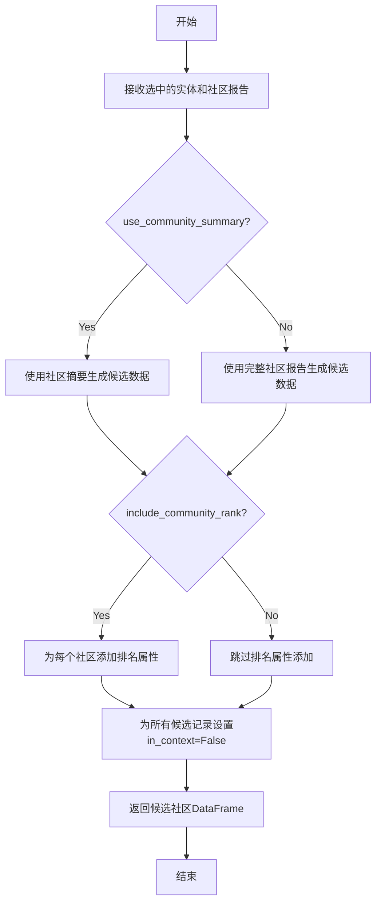

#### 带注释源码

```
# 该函数定义位于 graphrag/query/input/retrieval/community_reports.py
# 以下为基于调用方式的推断实现

def get_candidate_communities(
    selected_entities: list[Entity],
    community_reports: list[CommunityReport],
    use_community_summary: bool = False,
    include_community_rank: bool = False,
) -> pd.DataFrame:
    """
    获取候选社区数据。
    
    该函数用于在return_candidate_context=True时，返回所有未被包含在当前上下文窗口中的
    社区候选记录，并添加in_context字段标识该记录是否已被包含在上下文窗口中。
    
    参数:
        selected_entities: 用户查询通过向量匹配映射选中的实体列表
        community_reports: 所有可用的社区报告列表
        use_community_summary: 是否使用社区摘要（短文本）而非完整社区报告
        include_community_rank: 是否在返回数据中包含社区排名属性
    
    返回:
        包含所有候选社区的DataFrame，包含in_context字段标识上下文包含状态
    """
    # 1. 收集所有实体所属的社区ID
    community_ids = set()
    for entity in selected_entities:
        if entity.community_ids:
            community_ids.update(entity.community_ids)
    
    # 2. 根据use_community_summary决定使用摘要还是完整报告
    if use_community_summary:
        records = [
            {
                "id": report.community_id,
                "summary": report.summary,
                "rank": report.rank if include_community_rank else None,
            }
            for report in community_reports
        ]
    else:
        records = [
            {
                "id": report.community_id,
                "content": report.content,
                "rank": report.rank if include_community_rank else None,
            }
            for report in community_reports
        ]
    
    # 3. 创建DataFrame并设置所有记录的in_context为False
    # 后续在build_community_context中会根据实际包含情况更新此字段
    df = pd.DataFrame(records)
    df["in_context"] = False
    
    return df
```


### `get_candidate_text_units`

获取候选文本单元函数，用于根据选中的实体从所有文本单元中检索相关的候选文本单元，以便在构建上下文时标记哪些文本单元被包含在最终上下文中。

参数：

- `selected_entities`：`list[Entity]`，用户查询所映射选中的实体列表，用于筛选与这些实体相关的文本单元
- `text_units`：`list[TextUnit]` | None，所有可用的文本单元列表，作为候选文本单元的来源池

返回值：`pd.DataFrame`，包含候选文本单元的数据框，每条记录代表一个文本单元，并额外包含 `in_context` 字段用于标记该文本单元是否被包含在最终构建的上下文窗口中

#### 流程图

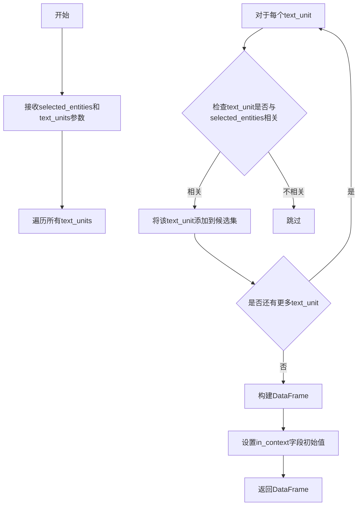

#### 带注释源码

```
# 该函数定义在 graphrag/query/input.retrieval.text_units 模块中
# 以下为调用处的源码展示

# 在 LocalSearchMixedContext._build_text_unit_context 方法中调用
candidate_context_data = get_candidate_text_units(
    selected_entities=selected_entities,
    text_units=list(self.text_units.values()),
)

# 参数说明：
# - selected_entities: 从查询中映射并筛选出的实体列表
# - text_units: 所有可用的TextUnit对象列表

# 返回值使用示例：
context_key = context_name.lower()
if context_key not in context_data:
    candidate_context_data["in_context"] = False
    context_data[context_key] = candidate_context_data
else:
    # 如果已有上下文数据，比较id列来确定哪些候选单元被包含在上下文中
    if "id" in candidate_context_data.columns and "id" in context_data[context_key].columns:
        candidate_context_data["in_context"] = candidate_context_data[
            "id"
        ].isin(context_data[context_key]["id"])
        context_data[context_key] = candidate_context_data
    else:
        context_data[context_key]["in_context"] = True
```

**注意**：由于该函数定义在外部模块 (`graphrag.query.input.retrieval.text_units`) 中，本代码文件中仅包含导入和调用语句，未展示其完整实现源码。该函数的主要作用是在返回候选上下文时提供完整的候选集，并附带 `in_context` 标记字段，以便调用方了解哪些候选项被实际包含在有限的上下文窗口中。


我需要分析代码以提取 `count_relationships` 函数的信息。让我仔细查看代码...

从代码中可以看到，`count_relationships` 是从 `graphrag.query.context_builder.source_context` 模块导入的，但在当前提供的代码中并没有包含该函数的实际实现。只有在 `LocalSearchMixedContext` 类的 `_build_text_unit_context` 方法中对该函数的调用：

```python
num_relationships = count_relationships(
    entity_relationships, selected_unit
)
```

让我检查是否有更多上下文...

根据代码分析：

### `count_relationships`

统计关系数量，根据调用上下文，该函数用于计算与文本单元（TextUnit）相关联的关系数量。

参数：

-  `entity_relationships`：`list[Relationship]`，与实体相关的关系列表
-  `selected_unit`：`TextUnit`，文本单元对象

返回值：`int`，返回与该文本单元相关的关系数量

#### 流程图

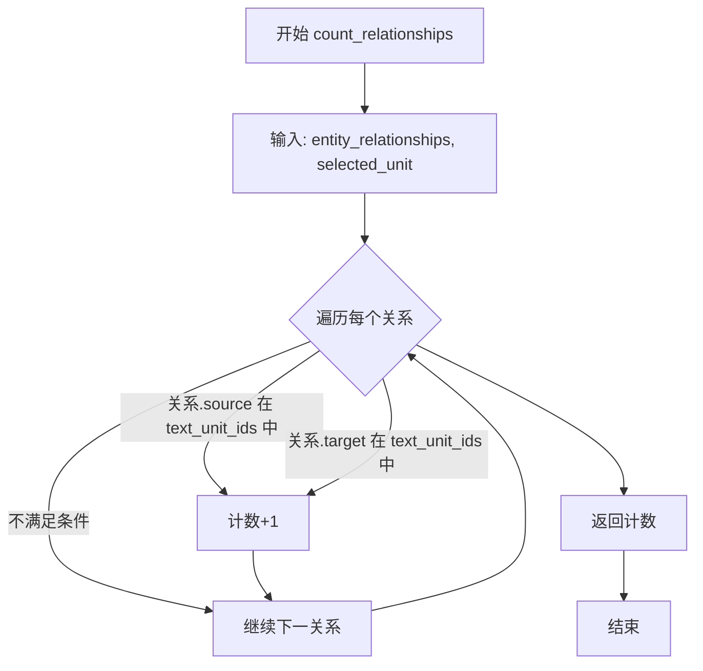

#### 带注释源码

由于源代码未在提供的代码中包含，以下是根据调用方式和类型注解推断的函数签名和功能：

```python
# 位置: graphrag/query/context_builder/source_context.py
# 从代码中的调用推断:
# num_relationships = count_relationships(entity_relationships, selected_unit)

from typing import TYPE_CHECKING

from graphrag.data_model.relationship import Relationship
from graphrag.data_model.text_unit import TextUnit

def count_relationships(
    relationships: list[Relationship],  # 关系列表
    text_unit: TextUnit  # 文本单元
) -> int:
    """
    统计与给定文本单元相关联的关系数量。
    
    通过检查每个关系的source和target是否存在于文本单元的text_unit_ids中来计算。
    
    参数:
        relationships: 关系列表，通常是某个实体的所有关系
        text_unit: 文本单元对象，包含text_unit_ids属性
    
    返回值:
        整数，表示与该文本单元相关的关系数量
    """
    count = 0
    if text_unit.text_unit_ids is None:
        return 0
    
    for rel in relationships:
        # 检查关系的源或目标是否在此文本单元中
        if rel.source_id in text_unit.text_unit_ids or rel.target_id in text_unit.text_unit_ids:
            count += 1
    
    return count
```

> **注意**: 由于 `count_relationships` 函数的实际源代码未包含在提供的代码片段中，以上信息是基于：
> 1. 函数被导入的位置（`graphrag.query.context_builder.source_context`）
> 2. 函数被调用的上下文（`_build_text_unit_context` 方法）
> 3. 传入的参数类型（`Relationship` 列表和 `TextUnit`）
> 
> 如需获取完整的函数实现，建议查看 `graphrag/query/context_builder/source_context.py` 源文件。


### `get_tokenizer`

获取分词器实例，返回一个全局的或默认的 Tokenizer 对象，供 LocalSearchMixedContext 在构建上下文时对文本进行编码和分词。

参数：

- 该函数无参数

返回值：`Tokenizer`，返回分词器实例，用于对文本进行分词和编码

#### 流程图

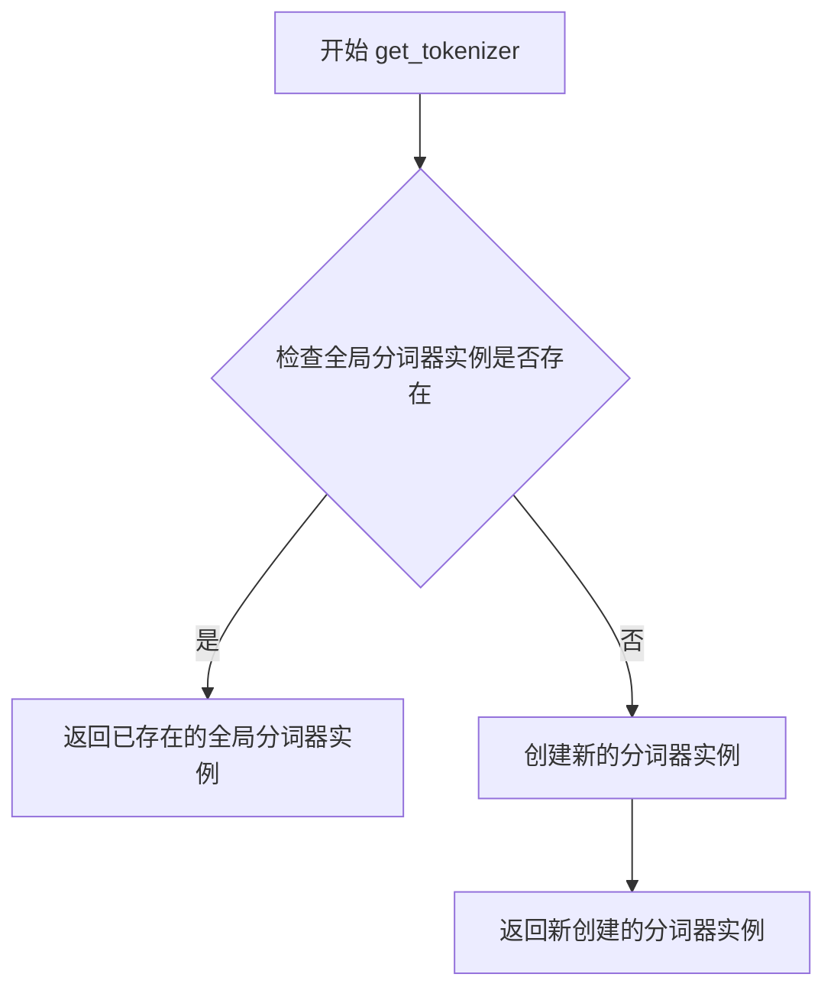

#### 带注释源码

```
# 注：以下为推断源码，基于代码导入语句和使用方式
# 实际实现位于 graphrag/tokenizer/get_tokenizer.py 模块中

from graphrag_llm.tokenizer import Tokenizer

# 全局变量用于缓存分词器实例
_tokenizer_instance = None

def get_tokenizer() -> Tokenizer:
    """
    获取分词器实例。
    
    如果已存在缓存的分词器实例，则直接返回；
    否则创建新的分词器实例并缓存返回。
    
    Returns:
        Tokenizer: 分词器实例，用于文本编码和分词
    """
    global _tokenizer_instance
    
    if _tokenizer_instance is None:
        # 创建默认分词器实例
        # 具体实现可能涉及加载配置、初始化词表等
        _tokenizer_instance = Tokenizer()
    
    return _tokenizer_instance
```

> **注意**：由于 `get_tokenizer` 函数的具体实现源码未在当前代码文件中提供，以上源码为基于代码导入方式和使用模式的合理推断。实际实现可能包含更多细节，如配置加载、缓存策略、错误处理等。建议查阅 `graphrag/tokenizer/get_tokenizer.py` 文件获取完整实现。


### LocalSearchMixedContext.__init__

构造函数，初始化LocalSearchMixedContext类的所有属性，将输入的实体、文本单元、社区报告、关系和协变量等数据转换为字典形式以便快速查询，并配置文本嵌入器和分词器。

参数：

- `self`：隐式参数，LocalSearchMixedContext实例本身
- `entities`：`list[Entity]`，实体列表，用于构建本地搜索提示的上下文数据
- `entity_text_embeddings`：`VectorStore`，实体文本嵌入向量存储，用于将用户查询映射到相关实体
- `text_embedder`：`LLMEmbedding`，文本嵌入器，用于生成查询的向量表示
- `text_units`：`list[TextUnit] | None = None`，文本单元列表，可选，默认为空列表
- `community_reports`：`list[CommunityReport] | None = None`，社区报告列表，可选，默认为空列表
- `relationships`：`list[Relationship] | None = None`，关系列表，可选，默认为空列表
- `covariates`：`dict[str, list[Covariate]] | None = None`，协变量字典，可选，默认为空字典
- `tokenizer`：`Tokenizer | None = None`，分词器，可选，默认为通过get_tokenizer()获取
- `embedding_vectorstore_key`：`str = EntityVectorStoreKey.ID`，嵌入向量存储键，默认为实体ID

返回值：`None`，该方法不返回任何值，仅初始化实例属性

#### 流程图

```mermaid
flowchart TD
    A[开始 __init__] --> B{检查 community_reports 是否为 None}
    B -->|是| C[community_reports = []]
    B -->|否| D{检查 relationships 是否为 None}
    C --> D
    D -->|是| E[relationships = []]
    D -->|否| F{检查 covariates 是否为 None}
    E --> F
    F -->|是| G[covariates = {}]
    F -->|否| H{检查 text_units 是否为 None}
    G --> H
    H -->|是| I[text_units = []]
    H -->|否| J[将 entities 转换为字典: {entity.id: entity}]
    I --> J
    J --> K[将 community_reports 转换为字典: {community.community_id: community}]
    K --> L[将 text_units 转换为字典: {unit.id: unit}]
    L --> M[将 relationships 转换为字典: {relationship.id: relationship}]
    M --> N[设置 self.covariates = covariates]
    N --> O[设置 self.entity_text_embeddings = entity_text_embeddings]
    O --> P[设置 self.text_embedder = text_embedder]
    P --> Q{检查 tokenizer 是否为 None}
    Q -->|是| R[tokenizer = get_tokenizer()]
    Q -->|否| S[使用传入的 tokenizer]
    R --> T[设置 self.tokenizer]
    S --> T
    T --> U[设置 self.embedding_vectorstore_key]
    U --> V[结束 __init__]
```

#### 带注释源码

```python
def __init__(
    self,
    entities: list[Entity],
    entity_text_embeddings: VectorStore,
    text_embedder: "LLMEmbedding",
    text_units: list[TextUnit] | None = None,
    community_reports: list[CommunityReport] | None = None,
    relationships: list[Relationship] | None = None,
    covariates: dict[str, list[Covariate]] | None = None,
    tokenizer: Tokenizer | None = None,
    embedding_vectorstore_key: str = EntityVectorStoreKey.ID,
):
    # 如果未提供社区报告，初始化为空列表
    if community_reports is None:
        community_reports = []
    # 如果未提供关系，初始化为空列表
    if relationships is None:
        relationships = []
    # 如果未提供协变量，初始化为空字典
    if covariates is None:
        covariates = {}
    # 如果未提供文本单元，初始化为空列表
    if text_units is None:
        text_units = []
    
    # 将实体列表转换为字典，以实体ID为键，便于后续快速查找
    self.entities = {entity.id: entity for entity in entities}
    # 将社区报告转换为字典，以社区ID为键
    self.community_reports = {
        community.community_id: community for community in community_reports
    }
    # 将文本单元转换为字典，以文本单元ID为键
    self.text_units = {unit.id: unit for unit in text_units}
    # 将关系列表转换为字典，以关系ID为键
    self.relationships = {
        relationship.id: relationship for relationship in relationships
    }
    # 存储协变量字典
    self.covariates = covariates
    # 存储实体文本嵌入向量存储
    self.entity_text_embeddings = entity_text_embeddings
    # 存储文本嵌入器
    self.text_embedder = text_embedder
    # 如果未提供分词器，则获取默认分词器
    self.tokenizer = tokenizer or get_tokenizer()
    # 存储嵌入向量存储键，默认为实体ID
    self.embedding_vectorstore_key = embedding_vectorstore_key
```


### `LocalSearchMixedContext.build_context`

构建本地搜索提示的上下文数据，通过结合社区报告、实体/关系/协变量表和文本单元，并使用 summary_prop 设置的预定义比例来构建上下文。

参数：

- `query`：`str`，用户查询字符串
- `conversation_history`：`ConversationHistory | None`，对话历史记录（可选）
- `include_entity_names`：`list[str] | None`，要包含的实体名称列表（可选）
- `exclude_entity_names`：`list[str] | None`，要排除的实体名称列表（可选）
- `conversation_history_max_turns`：`int | None`，对话历史最大轮数（默认5）
- `conversation_history_user_turns_only`：`bool`，是否仅包含用户轮次（默认True）
- `max_context_tokens`：`int`，最大上下文token数（默认8000）
- `text_unit_prop`：`float`，文本单元比例（默认0.5）
- `community_prop`：`float`，社区报告比例（默认0.25）
- `top_k_mapped_entities`：`int`，映射的top K实体数（默认10）
- `top_k_relationships`：`int`，top K关系数（默认10）
- `include_community_rank`：`bool`，是否包含社区排名（默认False）
- `include_entity_rank`：`bool`，是否包含实体排名（默认False）
- `rank_description`：`str`，排名描述（默认"number of relationships"）
- `include_relationship_weight`：`bool`，是否包含关系权重（默认False）
- `relationship_ranking_attribute`：`str`，关系排名属性（默认"rank"）
- `return_candidate_context`：`bool`，是否返回候选上下文（默认False）
- `use_community_summary`：`bool`，是否使用社区摘要（默认False）
- `min_community_rank`：`int`，最小社区排名（默认0）
- `community_context_name`：`str`，社区上下文名称（默认"Reports"）
- `column_delimiter`：`str`，列分隔符（默认"|"）
- `**kwargs`：`dict[str, Any]`，其他关键字参数

返回值：`ContextBuilderResult`，包含 context_chunks（上下文块字符串）和 context_records（上下文数据字典）

#### 流程图

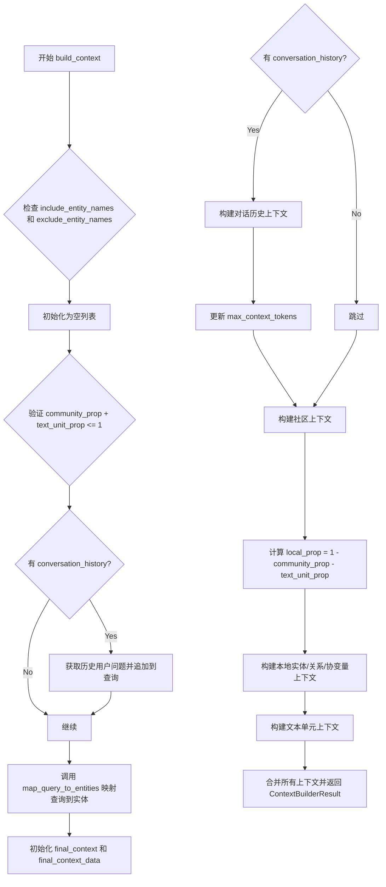

#### 带注释源码

```python
def build_context(
    self,
    query: str,
    conversation_history: ConversationHistory | None = None,
    include_entity_names: list[str] | None = None,
    exclude_entity_names: list[str] | None = None,
    conversation_history_max_turns: int | None = 5,
    conversation_history_user_turns_only: bool = True,
    max_context_tokens: int = 8000,
    text_unit_prop: float = 0.5,
    community_prop: float = 0.25,
    top_k_mapped_entities: int = 10,
    top_k_relationships: int = 10,
    include_community_rank: bool = False,
    include_entity_rank: bool = False,
    rank_description: str = "number of relationships",
    include_relationship_weight: bool = False,
    relationship_ranking_attribute: str = "rank",
    return_candidate_context: bool = False,
    use_community_summary: bool = False,
    min_community_rank: int = 0,
    community_context_name: str = "Reports",
    column_delimiter: str = "|",
    **kwargs: dict[str, Any],
) -> ContextBuilderResult:
    """
    Build data context for local search prompt.

    Build a context by combining community reports and entity/relationship/covariate tables, 
    and text units using a predefined ratio set by summary_prop.
    """
    # 初始化 include_entity_names 和 exclude_entity_names 为空列表
    if include_entity_names is None:
        include_entity_names = []
    if exclude_entity_names is None:
        exclude_entity_names = []
    
    # 验证比例总和不超过1
    if community_prop + text_unit_prop > 1:
        value_error = (
            "The sum of community_prop and text_unit_prop should not exceed 1."
        )
        raise ValueError(value_error)

    # 如果有对话历史，将之前的用户问题附加到当前查询
    if conversation_history:
        pre_user_questions = "\n".join(
            conversation_history.get_user_turns(conversation_history_max_turns)
        )
        query = f"{query}\n{pre_user_questions}"

    # 将用户查询映射到实体
    selected_entities = map_query_to_entities(
        query=query,
        text_embedding_vectorstore=self.entity_text_embeddings,
        text_embedder=self.text_embedder,
        all_entities_dict=self.entities,
        embedding_vectorstore_key=self.embedding_vectorstore_key,
        include_entity_names=include_entity_names,
        exclude_entity_names=exclude_entity_names,
        k=top_k_mapped_entities,
        oversample_scaler=2,
    )

    # 初始化最终上下文列表和数据字典
    final_context = list[str]()
    final_context_data = dict[str, pd.DataFrame]()

    # 构建对话历史上下文
    if conversation_history:
        (
            conversation_history_context,
            conversation_history_context_data,
        ) = conversation_history.build_context(
            include_user_turns_only=conversation_history_user_turns_only,
            max_qa_turns=conversation_history_max_turns,
            column_delimiter=column_delimiter,
            max_context_tokens=max_context_tokens,
            recency_bias=False,
        )
        if conversation_history_context.strip() != "":
            final_context.append(conversation_history_context)
            final_context_data = conversation_history_context_data
            # 减去对话历史占用的token数
            max_context_tokens = max_context_tokens - len(
                self.tokenizer.encode(conversation_history_context)
            )

    # 构建社区上下文
    community_tokens = max(int(max_context_tokens * community_prop), 0)
    community_context, community_context_data = self._build_community_context(
        selected_entities=selected_entities,
        max_context_tokens=community_tokens,
        use_community_summary=use_community_summary,
        column_delimiter=column_delimiter,
        include_community_rank=include_community_rank,
        min_community_rank=min_community_rank,
        return_candidate_context=return_candidate_context,
        context_name=community_context_name,
    )
    if community_context.strip() != "":
        final_context.append(community_context)
        final_context_data = {**final_context_data, **community_context_data}

    # 构建本地（实体-关系-协变量）上下文
    local_prop = 1 - community_prop - text_unit_prop
    local_tokens = max(int(max_context_tokens * local_prop), 0)
    local_context, local_context_data = self._build_local_context(
        selected_entities=selected_entities,
        max_context_tokens=local_tokens,
        include_entity_rank=include_entity_rank,
        rank_description=rank_description,
        include_relationship_weight=include_relationship_weight,
        top_k_relationships=top_k_relationships,
        relationship_ranking_attribute=relationship_ranking_attribute,
        return_candidate_context=return_candidate_context,
        column_delimiter=column_delimiter,
    )
    if local_context.strip() != "":
        final_context.append(str(local_context))
        final_context_data = {**final_context_data, **local_context_data}

    # 构建文本单元上下文
    text_unit_tokens = max(int(max_context_tokens * text_unit_prop), 0)
    text_unit_context, text_unit_context_data = self._build_text_unit_context(
        selected_entities=selected_entities,
        max_context_tokens=text_unit_tokens,
        return_candidate_context=return_candidate_context,
    )

    if text_unit_context.strip() != "":
        final_context.append(text_unit_context)
        final_context_data = {**final_context_data, **text_unit_context_data}

    # 返回构建好的上下文结果
    return ContextBuilderResult(
        context_chunks="\n\n".join(final_context),
        context_records=final_context_data,
    )
```


### `LocalSearchMixedContext._build_community_context`

构建社区上下文，用于将社区报告数据添加到本地搜索提示的上下文窗口中，直到达到最大 token 限制。

参数：

- `selected_entities`：`list[Entity]`，"LocalSearchMixedContext" 类在 "build_context" 方法中筛选出的与查询相关的实体列表，用于确定需要包含哪些社区报告
- `max_context_tokens`：`int = 4000`，分配给社区报告上下文的最大 token 数量
- `use_community_summary`：`bool = False`，是否使用社区摘要而非完整报告
- `column_delimiter`：`str = "|"`，用于分隔列的分隔符
- `include_community_rank`：`bool = False`，是否在输出中包含社区排名信息
- `min_community_rank`：`int = 0`，最小社区排名阈值，排名低于此值的社区将被过滤
- `return_candidate_context`：`bool = False`，是否返回所有候选社区数据（包括未纳入上下文的），并在数据中标记 "in_context" 字段
- `context_name`：`str = "Reports"`，"Reports" 或其他自定义名称，用于上下文数据中的键名

返回值：`tuple[str, dict[str, pd.DataFrame]]`，返回包含社区报告文本内容的字符串，以及一个字典，其中键为上下文名称（默认为 "reports"），值为包含社区数据的 pandas DataFrame

#### 流程图

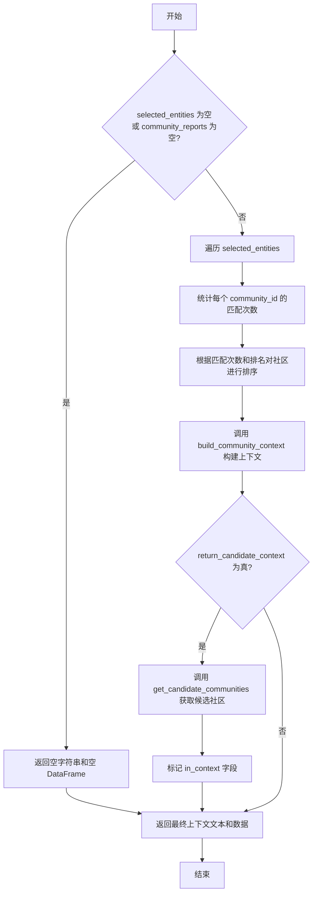

#### 带注释源码

```python
def _build_community_context(
    self,
    selected_entities: list[Entity],
    max_context_tokens: int = 4000,
    use_community_summary: bool = False,
    column_delimiter: str = "|",
    include_community_rank: bool = False,
    min_community_rank: int = 0,
    return_candidate_context: bool = False,
    context_name: str = "Reports",
) -> tuple[str, dict[str, pd.DataFrame]]:
    """Add community data to the context window until it hits the max_context_tokens limit."""
    # 如果没有选中的实体或没有社区报告，直接返回空结果
    if len(selected_entities) == 0 or len(self.community_reports) == 0:
        return ("", {context_name.lower(): pd.DataFrame()})

    # 初始化社区匹配计数器
    community_matches = {}
    
    # 遍历所有选中的实体，统计每个社区被多少实体引用
    for entity in selected_entities:
        # increase count of the community that this entity belongs to
        if entity.community_ids:
            for community_id in entity.community_ids:
                community_matches[community_id] = (
                    community_matches.get(community_id, 0) + 1
                )

    # sort communities by number of matched entities and rank
    # 从社区匹配字典中获取有匹配的社区报告
    selected_communities = [
        self.community_reports[community_id]
        for community_id in community_matches
        if community_id in self.community_reports
    ]
    
    # 为每个社区临时添加匹配数量属性用于排序
    for community in selected_communities:
        if community.attributes is None:
            community.attributes = {}
        community.attributes["matches"] = community_matches[community.community_id]
    
    # 根据匹配数量和排名降序排序
    selected_communities.sort(
        key=lambda x: (x.attributes["matches"], x.rank),  # type: ignore
        reverse=True,  # type: ignore
    )
    
    # 排序完成后删除临时添加的匹配属性
    for community in selected_communities:
        del community.attributes["matches"]  # type: ignore

    # 调用外部函数 build_community_context 构建社区上下文
    context_text, context_data = build_community_context(
        community_reports=selected_communities,
        tokenizer=self.tokenizer,
        use_community_summary=use_community_summary,
        column_delimiter=column_delimiter,
        shuffle_data=False,
        include_community_rank=include_community_rank,
        min_community_rank=min_community_rank,
        max_context_tokens=max_context_tokens,
        single_batch=True,
        context_name=context_name,
    )
    
    # 处理返回值可能是列表的情况
    if isinstance(context_text, list) and len(context_text) > 0:
        context_text = "\n\n".join(context_text)

    # 如果需要返回候选上下文数据
    if return_candidate_context:
        # 获取所有候选社区（不仅限于已纳入上下文的）
        candidate_context_data = get_candidate_communities(
            selected_entities=selected_entities,
            community_reports=list(self.community_reports.values()),
            use_community_summary=use_community_summary,
            include_community_rank=include_community_rank,
        )
        context_key = context_name.lower()
        
        # 如果上下文数据中没有该键，添加候选数据并标记为不在上下文中
        if context_key not in context_data:
            context_data[context_key] = candidate_context_data
            context_data[context_key]["in_context"] = False
        else:
            # 如果两边都有 id 列，标记哪些在上下文中
            if (
                "id" in candidate_context_data.columns
                and "id" in context_data[context_key].columns
            ):
                candidate_context_data["in_context"] = candidate_context_data[
                    "id"
                ].isin(  # cspell:disable-line
                    context_data[context_key]["id"]
                )
                context_data[context_key] = candidate_context_data
            else:
                # 否则标记所有为在上下文中
                context_data[context_key]["in_context"] = True
    
    # 返回最终结果：上下文文本字符串和数据字典
    return (str(context_text), context_data)
```


### `LocalSearchMixedContext._build_text_unit_context`

该方法用于对匹配的文本单元进行排名，并将它们添加到上下文窗口中，直到达到 `max_context_tokens` 限制。它首先遍历选中的实体，收集关联的文本单元及其关系计数，然后按实体顺序和关系数量降序排序，最后调用 `build_text_unit_context` 构建上下文，并可选地返回候选上下文数据。

参数：

- `selected_entities`：`list[Entity]`，需要构建上下文的实体列表
- `max_context_tokens`：`int`，最大上下文令牌数，默认为 8000
- `return_candidate_context`：`bool`，是否返回候选上下文数据，默认为 False
- `column_delimiter`：`str`，列分隔符，默认为 "|"
- `context_name`：`str`，上下文名称，默认为 "Sources"

返回值：`tuple[str, dict[str, pd.DataFrame]]`，返回包含上下文文本和上下文数据的元组，上下文数据为 DataFrame 字典

#### 流程图

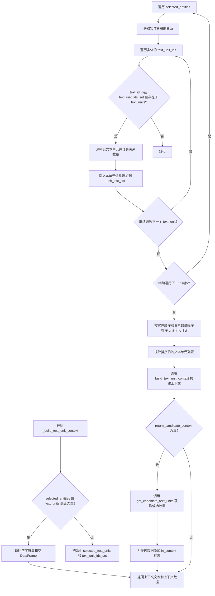

#### 带注释源码

```python
def _build_text_unit_context(
    self,
    selected_entities: list[Entity],
    max_context_tokens: int = 8000,
    return_candidate_context: bool = False,
    column_delimiter: str = "|",
    context_name: str = "Sources",
) -> tuple[str, dict[str, pd.DataFrame]]:
    """Rank matching text units and add them to the context window until it hits the max_context_tokens limit."""
    # 如果没有选中实体或文本单元，则返回空结果
    if not selected_entities or not self.text_units:
        return ("", {context_name.lower(): pd.DataFrame()})
    
    selected_text_units = []  # 存储最终选中的文本单元
    text_unit_ids_set = set()  # 用于去重的文本单元ID集合

    unit_info_list = []  # 存储文本单元及其相关信息
    relationship_values = list(self.relationships.values())  # 获取所有关系

    # 遍历每个选中的实体
    for index, entity in enumerate(selected_entities):
        # 获取与当前实体相关的所有关系
        entity_relationships = [
            rel
            for rel in relationship_values
            if rel.source == entity.title or rel.target == entity.title
        ]

        # 遍历实体关联的文本单元ID
        for text_id in entity.text_unit_ids or []:
            # 如果文本单元未被处理且存在于文本单元字典中
            if text_id not in text_unit_ids_set and text_id in self.text_units:
                # 深拷贝文本单元以避免修改原始数据
                selected_unit = deepcopy(self.text_units[text_id])
                # 计算该文本单元关联的关系数量
                num_relationships = count_relationships(
                    entity_relationships, selected_unit
                )
                text_unit_ids_set.add(text_id)
                # 保存文本单元、实体索引和关系数量
                unit_info_list.append((selected_unit, index, num_relationships))

    # 按实体顺序（升序）和关系数量（降序）排序
    unit_info_list.sort(key=lambda x: (x[1], -x[2]))

    # 提取排序后的文本单元列表
    selected_text_units = [unit[0] for unit in unit_info_list]

    # 调用 build_text_unit_context 构建上下文文本和数据
    context_text, context_data = build_text_unit_context(
        text_units=selected_text_units,
        tokenizer=self.tokenizer,
        max_context_tokens=max_context_tokens,
        shuffle_data=False,
        context_name=context_name,
        column_delimiter=column_delimiter,
    )

    # 如果需要返回候选上下文数据
    if return_candidate_context:
        # 获取候选文本单元
        candidate_context_data = get_candidate_text_units(
            selected_entities=selected_entities,
            text_units=list(self.text_units.values()),
        )
        context_key = context_name.lower()
        
        # 如果上下文数据中不存在该键
        if context_key not in context_data:
            candidate_context_data["in_context"] = False
            context_data[context_key] = candidate_context_data
        else:
            # 检查是否存在 id 列
            if (
                "id" in candidate_context_data.columns
                and "id" in context_data[context_key].columns
            ):
                # 标记哪些候选数据在上下文中
                candidate_context_data["in_context"] = candidate_context_data[
                    "id"
                ].isin(context_data[context_key]["id"])
                context_data[context_key] = candidate_context_data
            else:
                context_data[context_key]["in_context"] = True

    # 返回上下文文本和上下文数据
    return (str(context_text), context_data)
```


### `LocalSearchMixedContext._build_local_context`

构建实体/关系/协变量本地上下文，用于本地搜索提示。该方法通过逐步迭代的方式，将选中的实体及其关联的关系和协变量数据添加到上下文窗口中，直到达到 token 数量限制，并返回组合后的上下文文本和对应的数据记录。

参数：

- `selected_entities`：`list[Entity]`，用户查询映射到的选中实体列表
- `max_context_tokens`：`int`，最大上下文 token 数量限制，默认 8000
- `include_entity_rank`：`bool`，是否在实体上下文中包含排名信息，默认 False
- `rank_description`：`str`，排名描述文本，用于说明排名的依据，默认 "relationship count"
- `include_relationship_weight`：`bool`，是否在关系上下文中包含权重信息，默认 False
- `top_k_relationships`：`int`，每个实体最多包含的关系数量，默认 10
- `relationship_ranking_attribute`：`str`，关系排序使用的属性名，默认 "rank"
- `return_candidate_context`：`bool`，是否返回候选上下文数据（包含未放入上下文的候选项），默认 False
- `column_delimiter`：`str`，列分隔符，用于格式化输出，默认 "|"

返回值：`tuple[str, dict[str, pd.DataFrame]]`，返回包含上下文文本字符串和上下文数据字典的元组。字典的键包括 "entities"、"relationships" 以及协变量名称（转小写），值均为 pandas DataFrame。

#### 流程图

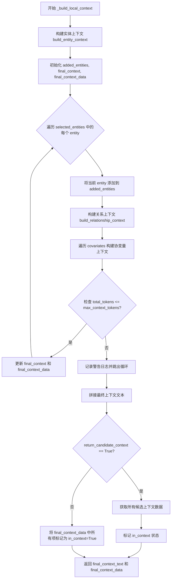

#### 带注释源码

```python
def _build_local_context(
    self,
    selected_entities: list[Entity],
    max_context_tokens: int = 8000,
    include_entity_rank: bool = False,
    rank_description: str = "relationship count",
    include_relationship_weight: bool = False,
    top_k_relationships: int = 10,
    relationship_ranking_attribute: str = "rank",
    return_candidate_context: bool = False,
    column_delimiter: str = "|",
) -> tuple[str, dict[str, pd.DataFrame]]:
    """Build data context for local search prompt combining entity/relationship/covariate tables."""
    # 第一步：构建实体上下文
    # 调用 build_entity_context 函数为所有选中的实体生成上下文文本和 DataFrame
    entity_context, entity_context_data = build_entity_context(
        selected_entities=selected_entities,
        tokenizer=self.tokenizer,
        max_context_tokens=max_context_tokens,
        column_delimiter=column_delimiter,
        include_entity_rank=include_entity_rank,
        rank_description=rank_description,
        context_name="Entities",
    )
    # 计算实体上下文所使用的 token 数量，作为后续累加的基础
    entity_tokens = len(self.tokenizer.encode(entity_context))

    # 第二步：初始化用于累积上下文的数据结构
    added_entities = []  # 已添加到上下文的实体列表（逐步增长）
    final_context = []   # 最终的上下文文本片段列表
    final_context_data = {}  # 最终的上下文数据字典

    # 第三步：逐步迭代添加实体及其关联的关系和协变量
    # 每次迭代增加一个实体，直到达到 token 限制
    for entity in selected_entities:
        current_context = []      # 当前迭代的上下文片段
        current_context_data = {} # 当前迭代的上下文数据
        added_entities.append(entity)  # 将当前实体加入到已添加列表

        # 3.1 构建关系上下文
        # 基于当前已添加的实体列表构建关系上下文
        (
            relationship_context,
            relationship_context_data,
        ) = build_relationship_context(
            selected_entities=added_entities,
            relationships=list(self.relationships.values()),
            tokenizer=self.tokenizer,
            max_context_tokens=max_context_tokens,
            column_delimiter=column_delimiter,
            top_k_relationships=top_k_relationships,
            include_relationship_weight=include_relationship_weight,
            relationship_ranking_attribute=relationship_ranking_attribute,
            context_name="Relationships",
        )
        current_context.append(relationship_context)
        current_context_data["relationships"] = relationship_context_data
        # 累加实体上下文和关系上下文的 token 数量
        total_tokens = entity_tokens + len(
            self.tokenizer.encode(relationship_context)
        )

        # 3.2 构建协变量上下文
        # 为每种协变量类型分别构建上下文并累加 token
        for covariate in self.covariates:
            covariate_context, covariate_context_data = build_covariates_context(
                selected_entities=added_entities,
                covariates=self.covariates[covariate],
                tokenizer=self.tokenizer,
                max_context_tokens=max_context_tokens,
                column_delimiter=column_delimiter,
                context_name=covariate,
            )
            total_tokens += len(self.tokenizer.encode(covariate_context))
            current_context.append(covariate_context)
            current_context_data[covariate.lower()] = covariate_context_data

        # 3.3 检查是否超过 token 限制
        if total_tokens > max_context_tokens:
            # 如果超限，记录警告并回退到上一个状态（不添加当前实体）
            logger.warning(
                "Reached token limit - reverting to previous context state"
            )
            break

        # 3.4 如果未超限，更新最终的上下文数据
        final_context = current_context
        final_context_data = current_context_data

    # 第四步：拼接最终的上下文文本
    # 将实体上下文与关系/协变量上下文用双换行符连接
    final_context_text = entity_context + "\n\n" + "\n\n".join(final_context)
    final_context_data["entities"] = entity_context_data

    # 第五步：处理候选上下文（可选）
    # 如果需要返回候选上下文，会返回所有候选项并标记哪些被包含在最终上下文中
    if return_candidate_context:
        # 获取所有候选实体/关系/协变量（不仅仅是放入上下文的那些）
        candidate_context_data = get_candidate_context(
            selected_entities=selected_entities,
            entities=list(self.entities.values()),
            relationships=list(self.relationships.values()),
            covariates=self.covariates,
            include_entity_rank=include_entity_rank,
            entity_rank_description=rank_description,
            include_relationship_weight=include_relationship_weight,
        )
        # 为每个候选数据集标记 in_context 状态
        for key in candidate_context_data:
            candidate_df = candidate_context_data[key]
            if key not in final_context_data:
                # 该类别的数据完全不在上下文中
                final_context_data[key] = candidate_df
                final_context_data[key]["in_context"] = False
            else:
                # 检查哪些 id 在上下文中
                in_context_df = final_context_data[key]

                if "id" in in_context_df.columns and "id" in candidate_df.columns:
                    # 通过 id 匹配来标记哪些候选项被包含
                    candidate_df["in_context"] = candidate_df[
                        "id"
                    ].isin(  # cspell:disable-line
                        in_context_df["id"]
                    )
                    final_context_data[key] = candidate_df
                else:
                    # 如果没有 id 列，则全部标记为在上下文中
                    final_context_data[key]["in_context"] = True
    else:
        # 如果不需要候选上下文，将所有最终数据标记为在上下文中
        for key in final_context_data:
            final_context_data[key]["in_context"] = True

    # 返回最终的上下文文本和上下文数据
    return (final_context_text, final_context_data)
```

## 关键组件


### LocalSearchMixedContext 类

主类，负责为本地搜索提示构建上下文数据，结合社区报告、实体/关系/协变量表和文本单元。

### 实体向量映射与检索

使用 map_query_to_entities 函数，将用户查询通过向量相似度映射到最相关的实体，支持 top_k 检索和过采样。

### 社区报告上下文构建

_build_community_context 方法，根据选中实体所属社区的匹配数量和排名，构建社区报告上下文，支持 token 预算限制和候选上下文返回。

### 文本单元（来源）上下文构建

_build_text_unit_context 方法，排序并选择与选中实体关联的文本单元，按实体顺序和关系数量降序排列，支持来源上下文构建。

### 本地上下文构建（实体-关系-协变量）

_build_local_context 方法，逐步添加实体及其关联的元数据（关系、协变量）直到达到 token 上限，支持动态 token 管理和候选数据标记。

### 对话历史处理

在 build_context 中集成对话历史，将历史用户问题附加到当前查询，支持用户轮次过滤和最大轮次控制。

### Token 预算分配策略

通过 community_prop、text_unit_prop 和 local_prop 比例分配总 token 预算，分别用于社区报告、文本单元和本地上下文。

### 候选上下文标记机制

return_candidate_context 参数支持返回所有候选数据，并在 DataFrame 中添加 in_context 字段标记哪些记录被纳入最终上下文。

## 问题及建议


### 已知问题

-   **重复的ID列检查逻辑**：在 `_build_community_context`、`_build_text_unit_context` 和 `_build_local_context` 方法中，存在几乎相同的代码片段来检查 `"id"` 列是否存在于 DataFrame 中，并设置 `in_context` 标志。这种重复逻辑应该提取到一个共享的辅助方法中。
-   **构造函数参数过多**：`__init__` 方法接收9个参数（包括可选参数），这使得对象创建变得复杂且容易出错，违反了"构造函数参数过多"的设计原则。
-   **硬编码的魔数**：代码中存在多个硬编码的值，如 `oversample_scaler=2`、`conversation_history_max_turns` 默认值 `5`、`max_context_tokens` 默认值 `8000` 等，这些应该作为可配置参数或常量提取出来。
-   **字符串拼接效率问题**：在 `build_context` 方法中使用 `"\n\n".join(final_context)` 进行多次字符串拼接，以及在 `_build_local_context` 中使用 `+` 运算符拼接字符串，当上下文数据较大时可能导致性能问题。
-   **Token计算重复**：在多个地方调用 `self.tokenizer.encode()` 来计算 token 数量，每次都重新编码整个字符串，没有缓存已计算的 token 数量。
-   **类型注解不够精确**：某些地方使用了 `dict[str, pd.DataFrame]` 和 `list[str]` 等不够精确的类型注解，可以考虑使用 TypeAlias 定义更清晰的类型。
-   **缺乏全面的错误处理**：虽然对 `community_prop + text_unit_prop > 1` 进行了验证，但其他可能的错误情况（如 `entity_text_embeddings` 或 `text_embedder` 为 None）没有进行显式的验证。
-   **潜在的内存问题**：在 `_build_local_context` 方法中，通过循环逐个添加实体到 `added_entities` 列表并重复构建关系上下文，当实体数量较多时可能导致不必要的重复计算和内存开销。
-   **社区报告的直接修改**：在 `_build_community_context` 方法中，直接修改了 `community.attributes` 字典（添加和删除 "matches" 键），这种副作用操作可能在多线程环境下导致问题。

### 优化建议

-   **提取公共辅助方法**：将重复的 DataFrame ID 检查逻辑提取为类级别的私有方法，如 `_mark_in_context_flags()`，以减少代码重复并提高可维护性。
-   **使用构建器模式或配置对象**：考虑引入一个配置类（如 `LocalSearchContextConfig`）来封装构造函数参数，使对象创建更加清晰和安全。
-   **配置化常量**：创建一个配置类或使用配置文件来管理所有魔数和建议的可配置参数，使代码更容易调整和维护。
-   **优化字符串构建**：考虑使用 `io.StringIO` 或列表推导式结合 `join` 来更高效地构建大型字符串。
-   **添加 Token 缓存机制**：在 `build_context` 方法开始时计算初始 token 预算，并在构建各部分上下文时复用已计算的 token 数，避免重复编码。
-   **改进类型注解**：定义 TypeAlias 如 `ContextData = dict[str, pd.DataFrame]`，使类型更清晰，并考虑为复杂参数创建数据类。
-   **增强错误处理**：添加参数验证，检查关键依赖项（如 `entity_text_embeddings`、`text_embedder`）是否为 None，并提供更有意义的错误信息。
-   **优化实体迭代逻辑**：在 `_build_local_context` 中，考虑使用更高效的算法来逐步构建上下文，避免每次迭代都重新处理所有已添加的实体。
-   **避免副作用**：在 `_build_community_context` 中，使用深拷贝或创建新的属性字典，而不是直接修改传入的 `community` 对象。
-   **添加日志记录**：在关键分支点添加更详细的日志记录，特别是在"达到 token 限制"等情况下，帮助调试和监控上下文构建过程。

## 其它


### 设计目标与约束

**设计目标**：
- 为本地搜索（Local Search）提示构建丰富的上下文数据，整合社区报告、实体、关系、协变量和文本单元
- 支持基于token预算的上下文分配，通过community_prop和text_unit_prop参数控制各部分比例
- 支持对话历史集成，允许将历史用户问题附加到当前查询
- 支持实体名称的包含/排除过滤
- 支持候选上下文返回，用于展示未被选中但相关的候选内容

**设计约束**：
- community_prop + text_unit_prop <= 1（确保留给本地上下文的比例不为负）
- token预算软限制，实际可能略微超出
- 依赖外部VectorStore进行实体embedding相似度搜索
- 需要预训练的tokenizer进行token计数

### 错误处理与异常设计

**显式异常**：
- **ValueError**: 当`community_prop + text_unit_prop > 1`时抛出，错误信息为"The sum of community_prop and text_unit_prop should not exceed 1."

**隐式错误处理**：
- 使用`logger.warning`记录token超限情况："Reached token limit - reverting to previous context state"
- 对空列表/字典进行默认初始化处理（社区报告、关系、协变量、文本单元）
- 对不存在的community_id进行安全检查后才访问
- 使用`isinstance`检查返回类型，处理list和str两种情况

**边界情况处理**：
- `selected_entities`为空时返回空上下文
- `community_reports`为空时返回空社区上下文
- `text_units`为空时返回空文本单元上下文
- `conversation_history`为空或为空字符串时不添加历史上下文

### 数据流与状态机

**主要数据流**：
1. **输入阶段**：接收query、conversation_history、include/exclude_entity_names等参数
2. **实体映射阶段**：调用`map_query_to_entities`将query映射到top_k相关实体
3. **上下文构建阶段**（可并行/顺序执行）：
   - 对话历史上下文构建
   - 社区报告上下文构建
   - 本地实体/关系/协变量上下文构建
   - 文本单元上下文构建
4. **输出阶段**：合并所有上下文字符串和DataFrame数据，返回`ContextBuilderResult`

**状态转换**：
- `selected_entities`从空列表 -> 映射后的实体列表
- `final_context`从空列表 -> 累积的上下文字符串列表
- `final_context_data`从空字典 -> 累积的DataFrame字典

### 外部依赖与接口契约

**核心依赖**：
- `graphrag_llm.tokenizer.Tokenizer`: Token计数工具
- `graphrag_vectors.VectorStore`: 向量存储，用于实体embedding搜索
- `graphrag.query.context_builder.builders.ContextBuilderResult`: 上下文构建结果数据结构
- `graphrag.query.context_builder.community_context.build_community_context`: 社区上下文构建函数
- `graphrag.query.context_builder.entity_extraction.map_query_to_entities`: 查询到实体的映射函数
- `graphrag.query.context_builder.local_context.*`: 本地上下文构建相关函数
- `graphrag.query.input.retrieval.*`: 候选数据检索函数

**接口契约**：
- `LocalContextBuilder`抽象基类定义了`build_context`接口
- 输入query类型为`str`，conversation_history类型为`ConversationHistory | None`
- 返回`ContextBuilderResult`，包含`context_chunks`（str）和`context_records`（dict[str, pd.DataFrame]）
- Entity需包含`id`、`title`、`community_ids`、`text_unit_ids`等字段
- CommunityReport需包含`community_id`、`rank`、`attributes`字段

### 性能考虑

**Token计算优化**：
- 使用`tokenizer.encode`进行token计数，避免重复编码
- 在循环中累积token计数，提前终止超出预算的上下文构建
- `oversample_sampler=2`在实体映射时预留缓冲空间

**数据结构优化**：
- 使用字典（dict）存储entities、community_reports、text_units、relationships，提供O(1)查找性能
- 使用`set`存储text_unit_ids_set，避免重复添加
- 使用`deepcopy`保护原始TextUnit数据不被修改

**算法复杂度**：
- 实体映射：O(n)遍历所有实体 + 向量搜索
- 社区匹配：O(m)遍历选中的实体，m为选中实体数量
- 关系匹配：O(k)遍历所有关系，k为关系总数
- 上下文构建：嵌套循环，但有token预算作为上界

### 安全性考虑

**输入验证**：
- 参数默认值处理，避免None引用
- 数值参数（max_context_tokens、top_k等）的合理性检查由调用方负责

**数据隔离**：
- 使用`deepcopy`复制text_unit对象，避免修改原始数据
- 社区报告的`attributes`字段被临时修改后恢复（删除"matches"键）

**日志安全**：
- 日志不记录敏感查询内容（仅记录warning级别的事件类型）

### 测试策略

**单元测试覆盖点**：
- `build_context`方法的参数组合测试
- 空输入边界条件测试（空entities、空community_reports等）
- token预算分配逻辑测试
- community_prop + text_unit_prop > 1的异常测试

**集成测试场景**：
- 与真实VectorStore的集成测试
- 与完整LocalSearch pipeline的集成测试

### 配置与可扩展性

**可配置参数**：
- `max_context_tokens`: 默认8000
- `text_unit_prop`: 默认0.5
- `community_prop`: 默认0.25
- `top_k_mapped_entities`: 默认10
- `top_k_relationships`: 默认10
- `conversation_history_max_turns`: 默认5
- `embedding_vectorstore_key`: 默认EntityVectorStoreKey.ID

**扩展点**：
- 支持自定义`tokenizer`
- 支持添加新的协变量类型（covariates字典的key可扩展）
- 支持自定义排名属性（relationship_ranking_attribute）
- 通过kwargs传递额外参数给下游构建函数

### 监控与日志

**日志记录**：
- 模块级logger: `logger = logging.getLogger(__name__)`
- Warning级别：token限制达到时记录
- 无Debug/Info级别日志输出

**监控指标**（可扩展）：
- 各阶段token使用量
- 选中实体数量
- 上下文构建成功率

### 版本兼容性

**Python版本**：
- 依赖类型注解（TYPE_CHECKING），需要Python 3.9+

**依赖版本约束**：
- pandas: DataFrame操作
- graphrag_llm: Tokenizer接口
- graphrag_vectors: VectorStore接口
- graphrag.query.context_builder.*: 上下文构建模块

### 资源清理

**内存管理**：
- 无显式资源清理（无文件句柄、网络连接等）
- 局部变量在函数返回后自动释放
- `deepcopy`创建的副本在函数结束后被GC回收

### 并发与线程安全

**线程安全分析**：
- 本类为无状态设计（所有状态在方法参数和局部变量中）
- 不可变共享状态（传入的entities、relationships等应由调用方保证不可变）
- 不涉及共享可变状态，无需加锁

**并发使用**：
- 每个请求应创建独立的LocalSearchMixedContext实例
- 不建议在多线程间共享实例

### 国际化/本地化

**文本处理**：
- 依赖tokenizer的编码能力，支持多语言文本
- 列分隔符（column_delimiter）默认"|"，可配置

**无国际化支持**：
- 错误信息为英文硬编码
- 无多语言消息模板

    