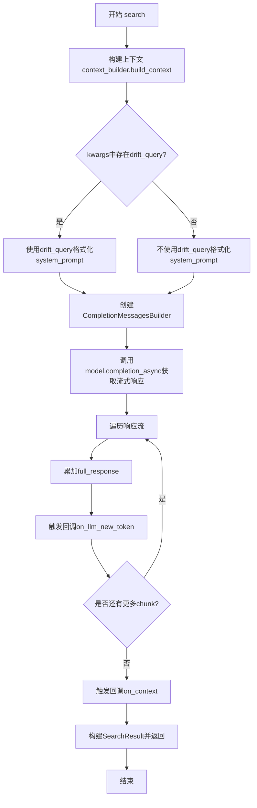
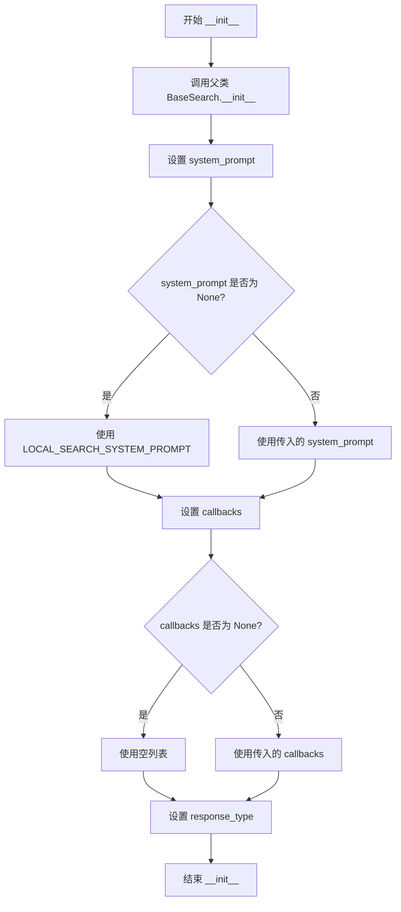
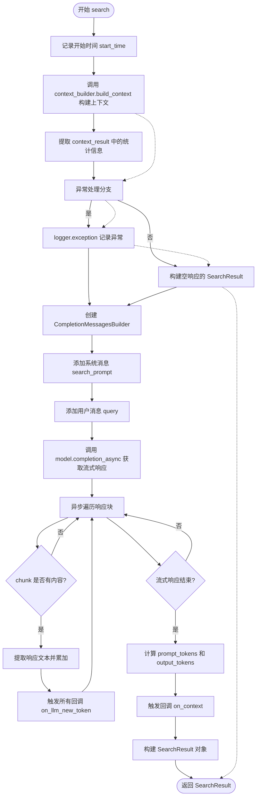
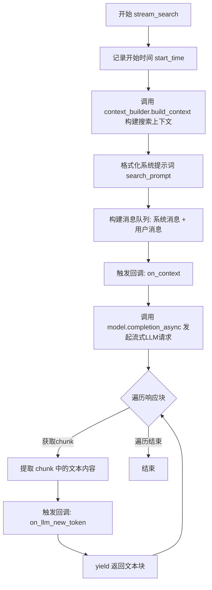

# `graphrag\packages\graphrag\graphrag\query\structured_search\local_search\search.py` 详细设计文档

LocalSearch是一个本地搜索模式的搜索编排器，通过构建适合单个上下文窗口的本地搜索上下文，并利用LLM生成用户查询的答案，支持同步搜索和流式搜索两种模式。

## 整体流程



## 类结构

```
BaseSearch (抽象基类)
└── LocalSearch (本地搜索实现)
```

## 全局变量及字段


### `logger`
    
模块级日志记录器，用于记录搜索过程中的调试和异常信息

类型：`logging.Logger`
    


### `LOCAL_SEARCH_SYSTEM_PROMPT`
    
本地搜索系统提示模板，用于构建搜索提示词

类型：`str`
    


### `LocalSearch.model`
    
LLM模型实例，用于生成搜索答案

类型：`LLMCompletion`
    


### `LocalSearch.context_builder`
    
上下文构建器，用于构建搜索上下文

类型：`LocalContextBuilder`
    


### `LocalSearch.tokenizer`
    
分词器，用于编码和解码文本

类型：`Tokenizer | None`
    


### `LocalSearch.system_prompt`
    
系统提示词，引导LLM生成符合要求的回答

类型：`str`
    


### `LocalSearch.response_type`
    
响应类型，指定生成回答的格式

类型：`str`
    


### `LocalSearch.callbacks`
    
查询回调列表，用于处理LLM生成过程的事件

类型：`list[QueryCallbacks]`
    


### `LocalSearch.model_params`
    
模型参数，包含LLM的配置选项

类型：`dict[str, Any] | None`
    


### `LocalSearch.context_builder_params`
    
上下文构建器参数，用于配置上下文构建过程

类型：`dict`
    
    

## 全局函数及方法


### `LocalSearch.__init__`

这是 LocalSearch 类的初始化方法，负责配置本地搜索所需的核心组件，包括语言模型、上下文构建器、分词器、系统提示词等，并继承父类 BaseSearch 的初始化逻辑。

参数：

- `self`：隐式参数，LocalSearch 实例本身
- `model`：`LLMCompletion`，用于执行搜索的语言模型实例
- `context_builder`：`LocalContextBuilder`，用于构建搜索上下文的构建器
- `tokenizer`：`Tokenizer | None`，可选的文本分词器，用于编码提示词和响应
- `system_prompt`：`str | None`，可选的系统提示词，若为 None 则使用默认的 LOCAL_SEARCH_SYSTEM_PROMPT
- `response_type`：`str`，响应类型，默认为 "multiple paragraphs"
- `callbacks`：`list[QueryCallbacks] | None`，可选的查询回调函数列表，用于处理搜索过程中的事件
- `model_params`：`dict[str, Any] | None`，可选的模型参数字典，用于配置语言模型的生成行为
- `context_builder_params`：`dict | None`，可选的上下文构建器参数字典，默认为空字典

返回值：无（`None`），该方法仅初始化对象状态，不返回任何值

#### 流程图



#### 带注释源码

```python
def __init__(
    self,
    model: "LLMCompletion",
    context_builder: LocalContextBuilder,
    tokenizer: Tokenizer | None = None,
    system_prompt: str | None = None,
    response_type: str = "multiple paragraphs",
    callbacks: list[QueryCallbacks] | None = None,
    model_params: dict[str, Any] | None = None,
    context_builder_params: dict | None = None,
):
    """
    初始化 LocalSearch 实例。
    
    参数:
        model: 用于生成搜索答案的语言模型
        context_builder: 用于构建搜索上下文的上下文构建器
        tokenizer: 可选的文本分词器，用于计算 token 数量
        system_prompt: 可选的系统提示词，若为 None 则使用默认提示
        response_type: 响应类型，默认为多段落文本
        callbacks: 可选的回调函数列表，用于事件通知
        model_params: 可选的模型参数字典
        context_builder_params: 可选的上下文构建器参数字典
    """
    # 调用父类 BaseSearch 的初始化方法
    super().__init__(
        model=model,
        context_builder=context_builder,
        tokenizer=tokenizer,
        model_params=model_params,
        # 如果 context_builder_params 为 None，则使用空字典
        context_builder_params=context_builder_params or {},
    )
    
    # 设置系统提示词：如果未提供则使用默认的 LOCAL_SEARCH_SYSTEM_PROMPT
    self.system_prompt = system_prompt or LOCAL_SEARCH_SYSTEM_PROMPT
    
    # 设置回调函数：如果未提供则使用空列表
    self.callbacks = callbacks or []
    
    # 设置响应类型
    self.response_type = response_type
```


### LocalSearch.search

这是一个异步本地搜索方法，用于构建适合单个上下文窗口的本地搜索上下文，并为用户查询生成答案。该方法首先通过 context_builder 构建搜索上下文，然后使用 LLM 生成响应，同时收集各种统计信息如 token 使用量、LLM 调用次数等。

参数：

- `query`：`str`，用户查询字符串
- `conversation_history`：`ConversationHistory | None`，可选的对话历史，用于上下文理解
- `**kwargs`：`Any`，其他关键字参数，可包含 drift_query（漂移查询）、k_followups（后续问题数量）等

返回值：`SearchResult`，包含搜索响应、上下文数据、上下文文本、完成时间、LLM 调用次数、prompt token 数量、output token 数量以及各分类的统计信息

#### 流程图



#### 带注释源码

```python
async def search(
    self,
    query: str,
    conversation_history: ConversationHistory | None = None,
    **kwargs,
) -> SearchResult:
    """Build local search context that fits a single context window and generate answer for the user query."""
    # 1. 记录方法开始执行的时间，用于后续计算总耗时
    start_time = time.time()
    
    # 2. 初始化统计字典，用于收集各阶段的 LLM 调用次数、token 数量
    search_prompt = ""
    llm_calls, prompt_tokens, output_tokens = {}, {}, {}
    
    # 3. 调用 context_builder 构建搜索上下文，包含查询和对话历史
    context_result = self.context_builder.build_context(
        query=query,
        conversation_history=conversation_history,
        **kwargs,
        **self.context_builder_params,
    )
    
    # 4. 记录构建上下文阶段的统计信息
    llm_calls["build_context"] = context_result.llm_calls
    prompt_tokens["build_context"] = context_result.prompt_tokens
    output_tokens["build_context"] = context_result.output_tokens

    logger.debug("GENERATE ANSWER: %s. QUERY: %s", start_time, query)
    try:
        # 5. 根据是否有 drift_query（漂移查询）选择不同的 prompt 格式化方式
        if "drift_query" in kwargs:
            drift_query = kwargs["drift_query"]
            # 使用漂移查询格式化系统提示词，包含上下文数据、响应类型、全局查询和后续问题数
            search_prompt = self.system_prompt.format(
                context_data=context_result.context_chunks,
                response_type=self.response_type,
                global_query=drift_query,
                followups=kwargs.get("k_followups", 0),
            )
        else:
            # 标准格式化，仅包含上下文数据和响应类型
            search_prompt = self.system_prompt.format(
                context_data=context_result.context_chunks,
                response_type=self.response_type,
            )

        # 6. 构建消息列表：系统消息（包含上下文）+ 用户消息（查询）
        messages_builder = (
            CompletionMessagesBuilder()
            .add_system_message(search_prompt)
            .add_user_message(query)
        )

        # 7. 初始化完整响应字符串
        full_response = ""

        # 8. 异步调用 LLM 获取流式响应
        response: AsyncIterator[
            LLMCompletionChunk
        ] = await self.model.completion_async(
            messages=messages_builder.build(),
            stream=True,
            **self.model_params,
        )  # type: ignore

        # 9. 异步遍历流式响应块，处理每个 token
        async for chunk in response:
            # 提取响应内容，空值时使用空字符串
            response_text = chunk.choices[0].delta.content or ""
            full_response += response_text
            # 触发每个回调的 on_llm_new_token 事件，用于流式输出处理
            for callback in self.callbacks:
                callback.on_llm_new_token(response_text)

        # 10. 记录响应阶段的统计信息
        llm_calls["response"] = 1
        # 使用 tokenizer 编码计算 token 数量
        prompt_tokens["response"] = len(self.tokenizer.encode(search_prompt))
        output_tokens["response"] = len(self.tokenizer.encode(full_response))

        # 11. 触发上下文回调，传递上下文记录
        for callback in self.callbacks:
            callback.on_context(context_result.context_records)

        # 12. 构建并返回搜索结果对象，包含所有统计信息
        return SearchResult(
            response=full_response,
            context_data=context_result.context_records,
            context_text=context_result.context_chunks,
            completion_time=time.time() - start_time,
            llm_calls=sum(llm_calls.values()),
            prompt_tokens=sum(prompt_tokens.values()),
            output_tokens=sum(output_tokens.values()),
            llm_calls_categories=llm_calls,
            prompt_tokens_categories=prompt_tokens,
            output_tokens_categories=output_tokens,
        )

    except Exception:
        # 13. 异常处理：记录异常日志，返回包含错误信息的 SearchResult
        logger.exception("Exception in _asearch")
        return SearchResult(
            response="",
            context_data=context_result.context_records,
            context_text=context_result.context_chunks,
            completion_time=time.time() - start_time,
            llm_calls=1,
            prompt_tokens=len(self.tokenizer.encode(search_prompt)),
            output_tokens=0,
        )
```


### `LocalSearch.stream_search`

构建适合单个上下文窗口的本地搜索上下文，并为用户查询生成答案，以流式方式逐步返回响应文本。

参数：

- `query`：`str`，用户输入的查询字符串
- `conversation_history`：`ConversationHistory | None`，可选的对话历史，用于上下文理解和多轮对话

返回值：`AsyncGenerator[str, None]`，异步生成器，以流式方式逐步产生回答文本

#### 流程图



#### 带注释源码

```python
async def stream_search(
    self,
    query: str,
    conversation_history: ConversationHistory | None = None,
) -> AsyncGenerator:
    """Build local search context that fits a single context window and generate answer for the user query."""
    start_time = time.time()  # 记录方法开始执行的时间戳

    # 调用上下文构建器，为查询构建本地搜索上下文
    # 包含实体、关系、社区等信息
    context_result = self.context_builder.build_context(
        query=query,
        conversation_history=conversation_history,
        **self.context_builder_params,
    )
    
    logger.debug("GENERATE ANSWER: %s. QUERY: %s", start_time, query)
    
    # 使用系统提示模板格式化搜索提示词
    # 包含上下文数据块和响应类型
    search_prompt = self.system_prompt.format(
        context_data=context_result.context_chunks, 
        response_type=self.response_type
    )

    # 构建消息队列：先添加系统消息，再添加用户消息
    messages_builder = (
        CompletionMessagesBuilder()
        .add_system_message(search_prompt)
        .add_user_message(query)
    )

    # 通知所有回调器上下文已构建完成
    for callback in self.callbacks:
        callback.on_context(context_result.context_records)

    # 发起异步流式LLM调用请求
    # stream=True 启用流式响应模式
    response: AsyncIterator[LLMCompletionChunk] = await self.model.completion_async(
        messages=messages_builder.build(),
        stream=True,
        **self.model_params,
    )  # type: ignore

    # 异步迭代流式响应块
    async for chunk in response:
        # 提取当前块的文本内容，若无内容则为空字符串
        response_text = chunk.choices[0].delta.content or ""
        
        # 对每个新产生的token触发回调
        for callback in self.callbacks:
            callback.on_llm_new_token(response_text)
        
        # 将文本块yield给调用者，实现流式输出
        yield response_text
```

## 关键组件


### LocalSearch 类

LocalSearch类是本地搜索模式的核心编排类，继承自BaseSearch，负责构建适合单个上下文窗口的本地搜索上下文并为用户查询生成答案。它整合了LLM模型、上下文构建器、提示词系统和回调机制，提供同步和流式两种搜索方式。

### search 方法

异步搜索方法，接收查询字符串和对话历史，构建本地搜索上下文并生成答案。该方法首先调用context_builder构建上下文，然后格式化系统提示词，通过CompletionMessagesBuilder构建消息，最后调用LLM的completion_async方法获取流式响应，同时通过回调函数处理token和上下文数据，返回包含响应、上下文、计时的SearchResult对象。

### stream_search 方法

流式搜索方法，提供实时流式输出能力。与search方法不同，它使用yield关键字逐块返回LLM生成的文本，每生成一个chunk就立即通过回调函数处理，同时yield给调用者，实现边生成边返回的效果，适用于需要实时展示的场景。

### LocalContextBuilder 上下文构建器

负责构建搜索上下文的组件，接收查询和对话历史，调用build_context方法生成包含context_chunks、context_records、llm_calls、prompt_tokens和output_tokens的ContextResult，为后续的LLM生成提供检索到的上下文数据。

### CompletionMessagesBuilder 消息构建器

用于构建LLM调用消息的辅助类，通过add_system_message和add_user_message方法添加系统和用户消息，build方法最终生成符合LLM要求的messages格式。

### QueryCallbacks 回调系统

查询回调接口列表，用于在LLM生成过程中和上下文构建后插入自定义逻辑，包括on_llm_new_token处理新token、on_context处理上下文等回调点，支持扩展日志、监控、流式输出等功能。

### SearchResult 结果封装

搜索结果的数据类，包含response（生成的回答）、context_data（上下文记录）、context_text（上下文文本）、completion_time（完成时间）、llm_calls（LLM调用次数）、prompt_tokens和output_tokens（令牌统计）以及分类统计信息。

### 异常处理与日志记录

search方法包含try-except块捕获所有异常，记录详细日志并返回部分结果（保留上下文数据但response为空），确保搜索过程的稳定性。


## 问题及建议


### 已知问题

-   **异常处理中的变量未初始化风险**：`search` 方法中 `search_prompt` 在 try 块内赋值，如果异常发生在 try 块之前（如 `context_builder.build_context` 抛出异常），则 except 块中引用 `search_prompt` 时会引发 `UnboundLocalError`
-   **异常被吞没**：catch 块中只记录日志但不 re-raise 异常，导致调用者无法感知错误发生，可能导致调用方做出错误判断
-   **类型标注不完整**：`stream_search` 方法的返回类型标注为 `-> AsyncGenerator`，缺少泛型参数 `AsyncGenerator[str, None]`
-   **Token 计算不准确**：使用 `self.tokenizer.encode(search_prompt)` 计算 prompt_tokens，但实际发送给 LLM 的 messages 还包含了 query 和历史消息，这会导致 token 统计不准确
-   **方法功能不一致**：`stream_search` 方法不支持 `drift_query` 参数和 `k_followups` 参数，而 `search` 方法支持，这导致两个方法的输入契约不一致
-   **日志格式错误**：`logger.debug("GENERATE ANSWER: %s. QUERY: %s", start_time, query)` 直接将时间戳作为字符串插入，应使用格式化时间或移除该日志
-   **tokenizer 空值风险**：多处直接调用 `self.tokenizer.encode()` 但未检查 tokenizer 是否为 None，可能在 tokenizer 为 None 时抛出 AttributeError

### 优化建议

-   在 try 块之前初始化 `search_prompt = ""`，或在 except 块中使用默认值处理
-   考虑在异常处理中 re-raise 异常，或至少返回一个包含错误信息的 `SearchResult` 对象
-   完善 `stream_search` 方法的返回类型标注：`-> AsyncGenerator[str, None]`
-   将完整 messages（而非仅 prompt）编码后计算 token 数量，或在 LLM 调用返回后从响应元数据中获取准确的 token 使用量
-   统一 `search` 和 `stream_search` 方法的参数接口，确保功能一致性
-   修复日志格式，使用 `time.strftime` 或 `time.time() - start_time` 记录耗时而非原始时间戳
-   在使用 tokenizer 前进行 None 检查，或在构造函数中确保 tokenizer 不为空（如果业务上确实需要 tokenizer）

## 其它


### 设计目标与约束

本模块的设计目标是实现一个高效的本地搜索（Local Search）功能，通过构建适合单一上下文窗口的搜索上下文来回答用户查询。约束条件包括：必须继承BaseSearch类、必须支持异步和流式搜索、必须使用LLM生成答案、必须支持对话历史和回调机制。

### 错误处理与异常设计

在search方法中，使用try-except块捕获所有异常，当发生异常时返回包含空响应但保留上下文信息的SearchResult对象，异常信息通过logger.exception记录。流式搜索方法stream_search未包含异常处理逻辑，存在潜在的未处理异常风险。

### 数据流与状态机

数据流如下：1)接收query和conversation_history 2)调用context_builder.build_context构建上下文 3)格式化system_prompt 4)构建消息列表 5)调用model.completion_async获取流式响应 6)遍历响应块并触发回调 7)返回SearchResult。状态机包含：初始化状态、上下文构建状态、LLM调用状态、响应生成状态、完成状态。

### 外部依赖与接口契约

主要依赖包括：BaseSearch基类、LocalContextBuilder上下文构建器、Tokenizer分词器、LLMCompletion接口、QueryCallbacks回调接口、CompletionMessagesBuilder消息构建器、SearchResult返回结果类型。接口契约要求context_builder必须实现build_context方法并返回包含context_chunks、context_records、llm_calls、prompt_tokens、output_tokens属性的对象。

### 配置与参数说明

model参数：LLMCompletion实例，必需。context_builder参数：LocalContextBuilder实例，必需。tokenizer参数：Tokenizer实例，可选。system_prompt参数：字符串，可选，默认为LOCAL_SEARCH_SYSTEM_PROMPT。response_type参数：字符串，默认"multiple paragraphs"。callbacks参数：QueryCallbacks列表，可选。model_params参数：字典，可选，用于传递给LLM的额外参数。context_builder_params参数：字典，可选，用于传递给context_builder的额外参数。

### 性能考量

使用异步流式处理减少内存占用，token计数使用tokenizer.encode方法同步计算，在异常情况下仍进行token计数可能导致不准确的结果，建议优化异常路径的token统计逻辑。

### 安全性考虑

代码本身不直接处理敏感数据，但system_prompt和query被直接传递给LLM，需确保上游调用方对输入进行适当的过滤和验证，防止提示注入攻击。

### 测试策略建议

应包含单元测试覆盖search和stream_search方法的主要路径，包括正常流程、异常处理流程、空context_result情况。还应包含集成测试验证与LLM和context_builder的交互，以及性能测试验证大规模上下文下的行为。

### 使用示例

```python
local_search = LocalSearch(
    model=llm_model,
    context_builder=local_context_builder,
    response_type="multiple paragraphs"
)
result = await local_search.search("查询内容", conversation_history=history)
```

    