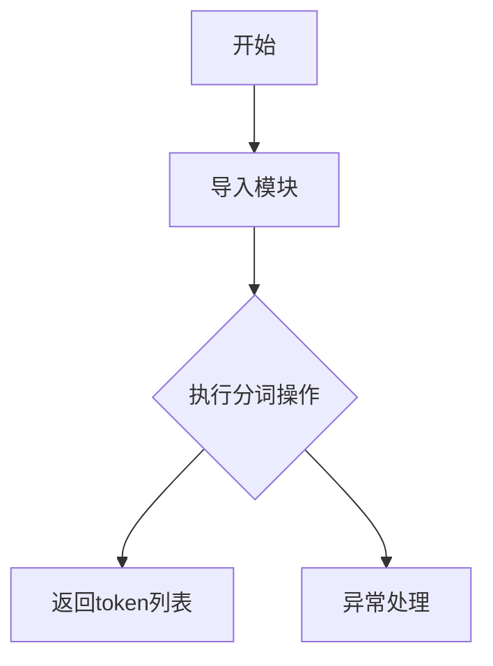

# `graphrag\packages\graphrag\graphrag\tokenizer\__init__.py` 详细设计文档

GraphRAG项目的分词器模块，目前仅包含版权声明和模块文档字符串，作为GraphRAG框架中文本处理和分词功能的基础占位模块，预留给后续实现具体的分词逻辑。

## 整体流程



## 类结构

```
模块: tokenizer (GraphRAG分词器)
└── (当前为占位模块，无实际类定义)
```

## 全局变量及字段


    

## 全局函数及方法


## 关键组件


### GraphRAG Tokenizer 模块

该模块是GraphRAG项目的tokenizer组件，负责文本分词功能，但由于提供的源代码仅包含模块文档字符串和版权声明，尚未实现具体的分词逻辑。

### 关键组件信息

由于代码中未包含实际实现，无法识别具体的内部组件。

### 潜在的技术债务或优化空间

由于缺乏实现代码，无法进行完整的技术债务分析。建议后续补充：
- 完整的tokenizer实现
- 错误处理机制
- 性能优化策略
- 单元测试覆盖

### 其它项目

- **设计目标**：根据模块名称推测，应提供高效的文本分词功能支持GraphRAG工作流程
- **外部依赖**：待实现后确定
- **接口契约**：待实现后定义


## 问题及建议


### 已知问题

-   **空实现文件**：文件仅包含版权声明和模块文档字符串，没有实际的 tokenizer 实现代码，属于占位符或待实现状态
-   **无法进行功能分析**：由于缺少实现代码，无法提取类、方法、全局变量等详细信息
-   **接口契约缺失**：未定义 tokenizer 应提供的核心功能（如分词、编码、解码等方法）
-   **无错误处理设计**：没有错误处理和异常设计相关代码
-   **无配置管理**：未定义 tokenizer 的配置选项和参数

### 优化建议

-   **实现核心功能**：根据 "GraphRAG tokenizer" 的定位，实现文本分词、编码、解码等核心方法
-   **定义接口契约**：明确 tokenizer 类应暴露的公共接口，包括方法签名和返回类型
-   **添加配置支持**：支持自定义词汇表大小、特殊 token、截断策略等配置项
-   **错误处理机制**：添加输入验证、边界检查、异常抛出等错误处理逻辑
-   **性能优化考量**：考虑批处理支持、缓存机制、流式处理等性能优化点
-   **添加单元测试**：为 tokenizer 实现编写完整的单元测试用例


## 其它


### 设计目标与约束

### 错误处理与异常设计

### 数据流与状态机

### 外部依赖与接口契约

### 性能要求与基准测试

### 安全性考虑

### 配置管理

### 版本策略与兼容性

### 测试策略

### 部署与运维指南

### 监控与日志设计

### 缓存策略

### 并发与线程安全

### 资源管理与生命周期

### 国际化与本地化

### 授权与许可


    