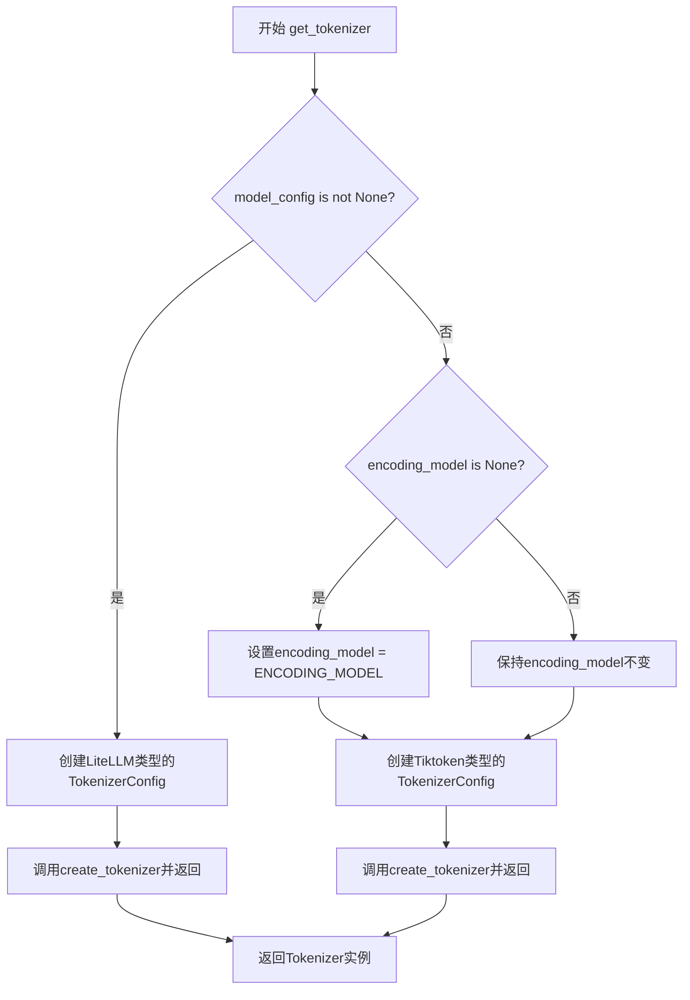
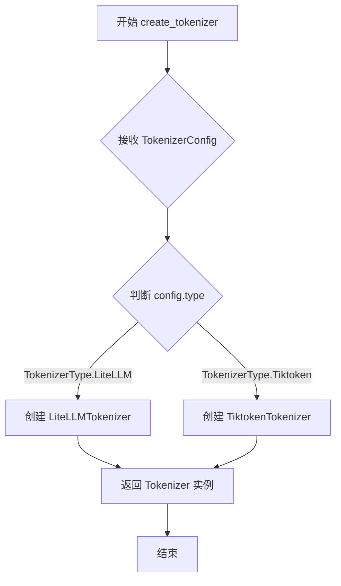

# `graphrag\packages\graphrag\graphrag\tokenizer\get_tokenizer.py` 详细设计文档

该文件提供了一个get_tokenizer函数，用于根据模型配置或编码模型名称获取相应的分词器（Tokenizer）。如果提供了model_config，则使用LiteLLMTokenizer；否则使用基于tiktoken的分词器，并默认使用ENCODING_MODEL作为编码模型。

## 整体流程



## 类结构

```
无类层次结构（该文件为函数模块）
```

## 全局变量及字段


### `ENCODING_MODEL`
    
从graphrag.config.defaults导入的默认tiktoken编码模型名称，用于当未提供模型配置时的回退选项

类型：`str`
    


    

## 全局函数及方法


### `get_tokenizer`

获取与给定模型配置对应的tokenizer，如果未提供模型配置则回退到基于tiktoken的tokenizer。

参数：

- `model_config`：`ModelConfig | None`，模型配置。如果提供此配置或手动设置了model_config.encoding_model，则使用基于tiktoken的tokenizer。否则，根据模型名称使用基于LiteLLM的tokenizer。LiteLLM支持其支持的一系列模型的token编码/解码。
- `encoding_model`：`str | None`，tiktoken编码模型。当未提供模型配置时使用此参数。

返回值：`Tokenizer`，返回Tokenizer实例。

#### 流程图

```mermaid
flowchart TD
    A[开始 get_tokenizer] --> B{model_config is not None?}
    B -->|Yes| C[构建 TokenizerConfig]
    C --> D[type=TokenizerType.LiteLLM]
    D --> E[model_id = f&quot;{model_config.model_provider}/{model_config.model}&quot;]
    E --> F[create_tokenizer]
    F --> G[返回 Tokenizer 实例]
    B -->|No| H{encoding_model is None?}
    H -->|Yes| I[使用默认 ENCODING_MODEL]
    H -->|No| J[使用传入的 encoding_model]
    I --> K[构建 TokenizerConfig]
    J --> K
    K --> L[type=TokenizerType.Tiktoken]
    L --> M[encoding_name = encoding_model]
    M --> N[create_tokenizer]
    N --> G
```

#### 带注释源码

```python
# 从graphrag_llm.config导入配置类
from graphrag_llm.config import ModelConfig, TokenizerConfig, TokenizerType
# 从graphrag_llm.tokenizer导入Tokenizer类和创建函数
from graphrag_llm.tokenizer import Tokenizer, create_tokenizer
# 从graphrag.config.defaults导入默认编码模型
from graphrag.config.defaults import ENCODING_MODEL


def get_tokenizer(
    model_config: "ModelConfig | None" = None,
    encoding_model: str | None = None,
) -> Tokenizer:
    """
    Get the tokenizer for the given model configuration or fallback to a tiktoken based tokenizer.

    Args
    ----
        model_config: LanguageModelConfig, optional
            The model configuration. If not provided or model_config.encoding_model is manually set,
            use a tiktoken based tokenizer. Otherwise, use a LitellmTokenizer based on the model name.
            LiteLLM supports token encoding/decoding for the range of models it supports.
        encoding_model: str, optional
            A tiktoken encoding model to use if no model configuration is provided. Only used if a
            model configuration is not provided.

    Returns
    -------
        An instance of a Tokenizer.
    """
    # 如果提供了model_config，使用LiteLLM类型的tokenizer
    if model_config is not None:
        # 构建包含模型提供商和模型名称的完整模型ID
        return create_tokenizer(
            TokenizerConfig(
                type=TokenizerType.LiteLLM,
                model_id=f"{model_config.model_provider}/{model_config.model}",
            )
        )

    # 如果没有提供encoding_model，使用默认的ENCODING_MODEL
    if encoding_model is None:
        encoding_model = ENCODING_MODEL
    
    # 使用tiktoken类型的tokenizer作为回退方案
    return create_tokenizer(
        TokenizerConfig(
            type=TokenizerType.Tiktoken,
            encoding_name=encoding_model,
        )
    )
```


### `create_tokenizer`

该函数是 `graphrag_llm.tokenizer` 模块中的工厂函数，根据传入的 `TokenizerConfig` 配置对象创建相应的 Tokenizer 实例，支持 LiteLLM 和 Tiktoken 两种类型的分词器。

参数：

- `config`：`TokenizerConfig`，分词器配置对象，包含分词器类型（LiteLLM 或 Tiktoken）以及对应的模型 ID 或编码名称

返回值：`Tokenizer`，返回配置对应的分词器实例

#### 流程图



#### 带注释源码

```python
# 假设 create_tokenizer 函数在 graphrag_llm.tokenizer 模块中的实现如下：

def create_tokenizer(config: TokenizerConfig) -> Tokenizer:
    """
    根据配置创建相应的分词器实例。
    
    参数:
        config: TokenizerConfig 对象，包含分词器类型和对应配置
        
    返回:
        Tokenizer: 配置对应的分词器实例
    """
    # 根据配置中的类型选择不同的分词器实现
    if config.type == TokenizerType.LiteLLM:
        # 使用 LiteLLM 支持的模型分词器
        return LiteLLMTokenizer(model_id=config.model_id)
    elif config.type == TokenizerType.Tiktoken:
        # 使用 tiktoken 库的分词器
        return TiktokenTokenizer(encoding_name=config.encoding_name)
    else:
        # 抛出不支持的分词器类型异常
        raise ValueError(f"Unsupported tokenizer type: {config.type}")
```

> **注**：由于 `create_tokenizer` 是从外部模块导入的，上述源码为基于使用方式的合理推断实现，实际实现可能略有差异。该函数是工厂模式的应用，通过 `TokenizerConfig` 配置决定创建哪种类型的分词器，提供了良好的扩展性。

## 关键组件


### get_tokenizer 函数

获取与给定模型配置对应的Tokenizer实例，根据是否提供model_config决定使用LiteLLMTokenizer还是TiktokenTokenizer。

### create_tokenizer 工厂函数

根据TokenizerConfig配置创建相应类型Tokenizer实例的工厂方法。

### TokenizerConfig 配置类

包含Tokenizer类型和模型标识的配置类，用于指定创建哪种Tokenizer。

### TokenizerType 枚举

枚举类型，定义Tokenizer的类型选项，包括LiteLLM和Tiktoken两种。

### ModelConfig 模型配置类

包含model_provider和model属性的模型配置对象，用于确定使用哪个LiteLLM模型。

### ENCODING_MODEL 全局变量

默认的tiktoken编码模型名称，作为fallback选项使用。

### Tokenizer 抽象类

Tokenizer的基类，定义了token编码/解码的抽象接口。


## 问题及建议


### 已知问题

-   **类型提示过时**：使用引号包裹类型提示 `"ModelConfig | None"`，这是Python 3.9之前的旧写法，应移除引号或添加 `from __future__ import annotations`
-   **文档与实际类型不匹配**：docstring中描述参数为`LanguageModelConfig`，但实际类型为`ModelConfig`，存在文档错误
-   **缺乏参数校验**：未对`model_config`内部属性进行空值检查，若`model_provider`或`model`为`None`时会导致格式化字符串失败
-   **错误处理缺失**：`create_tokenizer`调用未捕获异常，调用方无法友好地处理tokenizer创建失败的情况
-   **可测试性差**：依赖全局常量`ENCODING_MODEL`，单元测试时难以注入mock值
-   **魔法字符串**：使用 `f"{model_config.model_provider}/{model_config.model}"` 拼接provider和model，缺乏对组合格式的显式定义和验证
-   **返回值未校验**：`create_tokenizer`可能返回`None`或抛出异常，但函数未做处理直接返回

### 优化建议

-   移除类型提示中的引号，使用标准的联合类型注解
-   修正docstring中的类型描述，保持与实际类型一致
-   添加参数校验逻辑，在使用`model_config`属性前检查其非空
-   考虑添加try-except包装`create_tokenizer`调用，抛出更友好的业务异常
-   将全局变量`ENCODING_MODEL`作为可选参数的默认值，而非直接import使用
-   提取provider/model组合逻辑为独立函数或常量，增强可维护性
-   添加返回值校验或使用`typing.Assertion`确保返回的tokenizer非空
-   建议添加日志记录关键决策点，便于调试和问题追踪

## 其它


### 设计目标与约束

本模块的设计目标是提供一个统一的Tokenizer获取接口，根据不同的模型配置自动选择合适的tokenizer实现。约束条件包括：model_config和encoding_model参数互斥，不能同时指定；必须保证返回的Tokenizer实例可用；需要处理model_config为None且encoding_model未指定时的默认fallback逻辑。

### 错误处理与异常设计

函数本身不直接抛出异常，异常可能来自：1) create_tokenizer调用时传入无效的TokenizerConfig（如不支持的TokenizerType、无效的model_id或encoding_name）；2) 导入的模块（如graphrag_llm.tokenizer、graphrag.config.defaults）不存在或版本不兼容；3) model_config参数类型错误。调用方应捕获ImportError、ValueError等异常并进行处理。

### 外部依赖与接口契约

本函数依赖以下外部模块：1) graphrag_llm.config中的ModelConfig、TokenizerConfig、TokenizerType；2) graphrag_llm.tokenizer中的Tokenizer、create_tokenizer；3) graphrag.config.defaults中的ENCODING_MODEL常量。接口契约：model_config参数类型为ModelConfig或None，encoding_model参数类型为str或None，返回值必须为Tokenizer实例。当model_config不为None时忽略encoding_model参数。

### 使用示例

```python
# 示例1：使用model_config获取LiteLLM tokenizer
config = ModelConfig(model_provider="openai", model="gpt-4")
tokenizer = get_tokenizer(model_config=config)

# 示例2：使用encoding_model获取tiktoken tokenizer
tokenizer = get_tokenizer(encoding_model="cl100k_base")

# 示例3：使用默认配置
tokenizer = get_tokenizer()
```

### 配置说明

model_config为ModelConfig类型，包含model_provider和model属性，用于确定LiteLLM tokenizer的model_id。encoding_model为str类型，指定tiktoken的编码模型（如cl100k_base、p50k_base等）。ENCODING_MODEL为默认编码模型，在graphrag.config.defaults中定义，代码中默认为"cl100k_base"。

### 潜在技术债务与优化空间

1. 硬编码的model_id拼接逻辑：`f"{model_config.model_provider}/{model_config.model}"`，假设provider和model之间的分隔符永远正确，建议添加验证逻辑；2. 缺乏缓存机制：每次调用都会创建新的Tokenizer实例，如果重复调用相同配置可以添加缓存；3. 缺少参数校验：model_config和encoding_model的类型检查可以更严格；4. 文档注释中LanguageModelConfig类型错误：注释写的是LanguageModelConfig但实际导入的是ModelConfig。


    