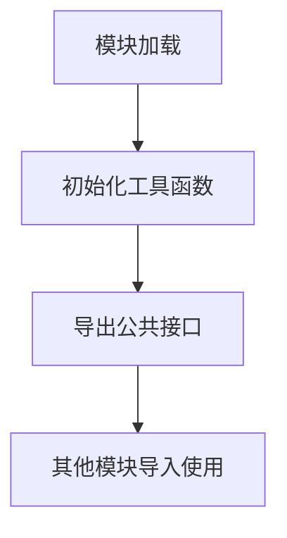

# `graphrag\packages\graphrag\graphrag\utils\__init__.py` 详细设计文档

该文件是GraphRAG包的工具函数模块，预计包含通用的辅助函数、工具类和数据处理功能，用于支持GraphRAG核心功能的实现。

## 整体流程



## 类结构

```
utils (工具模块)
├── __init__.py (模块入口)
```

## 全局变量及字段


    

## 全局函数及方法


## 关键组件


### 概述

该代码文件是GraphRAG包的工具函数模块的存根文件，仅包含版权声明和模块说明文档，暂无具体实现代码。

### 关键组件信息

由于提供的代码片段仅为文件头注释，未包含任何实际实现代码，因此无法识别具体的组件。

### 技术债务或优化空间

由于代码不完整，无法进行技术债务分析。

### 其它项目

由于提供的代码仅包含文件头注释，无实际实现代码，无法提供详细的运行流程、类信息、函数信息等设计文档内容。


## 问题及建议


### 已知问题

-   **文档信息不完整**：模块文档仅包含版权声明和一句话描述，缺乏对工具函数具体功能的详细说明、使用场景和预期用途的描述
-   **缺少公共接口定义**：未使用 `__all__` 明确导出模块的公共API，导致外部调用时无法清晰了解可用函数
-   **空模块状态**：作为工具函数模块，目前未包含任何实际实现代码，无法为 GraphRAG 包提供实际功能支持

### 优化建议

-   **完善模块文档**：在文档字符串中增加详细的模块功能描述，包括主要功能分类（如字符串处理、文件操作、数据转换等）
-   **添加类型注解**：为所有导出的函数和变量添加类型提示（Type Hints），提升代码可读性和静态检查能力
-   **定义公共接口**：使用 `__all__` 显式声明公开的函数和类，例如 `__all__ = ["function_a", "function_b", "UtilityClass"]`
-   **补充单元测试**：为工具函数编写对应的单元测试，确保核心功能的正确性和稳定性
-   **添加使用示例**：在模块文档中提供典型使用示例，帮助其他开发者快速上手


## 其它


### 设计目标与约束

本模块作为GraphRAG包的通用工具函数模块，旨在提供可复用的基础工具函数，支持上层业务逻辑的快速构建。设计目标包括：1）保持函数的无状态性，确保线程安全和可重入性；2）遵循Python最佳实践，使用类型提示提高代码可维护性；3）最小化外部依赖，降低包的整体复杂度。约束方面，要求Python版本不低于3.8，依赖标准库及GraphRAG内部模块。

### 错误处理与异常设计

本模块的错误处理遵循GraphRAG包的统一异常体系。工具函数应抛出语义明确的自定义异常，如GraphRAGValidationError用于参数校验失败，GraphRAGRuntimeError用于运行时错误。异常消息应包含足够的上下文信息，便于问题排查。建议在函数文档字符串中明确标注可能抛出的异常类型及触发条件。

### 数据流与状态机

由于本模块为工具函数集合，不涉及复杂的状态机设计。数据流遵循输入→处理→输出的简单模式，每个函数应保证输入数据的不可变性，避免副作用。函数间的数据传递通过参数传递和返回值完成，不共享全局状态。

### 外部依赖与接口契约

本模块应仅依赖Python标准库和GraphRAG内部模块，不引入额外的外部依赖。接口契约方面，所有公开函数应提供完整的类型提示，包括参数类型和返回值类型。函数签名应保持稳定，避免破坏性变更。如需扩展功能，应通过新增函数实现，而非修改现有函数签名。

### 性能要求与基准

工具函数应保证高效执行，关键路径函数的单次调用时间应控制在毫秒级以内。对于涉及IO操作的函数，应提供异步版本以支持并发调用。避免在工具函数中引入不必要的计算复杂度，如嵌套循环或重复的字符串操作。

### 安全性考虑

所有工具函数应避免安全漏洞，包括但不限于：1）不直接使用eval或exec；2）对用户输入进行严格的输入校验；3）避免路径遍历漏洞；4）不记录敏感信息到日志。函数设计应遵循最小权限原则，不执行不必要的系统调用。

### 可扩展性设计

本模块应支持通过插件机制扩展功能。建议预留扩展点，如注册自定义转换器、处理器等。模块目录结构应支持按功能域划分，便于后续新增工具类别。考虑使用抽象基类定义接口规范，便于第三方实现替代方案。

### 测试策略

每个工具函数应配套编写单元测试，覆盖正常路径和边界条件。测试应使用pytest框架，遵循AAA（Arrange-Act-Assert）模式。建议使用mock隔离外部依赖，确保测试的独立性。集成测试应验证函数在实际使用场景中的正确性。

### 部署与配置

本模块作为GraphRAG包的子模块，不需独立部署。配置通过GraphRAG主包的配置系统统一管理。工具函数应支持通过环境变量或配置文件调整行为，如日志级别、超时设置等。考虑提供配置验证机制，在启动时检查配置有效性。

### 版本兼容性

本模块应保持向后兼容，遵循语义化版本规范（SemVer）。公开API的变更应记录在CHANGELOG中。对于计划废弃的功能，应提前一个主版本周期发布弃用警告，并提供替代方案。考虑维护一个兼容性矩阵，明确支持的Python版本范围。

### 监控与日志

工具函数应集成统一的日志系统，使用Python标准库logging模块。日志级别遵循：ERROR用于异常情况，INFO用于关键业务事件，DEBUG用于开发调试。避免在热路径中执行冗余日志记录。对于可能失败的操作，应记录足够的上下文信息便于问题排查。

### 代码风格与规范

本模块遵循PEP 8代码风格指南，使用Black进行代码格式化，Flake8进行代码检查。命名规范遵循：函数使用snake_case，类使用PascalCase，常量使用UPPER_SNAKE_CASE。文档字符串采用Google风格，包含Args、Returns、Raises等章节。每个函数应有简洁的描述性文档字符串。


    