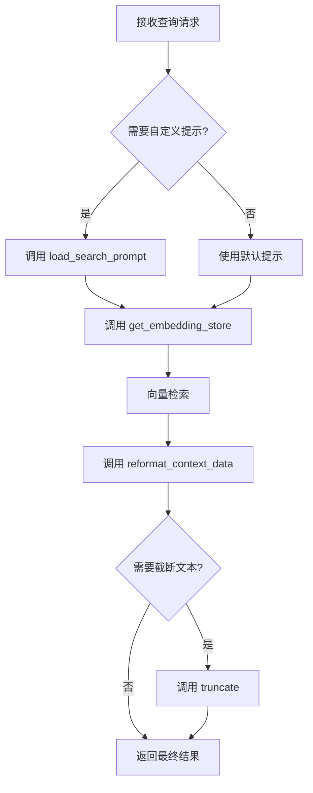

# `graphrag\packages\graphrag\graphrag\utils\api.py` 详细设计文档

该文件是 GraphRAG 模块的 API 函数集合，提供了获取向量存储、格式化查询上下文数据、加载自定义搜索提示和截断长文本等辅助功能，用于支持检索增强生成（RAG）流程中的数据处理和准备。

## 整体流程



## 类结构

```
graphrag_api (模块)
├── get_embedding_store (获取嵌入向量存储)
├── reformat_context_data (格式化上下文数据)
├── load_search_prompt (加载搜索提示)
└── truncate (截断文本)
```

## 全局变量及字段


    

## 全局函数及方法


### `get_embedding_store`

获取用于存储和检索嵌入向量的向量存储实例。该函数根据配置和嵌入名称创建相应的向量存储，并建立连接。

参数：

-  `config`：`VectorStoreConfig`，GraphRAG 配置中的向量存储配置对象
-  `embedding_name`：`str`，嵌入向量的名称，用于从配置的索引模式中获取对应的 schema

返回值：`VectorStore`，已建立连接的向量存储实例，可用于向量检索

#### 流程图

```mermaid
flowchart TD
    A[开始 get_embedding_store] --> B[接收参数: config, embedding_name]
    B --> C[调用 create_vector_store]
    C --> D[传入 config 和 config.index_schema[embedding_name]]
    D --> E[创建 VectorStore 实例: embedding_store]
    E --> F[调用 embedding_store.connect 建立连接]
    F --> G[返回已连接的 embedding_store]
    G --> H[结束]
```

#### 带注释源码

```python
def get_embedding_store(
    config: VectorStoreConfig,
    embedding_name: str,
) -> VectorStore:
    """Get the embedding store."""
    # 使用配置和嵌入名称对应的索引schema创建向量存储实例
    embedding_store = create_vector_store(config, config.index_schema[embedding_name])
    
    # 建立到向量存储的连接
    embedding_store.connect()

    # 返回已连接的向量存储实例供外部使用
    return embedding_store
```


### `reformat_context_data`

该函数用于将包含 DataFrame 的字典转换为包含列表的字典，便于 GraphRAG 查询响应的处理。它首先初始化一个标准格式的字典（包含 reports、entities、relationships、claims、sources 五个预定义键），然后遍历输入数据，对每个 DataFrame 调用 `to_dict(orient="records")` 转换为记录列表，最后返回重新格式化的结果。

参数：

-  `context_data`：`dict`，输入的上下文数据字典，键为字符串，值为 DataFrame 对象或字典

返回值：`dict`，返回重新格式化后的字典，键保持不变，值转换为列表格式

#### 流程图

```mermaid
flowchart TD
    A[开始 reformat_context_data] --> B[初始化 final_format 字典]
    B --> C{遍历 context_data 的每个键}
    C --> D{检查值是否不为 None 且不是 dict}
    D -->|是| E[调用 to_dict orient='records' 转换为记录列表]
    D -->|否| F[直接使用原值]
    E --> G{记录列表长度 > 0?}
    F --> G
    G -->|是| H[将记录列表赋值给 final_format[key]]
    G -->|否| I[跳过该键]
    H --> C
    I --> C
    C --> J[返回 final_format 字典]
    J --> K[结束]
```

#### 带注释源码

```python
def reformat_context_data(context_data: dict) -> dict:
    """
    Reformats context_data for all query responses.

    Reformats a dictionary of dataframes into a dictionary of lists.
    One list entry for each record. Records are grouped by original
    dictionary keys.

    Note: depending on which query algorithm is used, the context_data may not
          contain the same information (keys). In this case, the default behavior will be to
          set these keys as empty lists to preserve a standard output format.
    """
    # 初始化标准输出格式的字典，包含五个预定义键
    # 这些键对应 GraphRAG 查询响应的不同数据部分
    final_format = {
        "reports": [],      # 报告数据列表
        "entities": [],     # 实体数据列表
        "relationships": [], # 关系数据列表
        "claims": [],       # 声明数据列表
        "sources": [],      # 来源数据列表
    }
    
    # 遍历输入字典的每个键
    for key in context_data:
        # 判断当前值是否为有效的 DataFrame 对象
        # 如果值不为 None 且不是字典类型，则尝试转换为记录列表
        records = (
            # 调用 DataFrame 的 to_dict 方法转换为记录列表
            context_data[key].to_dict(orient="records")
            # 条件：值不为 None 且不是字典（已经是转换后的格式）
            if context_data[key] is not None and not isinstance(context_data[key], dict)
            else context_data[key]  # 直接使用原值（可能是已转换的 dict 或其他类型）
        )
        
        # 如果记录列表为空，则跳过该键，不添加到最终结果中
        if len(records) < 1:
            continue
            
        # 将转换后的记录列表赋值给对应键
        final_format[key] = records
    
    # 返回重新格式化后的字典
    return final_format
```


### `load_search_prompt`

该函数用于从磁盘加载搜索提示模板。如果配置了提示文件路径且文件存在，则读取并返回文件内容；否则返回 None，由搜索函数使用其默认提示。

参数：

- `prompt_config`：`str | None`，提示配置文件路径，可以是字符串路径或 None

返回值：`str | None`，如果配置有效且文件存在则返回提示内容，否则返回 None

#### 流程图

```mermaid
flowchart TD
    A[开始] --> B{prompt_config 是否为真值?}
    B -->|是| C[将 prompt_config 解析为 Path 对象]
    B -->|否| F[返回 None]
    C --> D[prompt_file.exists()]
    D -->|是| E[读取文件内容并用 UTF-8 解码]
    D -->|否| F
    E --> G[返回提示内容]
    F --> G
```

#### 带注释源码

```python
def load_search_prompt(prompt_config: str | None) -> str | None:
    """
    Load the search prompt from disk if configured.

    If not, leave it empty - the search functions will load their defaults.

    """
    # 检查是否配置了提示文件路径
    if prompt_config:
        # 将字符串路径解析为 Path 对象并解析为绝对路径
        prompt_file = Path(prompt_config).resolve()
        # 检查文件是否存在
        if prompt_file.exists():
            # 读取文件字节内容并用 UTF-8 编码解码为字符串
            return prompt_file.read_bytes().decode(encoding="utf-8")
    # 未配置或文件不存在时返回 None，让搜索函数使用默认提示
    return None
```


### `truncate`

该函数用于将超过指定最大长度的字符串截断到指定长度，并在末尾添加省略标记，用于处理需要限制显示长度的文本场景。

参数：

- `text`：`str`，需要截断的原始字符串
- `max_length`：`int`，允许的最大字符长度

返回值：`str`，如果原字符串长度超过最大长度，则返回截断后的字符串并附加"...[truncated]"标记；否则返回原字符串

#### 流程图

```mermaid
flowchart TD
    A[开始 truncate 函数] --> B{判断: len&#40;text&#41; <= max_length?}
    B -->|是| C[返回原始 text]
    B -->|否| D[截取 text[:max_length]]
    D --> E[拼接 '...[truncated]' 标记]
    E --> F[返回截断后的字符串]
    C --> G[结束]
    F --> G
```

#### 带注释源码

```python
def truncate(text: str, max_length: int) -> str:
    """
    将字符串截断到指定的最大长度。
    
    Args:
        text: 需要截断的原始字符串
        max_length: 允许的最大字符长度
    
    Returns:
        截断后的字符串（如果超过最大长度则附加省略标记）
    """
    # 如果文本长度不超过最大长度，直接返回原文本
    if len(text) <= max_length:
        return text
    
    # 截取到最大长度，并添加省略标记
    return text[:max_length] + "...[truncated]"
```

## 关键组件


### 向量存储获取组件

负责创建和连接向量存储实例，支持通过配置和嵌入名称获取相应的嵌入向量存储。该组件封装了VectorStore的创建、配置和应用schema匹配的逻辑。

### 上下文数据重格式化组件

将包含DataFrame的字典结构重新格式化为记录列表格式，支持多种数据类型的处理，并确保输出格式的一致性（包含reports、entities、relationships、claims、sources五个标准键）。

### 搜索提示加载组件

实现惰性加载机制的搜索提示加载功能，仅在配置了提示文件路径时才从磁盘读取，否则返回None由搜索函数使用默认提示。

### 文本截断组件

提供字符串长度控制功能，确保输出文本不超过指定的最大长度，超长时添加截断标记。


## 问题及建议


### 已知问题

- **错误处理不足**：`get_embedding_store`未验证`embedding_name`是否存在于`config.index_schema`中，直接访问可能导致KeyError异常；`create_vector_store`调用失败时无降级策略
- **类型处理逻辑混乱**：`reformat_context_data`中对`None`和`dict`类型的判断逻辑嵌套较深，可读性差，且未对异常数据类型进行捕获
- **文件读取异常无感知**：`load_search_prompt`在文件不存在或读取失败时静默返回None，调用方无法区分"未配置"还是"读取失败"
- **截断长度计算不准确**：`truncate`函数添加"...[truncated]"后，实际字符串长度会超过`max_length`
- **硬编码输出结构**：`reformat_context_data`使用固定5个key的字典，若context_data引入新类型数据，将被丢弃
- **资源管理缺失**：`get_embedding_store`每次调用创建新的VectorStore实例，无连接池复用或显式资源释放机制
- **依赖契约不透明**：依赖`graphrag_vectors`库的内部实现细节（如`index_schema`结构），缺乏接口抽象层

### 优化建议

- 为`get_embedding_store`添加embedding_name存在性校验，捕获KeyError并提供友好错误信息
- 改进`reformat_context_data`的类型判断逻辑，使用isinstance进行清晰的条件分支，并添加异常捕获
- `load_search_prompt`应区分"未配置"和"读取失败"两种情况，可返回Result类型或抛出自定义异常
- `truncate`函数应在max_length中预留"...[truncated]"的长度，或使用rstrip确保不超长
- 使用数据类或枚举定义输出格式，支持动态扩展key
- 引入连接池或单例模式的VectorStore管理，考虑实现上下文管理器协议
- 提取外部依赖为抽象接口，增加mockability，便于单元测试

## 其它


### 设计目标与约束

本模块的设计目标是为GraphRAG模块提供基础的向量存储获取和上下文数据格式化功能，支持查询上下文的标准化处理。约束方面，依赖外部的graphrag_vectors包，要求调用方正确配置VectorStoreConfig，且reformat_context_data函数假设输入的context_data中的值为pandas DataFrame或dict类型，非标准输入可能导致功能异常。

### 错误处理与异常设计

错误处理采用分层策略：get_embedding_store中如果config配置错误或index_schema中不存在指定的embedding_name，可能抛出KeyError或相关异常；reformat_context_data中对None值和类型进行了初步检查，但不会主动抛出异常，而是跳过处理；load_search_prompt在文件不存在时返回None而非抛出异常；truncate函数仅做基本的字符串长度检查，不涉及异常场景。建议调用方在使用前对config和prompt_config进行有效性验证。

### 数据流与状态机

数据流主要涉及两个方向：向上游（调用方）提供向量存储实例，向下游（查询模块）提供格式化后的上下文数据。无状态机设计，所有函数均为无状态工具函数。reformat_context_data的数据转换流程为：输入dict[DataFrame] -> 遍历key -> 转换为records列表 -> 输出dict[list]。

### 外部依赖与接口契约

核心依赖为graphrag_vectors包，导入了VectorStore、VectorStoreConfig、create_vector_store三个公开接口。VectorStoreConfig需包含index_schema属性且为dict类型，embedding_name参数必须存在于index_schema的key中。reformat_context_data的输入契约要求context_data的值为pandas DataFrame对象或dict类型，输出为标准化结构包含reports、entities、relationships、claims、sources五个key的dict。load_search_prompt接受文件路径字符串，返回文件内容字符串或None。

### 性能考虑

reformat_context_data中的to_dict(orient="records")操作在大数据量时可能产生性能瓶颈，建议在调用前进行数据分片或流式处理。truncate函数使用切片操作，性能开销较小。load_search_prompt涉及文件IO操作，首次加载后建议缓存结果。

### 安全性考虑

load_search_prompt直接读取配置文件路径，存在路径遍历风险，建议对prompt_config进行路径合法性验证。truncate函数未处理特殊字符或HTML标签的转义，直接截断可能导致内容损坏。 VectorStore的connect()操作可能涉及网络连接，需确保配置中的连接信息安全性。

### 可扩展性设计

reformat_context_data的final_format结构目前硬编码了五个key，若需支持新的数据类型需要修改函数源码，建议改为配置化方式。get_embedding_store目前仅支持单embedding配置，后续可扩展为批量获取多个embedding store。

### 配置管理

本模块不直接管理配置，依赖外部传入的VectorStoreConfig对象。配置项包括：VectorStore的连接配置（包含在config中）、embedding_name、prompt_config路径。调用方需确保配置的生命周期与使用场景匹配。


    