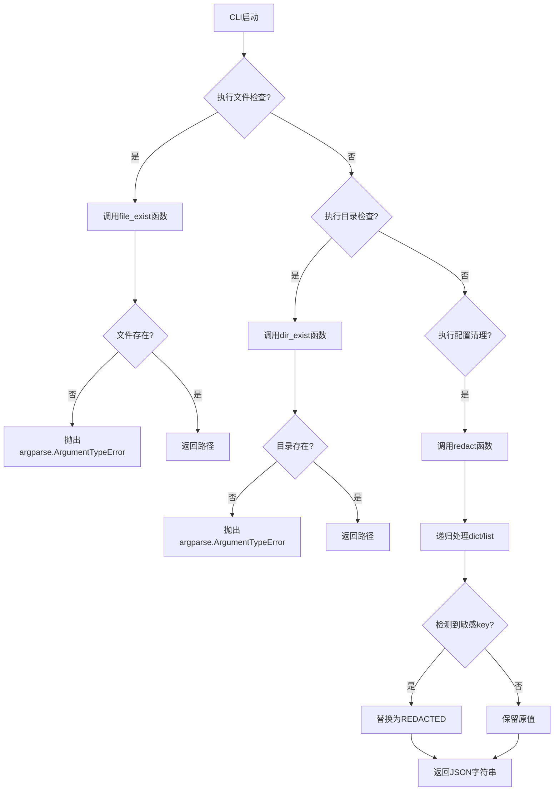

# `graphrag\packages\graphrag\graphrag\utils\cli.py` 详细设计文档

这是一个GraphRAG模块的CLI工具文件，提供文件/目录存在性检查函数以及配置敏感信息清理功能，用于确保CLI输入的有效性和配置安全性。

## 整体流程



## 类结构

```
无类定义（纯函数模块）
```

## 全局变量及字段


### `path`
    
文件或目录的路径字符串，用于存在性检查

类型：`str`
    


### `config`
    
包含敏感配置信息的字典对象，用于脱敏处理

类型：`dict`
    


### `key`
    
配置字典中的键名

类型：`str`
    


### `value`
    
配置字典中的值

类型：`any`
    


### `result`
    
脱敏处理后的结果字典

类型：`dict`
    


### `redacted_dict`
    
最终脱敏后的字典对象

类型：`dict`
    


### `msg`
    
错误消息字符串

类型：`str`
    


### `i`
    
列表中的元素，用于递归脱敏处理

类型：`any`
    


    

## 全局函数及方法


### `file_exist`

检查给定路径是否指向一个实际存在的文件，如果文件不存在则抛出错误，否则返回该路径。

参数：

- `path`：`str`，需要检查的文件路径

返回值：`str`，验证通过的文件路径（如果文件存在）

#### 流程图

```mermaid
flowchart TD
    A[开始] --> B[调用 Path(path).is_file]
    B --> C{文件存在?}
    C -->|是| D[返回 path]
    C -->|否| E[构造错误消息: File not found: {path}]
    E --> F[抛出 argparse.ArgumentTypeError]
    F --> G[结束]
    D --> G
```

#### 带注释源码

```python
def file_exist(path):
    """Check for file existence.
    
    这是一个用于argparse的类型检查函数,
    确保传入的路径指向一个实际存在的文件。
    
    Args:
        path: 文件路径,可以是字符串或Path对象
        
    Returns:
        验证通过的文件路径,原样返回供argparse使用
        
    Raises:
        argparse.ArgumentTypeError: 当文件不存在时抛出
    """
    # 使用Path对象的is_file方法检查路径是否指向文件
    if not Path(path).is_file():
        # 文件不存在时,构造错误消息并抛出ArgumentTypeError
        # 这是argparse自定义类型检查的标准做法
        msg = f"File not found: {path}"
        raise argparse.ArgumentTypeError(msg)
    # 文件存在时,返回原始路径供argparse继续使用
    return path
```


### `dir_exist`

检查指定路径是否为一个已存在的目录，如果目录不存在则抛出 `argparse.ArgumentTypeError` 异常，否则返回该路径。该函数通常用于命令行参数验证，确保用户提供的路径指向有效的目录。

参数：

- `path`：`str` 或 `Path`，需要检查的目录路径

返回值：`str` 或 `Path`，返回经验证后存在的目录路径（与输入参数相同）

#### 流程图

```mermaid
flowchart TD
    A[开始: 输入 path] --> B{Path(path).is_dir?}
    B -->|是| C[返回 path]
    B -->|否| D[构建错误消息: Directory not found: {path}]
    D --> E[抛出 argparse.ArgumentTypeError 异常]
    E --> F[结束]
```

#### 带注释源码

```python
def dir_exist(path):
    """Check for directory existence."""
    # 使用 Path 对象检查路径是否为已存在的目录
    if not Path(path).is_dir():
        # 如果目录不存在，构建错误消息并抛出异常
        msg = f"Directory not found: {path}"
        raise argparse.ArgumentTypeError(msg)
    # 目录存在，返回原始路径（用于 argparse 参数绑定）
    return path
```


### `redact`

清理配置对象中的敏感信息（如API密钥、连接字符串等），将敏感字段的值替换为"==== REDACTED ===="，并返回JSON格式的字符串。

参数：

- `config`：`dict`，需要清理敏感信息的配置对象

返回值：`str`，JSON格式的字符串，包含清理后的配置

#### 流程图

```mermaid
flowchart TD
    A([开始 redact]) --> B{config 是 dict?}
    B -->|否| C[直接返回 config]
    B -->|是| D[调用 redact_dict]
    
    subgraph redact_dict [内部函数: redact_dict]
        E{遍历 key-value} --> F{key 在敏感列表?}
        F -->|是| G{value 不为 None?}
        F -->|否| H{value 是 dict?}
        G -->|是| I[设置 value = "==== REDACTED ===="]
        G -->|否| J[保留 None]
        H -->|是| K[递归调用 redact_dict]
        H -->|否| L{value 是 list?}
        L -->|是| M[遍历列表元素]
        M --> N[递归调用 redact_dict]
        L -->|否| O[直接赋值]
        I --> P[添加到结果]
        J --> P
        K --> P
        N --> P
        O --> P
    end
    
    D --> E
    P --> Q{还有更多 key?}
    Q -->|是| E
    Q -->|否| R[返回 redacted_dict]
    R --> S[json.dumps 格式化]
    S --> T([返回 JSON 字符串])
    C --> T
```

#### 带注释源码

```python
def redact(config: dict) -> str:
    """Sanitize secrets in a config object."""

    # 定义内部递归函数来处理字典的清理
    def redact_dict(config: dict) -> dict:
        # 如果不是字典，直接返回原值
        if not isinstance(config, dict):
            return config

        # 初始化结果字典
        result = {}
        
        # 遍历配置字典的每个键值对
        for key, value in config.items():
            # 检查是否包含敏感字段
            if key in {
                "api_key",
                "connection_string",
                "container_name",
                "organization",
            }:
                # 如果值不为None，替换为脱敏标记
                if value is not None:
                    result[key] = "==== REDACTED ===="
            # 如果值是字典，递归处理
            elif isinstance(value, dict):
                result[key] = redact_dict(value)
            # 如果值是列表，递归处理每个元素
            elif isinstance(value, list):
                result[key] = [redact_dict(i) for i in value]
            # 其他情况直接赋值
            else:
                result[key] = value
        return result

    # 调用内部函数进行脱敏处理
    redacted_dict = redact_dict(config)
    # 返回JSON格式的字符串
    return json.dumps(redacted_dict, indent=4)
```


### `redact.redact_dict`

该函数是 `redact` 函数的内部嵌套函数，用于递归清理配置对象中的敏感信息，将特定键（如 api_key、connection_string 等）的值替换为脱敏标记。

参数：

- `config`：`dict`，需要清理的配置字典

返回值：`dict`，清理后的配置字典

#### 流程图

```mermaid
flowchart TD
    A[开始 redact_dict] --> B{config 是否为 dict?}
    B -->|否| C[直接返回 config]
    B -->|是| D[创建空结果字典 result]
    D --> E[遍历 config 的所有键值对]
    E --> F{当前键是否在敏感键集合中?}
    F -->|是| G{value 是否为 None?}
    F -->|否| H{value 是否为 dict?}
    G -->|否| I[result[key] = '==== REDACTED ====']
    G -->|是| J[result[key] = None]
    I --> K[处理下一个键值对]
    J --> K
    H -->|是| L[result[key] = redact_dict(value)]
    H -->|否| M{value 是否为 list?}
    L --> K
    M -->|是| N[result[key] = 遍历list元素调用redact_dict]
    M -->|否| O[result[key] = value]
    N --> K
    O --> K
    K --> P{还有更多键值对?}
    P -->|是| E
    P -->|否| Q[返回 result]
    Q --> R[结束]
```

#### 带注释源码

```python
def redact_dict(config: dict) -> dict:
    """递归清理配置字典中的敏感信息。
    
    该函数会遍历配置字典的所有键值对，将特定敏感键的值
    替换为脱敏标记。对于嵌套的字典和列表，会递归处理。
    
    参数:
        config: 需要清理的配置字典
        
    返回值:
        清理后的配置字典
    """
    # 如果输入不是字典，直接返回原值（非字典类型不处理）
    if not isinstance(config, dict):
        return config

    # 初始化结果字典
    result = {}
    
    # 遍历配置字典中的所有键值对
    for key, value in config.items():
        # 检查当前键是否为敏感键
        if key in {
            "api_key",           # API密钥
            "connection_string", # 连接字符串
            "container_name",    # 容器名称
            "organization",       # 组织名称
        }:
            # 如果值不为None，替换为脱敏标记
            if value is not None:
                result[key] = "==== REDACTED ===="
            else:
                # 如果值为None，保留None
                result[key] = None
        # 如果值是字典，递归调用 redact_dict 处理
        elif isinstance(value, dict):
            result[key] = redact_dict(value)
        # 如果值是列表，遍历列表元素并递归处理
        elif isinstance(value, list):
            result[key] = [redact_dict(i) for i in value]
        # 其他情况保留原值
        else:
            result[key] = value
    
    # 返回清理后的字典
    return result
```

## 关键组件


### file_exist

文件存在性验证函数，用于检查指定路径是否为有效文件，若文件不存在则抛出ArgumentTypeError异常。

### dir_exist

目录存在性验证函数，用于检查指定路径是否为有效目录，若目录不存在则抛出ArgumentTypeError异常。

### redact

配置对象敏感信息脱敏函数，通过递归遍历配置字典，将指定敏感键（如api_key、connection_string等）的值替换为REDACTED标记，支持嵌套字典和列表结构的深度脱敏处理。

### redact_dict

递归脱敏辅助函数，作为redact的内部函数实现，用于递归处理嵌套的配置结构，遍历字典的键值对并对敏感信息进行脱敏处理。


## 问题及建议


### 已知问题

-   **递归调用逻辑错误**：`redact`函数内的`redact_dict`嵌套函数在递归调用时实际调用的是外部函数而非自身，导致嵌套字典的脱敏逻辑可能无法正确执行
-   **类型注解缺失**：`file_exist`和`dir_exist`函数缺少返回类型注解（应为`str`），`redact_dict`嵌套函数缺少完整的类型注解
-   **敏感字段硬编码**：敏感字段列表（api_key、connection_string等）硬编码在代码中，难以扩展和维护
-   **重复定义内部函数**：每次调用`redact`都会重新定义`redact_dict`内部函数，造成性能开销
-   **错误处理不全面**：文件/目录检查只验证存在性，未处理符号链接、权限不足等边界情况
-   **空值处理不一致**：对于`None`值的处理在键匹配时返回原值，但在嵌套结构中未做统一处理

### 优化建议

-   将`redact_dict`从嵌套函数改为模块级函数或使用`nonlocal`关键字确保正确递归
-   将敏感字段列表提取为模块级常量或作为`redact`函数的参数以提高可配置性
-   为所有函数添加完整的类型注解，提升代码可读性和IDE支持
-   增强错误处理：添加符号链接检测、权限检查，并考虑返回更具体的错误信息
-   使用`functools.lru_cache`缓存敏感字段集合，或将内部函数定义移至模块级别避免重复创建
-   考虑使用`dataclasses`或`Pydantic`定义配置结构，提供更清晰的类型约束和验证逻辑


## 其它


### 设计目标与约束

本模块作为GraphRAG CLI的辅助工具模块，主要目标是为命令行参数解析提供可复用的验证函数，并提供配置敏感信息脱敏能力。设计上遵循轻量级、无外部依赖（仅使用Python标准库）的原则，确保模块的便携性和易用性。redact函数的设计目标是防止敏感配置信息在日志或输出中泄露，属于安全防护层的基础能力。

### 错误处理与异常设计

本模块采用argparse内置的异常机制进行错误处理。`file_exist`和`dir_exist`函数在验证失败时抛出`argparse.ArgumentTypeError`，该异常会被argparse自动捕获并转换为格式化的错误信息展示给用户，无需额外的try-except包裹。`redact函数`设计为纯函数，不抛出异常，对于非dict类型的输入直接返回原值，保证数据流的稳定性。

### 外部依赖与接口契约

本模块仅依赖Python标准库（argparse、json、pathlib），无第三方依赖。接口契约如下：
- `file_exist`和`dir_exist`设计为argparse的`type`参数使用，接受字符串路径，返回验证后的路径字符串，验证失败时抛出`argparse.ArgumentTypeError`
- `redact`函数接受dict类型配置对象，返回脱敏后的JSON格式字符串（使用json.dumps格式化）

### 安全性考虑

`redact`函数实现了配置脱敏功能，针对配置字典中的敏感键（api_key、connection_string、container_name、organization）进行屏蔽处理。该函数通过递归遍历处理嵌套字典和列表结构，确保深层敏感信息也被妥善处理。脱敏策略采用静态替换（替换为"==== REDACTED ===="），保留字典结构完整性以便调试和审计。

### 性能考量

本模块性能开销极低。`file_exist`和`dir_exist`仅执行单次文件系统调用，属于IO密集型但耗时可忽略。`redact`函数的时间复杂度为O(n)，其中n为配置字典的键值对总数，空间复杂度同样为O(n)，适用于常规配置文件大小（通常为数十至数百KB级别）。


    