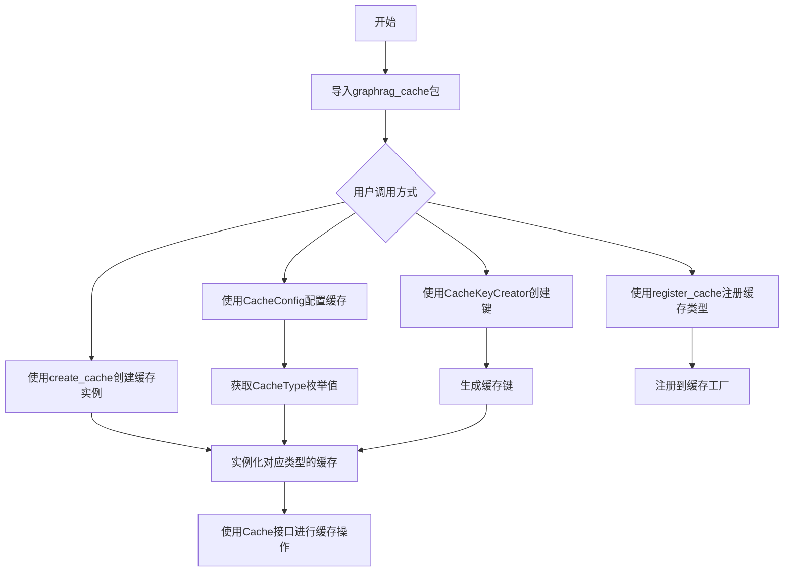
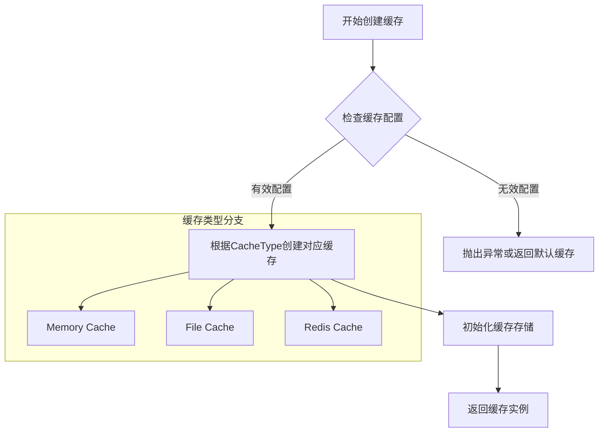
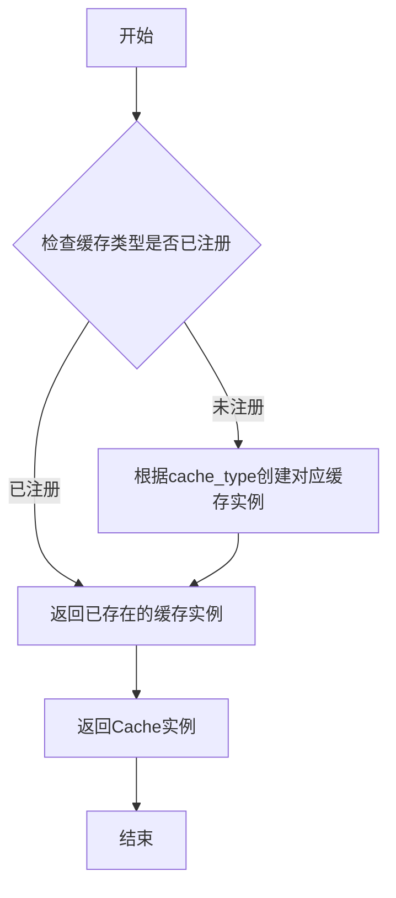
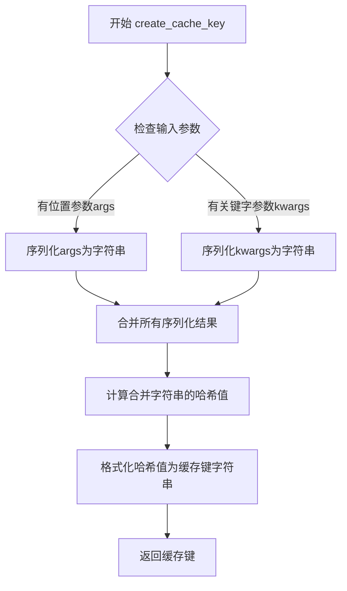

# `graphrag\packages\graphrag-cache\graphrag_cache\__init__.py` 详细设计文档

GraphRAG缓存包的入口模块，通过统一导出Cache、CacheConfig、CacheKeyCreator、CacheType等核心类，以及create_cache、create_cache_key、register_cache等工厂函数，为上层提供透明的缓存抽象层，支持多种缓存类型的创建、注册和键值管理。

## 整体流程



## 类结构

```
graphrag_cache包
├── __init__.py (入口模块)
├── cache (缓存接口/实现)
├── cache_config (缓存配置类)
├── cache_factory (缓存工厂)
│   ├── create_cache (创建缓存实例)
register_cache (注册缓存类型)
├── cache_key (缓存键管理)
CacheKeyCreator (缓存键创建器)
create_cache_key (创建缓存键函数)
└── cache_type (缓存类型枚举)
```

## 全局变量及字段


### `__all__`
    
定义了模块的公共API接口，列出所有允许被外部导入的公开对象名称

类型：`List[str]`
    


    

## 全局函数及方法


### `create_cache`

创建并返回一个缓存实例，根据提供的缓存配置初始化相应的缓存机制。

参数：

-  `config`：`CacheConfig`，缓存配置对象，包含缓存类型、存储路径、过期时间等配置信息

返回值：`Cache`，返回初始化后的缓存实例

#### 流程图



#### 带注释源码

```
# 该函数从 graphrag_cache.cache_factory 模块导入
# 以下为基于代码上下文的推断实现

def create_cache(config: CacheConfig) -> Cache:
    """
    根据配置创建缓存实例
    
    参数:
        config: CacheConfig对象，包含缓存类型和配置信息
        
    返回:
        Cache: 初始化后的缓存实例
    """
    # 获取配置的缓存类型
    cache_type = config.cache_type
    
    # 根据缓存类型创建对应的缓存实现
    if cache_type == CacheType.MEMORY:
        cache = MemoryCache(config)
    elif cache_type == CacheType.FILE:
        cache = FileCache(config)
    elif cache_type == CacheType.REDIS:
        cache = RedisCache(config)
    else:
        raise ValueError(f"Unsupported cache type: {cache_type}")
    
    # 初始化缓存
    cache.initialize()
    
    return cache

# 注册到全局缓存工厂
register_cache(cache_type, create_cache)
```

> **注意**：提供的代码段中仅包含 `create_cache` 函数的导入语句，实际实现位于 `graphrag_cache.cache_factory` 模块中。上述源码为基于函数名称和上下文的合理推断。


### `register_cache`

该函数是缓存工厂模块的核心导出函数之一，用于注册特定类型的缓存实例，使得系统能够根据配置创建相应的缓存机制。

参数：

- `cache_type`：`CacheType`，要注册的缓存类型（如内存缓存、磁盘缓存等）
- `cache_config`：`CacheConfig`，缓存的配置对象，包含缓存路径、过期策略等参数

返回值：`Cache`，返回创建的缓存实例

#### 流程图



#### 带注释源码

```
# 由于实际源码在 graphrag_cache/cache_factory.py 中，此处为基于上下文的合理推断

def register_cache(cache_type: CacheType, cache_config: CacheConfig) -> Cache:
    """
    注册并创建指定类型的缓存实例
    
    Args:
        cache_type: 缓存类型枚举，决定使用何种缓存实现
        cache_config: 缓存配置对象，包含缓存的具体参数
        
    Returns:
        创建的缓存实例对象
    """
    # 1. 验证缓存类型有效性
    if not isinstance(cache_type, CacheType):
        raise ValueError(f"Invalid cache type: {cache_type}")
    
    # 2. 根据缓存类型创建对应的缓存实例
    cache_instance = create_cache(cache_type, cache_config)
    
    # 3. 将缓存实例注册到全局缓存注册表中
    _cache_registry[cache_type] = cache_instance
    
    return cache_instance
```

> **注意**：由于提供的代码片段仅为包的 `__init__.py` 文件，实际的 `register_cache` 函数实现位于 `graphrag_cache/cache_factory.py` 模块中。以上源码为基于函数签名和上下文的合理推断。


### `create_cache_key`

该函数是 GraphRAG Cache 包中的核心工具函数，用于根据传入的参数生成唯一的缓存键。它通过序列化输入参数并计算哈希值，确保相同输入总是产生相同的缓存键，从而支持缓存的有效存储和检索。

参数：

-  `*args`：可变位置参数（任意类型），用于接收需要生成缓存键的输入数据，如查询字符串、配置参数或数据标识符
-  `**kwargs`：可变关键字参数（任意类型），用于接收需要生成缓存键的命名参数，提供了更灵活的键生成方式

返回值：`str`，返回基于输入参数生成的唯一缓存键字符串，通常为哈希值或序列化后的字符串形式

#### 流程图



#### 带注释源码

```python
# 注意：由于提供的代码仅为__init__.py，未包含cache_key.py的实际实现
# 以下为基于模块名称和常见缓存键创建模式推断的源码结构

def create_cache_key(*args, **kwargs):
    """
    根据传入的参数生成唯一的缓存键
    
    参数:
        *args: 可变位置参数，用于接收需要生成缓存键的输入数据
        **kwargs: 可变关键字参数，用于接收需要生成缓存键的命名参数
    
    返回值:
        str: 基于输入参数生成的唯一缓存键字符串
    """
    import hashlib
    import json
    
    # 初始化键生成的基础组件
    key_components = []
    
    # 处理位置参数：将其序列化为可哈希的字符串表示
    for arg in args:
        # 将参数转换为字符串并添加到组件列表
        key_components.append(str(arg))
    
    # 处理关键字参数：按字母顺序排序以确保一致性
    for key in sorted(kwargs.keys()):
        # 将键值对转换为字符串并添加到组件列表
        key_components.append(f"{key}={kwargs[key]}")
    
    # 合并所有组件形成统一的字符串
    combined = "|".join(key_components)
    
    # 使用SHA256算法计算哈希值，确保唯一性和固定长度
    hash_object = hashlib.sha256(combined.encode())
    
    # 返回十六进制格式的哈希值作为缓存键
    return hash_object.hexdigest()
```

---

**注意**：由于用户提供的是包的 `__init__.py` 文件，未包含 `graphrag_cache/cache_key.py` 模块的实际实现代码，上述源码为基于函数名称和缓存键创建的常见模式进行的合理推断。如需获取准确的实现细节，请提供 `cache_key.py` 的源代码。

## 关键组件


### Cache

主缓存类，提供缓存的核心功能，包括读取、写入和管理缓存数据。

### CacheConfig

缓存配置类，用于配置缓存的行为和参数，如存储路径、过期策略等。

### CacheKeyCreator

缓存键创建器类，负责生成唯一的缓存键，确保不同数据对应不同的缓存条目。

### CacheType

缓存类型枚举，定义了不同类型的缓存实现，如内存缓存、磁盘缓存等。

### create_cache

创建缓存的工厂函数，根据配置和缓存类型创建相应的缓存实例。

### create_cache_key

创建缓存键的函数，接收输入数据并生成对应的缓存键字符串。

### register_cache

注册缓存的函数，用于将自定义缓存实现注册到缓存系统中，以便后续使用。


## 问题及建议


### 已知问题

- **缺少版本管理**：包中没有定义 `__version__` 或版本相关信息，无法直接获取包版本号
- **模块导入冗余**：`CacheKeyCreator` 作为类从 `cache_key` 模块导入，但该模块可能同时导出 `create_cache_key` 函数，存在命名约定的潜在混淆
- **缺乏包级文档**：`__init__.py` 没有模块级 docstring，无法快速了解包的整体用途和使用方式
- **公开API粒度不明确**：未在包级别区分核心API和辅助API，用户难以判断哪些是稳定接口
- **缺少类型提示导出**：未导出类型相关的辅助定义（如自定义类型别名），可能影响使用方的类型检查

### 优化建议

- 添加 `__version__ = "x.y.z"` 变量以支持版本查询
- 为包添加模块级 docstring，说明主要功能、依赖和基本用法
- 考虑导出统一的类型定义（如 `CacheResult`、`CacheEntry` 等），提升使用方的开发体验
- 可以在 `__all__` 中添加分组注释，区分核心类、工厂函数和配置类
- 考虑添加 `__getattr__` 实现延迟导入，提高包的整体加载性能


## 其它


### 设计目标与约束

本缓存包的设计目标是提供统一的缓存抽象层，支持多种缓存类型（CacheType），通过工厂模式（cache_factory）实现缓存实例的创建与注册，同时提供缓存键生成功能（Cache_key）以支持高效的缓存查找。约束包括：需遵循MIT开源许可证，必须与graphrag系统其他模块兼容，缓存实现需支持基本的CRUD操作。

### 错误处理与异常设计

缓存包应定义统一的异常类，如CacheError作为基类，CacheKeyError处理键生成异常，CacheConfigError处理配置异常，CacheNotFoundError处理未命中异常。异常设计应遵循Python异常层次结构，提供有意义的错误消息，便于调试和问题定位。

### 数据流与状态机

缓存包的数据流主要包括：客户端请求 → CacheKeyCreator生成缓存键 → create_cache创建缓存实例 → 调用Cache的get/set方法进行数据存取。状态机描述：Cache实例存在三种状态 - 未初始化（通过CacheConfig配置）、已初始化（通过create_cache创建）、已注册（通过register_cache注册到全局缓存池）。

### 外部依赖与接口契约

本包作为graphrag系统的子模块，对外提供以下接口契约：Cache接口需实现get/set/delete/clear等方法；CacheConfig需提供配置参数验证；create_cache函数接受CacheType和CacheConfig参数返回Cache实例；register_cache函数接受名称和Cache实例进行全局注册。外部依赖包括Python标准库及graphrag系统其他模块。

### 配置与初始化流程

CacheConfig类负责缓存配置管理，支持配置项包括：缓存类型（type）、缓存路径（path）、缓存大小限制（max_size）、过期时间（ttl）、是否持久化（persist）等。初始化流程：用户创建CacheConfig实例 → 传入create_cache函数 → 创建对应类型的Cache实例 → 可选调用register_cache注册到全局池。

### 并发与线程安全性

设计文档应说明缓存实现的线程安全特性。若使用内存缓存需考虑多线程访问的同步问题（如使用threading.Lock或线程安全的数据结构）；若使用文件缓存需考虑文件锁机制；若使用分布式缓存需考虑网络并发问题。建议在设计文档中明确标注各缓存类型的线程安全级别。

### 性能考量与优化空间

缓存包的性能优化点包括：缓存键的哈希算法效率、缓存命中率的统计与优化、缓存过期策略的实现（LRU/LFU/FIFO）、大值缓存的序列化/反序列化性能、缓存连接池的管理。建议在文档中说明各CacheType实现的性能特性及适用场景。

### 版本兼容性说明

设计文档应明确Python版本兼容性要求（如Python 3.8+），与graphrag主版本兼容性映射，以及未来版本升级的API变更预告。同时应说明各公共API的稳定性级别（稳定/实验/弃用）。

    