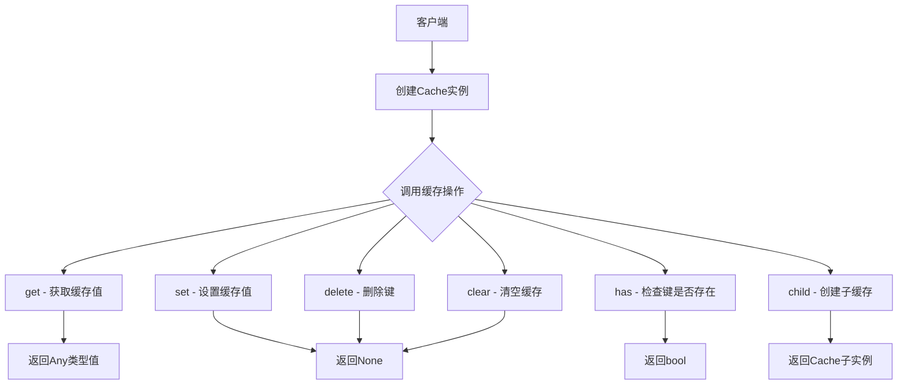
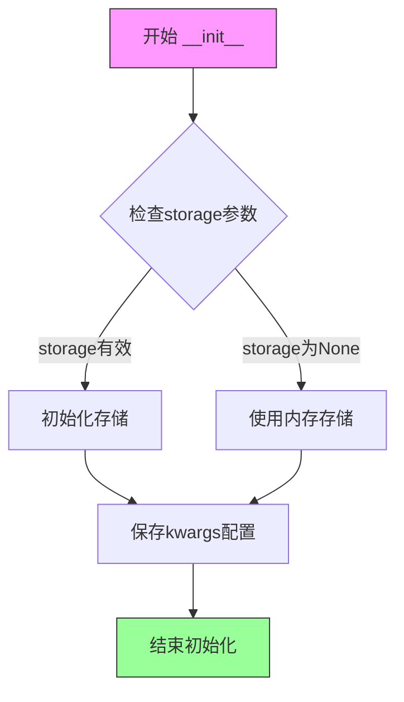
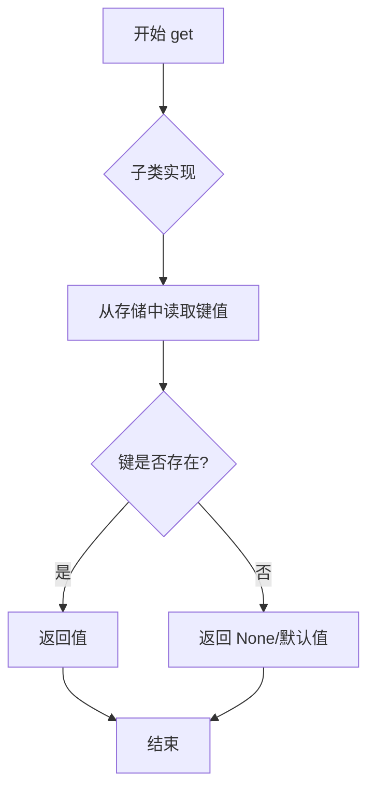
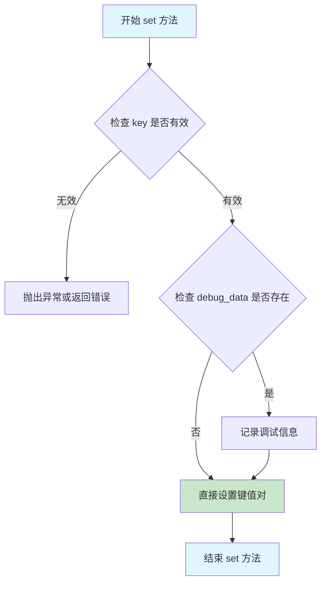
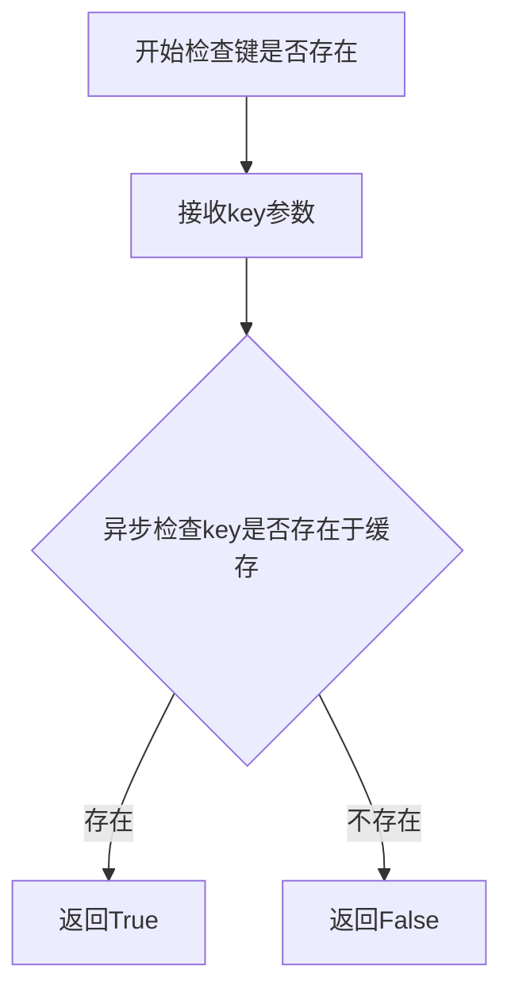
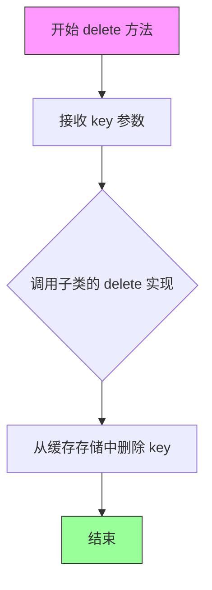
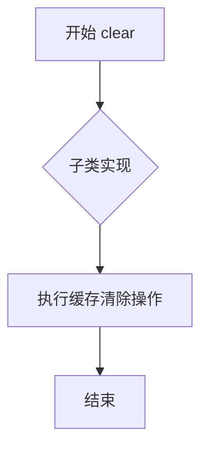
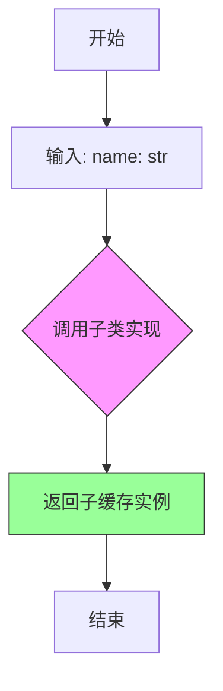

# `graphrag\packages\graphrag-cache\graphrag_cache\cache.py` 详细设计文档

这是一个缓存抽象基类，为管道系统提供统一的缓存接口契约，定义了get、set、has、delete、clear和child等异步缓存操作方法。

## 整体流程



## 类结构

```
Cache (抽象基类)
└── [具体实现类待定义]
```

## 全局变量及字段


    

## 全局函数及方法


### `Cache.__init__`

创建一个缓存实例，初始化抽象基类Cache，接受一个可选的存储对象和额外关键字参数。

参数：

- `storage`：`Storage | None`，用于缓存的底层存储对象，可以为None
- `**kwargs`：`Any`，额外的关键字参数，用于传递子类所需的配置选项

返回值：`None`，该方法不返回任何值

#### 流程图



#### 带注释源码

```python
@abstractmethod
def __init__(self, *, storage: Storage | None, **kwargs: Any) -> None:
    """Create a cache instance.
    
    抽象方法，由子类实现具体初始化逻辑。
    使用keyword-only参数（*之后）强制使用命名参数。
    
    Args:
        storage: 可选的存储后端，用于持久化缓存数据
        **kwargs: 额外的配置参数，将传递给子类的初始化逻辑
    """
```


### `Cache.get`

获取缓存中指定键对应的值。

参数：

- `key`：`str`，要获取值的键

返回值：`Any`，给定键对应的值；如果键不存在，返回 `None`（取决于具体实现）

#### 流程图



#### 带注释源码

```python
@abstractmethod
async def get(self, key: str) -> Any:
    """Get the value for the given key.

    Args:
        - key - The key to get the value for.
        - as_bytes - Whether or not to return the value as bytes.

    Returns
    -------
        - output - The value for the given key.
    """
    # 抽象方法，由子类实现具体逻辑
    # 1. 接收 key 参数
    # 2. 访问底层存储系统
    # 3. 查找并返回对应的值
    # 4. 如果键不存在，返回 None 或默认值
    pass
```


### `Cache.set`

设置给定键的值到缓存中。

参数：

-  `key`：`str`，要设置的键
-  `value`：`Any`，要设置的值
-  `debug_data`：`dict | None`，可选的调试数据，默认为 None

返回值：`None`，无返回值

#### 流程图



#### 带注释源码

```python
@abstractmethod
async def set(self, key: str, value: Any, debug_data: dict | None = None) -> None:
    """Set the value for the given key.

    Args:
        - key: The key to set the value for.
        - value: The value to set.
        - debug_data: Optional debug data to associate with this cache operation.
    """
    # 抽象方法，由子类实现具体逻辑
    # 1. 验证 key 参数非空且符合命名规范
    # 2. 将 value 序列化（如需要）并存储到缓存存储后端
    # 3. 如果提供了 debug_data，将其附加到缓存条目元数据中
    # 4. 更新缓存索引或统计信息
    pass
```

#### 设计说明

- **方法类型**：异步抽象方法（`async def`），由子类实现具体缓存机制
- **多态性**：不同存储后端（内存、文件、Redis 等）可实现不同的 `set` 逻辑
- **debug_data 参数**：用于存储调试/追踪信息，不影响核心缓存功能
- **线程安全**：具体实现需考虑并发写入场景


### `Cache.has`

返回 True 如果给定的键存在于缓存中。

参数：

- `key`：`str`，要检查的键

返回值：`bool`，如果键存在于缓存中返回 True，否则返回 False

#### 流程图



#### 带注释源码

```python
@abstractmethod
async def has(self, key: str) -> bool:
    """Return True if the given key exists in the cache.

    Args:
        - key: The key to check for.

    Returns
    -------
        - output: True if the key exists in the cache, False otherwise.
    """
```


### `Cache.delete`

删除缓存中给定的键。

参数：

-  `key`：`str`，要删除的键

返回值：`None`，无返回值描述

#### 流程图



#### 带注释源码

```python
@abstractmethod
async def delete(self, key: str) -> None:
    """Delete the given key from the cache.

    Args:
        - key - The key to delete.
    """
    # 抽象方法，由子类实现具体逻辑
    # 参数：
    #   - key: 要删除的缓存键（字符串类型）
    # 返回值：
    #   - None（无返回值）
    # 注意：这是一个抽象方法，具体删除逻辑由子类实现
```


### `Cache.clear`

清除缓存中的所有数据。

参数：

- 无（仅包含隐式 `self` 参数）

返回值：`None`，无返回值描述

#### 流程图



#### 带注释源码

```python
@abstractmethod
async def clear(self) -> None:
    """Clear the cache."""
    # 该方法为抽象方法，由子类实现具体的清除逻辑
    # 功能：清空缓存中所有存储的键值对
    # 返回值：无（None）
```


### `Cache.child`

创建一个子缓存实例，用于实现缓存的命名空间隔离或分层缓存。

参数：

-  `name`：`str`，用于创建子缓存的名称

返回值：`Cache`，返回新创建的子缓存实例

#### 流程图



#### 带注释源码

```python
@abstractmethod
def child(self, name: str) -> Cache:
    """Create a child cache with the given name.

    Args:
        - name - The name to create the sub cache with.
    """
    # 抽象方法，由子类实现具体的子缓存创建逻辑
    # 参数 name: str - 子缓存的名称，用于标识和隔离缓存空间
    # 返回值: Cache - 返回新创建的子缓存实例
    pass
```

## 关键组件


### Cache 抽象基类

提供缓存接口的抽象基类，定义了缓存操作的标准接口，包括获取、设置、删除、清空和创建子缓存等操作。

### 异步缓存操作接口

定义了五个异步抽象方法（get、set、has、delete、clear），用于支持异步缓存操作，允许实现类提供高效的异步实现。

### 子缓存创建机制

child 抽象方法支持创建命名子缓存，用于实现缓存的层级结构或命名空间隔离。

### Storage 依赖注入

通过构造函数接受 Storage 参数，支持灵活的后端存储实现，体现了依赖注入的设计模式。


## 问题及建议


### 已知问题

-   **抽象方法签名问题**：`__init__` 被定义为抽象方法不够合理，Python 中抽象基类的构造函数通常不需要标记为 `@abstractmethod`，且子类实现时会遇到初始化顺序问题
-   **文档字符串与签名不一致**：`get` 方法的文档中提到了 `as_bytes` 参数，但实际方法签名中并不存在此参数，会导致文档误导
-   **文档字符串不完整**：`set` 方法缺少返回值描述，参数列表中缺少 `debug_data` 的说明
-   **类型注解不够精确**：`child` 方法返回 `Cache` 类型，但实际应返回子类自身类型以支持链式调用
-   **缺少缓存核心功能抽象**：没有定义缓存容量限制、过期时间(TTL)、序列化方式等常见缓存功能接口

### 优化建议

-   将 `__init__` 从抽象方法改为普通方法或添加默认实现，提供基础初始化逻辑
-   统一文档字符串与实际方法签名，移除不存在的 `as_bytes` 参数描述，或将其添加到方法签名中
-   完善 `set` 方法的文档，添加 `debug_data` 参数说明和返回值描述
-   使用泛型改进 `child` 方法的返回类型注解，如 `def child(self, name: str) -> "Cache"` 或使用 Self 类型
-   考虑扩展抽象接口，增加如 `get_many`、`set_many`、`expire`、`ttl` 等常见缓存操作方法
-   添加 `__repr__` 或 `__str__` 方法以便于调试

## 其它


### 设计目标与约束

**设计目标**：定义统一的缓存抽象接口，为数据处理管道提供通用的缓存能力，支持键值存储、子缓存隔离和异步操作。

**设计约束**：
- 必须继承自 ABC 类，实现抽象方法
- 所有缓存操作均为异步方法（async/await）
- 存储后端通过依赖注入的 Storage 接口实现
- 子缓存（child）方法用于实现命名空间隔离

### 错误处理与异常设计

- 抽象基类本身不处理具体异常，由具体实现类负责
- 常见异常场景：存储连接失败、键不存在、序列化/反序列化失败
- 建议具体实现类定义自定义异常类，如 CacheError、KeyNotFoundError 等
- 建议在 get 方法中处理键不存在的情况（返回 None 或抛出特定异常）

### 数据流与状态机

**数据流**：
- 写入流程：调用 set(key, value) → 存储后端序列化 → 写入 Storage
- 读取流程：调用 get(key) → 存储后端读取 → 反序列化 → 返回结果
- 删除流程：调用 delete(key) → 存储后端移除对应键值

**状态机**：
- 缓存实例生命周期：初始化 → 就绪（可读写）→ 已关闭/销毁
- 状态转换：new → ready → closed

### 外部依赖与接口契约

**外部依赖**：
- `graphrag_storage.Storage` - 存储后端接口，需在运行时注入
- `abc.ABC` - Python 抽象基类
- `typing.TYPE_CHECKING` - 类型检查时导入，避免循环依赖

**接口契约**：
- `__init__`：接收 storage 参数（可选）和额外关键字参数
- `get`：输入键字符串，返回任意类型值或 None
- `set`：输入键、值，可选调试数据，无返回值
- `has`：输入键字符串，返回布尔值
- `delete`：输入键字符串，无返回值
- `clear`：无参数，无返回值
- `child`：输入名称字符串，返回新的 Cache 实例

### 序列化与反序列化策略

- 具体实现类需处理值的序列化（Python 对象 → 字节流/字符串）
- 建议支持 JSON 或 Pickle 序列化格式
- 序列化策略可通过初始化参数配置
- debug_data 参数用于存储调试相关信息（如时间戳、来源等）

### 并发与线程安全性

- 抽象方法定义为 async，表明支持异步并发调用
- 具体实现需确保并发安全（使用锁或其他同步机制）
- 多线程环境下需考虑 GIL 影响

### 扩展性考虑

- 可通过子类扩展实现不同的存储后端（内存、文件、Redis 等）
- child 方法支持分层缓存命名空间
- kwargs 参数支持向后兼容的新增配置选项

### 测试策略建议

- 单元测试：测试各抽象方法的签名和基本行为
- 集成测试：使用 mock Storage 测试具体缓存实现
- 性能测试：评估并发读写场景下的吞吐量
- 边界测试：测试空值、大键值、超大缓存等极端场景

    