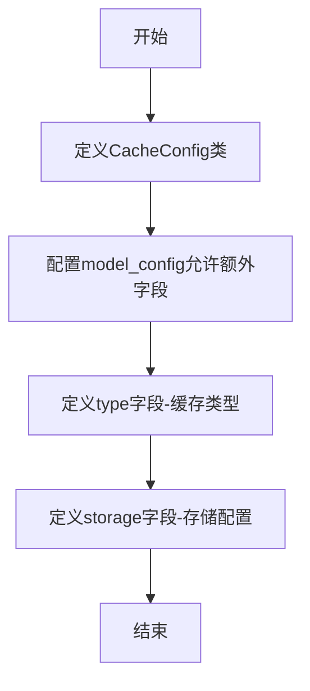
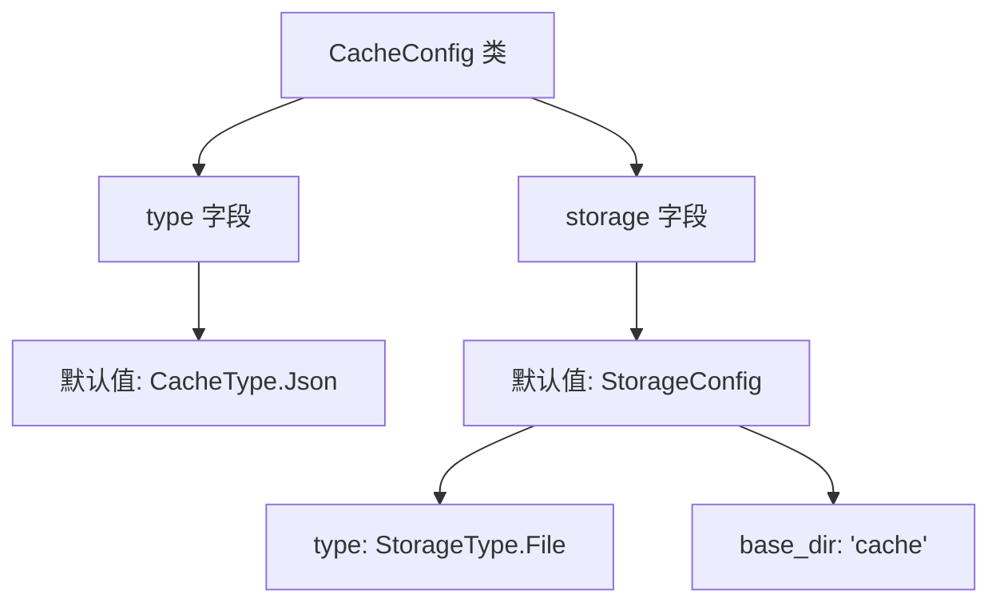

# `graphrag\packages\graphrag-cache\graphrag_cache\cache_config.py` 详细设计文档

这是一个缓存配置模型，定义了缓存的类型和存储配置。该模型基于 Pydantic 的 BaseModel，允许使用内置的缓存类型（Json、Memory、Noop）并支持自定义缓存实现。

## 整体流程



## 类结构

```
CacheConfig (Pydantic BaseModel)
└── 依赖: StorageConfig (graphrag_storage)
└── 依赖: CacheType (graphrag_cache)
```

## 全局变量及字段


### `CacheConfig.model_config`
    
Pydantic模型配置，允许额外字段支持自定义缓存实现

类型：`ConfigDict`
    


### `CacheConfig.type`
    
缓存类型，支持'Json'、'Memory'和'Noop'，默认为CacheType.Json

类型：`str`
    


### `CacheConfig.storage`
    
文件缓存的存储配置，默认为File类型，base_dir为'cache'

类型：`StorageConfig | None`
    
    

## 全局函数及方法


## 关键组件


### 整体描述

该代码定义了一个 Pydantic 配置模型类 `CacheConfig`，用于配置缓存系统的类型和存储后端，支持 Json、Memory 和 Noop 三种内置缓存类型，并允许通过 `storage` 字段配置文件型缓存的存储方式，同时通过 `extra="allow"` 支持自定义缓存实现扩展。

### 文件运行流程

该模块为配置定义模块，无运行时流程。导入时加载依赖项（`graphrag_storage.StorageConfig`、`graphrag_storage.StorageType`、`pydantic.BaseModel`、`pydantic.ConfigDict`、`pydantic.Field`、`graphrag_cache.cache_type.CacheType`），定义 `CacheConfig` 类供其他模块实例化使用。

### 类详细信息

#### CacheConfig 类

**类字段：**

| 字段名称 | 类型 | 描述 |
|---------|------|------|
| type | str | 缓存类型，支持 'Json'、'Memory'、'Noop' 三种内置类型，默认为 CacheType.Json |
| storage | StorageConfig \| None | 文件型缓存的存储配置，默认为 StorageConfig(type=StorageType.File, base_dir="cache") |

**类方法：**

该类继承自 Pydantic BaseModel，未显式定义方法，依赖 Pydantic 自动生成的初始化、验证、序列化等方法。

**Mermaid 流程图：**



**带注释源码：**

```python
class CacheConfig(BaseModel):
    """The configuration section for cache."""

    model_config = ConfigDict(extra="allow")
    """Allow extra fields to support custom cache implementations."""

    type: str = Field(
        description="The cache type to use. Builtin types include 'Json', 'Memory', and 'Noop'.",
        default=CacheType.Json,
    )

    storage: StorageConfig | None = Field(
        description="The storage configuration to use for file-based caches such as 'Json'.",
        default_factory=lambda: StorageConfig(type=StorageType.File, base_dir="cache"),
    )
```

### 关键组件信息

| 组件名称 | 描述 |
|---------|------|
| CacheConfig | 缓存配置模型类，基于 Pydantic BaseModel，用于定义缓存系统的类型和存储配置 |
| type 字段 | 缓存类型选择器，支持 Json、Memory、Noop 三种内置类型 |
| storage 字段 | 存储后端配置，支持文件型缓存的存储路径和类型设置 |
| extra="allow" | 允许扩展字段的设计，支持自定义缓存实现接入 |

### 潜在技术债务或优化空间

1. **类型注解兼容性**：`StorageConfig | None` 使用 Python 3.10+ 的联合类型语法，对更低版本 Python 不兼容，需考虑使用 `Optional[StorageConfig]` 提升兼容性
2. **默认值工厂**：使用 `lambda` 创建默认 StorageConfig，可考虑提取为具名函数提升可读性和可测试性
3. **配置验证缺失**：未对 `type` 字段值进行枚举验证，可添加_validator 确保值在允许的缓存类型范围内
4. **文档完善**：缺少类级别的文档说明使用方式和示例

### 其它项目

**设计目标与约束：**
- 目标：提供统一的缓存配置接口，支持多种缓存类型和存储后端
- 约束：通过 Pydantic 实现配置验证和自动文档生成

**错误处理与异常设计：**
- 依赖 Pydantic 自动验证配置字段类型和值，验证失败时抛出 ValidationError

**数据流与状态机：**
- 配置数据流：外部配置源（YAML/JSON）→ Pydantic 模型验证 → CacheConfig 实例 → 缓存初始化器使用

**外部依赖与接口契约：**
- 依赖 `graphrag_storage.StorageConfig`、`graphrag_storage.StorageType`、`graphrag_cache.cache_type.CacheType`
- 接口：CacheConfig 实例化后传递给缓存初始化器


## 问题及建议


### 已知问题

-   **类型注解不一致**：`type` 字段的类型注解为 `str`，但实际取值应受限于 `CacheType` 枚举（如 'Json'、'Memory'、'Noop'），类型安全不足，可能导致运行时错误。
-   **默认值工厂使用方式**：使用 `lambda` 作为 `default_factory` 不够规范，应使用 `default_factory` 直接指向工厂函数或类。
-   **缺少值验证**：未对 `type` 字段的值进行校验，允许传入任意字符串而不仅仅是有效的 `CacheType` 值。
-   **storage 字段的条件逻辑缺失**：当 `type` 为 'Memory' 或 'Noop' 时，`storage` 字段不应被需要，但当前模型未体现这种互斥关系，可能导致配置冗余或混淆。
-   **文档注释不够详细**：类和方法缺少更详细的使用说明和示例。

### 优化建议

-   **修正类型注解**：将 `type` 字段的类型从 `str` 改为 `CacheType`，以确保类型安全，并更新默认值为 `CacheType.Json`。
-   **简化默认值定义**：将 `default_factory=lambda: StorageConfig(...)` 改为 `default_factory=StorageConfig` 或定义一个工厂函数。
-   **添加字段验证**：使用 Pydantic 的 `field_validator` 或 `BeforeValidator` 验证 `type` 字段的值是否属于有效的 `CacheType`。
-   **条件性配置建模**：考虑使用 Pydantic 的 `PrivateAttr` 或模型继承来区分需要 storage 和不需要 storage 的缓存类型。
-   **增强文档**：为类添加更详细的文档字符串，说明各配置项的用途和约束条件。

## 其它


### 设计目标与约束

该配置类的设计目标是为缓存系统提供统一、可扩展的配置管理机制。核心约束包括：1）必须支持内置的三种缓存类型（Json、Memory、Noop）；2）storage 字段仅对文件型缓存（如Json）有意义；3）通过 Pydantic 的 extra="allow" 支持自定义缓存实现的扩展；4）必须保持与 StorageConfig 和 CacheType 的类型兼容性。

### 错误处理与异常设计

配置层面的错误处理主要依赖 Pydantic 的内置验证机制。当 type 字段传入非法的缓存类型字符串时，会在模型验证阶段抛出 ValidationError。storage 字段为可选字段，当为 None 时，缓存实现应根据 type 类型决定是否使用默认存储配置。对于自定义缓存类型，额外的配置字段会被静默接受，这要求调用方自行保证配置的正确性。

### 外部依赖与接口契约

该模块依赖两个外部包：1）graphrag_storage 包中的 StorageConfig 和 StorageType，用于定义文件存储的配置结构；2）graphrag_cache 包中的 CacheType 枚举，定义了内置缓存类型的常量。接口契约方面：type 字段接收字符串类型的缓存类型标识符；storage 字段接收 StorageConfig 对象或 None；模型支持通过 .model_dump() 和 .model_validate() 进行序列化和反序列化。

### 配置使用场景与默认值策略

type 字段默认值为 CacheType.Json，指向基于文件的 JSON 缓存实现。storage 字段采用延迟初始化策略，使用 default_factory 创建默认的 StorageConfig（File 类型，base_dir 为 "cache"）。这种设计允许用户在多数场景下仅配置 type 即可，对文件缓存场景可自定义 storage 参数。

### 扩展性设计

通过 ConfigDict(extra="allow") 配置，CacheConfig 允许接收未在模型中定义的额外字段。这为自定义缓存实现提供了配置扩展能力，第三方缓存插件可以通过传入额外的配置项来满足其特定需求。调用方在实例化时应根据具体缓存实现类型传递相应的配置参数。


    