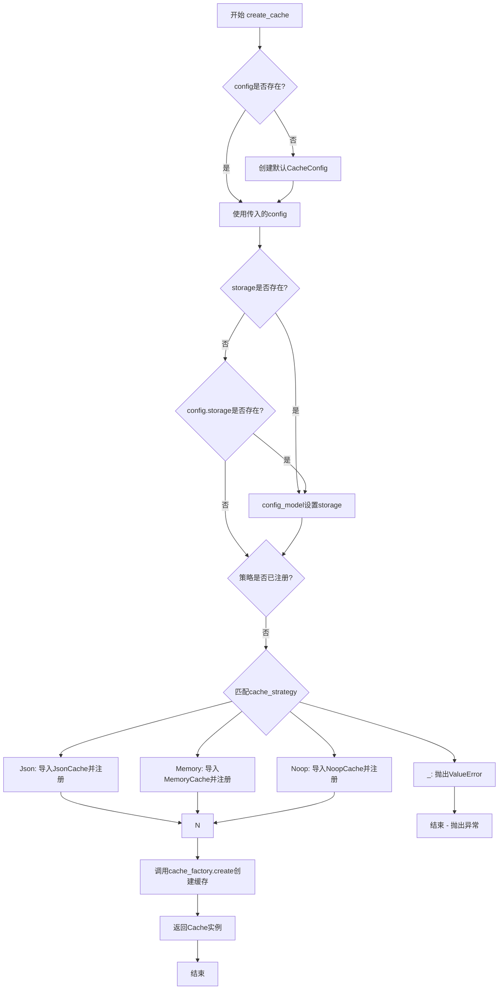
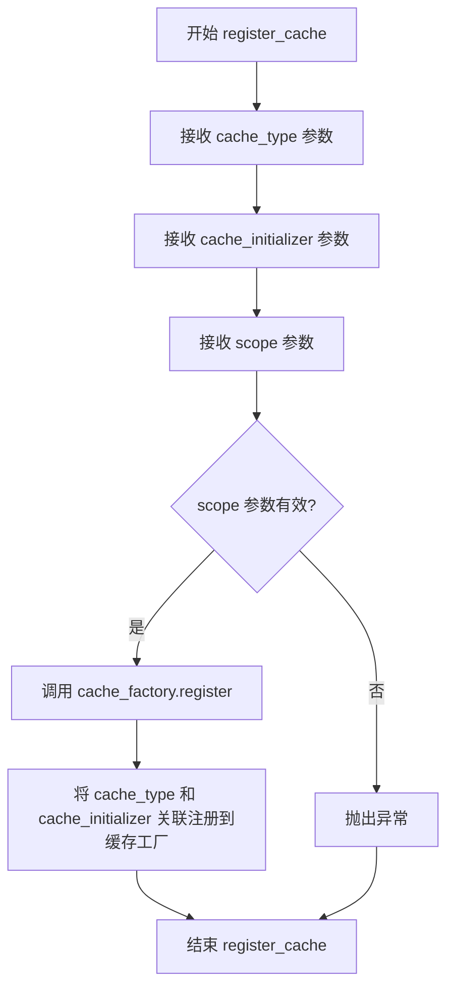
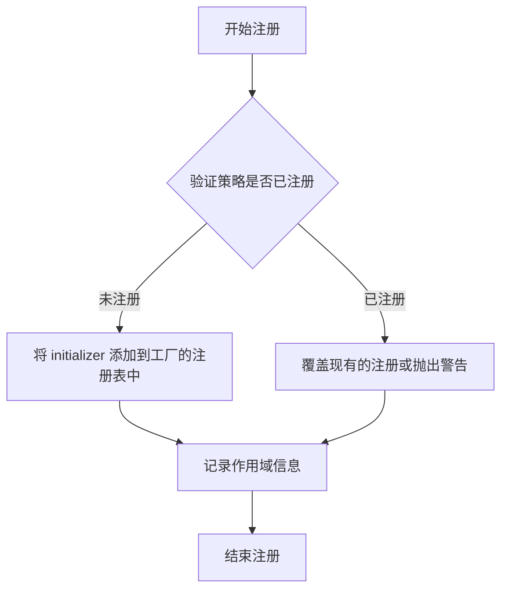
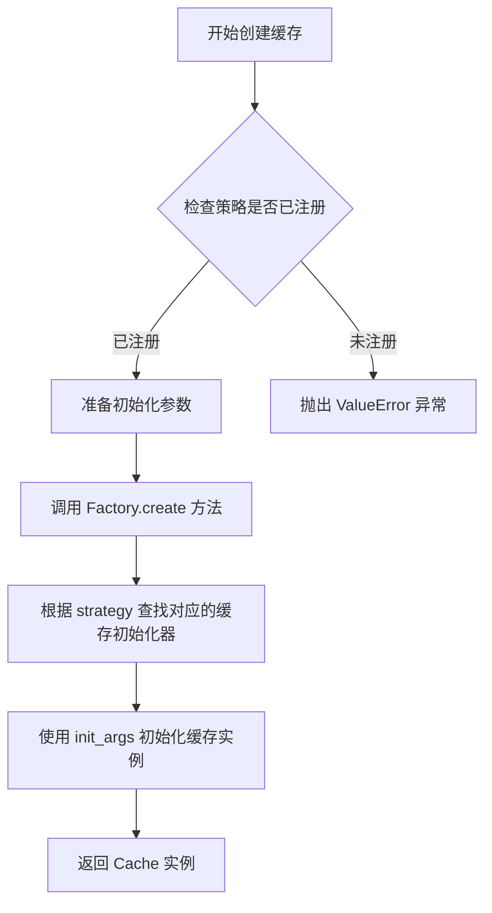
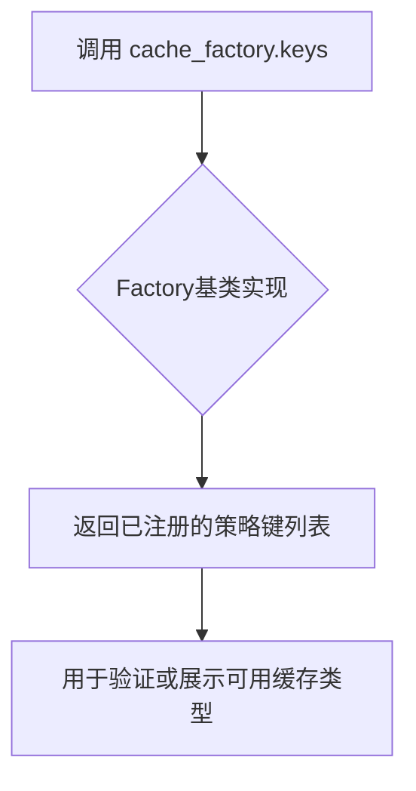

# `graphrag\packages\graphrag-cache\graphrag_cache\cache_factory.py` 详细设计文档

一个缓存工厂实现模块，通过工厂模式动态注册和创建不同类型的缓存实现（如Json、Memory、Noop），支持根据CacheConfig配置和可选的Storage实例创建相应的缓存对象。

## 整体流程



## 类结构

```
Factory<T> (抽象基类)
└── CacheFactory (缓存工厂实现类)
```

## 全局变量及字段


### `cache_factory`
    
缓存工厂的单例实例，用于根据配置创建不同类型的缓存实现（如Json、Memory、Noop等）

类型：`CacheFactory`
    


    

## 全局函数及方法


### `register_cache`

该函数用于将自定义缓存实现注册到缓存工厂中，允许系统根据缓存类型标识符动态创建相应的缓存实例。

参数：

- `cache_type`：`str`，缓存类型标识符，用于唯一标识一种缓存实现
- `cache_initializer`：`Callable[..., Cache]`，缓存初始化器函数，负责创建缓存实例
- `scope`：`ServiceScope`，服务作用域，默认为 `"transient"`，控制缓存实例的生命周期

返回值：`None`，该函数无返回值，仅执行注册操作

#### 流程图



#### 带注释源码

```python
def register_cache(
    cache_type: str,                        # 缓存类型标识符字符串
    cache_initializer: Callable[..., Cache], # 可调用的缓存初始化器，返回 Cache 实例
    scope: ServiceScope = "transient",       # 服务作用域，默认瞬态模式
) -> None:                                    # 无返回值
    """Register a custom cache implementation.

    Args
    ----
        - cache_type: str
            The cache id to register.
        - cache_initializer: Callable[..., Cache]
            The cache initializer to register.
    """
    # 调用缓存工厂的 register 方法，将缓存类型和初始化器注册到工厂中
    # scope 参数控制缓存实例的创建策略（单例、瞬态等）
    cache_factory.register(cache_type, cache_initializer, scope)
```


### `create_cache`

该函数是缓存工厂的核心方法，负责根据传入的配置对象动态创建不同类型的缓存实例（Json、Memory或Noop），支持自动注册未知的缓存类型，并可选地注入存储层。

参数：

- `config`：`CacheConfig | None`，缓存配置对象，用于指定缓存类型及其他配置参数，默认为 None 时使用空配置
- `storage`：`Storage | None`，存储实现对象，用于文件型缓存（如 JsonCache），默认为 None

返回值：`Cache`，返回创建的缓存实现实例

#### 流程图

```mermaid
flowchart TD
    A([开始 create_cache]) --> B{config is None?}
    B -->|是| C[config = CacheConfig()]
    B -->|否| D[config_model = config.model_dump]
    C --> D
    D --> E[cache_strategy = config.type]
    E --> F{storage is None and config.storage exists?}
    F -->|是| G[storage = create_storageconfig.storage]
    F -->|否| H{cache_strategy in cache_factory?}
    G --> H
    H -->|否| I{cache_strategy == Json?}
    I -->|是| J[导入 JsonCache 并注册]
    I -->|否| K{cache_strategy == Memory?}
    K -->|是| L[导入 MemoryCache 并注册]
    K -->|否| M{cache_strategy == Noop?}
    M -->|是| N[导入 NoopCache 并注册]
    M -->|否| O[抛出 ValueError 异常]
    J --> P{cache_strategy in cache_factory?}
    L --> P
    N --> P
    P -->|是| Q{storage exists?}
    Q -->|是| R[config_model['storage'] = storage]
    Q -->|否| S[return cache_factory.create]
    R --> S
    S --> T([返回 Cache 实例])
    O --> T
```

#### 带注释源码

```python
def create_cache(
    config: CacheConfig | None = None, storage: Storage | None = None
) -> "Cache":
    """Create a cache implementation based on the given configuration.

    Args
    ----
        - config: CacheConfig
            The cache configuration to use.
        - storage: Storage | None
            The storage implementation to use for file-based caches such as 'Json'.

    Returns
    -------
        Cache
            The created cache implementation.
    """
    # 如果config为None，使用默认的空配置
    config = config or CacheConfig()
    # 将配置对象转换为字典模型
    config_model = config.model_dump()
    # 获取缓存策略类型
    cache_strategy = config.type

    # 如果未提供storage但配置中指定了storage配置，则根据配置创建storage实例
    if not storage and config.storage:
        storage = create_storage(config.storage)

    # 如果缓存策略未在工厂中注册，则进行动态注册
    if cache_strategy not in cache_factory:
        match cache_strategy:
            # Json类型缓存：导入并注册JsonCache实现
            case CacheType.Json:
                from graphrag_cache.json_cache import JsonCache

                register_cache(CacheType.Json, JsonCache)

            # Memory类型缓存：导入并注册MemoryCache实现
            case CacheType.Memory:
                from graphrag_cache.memory_cache import MemoryCache

                register_cache(CacheType.Memory, MemoryCache)

            # Noop类型缓存：导入并注册NoopCache实现（无操作缓存）
            case CacheType.Noop:
                from graphrag_cache.noop_cache import NoopCache

                register_cache(CacheType.Noop, NoopCache)

            # 未支持的缓存类型：抛出详细的错误信息
            case _:
                msg = f"CacheConfig.type '{cache_strategy}' is not registered in the CacheFactory. Registered types: {', '.join(cache_factory.keys())}."
                raise ValueError(msg)

    # 如果提供了storage实例，将其注入到配置模型中
    if storage:
        config_model["storage"] = storage

    # 通过工厂模式创建缓存实例并返回
    return cache_factory.create(strategy=cache_strategy, init_args=config_model)
```


### `CacheFactory.register`

向工厂注册缓存实现，使得可以通过指定的缓存类型创建相应的缓存实例。

参数：

- `strategy`：`str`，要注册的缓存类型标识符（如 "Json"、"Memory"、"Noop"）
- `initializer`：`Callable[..., Cache]`，用于初始化缓存实例的可调用对象（通常是缓存类）
- `scope`：`ServiceScope`，作用域类型，默认为 "transient"（临时作用域）

返回值：`None`，无返回值

#### 流程图



#### 带注释源码

```python
# 假设以下为 Factory 基类中的 register 方法实现
def register(
    self,
    strategy: str,
    initializer: Callable[..., T],
    scope: ServiceScope = "transient",
) -> None:
    """注册一个策略及其初始化器。

    Args:
        strategy: 策略标识符，用于后续创建实例时指定类型
        initializer: 可调用对象，用于创建策略实例
        scope: 作用域，控制实例的生命周期（transient/singleton 等）

    Returns:
        None

    Note:
        - 如果策略已存在，通常会覆盖旧注册
        - scope 参数用于控制实例创建策略
    """
    # 1. 验证 initializer 是可调用的
    if not callable(initializer):
        raise TypeError(f"initializer must be callable, got {type(initializer)}")

    # 2. 将策略和初始化器存储到内部注册表中
    self._registry[strategy] = {
        "initializer": initializer,
        "scope": scope,
    }

    # 3. 如果工厂已存在，返回值需确保一致
    return None
```

#### 使用示例源码

```python
# 在 create_cache 函数中的实际调用方式
def register_cache(
    cache_type: str,
    cache_initializer: Callable[..., Cache],
    scope: ServiceScope = "transient",
) -> None:
    """注册一个自定义缓存实现。

    Args:
        cache_type: str
            要注册的缓存类型标识符（如 "Json"、"Memory"）
        cache_initializer: Callable[..., Cache]
            缓存类的初始化器（类构造函数或工厂函数）
        scope: ServiceScope
            作用域类型，默认 "transient"

    Returns:
        None

    Example:
        >>> from graphrag_cache.memory_cache import MemoryCache
        >>> register_cache("Memory", MemoryCache, "transient")
    """
    # 调用工厂的 register 方法进行注册
    cache_factory.register(cache_type, cache_initializer, scope)
```


### `CacheFactory.create`

该方法继承自基类 `Factory`，用于根据指定的缓存策略和初始化参数创建具体的缓存实例。它是工厂模式的核心实现，通过策略名称从已注册的缓存类型中实例化相应的缓存对象。

参数：

- `strategy`：`str`，缓存策略标识符（如 "Json"、"Memory"、"Noop"），对应 `CacheType` 枚举值
- `init_args`：`dict[str, Any]`，传递给缓存初始化器的配置参数字典，包含缓存类型、存储配置等

返回值：`Cache`，创建完成的缓存实例对象

#### 流程图



#### 带注释源码

```python
# 由于 create 方法定义在基类 Factory 中，以下是对其调用逻辑的注释说明
# 来源于 create_cache 函数中对 cache_factory.create 的调用

# 1. 确定缓存策略（从配置中获取或默认）
cache_strategy = config.type

# 2. 检查是否需要动态注册缓存类型
if cache_strategy not in cache_factory:
    # 根据策略类型动态导入并注册对应的缓存类
    match cache_strategy:
        case CacheType.Json:
            from graphrag_cache.json_cache import JsonCache
            register_cache(CacheType.Json, JsonCache)
        case CacheType.Memory:
            from graphrag_cache.memory_cache import MemoryCache
            register_cache(CacheType.Memory, MemoryCache)
        case CacheType.Noop:
            from graphrag_cache.noop_cache import NoopCache
            register_cache(CacheType.Noop, NoopCache)
        case _:
            # 策略未注册且非预定义类型时抛出异常
            msg = f"CacheConfig.type '{cache_strategy}' is not registered..."
            raise ValueError(msg)

# 3. 如果提供了 storage，将其添加到初始化参数中
if storage:
    config_model["storage"] = storage

# 4. 调用 Factory.create 方法创建缓存实例
# create 方法签名（推断自基类）:
# def create(self, strategy: str, init_args: dict[str, Any]) -> Cache:
return cache_factory.create(strategy=cache_strategy, init_args=config_model)
```


### `CacheFactory.keys`

返回工厂中所有已注册的缓存类型键列表，用于获取当前已注册的所有缓存策略标识符。

参数：无需参数

返回值：`list[str]`，返回已注册的缓存类型键列表，可用于查询当前工厂支持的所有缓存策略。

#### 流程图



#### 带注释源码

```python
def keys(self) -> list[str]:
    """返回工厂中所有已注册的缓存类型键列表。
    
    此方法继承自Factory基类，用于获取当前已注册的所有缓存策略标识符。
    在create_cache函数中用于：
    1. 当传入未知的cache_strategy时，在错误信息中展示已注册的缓存类型
    2. 供外部调用者查询工厂支持哪些缓存实现
    
    Returns
    -------
        list[str]
            已注册的缓存类型键列表，例如 ['json', 'memory', 'noop']
    
    Example
    -------
        >>> cache_factory.keys()
        ['json', 'memory', 'noop']
    """
    # 具体实现来自 graphrag_common.factory.Factory 基类
    # 返回策略注册表中所有键的列表
```

## 关键组件


### CacheFactory

缓存工厂类，继承自通用工厂基类，用于管理和创建不同类型的缓存实现实例，支持注册和按需创建缓存策略。

### cache_factory

全局缓存工厂单例，提供缓存注册和创建的核心接口，支持动态注册新的缓存类型和根据配置实例化缓存。

### register_cache

用于注册自定义缓存实现的函数，允许外部扩展缓存类型，支持指定服务作用域（transient/singleton）。

### create_cache

主要的缓存创建函数，根据配置创建相应的缓存实例。自动处理未注册的缓存类型（惰性加载），支持注入存储实现，遵循工厂模式。

### CacheConfig

缓存配置类，定义缓存的类型、存储配置等参数，通过 model_dump 转换为字典格式供工厂使用。

### CacheType

缓存类型枚举，定义支持的缓存实现类型（Json、Memory、Noop），用于配置和策略匹配。

### 惰性加载机制

代码采用惰性加载模式，在 `create_cache` 函数中根据缓存类型按需导入对应的缓存实现类，避免启动时加载所有依赖，提高初始化效率。

### 工厂注册模式

通过 `register_cache` 函数动态注册缓存实现，配合 `CacheFactory` 的策略模式，支持运行时扩展新的缓存类型。

### 存储集成

支持将 Storage 实现注入到缓存配置中，特别是文件型缓存（如 JsonCache），通过 `create_storage` 工厂函数根据配置创建存储实例。

### 错误处理

对于未注册的缓存类型，抛出明确的 ValueError 异常，包含当前已注册的类型列表，便于调试和排查配置问题。


## 问题及建议


### 已知问题

-   **动态导入重复执行**：每次调用 `create_cache` 时，如果缓存类型未注册，都会执行动态导入和 `register_cache` 操作，导致重复的模块加载和注册逻辑执行
-   **配置重复处理**：`config.storage` 被用于创建 `storage` 对象，随后又在 `config_model["storage"] = storage` 中覆盖，逻辑冗余且容易造成混淆
-   **类型不一致风险**：`cache_strategy` 是 `CacheType` 枚举类型，但在与 `cache_factory` 比较时可能被当作字符串处理，存在类型不匹配隐患
-   **缺少实例缓存机制**：`create_cache` 每次调用都创建新实例，对于单例或持久化场景，没有提供获取已创建缓存实例的接口
-   **循环类型注解**：返回类型使用字符串形式的 `"Cache"` 而非直接类型，表明存在循环导入问题，这是架构设计中的技术债务信号

### 优化建议

-   **预注册缓存类型**：在模块初始化时将所有内置缓存类型（Json、Memory、Noop）预先注册，而非在 `create_cache` 运行时动态注册，消除重复导入开销
-   **简化配置处理逻辑**：移除冗余的 `config.storage` 检查，直接使用传入的 `storage` 参数或由配置内部处理
-   **添加实例缓存/复用机制**：根据 `scope` 参数实现实例缓存逻辑，对于 "singleton" 作用域的缓存，应复用已创建的实例
-   **统一类型处理**：确保 `CacheType` 枚举与工厂内部存储的类型一致，避免隐式类型转换
-   **解决循环导入**：通过类型重定向或重构模块依赖关系，消除使用字符串返回类型的必要性

## 其它


### 设计目标与约束

本模块的设计目标是提供一个统一的缓存工厂机制，支持多种缓存策略（Memory、Json、Noop）的动态创建与注册，使得缓存实现可以在运行时灵活切换。核心约束包括：1）必须实现Cache接口；2）支持自定义缓存类型的注册；3）配置通过CacheConfig传递；4）Storage仅用于文件型缓存（如JsonCache）。

### 错误处理与异常设计

代码中的异常处理主要体现在create_cache函数的末尾：当指定的cache_strategy未在工厂中注册时，会抛出ValueError并附带详细的错误信息（包括传入的类型和已注册的类型列表）。此外，config.model_dump()可能抛出验证异常，create_storage可能抛出初始化异常，这些由调用方处理。设计建议：可增加对config类型为None的处理日志，或在注册失败时提供更友好的错误码。

### 数据流与状态机

数据流：调用方传入CacheConfig → create_cache检查config是否存在 → 根据config.type获取cache_strategy → 如未注册则动态导入并注册对应Cache类 → 如有storage参数则创建Storage实例并注入config_model → 调用cache_factory.create创建具体缓存实例并返回。状态机：初始状态（CacheConfig为空）→ 默认配置状态 → 策略注册状态 → 缓存实例化状态。

### 外部依赖与接口契约

外部依赖包括：1）graphrag_common.factory.Factory和ServiceScope；2）graphrag_storage.Storage和create_storage；3）graphrag_cache.cache模块的Cache基类；4）graphrag_cache.cache_config.CacheConfig；5）graphrag_cache.cache_type.CacheType枚举。接口契约：CacheFactory.register接受cache_type字符串和Cache初始化器；create_cache接受可选的CacheConfig和Storage，返回Cache实例。

### 配置管理

CacheConfig使用pydantic模型（.model_dump()），支持通过配置文件或代码方式设置。关键配置项包括：type（CacheType枚举）、storage（存储配置字典，传入create_storage）。配置示例：CacheConfig(type=CacheType.Json, storage={"type": "file", "path": "./cache"})。

### 线程安全与并发考虑

当前实现未显式处理线程安全。cache_factory.register在多线程环境下可能出现竞态条件，建议使用线程锁保护。MemoryCache需确认是否线程安全。JsonCache依赖底层Storage的并发实现。

### 扩展性设计

扩展点：1）新增CacheType枚举值；2）通过register_cache注册自定义缓存实现；3）通过scope参数控制缓存实例生命周期（transient/singleton）。扩展示例：在其他模块中导入cache_factory并调用register_cache注册自定义缓存类。

### 性能考量

动态导入（from ... import）在每次未命中注册表时触发，存在一定的性能开销，建议考虑启动时预注册。cache_factory.create每次调用都会创建新实例（transient scope），如需复用应使用单例scope。config.model_dump()在每次调用时执行，可考虑缓存配置序列化结果。

### 测试建议

建议覆盖：1）create_cache使用所有已知CacheType；2）create_cache传入自定义storage；3）register_cache后create_cache能正确创建；4）未支持类型抛出ValueError；5）空config使用默认配置；6）多线程注册场景。

    