# `graphrag\packages\graphrag-cache\graphrag_cache\cache_type.py` 详细设计文档

这是一个缓存类型枚举模块，定义了三种内置的缓存实现类型：JSON文件缓存、内存缓存和无操作缓存（noop），用于在应用程序中灵活选择不同的缓存策略。

## 整体流程

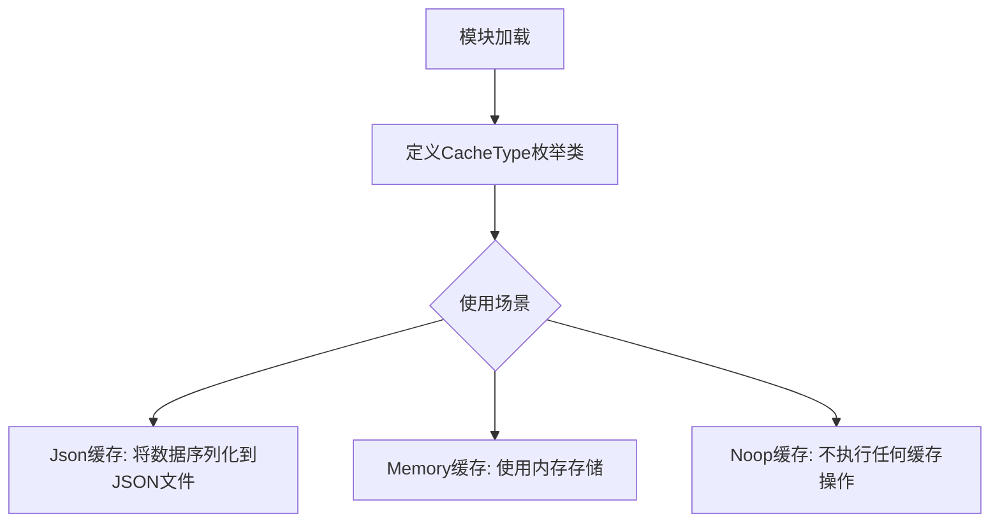

## 类结构

```
StrEnum (Python内置)
└── CacheType (自定义枚举类)
```

## 全局变量及字段


### `CacheType`
    
缓存类型的字符串枚举类，定义了JSON、内存和无操作三种缓存实现类型

类型：`StrEnum`
    


### `CacheType.CacheType.Json`
    
JSON格式的缓存类型，用于文件持久化缓存

类型：`CacheType`
    


### `CacheType.CacheType.Memory`
    
内存缓存类型，用于进程内临时缓存

类型：`CacheType`
    


### `CacheType.CacheType.Noop`
    
无操作缓存类型，用于禁用缓存功能的场景

类型：`CacheType`
    
    

## 全局函数及方法


我注意到给定的代码中CacheType类只定义了三个枚举成员（Json、Memory、Noop），并没有显式定义任何方法。所有可用的"方法"都继承自StrEnum基类。

让我列出从StrEnum继承的所有可用方法和属性：

### CacheType.name

获取枚举成员的名称。

参数：无

返回值：`str`，返回枚举成员的名称（如"Json"、"Memory"、"Noop"）

#### 流程图

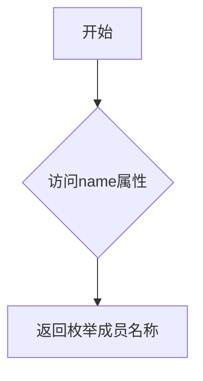

#### 带注释源码

```python
# 继承自Enum类的属性
# 返回枚举成员的名称（字符串）
# 示例：CacheType.Json.name 返回 "Json"
```

### CacheType.value

获取枚举成员的值。

参数：无

返回值：`str`，返回枚举成员的实际值（如"json"、"memory"、"none"）

#### 流程图

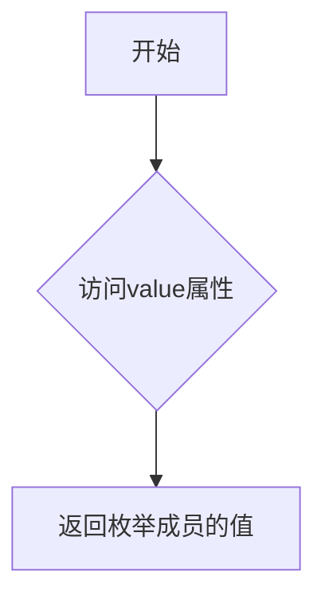

#### 带注释源码

```python
# 继承自StrEnum类的属性
# 返回枚举成员对应的字符串值
# 示例：CacheType.Json.value 返回 "json"
```

### CacheType.__str__()

返回枚举成员的字符串表示。

参数：无

返回值：`str`，返回枚举成员的字符串值

#### 流程图

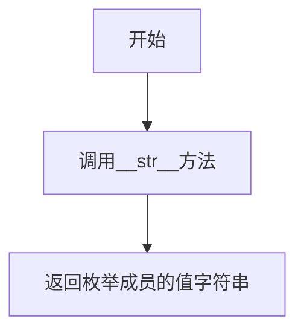

#### 带注释源码

```python
# 继承自StrEnum类的方法
# 返回枚举成员的值（与value属性相同）
# 示例：str(CacheType.Memory) 返回 "memory"
```

### CacheType.__repr__()

返回枚举成员的官方字符串表示。

参数：无

返回值：`str`，返回枚举成员的官方表示

#### 流程图

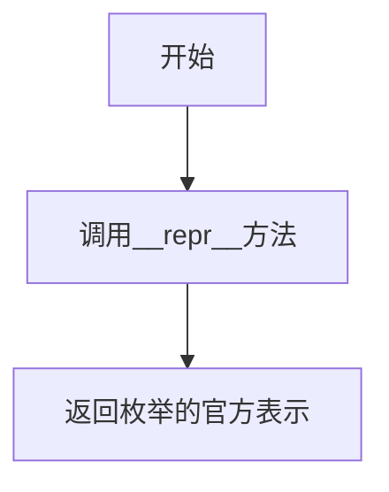

#### 带注释源码

```python
# 继承自Enum类的方法
# 返回枚举成员的官方表示
# 示例：repr(CacheType.Noop) 返回 "<CacheType.Noop: 'none'>"
```

### CacheType.__eq__()

比较枚举成员是否相等。

参数：

- `other`：比较对象，可以是枚举成员或字符串

返回值：`bool`，如果相等返回True

#### 流程图

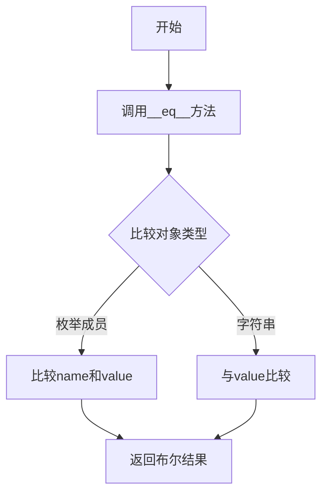

#### 带注释源码

```python
# 继承自StrEnum类的方法
# 支持与字符串直接比较
# 示例：CacheType.Json == "json" 返回 True
# 示例：CacheType.Json == CacheType.Json 返回 True
```

### CacheType.__hash__()

返回枚举成员的哈希值。

参数：无

返回值：`int`，返回枚举成员的哈希值

#### 流程图

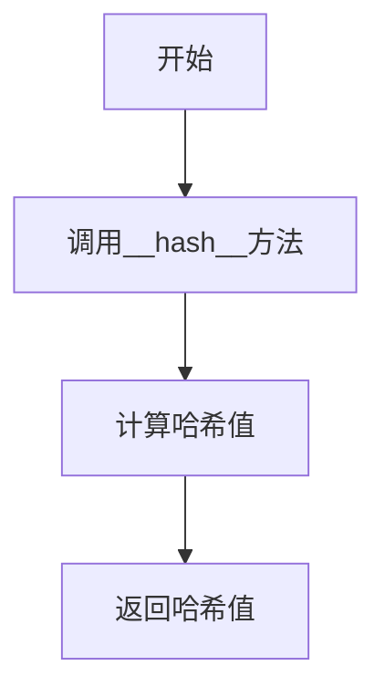

#### 带注释源码

```python
# 继承自Enum类的方法
# 使枚举成员可以用作字典键或放入集合中
# 示例：hash(CacheType.Json) 返回整数哈希值
```

### CacheType.__class__

获取枚举类的类型信息。

参数：无

返回值：`type`，返回枚举类本身

#### 流程图

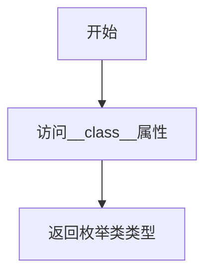

#### 带注释源码

```python
# 继承自Python对象基类
# 返回枚举类本身
# 示例：CacheType.Json.__class__ 返回 <class 'CacheType'>
```

### CacheType.__dict__

获取枚举成员的字典属性。

参数：无

返回值：`dict`，返回枚举成员的属性字典

#### 流程图

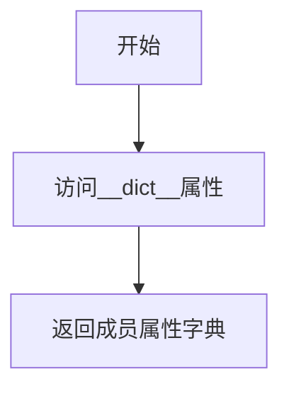

#### 带注释源码

```python
# 继承自Enum类
# 返回枚举成员的属性字典
# 示例：CacheType.Json.__dict__ 返回包含name和value的字典
```

### CacheType.__iter__()

迭代枚举成员。

参数：无

返回值：返回枚举成员的迭代器

#### 流程图

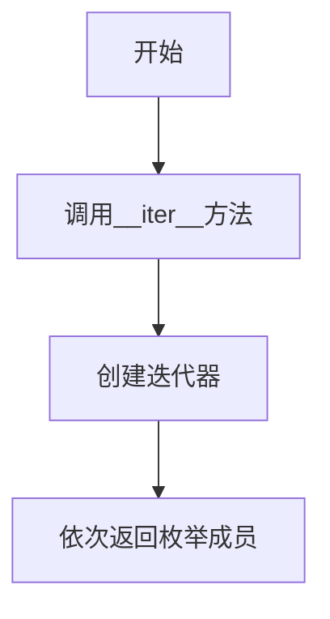

#### 带注释源码

```python
# 继承自Enum类的方法
# 允许遍历所有枚举成员
# 示例：for member in CacheType: print(member)
```

### CacheType.__len__()

获取枚举成员的数量。

参数：无

返回值：`int`，返回枚举成员的数量

#### 流程图

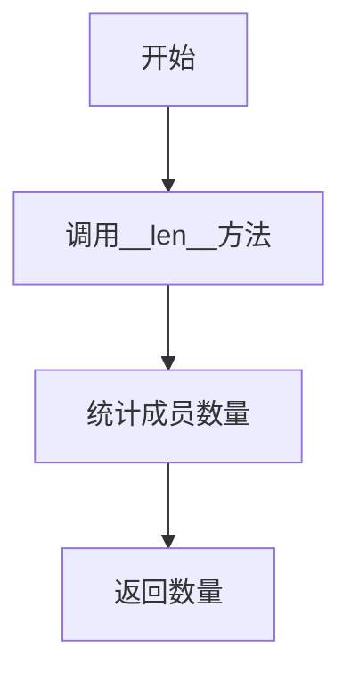

#### 带注释源码

```python
# 继承自Enum类的方法
# 返回枚举中成员的数量
# 示例：len(CacheType) 返回 3
```

### CacheType.__getitem__()

通过名称或索引访问枚举成员。

参数：

- `key`：字符串（成员名）或整数（索引）

返回值：对应的枚举成员

#### 流程图

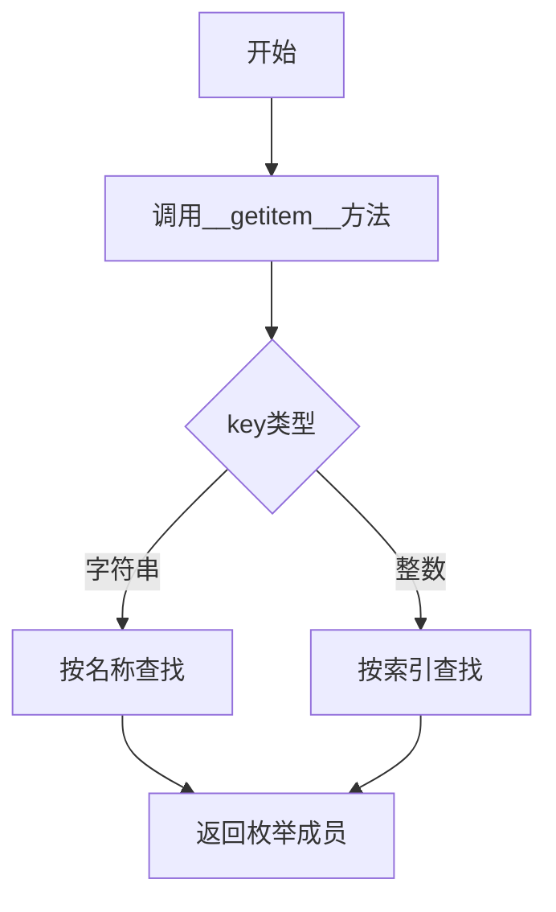

#### 带注释源码

```python
# 继承自Enum类的方法
# 支持通过名称或索引访问成员
# 示例：CacheType["Json"] 返回 CacheType.Json
# 示例：CacheType[0] 返回 CacheType.Json
```


## 关键组件


### CacheType 枚举类

CacheType 是继承自 StrEnum 的枚举类，用于定义系统支持的缓存类型。该枚举类定义了三种缓存实现方式：JSON 文件存储、内存存储、以及无操作（空缓存）。

### Json 枚举值

JSON 缓存类型，表示使用 JSON 文件进行数据持久化的缓存实现。

### Memory 枚举值

Memory 缓存类型，表示使用内存进行数据存储的缓存实现。

### Noop 枚举值

Noop 缓存类型，表示无操作或空缓存实现，用于禁用缓存功能的场景。


## 问题及建议


### 已知问题

-   **枚举值命名不一致**：`Noop` 枚举成员对应的字符串值是 `"none"`，命名与值不匹配，容易造成混淆（`Noop` 通常对应 `"noop"`）。
-   **缺少文档说明**：枚举类和各成员缺少详细文档注释，未说明每种缓存类型的用途和使用场景。
-   **Python 版本兼容性**：使用 `StrEnum`（Python 3.11+ 新特性），若项目需支持更低版本 Python 将无法运行。
-   **缺乏扩展性设计**：缓存类型硬编码在枚举中，无法支持运行时动态注册新的缓存类型，违反开闭原则。
-   **无默认值支持**：缺少默认缓存类型定义，调用方需要显式处理或提供默认值逻辑。
-   **功能单一**：仅作为类型标识使用，缺少与缓存配置、工厂模式等相关的基础设施支持。

### 优化建议

-   **修正枚举值命名**：将 `Noop = "none"` 改为 `Noop = "noop"`，保持命名一致性。
-   **添加类型验证**：考虑添加类方法如 `from_string()` 或 `is_valid()` 方法，提供更安全的类型验证能力。
-   **兼容旧版 Python**：如需支持 Python 3.11 以下版本，可继承 `str` 和 `Enum` 实现兼容方案。
-   **丰富文档注释**：为类和每个枚举成员添加详细的文档说明，包括使用场景和行为特性。
-   **考虑抽象基类设计**：如果缓存类型有不同行为，可考虑引入抽象基类或策略模式替代简单枚举。

## 其它


### 设计目标与约束

设计目标：提供统一的缓存类型枚举定义，支持Json、Memory和Noop三种缓存实现方式，便于在系统中灵活切换缓存策略。

设计约束：必须继承StrEnum以确保类型安全和字符串序列化能力；枚举值必须与实际缓存实现类名称对应。

### 错误处理与异常设计

本代码为纯枚举定义，不涉及运行时错误处理。异常设计由具体缓存实现类负责，枚举层仅提供类型标识。

潜在异常场景：无效枚举值访问时，Python枚举机制会自动抛出ValueError。

### 数据流与状态机

数据流：CacheType枚举作为配置参数在缓存工厂类中使用，根据枚举值实例化对应的缓存实现类。

状态机：枚举为静态配置，无状态转换逻辑。

### 外部依赖与接口契约

外部依赖：Python标准库enum.StrEnum（Python 3.11+）

接口契约：枚举成员值必须为字符串类型，与缓存实现类的模块路径或类名对应。

### 性能考虑

枚举访问为常数时间复杂度O(1)，无性能瓶颈。该模块为轻量级配置定义，加载时间可忽略。

### 安全性考虑

无敏感数据处理，无安全风险。枚举值验证由Python运行时保证。

### 兼容性考虑

依赖Python 3.11+的StrEnum特性，需确保运行环境中Python版本满足要求。StrEnum在Python 3.11之前不可用。

### 测试策略

测试用例应覆盖：枚举成员数量验证、枚举值字符串匹配测试、枚举名称与值的对应关系、StrEnum特性测试（支持字符串操作）。

### 版本历史和变更记录

初始版本（2024）：定义CacheType枚举，包含Json、Memory、Noop三种缓存类型。

### 使用示例和用法说明

```python
from cache_type import CacheType

# 枚举访问
cache_type = CacheType.Json
print(cache_type.value)  # 输出: "json"

# 字符串比较
if cache_type == "json":
    print("Using JSON cache")

# 枚举迭代
for cache_type in CacheType:
    print(f"{cache_type.name}: {cache_type.value}")
```

### 扩展性考虑

当前支持三种缓存类型，后续可通过继承CacheType添加新的缓存实现类型，如Redis、Memcached等。枚举值命名应与实际缓存实现类名保持一致。


    