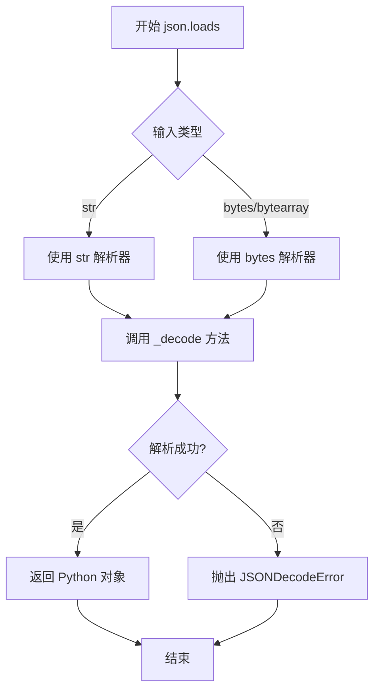
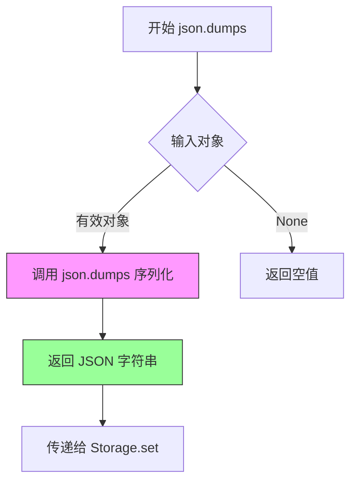
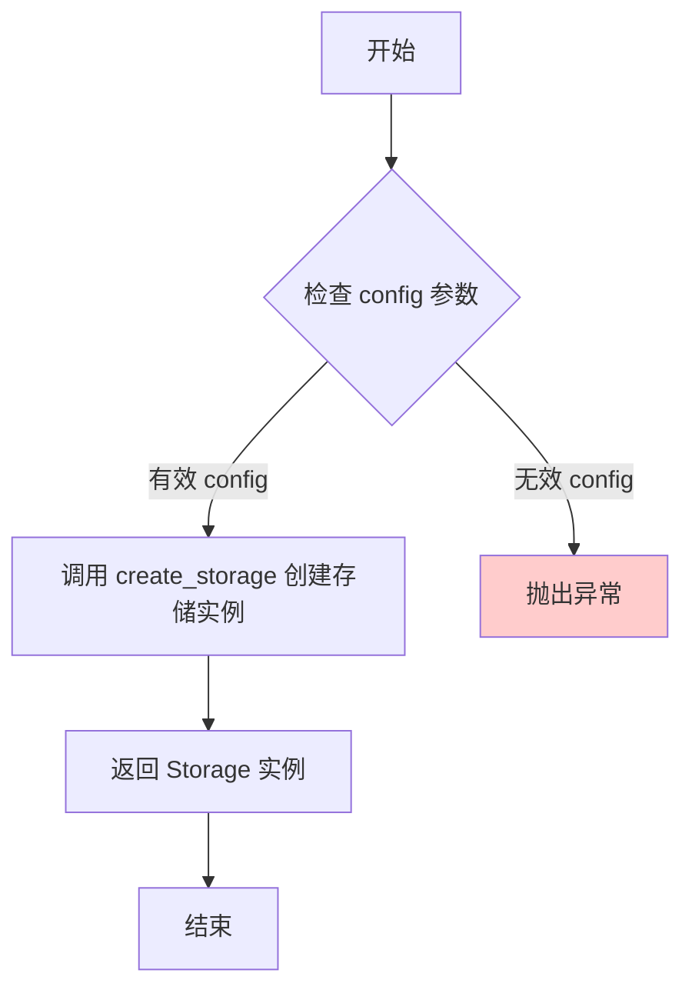
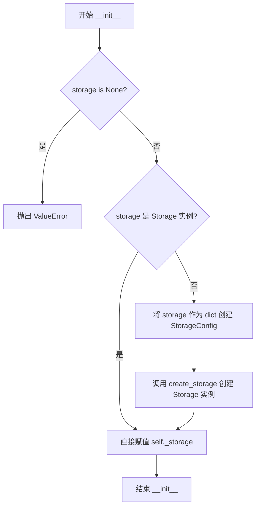
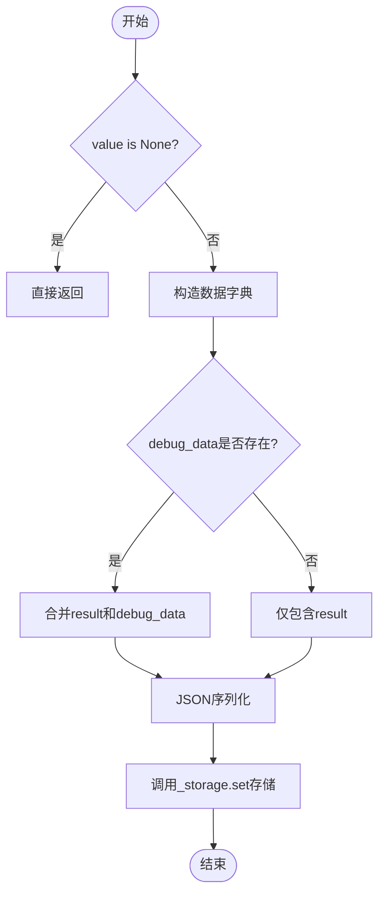
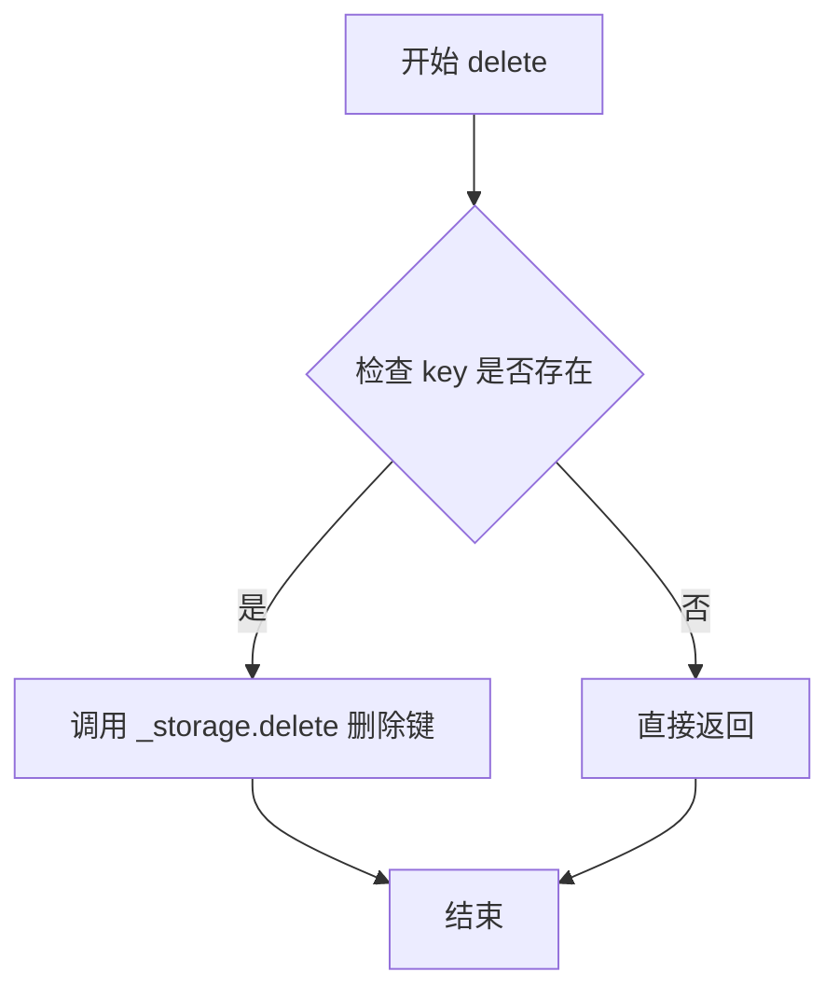
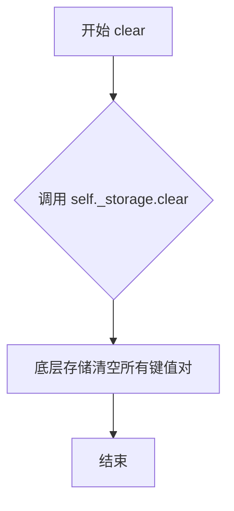
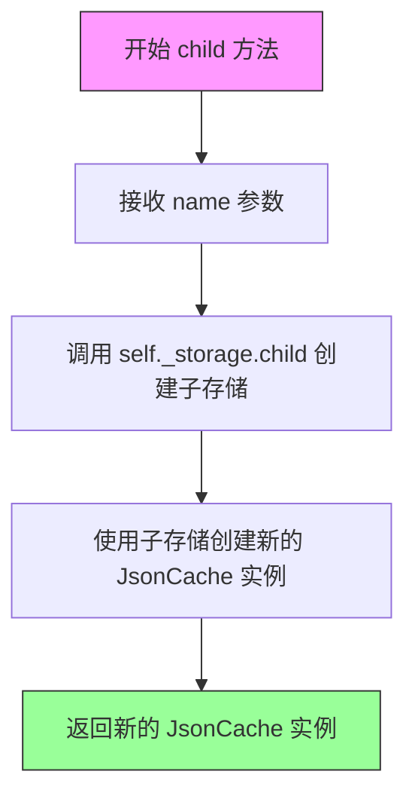

# `graphrag\packages\graphrag-cache\graphrag_cache\json_cache.py` 详细设计文档

这是一个基于 JSON 的缓存实现类，继承自 Cache 抽象基类，通过 Storage 接口实现数据的持久化存储和检索，支持键值对操作及子缓存功能。

## 整体流程

```mermaid
graph TD
    A[开始] --> B{storage 参数是否为 None?}
    B -- 是 --> C[抛出 ValueError 异常]
    B -- 否 --> D{storage 是否为 Storage 实例?}
    D -- 是 --> E[直接赋值给 _storage]
    D -- 否 --> F[使用 create_storage 创建 Storage 实例]
    E --> G[初始化完成]
    F --> G
    G --> H[get(key)]
    H --> I{has(key)?}
    I -- 否 --> J[返回 None]
    I -- 是 --> K[调用 storage.get]
    K --> L{JSON 解析成功?}
    L -- 否 --> M[删除错误数据并返回 None]
    L -- 是 --> N[返回 data.get('result')]
    G --> O[set(key, value, debug_data)]
    O --> P{value 为 None?}
    P -- 是 --> Q[直接返回]
    P -- 否 --> R[构造 JSON 数据]
    R --> S[调用 storage.set 存储]
    G --> T[has(key)]
    T --> U[调用 storage.has]
    G --> V[delete(key)]
    V --> W{has(key)?]
    W -- 是 --> X[调用 storage.delete]
    W -- 否 --> Y[直接返回]
    G --> Z[clear]
    Z --> AA[调用 storage.clear]
    G --> AB[child(name)]
    AB --> AC[返回新的 JsonCache 实例]
```

## 类结构

```
Cache (抽象基类)
└── JsonCache (JSON 缓存实现类)
```

## 全局变量及字段


### `json`
    
Python内置的JSON模块，用于序列化和解序列化数据

类型：`module`
    


### `Any`
    
typing模块的类型变量，表示任意类型

类型：`TypeVar`
    


### `Storage`
    
抽象存储接口，定义存储后端的标准操作方法

类型：`class`
    


### `StorageConfig`
    
存储配置类，用于配置存储后端的参数

类型：`class`
    


### `create_storage`
    
工厂函数，根据配置创建存储后端实例

类型：`function`
    


### `Cache`
    
抽象缓存基类，定义缓存的标准接口

类型：`class`
    


### `JsonCache._storage`
    
存储后端实例，用于实际的数据持久化

类型：`Storage`
    
    

## 全局函数及方法


### `json.loads`

`json.loads` 是 Python 标准库 `json` 模块中的函数，用于将 JSON 格式的字符串反序列化为 Python 对象。在 `JsonCache.get` 方法中，它将从存储中获取的 JSON 字符串转换为 Python 字典对象。

参数：

-  `s`：`str | bytes | bytearray`，待反序列化的 JSON 字符串（来自 storage 的数据）
-  `*`：`Any`，编码参数（可选）
-  `**`：`Any`，编码参数（可选）

返回值：`Any`，反序列化后的 Python 对象（字典、列表或其他 JSON 支持的类型）

#### 流程图



#### 带注释源码

```python
# 从 storage 获取的字符串数据
data = await self._storage.get(key)

# 使用 json.loads 将 JSON 字符串反序列化为 Python 对象
# 输入: JSON 格式的字符串 (例如: '{"result": {"key": "value"}}')
# 输出: Python 对象 (字典、列表等)
data = json.loads(data)
```

#### 在 `JsonCache.get` 方法中的上下文

```python
async def get(self, key: str) -> Any | None:
    """Get method definition."""
    # 检查缓存中是否存在指定的 key
    if await self.has(key):
        try:
            # 步骤1: 从存储中获取原始数据（通常是 JSON 字符串）
            data = await self._storage.get(key)
            
            # 步骤2: 使用 json.loads 将 JSON 字符串反序列化为 Python 对象
            # 这是核心的反序列化操作，将字符串转换为字典
            data = json.loads(data)
        except UnicodeDecodeError:
            # 处理编码错误，删除无效数据并返回 None
            await self._storage.delete(key)
            return None
        except json.decoder.JSONDecodeError:
            # 处理 JSON 解析错误，删除无效数据并返回 None
            await self._storage.delete(key)
            return None
        else:
            # 解析成功，返回结果中的 "result" 字段
            return data.get("result")

    # 如果 key 不存在，返回 None
    return None
```


### `json.dumps`

在 `JsonCache.set` 方法中，将 Python 对象序列化为 JSON 格式字符串，用于存储到缓存中。

参数：

-  `obj`：`Any`，要序列化的 Python 对象（字典、列表等）
-  `ensure_ascii`：`bool`，是否确保 ASCII 编码（默认为 True）

返回值：`str`，返回 JSON 格式的字符串表示。

#### 流程图



#### 带注释源码

```python
async def set(self, key: str, value: Any, debug_data: dict | None = None) -> None:
    """Set method definition."""
    # 如果值为 None，直接返回，不进行缓存
    if value is None:
        return
    
    # 构建数据字典，包含结果和可选的调试数据
    # result 键用于存储实际值，debug_data 用于存储调试信息
    data = {"result": value, **(debug_data or {})}
    
    # 使用 json.dumps 将 Python 对象序列化为 JSON 字符串
    # ensure_ascii=False 允许存储非 ASCII 字符（如中文）
    # 序列化后的字符串传递给 Storage 进行持久化存储
    await self._storage.set(key, json.dumps(data, ensure_ascii=False))
```

**注意**：`json.dumps` 是 Python 标准库函数，在本代码中用于将包含结果的字典序列化为 JSON 字符串，以便存储到 Storage 后端。该调用确保了中文字符能够正确存储（`ensure_ascii=False`）。


### `create_storage`

`create_storage` 是一个从外部模块 `graphrag_storage` 导入的工厂函数，用于根据提供的配置创建并返回一个 `Storage` 实例。由于该函数定义不在当前代码文件中，无法提取其完整实现细节。以下信息基于代码中的使用方式推断。

参数：

- `config`：`StorageConfig`，存储配置对象，用于指定存储类型及相关参数

返回值：`Storage`，存储接口实例，用于执行数据的持久化操作

#### 流程图



#### 带注释源码

```python
# 该函数定义不在当前代码文件中，位于 graphrag_storage 模块中
# 以下为代码中使用该函数的示例

from graphrag_storage import Storage, StorageConfig, create_storage

# ...

class JsonCache(Cache):
    # ...
    
    def __init__(
        self,
        storage: Storage | dict[str, Any] | None = None,
        **kwargs: Any,
    ) -> None:
        """Init method definition."""
        if storage is None:
            msg = "JsonCache requires either a Storage instance to be provided or a StorageConfig to create one."
            raise ValueError(msg)
        if isinstance(storage, Storage):
            self._storage = storage
        else:
            # 使用 create_storage 工厂函数根据配置创建 Storage 实例
            # config 参数: StorageConfig(**storage) - 将字典转换为配置对象
            # 返回值: Storage 实例
            self._storage = create_storage(StorageConfig(**storage))
```

**注意**：由于 `create_storage` 函数定义在外部模块 `graphrag_storage` 中，无法从当前代码片段提取其完整实现细节。如需获取该函数的完整文档，建议查看 `graphrag_storage` 模块的源代码或官方文档。


### `JsonCache`

JsonCache 是一个文件管道缓存类，继承自 Cache 抽象类。它通过 Storage 接口实现键值对缓存功能，支持 JSON 数据的序列化存储、读取、删除和清空操作，并提供子缓存创建能力。

参数：

-  `storage`：`Storage | dict[str, Any] | None`，存储实例或存储配置字典，为空时抛出 ValueError
-  `**kwargs`：`Any`，额外关键字参数（当前未使用）

返回值：构造函数无返回值

#### 流程图



#### 带注释源码

```python
class JsonCache(Cache):
    """文件管道缓存类定义"""
    
    _storage: Storage  # 存储实例引用

    def __init__(
        self,
        storage: Storage | dict[str, Any] | None = None,
        **kwargs: Any,
    ) -> None:
        """初始化方法定义"""
        # 检查 storage 参数是否为 None，如果是则抛出异常
        if storage is None:
            msg = "JsonCache requires either a Storage instance to be provided or a StorageConfig to create one."
            raise ValueError(msg)
        
        # 如果是 Storage 实例，直接赋值
        if isinstance(storage, Storage):
            self._storage = storage
        else:
            # 否则将 storage 作为配置字典，创建 StorageConfig 并通过 create_storage 创建存储实例
            self._storage = create_storage(StorageConfig(**storage))
```

---

### 补充说明：关于 `StorageConfig`

**注意**：代码中使用的 `StorageConfig` 是从 `graphrag_storage` 模块导入的类型提示（type hint），并非在此代码文件中定义。`StorageConfig` 的具体结构需要参考 `graphrag_storage` 包的文档。从代码使用方式来看：

- `StorageConfig(**storage)` 用于将字典配置转换为配置对象
- 配置字典 `storage` 应包含创建 Storage 实例所需的参数（如存储路径、存储类型等）

如需获取 `StorageConfig` 的详细定义（字段、类型、默认值），请参考 `graphrag_storage` 包的源码或官方文档。


### JsonCache.__init__

JsonCache 类的初始化方法，用于创建 JsonCache 缓存实例。该方法接收 storage 参数（可以是 Storage 实例或存储配置字典），如果 storage 为 None 则抛出 ValueError 异常，否则根据输入类型直接使用或创建 Storage 实例并赋值给内部属性 `_storage`。

参数：

- `self`：JsonCache 实例本身
- `storage`：`Storage | dict[str, Any] | None`，存储实例或配置字典，用于初始化底层存储
- `kwargs`：`Any`，其他关键字参数（当前未被使用，保留以支持未来扩展）

返回值：`None`，无返回值

#### 流程图

```mermaid
flowchart TD
    A[开始 __init__] --> B{storage is None?}
    B -->|是| C[抛出 ValueError 异常]
    B -->|否| D{storage 是 Storage 实例?}
    D -->|是| E[直接赋值 self._storage = storage]
    D -->|否| F[创建 StorageConfig 并调用 create_storage]
    E --> G[结束]
    F --> H[赋值 self._storage = create_storage(StorageConfig(**storage))]
    H --> G
    C --> G
```

#### 带注释源码

```python
def __init__(
    self,
    storage: Storage | dict[str, Any] | None = None,
    **kwargs: Any,
) -> None:
    """Init method definition."""
    # 检查 storage 参数是否为 None，如果是则抛出详细错误信息
    if storage is None:
        msg = "JsonCache requires either a Storage instance to be provided or a StorageConfig to create one."
        raise ValueError(msg)
    # 判断 storage 是否已经是 Storage 实例
    if isinstance(storage, Storage):
        # 直接使用传入的 Storage 实例
        self._storage = storage
    else:
        # 否则将 storage 视为配置字典，创建 StorageConfig 并通过 create_storage 工厂函数创建存储实例
        self._storage = create_storage(StorageConfig(**storage))
```


### `JsonCache.get`

获取缓存值的方法，如果键不存在或数据解析失败则返回 None。

参数：

- `key`：`str`，缓存键名

返回值：`Any | None`，返回缓存的值，如果不存在或解析失败返回 None

#### 流程图

```mermaid
flowchart TD
    A[开始 get 方法] --> B{调用 has(key) 检查键是否存在}
    B -->|否| C[返回 None]
    B -->|是| D[调用 _storage.get 获取原始数据]
    D --> E{尝试 json.loads 解析}
    E -->|UnicodeDecodeError 异常| F[调用 _storage.delete 删除键]
    F --> G[返回 None]
    E -->|JSONDecodeError 异常| H[调用 _storage.delete 删除键]
    H --> G
    E -->|解析成功| I[提取 data.get result 字段]
    I --> J[返回结果]
```

#### 带注释源码

```python
async def get(self, key: str) -> Any | None:
    """Get method definition."""
    # 第一步：检查缓存键是否存在
    if await self.has(key):
        try:
            # 第二步：从存储中获取原始数据
            data = await self._storage.get(key)
            # 第三步：尝试将 JSON 字符串解析为 Python 对象
            data = json.loads(data)
        except UnicodeDecodeError:
            # 异常处理：数据编码错误，删除损坏的键值对，返回 None
            await self._storage.delete(key)
            return None
        except json.decoder.JSONDecodeError:
            # 异常处理：JSON 格式错误，删除损坏的键值对，返回 None
            await self._storage.delete(key)
            return None
        else:
            # 第四步：解析成功，提取 result 字段并返回
            return data.get("result")

    # 键不存在时返回 None
    return None
```


### JsonCache.set

设置缓存方法，用于将指定的键值对存储到缓存中。如果值为None则不进行缓存操作。

参数：

- `key`：`str`，缓存键名
- `value`：`Any`，要缓存的值
- `debug_data`：`dict | None`，可选的调试数据

返回值：`None`，无返回值

#### 流程图



#### 带注释源码

```python
async def set(self, key: str, value: Any, debug_data: dict | None = None) -> None:
    """Set method definition.
    
    设置缓存方法，用于将数据存储到缓存中。
    
    参数:
        key: 缓存键名
        value: 要缓存的值
        debug_data: 可选的调试数据，用于在缓存中存储额外的调试信息
    
    返回:
        无返回值
    """
    # 如果值为None，则直接返回，不进行缓存操作
    if value is None:
        return
    
    # 构造数据字典
    # - "result" 键存储实际的缓存值
    # - 使用字典解包合并 debug_data（如果提供）
    data = {"result": value, **(debug_data or {})}
    
    # 将数据转换为JSON字符串
    # ensure_ascii=False 允许存储非ASCII字符（如中文）
    # 调用存储层的异步set方法持久化数据
    await self._storage.set(key, json.dumps(data, ensure_ascii=False))
```


### JsonCache.has

检查缓存中是否存在指定的键

参数：

- `key`：`str`，缓存键名

返回值：`bool`，返回是否存在该键

#### 流程图

```mermaid
flowchart TD
    A[开始] --> B{调用 _storage.has(key)}
    B -->|存在| C[返回 True]
    B -->|不存在| D[返回 False]
    C --> E[结束]
    D --> E
```

#### 带注释源码

```python
async def has(self, key: str) -> bool:
    """Has method definition.
    
    检查缓存中是否存在指定的键。
    
    Args:
        key: 缓存键名
        
    Returns:
        bool: 如果键存在返回 True，否则返回 False
    """
    # 调用底层存储的 has 方法检查键是否存在
    return await self._storage.has(key)
```


### `JsonCache.delete`

该方法用于从缓存中删除指定的键值对，首先检查键是否存在，如存在则从底层存储中移除该键。

参数：

- `key`：`str`，缓存键名

返回值：`None`，无返回值

#### 流程图



#### 带注释源码

```python
async def delete(self, key: str) -> None:
    """Delete method definition.
    
    从缓存中删除指定的键值对。
    
    参数:
        key: 要删除的缓存键名
        
    返回值:
        无返回值
        
    异常:
        可能抛出底层存储实现相关的异常
    """
    # 先检查键是否存在，避免在存储中创建空键
    if await self.has(key):
        # 调用底层存储的删除方法
        await self._storage.delete(key)
```


### `JsonCache.clear`

清空缓存方法，调用底层存储的 clear 方法移除所有缓存数据。

参数： 无

返回值：`None`，无返回值，清空所有缓存

#### 流程图



#### 带注释源码

```python
async def clear(self) -> None:
    """Clear method definition.
    
    清空所有缓存数据的方法。
    该方法通过调用底层存储的 clear 方法来实现，
    会删除存储中所有的键值对。
    """
    await self._storage.clear()
```


### `JsonCache.child`

该方法用于创建当前缓存的子缓存实例，通过传入子缓存名称，调用底层存储的 child 方法生成子存储，并基于该子存储创建新的 JsonCache 实例返回，实现缓存的层级结构支持。

参数：

- `name`：`str`，子缓存名称

返回值：`Cache`，返回一个新的 JsonCache 实例，作为子缓存

#### 流程图



#### 带注释源码

```python
def child(self, name: str) -> "Cache":
    """Child method definition.
    
    创建一个新的子缓存实例，基于当前缓存的底层存储创建子存储。
    
    Args:
        name: 子缓存的名称，用于在底层存储中创建独立的命名空间
        
    Returns:
        返回一个新的 JsonCache 实例，该实例使用子存储作为底层存储
    """
    # 调用底层存储的 child 方法创建子存储，并将子存储作为参数构造新的 JsonCache 实例返回
    return JsonCache(storage=self._storage.child(name))
```

## 关键组件


### JsonCache 类

JsonCache 是一个基于 JSON 的文件管道缓存类，继承自 Cache 抽象类，通过 Storage 接口实现数据的持久化存储，支持异步操作、子缓存创建和调试数据附加。

### Storage 存储接口

Storage 是底层存储抽象接口，提供 get、set、has、delete、clear 等方法，JsonCache 通过组合模式使用该接口完成实际的数据读写操作，支持多种存储后端（文件、内存等）。

### 异步缓存操作

该组件包含 get、set、has、delete、clear 五个异步方法，提供完整的缓存 CRUD 操作，所有操作均通过 await 关键字实现非阻塞执行。

### JSON 序列化与反序列化

该组件负责将缓存值序列化为 JSON 字符串存储，并从存储中读取数据后反序列化为 Python 对象，包含错误处理逻辑（UnicodeDecodeError、JSONDecodeError）。

### 调试数据支持

set 方法支持传入 debug_data 参数，允许在缓存数据中附加额外的调试信息，与实际结果值一起存储为 JSON 对象。

### 子缓存机制

child 方法通过调用底层 Storage 的 child 方法创建子缓存，支持命名空间隔离，可以构建缓存层次结构。

### 错误处理与数据清理

该组件在 get 方法中捕获 UnicodeDecodeError 和 JSONDecodeError 异常，发现数据损坏时自动删除对应键值对并返回 None，保证缓存一致性。


## 问题及建议


### 已知问题

-   **数据删除无日志记录**：当 `get()` 方法捕获到 `UnicodeDecodeError` 或 `JSONDecodeError` 时，会静默删除损坏的缓存键，没有任何日志记录，导致问题难以追踪
-   **键名覆盖风险**：`set()` 方法中使用 `{"result": value, **(debug_data or {})})` 合并字典，如果 `debug_data` 包含 "result" 键，会覆盖实际的缓存值，造成数据丢失
-   **非原子操作**：`has()` 和 `get()` 之间存在竞态条件，在检查与获取之间键可能被其他操作删除
- **无过期机制**：缺少 TTL（Time-To-Live）支持，无法自动过期缓存，与现代缓存设计原则不符

### 优化建议

-   添加结构化日志记录，记录缓存命中、未命中、错误和删除操作，便于监控和调试
-   在合并 debug_data 前验证键名冲突，或使用显式的嵌套结构避免覆盖
-   考虑使用存储层的原子操作或分布式锁来处理并发场景
-   实现可选的 TTL 参数，在 `set()` 方法中支持过期时间设置
-   添加缓存统计功能（命中率、存储大小、操作计数等）
-   为 `get()` 方法添加重试逻辑，应对临时性存储故障

## 其它


### 设计目标与约束

**设计目标**：为graphrag-storage提供统一的JSON序列化缓存抽象层，支持异步键值存储操作，并实现缓存的层级结构（子缓存）。

**设计约束**：
- 依赖`Storage`接口的具体实现（本地文件存储、云存储等）
- 仅支持JSON可序列化的数据
- 异步API设计，需要在async上下文中使用
- 缓存键值对以JSON字符串形式存储在底层Storage中

### 错误处理与异常设计

**异常处理策略**：
- `ValueError`：初始化时未提供Storage实例或配置
- `UnicodeDecodeError`：读取到非UTF-8编码数据时，删除损坏的键并返回None
- `JSONDecodeError`：JSON解析失败时，删除损坏的键并返回None
- `set`方法在value为None时不执行任何操作

**错误传播**：底层Storage的异常会直接向上传播，调用者需处理

### 数据流与状态机

**数据写入流程**：
1. 调用方传入key和value
2. 将value包装为`{"result": value, ...debug_data}`格式
3. 使用`json.dumps`序列化为字符串
4. 调用`storage.set(key, json_string)`持久化

**数据读取流程**：
1. 调用方传入key
2. 首先调用`storage.has(key)`检查是否存在
3. 若存在，调用`storage.get(key)`获取原始字符串
4. 使用`json.loads`反序列化
5. 返回内部嵌套的`result`字段值

**状态转换**：无持久化状态机，状态完全由底层Storage管理

### 外部依赖与接口契约

**核心依赖**：
- `graphrag_storage.Storage`：存储抽象接口
- `graphrag_storage.StorageConfig`：存储配置类
- `graphrag_storage.create_storage`：工厂函数
- `graphrag_cache.cache.Cache`：抽象基类
- `json`：Python标准库
- `typing.Any`：类型注解

**接口契约**：
- `Storage.get(key)`：返回字符串或bytes，失败抛异常
- `Storage.set(key, value)`：value为字符串，失败抛异常
- `Storage.has(key)`：返回布尔值
- `Storage.delete(key)`：无返回值
- `Storage.clear()`：无返回值
- `Storage.child(name)`：返回新的Storage实例

### 安全性考虑

- **序列化风险**：`json.loads`可能存在反序列化漏洞，但作为内部缓存影响有限
- **路径遍历**：子缓存通过`child()`方法创建，依赖底层Storage实现安全性
- **敏感数据**：缓存内容以明文存储，不适合存放敏感信息

### 并发与线程安全性

- 所有方法均为async方法，需配合asyncio事件循环使用
- 并发安全性完全依赖底层Storage实现
- 当前实现无内置锁机制

### 性能特征

- **时间复杂度**：O(1)基本操作，JSON序列化/反序列化为O(n)
- **空间复杂度**：依赖底层Storage，JSON字符串有额外开销
- **序列化开销**：每次set都进行完整JSON序列化，大对象可能影响性能

### 兼容性说明

- Python 3.10+（使用`|`联合类型语法）
- 依赖`graphrag_storage`包的具体版本需参考项目依赖管理
- 异步API设计要求调用方使用asyncio

### 使用示例与调用模式

```python
# 基础用法
cache = JsonCache(storage={"type": "file", "base_dir": "./cache"})
await cache.set("key1", {"data": "value"})
result = await cache.get("key1")

# 子缓存
child_cache = cache.child("namespace")
await child_cache.set("key2", "value2")
```


    