# `graphrag\packages\graphrag-cache\graphrag_cache\memory_cache.py` 详细设计文档

这是一个内存缓存实现类，继承自Cache抽象基类，使用Python字典作为内部存储结构，提供异步的get、set、has、delete、clear等基本缓存操作，并支持创建子缓存实例，适用于需要快速访问的临时数据缓存场景。

## 整体流程

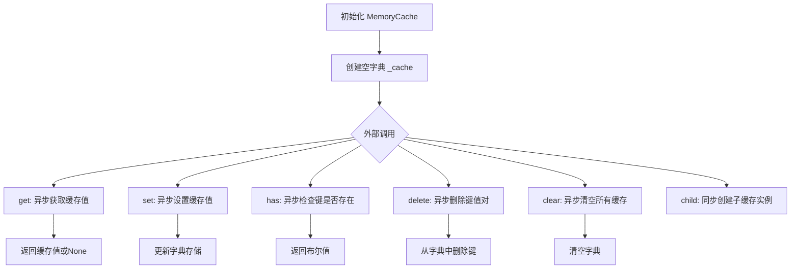

## 类结构

```
Cache (抽象基类)
└── MemoryCache (内存缓存实现类)
```

## 全局变量及字段


### `MemoryCache._cache`
    
存储键值对的内部字典

类型：`dict[str, Any]`
    


### `MemoryCache._name`
    
缓存实例名称

类型：`str`
    
    

## 全局函数及方法


### `MemoryCache.__init__`

初始化方法，创建空的缓存字典。

参数：

- `**kwargs`：`Any`，关键字参数，接受任意数量的关键字参数（当前未使用，保留用于接口兼容性）

返回值：`None`，无返回值

#### 流程图

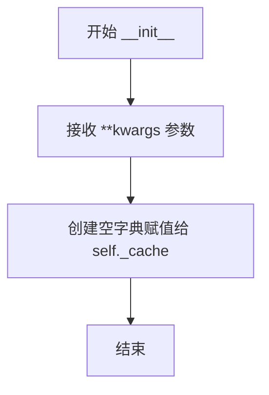

#### 带注释源码

```python
def __init__(self, **kwargs: Any) -> None:
    """Init method definition.
    
    初始化方法，创建空的缓存字典用于存储键值对。
    
    Args:
        **kwargs: 关键字参数，当前未使用，保留用于与父类接口兼容
    """
    self._cache = {}  # 创建空字典作为内存缓存存储
```


### `MemoryCache.get`

异步获取指定键对应的缓存值。如果键不存在，则返回 None。

参数：

- `key`：`str`，要获取值的键

返回值：`Any`，给定键对应的值，如果键不存在则返回 None

#### 流程图

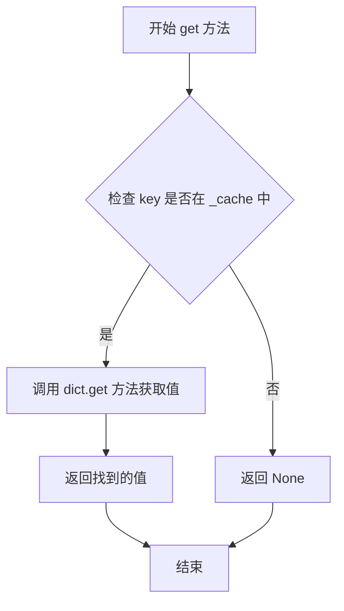

#### 带注释源码

```python
async def get(self, key: str) -> Any:
    """Get the value for the given key.

    Args:
        - key - The key to get the value for.
        - as_bytes - Whether or not to return the value as bytes.

    Returns
    -------
        - output - The value for the given key.
    """
    # 使用 dict 的 get 方法异步获取缓存值
    # 如果 key 不存在，dict.get 会自动返回 None
    return self._cache.get(key)
```


### MemoryCache.set

异步设置指定键的缓存值，将给定的键值对存储到内存缓存字典中。

参数：

- `key`：`str`，要设置的缓存键
- `value`：`Any`，要缓存的值
- `debug_data`：`dict | None`，可选的调试数据，用于记录缓存操作的元信息

返回值：`None`，无返回值

#### 流程图

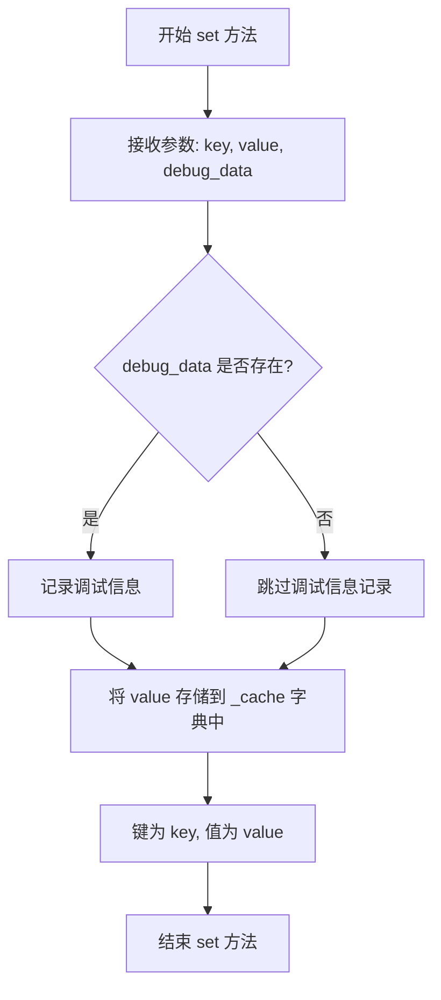

#### 带注释源码

```python
async def set(self, key: str, value: Any, debug_data: dict | None = None) -> None:
    """Set the value for the given key.

    Args:
        - key: The key to set the value for.
        - value: The value to set.
        - debug_data: Optional debug data for cache operation tracking.
    """
    # 将值存储到内部字典 _cache 中，以 key 作为键
    # 这是内存缓存的核心存储操作
    self._cache[key] = value
```


### `MemoryCache.has`

异步检查指定键是否存在于缓存中。

参数：

- `key`：`str`，要检查的键名

返回值：`bool`，如果键存在于缓存中返回 True，否则返回 False

#### 流程图

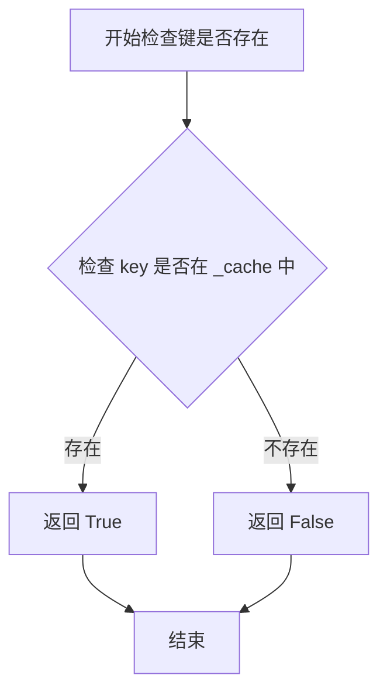

#### 带注释源码

```python
async def has(self, key: str) -> bool:
    """Return True if the given key exists in the storage.

    Args:
        - key - The key to check for.

    Returns
    -------
        - output - True if the key exists in the storage, False otherwise.
    """
    # 使用 Python 的 in 操作符检查键是否存在于内部字典 _cache 中
    # 这是 O(1) 时间复杂度的字典查找操作
    return key in self._cache
```


### `MemoryCache.delete`

异步删除指定键及其对应的值

参数：

- `key`：`str`，要删除的键

返回值：`None`，无返回值描述

#### 流程图

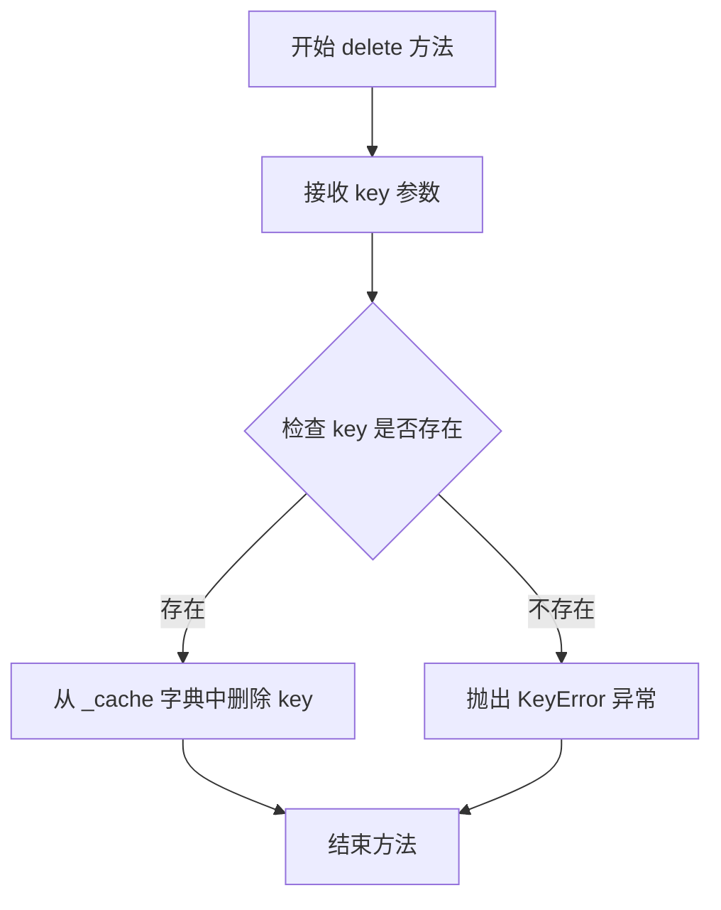

#### 带注释源码

```python
async def delete(self, key: str) -> None:
    """Delete the given key from the storage.

    Args:
        - key - The key to delete.
    """
    # 从内部字典中删除指定的键值对
    # 如果键不存在，会抛出 KeyError 异常
    del self._cache[key]
```


### `MemoryCache.clear`

异步清空所有缓存数据，将内部字典缓存对象重置为空。

参数：

- （无参数）

返回值：`None`，无返回值

#### 流程图

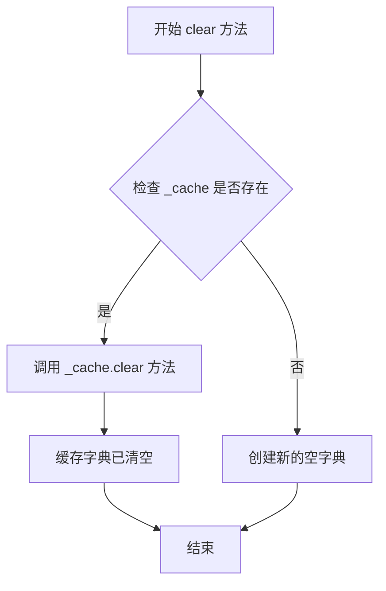

#### 带注释源码

```python
async def clear(self) -> None:
    """Clear the storage."""
    # 调用内部字典的 clear 方法，清空所有键值对
    # 这是一个 O(n) 操作，其中 n 是字典中键的数量
    self._cache.clear()
```


### `MemoryCache.child`

创建并返回一个新的子缓存实例。该方法接收一个名称参数，创建一个新的 MemoryCache 实例并将其作为 Cache 接口类型返回。

参数：

- `name`：`str`，子缓存的名称

返回值：`Cache`，返回一个新的子缓存实例

#### 流程图

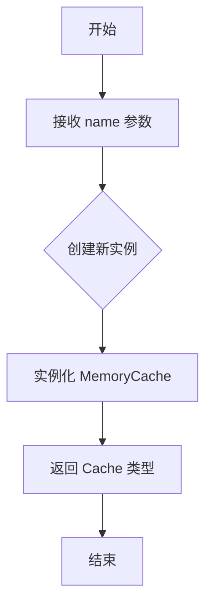

#### 带注释源码

```python
def child(self, name: str) -> "Cache":
    """Create a sub cache with the given name.
    
    该方法创建一个新的 MemoryCache 实例作为子缓存。
    虽然接收了 name 参数，但当前实现并未使用该参数来区分不同的子缓存。
    
    Args:
        name: 子缓存的名称，用于标识不同的缓存实例
        
    Returns:
        返回一个新的 MemoryCache 实例，类型声明为 Cache 接口
    """
    return MemoryCache()
```


### MemoryCache.get

获取缓存中指定键对应的值。

参数：

- `key`：`str`，要获取值的键

返回值：`Any`，给定键对应的值，如果键不存在则返回 None

#### 流程图

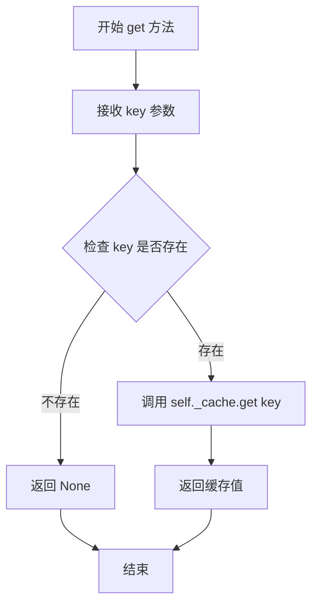

#### 带注释源码

```python
async def get(self, key: str) -> Any:
    """Get the value for the given key.

    Args:
        - key - The key to get the value for.
        - as_bytes - Whether or not to return the value as bytes.

    Returns
    -------
        - output - The value for the given key.
    """
    # 使用字典的 get 方法获取缓存值
    # 如果键不存在，get 方法会自动返回 None
    return self._cache.get(key)
```


### Cache.set

该方法用于设置缓存键值对，将指定的值存储到缓存中。

参数：

-  `key`：`str`，用于标识缓存值的键
-  `value`：`Any`，要存储的缓存值
-  `debug_data`：`dict | None`，可选的调试数据，用于记录缓存操作的额外信息

返回值：`None`，无返回值

#### 流程图

```mermaid
flowchart TD
    A[开始设置缓存] --> B{检查参数有效性}
    B -->|参数有效| C[将键值对存入缓存字典]
    C --> D[self._cache[key] = value]
    D --> E[结束]
    
    style A fill:#e1f5fe
    style C fill:#e8f5e8
    style E fill:#fce4ec
```

#### 带注释源码

```python
async def set(self, key: str, value: Any, debug_data: dict | None = None) -> None:
    """Set the value for the given key.

    Args:
        - key: The key to set the value for.
        - value: The value to set.
    """
    # 将传入的键值对存储到内部缓存字典中
    # key: 缓存的键，用于后续检索
    # value: 要缓存的值，可以是任意类型
    self._cache[key] = value
```


### `MemoryCache.has`

检查给定的键是否存在于存储中。

参数：

- `key`：`str`，要检查的键

返回值：`bool`，如果键存在于存储中返回 True，否则返回 False

#### 流程图

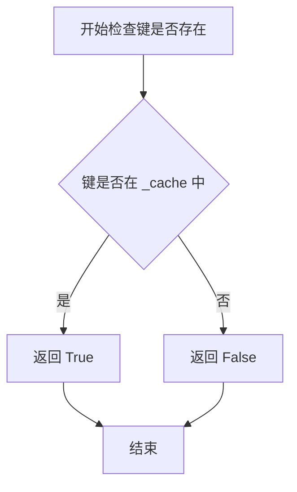

#### 带注释源码

```python
async def has(self, key: str) -> bool:
    """Return True if the given key exists in the storage.

    Args:
        - key - The key to check for.

    Returns
    -------
        - output - True if the key exists in the storage, False otherwise.
    """
    # 使用 Python 的 'in' 运算符检查键是否存在于内部字典 _cache 中
    # 返回布尔值：存在返回 True，不存在返回 False
    return key in self._cache
```


### `MemoryCache.delete`

删除存储中指定键的缓存条目。

参数：

-  `key`：`str`，要删除的键

返回值：`None`，无返回值

#### 流程图

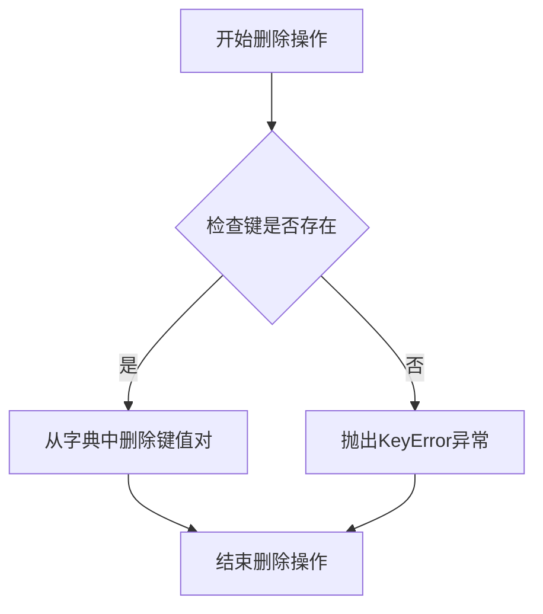

#### 带注释源码

```python
async def delete(self, key: str) -> None:
    """Delete the given key from the storage.

    Args:
        - key - The key to delete.
    """
    del self._cache[key]  # 从内部字典中删除指定键的键值对，如果键不存在会抛出KeyError
```


### MemoryCache.clear

清空缓存存储，将内部字典缓存对象重置为空。

参数：无需参数

返回值：`None`，无返回值

#### 流程图

```mermaid
flowchart TD
    A([开始 clear 方法]) --> B[调用 self._cache.clear&#40;&#41;]
    B --> C[清空内部字典缓存]
    C --> D([结束方法])
```

#### 带注释源码

```python
async def clear(self) -> None:
    """Clear the storage."""
    # 调用 Python 字典的 clear() 方法，清空所有键值对
    # 将 _cache 字典重置为空的 {} 状态
    # 此操作不返回任何值（返回 None）
    # 复杂度：O(n)，其中 n 为字典中键的数量
    self._cache.clear()
```


### `MemoryCache.child`

创建一个具有给定名称的子缓存（子缓存实例），用于支持缓存的层级结构或命名空间隔离。

参数：

- `name`：`str`，子缓存的名称，用于标识和区分不同的子缓存

返回值：`Cache`，返回一个子缓存实例（具体为MemoryCache实例）

#### 流程图

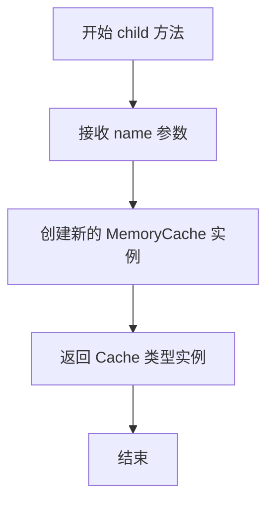

#### 带注释源码

```python
def child(self, name: str) -> "Cache":
    """Create a sub cache with the given name."""
    # 创建一个新的 MemoryCache 实例并返回
    # 注意：虽然接收了 name 参数，但当前实现并未使用该参数
    # 返回类型声明为 Cache，但实际返回的是 MemoryCache 实例
    return MemoryCache()
```


## 关键组件


### MemoryCache 类

内存缓存实现类，继承自 Cache 抽象类，提供基于 Python 字典的内存键值存储功能，支持异步操作。

### _cache 字典

内部缓存存储结构，使用 Python 字典存储所有键值对，键为字符串类型，值为任意类型。

### _name 字段

缓存实例名称标识，用于标识不同的缓存实例。

### get 方法

异步方法，根据指定键获取缓存值。参数包括键名称（字符串类型），返回对应值或 None。

### set 方法

异步方法，设置缓存键值对。参数包括键（字符串）、值（任意类型）和可选的调试数据字典，无返回值。

### has 方法

异步方法，检查指定键是否存在于缓存中。参数为键名称（字符串），返回布尔值表示键是否存在。

### delete 方法

异步方法，从缓存中删除指定键。参数为要删除的键名称（字符串），无返回值。

### clear 方法

异步方法，清空整个缓存存储，无参数，无返回值。

### child 方法

同步方法，创建具有特定名称的子缓存实例。参数为子缓存名称（字符串），返回新的 MemoryCache 实例。


## 问题及建议


### 已知问题

- **未使用的参数**：构造函数 `__init__` 接受 `**kwargs: Any` 参数但完全未使用，可能导致调用者困惑
- **未初始化的字段**：类声明了 `_name: str` 字段，但 `__init__` 方法中未对其进行初始化
- **文档与实现不符**：`get` 方法文档字符串提到 `as_bytes` 参数，但方法签名中并不存在此参数
- **未使用的参数**：`set` 方法接受 `debug_data` 参数但从未使用
- **缺少线程安全机制**：在多线程并发环境下直接操作 `_cache` 字典可能导致竞态条件
- **缺乏缓存策略**：没有实现任何缓存过期机制（TTL）、容量限制或 LRU 淘汰策略，可能导致内存无限增长
- **类型注解不精确**：`get` 方法返回 `Any`，实际应返回 `Optional[Any]` 以明确 key 不存在时返回 None
- **`child` 方法实现不完整**：创建子缓存时未继承父缓存的配置或命名空间，且返回类型注解为 `"Cache"` 但实际返回 `MemoryCache` 实例

### 优化建议

- 移除未使用的 `**kwargs` 或在文档中说明其用途
- 初始化 `_name` 字段或从类定义中移除该字段声明
- 修正 `get` 方法文档，移除不存在的 `as_bytes` 参数描述
- 移除 `set` 方法中未使用的 `debug_data` 参数，或实现调试日志功能
- 考虑使用 `asyncio.Lock` 或 `threading.RLock` 实现线程安全的缓存操作
- 添加可选的 TTL 支持、容量限制和 LRU 淘汰机制
- 修正返回类型注解为 `Optional[Any]`
- 在 `child` 方法中正确传递配置参数，或实现命名空间隔离逻辑

## 其它


### 设计目标与约束

本MemoryCache实现了一个轻量级的内存缓存组件，设计目标包括：提供异步接口支持、兼容Cache抽象基类、最小化内存占用、提供基本的CRUD操作。约束条件包括：不支持持久化、不支持分布式、不支持缓存过期策略、线程安全性由调用方保证。

### 错误处理与异常设计

本类未实现显式的错误处理机制。潜在的异常场景包括：KeyError（delete操作key不存在时抛出）、AttributeError（访问未初始化属性）、TypeError（参数类型不匹配）。建议在调用方进行异常捕获处理，或在基类定义统一的异常类型。

### 数据流与状态机

数据流包含三个主要状态：初始化状态（_cache为空字典）、活跃状态（可进行get/set操作）、清理状态（clear操作后回到初始化）。状态转换通过异步方法调用触发，无显式状态机实现。

### 外部依赖与接口契约

主要依赖graphrag_cache.cache模块中的Cache抽象基类。接口契约要求实现类必须提供get、set、has、delete、clear、child六个异步方法。Cache基类定义了缓存的标准接口规范，MemoryCache作为具体实现类必须遵循该契约。

### 性能考虑

当前实现为简单字典存储，未实现任何缓存淘汰策略。性能特点：O(1)读写复杂度、无锁机制（高并发下需外部同步）、内存占用随数据量线性增长。建议在生产环境中添加容量限制和淘汰策略。

### 并发和线程安全性

当前实现不保证线程安全。_cache字典的并发读写可能导致RuntimeError。在多线程环境下使用前需要调用方添加锁机制，或考虑使用threading.Lock保护共享资源。

### 序列化与反序列化

当前实现未提供序列化/反序列化方法。如果需要持久化缓存数据或跨进程共享，需要实现to_dict/from_dict方法将缓存内容转换为可序列化格式。

### 使用示例

```python
# 基本使用
cache = MemoryCache()
await cache.set("key1", "value1")
value = await cache.get("key1")
exists = await cache.has("key1")
await cache.delete("key1")
await cache.clear()

# 创建子缓存
child_cache = cache.child("child_name")
```

### 配置参数

当前构造函数接受任意关键字参数**kwargs，但未进行任何处理和使用。这是潜在的设计问题：参数未被利用，建议要么实现配置逻辑，要么移除该参数以避免混淆。

### 容量限制与扩展性

当前实现无容量限制，可能导致内存溢出风险。建议扩展：添加max_size参数实现LRU淘汰、添加ttl参数支持过期时间、添加stats方法提供缓存命中率统计。


    