# `graphrag\packages\graphrag-cache\graphrag_cache\noop_cache.py` 详细设计文档

NoopCache是一个缓存接口的无操作（no-operation）实现类，它实现了Cache抽象基类的所有方法，但实际不执行任何缓存逻辑，所有方法均返回空值或默认行为，通常用于测试环境或需要禁用缓存的场景。

## 整体流程

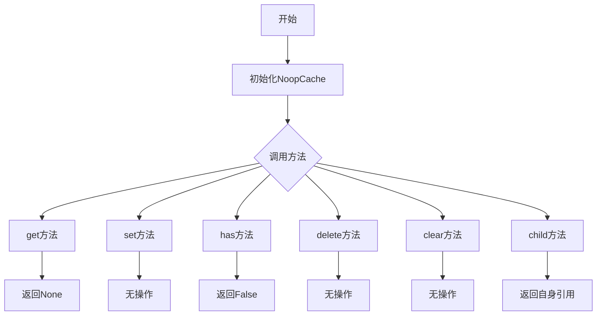

## 类结构

```
Cache (抽象基类)
└── NoopCache (无操作缓存实现)
```

## 全局变量及字段


    

## 全局函数及方法


### `NoopCache.__init__`

这是 `NoopCache` 类的初始化方法，用于创建一个不做任何操作的缓存对象实例，接受任意关键字参数但不执行任何实际逻辑。

参数：

- `**kwargs`：`Any`，接受任意关键字参数，当前实现中未使用，保留用于接口兼容性

返回值：`None`，无返回值

#### 流程图

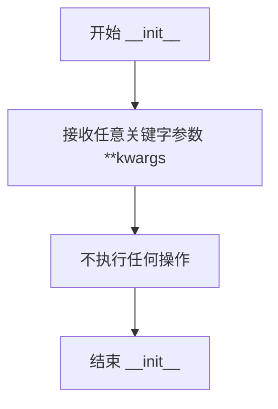

#### 带注释源码

```python
def __init__(self, **kwargs: Any) -> None:
    """Init method definition."""
    # 接受任意关键字参数 **kwargs
    # 该类作为 Cache 接口的空操作实现，主要用于测试场景
    # 当前 __init__ 方法不执行任何实际逻辑
    # 保留 **kwargs 参数是为了保持与父类 Cache 接口的兼容性
```


### `NoopCache.get`

获取给定键对应的值，由于是 NoopCache 实现，该方法始终返回 None。

参数：

- `key`：`str`，要获取值的键

返回值：`Any`，始终返回 `None`

#### 流程图

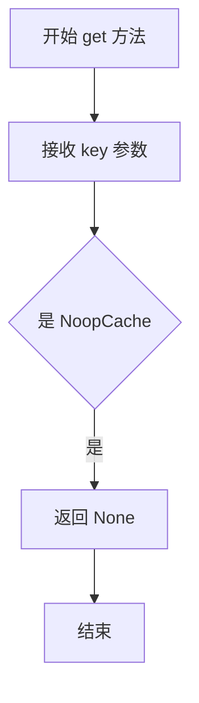

#### 带注释源码

```python
async def get(self, key: str) -> Any:
    """Get the value for the given key.

    Args:
        - key - The key to get the value for.
        - as_bytes - Whether or not to return the value as bytes.

    Returns
    -------
        - output - The value for the given key.
    """
    return None  # NoopCache 实现始终返回 None，不进行任何缓存操作
```


### `NoopCache.set`

设置给定键的值（NoopCache 的 no-op 实现，实际不执行任何操作）。

参数：

- `key`：`str`，要设置的键
- `value`：`str | bytes | None`，要设置的值
- `debug_data`：`dict | None`，可选的调试数据，默认为 None

返回值：`None`，无返回值

#### 流程图

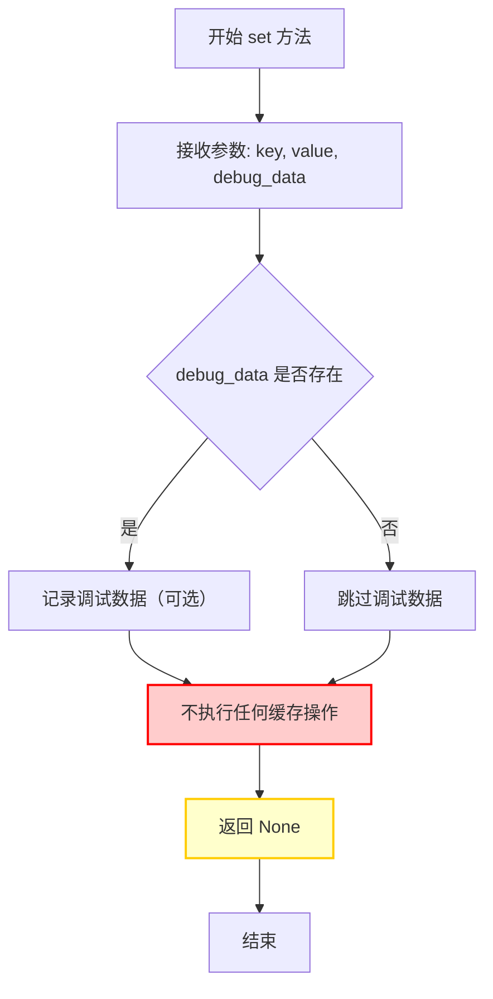

#### 带注释源码

```python
async def set(
    self, key: str, value: str | bytes | None, debug_data: dict | None = None
) -> None:
    """Set the value for the given key.

    Args:
        - key: The key to set the value for.
        - value: The value to set.
        - debug_data: Optional debug data (not used in implementation).
    """
    # NoopCache 是一个空操作实现，不存储任何数据
    # 参数被接收但完全忽略，不执行任何缓存逻辑
    # 方法直接返回 None，不执行任何实际操作
    pass
```


### `NoopCache.has`

该方法是一个异步方法，用于检查给定键是否存在于 NoopCache 缓存中。由于 NoopCache 是一个无操作（no-op）实现，该方法始终返回 False，表示键永远不存在于缓存中。

参数：

- `key`：`str`，要检查是否存在的键

返回值：`bool`，始终返回 False，表示键不存在于缓存中

#### 流程图

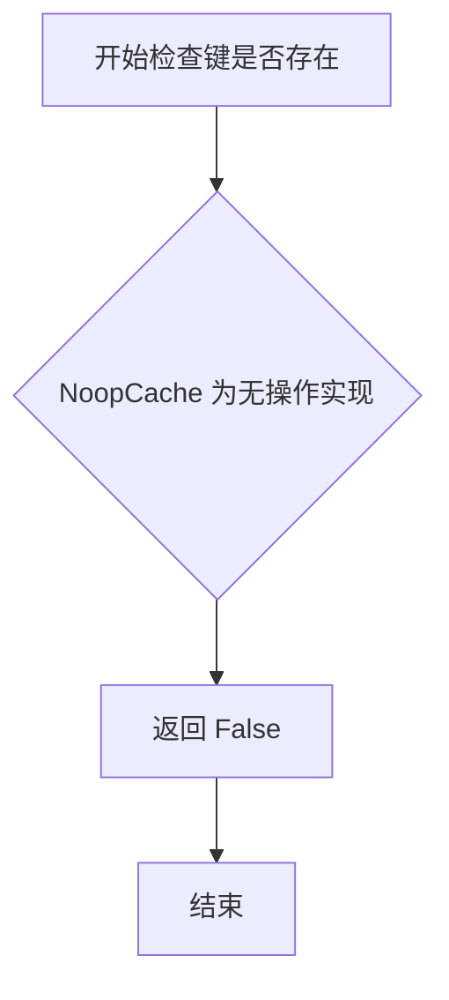

#### 带注释源码

```python
async def has(self, key: str) -> bool:
    """Return True if the given key exists in the cache.

    Args:
        - key: The key to check for.

    Returns
    -------
        - output: True if the key exists in the cache, False otherwise.
    """
    # NoopCache 始终返回 False，因为这是一个无操作实现
    # 缓存中永远不会存储任何数据，因此任何键都不存在
    return False
```


### `NoopCache.delete`

删除缓存中指定键的值（NoopCache 为空操作实现，实际上不执行任何删除操作）

参数：

- `key`：`str`，要删除的键

返回值：`None`，无返回值（NoopCache 不执行任何实际操作）

#### 流程图

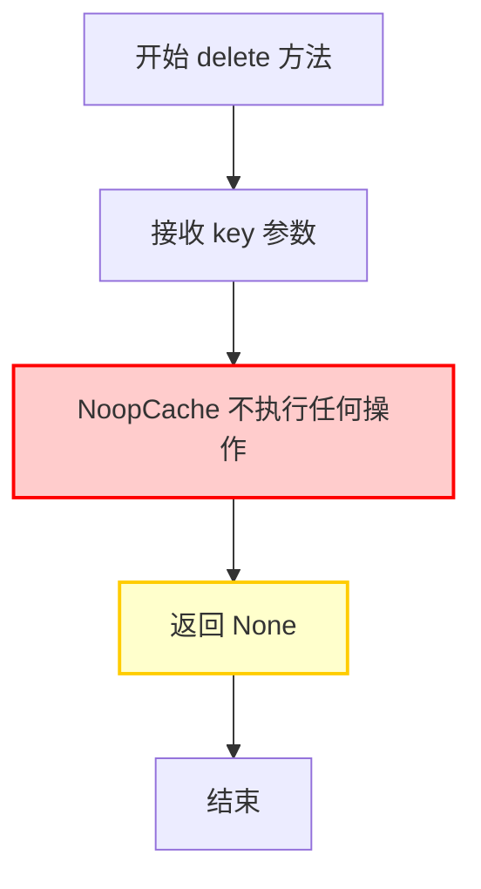

#### 带注释源码

```python
async def delete(self, key: str) -> None:
    """Delete the given key from the cache.

    Args:
        - key - The key to delete.
    """
    # NoopCache.delete 是一个空操作方法
    # 它接受 key 参数但什么都不做，直接返回 None
    # 这种设计通常用于测试环境或禁用缓存的场景
    
    # 参数验证（可选）
    # 在实际的 NoopCache 实现中，通常不做任何验证
    
    # 不执行任何删除操作
    # 直接返回 None
    return None
```


### `NoopCache.clear`

清除缓存内容的异步方法，该方法为空实现，不执行任何实际操作，仅作为 Cache 接口的占位实现。

参数：

- `self`：`NoopCache`，方法所属的实例对象

返回值：`None`，无返回值

#### 流程图

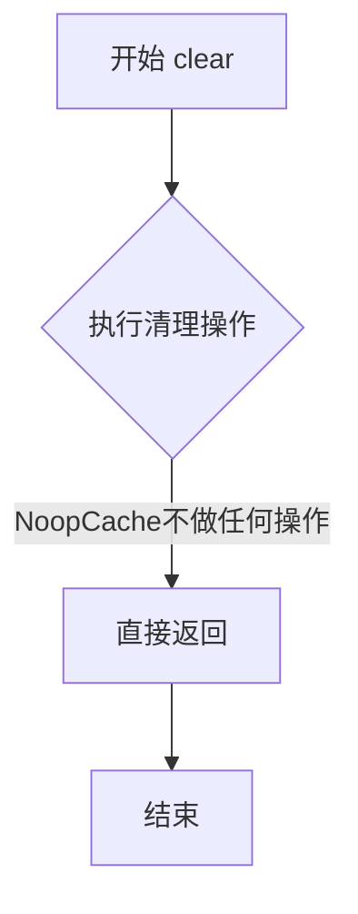

#### 带注释源码

```python
async def clear(self) -> None:
    """Clear the cache."""
    # NoopCache 是一个空实现，不执行任何实际的缓存清理操作
    # 该方法存在是为了满足 Cache 接口的契约
    # 即使调用也不会产生任何副作用或抛出异常
    pass
```


### `NoopCache.child`

创建一个子缓存实例，但由于 NoopCache 是无操作实现，该方法直接返回当前实例本身。

参数：

- `name`：`str`，用于创建子缓存的名称（虽然在 NoopCache 中不起实际作用）

返回值：`Cache`，返回当前 NoopCache 实例本身（self）

#### 流程图

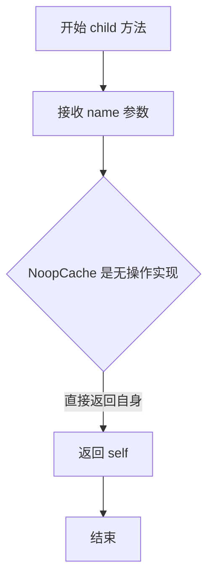

#### 带注释源码

```python
def child(self, name: str) -> "Cache":
    """Create a child cache with the given name.

    Args:
        - name - The name to create the sub cache with.
    """
    # NoopCache 不需要真正的子缓存实现，直接返回自身
    # 这是一个无操作（no-op）实现，所有操作都是空操作
    return self
```

## 关键组件


### 核心功能概述

NoopCache是一个Cache接口的空操作实现类，它实现了缓存的所有基本方法（如get、set、has、delete、clear、child），但实际上不执行任何缓存操作，所有方法均返回默认值或空操作，该实现主要用于测试场景或需要禁用缓存功能的情况。

### 文件整体运行流程

该文件定义了一个继承自Cache基类的NoopCache空操作实现。文件导入typing模块的Any类型和graphrag_cache.cache模块的Cache基类。当需要使用缓存功能但不实际存储数据时（如单元测试或调试场景），实例化NoopCache类即可，其所有异步方法都会立即返回预设的默认值，不会产生任何实际的缓存操作开销。

### 类详细信息

#### NoopCache类

**类描述**：一个空操作的Cache接口实现类，继承自Cache基类，提供所有缓存接口方法的空操作实现，通常用于测试环境或需要禁用缓存功能的场景。

**类字段**：
- 无类字段定义

**类方法**：

##### __init__方法

- **名称**：__init__
- **参数名称**：kwargs
- **参数类型**：Any (可变参数)
- **参数描述**：接受任意关键字参数，用于初始化配置
- **返回值类型**：None
- **返回值描述**：无返回值
- **mermaid流程图**：
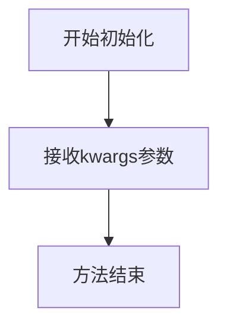
- **带注释源码**：
```python
def __init__(self, **kwargs: Any) -> None:
    """Init method definition."""
    # 接收任意关键字参数但不进行任何处理
    # 这是空操作实现，不需要初始化任何状态
```

##### get方法

- **名称**：get
- **参数名称**：key
- **参数类型**：str
- **参数描述**：要获取值的键名
- **返回值类型**：Any
- **返回值描述**：始终返回None，表示缓存中不存在该键
- **mermaid流程图**：
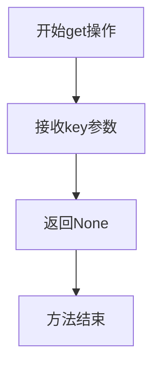
- **带注释源码**：
```python
async def get(self, key: str) -> Any:
    """Get the value for the given key.

    Args:
        - key - The key to get the value for.
        - as_bytes - Whether or not to return the value as bytes.

    Returns
    -------
        - output - The value for the given key.
    """
    return None  # 空操作实现，始终返回None
```

##### set方法

- **名称**：set
- **参数名称**：key, value, debug_data
- **参数类型**：key: str, value: str | bytes | None, debug_data: dict | None
- **参数描述**：key是要设置的键名，value是要存储的值，debug_data是可选的调试数据
- **返回值类型**：None
- **返回值描述**：无返回值，空操作
- **mermaid流程图**：
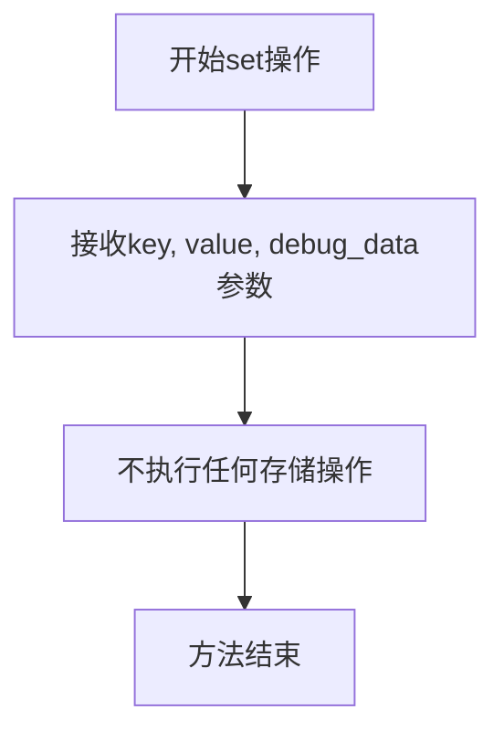
- **带注释源码**：
```python
async def set(
    self, key: str, value: str | bytes | None, debug_data: dict | None = None
) -> None:
    """Set the value for the given key.

    Args:
        - key - The key to set the value for.
        - value - The value to set.
    """
    # 空操作实现，不执行任何存储操作
    pass
```

##### has方法

- **名称**：has
- **参数名称**：key
- **参数类型**：str
- **参数描述**：要检查是否存在的键名
- **返回值类型**：bool
- **返回值描述**：始终返回False，表示键不存在
- **mermaid流程图**：
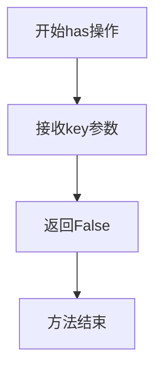
- **带注释源码**：
```python
async def has(self, key: str) -> bool:
    """Return True if the given key exists in the cache.

    Args:
        - key - The key to check for.

    Returns
    -------
        - output - True if the key exists in the cache, False otherwise.
    """
    return False  # 空操作实现，始终返回False
```

##### delete方法

- **名称**：delete
- **参数名称**：key
- **参数类型**：str
- **参数描述**：要删除的键名
- **返回值类型**：None
- **返回值描述**：无返回值，空操作
- **mermaid流程图**：
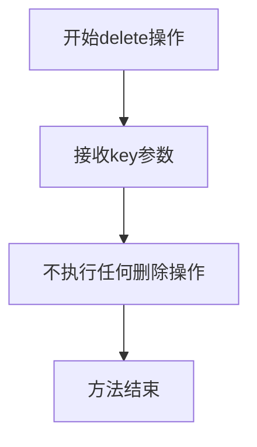
- **带注释源码**：
```python
async def delete(self, key: str) -> None:
    """Delete the given key from the cache.

    Args:
        - key - The key to delete.
    """
    # 空操作实现，不执行任何删除操作
    pass
```

##### clear方法

- **名称**：clear
- **参数名称**：无
- **参数类型**：无
- **参数描述**：无参数，用于清除所有缓存数据
- **返回值类型**：None
- **返回值描述**：无返回值，空操作
- **mermaid流程图**：
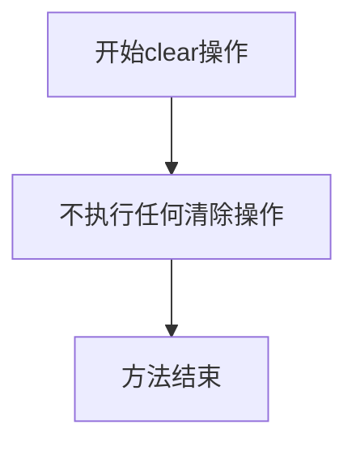
- **带注释源码**：
```python
async def clear(self) -> None:
    """Clear the cache."""
    # 空操作实现，不执行任何清除操作
    pass
```

##### child方法

- **名称**：child
- **参数名称**：name
- **参数类型**：str
- **参数描述**：子缓存的名称
- **返回值类型**：Cache
- **返回值描述**：返回self引用，表示子缓存也是空操作实现
- **mermaid流程图**：
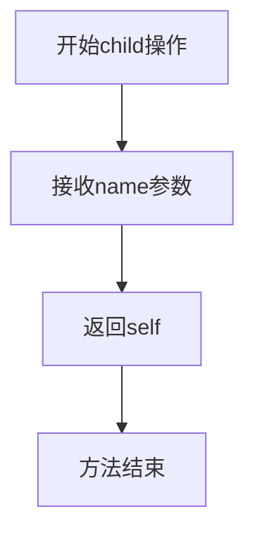
- **带注释源码**：
```python
def child(self, name: str) -> "Cache":
    """Create a child cache with the given name.

    Args:
        - name - The name to create the sub cache with.
    """
    return self  # 返回自身引用，因为本身就是空操作
```

### 全局变量和全局函数

无全局变量和全局函数定义。

### 关键组件信息

#### NoopCache类

空操作缓存实现类，继承Cache基类并提供所有缓存接口方法的空操作实现，是整个文件的核心组件，用于在测试或需要禁用缓存的场景下提供符合接口要求的实现。

#### Cache基类引用

通过导入语句`from graphrag_cache.cache import Cache`引入的基类，定义了缓存接口的契约规范，NoopCache通过继承该基类确保接口兼容性。

### 潜在的技术债务或优化空间

1. **类型注解不完整**：get方法的文档字符串提到了as_bytes参数，但方法签名中并未包含该参数，文档与实现不一致。

2. **缺少类型提示文件**：建议添加py.typed文件以支持静态类型检查工具的精确分析。

3. **child方法返回类型**：child方法返回类型标注为"Cache"字符串形式，应改为直接引用Cache类型或使用from __future__ import annotations。

4. **缺少日志记录**：空操作实现可以添加日志记录，以便在调试时了解缓存操作的调用情况。

5. **文档冗余**：set方法的文档字符串未包含debug_data参数的说明，与其他方法文档风格不一致。

### 其它项目

#### 设计目标与约束

- **设计目标**：提供一个符合Cache接口的空操作实现，用于测试或禁用缓存功能
- **约束**：必须继承自Cache基类并实现其所有抽象方法

#### 错误处理与异常设计

- 该实现不抛出任何异常，所有错误均通过返回默认值处理
- 未实现任何错误恢复机制

#### 数据流与状态机

- 无状态数据流，所有方法均为立即返回的空操作
- 不维护任何内部状态

#### 外部依赖与接口契约

- 依赖graphrag_cache.cache模块中的Cache基类
- 必须实现Cache基类定义的所有异步方法
- 接口契约：get返回Any类型、set接受str|bytes|None值、has返回bool、delete和clear为无返回值的操作、child返回Cache类型实例


## 问题及建议


### 已知问题

-   **方法签名与文档不一致**：`get` 方法的 docstring 中提到了 `as_bytes` 参数，但方法签名中并未定义此参数，会导致文档误导。
-   **参数文档缺失**：`set` 方法的 `debug_data` 参数和 `clear` 方法在 docstring 中缺少描述。
-   **未使用的参数**：`__init__` 方法接收 `**kwargs: Any` 但完全未使用，可能是遗留代码。
-   **返回值类型标注不精确**：`child` 方法返回类型标注为字符串 `"Cache"` 而非直接的 `NoopCache` 类型。
-   **简略的文档字符串**：`__init__` 方法的 docstring 仅为 "Init method definition."，未提供任何实际信息。

### 优化建议

-   移除 `get` 方法 docstring 中的 `as_bytes` 参数描述，或将其添加到方法签名中以保持一致性。
-   补充 `set` 方法 `debug_data` 参数、`clear` 方法参数及返回值的文档描述。
-   如果 `**kwargs` 无实际用途，考虑移除或添加 `# pragma: no cover` 注释说明其存在原因（如保持接口兼容性）。
-   将 `child` 方法的返回类型改为 `NoopCache` 以提高类型安全性。
-   为 `__init__` 方法添加有意义的 docstring，说明该类为无操作缓存实现。

## 其它


### 设计目标与约束

**设计目标**：提供一个无操作的缓存实现（NoopCache），用于测试环境或明确禁用缓存的场景。该类是Cache接口的空实现，所有操作均为空操作，不存储任何数据。

**设计约束**：
- 必须实现Cache接口定义的所有方法
- 保持与真实缓存实现相同的异步API
- 不维护任何内部状态
- 适用于需要缓存接口但不需要实际缓存功能的场景

### 错误处理与异常设计

由于NoopCache是空实现，不存储任何数据，因此：
- `get()` 方法始终返回 `None`，不抛出异常
- `set()` 方法接受任何值但不执行任何操作，不抛出异常
- `has()` 方法始终返回 `False`，不抛出异常
- `delete()` 和 `clear()` 方法为空操作，不抛出异常
- `child()` 方法返回自身，不抛出异常
- 无需额外的错误处理机制

### 数据流与状态机

**数据流**：
- 写入数据流：调用 `set(key, value)` → 不执行任何操作 → 返回 `None`
- 读取数据流：调用 `get(key)` → 不查询任何存储 → 返回 `None`
- 状态检查：调用 `has(key)` → 不查询任何存储 → 返回 `False`

**状态机**：NoopCache无内部状态，不存在状态转换

### 外部依赖与接口契约

**依赖关系**：
- 依赖 `graphrag_cache.cache.Cache` 抽象基类/接口
- 依赖 `typing` 模块中的类型注解

**接口契约**：
- 必须实现 `Cache` 接口的所有抽象方法
- `__init__` 接受任意关键字参数 `**kwargs`，但不使用
- `get()` 返回 `Any` 类型，实际始终返回 `None`
- `set()` 接受 `str | bytes | None` 类型的value
- `has()` 返回 `bool` 类型，实际始终返回 `False`
- `child()` 返回 `Cache` 类型，实际返回自身实例

### 使用场景

1. **测试场景**：在单元测试或集成测试中替换真实缓存，用于测试缓存无关的业务逻辑
2. **开发调试**：在开发阶段禁用缓存以排除缓存相关问题
3. **配置切换**：通过配置选择使用NoopCache或真实缓存实现
4. **默认值**：作为缓存系统的默认空实现

### 性能特性

- 时间复杂度：所有操作均为 O(1)，实际为常数时间（空操作）
- 空间复杂度：不存储任何数据，空间复杂度为 O(0)
- 内存占用：仅包含对象实例的基本内存开销，无额外缓存数据存储

### 线程安全性

由于NoopCache不维护任何状态且所有方法为空操作：
- 本身是线程安全的
- 不需要任何锁机制
- 多次并发调用不会产生竞态条件

### 序列化与反序列化

NoopCache不存储任何数据，因此：
- 不需要实现任何序列化/反序列化方法
- 不需要持久化能力
- 每次实例化都是全新的空缓存

### 版本兼容性

- 当前版本：基于Python 3.9+类型注解（使用 `str | bytes` 联合类型）
- 依赖的Cache接口版本需与实现版本匹配
- 异步方法设计符合Python asyncio规范

### 相关配置参数

| 参数名 | 类型 | 描述 |
|--------|------|------|
| kwargs | Any | 接受任意关键字参数，当前实现中未使用 |


    