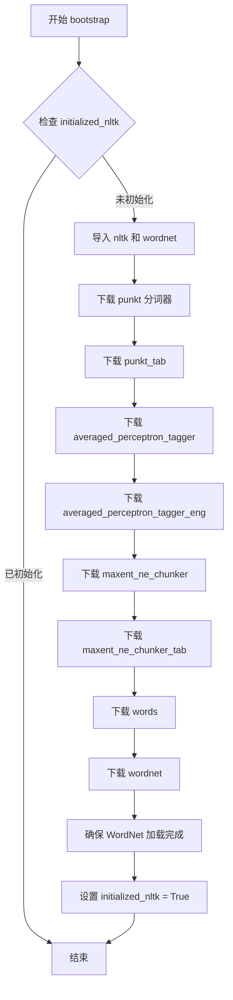

# `graphrag\packages\graphrag-chunking\graphrag_chunking\bootstrap_nltk.py` 详细设计文档

这是一个NLTK自然语言处理工具包的初始化引导模块，通过bootstrap函数下载并初始化所需的NLTK语料库资源（包括punkt分词器、pos标注器、命名实体识别器和wordnet词库），确保后续NLP任务能够正常运行。

## 整体流程

```mermaid
graph TD
    A[开始 bootstrap] --> B{initialized_nltk?}
    B -- 是 --> C[直接返回，不做任何操作]
    B -- 否 --> D[导入 nltk 和 wordnet]
    E[开始下载NLTK资源] --> F[nltk.download('punkt')]
    F --> G[nltk.download('punkt_tab')]
    G --> H[nltk.download('averaged_perceptron_tagger')]
    H --> I[nltk.download('averaged_perceptron_tagger_eng')]
    I --> J[nltk.download('maxent_ne_chunker')]
    J --> K[nltk.download('maxent_ne_chunker_tab')]
    K --> L[nltk.download('words')]
    L --> M[nltk.download('wordnet')]
    M --> N[wn.ensure_loaded()]
    N --> O[设置 initialized_nltk = True]
    O --> P[bootstrap完成]
    C --> P
```

## 类结构

```
bootstrap.py (模块文件)
└── 无类定义，仅包含全局函数和变量
```

## 全局变量及字段


### `initialized_nltk`
    
标记NLTK是否已初始化的全局标志变量

类型：`bool`
    


    

## 全局函数及方法


### `bootstrap`

该函数是NLTK语料库资源的引导初始化函数，用于在首次调用时自动下载并加载NLTK所需的词法资源（分词器、词性标注器、命名实体识别器和WordNet词库），确保后续NLP功能可以正常使用，通过全局标志位防止重复初始化。

参数：

- 无参数

返回值：`None`，无返回值

#### 流程图



#### 带注释源码

```python
# 全局变量：标记NLTK是否已完成初始化，防止重复下载资源
initialized_nltk = False


def bootstrap():
    """Bootstrap definition."""
    # 使用全局变量记录初始化状态
    global initialized_nltk
    # 检查是否已初始化，避免重复下载
    if not initialized_nltk:
        # 导入NLTK库和WordNet语料库
        import nltk
        from nltk.corpus import wordnet as wn

        # 下载punkt分词器数据
        nltk.download("punkt")
        # 下载punkt_tab分词器数据（标点符号表）
        nltk.download("punkt_tab")
        # 下载词性标注器模型
        nltk.download("averaged_perceptron_tagger")
        # 下载英语词性标注器模型
        nltk.download("averaged_perceptron_tagger_eng")
        # 下载命名实体识别chunkers模型
        nltk.download("maxent_ne_chunker")
        # 下载命名实体识别chunkers表格数据
        nltk.download("maxent_ne_chunker_tab")
        # 下载英语词汇表
        nltk.download("words")
        # 下载WordNet词库
        nltk.download("wordnet")
        # 确保WordNet语料库完全加载
        wn.ensure_loaded()
        # 标记已初始化完成
        initialized_nltk = True
```

## 关键组件


### 全局状态管理

使用全局布尔变量 `initialized_nltk` 标记NLTK是否已完成初始化，实现惰性加载模式，避免重复下载NLTK资源。

### 警告过滤机制

通过 `warnings.filterwarnings` 过滤来自numba编译器的特定警告消息（nopython关键字和使用无seed并行化），保持日志输出清洁。

### NLTK资源引导器

`bootstrap()` 函数作为主入口，负责在首次调用时自动下载并初始化所有必需的NLTK语料库和模型资源，包括分词器、词性标注器、命名实体识别器和WordNet词典。

### NLTK资源清单

代码中预定义的需要下载的NLTK数据包列表：punkt（分词器）、punkt_tab（分词器数据）、averaged_perceptron_tagger（词性标注器）、averaged_perceptron_tagger_eng（英语词性标注模型）、maxent_ne_chunker（命名实体识别）、maxent_ne_chunker_tab（NER模型数据）、words（英语词汇表）、wordnet（WordNet同义词词典）。


## 问题及建议


### 已知问题

-   **线程安全问题**：使用全局变量 `initialized_nltk` 进行初始化状态检查，在多线程环境下可能导致重复初始化或竞争条件
-   **静默失败无反馈**：NLTK 数据的下载过程没有任何进度反馈或日志输出，若下载失败用户无法得知原因
-   **缺乏异常处理**：未对 `nltk.download()` 和 `wn.ensure_loaded()` 可能抛出的异常进行捕获和处理
-   **硬编码的依赖列表**：所有需要下载的 NLTK 资源以硬编码方式列出，扩展性和可维护性差
-   **无缓存检查机制**：未检查数据是否已存在，每次调用都会执行 `ensure_loaded()`，可能导致不必要的网络请求
-   **函数无返回值**：调用者无法判断初始化是否成功，增加了调试难度
-   **警告过滤时机不当**：模块级别的 `warnings.filterwarnings` 可能在其他模块加载前就生效，影响范围不可控

### 优化建议

-   使用线程锁（如 `threading.Lock`）或单例模式确保初始化过程线程安全
-   添加日志记录或进度回调机制，向用户反馈下载状态和结果
-   封装 `try-except` 块，捕获网络错误、磁盘空间不足等异常情况，并提供友好的错误信息
-   将 NLTK 资源列表提取为配置参数或常量，支持动态扩展
-   在下载前检查资源是否已存在（如 `nltk.data.find()` ），避免重复下载
-   返回布尔值或抛出自定义异常，让调用者感知初始化结果
-   考虑使用 `nltk.downloader` 的编程接口获取更精细的下载控制
-   将警告过滤移至需要的时候（如初始化函数内部），或使用上下文管理器限制其作用范围

## 其它


### 设计目标与约束

本模块的设计目标是在程序启动时确保NLTK库所需的全部数据资源（语料库、词性标注器、命名实体识别模型等）已正确下载并加载到本地环境，避免在后续NLP操作中因缺失资源而导致的运行时错误。约束条件包括：需要网络连接以下载NLTK数据包、下载过程可能耗时较长、存储空间需求取决于NLTK数据包的完整程度。

### 错误处理与异常设计

代码本身未包含显式的异常处理机制，潜在的异常情况包括：网络连接失败导致NLTK数据下载失败、磁盘空间不足导致下载中断、已下载的NLTK数据包损坏导致加载失败。建议在实际调用处添加try-except块捕获网络超时异常和NLTK数据加载异常，并提供友好的错误提示和重试机制。

### 数据流与状态机

本模块采用简单的二状态状态机：初始状态（initialized_nltk=False）和已初始化状态（initialized_nltk=True）。数据流为单向：检查initialized_nltk标志 → 如未初始化则执行NLTK数据下载和加载 → 设置标志为True。状态转换仅发生一次，后续调用直接跳过初始化流程。

### 外部依赖与接口契约

本模块依赖以下外部组件：Python标准库warnings模块用于抑制Numba警告；Python标准库global语句用于维护全局状态；nltk第三方库提供自然语言处理功能。接口契约为：bootstrap()函数无参数输入，无返回值（返回None），调用方应确保在主程序启动早期调用以完成NLTK环境初始化。

### 性能考虑与优化建议

当前实现采用全局单次初始化模式，优点是避免重复下载，缺点是首次调用可能阻塞较长时间。优化建议包括：支持分批下载以提供进度反馈、支持配置数据下载路径、支持异步下载机制、提供初始化状态查询接口以便外部判断是否需要等待。

### 安全性考虑

本模块在运行时自动下载远程资源，潜在安全风险包括：网络中间人攻击导致下载恶意数据、供应链攻击。建议措施包括：验证下载数据的哈希值、添加数据完整性校验、使用可信网络环境。

### 测试策略

建议包含以下测试用例：测试initialized_nltk初始值为False、测试bootstrap调用后值为True、测试重复调用不会重复下载、测试网络异常时的错误处理、测试NLTK各数据包是否成功加载。

### 版本兼容性

代码明确指定使用Python环境，NLTK版本兼容性需在依赖管理中明确。建议在项目依赖配置中指定兼容的NLTK版本范围（如nltk>=3.8），并定期更新以获取最新的语料库和模型支持。

### 配置管理

当前实现为硬编码模式，所有NLTK数据包名称和下载参数直接写在代码中。建议改进为：支持通过配置文件或环境变量指定下载哪些数据包、支持自定义下载路径、支持离线模式（假设数据已预置）。

### 部署注意事项

在容器化部署场景中，建议：提前在镜像构建阶段完成NLTK数据下载以避免运行时网络依赖、考虑将NLTK数据打包到容器镜像中以提高启动速度、设置合理的超时时间以处理网络不稳定情况。


    