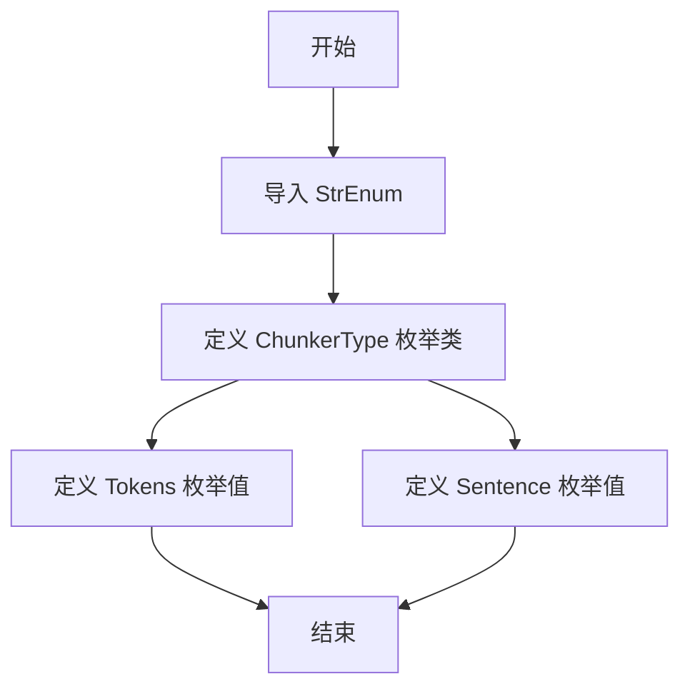
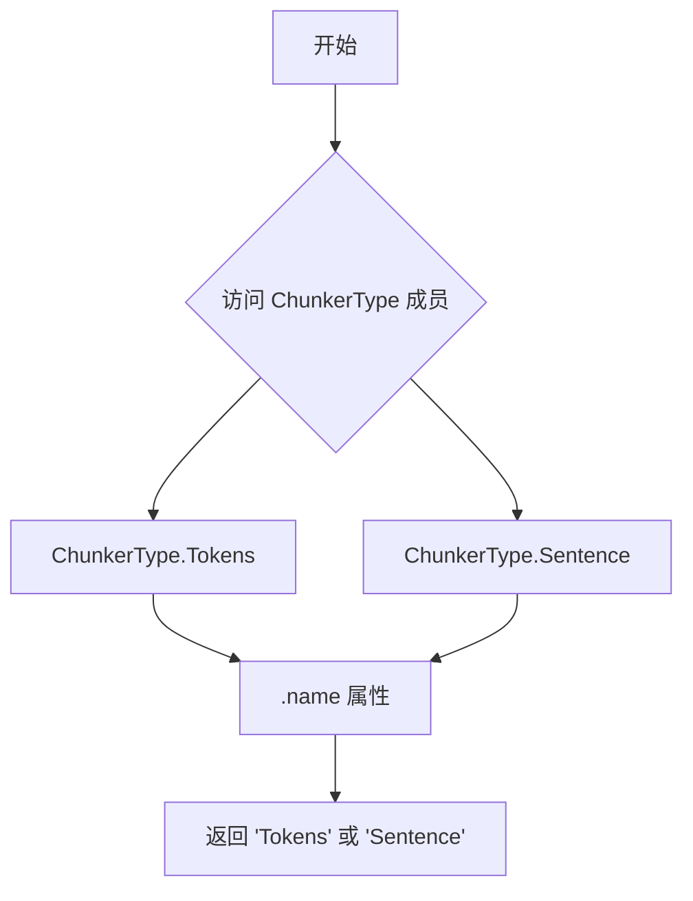
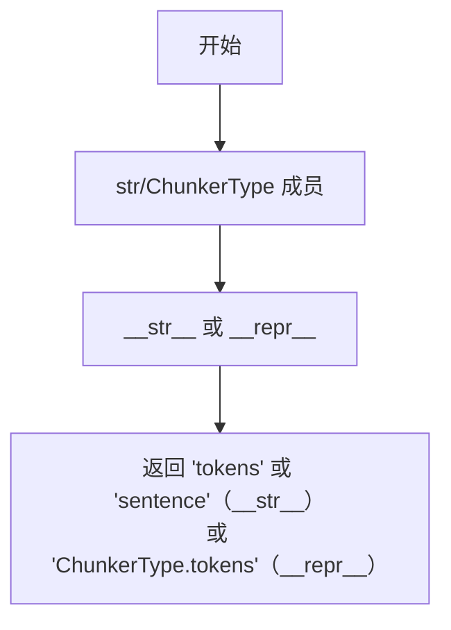

# `graphrag\packages\graphrag-chunking\graphrag_chunking\chunk_strategy_type.py` 详细设计文档

该代码定义了一个名为 ChunkerType 的字符串枚举类，用于表示分块策略（Chunk Strategy）的类型，目前包含两种策略：基于词元（Tokens）和基于句子（Sentence）的分块方式。

## 整体流程



## 类结构

```
StrEnum (Python 标准库枚举基类)
└── ChunkerType (分块策略类型枚举)
    ├── Tokens = "tokens"
    └── Sentence = "sentence"
```

## 全局变量及字段


### `ChunkerType.Tokens`
    
基于分词的文本分块策略类型枚举成员

类型：`ChunkerType`
    


### `ChunkerType.Sentence`
    
基于句子的文本分块策略类型枚举成员

类型：`ChunkerType`
    
    

## 全局函数及方法


### ChunkerType

`ChunkerType` 是一个继承自 `StrEnum` 的枚举类，用于定义分块策略的类型。它包含两个枚举成员：`Tokens`（基于令牌的分块）和 `Sentence`（基于句子的分块）。作为 `StrEnum`，它同时具备字符串和枚举的特性，支持字符串比较操作并保留了枚举的类型安全优势。

#### 继承自 StrEnum（Enum）的关键方法

##### `.name`

获取枚举成员的名称。

参数：此方法不接受任何参数

返回值：`str`，返回枚举成员的名称

#### 流程图



#### 带注释源码

```python
class ChunkerType(StrEnum):
    """ChunkerType class definition."""
    # StrEnum 是 str 和 Enum 的组合，自动将成员值转换为字符串
    # 继承自 Enum 的核心方法：

    # name 属性：获取成员名称
    # 示例：ChunkerType.Tokens.name -> 'Tokens'
    # 示例：ChunkerType.Sentence.name -> 'Sentence'

    Tokens = "tokens"   # 令牌分块策略
    Sentence = "sentence"  # 句子分块策略
```

---

##### `.value`

获取枚举成员的值（字符串类型）。

参数：此方法不接受任何参数

返回值：`str`，返回枚举成员的实际值（字符串）

#### 流程图


#### 带注释源码

```python
class ChunkerType(StrEnum):
    """ChunkerType class definition."""

    # value 属性：获取成员的实际值（字符串）
    # 由于继承自 str，value 返回的是字符串类型
    # 示例：ChunkerType.Tokens.value -> 'tokens'
    # 示例：ChunkerType.Sentence.value -> 'sentence'

    Tokens = "tokens"
    Sentence = "sentence"
```

---

##### `__str__` / `__repr__`

返回枚举成员的字符串表示。

参数：此方法不接受任何参数

返回值：`str`，返回对象的字符串表示

#### 流程图



#### 带注释源码

```python
class ChunkerType(StrEnum):
    """ChunkerType class definition."""

    # __str__ 方法：StrEnum 重写了 __str__，返回成员的值（字符串）
    # 示例：str(ChunkerType.Tokens) -> 'tokens'
    # 示例：repr(ChunkerType.Tokens) -> 'ChunkerType.tokens'

    Tokens = "tokens"
    Sentence = "sentence"
```

---

### 类详细信息

#### 类字段

| 字段名称 | 类型 | 描述 |
|---------|------|------|
| Tokens | ChunkerType | 基于令牌的分块策略枚举成员，值为字符串 "tokens" |
| Sentence | ChunkerType | 基于句子的分块策略枚举成员，值为字符串 "sentence" |

#### 类方法

`ChunkerType` 类本身没有自定义方法，所有功能均继承自 `StrEnum`（`Enum` + `str`）。

---

### 关键组件信息

| 组件名称 | 描述 |
|---------|------|
| StrEnum | Python 3.11+ 的标准库枚举类，继承自 `str` 和 `Enum`，使枚举成员可直接作为字符串使用 |
| ChunkerType | 项目中定义的分块策略类型枚举，用于在代码中区分不同的文本分块策略 |

---

### 潜在的技术债务或优化空间

1. **功能单一**：当前 `ChunkerType` 仅包含两种分块策略，随着业务需求增长，可能需要添加更多策略（如段落分块、递归分块等），建议预留扩展接口。

2. **缺少验证逻辑**：没有对成员值进行验证，如果需要限制可用的分块策略类型，建议添加校验机制。

3. **文档完善**：类注释较为简单，建议增加每个枚举成员的详细说明文档。

---

### 其它项目

#### 设计目标与约束

- **目标**：提供类型安全的分块策略枚举，支持字符串操作
- **约束**：依赖 Python 3.11+ 的 `StrEnum` 功能

#### 错误处理与异常设计

- 作为标准枚举类，不涉及特殊错误处理
- 访问不存在的成员会抛出 `ValueError`

#### 外部依赖与接口契约

- 依赖 Python 标准库 `enum.StrEnum`（Python 3.11+）
- 可直接与字符串进行比较：`if chunker_type == "tokens":`

#### 数据流与状态机

- 作为配置枚举使用，不涉及复杂的状态机逻辑
- 在分块器初始化时作为参数传入，指定使用的分块策略


## 关键组件


### ChunkerType

分块策略类型枚举类，继承自 StrEnum，用于定义文本分块的不同策略类型。

### Tokens

基于Token的分块策略枚举值，字符串值为 "tokens"，用于按Token数量进行文本分块。

### Sentence

基于句子的分块策略枚举值，字符串值为 "sentence"，用于按句子边界进行文本分块。


## 问题及建议


### 已知问题

- 枚举类文档不完整：类文档字符串仅包含类名重复说明，未说明该枚举的用途、使用场景和设计背景
- 枚举成员缺乏注释：Tokens和Sentence两个成员没有注释说明其具体含义、适用场景和区别
- 枚举成员数量有限：仅定义两种chunker类型，可能无法满足实际业务需求（如Character、Paragraph、Recursive等常见分块策略）
- 扩展性不足：未提供动态扩展机制或配置化能力，未来新增chunker类型需要修改源码
- 与其他模块协调性未知：未体现与其他组件（如ChunkerConfig、ChunkerFactory等）的协作关系
- 缺少验证逻辑：未对枚举值进行运行时验证或边界检查

### 优化建议

- 完善类级文档：说明ChunkerType的用途、适用场景及设计意图
- 为每个枚举成员添加文档注释：说明Tokens（基于token分块）和Sentence（基于句子分块）的具体使用场景和特点
- 考虑增加更多分块策略：参考行业实践添加Character、Paragraph、Recursive、MarkdownHeader等常见类型
- 添加扩展机制：考虑使用配置文件或注册模式支持动态扩展
- 添加类型提示：虽然继承StrEnum已隐含str类型，但可显式声明以提高代码清晰度
- 考虑添加枚举成员验证方法：确保枚举值在使用前经过有效验证

## 其它


### 设计目标与约束

该代码定义了一个简单的字符串枚举类 `ChunkerType`，用于标识不同的分块策略类型。设计目标是提供一个类型安全的枚举来区分基于令牌（Tokens）和基于句子（Sentence）的分块策略。约束方面，该类继承自 Python 3.11+ 的 `StrEnum`，确保枚举成员值为字符串类型且支持字符串比较操作。

### 错误处理与异常设计

由于该代码仅为枚举定义，不涉及复杂的业务逻辑，因此不包含显式的错误处理机制。潜在的错误主要来自枚举值的使用场景：当调用方传入非法的分块策略名称时，Python 的枚举机制会自动抛出 `ValueError`。建议在调用处进行参数校验，确保传入的字符串值匹配枚举成员。

### 数据流与状态机

该代码不涉及状态机或复杂的数据流。作为一个简单的枚举类，其数据流为：调用方导入 `ChunkerType` → 使用枚举成员（如 `ChunkerType.Tokens`）或枚举值（如 `"tokens"`）→ 传递给下游的分块器组件。枚举类本身为静态配置，不包含可变状态。

### 外部依赖与接口契约

该代码仅依赖 Python 标准库中的 `enum.StrEnum`。接口契约方面，该类向下游组件提供两个枚举成员：`Tokens`（值为 `"tokens"`）和 `Sentence`（值为 `"sentence"`）。下游组件应接受 `ChunkerType` 枚举或字符串值作为分块策略参数，并确保传入值属于定义的枚举范围。

### 版本兼容性

该代码使用 `StrEnum`，该枚举类型仅在 Python 3.11 及以上版本可用。对于支持 Python 3.9-3.10 的项目，需要将 `StrEnum` 替换为继承 `str` 和 `Enum` 的自定义类实现。最低依赖版本为 Python 3.11。

### 安全考虑

该代码不涉及用户输入处理、网络通信或敏感数据操作，因此不包含安全相关的风险。枚举成员值均为公开的配置标识符，不存在信息泄露风险。

### 性能考虑

作为静态枚举类，该代码在运行时不产生额外的性能开销。枚举成员的访问和字符串比较操作均经过 Python 内部优化，适合高频调用场景。

### 使用示例

```python
from graphrag.query.structured_search.global_search.community_detection.chunking import ChunkerType

# 方式一：使用枚举成员
strategy = ChunkerType.Tokens

# 方式二：使用字符串值
strategy_name = "sentence"

# 字符串比较
if strategy == ChunkerType.Tokens:
    pass
```

### 扩展性分析

当前枚举包含两个成员，未来可根据需求扩展新的分块策略，如 `Paragraph`（段落级别）、`Page`（页面级别）等。扩展时只需在枚举类中添加新的成员定义，无需修改现有调用代码，符合开闭原则。


    