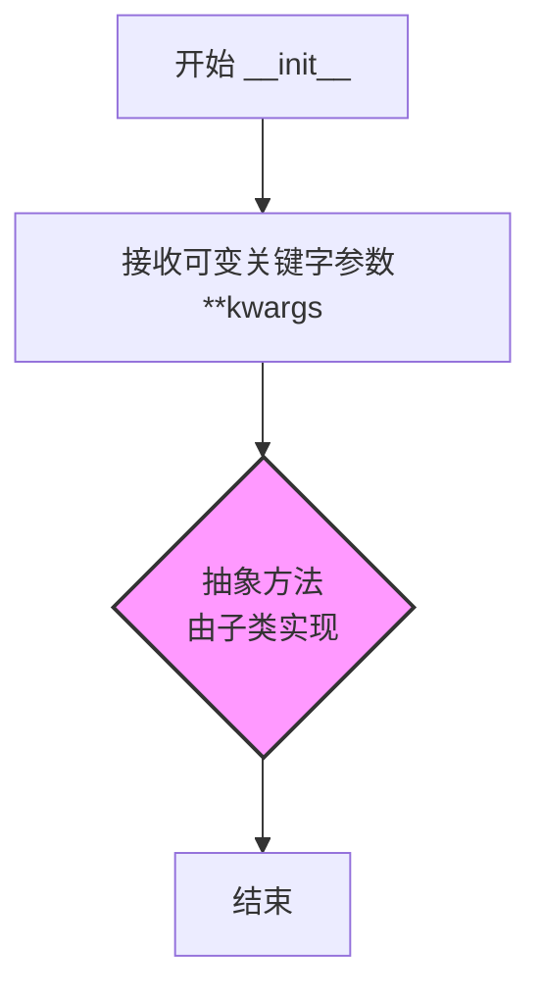

# `graphrag\packages\graphrag-chunking\graphrag_chunking\chunker.py` 详细设计文档

这是一个文档分块模块，定义了Chunker抽象基类，用于实现各种文档文本分块策略。抽象基类声明了统一的接口规范，具体分块实现类需继承并实现chunk方法，将长文本分割成多个TextChunk对象。

## 整体流程

```mermaid
graph TD
    A[开始] --> B[导入依赖模块]
B --> C[定义Chunker抽象基类]
C --> D[定义__init__抽象方法]
D --> E[定义chunk抽象方法]
E --> F[chunk方法接收text和transform参数]
F --> G{transform参数是否为空}
G -- 是 --> H[对text应用transform函数]
G -- 否 --> I[直接使用原始text]
H --> J[调用子类实现的具体分块逻辑]
I --> J
J --> K[返回list[TextChunk]]
```

## 类结构

```
Chunker (抽象基类)
└── (待实现的子类，如：SentenceChunker, ParagraphChunker, TokenChunker等)
```

## 全局变量及字段


    

## 全局函数及方法


### `Chunker.__init__`

这是 `Chunker` 抽象基类的初始化方法，定义了一个用于配置分块器的接口。该方法为抽象方法，具体实现由子类完成，用于初始化各种类型的文档分块器。

参数：

- `kwargs`：`Any`，可变关键字参数，用于配置分块器

返回值：`None`，无返回值

#### 流程图



#### 带注释源码

```python
@abstractmethod
def __init__(self, **kwargs: Any) -> None:
    """Create a chunker instance.
    
    这是一个抽象方法，具体实现由子类提供。
    子类通常会在此方法中处理配置参数，
    如块大小、重叠量、编码方式等分块策略的设置。
    
    Args:
        **kwargs: 可变关键字参数，用于配置分块器。
                  具体的参数由子类决定，常见的包括：
                  - chunk_size: 块大小
                  - chunk_overlap: 块重叠量
                  - encoding: 文本编码方式
    
    Returns:
        None: 此方法不返回任何值
    
    Example:
        子类实现示例:
        ```python
        class TextChunker(Crawler):
            def __init__(self, chunk_size: int = 500, **kwargs) -> None:
                super().__init__(**kwargs)
                self.chunk_size = chunk_size
        ```
    """
```


### `Chunker.chunk`

该方法是 `Chunker` 抽象基类的核心抽象方法，用于将输入的文本字符串分割成多个 `TextChunk` 文本块，支持可选的文本转换函数对原始文本进行预处理。

**参数：**

- `text`：`str`，待分块的文本
- `transform`：`Callable[[str], str] | None`，可选的文本转换函数，用于在分块前对文本进行预处理

**返回值：** `list[TextChunk]`，返回文本块列表

#### 流程图

```mermaid
flowchart TD
    A[开始 chunk 方法] --> B{transform 是否为 None?}
    B -- 是 --> C[直接使用原始 text]
    B -- 否 --> D[应用 transform 函数到 text]
    D --> C
    C --> E[执行分块逻辑<br>（由子类实现）]
    E --> F[返回 list[TextChunk]]
```

#### 带注释源码

```python
@abstractmethod
def chunk(
    self, text: str, transform: Callable[[str], str] | None = None
) -> list[TextChunk]:
    """Chunk method definition.
    
    抽象方法，由子类实现具体的分块逻辑。
    
    参数:
        text: 待分块的文本字符串
        transform: 可选的文本转换函数，接收字符串并返回字符串，
                   用于在分块前对文本进行预处理（如清洗、标准化等）
    
    返回:
        list[TextChunk]: 文本块列表，每个元素是一个 TextChunk 对象
    
    注意:
        - 该方法为抽象方法，子类必须实现具体逻辑
        - transform 参数允许调用者在分块前对文本进行自定义处理
    """
    ...
```

## 关键组件


### Chunker（抽象基类）

文档分块的抽象基类，定义了分块器的接口规范，继承自ABC，用于实现不同的文档分块策略。

### __init__（抽象方法）

分块器的初始化方法，接受任意关键字参数，用于创建分块器实例。

### chunk（抽象方法）

文档分块的核心方法，接收文本字符串和可选的转换函数，返回TextChunk列表。

### TextChunk（外部依赖）

从graphrag_chunking.text_chunk模块导入的分块结果类型，表示文本分块的数据结构。

### Callable（类型提示）

从collections.abc导入的可调用类型，用于定义转换函数的类型注解，支持将字符串转换为字符串的可选函数。


## 问题及建议


### 已知问题

-   **抽象 `__init__` 设计不当**：在抽象基类中定义抽象 `__init__` 方法是冗余且不常见的做法，抽象类通常可以直接定义具体的初始化方法，子类会自动继承
-   **文档字符串不完整**：`chunk` 方法的文档字符串仅包含"Chunk method definition."，缺少对参数、返回值和行为的详细说明，影响子类的实现理解和 API 可用性
-   **类型注解兼容性问题**：使用 `Callable[[str], str] | None` 语法（Python 3.10+ 联合类型），未考虑与更低版本 Python 的兼容性
-   **导入未使用**：导入了 `TextChunk` 类型但在当前文件中未使用，虽然这可能是为子类预留，但应添加类型注解或注释说明其用途
-   **功能灵活性不足**：`chunk` 方法仅接收 `text` 和 `transform` 两个参数，缺少对分块策略的配置化支持（如 chunk 大小、重叠字符数、最小/最大块长度等）

### 优化建议

-   移除抽象 `__init__` 方法，改为提供具体初始化方法或直接在抽象方法中定义默认参数
-   完善 `chunk` 方法的文档字符串，包括参数说明、返回值描述和使用示例
-   考虑使用 `Optional[Callable[[str], str]]` 替代 `|` 运算符以提高 Python 版本兼容性，或在项目中明确 Python 版本要求
-   在类或方法注释中说明 `TextChunk` 的用途，如"返回的 TextChunk 对象包含..."
-   扩展 `chunk` 方法参数，添加配置选项如 `chunk_size`、`overlap` 等，或接受配置对象以支持不同的分块策略
-   定义自定义异常类（如 `ChunkingError`）以支持更精细的错误处理和异常传播

## 其它


### 设计目标与约束

本模块的设计目标是提供一个抽象的文档分块（Chunking）框架，用于将长文本分割成较小的、结构化的文本块（TextChunk），以便后续的图谱检索、嵌入生成等处理。设计约束包括：1）必须继承自 ABC 抽象基类，确保实现类提供统一的接口；2）支持可选的文本转换函数（transform），允许在分块前对文本进行预处理；3）分块结果必须返回 TextChunk 对象列表。

### 错误处理与异常设计

由于 Chunker 是抽象基类，其本身的错误处理由子类实现。常见的异常场景包括：1）输入文本为空或 None 时，应抛出 ValueError 或返回空列表；2）transform 函数执行失败时，应捕获异常并提供有意义的错误信息；3）TextChunk 构造失败时，应向上传播异常。当前代码未定义具体的异常类，建议在子类实现中添加自定义异常（如 ChunkerError）以区分不同类型的错误。

### 数据流与状态机

数据流如下：1）调用方传入原始文本字符串和可选的 transform 函数；2）如果提供了 transform 函数，先对文本进行转换处理；3）分块逻辑将处理后的文本分割成多个片段；4）每个片段被封装为 TextChunk 对象；5）返回 TextChunk 列表。无状态机设计，因为 Chunker 类本身不维护持久状态，每次 chunk() 调用都是独立的操作。

### 外部依赖与接口契约

外部依赖包括：1）abc 模块（ABC, abstractmethod）用于定义抽象基类；2）collections.abc 模块（Callable）用于类型提示；3）typing 模块（Any）用于灵活的类型标注；4）graphrag_chunking.text_chunk 模块（TextChunk）作为返回值类型。接口契约：子类必须实现 __init__ 和 chunk 方法；chunk 方法签名必须为 (text: str, transform: Callable[[str], str] | None = None) -> list[TextChunk]。

### 配置与参数说明

Chunker 抽象类本身不定义具体配置参数，参数通过 kwargs 传递给子类的 __init__ 方法。常见的子类配置参数可能包括：1）chunk_size：单个文本块的最大字符数；2）chunk_overlap：相邻文本块之间的重叠字符数；3）separator：分块分隔符；4）min_chunk_size：最小块大小阈值。

### 性能考虑

性能考量点：1）transform 函数可能被频繁调用，应确保其高效执行；2）对于大量文本的分块，应考虑使用生成器（generator）而非一次性返回完整列表，以降低内存占用；3）文本处理应避免不必要的字符串复制操作。当前设计未包含性能优化机制，建议在子类实现中添加缓存或流式处理支持。

### 安全性考虑

安全性方面：1）transform 函数可能执行任意代码，应对不可信的 transform 函数进行验证或限制；2）文本输入应防止注入攻击，特别是在 transform 函数中；3）TextChunk 对象可能包含敏感信息，应考虑访问控制。当前代码未包含安全相关的实现，建议在文档中声明使用限制。

### 并发与线程安全

由于 Chunker 类不维护内部状态（除了可能的配置参数），chunk() 方法本身是线程安全的。但需要注意：1）如果子类在 __init__ 中缓存了可变状态，可能导致线程安全问题；2）transform 函数如果包含共享状态，可能存在竞态条件；3）TextChunk 对象的创建过程是线程安全的。建议在子类文档中明确说明线程安全性。

### 序列化与反序列化

当前模块不包含序列化相关代码。如果需要序列化：1）Chunker 子类实例可以通过 pickle 进行序列化，但 transform 函数可能无法正确序列化；2）TextChunk 对象应实现 __getstate__ 和 __setstate__ 方法以支持自定义序列化；3）建议在设计时将配置参数与运行时状态分离，便于序列化恢复。

### 测试策略

测试建议：1）为每个 Chunker 子类编写单元测试，验证分块结果的正确性；2）测试边界情况：空文本、单字符文本、极长文本；3）测试 transform 函数的应用是否正确；4）测试 chunk_size 和 chunk_overlap 等参数的有效性；5）使用 mock 对象测试与 TextChunk 的交互；6）性能测试确保分块效率满足要求。


    