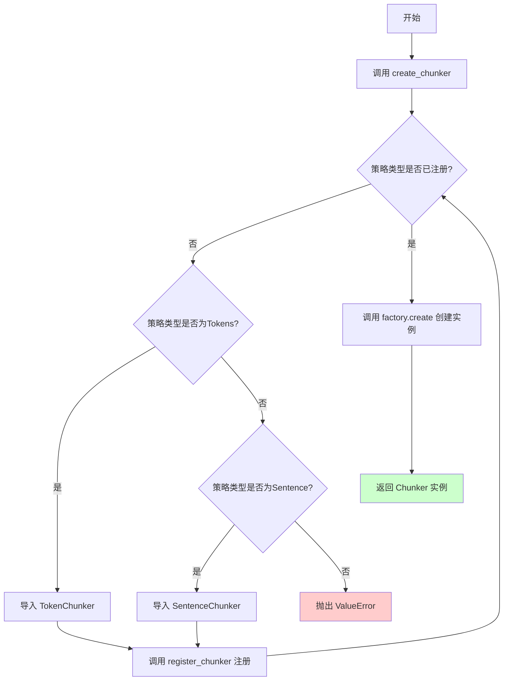
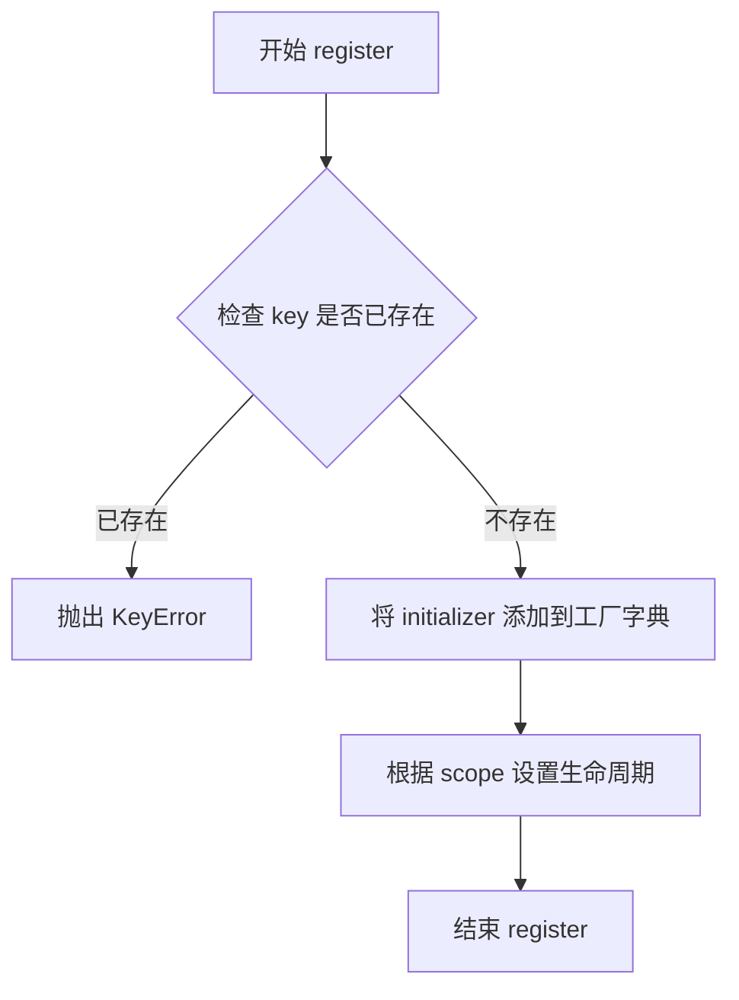
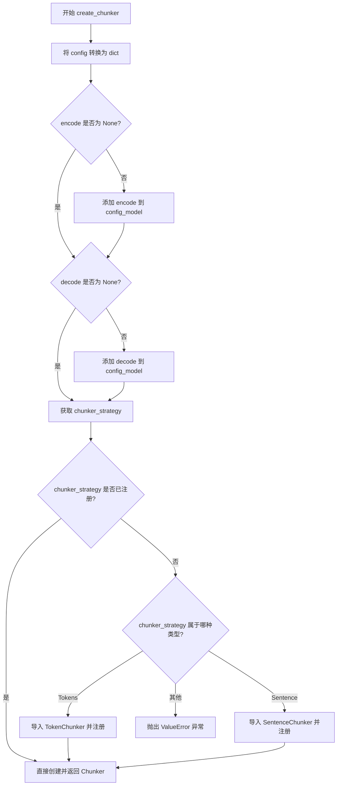
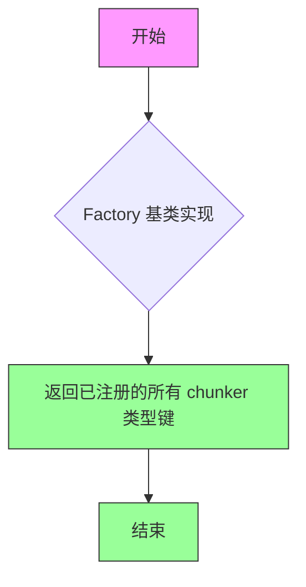

# `graphrag\packages\graphrag-chunking\graphrag_chunking\chunker_factory.py` 详细设计文档

这是一个分块器工厂模块，通过工厂模式动态创建不同类型的文本分块器（Chunker），支持按Token和按句子两种分块策略，并允许注册自定义分块器实现。

## 整体流程



## 类结构

```
ChunkerFactory (继承自 Factory<Chunker>)
├── 全局实例: chunker_factory
├── 函数: register_chunker
└── 函数: create_chunker
```

## 全局变量及字段


### `chunker_factory`
    
用于创建 Chunker 实例的工厂单例对象

类型：`ChunkerFactory`
    


    

## 全局函数及方法


### `register_chunker`

该函数是分块器工厂的注册接口，用于将自定义的分块器实现注册到全局工厂实例中，使得后续可以通过 `create_chunker` 函数根据配置类型动态创建相应的分块器。

参数：

- `chunker_type`：`str`，分块器的唯一标识符，用于在工厂中识别和检索分块器
- `chunker_initializer`：`Callable[..., Chunker]`，分块器的初始化函数/类构造函数，接受配置参数并返回 Chunker 实例
- `scope`：`ServiceScope`，服务作用域，控制分块器实例的生命周期，默认为 `"transient"`（瞬态）

返回值：`None`，该函数无返回值，仅通过副作用修改全局工厂的注册表

#### 流程图

```mermaid
flowchart TD
    A[开始] --> B[接收 chunker_type 和 chunker_initializer 参数]
    B --> C{是否传入 scope 参数?}
    C -->|是| D[使用传入的 scope 值]
    C -->|否| E[使用默认值 "transient"]
    D --> F[调用 chunker_factory.register 方法]
    E --> F
    F --> G[向全局工厂注册表添加分块器]
    G --> H[结束]
```

#### 带注释源码

```python
def register_chunker(
    chunker_type: str,
    chunker_initializer: Callable[..., Chunker],
    scope: ServiceScope = "transient",
) -> None:
    """Register a custom chunker implementation.

    Args
    ----
        - chunker_type: str
            The chunker id to register.
        - chunker_initializer: Callable[..., Chunker]
            The chunker initializer to register.
    """
    # 调用全局 chunker_factory 实例的 register 方法
    # 将分块器类型标识符、初始化函数和作用域注册到工厂中
    chunker_factory.register(chunker_type, chunker_initializer, scope)
```


### `create_chunker`

创建分块器（Chunker）实例的工厂函数，根据提供的配置动态创建相应的分块器实现。

参数：

- `config`：`ChunkingConfig`，分块器配置对象
- `encode`：`Callable[[str], list[int]] | None`，可选的编码函数，用于将字符串转换为标记列表
- `decode`：`Callable[[list[int]], str] | None`，可选的解码函数，用于将标记列表转换回字符串

返回值：`Chunker`，创建的分块器实现实例

#### 流程图

```mermaid
flowchart TD
    A[开始 create_chunker] --> B[获取配置模型: config.model_dump]
    B --> C{encode 是否为 None?}
    C -->|否| D[更新 config_model['encode'] = encode]
    C -->|是| E{decode 是否为 None?}
    D --> E
    E -->|否| F[更新 config_model['decode'] = decode]
    E -->|是| G[获取 chunker_strategy = config.type]
    F --> G
    G --> H{策略是否已在工厂中注册?}
    H -->|是| I[使用工厂创建 Chunker: chunker_factory.create]
    H -->|否| J{策略类型是 Tokens 还是 Sentence?}
    J -->|Tokens| K[导入 TokenChunker 并注册]
    J -->|Sentence| L[导入 SentenceChunker 并注册]
    J -->|其他| M[抛出 ValueError 异常]
    K --> I
    L --> I
    I --> N[返回 Chunker 实例]
```

#### 带注释源码

```python
def create_chunker(
    config: ChunkingConfig,
    encode: Callable[[str], list[int]] | None = None,
    decode: Callable[[list[int]], str] | None = None,
) -> Chunker:
    """Create a chunker implementation based on the given configuration.

    Args
    ----
        - config: ChunkingConfig
            The chunker configuration to use.

    Returns
    -------
        Chunker
            The created chunker implementation.
    """
    # 将配置对象序列化为字典，用于后续传递给 Chunker 初始化
    config_model = config.model_dump()
    
    # 如果调用者提供了 encode 函数，将其添加到配置模型中
    if encode is not None:
        config_model["encode"] = encode
    
    # 如果调用者提供了 decode 函数，将其添加到配置模型中
    if decode is not None:
        config_model["decode"] = decode
    
    # 从配置中获取分块策略类型（Tokens、Sentence 等）
    chunker_strategy = config.type

    # 检查该策略是否已经在工厂中注册
    if chunker_strategy not in chunker_factory:
        # 如果未注册，根据策略类型动态导入并注册相应的 Chunker 实现
        match chunker_strategy:
            case ChunkerType.Tokens:
                # 延迟导入 TokenChunker（按需加载）
                from graphrag_chunking.token_chunker import TokenChunker

                # 注册 TokenChunker 到工厂
                register_chunker(ChunkerType.Tokens, TokenChunker)
            case ChunkerType.Sentence:
                # 延迟导入 SentenceChunker（按需加载）
                from graphrag_chunking.sentence_chunker import SentenceChunker

                # 注册 SentenceChunker 到工厂
                register_chunker(ChunkerType.Sentence, SentenceChunker)
            case _:
                # 策略类型不合法，抛出详细的错误信息
                msg = f"ChunkingConfig.strategy '{chunker_strategy}' is not registered in the ChunkerFactory. Registered types: {', '.join(chunker_factory.keys())}."
                raise ValueError(msg)

    # 使用工厂模式创建 Chunker 实例，传入配置参数
    return chunker_factory.create(chunker_strategy, init_args=config_model)
```


### `ChunkerFactory.register`

继承自 `Factory` 基类的方法，用于向工厂注册新的 Chunker 实现类型。

参数：

- `key`：`str`，要注册的 Chunker 类型标识符
- `initializer`：`Callable[..., Chunker]`，用于创建 Chunker 实例的可调用对象（初始化器）
- `scope`：`ServiceScope`（可选），服务作用域，默认为 `"transient"`

返回值：`None`，无返回值

#### 流程图



#### 带注释源码

```python
# 继承自 Factory 基类的方法
# Factory 类的实现位于 graphrag_common.factory.factory

def register(
    self,
    key: str,
    initializer: Callable[..., T],
    scope: ServiceScope = "transient"
) -> None:
    """Register a factory initializer for a given key.
    
    Args:
        key: The type identifier for the registration
        initializer: A callable that returns an instance of T
        scope: The service lifetime scope (transient, singleton, etc.)
    """
    # 将 initializer 存储在工厂的注册表中
    # scope 参数决定该类型的生命周期管理方式
    self._registry[key] = {
        "initializer": initializer,
        "scope": scope
    }
```


### `create_chunker`

`create_chunker` 是一个全局工厂函数，用于根据给定的 `ChunkingConfig` 配置创建对应的 Chunker 实例。该函数采用延迟注册机制，当请求的 Chunker 类型尚未注册时，会自动导入并注册对应的实现类（如 TokenChunker 或 SentenceChunker）。

参数：

- `config`：`ChunkingConfig`，分块器配置对象，包含分块策略类型及其他配置参数
- `encode`：`Callable[[str], list[int]] | None`，可选的编码函数，用于将文本转换为 token 列表
- `decode`：`Callable[[list[int]], str] | None`，可选的解码函数，用于将 token 列表转换回文本

返回值：`Chunker`，创建的分词器实例

#### 流程图



#### 带注释源码

```python
def create_chunker(
    config: ChunkingConfig,
    encode: Callable[[str], list[int]] | None = None,
    decode: Callable[[list[int]], str] | None = None,
) -> Chunker:
    """Create a chunker implementation based on the given configuration.

    Args
    ----
        - config: ChunkingConfig
            The chunker configuration to use.

    Returns
    -------
        Chunker
            The created chunker implementation.
    """
    # 将配置对象转换为字典
    config_model = config.model_dump()
    
    # 如果提供了 encode 函数，则将其添加到配置模型中
    if encode is not None:
        config_model["encode"] = encode
    
    # 如果提供了 decode 函数，则将其添加到配置模型中
    if decode is not None:
        config_model["decode"] = decode
    
    # 获取配置中指定的分块策略类型
    chunker_strategy = config.type

    # 检查该策略是否已经在工厂中注册
    if chunker_strategy not in chunker_factory:
        # 如果未注册，根据策略类型进行延迟注册
        match chunker_strategy:
            case ChunkerType.Tokens:
                # 导入 TokenChunker 并注册到工厂
                from graphrag_chunking.token_chunker import TokenChunker
                register_chunker(ChunkerType.Tokens, TokenChunker)
            case ChunkerType.Sentence:
                # 导入 SentenceChunker 并注册到工厂
                from graphrag_chunking.sentence_chunker import SentenceChunker
                register_chunker(ChunkerType.Sentence, SentenceChunker)
            case _:
                # 策略类型不合法，抛出异常
                msg = f"ChunkingConfig.strategy '{chunker_strategy}' is not registered in the ChunkerFactory. Registered types: {', '.join(chunker_factory.keys())}."
                raise ValueError(msg)

    # 通过工厂创建对应的 Chunker 实例并返回
    return chunker_factory.create(chunker_strategy, init_args=config_model)
```


### `ChunkerFactory.keys`

返回已注册在工厂中的所有分块器类型键的列表，用于查询当前工厂中可用的分块器实现。

参数：

- 此方法无参数

返回值：`Collection[str]`，返回已注册的分块器类型键的集合

#### 流程图



#### 带注释源码

```python
# 获取已注册的分块器类型键
# 在 create_chunker 函数中用于：
# 1. 检查指定的 chunker_strategy 是否已注册
# 2. 在错误信息中显示所有已注册的可用类型
registered_keys = chunker_factory.keys()

# 示例用法（在 create_chunker 函数中）
if chunker_strategy not in chunker_factory:
    # 当指定的分块策略未注册时，抛出异常并列出所有已注册的策略
    msg = f"ChunkingConfig.strategy '{chunker_strategy}' is not registered in the ChunkerFactory. Registered types: {', '.join(chunker_factory.keys())}."
    raise ValueError(msg)
```

## 关键组件


### ChunkerFactory

工厂类，继承自 Factory，用于创建 Chunker 实例的工厂模式实现

### chunker_factory

全局单例工厂实例，用于注册和创建具体的 Chunker 实现

### register_chunker

全局注册函数，用于向工厂注册自定义的 Chunker 实现及其生命周期作用域

### create_chunker

核心创建函数，根据 ChunkingConfig 配置动态创建对应的 Chunker 实例，支持动态导入和延迟注册机制

### ChunkerType

枚举类型，定义可用的分块策略类型（Tokens、Sentence），用于标识不同的分块算法

### Chunker

分块器接口/抽象类，定义了分块操作的标准契约，具体实现需继承该类

### ChunkingConfig

分块配置数据类，包含分块策略类型及其他配置参数，用于驱动 Chunker 的创建

### TokenChunker

基于 token 数量的分块策略实现，在动态注册时自动导入

### SentenceChunker

基于句子边界的分块策略实现，在动态注册时自动导入


## 问题及建议


### 已知问题

-   **动态注册时机不当**：在 `create_chunker` 函数中每次调用时都检查并动态注册 Chunker，这会导致重复的导入和注册操作，降低性能且不符合最佳实践（注册应在模块初始化时完成）
-   **配置传递方式不透明**：通过修改 `config_model` 字典来注入 `encode`/`decode` 参数，这种隐式传递方式使得配置流向难以追踪，调试困难
-   **类型提示过于宽泛**：`chunker_initializer: Callable[..., Chunker]` 使用 `...` 表示任意参数，缺乏具体性，无法在编译时提供充分的类型安全保障
-   **缺少对 Chunker 创建失败的异常处理**：仅处理了未知策略的情况，但对 Chunker 初始化抛出异常的场景没有额外捕获和处理
-   **工厂实例作用域不明确**：`chunker_factory` 作为模块级单例，限制了多配置或多实例场景的灵活性

### 优化建议

-   将 Chunker 注册逻辑移至模块初始化阶段或使用插件机制，在应用启动时一次性完成所有内置 Chunker 的注册
-   为 `encode`/`decode` 参数设计显式的配置字段或通过 `ChunkingConfig` 的专门方法处理，避免直接操作字典
-   为 `chunker_initializer` 提供更精确的类型定义，例如使用 `Type[Chunker]` 或定义具体的协议类型（Protocol）
-   在 `create_chunker` 函数中添加 try-except 块，捕获并重新包装 Chunker 创建过程中的异常，提供更友好的错误信息
-   考虑将 `chunker_factory` 设计为可配置的实例，支持依赖注入场景，便于单元测试和模块解耦

## 其它


### 设计目标与约束

本模块采用工厂模式实现解耦，通过注册机制支持自定义分块策略的动态扩展。核心目标包括：1）提供统一的Chunker实例创建入口，隐藏具体实现细节；2）支持运行时动态注册新的分块策略；3）通过依赖注入的encode/decode函数实现编码器的可替换性。设计约束方面，要求chunker_initializer必须是可调用对象且返回Chunker类型，scope参数仅支持工厂内置的ServiceScope类型（transient/singleton等）。

### 错误处理与异常设计

代码中的异常处理主要体现在策略未注册时的ValueError抛出。当传入的chunker_strategy不在工厂注册表中时，会检查是否为内置的Tokens或Sentence类型，若是则自动导入并注册，否则抛出带详细错误信息的ValueError，错误消息包含当前已注册的策略列表以便调试。建议增强的错误场景包括：config为None时的空值检查、encode/decode函数签名验证、以及chunker_initializer调用失败时的异常包装。

### 数据流与状态机

数据流主要分为注册流和创建流两个阶段。注册流：外部调用register_chunker将chunker_type与chunker_initializer映射关系存入工厂内部注册表。创建流：create_chunker接收ChunkingConfig，提取type字段作为策略标识，若策略未注册则尝试自动注册内置策略，最后调用factory.create方法传入配置字典实例化具体Chunker。无显式状态机设计，工厂内部维护的注册表字典为核心状态。

### 外部依赖与接口契约

核心依赖包括：1）graphrag_common.factory.Factory基类，提供register/create方法；2）Chunker抽象基类，定义分块器接口；3）ChunkingConfig配置模型，定义type/encode/decode等字段；4）ChunkerType枚举，声明内置策略类型。接口契约方面，chunker_initializer必须是Callable[..., Chunker]类型，encode/decode为可选的Callable，config必须包含type字段且值为已注册或内置的字符串策略标识符。

### 配置管理

ChunkingConfig通过model_dump()序列化为字典后传递至chunker_initializer，支持动态注入encode/decode函数覆盖配置中的默认实现。配置层级分为：chunker_type指定策略类型、encode/decode指定编解码器、其它策略特定参数（如chunk_size、overlap等）通过config_model透传。建议配置验证在ChunkingConfig初始化时完成，而非延迟到create_chunker阶段。

### 扩展性设计

模块通过注册机制实现开放扩展：1）支持内置的Tokens和Sentence分块器自动发现；2）允许第三方通过register_chunker注册自定义Chunker实现；3）encode/decode函数注入机制支持替换默认编码器。扩展点包括chunker_initializer的具体实现类、scope参数控制的实例生命周期策略。潜在扩展方向包括：支持配置级联继承、注册前验证chunker_initializer签名、添加策略优先级机制。

### 性能考量

当前设计在每次create_chunker调用时都会执行model_dump()序列化，频繁调用时存在轻微性能开销。内置策略采用延迟导入（import在函数内部）避免模块初始化时的循环依赖。factory.create调用为策略查找的O(1)操作。建议优化点：1）对高频场景可缓存已创建的Chunker实例（需配合scope参数）；2）配置模型支持__slots__减少内存占用；3）考虑将model_dump结果缓存在config对象上避免重复序列化。


    