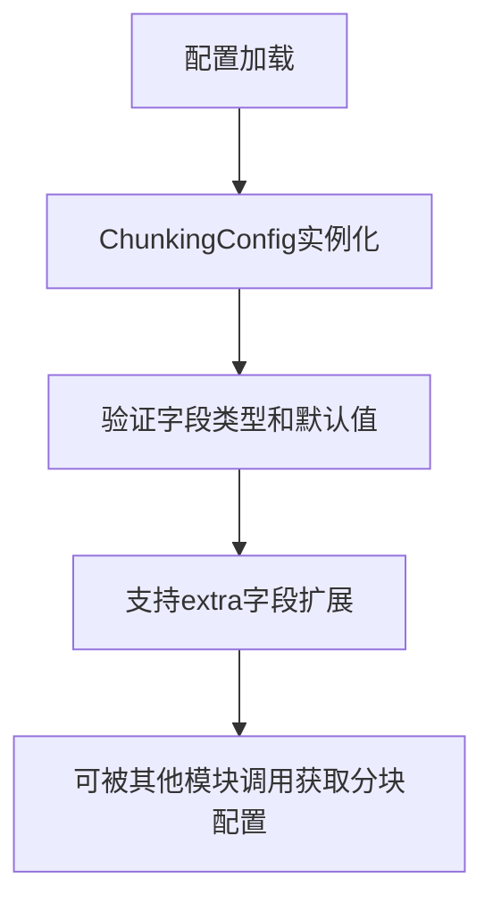

# `graphrag\packages\graphrag-chunking\graphrag_chunking\chunking_config.py` 详细设计文档

这是一个Pydantic配置类，用于定义文本分块（Chunking）的参数设置，包括分块类型、编码模型、分块大小、重叠大小以及要预置到每个块上的元数据字段。该配置类允许额外的字段以支持自定义缓存实现。

## 整体流程



## 类结构

```
BaseModel (Pydantic基类)
└── ChunkingConfig (配置类)
```

## 全局变量及字段


### `ChunkingConfig.model_config`
    
Pydantic模型配置，允许额外字段支持自定义缓存实现

类型：`ConfigDict`
    


### `ChunkingConfig.type`
    
要使用的分块类型，默认为ChunkerType.Tokens

类型：`str`
    


### `ChunkingConfig.encoding_model`
    
要使用的编码模型，默认为None

类型：`str | None`
    


### `ChunkingConfig.size`
    
分块大小，默认为1200

类型：`int`
    


### `ChunkingConfig.overlap`
    
分块重叠大小，默认为100

类型：`int`
    


### `ChunkingConfig.prepend_metadata`
    
要从源文档预置到每个块上的元数据字段

类型：`list[str] | None`
    
    

## 全局函数及方法


## 关键组件


### ChunkingConfig 类

ChunkingConfig 是分块配置类，用于配置文档分块策略的参数化设置，支持自定义缓存实现和灵活的元数据前置功能。

### ChunkerType 枚举

ChunkerType 是分块策略类型枚举，定义可用的分块算法类型。

### 关键组件信息

| 名称 | 描述 |
|------|------|
| ChunkingConfig | 分块配置类，封装所有分块参数 |
| ChunkerType | 分块策略类型枚举 |
| type | 分块类型配置字段 |
| encoding_model | 编码模型配置字段 |
| size | 块大小配置字段 |
| overlap | 块重叠大小配置字段 |
| prepend_metadata | 元数据前置字段列表配置 |

### 潜在技术债务或优化空间

1. **类型安全**：type 字段使用 str 类型而非 ChunkerType 枚举类型，导致运行时才能验证合法性
2. **验证缺失**：缺少对 size 和 overlap 的取值范围验证（如 overlap 不应超过 size）
3. **灵活性受限**：prepend_metadata 仅支持字符串列表，无法支持嵌套或复杂元数据字段
4. **默认值硬编码**：默认值直接写在代码中，缺乏配置化支持

### 其它项目

- **设计目标**：提供灵活的分块参数配置，支持自定义实现扩展
- **约束**：依赖 Pydantic v2，使用 ConfigDict 支持额外字段
- **错误处理**：依赖 Pydantic 内置验证机制
- **接口契约**：通过 ChunkerType 枚举定义分块策略契约


## 问题及建议


### 已知问题

- **类型声明不一致**：`type` 字段声明为 `str` 类型，但默认值使用的是 `ChunkerType.Tokens` 枚举值，存在类型不匹配风险
- **缺少参数验证**：没有对 `overlap` 和 `size` 的关系进行验证（如 overlap 不应超过 size），可能导致无效配置
- **文档字符串位置不规范**：`model_config` 的文档注释位于属性下方，而非常规的类级别或属性上方
- **硬编码默认值**：chunk size 和 overlap 的具体数值硬编码在代码中，缺乏配置化灵活性

### 优化建议

- 将 `type` 字段类型修改为 `ChunkerType` 枚举类型，以保持类型一致性
- 添加 `model_validator` 或 `field_validator` 验证 overlap 与 size 的逻辑关系
- 调整文档字符串位置至属性上方或类级别，保持代码风格统一
- 考虑将默认 chunk size 和 overlap 提取为常量或配置常量类，便于项目统一管理

## 其它


### 设计目标与约束

本配置类旨在为分块策略提供统一、类型安全的配置管理接口。设计目标包括：1）通过Pydantic实现配置验证和类型检查；2）支持默认值以降低使用门槛；3）通过extra="allow"支持自定义缓存实现的扩展性。约束条件包括：依赖pydantic库、encoding_model和prepend_metadata可为None以适配不同场景。

### 错误处理与异常设计

配置类本身主要依赖Pydantic的内置验证机制。可能的异常场景包括：1）类型不匹配时Pydantic会抛出ValidationError；2）传入非法chunking type时会在使用阶段由ChunkerType枚举验证；3）size和overlap为负数时Pydantic会进行基础类型验证。建议在调用方捕获pydantic.ValidationError并转换为更友好的错误信息。

### 外部依赖与接口契约

本配置类依赖以下外部组件：1）pydantic库（BaseModel、ConfigDict、Field）；2）graphrag_chunking包中的ChunkerType枚举。接口契约方面：type字段应为ChunkerType枚举的字符串值；encoding_model接受字符串或None；size和overlap应为正整数；prepend_metadata接受字符串列表或None。配置对象可通过model_dump()序列化为字典，或通过model_validate()从字典反序列化。

### 版本兼容性说明

本代码适用于pydantic v2.x版本（使用了ConfigDict而非旧的Config类）。ChunkerType枚举的导入表明依赖graphrag_chunking包的具体版本，需确保版本兼容性。Field的default参数在pydantic v2中用于定义默认值，与v1的required=True/False语法不同。

### 配置使用示例与默认值策略

默认配置策略：type默认为ChunkerType.Tokens（标记为默认分块器）；size默认为1200（适合大多数文本处理场景）；overlap默认为100（提供合理的上下文重叠）；encoding_model和prepend_metadata默认为None（可选配置）。使用时可通过ChunkingConfig()使用默认值，或通过ChunkingConfig(size=2000, overlap=150)自定义部分参数。

    