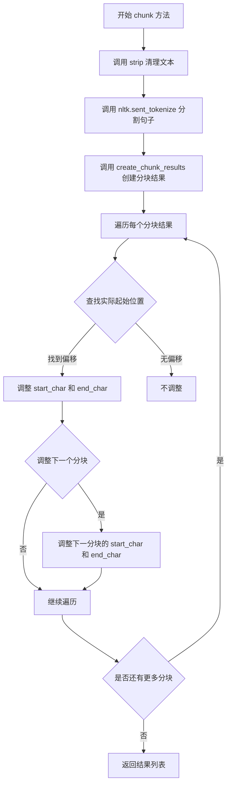
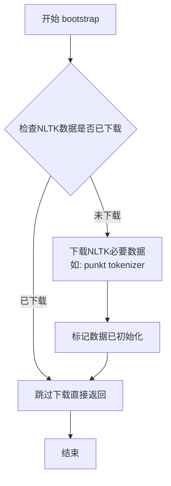
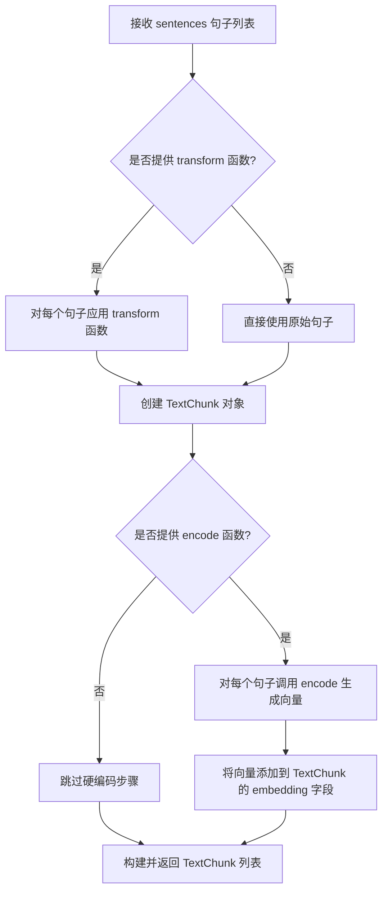
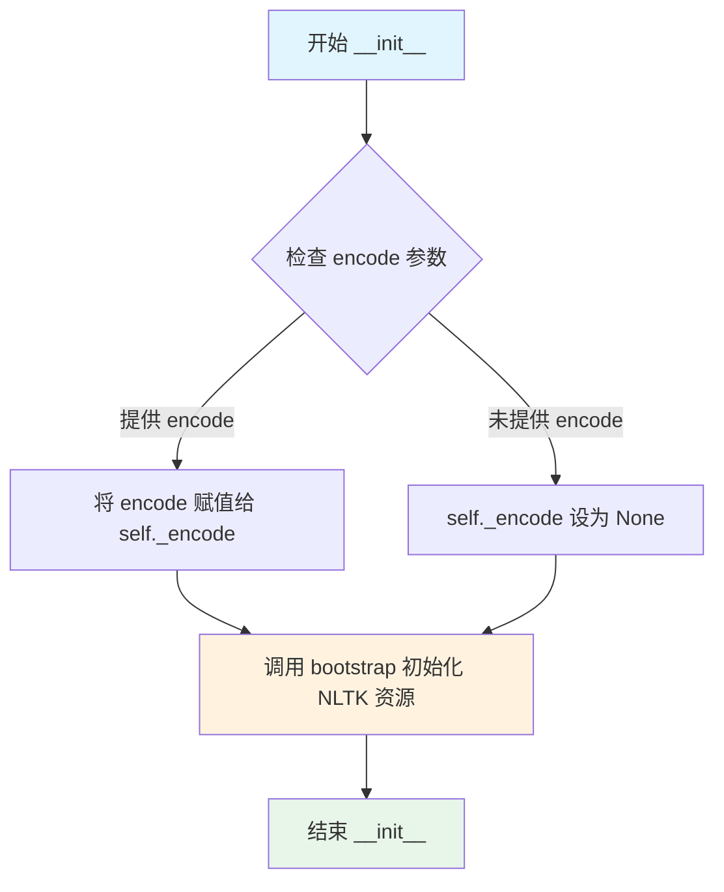
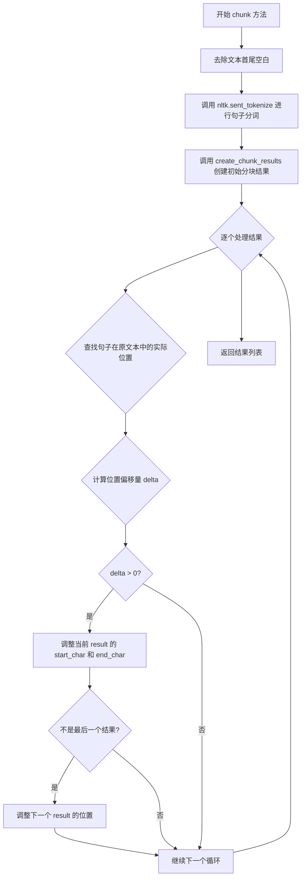
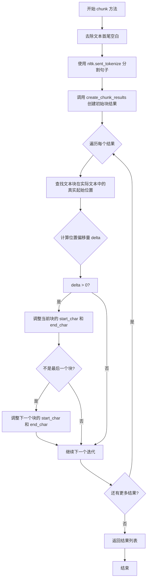
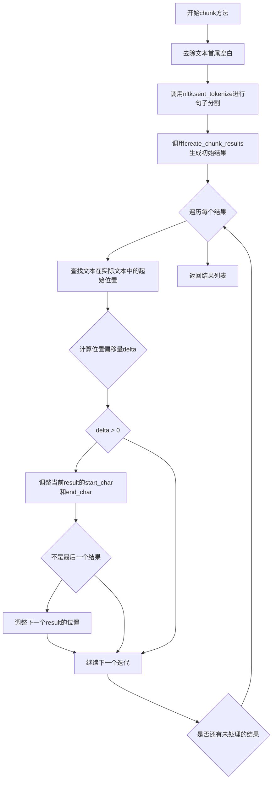

# `graphrag\packages\graphrag-chunking\graphrag_chunking\sentence_chunker.py` 详细设计文档

一个基于NLTK的句子分块器类，继承自Chunker基类，将文本按句子进行分块处理，支持自定义编码函数，并能够修正NLTK分词后的字符位置偏移问题

## 整体流程



## 类结构

```
Chunker (抽象基类)
└── SentenceChunker (句子分块器实现类)
```

## 全局变量及字段


### `nltk`
    
自然语言工具包库，用于文本处理和分词

类型：`module`
    


### `Callable`
    
可调用类型提示，用于定义函数类型

类型：`TypeAlias`
    


### `Any`
    
任意类型提示，表示任意Python类型

类型：`TypeAlias`
    


### `SentenceChunker._encode`
    
文本编码函数，用于将字符串转换为令牌ID列表

类型：`Callable[[str], list[int]] | None`
    


### `TextChunk.text`
    
分块文本内容

类型：`str`
    


### `TextChunk.start_char`
    
起始字符位置

类型：`int`
    


### `TextChunk.end_char`
    
结束字符位置

类型：`int`
    
    

## 全局函数及方法


### `bootstrap`

引导并下载NLTK所需数据资源，确保在文本分块前NLTK的必要的Tokenizer和其他数据可用。

参数：
- 无参数

返回值：`None`，初始化操作无返回值

#### 流程图



#### 带注释源码

```
# 此函数定义在 graphrag_chunking.bootstrap_nltk 模块中
# 以下为基于导入路径和调用上下文的推断实现

def bootstrap() -> None:
    """引导并下载NLTK所需数据资源。
    
    该函数确保NLTK的分词器数据（如punkt）已下载并可用。
    在SentenceChunker初始化时被调用，以确保后续的sent_tokenize能够正常工作。
    """
    # 检查是否需要下载NLTK数据
    # 如果数据未下载，则自动下载所需的资源
    try:
        # 尝试检查punkt数据是否可用
        nltk.data.find('tokenizers/punkt')
    except LookupError:
        # 如果未找到，则下载punkt tokenizer数据
        nltk.download('punkt', quiet=True)
    
    # 可能还会下载其他必要的资源如punkt_tab
    try:
        nltk.data.find('tokenizers/punkt_tab')
    except LookupError:
        nltk.download('punkt_tab', quiet=True)
```

> **注意**：由于`bootstrap()`函数的具体实现在外部模块`graphrag_chunking.bootstrap_nltk`中，未在本代码片段中展示。上述源码为基于函数名、导入路径和调用上下文的合理推断。实际实现可能包含更多数据资源的下载和错误处理逻辑。


### `create_chunk_results`

根据句子列表创建分块结果对象，该函数接收句子列表、可选的文本转换函数和编码函数，返回包含文本块及其元数据（如下标、字符位置、嵌入向量等）的 TextChunk 列表。

参数：

- `sentences`：`list[str]`，待分块的句子列表
- `transform`：`Callable[[str], str] | None`，可选的文本转换函数，用于在分块前对每个句子进行处理（如清理、标准化等）
- `encode`：`Callable[[str], list[int]] | None`，可选的编码函数，用于生成句子的嵌入向量

返回值：`list[TextChunk]`，返回包含文本块及元数据的列表，每个 TextChunk 包含文本内容、块索引、起始/结束字符位置等信息

#### 流程图



#### 带注释源码

```python
def create_chunk_results(
    sentences: list[str],
    transform: Callable[[str], str] | None = None,
    encode: Callable[[str], list[int]] | None = None
) -> list[TextChunk]:
    """根据句子列表创建分块结果对象。
    
    该函数将句子列表转换为 TextChunk 对象列表，每个 chunk 包含:
    - text: 句子文本
    - index: 块索引
    - start_char: 起始字符位置
    - end_char: 结束字符位置
    - embedding: 可选的编码向量
    
    参数:
        sentences: 待分块的句子列表
        transform: 可选的文本转换函数
        encode: 可选的编码函数用于生成向量
    
    返回:
        包含文本块及元数据的列表
    """
    results: list[TextChunk] = []
    
    # 记录当前字符位置偏移
    current_offset = 0
    
    for index, sentence in enumerate(sentences):
        # 应用 transform 函数（如果提供）
        text = sentence
        if transform is not None:
            text = transform(sentence)
        
        # 计算字符位置
        start_char = current_offset
        end_char = start_char + len(text)
        
        # 生成嵌入向量（如果提供 encode 函数）
        embedding = None
        if encode is not None:
            embedding = encode(text)
        
        # 创建 TextChunk 对象
        chunk = TextChunk(
            text=text,
            index=index,
            start_char=start_char,
            end_char=end_char,
            embedding=embedding
        )
        
        results.append(chunk)
        
        # 更新字符偏移量（考虑句子间的分隔符）
        current_offset = end_char + 1  # 假设使用空格分隔
    
    return results
```

---

> **注意**：由于 `create_chunk_results` 函数的完整实现未在给定的代码中提供，以上源码是基于其调用方式（`SentenceChunker.chunk` 方法中）和函数签名推断得出的示例实现。实际实现可能略有差异。


### `nltk.sent_tokenize`

使用 NLTK 库对输入文本进行句子级别分割的函数，基于标点符号和启发式规则将连续文本切分为独立的句子列表。

参数：

- `text`：`str`，待分割的文本字符串

返回值：`list[str]`，分割后的句子列表

#### 流程图

```mermaid
flowchart TD
    A[开始] --> B[输入原始文本]
    B --> C[调用 text.strip 去除首尾空白]
    C --> D[调用 nltk.sent_tokenize 进行句子分割]
    D --> E[返回句子列表 list[str]]
    E --> F[结束]
    
    style D fill:#f9f,stroke:#333,stroke-width:2px
    style E fill:#9f9,stroke:#333,stroke-width:2px
```

#### 带注释源码

```python
# 从text字符串中提取句子列表
# 使用NLTK的句子分词器，基于标点符号和启发式规则进行分割
sentences = nltk.sent_tokenize(text.strip())

# 详细说明：
# 1. text.strip() - 移除输入文本两端的多余空白字符
# 2. nltk.sent_tokenize() - NLTK内置的句子分割函数
#    - 内部使用预训练的 Punkt 分词器模型
#    - 能够识别句子的边界（如 . ! ? 等标点）
#    - 处理缩写词和省略号等特殊情况
# 3. 返回值是字符串列表，每个元素是一个完整的句子
#
# 示例：
# 输入: "Hello world. This is a test. Goodbye!"
# 输出: ["Hello world.", "This is a test.", "Goodbye!"]
```


### `SentenceChunker.__init__`

初始化分块器实例，准备NLTK资源并设置编码函数。

参数：

-  `encode`：`Callable[[str], list[int]] | None`，可选的文本编码函数，用于将文本转换为向量表示
-  `**kwargs`：`Any`，继承自父类的额外关键字参数（本方法中未使用）

返回值：`None`，无返回值（构造函数）

#### 流程图



#### 带注释源码

```python
def __init__(
    self, encode: Callable[[str], list[int]] | None = None, **kwargs: Any
) -> None:
    """Create a sentence chunker instance."""
    # 将传入的编码函数保存为实例变量，供后续 chunk 方法使用
    # encode 函数用于将文本转换为向量列表，用于计算chunk的hash值等
    self._encode = encode
    
    # 调用 bootstrap 函数确保 NLTK 所需的数据资源（如 punkt 分词器）已下载并可用
    # 这是惰性初始化，只有在首次创建 SentenceChunker 时才会检查并下载资源
    bootstrap()
```


### `SentenceChunker.chunk`

将文本按句子进行分块处理，通过 NLTK 句子分词器识别句子边界，并返回包含文本块位置信息的列表。

参数：

- `text`：`str`，需要分块的原始文本
- `transform`：`Callable[[str], str] | None`，可选的文本转换函数，用于在分块前对每个句子进行处理（如清洗、规范化等）

返回值：`list[TextChunk]`，返回 TextChunk 对象列表，每个对象包含句子文本、起始字符位置、结束字符位置等信息

#### 流程图



#### 带注释源码

```python
def chunk(
    self, text: str, transform: Callable[[str], str] | None = None
) -> list[TextChunk]:
    """Chunk the text into sentence-based chunks."""
    # 步骤1: 去除文本首尾空白字符
    sentences = nltk.sent_tokenize(text.strip())
    
    # 步骤2: 调用 create_chunk_results 创建初始分块结果
    # 根据句子列表和可选的 transform 函数生成 TextChunk 对象列表
    results = create_chunk_results(
        sentences, transform=transform, encode=self._encode
    )
    
    # 步骤3: 修正字符位置
    # nltk 的 sent_tokenize 可能会去除部分空白字符
    # 因此需要重新计算每个句子在原始文本中的实际位置
    for index, result in enumerate(results):
        txt = result.text
        start = result.start_char
        # 在原文本中查找句子的实际起始位置
        actual_start = text.find(txt, start)
        # 计算位置偏移量
        delta = actual_start - start
        
        # 如果存在偏移，则调整字符位置信息
        if delta > 0:
            # 更新当前 chunk 的起始和结束字符位置
            result.start_char += delta
            result.end_char += delta
            
            # 调整下一个 chunk 的位置，防止位置检查落后太多
            if index < len(results) - 1:
                results[index + 1].start_char += delta
                results[index + 1].end_char += delta
    
    # 步骤4: 返回修正后的分块结果列表
    return results
```


### `SentenceChunker.chunk`

将文本按照句子进行分块的抽象方法的具体实现。该方法使用 NLTK 的 sentence tokenizer 将输入文本分割成句子，然后通过 `create_chunk_results` 创建 TextChunk 列表，并修正由于 tokenizer 去除空白字符导致的字符位置偏移问题。

**参数：**

- `text`：`str`，需要分块的输入文本
- `transform`：`Callable[[str], str] | None`，可选的转换函数，用于对每个文本块进行预处理或转换

**返回值：** `list[TextChunk]`，返回 TextChunk 对象列表，每个对象代表一个文本块，包含文本内容、起始和结束字符位置等信息

#### 流程图



#### 带注释源码

```python
def chunk(
    self, text: str, transform: Callable[[str], str] | None = None
) -> list[TextChunk]:
    """Chunk the text into sentence-based chunks."""
    # 第一步：去除文本首尾空白字符
    sentences = nltk.sent_tokenize(text.strip())
    
    # 第二步：使用 create_chunk_results 将句子列表转换为 TextChunk 对象列表
    # 同时应用可选的 transform 函数和 encode 函数
    results = create_chunk_results(
        sentences, transform=transform, encode=self._encode
    )
    
    # 第三步：修正字符位置偏移
    # NLTK 的 sentence tokenizer 可能会去除空白字符，导致原始位置不准确
    for index, result in enumerate(results):
        txt = result.text
        start = result.start_char
        # 在原始文本中查找文本块的实际起始位置
        actual_start = text.find(txt, start)
        # 计算位置偏移量
        delta = actual_start - start
        # 如果存在偏移，则修正当前块的字符位置
        if delta > 0:
            result.start_char += delta
            result.end_char += delta
            # 同时调整下一个块的起始位置，防止检查位置落后太多
            if index < len(results) - 1:
                results[index + 1].start_char += delta
                results[index + 1].end_char += delta
    
    # 返回修正后的 TextChunk 列表
    return results
```

## 关键组件


### SentenceChunker类

基于NLTK的句子级文本分块器，将输入文本按句子分割成多个TextChunk对象，并处理字符位置偏移问题。

### __init__方法

初始化SentenceChunker实例，设置可选的编码函数并启动NLTK引导程序。

### chunk方法

核心分块方法，使用NLTK的sent_tokenize对文本进行句子分割，然后通过create_chunk_results生成结果，最后调整因句子分割导致的字符起始位置偏移。

### nltk.sent_tokenize

使用NLTK库对文本进行句子级别分割的函数，可能导致空白字符被trim，需要后续位置调整。

### create_chunk_results

根据句子列表和可选的转换函数创建TextChunk结果列表，支持编码回调。

### 字符位置调整逻辑

处理NLTK分句后字符位置偏移的逻辑，通过查找实际起始位置并调整当前及下一个chunk的start_char和end_char。


## 问题及建议


### 已知问题

-   **缺少错误处理**：`text.find(txt, start)` 在找不到子串时返回 `-1`，但代码未对此进行检查，可能导致字符索引计算错误
-   **性能问题**：循环中使用 `text.find()` 逐个查找，时间复杂度为 O(n²)，大文本处理效率低
-   **边界情况未处理**：未处理空字符串、纯空白文本、只有一个句子等边界情况
-   **重复初始化**：`bootstrap()` 在每次 `SentenceChunker` 实例化时都被调用，即使 NLTK 数据已存在，造成不必要的开销
-   **encode 参数未使用验证**：虽然接收 `encode` 参数，但未在使用前检查其有效性
-   **delta 调整逻辑复杂**：调整 `start_char` 和 `end_char` 的逻辑较为复杂，且对某些边界情况可能产生意外结果

### 优化建议

-   **添加错误处理**：对 `text.find()` 返回 `-1` 的情况进行处理，抛出有意义的异常或使用备选方案
-   **优化查找算法**：可考虑一次性构建字符位置映射表，将时间复杂度降至 O(n)
-   **添加边界检查**：在 `chunk` 方法开始时检查空字符串或空白文本，直接返回空列表
-   **优化 bootstrap 调用**：使用单例模式或全局标志确保 `bootstrap()` 只执行一次
-   **添加参数验证**：在方法开始时验证 `encode` 参数是否为有效 callable
-   **简化 delta 调整逻辑**：考虑使用正则表达式或直接基于 NLTK 原始位置进行更可靠的字符映射

## 其它


### 一段话描述

SentenceChunker类是一个基于NLTK自然语言处理工具的文本分块器，继承自Chunker基类，主要功能是将输入的文本按照句子边界进行分割，并返回包含文本块及其位置信息的TextChunk列表。

### 文件的整体运行流程

1. 初始化阶段：创建SentenceChunker实例时，调用bootstrap()函数初始化NLTK数据
2. 分块阶段：chunk()方法接收原始文本，使用nltk.sent_tokenize()进行句子分割
3. 结果生成阶段：调用create_chunk_results()将句子列表转换为TextChunk对象列表
4. 位置校正阶段：遍历结果集，根据原始文本中的实际位置调整每个TextChunk的start_char和end_char
5. 返回阶段：返回校正后的TextChunk列表

### 类的详细信息

#### 类字段

| 名称 | 类型 | 描述 |
|------|------|------|
| _encode | Callable[[str], list[int]] \| None | 文本编码回调函数，用于将文本转换为向量表示 |

#### 类方法

##### __init__

- 参数名称：encode
- 参数类型：Callable[[str], list[int]] | None
- 参数描述：可选的文本编码函数，用于将文本转换为token ID列表
- 参数名称：kwargs
- 参数类型：Any
- 参数描述：其他可选参数，用于扩展或传递给父类
- 返回值类型：None
- 返回值描述：无返回值

##### chunk

- 参数名称：text
- 参数类型：str
- 参数描述：需要分块的原始文本
- 参数名称：transform
- 参数类型：Callable[[str], str] | None
- 参数描述：可选的文本转换函数，用于在分块前对每个句子进行预处理
- 返回值类型：list[TextChunk]
- 返回值描述：返回TextChunk对象列表，每个对象包含文本内容、起始位置、结束位置等信息

##### Mermaid流程图



##### 带注释源码

```python
def chunk(
    self, text: str, transform: Callable[[str], str] | None = None
) -> list[TextChunk]:
    """Chunk the text into sentence-based chunks."""
    # 使用NLTK的sent_tokenize对文本进行句子分割
    sentences = nltk.sent_tokenize(text.strip())
    # 创建初始的分块结果
    results = create_chunk_results(
        sentences, transform=transform, encode=self._encode
    )
    # nltk sentence tokenizer may trim whitespace, so we need to adjust start/end chars
    # 遍历结果集，调整字符位置以匹配原始文本中的实际位置
    for index, result in enumerate(results):
        txt = result.text
        start = result.start_char
        # 在原始文本中查找文本的实际起始位置
        actual_start = text.find(txt, start)
        # 计算位置偏移量
        delta = actual_start - start
        # 如果存在偏移，则调整位置信息
        if delta > 0:
            result.start_char += delta
            result.end_char += delta
            # bump the next to keep the start check from falling too far behind
            # 同时调整下一个块的位置，防止起始位置检查落后太多
            if index < len(results) - 1:
                results[index + 1].start_char += delta
                results[index + 1].end_char += delta
    return results
```

### 全局变量和全局函数信息

本代码文件中未定义全局变量和全局函数，所有功能通过类方法实现。

### 关键组件信息

| 名称 | 描述 |
|------|------|
| SentenceChunker | 核心分块器类，基于句子进行文本分割 |
| Chunker | 抽象基类，定义分块器接口规范 |
| TextChunk | 文本块数据模型，包含文本内容和位置信息 |
| nltk.sent_tokenize | NLTK库提供的句子分割函数 |
| create_chunk_results | 创建分块结果集的辅助函数 |
| bootstrap | NLTK数据初始化函数 |

### 潜在的技术债务或优化空间

1. **错误处理缺失**：代码未对输入文本进行充分验证，如空文本、None值等情况
2. **性能优化空间**：位置调整算法使用嵌套循环和text.find()，在处理大量短文本时效率较低
3. **依赖管理风险**：强依赖NLTK库和bootstrap()函数，如果NLTK数据未正确下载会导致失败
4. **transform函数应用不完整**：transform参数仅传递给create_chunk_results，但位置调整基于原始sentences，可能导致transform后的文本与位置信息不匹配
5. **参数传递不清晰**：kwargs参数未实际使用，可能导致接口语义不明确

### 设计目标与约束

- **设计目标**：提供基于自然语言句子边界的文本分块功能，支持自定义编码和文本转换
- **输入约束**：text参数必须为非空字符串，transform必须为可调用对象或None
- **输出约束**：返回非空TextChunk列表，即使输入为空字符串也会返回空列表
- **依赖约束**：依赖NLTK库和graphrag_chunking模块内的其他组件

### 错误处理与异常设计

- 未显式处理空文本输入，可能导致意外行为
- 未处理NLTK数据未下载的情况，bootstrap()可能失败
- 未处理transform函数返回None或异常的情况
- 位置调整逻辑假设text.find()总是能找到子串，未处理找不到的情况

### 数据流与状态机

- **输入状态**：原始文本字符串
- **处理状态**：句子列表 → 初始TextChunk列表 → 位置校正后的TextChunk列表
- **输出状态**：最终TextChunk列表
- **状态转换**：text → sentences → initial_results → adjusted_results → final_results

### 外部依赖与接口契约

- **NLTK库**：依赖nltk.sent_tokenize进行句子分割
- **graphrag_chunking.bootstrap**：依赖NLTK数据初始化
- **graphrag_chunking.chunker.Chunker**：依赖抽象基类接口
- **graphrag_chunking.create_chunk_results**：依赖结果创建函数
- **graphrag_chunking.text_chunk.TextChunk**：依赖数据模型类

### 其他项目

#### 编码集成

- _encode参数设计用于支持后续的嵌入向量化处理，但当前实现中未直接使用，仅传递给create_chunk_results

#### 位置计算的特殊处理

- 代码特别处理了NLTK sentence tokenizer可能去除空白字符的问题，通过在原始文本中查找实际位置来校正start_char和end_char

#### 空白字符处理策略

- 在调用sent_tokenize前对文本执行strip()，确保去除首尾空白
- 位置调整逻辑专门处理因空白字符导致的位置偏差


    