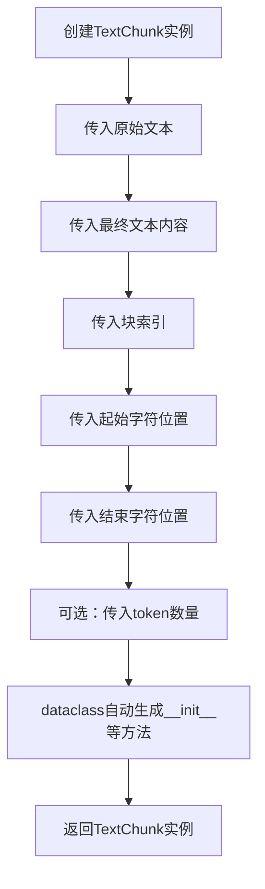
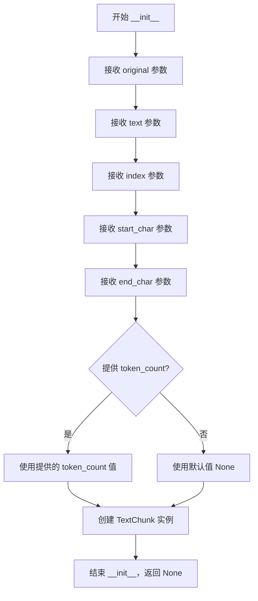

# `graphrag\packages\graphrag-chunking\graphrag_chunking\text_chunk.py` 详细设计文档

该代码定义了一个名为TextChunk的Python数据类（dataclass），用于表示文档分块（chunking）操作的结果，包含原始文本、最终文本内容、块索引、字符位置范围以及可选的token计数等信息。

## 整体流程



## 类结构

```
TextChunk (数据类)
└── 基于dataclass装饰器的数据结构
```

## 全局变量及字段


### `TextChunk.original`
    
原始文本块，转换前的原始文本

类型：`str`
    


### `TextChunk.text`
    
最终文本内容，转换后的文本

类型：`str`
    


### `TextChunk.index`
    
零基索引，块在源文档中的位置

类型：`int`
    


### `TextChunk.start_char`
    
起始字符索引，原始块文本在源文档中开始的字符位置

类型：`int`
    


### `TextChunk.end_char`
    
结束字符索引，原始块文本在源文档中结束的字符位置

类型：`int`
    


### `TextChunk.token_count`
    
token数量，最终块文本的token数量，如果已计算

类型：`int | None`
    
    

## 全局函数及方法


### `TextChunk.__init__`

这是 `TextChunk` 类的自动生成构造函数，用于初始化文本块的所有属性，包括原始文本、最终文本、索引、字符位置和可选的 token 计数。

参数：

- `original`：`str`，原始文本块，在任何转换之前的原始文本内容
- `text`：`str`，该块的最终文本内容
- `index`：`int`，该块在源文档中的零基索引
- `start_char`：`int`，原始块文本在源文档中开始的字符索引
- `end_char`：`int`，原始块文本在源文档中结束的字符索引
- `token_count`：`int | None`（可选，默认值 `None`），最终块文本中的 token 数量（如果已计算）

返回值：`None`，构造函数不返回任何值（dataclass 的 `__init__` 方法自动返回 `None`）

#### 流程图



#### 带注释源码

```python
# 这是 @dataclass 装饰器自动生成的 __init__ 方法
# 手动等效实现如下：

def __init__(
    self,
    original: str,
    text: str,
    index: int,
    start_char: int,
    end_char: int,
    token_count: int | None = None
) -> None:
    """
    初始化 TextChunk 实例。

    参数:
        original: 原始文本块，在任何转换之前的原始文本内容
        text: 该块的最终文本内容
        index: 该块在源文档中的零基索引
        start_char: 原始块文本在源文档中开始的字符索引
        end_char: 原始块文本在源文档中结束的字符索引
        token_count: 最终块文本中的 token 数量（如果已计算），默认为 None

    返回值:
        None
    """
    # 将参数值赋值给实例属性
    self.original = original
    self.text = text
    self.index = index
    self.start_char = start_char
    self.end_char = end_char
    self.token_count = token_count

    # 注意：dataclass 的 __init__ 方法自动返回 None
    # 创建的实例通过构造函数调用本身返回
    return None
```


### `TextChunk.__repr__`

Python dataclass 自动生成的特殊方法，用于返回该对象的字符串表示形式，包含了所有字段的名称和值，方便调试和日志输出。

参数：

- `self`：`TextChunk`，隐含的实例参数，代表当前 TextChunk 对象本身

返回值：`str`，返回该对象的字符串表示，格式为 `TextChunk(field1=value1, field2=value2, ...)`

#### 流程图

```mermaid
flowchart TD
    A[开始 __repr__ 调用] --> B[获取类名: TextChunk]
    B --> C[遍历所有字段名称]
    C --> D{是否还有未处理的字段?}
    D -->|是| E[获取当前字段值]
    E --> F[格式化为 '字段名=值' 字符串]
    F --> C
    D -->|否| G[拼接所有字段字符串]
    G --> H[组装最终格式: TextChunk(field1=value1, ...)]
    H --> I[返回字符串]
    I --> J[结束]
```

#### 带注释源码

```python
# Python dataclass 自动生成的 __repr__ 方法
# 当类定义包含 @dataclass 装饰器时，Python 会自动注入此方法
def __repr__(self) -> str:
    """
    自动生成的字符串表示。
    返回格式: TextChunk(original='...', text='...', index=0, start_char=0, end_char=100, token_count=None)
    """
    # 按照字段定义顺序返回包含所有属性的字符串表示
    return (
        f"TextChunk("
        f"original={self.original!r}, "
        f"text={self.text!r}, "
        f"index={self.index}, "
        f"start_char={self.start_char}, "
        f"end_char={self.end_char}, "
        f"token_count={self.token_count!r}"
        f")"
    )

# !r 表示使用 repr() 格式化值，对于字符串会添加引号
# 示例输出:
# TextChunk(original='Hello World', text='hello world', index=0, start_char=0, end_char=11, token_count=None)
```


### `TextChunk.__eq__`

自动生成的相等性比较方法，用于比较两个 `TextChunk` 实例的所有字段是否相等。该方法由 Python 的 `@dataclass` 装饰器自动生成，无需显式定义。

参数：

- `other`：`Any`，要與目前 TextChunk 實例進行比較的其他物件

返回值：`bool`，如果兩個 TextChunk 實例的所有欄位都相等則返回 `True`，否則返回 `False`

#### 流程圖

```mermaid
flowchart TD
    A[開始 __eq__ 比較] --> B{other 是否為同一物件\n(id 相同)?}
    B -->|是| C[返回 True]
    B -->|否| D{other 是否為同類型\n(TextChunk)?}
    D -->|否| E[返回 False]
    D -->|是| F[比較 original 欄位]
    F --> G{original 是否相等?}
    G -->|否| E
    G -->|是| H[比較 text 欄位]
    H --> I{text 是否相等?}
    I -->|否| E
    I -->|是| J[比較 index 欄位]
    J --> K{index 是否相等?}
    K -->|否| E
    K -->|是| L[比較 start_char 欄位]
    L --> M{start_char 是否相等?}
    M -->|否| E
    M -->|是| N[比較 end_char 欄位]
    N --> O{end_char 是否相等?}
    O -->|否| E
    O -->|是| P[比較 token_count 欄位]
    P --> Q{token_count 是否相等?}
    Q -->|否| E
    Q -->|是| C
```

#### 帶註釋源碼

```python
def __eq__(self, other: object) -> bool:
    """
    自動生成的相等性比較方法。
    
    比較原則：
    1. 首先檢查 identity (是否為同一物件)
    2. 接著檢查類型是否相同
    3. 最後逐一比較所有欄位的值
    
    比較的欄位（按照定義順序）：
    - original: str - 原始文字區塊
    - text: str - 最終文字內容
    - index: int - 區塊索引
    - start_char: int - 起始字元位置
    - end_char: int - 結束字元位置
    - token_count: int | None - token 數量
    
    參數:
        other: 要比較的目標物件
        
    返回:
        bool: 所有欄位都相等時返回 True，否則返回 False
    """
    # 步驟1：如果是同一個物件（記憶體位址相同），直接返回 True
    if self is other:
        return True
    
    # 步驟2：類型檢查 - 必須是 TextChunk 類型才進行比較
    # 注意：子類別也會被視為不同類型
    if not isinstance(other, TextChunk):
        return False
    
    # 步驟3：逐一比較所有欄位
    # 這是一個短路運算，一旦發現不相等就立即返回 False
    return (
        self.original == other.original and
        self.text == other.text and
        self.index == other.index and
        self.start_char == other.start_char and
        self.end_char == other.end_char and
        self.token_count == other.token_count
    )
```

#### 技術說明

| 項目 | 說明 |
|------|------|
| **生成方式** | 由 Python 3.7+ 的 `@dataclass` 裝飾器自動生成 |
| **比較順序** | 欄位按照在類中定義的順序進行比較 |
| **型別嚴格性** | 使用 `isinstance()` 檢查，子類實例會被視為不相等 |
| **可覆寫性** | 可以通過顯式定義 `__eq__` 方法來覆寫此自動生成的方法 |
| **效能考量** | 對於大型或複雜的欄位（如 list、dict），每次比較都會重新遍歷 |

## 关键组件


### 核心功能概述

TextChunk是一个Python数据类（dataclass），用于存储文档分块操作的结果，封装了原始文本、最终文本、块索引、字符位置范围以及可选的token计数信息。

### 文件整体运行流程

该文件定义了一个简单的数据结构，不涉及复杂的运行流程。TextChunk作为数据容器，由Python的dataclass装饰器自动生成`__init__`、`__repr__`、`__eq__`等方法，供其他模块在文档分块处理流程中实例化使用。

### 类详细信息

#### TextChunk类

**类说明：** 文档分块结果的数据容器类

**类字段：**

| 字段名 | 类型 | 描述 |
|--------|------|------|
| original | str | 转换前的原始文本块内容 |
| text | str | 分块后的最终文本内容 |
| index | int | 该分块在源文档中的零基索引 |
| start_char | int | 原始块文本在源文档中的起始字符位置 |
| end_char | int | 原始块文本在源文档中的结束字符位置 |
| token_count | int \| None | 最终分块文本的token数量，若未计算则为None |

**类方法：**

由于使用@dataclass装饰器，类自动获得以下方法：

- `__init__(self, original, text, index, start_char, end_char, token_count=None)` - 初始化方法
- `__repr__(self)` - 可读字符串表示
- `__eq__(self, other)` - 相等性比较

### 关键组件信息

#### TextChunk数据类

用于表示文档分块操作的结果数据结构，封装了原始文本、转换后文本、索引位置、字符范围和token计数等关键信息。

#### original字段

存储分块前未经任何转换的原始文本内容。

#### text字段

存储经过最终处理（如清洗、标准化）后的文本内容。

#### 位置索引组件

包括index、start_char和end_char三个字段，用于建立分块与源文档之间的位置映射关系。

### 潜在技术债务或优化空间

1. **缺少数据验证：** 字段未进行有效性校验，例如index应为非负整数、start_char应小于end_char等
2. **token_count惰性计算：** 当前token_count需要预先计算，可考虑实现延迟计算机制以提升性能
3. **缺乏不可变性：** dataclass默认可变，可考虑使用frozen=True增强不可变性，保证数据一致性
4. **缺少序列化支持：** 未实现to_dict/from_dict方法，与外部系统交互时可能需要额外处理
5. **文档完整性：** 可增加__post_init__方法添加更详细的文档字符串说明

### 其它项目

#### 设计目标与约束

- 目标：提供清晰的文档分块结果数据结构
- 约束：遵循Python dataclass规范，保持简洁性

#### 错误处理与异常设计

- 当前版本未实现自定义异常处理
- 依赖Python内置类型检查

#### 数据流与状态机

- 作为数据传递容器，不涉及复杂状态管理
- 数据流：源文档 → 分块器 → TextChunk实例 → 下游处理

#### 外部依赖与接口契约

- 依赖Python标准库dataclasses模块
- 接口：作为数据容器被其他模块导入使用


## 问题及建议


### 已知问题

-   **Python 版本兼容性问题**：`token_count: int | None = None` 使用了 Python 3.10+ 的联合类型语法（`|` 操作符），若项目需要支持更低版本的 Python，将导致兼容性问题
-   **缺少数据验证**：dataclass 未定义 `__post_init__` 方法，无法对字段值的合法性进行校验，例如 `start_char` 应大于等于 0、`end_char` 应大于 `start_char`、`index` 应为非负数等
-   **缺少不可变性保护**：dataclass 未设置 `frozen=True`，实例可以被修改，在多线程或不可变数据场景下存在风险
-   **内存占用潜在浪费**：同时存储 `original` 和 `text` 两个完整文本内容，当文本较长时可能导致内存浪费，缺乏按需计算的机制
-   **缺乏与其他实体的关联**：作为文档分块结果，未提供与源文档（Document）的引用或关联机制，难以追溯分块的来源
-   **序列化支持缺失**：未提供 `to_dict()` / `from_dict()` 方法或 `__slots__` 优化，不利于跨系统传输或内存优化

### 优化建议

-   **添加数据验证**：在 `__post_init__` 中验证 `start_char >= 0`、`end_char > start_char`、`index >= 0` 等约束条件，确保数据完整性
-   **考虑不可变性**：如需保证对象不可变，添加 `frozen=True` 参数到 `@dataclass` 装饰器
-   **优化内存使用**：可考虑使用 `field(init=False)` 延迟计算 `original`，或提供属性方法动态获取切片，减少冗余存储
-   **添加序列化支持**：实现 `to_dict()` 和类方法 `from_dict()`，或使用 `pydantic` 替代 `dataclass` 以获得更强大的验证和序列化能力
-   **考虑类型兼容性**：如需支持 Python 3.9 及以下版本，将 `int | None` 改为 `Optional[int]`
-   **添加文档关联**：考虑添加 `document_id` 或 `source` 字段，用于追溯分块所属的源文档

## 其它


### 设计目标与约束

本代码的设计目标是提供一个轻量级、结构化的数据容器，用于在文档分块（chunking）过程中存储原始文本块及其元数据信息。核心约束包括：保持与Python标准库dataclass的兼容性，确保不可变性（通过dataclass默认行为），支持可选的token计数功能，并遵循MIT License的开源协议要求。

### 错误处理与异常设计

本代码作为纯数据类，自身不包含业务逻辑，因此不涉及显式的错误处理与异常抛出机制。错误处理应由使用该类的上层调用者负责，例如在实例化时确保index、start_char、end_char等数值的合法性（必须为非负整数且符合逻辑关系：start_char < end_char）。建议在文档中明确此约束。

### 数据流与状态机

本代码不涉及复杂的数据流或状态机。作为一个数据传输对象（DTO），TextChunk实例在创建后即保持不可变（除非被显式修改），其生命周期通常为：文档分块器创建实例 → 传递给下游处理组件 → 被消费或丢弃。无状态机设计。

### 外部依赖与接口契约

本代码仅依赖Python标准库中的`dataclasses`模块（Python 3.7+），无第三方依赖。接口契约包括：所有字段均为必需（除token_count为可选），类型注解需严格遵守，实例化时必须提供original、text、index、start_char、end_char五个必需参数，返回值始终为TextChunk实例。

### 版本兼容性

本代码支持Python 3.7及以上版本。dataclass装饰器在Python 3.7中引入，联合类型语法（`int | None`）要求Python 3.10+，若需兼容Python 3.7-3.9，应使用`Optional[int]`替代并添加`from __future__ import annotations`（Python 3.7-3.9）。

### 性能考虑

本代码为纯数据结构，性能开销极低。主要性能考量在于：大量创建实例时的内存占用（可通过`__slots__`优化，但dataclass不支持直接使用slots），以及token_count的延迟计算（当前设计为可选字段，由调用者决定是否计算）。

### 安全性考虑

本代码不涉及安全敏感操作。唯一需要注意的是处理可能包含恶意内容的原始文本（original字段），但由于该类仅存储数据不做处理，风险由调用方承担。建议在文档中注明调用者需对输入进行安全清洗。

### 测试策略

建议测试策略包括：单元测试验证所有字段的正确赋值，边界测试验证index、start_char、end_char的合法范围，序列化测试验证与JSON等格式的互转换能力（可扩展支持frozen=True以确保不可变性），性能测试评估大量实例创建的场景。

### 配置管理

本代码不涉及运行时配置。所有行为由类定义固定，无外部配置依赖。未来如需扩展（如自定义字段验证规则），可考虑添加类方法或配置类。

### 监控与日志

本代码不产生日志，也不包含可监控的指标。监控需求应由使用该类的上层系统实现，例如记录创建实例的数量、处理时间等。

### 部署与集成

本代码为库代码，无独立部署需求。集成方式：作为pip包安装或直接源码引用。建议发布至PyPI并遵循语义化版本号（Semantic Versioning），确保API稳定性。

    