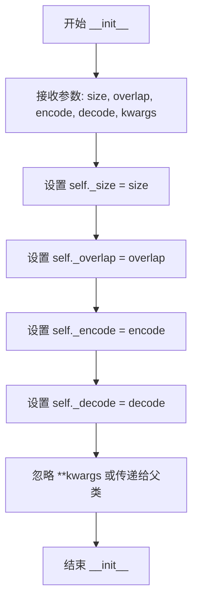

# `graphrag\packages\graphrag-chunking\graphrag_chunking\token_chunker.py` 详细设计文档

一个基于token的文本分块器类，通过encode和decode函数将输入文本按指定的token大小和重叠量分割成多个文本块，适用于需要对文本进行细粒度分割的场景，如LLM上下文窗口管理。

## 整体流程

```mermaid
graph TD
    A[接收文本输入] --> B[调用encode将文本转为tokens]
    B --> C[计算初始chunk范围]
C --> D{是否到达文本末尾?}
    D -- 否 --> E[调用decode将tokens转回文本]
    E --> F[将chunk添加到结果列表]
    F --> G[计算下一个chunk起始位置]
    G --> C
    D -- 是 --> H[返回所有chunk结果]
    H --> I[调用create_chunk_results包装结果]
    I --> J[返回list[TextChunk]]
```

## 类结构

```
Chunker (抽象基类)
└── TokenChunker (token分块器实现)
```

## 全局变量及字段


### `split_text_on_tokens`
    
全局函数，使用tokenizer将文本分割为基于token的chunks

类型：`Callable[[str, int, int, Callable[[str], list[int]], Callable[[list[int]], str]], list[str]]`
    


### `TokenChunker._size`
    
单个chunk的token数量

类型：`int`
    


### `TokenChunker._overlap`
    
相邻chunk之间的token重叠数量

类型：`int`
    


### `TokenChunker._encode`
    
文本转token的编码函数

类型：`Callable[[str], list[int]]`
    


### `TokenChunker._decode`
    
token转文本的解码函数

类型：`Callable[[list[int]], str]`
    
    

## 全局函数及方法


### `split_text_on_tokens`

该函数使用自定义的 tokenizer（encode 和 decode 函数）将单个文本分割成多个基于 token 数量的文本块，支持重叠区域以保持上下文连贯性。

参数：

- `text`：`str`，需要分割的原始文本字符串
- `chunk_size`：`int`，每个文本块的最大 token 数量
- `chunk_overlap`：`int`，相邻文本块之间重叠的 token 数量，用于保持上下文连续性
- `encode`：`Callable[[str], list[int]]`，将文本字符串编码为 token ID 列表的函数
- `decode`：`Callable[[list[int]], str`，将 token ID 列表解码回文本字符串的函数

返回值：`list[str]`，分割后的文本块字符串列表

#### 流程图

```mermaid
flowchart TD
    A[开始 split_text_on_tokens] --> B[使用 encode 函数将文本编码为 token 列表]
    B --> C[初始化结果列表 result, 起始索引 start_idx = 0]
    C --> D[计算当前结束索引 cur_idx = min(start_idx + chunk_size, token总数)]
    D --> E[提取当前块的 token: input_tokens[start_idx:cur_idx]]
    E --> F[使用 decode 函数将 token 块解码为文本]
    F --> G[将解码后的文本追加到结果列表]
    G --> H{当前索引是否到达 token 列表末尾?}
    H -->|是| I[返回结果列表 result]
    H -->|否| J[更新起始索引: start_idx += chunk_size - chunk_overlap]
    J --> K[重新计算 cur_idx = min(start_idx + chunk_size, token总数)]
    K --> E
```

#### 带注释源码

```python
def split_text_on_tokens(
    text: str,
    chunk_size: int,
    chunk_overlap: int,
    encode: Callable[[str], list[int]],
    decode: Callable[[list[int]], str],
) -> list[str]:
    """Split a single text and return chunks using the tokenizer.
    
    使用 tokenizer 将单个文本分割成多个基于 token 的文本块。
    
    参数:
        text: 需要分割的原始文本
        chunk_size: 每个块的最大 token 数量
        chunk_overlap: 相邻块之间的重叠 token 数量
        encode: 文本到 token ID 列表的编码函数
        decode: token ID 列表到文本的解码函数
    
    返回:
        分割后的文本块列表
    """
    # 初始化结果列表，用于存储所有分割后的文本块
    result = []
    
    # 使用 encode 函数将输入文本转换为 token ID 列表
    input_tokens = encode(text)

    # 初始化起始索引，从 0 开始
    start_idx = 0
    
    # 计算当前块的结束索引，确保不超过 token 列表长度
    cur_idx = min(start_idx + chunk_size, len(input_tokens))
    
    # 提取当前块的 token 切片
    chunk_tokens = input_tokens[start_idx:cur_idx]

    # 循环处理，直到处理完所有 token
    while start_idx < len(input_tokens):
        # 使用 decode 函数将当前 token 块解码为文本字符串
        chunk_text = decode(list(chunk_tokens))
        
        # 将解码后的文本块追加到结果列表
        result.append(chunk_text)  # Append chunked text as string
        
        # 如果已经到达 token 列表末尾，则退出循环
        if cur_idx == len(input_tokens):
            break
            
        # 计算下一个块的起始位置，考虑重叠部分
        # 下一个起始位置 = 当前起始位置 + (块大小 - 重叠大小)
        start_idx += chunk_size - chunk_overlap
        
        # 重新计算当前块的结束索引
        cur_idx = min(start_idx + chunk_size, len(input_tokens))
        
        # 提取下一个块的 token 切片
        chunk_tokens = input_tokens[start_idx:cur_idx]

    # 返回所有分割后的文本块列表
    return result
```


### `TokenChunker.__init__`

初始化 TokenChunker 实例，设置基于 token 的文本分块所需的配置参数，包括块大小、重叠大小、文本编码器和解码器。

参数：

- `size`：`int`，目标块的大小，以 token 数量计
- `overlap`：`int`，相邻块之间的重叠 token 数量，用于保持上下文连续性
- `encode`：`Callable[[str], list[int]]`，将文本字符串编码为 token 整数列表的函数
- `decode`：`Callable[[list[int]], str]` ，将 token 整数列表解码回文本字符串的函数
- `**kwargs`：`Any`，其他可选关键字参数，用于扩展或传递给父类

返回值：`None`，`__init__` 方法不返回任何值，仅初始化实例状态

#### 流程图



#### 带注释源码

```python
def __init__(
    self,
    size: int,
    overlap: int,
    encode: Callable[[str], list[int]],
    decode: Callable[[list[int]], str],
    **kwargs: Any,
) -> None:
    """Create a token chunker instance."""
    # 将块大小存储为实例变量，用于后续分块操作
    self._size = size
    # 将重叠大小存储为实例变量，控制相邻块之间的重叠 token 数量
    self._overlap = overlap
    # 存储文本编码函数，用于将字符串转换为 token 列表
    self._encode = encode
    # 存储文本解码函数，用于将 token 列表转换回字符串
    self._decode = decode
```


# TokenChunker.chunk 方法详细设计文档

## 1. 一段话描述

`TokenChunker.chunk` 方法是图谱检索增强生成(GraphRAG)分块模块中的核心方法，用于将输入文本按照指定的 token 数量和重叠度分割成多个文本块，并可选地应用变换函数，最终返回结构化的 `TextChunk` 对象列表。

## 2. 文件的整体运行流程

```
TokenChunker 实例化
        │
        ▼
调用 chunk(text, transform)
        │
        ▼
split_text_on_tokens() - 基于 token 分割文本
        │
        ├── encode(text) → token IDs
        │
        ├── 遍历 tokens，按 chunk_size 和 chunk_overlap 切分
        │
        └── decode(chunk_tokens) → chunk text
        │
        ▼
create_chunk_results() - 创建 TextChunk 对象列表
        │
        └── 返回 list[TextChunk]
```

## 3. 类的详细信息

### 3.1 TokenChunker 类

| 字段名称 | 类型 | 描述 |
|---------|------|------|
| `_size` | `int` | 每个 chunk 的最大 token 数量 |
| `_overlap` | `int` | 相邻 chunks 之间的 token 重叠数量 |
| `_encode` | `Callable[[str], list[int]]` | 文本编码函数，将字符串转换为 token ID 列表 |
| `_decode` | `Callable[[list[int]], str]` | 文本解码函数，将 token ID 列表转换回字符串 |

| 方法名称 | 描述 |
|---------|------|
| `__init__` | 初始化 TokenChunker 实例 |
| `chunk` | 将文本分割为基于 token 的 chunks |

### 3.2 全局函数 split_text_on_tokens

| 函数名称 | 描述 |
|---------|------|
| `split_text_on_tokens` | 使用 tokenizer 将文本分割成基于 token 的块 |

---

## 4. 方法详细信息

### `TokenChunker.chunk`

#### 描述

将输入文本按照 token 数量分割为多个文本块，支持重叠分割和可选的文本变换。

#### 参数

- `text`：`str`，待分块的原始输入文本
- `transform`：`Callable[[str], str] | None`，可选的文本变换函数，用于在创建块之前对每个文本块进行转换（如清理、规范化等）

#### 返回值

`list[TextChunk]`：包含分割后文本块的列表，每个 TextChunk 对象包含文本内容及相关元数据

#### 流程图

```mermaid
flowchart TD
    A[开始 chunk 方法] --> B[调用 split_text_on_tokens]
    B --> C[传入 text, size, overlap, encode, decode]
    C --> D[encode(text) 获取 token IDs]
    D --> E[初始化 start_idx=0]
    E --> F[计算 cur_idx = min(start_idx + size, len(tokens))]
    F --> G[提取 chunk_tokens = tokens[start_idx:cur_idx]]
    G --> H{start_idx < len(tokens)?}
    H -->|是| I[decode(chunk_tokens) 获取文本]
    I --> J[追加到结果列表]
    J --> K{cur_idx == len(tokens)?}
    K -->|是| L[退出循环]
    K -->|否| M[start_idx += size - overlap]
    M --> N[重新计算 cur_idx]
    N --> G
    H -->|否| O[返回 chunks 列表]
    O --> P[调用 create_chunk_results]
    P --> Q[返回 list[TextChunk]]
```

#### 带注释源码

```python
def chunk(
    self, text: str, transform: Callable[[str], str] | None = None
) -> list[TextChunk]:
    """Chunk the text into token-based chunks."""
    # 步骤1: 调用 split_text_on_tokens 将文本按 token 分割成字符串列表
    chunks = split_text_on_tokens(
        text,                      # 待分割的文本
        chunk_size=self._size,     # 每个 chunk 的最大 token 数
        chunk_overlap=self._overlap,  # 相邻 chunk 间的重叠 token 数
        encode=self._encode,       # 编码函数用于将文本转为 token IDs
        decode=self._decode,       # 解码函数用于将 token IDs 转回文本
    )
    # 步骤2: 将字符串列表转换为 TextChunk 对象列表
    # transform 参数可选，用于在创建块前对每个文本进行转换
    return create_chunk_results(
        chunks, 
        transform=transform, 
        encode=self._encode
    )
```

---

### `split_text_on_tokens` (全局函数)

#### 描述

使用指定的编码器和解码器将文本分割成基于 token 的块，支持重叠窗口。

#### 参数

- `text`：`str`，待分割的文本
- `chunk_size`：`int`，每个块的 token 最大数量
- `chunk_overlap`：`int`，相邻块之间的 token 重叠数量
- `encode`：`Callable[[str], list[int]]`，文本编码函数
- `decode`：`Callable[[list[int]], str]`：文本解码函数

#### 返回值

`list[str]`：分割后的文本块列表（字符串形式）

#### 带注释源码

```python
def split_text_on_tokens(
    text: str,
    chunk_size: int,
    chunk_overlap: int,
    encode: Callable[[str], list[int]],
    decode: Callable[[list[int]], str],
) -> list[str]:
    """Split a single text and return chunks using the tokenizer."""
    result = []  # 存储最终的分块结果
    
    # 使用编码函数将文本转换为 token ID 列表
    input_tokens = encode(text)

    start_idx = 0  # 起始索引
    # 计算当前块的结束索引（不超过文本总长度）
    cur_idx = min(start_idx + chunk_size, len(input_tokens))
    # 提取当前块的 token
    chunk_tokens = input_tokens[start_idx:cur_idx]

    # 循环遍历直到处理完所有 tokens
    while start_idx < len(input_tokens):
        # 解码当前 token 块为文本字符串
        chunk_text = decode(list(chunk_tokens))
        result.append(chunk_text)  # 追加到结果列表
        
        # 如果已到达文本末尾，退出循环
        if cur_idx == len(input_tokens):
            break
        
        # 计算下一个块的起始位置（考虑重叠）
        start_idx += chunk_size - chunk_overlap
        # 重新计算当前块的结束索引
        cur_idx = min(start_idx + chunk_size, len(input_tokens))
        # 提取下一个块的 tokens
        chunk_tokens = input_tokens[start_idx:cur_idx]

    return result
```

---

## 5. 关键组件信息

| 组件名称 | 一句话描述 |
|---------|-----------|
| `Chunker` | 抽象基类，定义分块器的接口规范 |
| `TextChunk` | 表示分块后的文本单元，包含文本内容和元数据 |
| `create_chunk_results` | 辅助函数，将字符串列表转换为 TextChunk 对象列表 |
| `encode/decode` 函数 | 外部依赖的 tokenizer 函数，负责文本与 token ID 之间的转换 |

---

## 6. 潜在的技术债务或优化空间

1. **错误处理缺失**：未对空文本、非法参数（如负数 size/overlap）进行验证
2. **边界条件优化**：当 `chunk_overlap >= chunk_size` 时可能导致无限循环，当前未做保护
3. **性能考量**：每次循环都调用 `decode(list(chunk_tokens))`，`list()` 转换可能存在性能开销
4. **内存占用**：对于超大文本，一次性加载所有 token IDs 可能导致内存压力

---

## 7. 其它项目

### 设计目标与约束

- **目标**：提供基于 token 的文本分割能力，支持重叠窗口以保留上下文连续性
- **约束**：
  - 必须使用提供的 `encode`/`decode` 函数进行 token 操作
  - `chunk_size` 必须大于 0
  - `chunk_overlap` 应小于 `chunk_size`

### 错误处理与异常设计

- 当前实现未包含显式的错误处理和异常抛出机制
- 依赖上游调用方确保输入合法（如非空文本、有效的 tokenizer）

### 数据流与状态机

- 数据流：原始文本 → Token IDs → 分块 Token IDs → 分块文本 → TextChunk 对象列表
- 状态机：初始化 → 编码 → 分块迭代 → 解码 → 结果封装

### 外部依赖与接口契约

- **依赖模块**：
  - `graphrag_chunking.chunker.Chunker`：基类
  - `graphrag_chunking.create_chunk_results`：结果创建工具
  - `graphrag_chunking.text_chunk.TextChunk`：结果数据类型
- **接口契约**：
  - `encode` 函数必须将字符串转换为整数列表
  - `decode` 函数必须将整数列表转换回字符串
  - 两个函数应互为逆函数以保证数据一致性


### `TokenChunker.chunk`

该方法将文本分割成基于token的块，通过传入的编码/解码函数（encode/decode）使用滑动窗口算法将文本按token数量分割，并可选择性地对每个块应用transform函数进行处理。

参数：

- `text`：`str`，待分块的原始文本
- `transform`：`Callable[[str], str] | None`，可选的文本转换函数，用于在创建块结果前对每个文本块进行处理（如清理、标准化等）

返回值：`list[TextChunk]`，文本块列表，每个元素包含分块后的文本及相关元数据

#### 流程图

```mermaid
flowchart TD
    A[开始 chunk 方法] --> B[调用 split_text_on_tokens]
    B --> C[使用 encode 函数将文本转为 tokens]
    C --> D[滑动窗口遍历 tokens]
    D --> E[计算窗口起始和结束位置]
    E --> F[使用 decode 函数将 token 子集转回文本]
    F --> G[将解码后的文本添加到结果列表]
    G --> H{是否到达文本末尾?}
    H -->|否| I[更新窗口位置: start_idx += chunk_size - chunk_overlap]
    I --> E
    H -->|是| J[返回 chunks 列表]
    J --> K[调用 create_chunk_results]
    K --> L[应用 transform 函数到每个 chunk]
    L --> M[返回 list[TextChunk]]
```

#### 带注释源码

```python
def chunk(
    self, text: str, transform: Callable[[str], str] | None = None
) -> list[TextChunk]:
    """Chunk the text into token-based chunks."""
    # 使用滑动窗口算法基于token分割文本
    # 参数说明:
    #   - text: 输入的原始文本
    #   - chunk_size: 每个块的token数量
    #   - chunk_overlap: 相邻块之间的token重叠数量
    #   - encode: 将字符串编码为token列表的函数
    #   - decode: 将token列表解码为字符串的函数
    chunks = split_text_on_tokens(
        text,
        chunk_size=self._size,
        chunk_overlap=self._overlap,
        encode=self._encode,
        decode=self._decode,
    )
    # 创建块结果对象，可选地应用transform函数
    # create_chunk_results 会:
    #   1. 对每个文本块调用 transform 函数（如果提供）
    #   2. 使用 encode 函数计算每个块的token数量
    #   3. 返回包含文本和元数据的 TextChunk 对象列表
    return create_chunk_results(chunks, transform=transform, encode=self._encode)
```

#### 相关辅助函数源码

```python
def split_text_on_tokens(
    text: str,
    chunk_size: int,
    chunk_overlap: int,
    encode: Callable[[str], list[int]],
    decode: Callable[[list[int]], str],
) -> list[str]:
    """Split a single text and return chunks using the tokenizer."""
    result = []
    # 第一步：将整个文本编码为token列表
    input_tokens = encode(text)

    # 初始化滑动窗口的起始位置
    start_idx = 0
    # 计算当前窗口的结束位置（不超过token列表长度）
    cur_idx = min(start_idx + chunk_size, len(input_tokens))
    # 提取当前窗口内的token
    chunk_tokens = input_tokens[start_idx:cur_idx]

    # 滑动窗口循环：直到处理完所有token
    while start_idx < len(input_tokens):
        # 将当前token窗口解码为文本字符串
        chunk_text = decode(list(chunk_tokens))
        result.append(chunk_text)  # Append chunked text as string
        
        # 检查是否已到达文本末尾
        if cur_idx == len(input_tokens):
            break
            
        # 计算下一个窗口的起始位置（考虑重叠）
        start_idx += chunk_size - chunk_overlap
        # 更新当前窗口的结束位置
        cur_idx = min(start_idx + chunk_size, len(input_tokens))
        # 提取下一个窗口的token
        chunk_tokens = input_tokens[start_idx:cur_idx]

    return result
```


## 关键组件


### TokenChunker

基于token的文本分块器类，继承自 Chunker 基类，通过 encode/decode 回调函数实现文本到token的转换与反向转换，支持指定块大小和重叠token数量进行文本分割。

### split_text_on_tokens

核心分块逻辑函数，接收文本、块大小、重叠数量、编码和解码函数，将文本编码为token列表后，按照指定的块大小和重叠量进行切片分割，最后将每组token解码回文本字符串并返回块列表。

### encode/decode 回调接口

可插拔的tokenization接口约定，encode 将字符串转为整数token列表，decode 将整数token列表转回字符串，用于支持不同的tokenizer实现（如tiktoken、HuggingFace等）。

### TextChunk

分块结果的文本单元，由 create_chunk_results 函数将分块后的文本字符串列表转换而来，包含分割后的文本内容及其元数据。

### chunk_size 与 chunk_overlap 参数

控制分块粒度的核心参数，chunk_size 决定每个块的token数量上限，chunk_overlap 决定相邻块之间的重叠token数量，用于保持上下文连贯性。

### create_chunk_results

辅助函数，将分块后的文本字符串列表转换为 TextChunk 对象列表，可选地应用 transform 回调对每个块进行后处理。


## 问题及建议


### 已知问题

- **无限循环风险**：当 `chunk_size <= chunk_overlap` 时，`start_idx += chunk_size - chunk_overlap` 可能导致 `start_idx` 无法有效推进，形成无限循环。代码未对 `chunk_size` 和 `chunk_overlap` 的关系进行校验。
- **缺少参数验证**：构造函数和 `split_text_on_tokens` 函数均未对 `encode`/`decode` 参数进行非空或类型验证，若传入 `None` 或不可调用对象会导致运行时错误。
- **transform 参数未验证**：`chunk` 方法接收的 `transform` 参数直接传递给 `create_chunk_results`，但未验证其有效性。
- **错误处理缺失**：`encode(text)` 可能抛出异常（如文本编码错误），`decode(list(chunk_tokens))` 也可能失败，但均未进行异常捕获和处理。
- **空文本处理未明确**：当输入 `text` 为空字符串时，`encode("")` 返回空列表，while 循环条件 `start_idx < len(input_tokens)` 直接为 `False`，返回空列表。行为是否符合预期需确认。
- **边界条件未覆盖**：当 `chunk_size` 大于 `input_tokens` 长度时，逻辑正常；但当 `chunk_size` 为 0 或负数时，代码可能产生异常或不符合预期的行为。

### 优化建议

- **添加参数校验**：在 `__init__` 中验证 `chunk_size > 0`、`chunk_overlap >= 0` 且 `chunk_overlap < chunk_size`；对 `encode`/`decode` 进行类型检查和可调用性验证。
- **增加异常处理**：在 `chunk` 方法和 `split_text_on_tokens` 函数中添加 try-except 块，捕获并合理处理 `encode`/`decode` 可能抛出的异常，提供有意义的错误信息。
- **防御性编程**：在 `split_text_on_tokens` 开头添加对 `text` 为空或 `chunk_size <= 0` 的早期返回处理。
- **优化性能**：当前每次循环都执行 `list(chunk_tokens)`，对于已经 是 list 的切片可直接复用，可减少不必要的内存分配。
- **增强文档**：为 `encode`/`decode` 参数添加更详细的类型约束和使用说明，明确期望的函数签名。
- **考虑默认值**：如果存在常用的 `encode`/`decode` 实现（如 tiktoken），可考虑提供默认实现或预设配置，降低使用门槛。

## 其它


### 设计目标与约束

本模块的设计目标是将长文本按照指定的token数量和重叠度分割成较小的文本块，以便于后续的向量检索和语义分析。核心约束包括：1) 输入文本必须能够被指定的encode函数处理；2) chunk_size必须大于0；3) chunk_overlap必须小于chunk_size以保证有意义的首尾重叠；4) 需要依赖外部的tokenizer实现（encode/decode函数）。

### 错误处理与异常设计

主要异常场景包括：1) 当encode函数返回空列表时，chunk方法应返回空列表；2) 当text为空字符串时，应返回空列表；3) 当chunk_size大于输入文本的token总数时，应返回包含完整文本的单个块；4) 潜在的KeyError异常（当kwargs中包含未定义的参数时，会传递给父类）。目前代码未显式定义异常类，建议在文档中说明需要调用方保证传入的encode/decode函数有效性。

### 数据流与状态机

数据流主要分为三个阶段：1) 编码阶段：调用encode函数将输入文本转换为token列表；2) 分块阶段：按照滑动窗口机制（window_size=chunk_size, step=chunk_size-chunk_overlap）提取token子列表；3) 解码阶段：调用decode函数将token子列表转换回文本块。状态机相对简单，主要是循环迭代处理token列表直至处理完毕。

### 外部依赖与接口契约

主要外部依赖包括：1) graphrag_chunking.chunker.Chunker - 抽象基类；2) graphrag_chunking.create_chunk_results - 用于创建结构化的Chunk结果；3) graphrag_chunking.text_chunk.TextChunk - 文本块的数据结构；4) typing.Any和collections.abc.Callable - 类型注解。接口契约方面：encode函数接受str返回list[int]，decode函数接受list[int]返回str，transform函数接受str返回str（或None）。

### 性能考虑

主要性能瓶颈在encode和decode函数的调用频率上。对于长度为N个token的输入文本，encode调用1次，decode调用约N/(chunk_size-chunk_overlap)次。当chunk_overlap较大时，解码次数会增加。建议在文档中说明：在极端情况下（chunk_size=1, chunk_overlap=0），解码次数等于token总数，此时性能最差。

### 线程安全性

该模块本身不维护可变状态，chunk方法是纯函数风格的实例方法（除了读取self的配置参数），因此在不考虑encode/decode函数副作用的情况下，TokenChunker实例可以安全地在多线程环境中使用。但需要注意：如果encode/decode函数不是线程安全的（例如包含内部缓存或状态），则需要调用方保证线程安全。

### 配置参数说明

| 参数名 | 类型 | 必填 | 默认值 | 说明 |
|--------|------|------|--------|------|
| size | int | 是 | 无 | 每个chunk的token数量 |
| overlap | int | 是 | 无 | 相邻chunk之间的token重叠数量 |
| encode | Callable[[str], list[int]] | 是 | 无 | 文本编码函数，将字符串转换为token列表 |
| decode | Callable[[list[int]], str] | 是 | 无 | 文本解码函数，将token列表转换回字符串 |
| kwargs | Any | 否 | {} | 传递给父类Chunker的额外参数 |

### 边界条件处理

当前代码对以下边界条件有相应处理：1) 空文本输入返回空列表；2) 当chunk_size >= len(input_tokens)时，返回包含完整文本的单个块；3) 当chunk_overlap >= chunk_size时，逻辑上会导致step <= 0，但代码未做校验。边界条件测试用例建议补充：空字符串、单字符文本、单个token的文本、chunk_overlap=0的情况、chunk_overlap接近chunk_size的情况。

### 使用示例

```python
# 示例：使用tiktoken编码器
import tiktoken

enc = tiktoken.get_encoding("cl100k_base")
chunker = TokenChunker(
    size=300,
    overlap=50,
    encode=enc.encode,
    decode=enc.decode
)

text = "这是一段很长的文本..." * 100
chunks = chunker.chunk(text)
print(f"生成了 {len(chunks)} 个文本块")
```

### 版本兼容性说明

本模块适用于Python 3.9+（需要支持from __future__ import annotations或typing模块的某些特性）。依赖的graphrag_chunking包版本需要与当前版本兼容，建议在文档中注明 compatible_versions 字段。


    