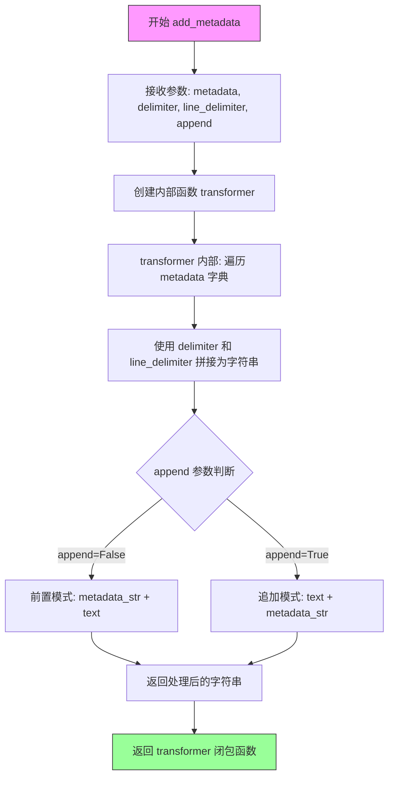

# `graphrag\packages\graphrag-chunking\graphrag_chunking\transformers.py` 详细设计文档

一个用于文本分块的实用内置转换器集合，核心功能是提供add_metadata函数，该函数接受元数据字典并返回一个转换器函数，该函数可以将元数据（键值对形式）按照指定分隔符添加到文本的前面或后面。

## 整体流程

```mermaid
graph TD
    A[开始] --> B[调用add_metadata函数]
B --> C[创建metadata_str]
C --> D{append参数}
D -- False --> E[返回前置元数据的transformer]
D -- True --> F[返回追加元数据的transformer]
E --> G[调用transformer(text)]
F --> G
G --> H[输出带元数据的文本]
```

## 类结构

```
（注：本文件为函数式编程，无类层次结构）
└── add_metadata (全局函数)
```

## 全局变量及字段


### `add_metadata`
    
主函数，接受元数据字典和配置参数，返回一个文本转换函数

类型：`Callable[[dict[str, Any], str, str, bool], Callable[[str], str]]`
    


### `metadata`
    
要添加的元数据字典，包含键值对

类型：`dict[str, Any]`
    


### `delimiter`
    
键与值之间的分隔符，默认为': '

类型：`str`
    


### `line_delimiter`
    
各行之间的分隔符，默认为换行符'\n'

类型：`str`
    


### `append`
    
控制元数据是追加到文本末尾还是前置到文本开头，默认为False（前置）

类型：`bool`
    


### `transformer`
    
内部闭包函数，将元数据字符串与输入文本组合

类型：`Callable[[str], str]`
    


### `text`
    
待处理的输入文本

类型：`str`
    


### `metadata_str`
    
格式化后的元数据字符串，由键值对按指定分隔符连接而成

类型：`str`
    


    

## 全局函数及方法


### `add_metadata`

这是一个工厂函数，用于创建向文本添加元数据的转换器。该函数接收元数据字典和配置参数，返回一个转换函数（闭包），该转换函数可以将键值对格式的元数据字符串添加到输入文本的前面或后面。

参数：

- `metadata`：`dict[str, Any]` 元数据字典，包含要添加的键值对
- `delimiter`：`str = ": "` 键和值之间的分隔符，默认为 ": "
- `line_delimiter`：`str = "\n"` 各个键值对之间的行分隔符，默认为换行符
- `append`：`bool = false` 是否将元数据追加到文本末尾，默认为 False（前置）

返回值：`Callable[[str], str]` 返回一个转换函数，该函数接受字符串并返回添加了元数据的字符串

#### 流程图



#### 带注释源码

```python
def add_metadata(
    metadata: dict[str, Any],
    delimiter: str = ": ",
    line_delimiter: str = "\n",
    append: bool = False,
) -> Callable[[str], str]:
    """Add metadata to the given text, prepending by default. This utility writes the dict as rows of key/value pairs."""

    # 定义内部转换函数（闭包），捕获外部参数
    def transformer(text: str) -> str:
        # 将 metadata 字典转换为键值对字符串
        # 格式: "key1: value1\nkey2: value2\n"
        metadata_str = (
            line_delimiter.join(f"{k}{delimiter}{v}" for k, v in metadata.items())
            + line_delimiter
        )
        # 根据 append 参数决定是前置还是追加到文本
        return text + metadata_str if append else metadata_str + text

    # 返回闭包函数，该函数可在后续被调用并传入实际文本
    return transformer
```

## 关键组件


### add_metadata 函数

核心导出函数，用于创建文本转换器，将字典格式的元数据添加到文本中。支持自定义分隔符和追加/前置模式。

### transformer 内部函数

实际执行文本转换的闭包函数，负责将元数据字典格式化为键值对字符串并根据 append 参数决定追加到文本末尾还是前置到文本开头。

### metadata 参数

类型：dict[str, Any]，需要添加到文本中的元数据字典，键为字符串，值为任意类型。

### delimiter 参数

类型：str = ": "，键值对之间的分隔符，默认为冒号加空格。

### line_delimiter 参数

类型：str = "\n"，行之间的分隔符，默认为换行符。

### append 参数

类型：bool = False，控制元数据是追加到文本末尾（True）还是前置到文本开头（False），默认为前置模式。

### 返回值

类型：Callable[[str], str]，返回一个接收文本字符串并返回添加元数据后新字符串的转换函数。

### 潜在技术债务

- 缺少类型注解的返回值描述
- 没有输入验证（如空字典、None 值处理）
- 缺少对大数据量文本的性能优化


## 问题及建议


### 已知问题

- **类型注解不完整**：返回的`Callable`类型缺少输入输出类型的明确声明，使用了`Any`类型，降低了类型安全性和IDE辅助能力
- **空metadata处理不当**：当传入空字典时，仍会在文本前后添加空行和换行符，可能导致意外的格式问题
- **缺少输入验证**：未对`metadata`、`delimiter`、`line_delimiter`参数进行有效性检查，传入`None`或非法值时可能产生运行时错误
- **复杂类型值转换风险**：metadata的value类型为`Any`，如果包含列表、字典等复杂对象，直接`f"{v}"`转换可能产生非预期结果
- **字符串拼接效率**：使用`+`运算符进行字符串拼接，在处理大量或长文本时可能存在性能瓶颈
- **返回值函数缺乏约束**：返回的内部`transformer`函数缺少类型注解，与外部函数类型声明不一致

### 优化建议

- 完善类型注解，使用泛型`Callable[[str], str]`替代`Callable`，避免使用`Any`
- 添加输入参数验证逻辑，检查`metadata`是否为`None`，`delimiter`和`line_delimiter`是否为有效字符串
- 处理空metadata的特殊情况，返回原始文本或提供参数控制空metadata行为
- 考虑使用`textwrap.dedent`或字符串格式化方法处理复杂对象
- 考虑使用`str.join()`或`io.StringIO`优化大量文本拼接场景
- 为内部`transformer`函数添加类型注解和文档说明
- 添加单元测试覆盖边界情况（空metadata、空文本、特殊字符等）

## 其它


### 设计目标与约束

1. **核心目标**：提供一个通用的元数据添加工具，用于在文本处理流水线中向文本块添加键值对形式的元数据信息。
2. **设计约束**：
   - 保持函数签名的简洁性，仅暴露必要的配置参数
   - 使用闭包实现状态记忆，避免外部状态管理
   - 遵循函数式编程风格，返回可调用的转换器函数
   - 依赖标准库，无外部依赖引入

### 错误处理与异常设计

1. **输入验证**：
   - `metadata` 参数期望为 dict 类型，若传入非字典类型可能导致运行时错误
   - `text` 参数期望为字符串类型，传入空字符串时返回仅包含元数据字符串
   - 未对 None 值进行显式检查，可能导致 AttributeError
2. **异常处理策略**：
   - 当前实现未包含 try-except 块，依赖调用方保证输入合法性
   - 建议在文档中明确标注参数类型约束
3. **边界情况**：
   - 空字典 metadata：返回原始文本（前置模式）或空字符串（追加模式，取决于 append 参数）
   - 特殊字符：未对元数据键值中的特殊字符进行转义处理

### 数据流与状态机

1. **数据流**：
   - 输入：metadata 字典 + 配置参数（delimiter, line_delimiter, append）
   - 处理：字典遍历 → 字符串格式化 → 字符串拼接
   - 输出：Callable[[str], str] 类型的转换器函数
2. **状态转换**：
   - add_metadata() 被调用 → 返回 transformer 闭包 → transformer(text) 被调用 → 返回结果字符串
3. **闭包状态**：
   - transformer 函数捕获外部作用域的 metadata、delimiter、line_delimiter、append 变量，形成闭包

### 外部依赖与接口契约

1. **外部依赖**：
   - `collections.abc.Callable`：用于类型提示
   - `typing.Any`：用于类型提示
   - 无第三方依赖，仅使用 Python 标准库
2. **接口契约**：
   - 函数 add_metadata 接受一个必需参数 metadata（dict[str, Any]）和三个可选参数
   - 返回值类型为 Callable[[str], str]，表示接受字符串并返回字符串的可调用对象
   - delimiter 默认为 ": "，用于键值对分隔
   - line_delimiter 默认为 "\n"，用于行分隔
   - append 默认为 False，表示默认前置元数据

### 使用示例与调用模式

1. **典型用法**：
   ```python
   # 创建元数据添加器
   meta_adder = add_metadata({"source": "document", "page": "1"})
   
   # 应用到文本
   result = meta_adder("原始文本内容")
   # 输出: "source: document\npage: 1\n原始文本内容"
   ```
2. **集成方式**：
   - 可作为文本处理流水线中的转换步骤
   - 返回的 Callable 可传递给其他高阶函数（如 map、filter）

### 性能考虑与优化空间

1. **当前实现**：
   - 使用生成器表达式和 join 实现，相对高效
   - 每次调用 transformer 都会重新构建元数据字符串
2. **潜在优化**：
   - 若 metadata 固定且调用频繁，可缓存已格式化的 metadata_str
   - 对于大量调用场景，考虑使用 functools.lru_cache 缓存结果

### 安全性考虑

1. **输入安全**：
   - 未对 metadata 中的值进行类型检查或序列化
   - 特殊字符未转义，可能导致注入问题
2. **建议**：
   - 添加值类型验证，确保为基本数据类型（str、int、float、bool）
   - 考虑对特殊字符进行转义处理

    