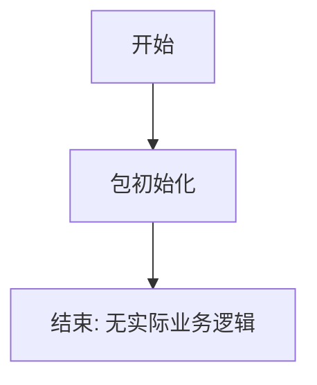

# `graphrag\packages\graphrag-common\graphrag_common\__init__.py` 详细设计文档

这是一个GraphRAG Common包的存根文件，仅包含版权声明和包名文档字符串，暂无实际功能实现

## 整体流程



## 类结构

```
无类层次结构 - 仅为包声明文件
```

## 全局变量及字段


    

## 全局函数及方法


## 关键组件


### GraphRAG Common Package

GraphRAG Common包是Microsoft GraphRAG项目的通用基础模块，提供共享的工具、常量和基础功能支持。

### 文件的整体运行流程

该文件为GraphRAG Common包的初始化文件（`__init__.py`），仅包含版权声明和模块文档字符串，不包含任何运行时逻辑。作为Python包的入口点，该文件在包被导入时首先执行，但当前版本不导出任何模块成员。

### 类的详细信息

该文件中未定义任何类。

### 全局变量和全局函数

该文件中未定义任何全局变量或全局函数。

### 关键组件信息

- **包初始化模块**：作为GraphRAG Common包的入口文件，当前为占位符状态，为后续功能扩展预留命名空间

### 潜在的技术债务或优化空间

1. **功能缺失**：该包目前为占位符状态，缺少实际的功能实现，需要根据GraphRAG项目需求添加通用工具函数、数据处理类、常量定义等核心组件
2. **模块结构规划**：建议明确该包的职责边界，定义清晰的子模块结构（如utils、constants、base等）
3. **文档完善**：需要补充详细的模块文档和API说明

### 其它项目

- **设计目标**：作为GraphRAG项目的公共基础包，提供跨模块共享的通用能力
- **约束条件**：遵循MIT许可证，版权归属Microsoft Corporation
- **错误处理**：当前无错误处理逻辑
- **外部依赖**：当前无外部依赖声明
- **接口契约**：当前无接口定义


## 问题及建议


### 已知问题

- 包内容为空，缺乏实际的模块和功能实现，目前仅为占位符
- 未定义包的公共API（__all__变量），可能导致导入行为不一致
- 缺少版本信息定义（如__version__变量），不利于依赖管理和版本追踪
- 没有子模块组织，代码逻辑可能全部堆叠在单一文件中
- 缺少包的初始化配置，如日志配置、默认参数等

### 优化建议

- 明确包的公共接口，定义__all__变量导出公开API
- 添加版本信息，如__version__ = "0.1.0"
- 根据功能拆分子模块，如utils、models、handlers等
- 添加包级别的文档字符串，详细描述包的功能和用法
- 考虑添加依赖声明和基础配置初始化逻辑


## 其它


### 设计目标与约束

由于提供的代码仅包含版权声明和包声明，未包含实际实现逻辑，因此无法提取具体的设计目标与约束信息。通常设计目标应包括：性能指标（如响应时间、吞吐量）、可扩展性要求、兼容性要求等。

### 错误处理与异常设计

代码中未包含任何错误处理或异常设计逻辑。该部分应包含异常类型定义、错误码规范、异常传播机制、容错策略等内容。

### 数据流与状态机

由于代码中未实现任何数据处理逻辑，因此无法分析数据流与状态机。该部分应描述数据输入、处理、输出的完整流程，以及状态转换逻辑。

### 外部依赖与接口契约

代码中未显示任何外部依赖或接口定义。该部分应列出所有第三方库依赖、API接口规范、模块间调用契约、数据格式定义等。

### 性能要求

未提供性能相关实现。该部分应包含性能基准、资源限制、并发处理能力、缓存策略等设计内容。

### 安全性考虑

代码中未包含安全相关实现。该部分应描述身份验证、授权机制、数据加密、输入验证、安全审计等设计内容。

### 兼容性设计

代码仅包含版权声明，无法评估兼容性。该部分应说明版本兼容性、API稳定性承诺、向后兼容策略等。

### 配置管理

未包含配置相关实现。该部分应描述配置项定义、配置加载机制、配置验证、环境差异化配置等内容。

### 测试策略

代码中未包含测试实现。该部分应描述单元测试、集成测试、端到端测试策略、测试覆盖率目标等。

### 部署架构

由于代码为包声明而非可执行程序，该部分通常应描述部署拓扑、运行环境要求、服务组件关系、容器化方案等。

### 版本兼容性

代码中未包含版本管理逻辑。该部分应描述版本号规范、版本兼容性矩阵、升级策略等。


    