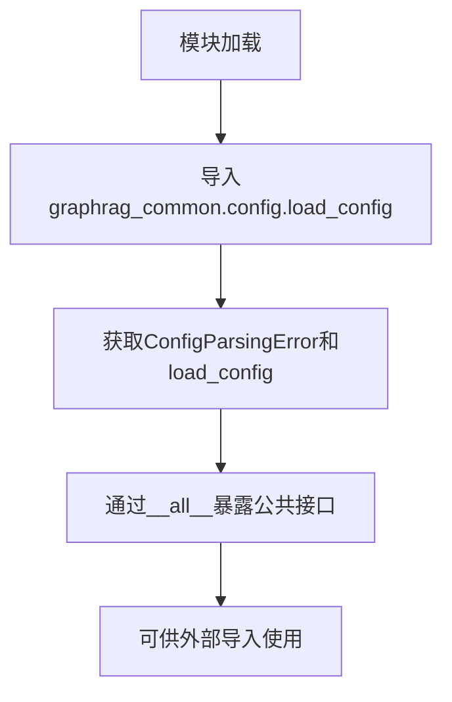

# `graphrag\packages\graphrag-common\graphrag_common\config\__init__.py` 详细设计文档

GraphRAG配置模块的入口文件，负责从graphrag_common.config.load_config导入并重新导出ConfigParsingError异常类和load_config配置加载函数，供上层调用者使用。

## 整体流程



## 类结构

```
无类层次结构（仅为导入重导出模块）
```

## 全局变量及字段


    

## 全局函数及方法


## 关键组件


### 概述

该代码是GraphRAG配置模块的入口文件，主要负责从`graphrag_common.config.load_config`模块导入并导出配置加载相关的核心接口，包括`ConfigParsingError`异常类和`load_config`配置加载函数，供上层应用进行配置解析和加载操作。

### 文件整体运行流程

该模块作为一个轻量级的包装器/重新导出模块，其运行流程如下：

1. 模块被导入时，Python执行from导入语句
2. 从依赖包`graphrag_common.config.load_config`中获取`ConfigParsingError`和`load_config`
3. 通过`__all__`定义公共API接口
4. 外部使用者通过`from graphrag_config import ConfigParsingError, load_config`方式使用

### 全局变量和全局函数

### ConfigParsingError

- **类型**: 异常类 (Exception)
- **描述**: 配置解析错误异常类，用于捕获配置文件格式错误、缺少必要配置项等场景

### load_config

- **类型**: 函数
- **描述**: 核心配置加载函数，负责从配置文件或配置源加载并解析配置参数

### 关键组件信息

### 配置加载接口层

作为GraphRAG配置模块的统一入口，封装了底层配置加载实现，提供清晰的API接口供其他模块调用

### 异常定义层

定义配置解析过程中的异常类型，用于错误传播和错误处理

### 潜在的技术债务或优化空间

1. **缺乏配置验证机制**：当前模块直接导出底层函数，缺少对配置参数的事前验证逻辑
2. **配置缓存缺失**：重复调用`load_config`可能存在重复解析开销，可考虑增加配置缓存机制
3. **文档缺失**：模块级文档字符串较为简略，缺少配置格式、参数说明等详细文档
4. **测试覆盖**：无法确认是否有针对该模块的单元测试和集成测试

### 其它项目

#### 设计目标与约束

- **设计目标**：提供统一的配置加载入口，封装底层实现细节，降低模块耦合度
- **约束**：依赖`graphrag_common.config.load_config`模块，需保证该依赖可用

#### 错误处理与异常设计

- 使用`ConfigParsingError`异常类处理配置解析错误，调用方可通过try-except捕获并处理

#### 外部依赖与接口契约

- **依赖包**: `graphrag_common.config.load_config`
- **接口契约**: 导入的`load_config`函数签名和`ConfigParsingError`异常类型由上游模块定义


## 问题及建议


### 已知问题

-   **缺少模块文档字符串**：该模块没有提供任何模块级别的文档说明，开发者无法快速理解该模块的用途和使用方式
-   **无任何错误处理机制**：如果 `graphrag_common.config.load_config` 模块不存在或导入失败，程序将直接抛出异常，缺乏友好的错误提示
-   **重新导出无附加值**：该模块仅仅是重新导出了 `ConfigParsingError` 和 `load_config`，没有添加任何额外的功能或封装，属于"传递依赖"模式，增加了项目复杂度而不带来实质收益
-   **缺乏灵活性**：配置加载逻辑完全依赖内部实现，无法在导入层进行自定义配置（如缓存、超时、重试等）
-   **无类型注解**：缺少类型提示信息，不利于静态分析和IDE自动补全

### 优化建议

-   **添加模块文档字符串**：在文件开头添加 `"""The GraphRAG config module."""` 类似的文档，说明模块职责
-   **添加导入错误处理**：考虑使用 try-except 包装导入语句，提供更友好的错误信息或回退机制
-   **封装配置加载逻辑**：如果需要，可以在此层添加配置缓存、单例模式或配置验证逻辑，提供更有价值的接口
-   **添加类型注解**：为导入的函数和异常添加类型注解，提升代码可维护性
-   **考虑直接依赖**：如果该模块不提供额外价值，建议使用方直接依赖 `graphrag_common.config.load_config`，减少不必要的间接层

## 其它


### 一段话描述

该模块是GraphRAG配置模块的入口文件，负责导出配置加载相关的核心功能，包括配置解析错误异常类和配置加载函数，供其他模块使用。

### 文件的整体运行流程

该模块作为配置模块的公共接口层，主要流程如下：

1. 导入时加载 `graphrag_common.config.load_config` 模块
2. 从中提取 `ConfigParsingError` 异常类和 `load_config` 函数
3. 通过 `__all__` 列表暴露公共API
4. 外部模块通过导入该模块获取配置相关功能

### 全局变量和全局函数信息

#### ConfigParsingError

- **类型**: 异常类 (Exception)
- **描述**: 配置解析错误异常类，用于捕获配置解析过程中的错误

#### load_config

- **类型**: 函数
- **描述**: 配置加载函数，用于加载和解析配置文件
- **参数**: 继承自 graphrag_common.config.load_config 模块
- **返回值**: 继承自 graphrag_common.config.load_config 模块

### 关键组件信息

- **ConfigParsingError**: 配置解析异常类，用于处理配置解析错误
- **load_config**: 配置加载函数，负责加载配置文件并返回配置对象

### 潜在的技术债务或优化空间

1. **模块粒度问题**: 当前模块仅为简单的重新导出，建议考虑是否需要此抽象层
2. **缺少配置验证**: 导出配置函数时未提供配置验证机制
3. **文档缺失**: 缺少详细的模块使用文档和配置格式说明

### 设计目标与约束

- **设计目标**: 提供统一的配置加载入口，封装底层配置加载逻辑
- **依赖约束**: 依赖 graphrag_common.config.load_config 模块的实现
- **版本约束**: 需要与 graphrag-common 包版本兼容

### 错误处理与异常设计

- 使用 ConfigParsingError 异常类处理配置解析错误
- 异常应包含详细的错误信息和上下文
- 调用方应捕获该异常进行适当处理

### 外部依赖与接口契约

- **依赖模块**: graphrag_common.config.load_config
- **接口契约**: 
  - 必须提供 ConfigParsingError 异常类
  - 必须提供 load_config 函数
  - __all__ 列表定义了公共API

### 使用示例

```python
from graphrag_config import ConfigParsingError, load_config

try:
    config = load_config("config.yaml")
except ConfigParsingError as e:
    print(f"配置解析错误: {e}")
```


    