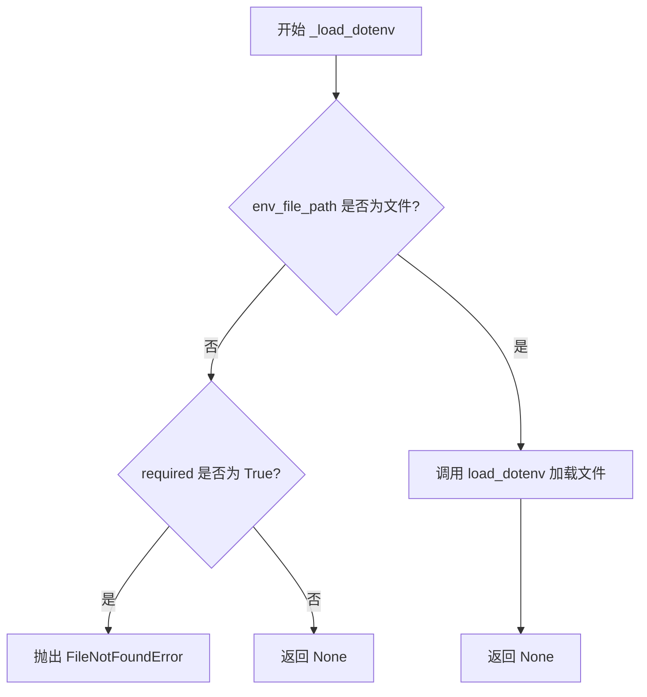
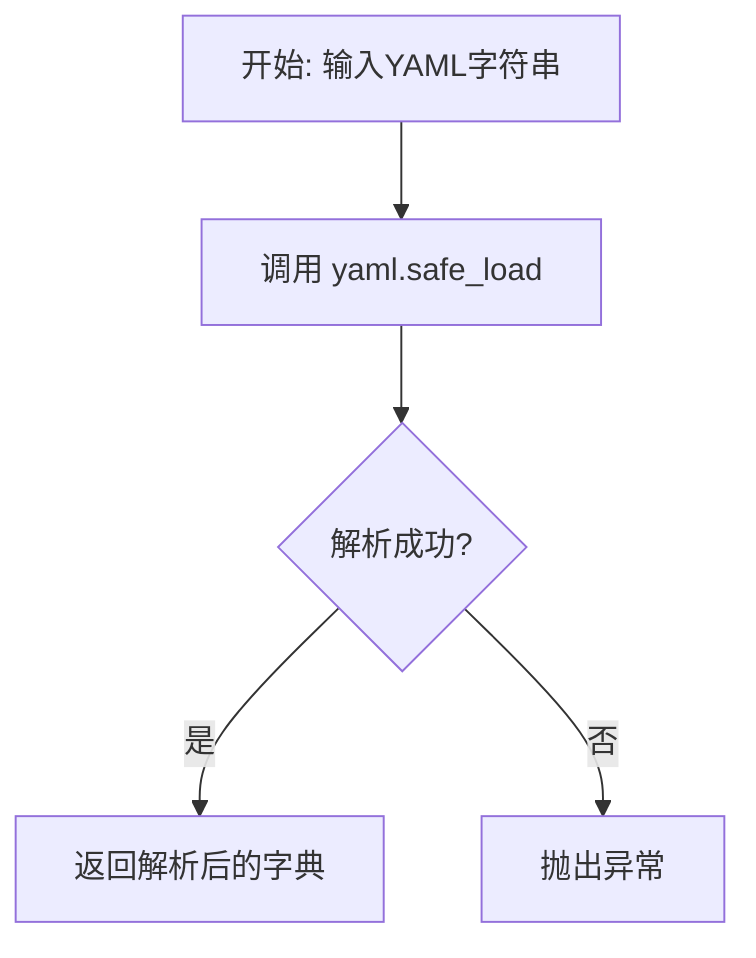
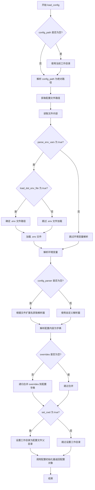
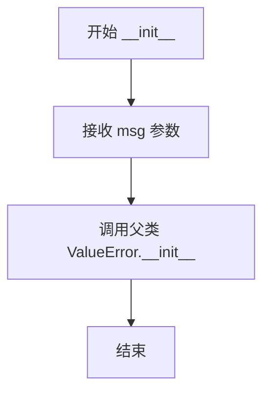

# `graphrag\packages\graphrag-common\graphrag_common\config\load_config.py` 详细设计文档

该代码实现了一个灵活的配置加载模块，支持从 YAML、JSON 等多种格式的配置文件加载配置，同时集成了环境变量解析、.env 文件加载、配置覆盖和工作目录切换等功能，能够将加载的配置数据初始化为指定的配置对象。

## 整体流程

```mermaid
graph TD
    A[开始] --> B{config_path是否为文件?}
    B -- 是 --> C[返回config_path]
    B -- 否 --> D{config_path是否为目录?}
    D -- 否 --> E[抛出FileNotFoundError]
    D -- 是 --> F[遍历默认配置文件]
    F --> G{找到settings文件?}
    G -- 是 --> C
    G -- 否 --> H[抛出FileNotFoundError]
    C --> I[读取配置文件内容]
    I --> J{parse_env_vars为True?}
    J -- 是 --> K{load_dot_env_file为True?}
    K -- 是 --> L[确定.env文件路径]
    L --> M[加载.env文件]
    K -- 否 --> N[跳过加载.env]
    J -- 否 --> O[跳过环境变量解析]
    M --> P[解析文件内容中的环境变量]
    N --> P
    O --> P
    P --> Q{config_parser是否为None?}
    Q -- 是 --> R[根据文件扩展名获取解析器]
    Q -- 否 --> S[使用自定义解析器]
    R --> T[解析配置内容]
    S --> T
    T --> U{overrides是否为None?}
    U -- 是 --> V{set_cwd为True?]
    U -- 否 --> W[合并overrides到配置数据]
    W --> V
    V -- 是 --> X[切换工作目录到配置目录]
    V -- 否 --> Y[不切换工作目录]
    X --> Z[使用config_initializer初始化配置对象]
    Y --> Z
    Z --> AA[返回配置对象]
```

## 类结构

```
ValueError (内置异常)
└── ConfigParsingError (配置解析错误)
```

## 全局变量及字段


### `_default_config_files`
    
Default configuration file names to search for when locating configuration files in a directory.

类型：`list[str]`
    


    

## 全局函数及方法


### `_get_config_file_path`

该函数用于根据传入的路径参数解析并定位配置文件。如果传入的是具体的配置文件路径，则直接返回该路径；如果传入的是目录路径，则在该目录中查找预定义的默认配置文件（`settings.yaml`, `settings.yml`, `settings.json`），找到后返回其完整路径；若均未找到或路径无效，则抛出 `FileNotFoundError`。

参数：

-  `config_dir_or_file`：`Path`，待解析的配置路径，可以是具体的配置文件路径，也可以是包含配置文件的目录路径。

返回值：`Path`，解析后的配置文件完整路径。

#### 流程图

```mermaid
flowchart TD
    A[输入: config_dir_or_file] --> B{config_dir_or_file.is_file()}
    B -- True --> C[返回: config_dir_or_file]
    B -- False --> D{config_dir_or_file.is_dir()}
    D -- False --> E[抛出 FileNotFoundError: Invalid path]
    D -- True --> F[遍历 _default_config_files]
    F --> G{config_dir_or_file / file.is_file()}
    G -- True --> C
    G -- False --> H{列表遍历完毕?}
    H -- False --> F
    H -- True --> I[抛出 FileNotFoundError: No config file found]
```

#### 带注释源码

```python
def _get_config_file_path(config_dir_or_file: Path) -> Path:
    """Resolve the config path from the given directory or file."""
    # 将输入转换为 Path 对象，确保路径操作的一致性
    config_dir_or_file = Path(config_dir_or_file)

    # 情况1：如果输入本身就是一个文件，直接返回该文件路径
    if config_dir_or_file.is_file():
        return config_dir_or_file

    # 情况2：检查路径是否为目录。如果既不是文件也不是目录，抛出错误
    if not config_dir_or_file.is_dir():
        msg = f"Invalid config path: {config_dir_or_file} is not a directory"
        raise FileNotFoundError(msg)

    # 情况3：如果输入是目录，则在目录中查找默认的配置文件
    for file in _default_config_files:
        # 拼接目录路径和文件名，检查文件是否存在
        if (config_dir_or_file / file).is_file():
            return config_dir_or_file / file

    # 情况4：遍历完默认列表仍未找到配置文件，抛出错误
    msg = f"No 'settings.[yaml|yml|json]' config file found in directory: {config_dir_or_file}"
    raise FileNotFoundError(msg)
```


### `_load_dotenv`

加载 .env 文件，如果文件不存在且 `required` 参数为 `False` 则静默返回，否则抛出 `FileNotFoundError`。

参数：

-  `env_file_path`：`Path`，.env 文件的路径
-  `required`：`bool`，是否必须存在该文件。为 `True` 时若文件不存在则抛出异常，为 `False` 时文件不存在则静默返回

返回值：`None`，无返回值

#### 流程图



#### 带注释源码

```python
def _load_dotenv(env_file_path: Path, required: bool) -> None:
    """Load the .env file if it exists.
    
    Parameters
    ----------
    env_file_path : Path
        Path to the .env file.
    required : bool
        If True, raises FileNotFoundError when the file does not exist.
        If False, silently returns when the file does not exist.
    """
    # 检查提供的路径是否为文件
    if not env_file_path.is_file():
        # 如果文件不存在且不要求必须存在，则直接返回
        if not required:
            return
        # 如果文件不存在且要求必须存在，则抛出异常
        msg = f"dot_env_path not found: {env_file_path}"
        raise FileNotFoundError(msg)
    
    # 文件存在，调用 python-dotenv 库的 load_dotenv 函数加载环境变量
    load_dotenv(env_file_path)
```


### `_parse_json`

该函数是一个简单的JSON解析包装器，接收JSON格式的字符串并将其解析为Python字典类型返回。

参数：

- `data`：`str`，需要解析的JSON字符串数据

返回值：`dict[str, Any]`，[解析后的字典对象]

#### 流程图

```mermaid
flowchart TD
    A[开始] --> B[接收JSON字符串 data]
    B --> C{调用 json.loads}
    C --> D{解析成功?}
    D -->|是| E[返回 dict[str, Any]]
    D -->|否| F[抛出 JSONDecodeError]
    E --> G[结束]
    F --> G
```

#### 带注释源码

```python
def _parse_json(data: str) -> dict[str, Any]:
    """Parse JSON data.
    
    一个简单的JSON解析包装函数，将JSON字符串解析为Python字典。
    该函数是配置加载模块的内部辅助函数，用于处理JSON格式的配置文件。
    
    Parameters
    ----------
    data : str
        JSON格式的字符串数据
    
    Returns
    -------
    dict[str, Any]
        解析后的Python字典对象
    
    Raises
    ------
    json.JSONDecodeError
        当输入的字符串不是有效的JSON格式时抛出
    """
    return json.loads(data)  # 使用标准库json模块解析JSON字符串
```


### `_parse_yaml`

该函数用于将 YAML 格式的字符串安全地解析为 Python 字典对象。

参数：

-  `data`：`str`，需要解析的 YAML 格式字符串

返回值：`dict[str, Any]`，解析后的字典对象

#### 流程图



#### 带注释源码

```python
def _parse_yaml(data: str) -> dict[str, Any]:
    """Parse YAML data.
    
    使用 PyYAML 库的 safe_load 方法将 YAML 字符串解析为 Python 字典。
    safe_load 仅解析基本 YAML 类型，避免了执行任意代码的风险。
    
    Parameters
    ----------
    data : str
        YAML 格式的字符串数据
    
    Returns
    -------
    dict[str, Any]
        解析后的字典对象
    
    Raises
    ------
    yaml.YAMLError
        当 YAML 格式不正确时抛出
    """
    return yaml.safe_load(data)
```


### `_get_parser_for_file`

根据给定的文件路径，自动选择并返回对应的配置文件解析器函数。通过匹配文件扩展名（.json、.yaml、.yml），返回相应的解析函数；若文件扩展名不支持，则抛出 ConfigParsingError 异常。

参数：

- `file_path`：`str | Path`，需要解析的配置文件路径，支持字符串或 Path 对象类型

返回值：`Callable[[str], dict[str, Any]]`，返回的配置解析函数，接收字符串类型配置内容并返回字典类型解析结果

#### 流程图

```mermaid
flowchart TD
    A[开始: 接收 file_path] --> B[将 file_path 转换为 Path 对象并解析绝对路径]
    B --> C{根据文件后缀匹配解析器}
    C -->|".json"| D[返回 _parse_json 函数]
    C -->|".yaml" 或 ".yml"| E[返回 _parse_yaml 函数]
    C -->|其他扩展名| F[抛出 ConfigParsingError 异常]
    D --> G[结束: 返回解析器函数]
    E --> G
    F --> G
```

#### 带注释源码

```python
def _get_parser_for_file(file_path: str | Path) -> Callable[[str], dict[str, Any]]:
    """Get the parser for the given file path.
    
    根据文件路径的后缀自动选择合适的配置解析器。
    
    Parameters
    ----------
    file_path : str | Path
        配置文件的路径，支持字符串或 Path 对象。
        
    Returns
    -------
    Callable[[str], dict[str, Any]]
        返回对应的解析函数：
        - .json 文件返回 _parse_json
        - .yaml 或 .yml 文件返回 _parse_yaml
        
    Raises
    ------
    ConfigParsingError
        当文件扩展名不支持时抛出异常。
    """
    # 将输入路径转换为 Path 对象并解析为绝对路径
    file_path = Path(file_path).resolve()
    
    # 使用 match-case 语句根据文件扩展名匹配解析器
    match file_path.suffix.lower():
        case ".json":
            # JSON 文件返回 JSON 解析函数
            return _parse_json
        case ".yaml" | ".yml":
            # YAML 文件返回 YAML 解析函数
            return _parse_yaml
        case _:
            # 不支持的扩展名，抛出配置解析错误
            msg = (
                f"Failed to parse, {file_path}. Unsupported file extension, "
                + f"{file_path.suffix}. Pass in a custom config_parser argument or "
                + "use one of the supported file extensions, .json, .yaml, .yml, .toml."
            )
            raise ConfigParsingError(msg)
```


### `_parse_env_variables`

解析配置文本中的环境变量，使用 `string.Template` 的 `substitute` 方法将文本中的 `${VAR_NAME}` 或 `$VAR_NAME` 格式的环境变量替换为实际值。如果环境变量未在系统环境中定义，则抛出 `ConfigParsingError` 异常。

参数：

- `text`：`str`，包含环境变量的配置文本内容

返回值：`str`，替换了所有环境变量后的文本内容

#### 流程图

```mermaid
flowchart TD
    A[开始: 接收配置文本 text] --> B{尝试使用 Template.substitute 替换环境变量}
    B -->|成功| C[返回替换后的文本]
    B -->|KeyError 异常| D[捕获 KeyError]
    D --> E[构建错误消息: Environment variable not found: {error}]
    E --> F[抛出 ConfigParsingError 异常]
    
    subgraph os.environ
        G[系统环境变量]
    end
    
    B -.-> G
```

#### 带注释源码

```python
def _parse_env_variables(text: str) -> str:
    """Parse environment variables in the configuration text.
    
    使用 string.Template 的 substitute 方法解析文本中的环境变量。
    支持两种格式: ${VAR_NAME} 和 $VAR_NAME
    
    Parameters
    ----------
    text : str
        包含环境变量的配置文本，例如 "Database: ${DB_HOST}:${DB_PORT}"
    
    Returns
    -------
    str
        替换了所有环境变量后的文本
    
    Raises
    ------
    ConfigParsingError
        如果文本中引用的环境变量在系统中未定义
    """
    try:
        # 使用 os.environ 中的环境变量进行替换
        # Template.substitute 会将 ${VAR} 或 $VAR 格式的变量替换为对应值
        return Template(text).substitute(os.environ)
    except KeyError as error:
        # 当环境变量不存在时，Template.substitute 会抛出 KeyError
        # 将其转换为更友好的 ConfigParsingError
        msg = f"Environment variable not found: {error}"
        raise ConfigParsingError(msg) from error
```


### `_recursive_merge_dicts`

递归地将源字典合并到目标字典中，就地修改目标字典而不返回新字典。

参数：

- `dest`：`dict[str, Any]`，目标字典，合并后的结果存放于此（就地修改）
- `src`：`dict[str, Any]`，源字典，提供要合并的键值对

返回值：`None`，该函数直接修改 `dest` 字典，不返回任何值

#### 流程图

```mermaid
flowchart TD
    A[开始递归合并] --> B{遍历 src 的键值对}
    B --> C{当前值是字典?}
    C -->|是| D{dest 中对应键也是字典?}
    C -->|否| H[直接赋值 dest[key] = value]
    D -->|是| E[递归调用 _recursive_merge_dicts]
    D -->|否| F[直接赋值 dest[key] = value]
    E --> B
    F --> B
    H --> G{还有更多键值对?}
    G -->|是| B
    G -->|否| I[结束]
```

#### 带注释源码

```python
def _recursive_merge_dicts(dest: dict[str, Any], src: dict[str, Any]) -> None:
    """Recursively merge two dictionaries in place.
    
    将源字典 src 的所有键值对递归地合并到目标字典 dest 中。
    如果 src 中的值是字典，则递归合并；否则直接覆盖或添加。
    合并是就地进行的，修改的是 dest 字典本身。
    
    Parameters
    ----------
    dest : dict[str, Any]
        目标字典，合并操作的结果会直接修改此字典。
    src : dict[str, Any]
        源字典，包含要合并的键值对。
    """
    # 遍历源字典中的所有键值对
    for key, value in src.items():
        # 判断当前值是否为字典类型
        if isinstance(value, dict):
            # 如果目标字典中该键对应的值也是字典
            if isinstance(dest.get(key), dict):
                # 递归调用，继续深入合并嵌套字典
                _recursive_merge_dicts(dest[key], value)
            else:
                # 目标字典中该键不是字典，直接用源字典的值覆盖
                dest[key] = value
        else:
            # 非字典类型的值，直接赋值（覆盖或新增）
            dest[key] = value
```


### `load_config`

该函数是一个通用的配置加载工具，支持从 YAML、JSON 等多种格式的配置文件加载配置，并提供环境变量解析、.env 文件加载、配置覆盖、工作目录设置等功能，最终通过配置初始化器返回配置对象。

参数：

- `config_initializer`：`Callable[..., T]`，配置构造函数，用于初始化配置对象
- `config_path`：`str | Path | None`，配置文件路径或包含配置文件的目录，默认为当前工作目录
- `overrides`：`dict[str, Any] | None`，配置覆盖字典，用于程序化覆盖配置项
- `set_cwd`：`bool`，是否将工作目录设置为配置文件所在目录，默认为 True
- `parse_env_vars`：`bool`，是否解析配置中的环境变量，默认为 True
- `load_dot_env_file`：`bool`，是否加载 .env 文件，默认为 True
- `dot_env_path`：`str | Path | None`，.env 文件路径，默认为配置文件同目录下的 .env 文件
- `config_parser`：`Callable[[str], dict[str, Any]] | None`，自定义配置解析函数，默认为 None（根据文件扩展名自动推断）
- `file_encoding`：`str`，文件编码格式，默认为 "utf-8"

返回值：`T`，配置初始化器返回的配置对象

#### 流程图



#### 带注释源码

```python
def load_config(
    config_initializer: Callable[..., T],
    config_path: str | Path | None = None,
    overrides: dict[str, Any] | None = None,
    set_cwd: bool = True,
    parse_env_vars: bool = True,
    load_dot_env_file: bool = True,
    dot_env_path: str | Path | None = None,
    config_parser: Callable[[str], dict[str, Any]] | None = None,
    file_encoding: str = "utf-8",
) -> T:
    """Load configuration from a file.

    Parameters
    ----------
    config_initializer : Callable[..., T]
        Configuration constructor/initializer.
        Should accept **kwargs to initialize the configuration,
        e.g., Config(**kwargs).
    config_path : str | Path | None, optional (default=None)
        Path to the configuration directory containing settings.[yaml|yml|json].
        Or path to a configuration file itself.
        If None, search the current working directory for
        settings.[yaml|yml|json].
    overrides : dict[str, Any] | None, optional (default=None)
        Configuration overrides.
        Useful for overriding configuration settings programmatically,
        perhaps from CLI flags.
    set_cwd : bool, optional (default=True)
        Whether to set the current working directory to the directory
        containing the configuration file. Helpful for resolving relative paths
        in the configuration file.
    parse_env_vars : bool, optional (default=True)
        Whether to parse environment variables in the configuration text.
    load_dot_env_file : bool, optional (default=True)
        Whether to load the .env file prior to parsing environment variables.
    dot_env_path : str | Path | None, optional (default=None)
        Optional .env file to load prior to parsing env variables.
        If None and load_dot_env_file is True, looks for a .env file in the
        same directory as the config file.
    config_parser : Callable[[str], dict[str, Any]] | None, optional (default=None)
        function to parse the configuration text, (str) -> dict[str, Any].
        If None, the parser is inferred from the file extension.
        Supported extensions: .json, .yaml, .yml.
    file_encoding : str, optional (default="utf-8")
        File encoding to use when reading the configuration file.

    Returns
    -------
    T
        The initialized configuration object.

    Raises
    ------
    FileNotFoundError
        - If the config file is not found.
        - If the .env file is not found when parse_env_vars is True and dot_env_path is provided.

    ConfigParsingError
        - If an environment variable is not found when parsing env variables.
        - If there was a problem merging the overrides with the configuration.
        - If parser=None and load_config was unable to determine how to parse
        the file based on the file extension.
        - If the parser fails to parse the configuration text.
    """
    # 解析并获取配置文件的绝对路径
    config_path = Path(config_path).resolve() if config_path else Path.cwd()
    # 获取实际配置文件路径（如果是目录则查找默认配置文件）
    config_path = _get_config_file_path(config_path)

    # 读取配置文件内容
    file_contents = config_path.read_text(encoding=file_encoding)

    # 如果需要解析环境变量
    if parse_env_vars:
        # 如果需要加载 .env 文件
        if load_dot_env_file:
            # 确定 .env 文件是否为必需的
            required = dot_env_path is not None
            # 确定 .env 文件路径（默认为配置文件同目录下的 .env）
            dot_env_path = (
                Path(dot_env_path) if dot_env_path else config_path.parent / ".env"
            )
            # 加载 .env 文件
            _load_dotenv(dot_env_path, required=required)
        # 解析配置内容中的环境变量
        file_contents = _parse_env_variables(file_contents)

    # 如果未提供自定义解析器，则根据文件扩展名自动获取解析器
    if config_parser is None:
        config_parser = _get_parser_for_file(config_path)

    # 使用解析器解析配置内容
    config_data: dict[str, Any] = {}
    try:
        config_data = config_parser(file_contents)
    except Exception as error:
        msg = f"Failed to parse config_path: {config_path}. Error: {error}"
        raise ConfigParsingError(msg) from error

    # 如果提供了覆盖配置，则递归合并到配置字典中
    if overrides is not None:
        try:
            _recursive_merge_dicts(config_data, overrides)
        except Exception as error:
            msg = f"Failed to merge overrides with config_path: {config_path}. Error: {error}"
            raise ConfigParsingError(msg) from error

    # 如果需要设置工作目录为配置文件所在目录
    if set_cwd:
        os.chdir(config_path.parent)

    # 使用配置初始化器创建并返回配置对象
    return config_initializer(**config_data)
```


### `ConfigParsingError.__init__`

初始化配置解析错误异常对象，用于在配置解析过程中抛出错误。

参数：

- `msg`：`str`，错误消息字符串，描述具体的配置解析错误原因

返回值：`None`，无返回值（构造函数）

#### 流程图



#### 带注释源码

```python
class ConfigParsingError(ValueError):
    """Configuration Parsing Error."""

    def __init__(self, msg: str) -> None:
        """Initialize the ConfigParsingError.
        
        Parameters
        ----------
        msg : str
            错误消息字符串，用于描述具体的配置解析错误原因
        """
        # 调用父类 ValueError 的初始化方法，传递错误消息
        # 使异常对象能够存储和显示错误信息
        super().__init__(msg)
```

## 关键组件


### ConfigParsingError

自定义异常类，用于配置解析过程中的错误处理，继承自 ValueError。

### _default_config_files

全局变量，存储默认配置文件名列表 `["settings.yaml", "settings.yml", "settings.json"]`，用于在目录中查找配置文件。

### _get_config_file_path

解析给定的目录或文件路径，返回配置文件路径。如果是目录，则搜索默认配置文件；如果是文件，直接返回该文件路径。

### _load_dotenv

加载 .env 文件，如果文件不存在且 required 为 True，则抛出 FileNotFoundError 异常。

### _parse_json

使用 json 库解析 JSON 格式的配置数据。

### _parse_yaml

使用 yaml 库安全解析 YAML 格式的配置数据。

### _get_parser_for_file

根据文件扩展名返回对应的解析函数（JSON 或 YAML），支持 .json、.yaml、.yml 格式，不支持的格式抛出 ConfigParsingError。

### _parse_env_variables

使用 string.Template 解析配置文本中的环境变量，占位符格式为 `${VAR_NAME}` 或 `$VAR_NAME`，环境变量缺失时抛出 ConfigParsingError。

### _recursive_merge_dicts

递归合并两个字典，将源字典的值合并到目标字典中，覆盖同名键，嵌套字典会递归合并。

### load_config

核心配置加载函数，支持从文件加载配置、解析环境变量、加载 .env 文件、合并配置覆盖、设置工作目录等功能，返回初始化后的配置对象。

### 设计目标与约束

- 支持多种配置文件格式（YAML、JSON）
- 支持环境变量替换和 .env 文件加载
- 支持配置覆盖机制
- 支持自定义解析器

### 错误处理与异常设计

- ConfigParsingError：配置解析错误（环境变量缺失、解析失败、合并失败）
- FileNotFoundError：配置文件或 .env 文件不存在

### 外部依赖与接口契约

- 依赖：json、os、pathlib、string.Template、typing、yaml、dotenv
- config_initializer 参数需接受 **kwargs 来初始化配置对象


## 问题及建议


### 已知问题

- **扩展名支持不一致**：代码错误信息中提到支持 `.toml` 文件，但实际上并未实现 `.toml` 解析器，只支持 `.json`、`.yaml`、`.yml` 三种格式。
- **YAML 解析返回值为 None 的处理缺失**：当 YAML 文件为空或只包含注释时，`yaml.safe_load()` 会返回 `None`，导致后续配置数据处理可能出现类型错误。
- **直接修改当前工作目录的副作用**：`set_cwd=True` 会直接调用 `os.chdir()` 修改进程的工作目录，这是一个具有全局副作用的操作，可能影响并发场景和测试稳定性。
- **配置验证机制缺失**：`config_initializer` 被直接调用但没有任何参数验证，如果配置数据缺少必要字段或类型不匹配，只会抛出通用的 TypeError，错误信息不够友好。
- **TypeVar 协变使用不当**：`T = TypeVar("T", covariant=True)` 定义了协变类型变量，但在代码中并未体现协变的实际用途，这是一个不必要的类型定义。
- **隐藏的全局状态**：通过 `os.chdir()` 修改工作目录后，如果程序异常退出，工作目录可能保持修改后的状态，给调试和问题排查带来困难。

### 优化建议

- **移除或实现 TOML 支持**：要么在错误信息中移除对 `.toml` 的提及，要么添加 `tomllib` 或第三方库支持。
- **添加空值处理**：在 `load_config` 函数中增加对 `config_parser` 返回值为 `None` 或空字典的检查和处理。
- **移除或重构 `set_cwd` 参数**：考虑使用绝对路径或上下文管理器来替代直接修改工作目录，或者提供一种可恢复的工作目录切换机制（例如使用 `tempfile` 或上下文管理器）。
- **添加配置验证层**：在调用 `config_initializer` 之前，提供可选的配置验证机制，可以接受一个验证函数或在 `config_initializer` 中定义验证逻辑。
- **修正 TypeVar 定义**：如果不需要协变，改为 `T = TypeVar("T")`，或者在确实需要协变的情况下正确使用。
- **添加类型提示完善**：为 `load_config` 函数的返回值添加更精确的类型提示，考虑使用 ` overload` 装饰器来区分不同的返回类型。
- **添加配置缓存机制**：对于需要多次加载相同配置的场景，可以考虑添加可选的缓存机制以提高性能。

## 其它


### 设计目标与约束

本配置加载模块的设计目标是提供一个灵活、统一的配置管理解决方案，支持从多种格式（YAML、JSON）的配置文件加载配置，支持环境变量解析和配置覆盖，简化应用程序的配置管理流程。核心约束包括：1）仅支持Python 3.8+版本；2）配置路径必须是有效的Path对象或字符串；3）环境变量解析使用string.Template语法，格式为${VAR_NAME}或$VAR_NAME；4）配置文件必须包含config_initializer所需的键或支持字典解包；5）当前工作目录切换仅在set_cwd=True时生效，且可能影响应用程序行为。

### 错误处理与异常设计

模块定义了ConfigParsingError异常类继承自ValueError，用于配置解析相关的错误。FileNotFoundError用于处理配置文件或.env文件不存在的情况。错误处理遵循以下原则：1）FileNotFoundError在配置文件未找到或.env文件（当required=True时）未找到时抛出；2）ConfigParsingError在环境变量未找到、配置合并失败、文件扩展名不支持、解析器解析失败时抛出；3）所有异常都包含详细的错误消息和原始异常（通过from error链接），便于调试和追踪问题根源；4）异常消息包含完整的文件路径和具体的错误原因，便于快速定位问题。

### 数据流与状态机

配置加载流程包含以下状态转换：初始状态（接收参数）→ 路径解析状态（调用_get_config_file_path） → 文件读取状态（read_text） → 环境变量处理状态（可选：加载.env文件和解析${VAR}） → 解析器选择状态（调用_get_parser_for_file） → 数据解析状态（调用config_parser） → 配置合并状态（可选：调用_recursive_merge_dicts合并overrides） → 工作目录设置状态（可选：os.chdir） → 最终状态（返回配置对象）。状态转换过程中的任何失败都会抛出相应异常，流程终止。

### 外部依赖与接口契约

本模块依赖以下外部包：1）PyYAML（yaml）用于解析YAML配置文件；2）python-dotenv（dotenv）用于加载.env文件；3）标准库json用于解析JSON配置；4）标准库os和pathlib.Path用于路径操作；5）标准库string.Template用于环境变量替换。config_initializer参数必须是一个可调用对象（类或函数），接受字典解包（**kwargs）作为参数。config_parser参数必须是签名如Callable[[str], dict[str, Any]]的可调用对象。配置文件必须能够被解析为字典结构，且键名与config_initializer的参数名称匹配。

### 性能考虑

性能优化点包括：1）配置文件仅在调用load_config时读取一次；2）_recursive_merge_dicts采用原地（in-place）合并策略，避免创建大量中间字典；3）_get_parser_for_file使用简单的后缀匹配，无额外I/O操作；4）环境变量解析使用Template.substitute一次性处理所有变量。建议在需要多次加载不同配置时缓存config_parser函数对象。对于超大配置文件，可考虑实现流式解析或分块加载。

### 安全性考虑

安全相关设计：1）配置路径通过Path.resolve()解析为绝对路径，防止符号链接攻击；2）环境变量解析仅替换已存在的环境变量，KeyError会明确报告缺失的变量名；3）文件读取使用指定的编码（默认UTF-8），防止编码混淆攻击；4）不支持从配置文件执行任意代码，仅解析JSON/YAML为字典结构；5）.env文件加载默认不强制要求（required=False），避免因缺少.env文件导致服务无法启动。敏感配置（如密码、密钥）建议通过环境变量而非配置文件传递。

### 使用示例

基础用法：定义配置类并加载。config类接受database_url和debug参数，调用load_config(Config, "config.yaml")将从settings.yaml加载配置。指定配置文件：load_config(Config, "/path/to/settings.json")直接指定配置文件路径。配置覆盖：load_config(Config, "config.yaml", overrides={"debug": True})允许通过代码动态修改配置。环境变量：配置文件中使用${DATABASE_URL}，运行前需设置DATABASE_URL环境变量或创建.env文件。禁用环境变量解析：设置parse_env_vars=False可跳过环境变量替换。禁用.env文件加载：设置load_dot_env_file=False可跳过.env文件加载。

### 配置文件格式说明

支持的配置文件格式：1）YAML格式（.yaml/.yml）：使用yaml.safe_load解析，支持嵌套字典、列表等复杂结构；2）JSON格式（.json）：使用json.loads解析。默认配置文件名搜索顺序为settings.yaml、settings.yml、settings.json。配置示例（YAML）：debug: true, database: {host: localhost, port: 5432}。环境变量引用格式：database_url: ${DATABASE_URL}或database_url: $DATABASE_URL。

### 版本历史与变更记录

初始版本v1.0.0：支持从YAML/JSON文件加载配置，支持环境变量解析（${VAR}语法），支持配置覆盖（overrides），支持设置当前工作目录，支持自定义配置解析器，支持.env文件加载，提供详细的错误信息和异常处理。

    