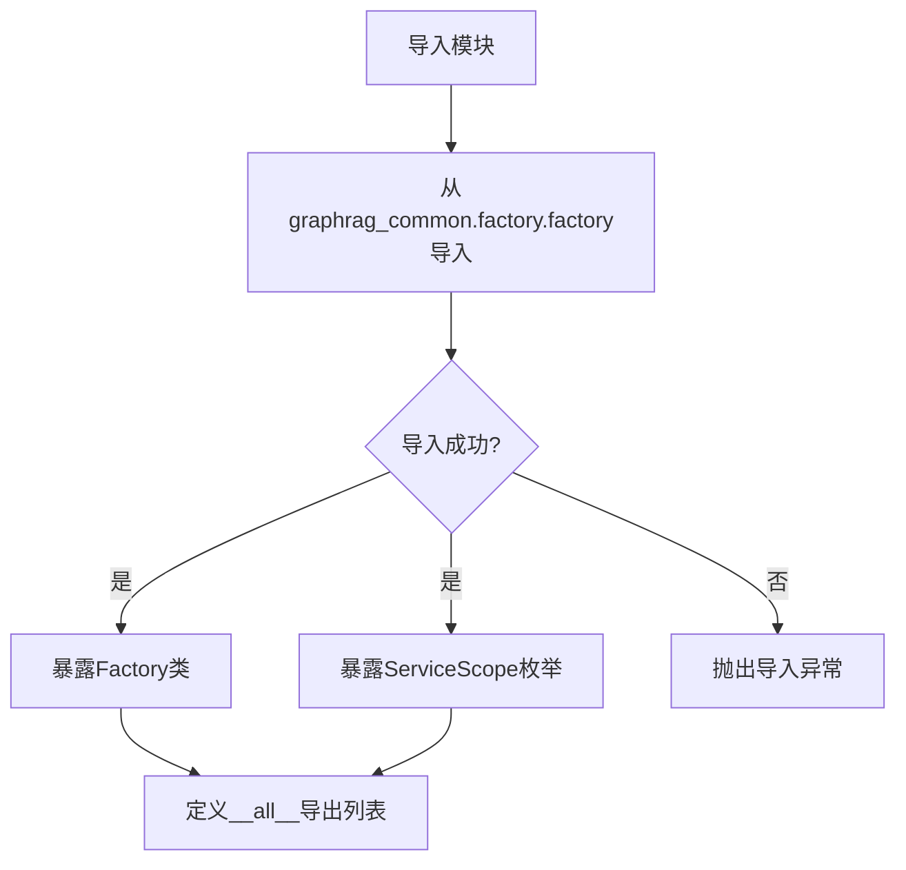

# `graphrag\packages\graphrag-common\graphrag_common\factory\__init__.py` 详细设计文档

GraphRAG工厂模块，作为graphrag_common包中Factory和ServiceScope的重新导出接口，提供服务作用域管理和依赖注入工厂功能。

## 整体流程



## 类结构

```
无类定义（仅为导入重导出模块）
Factory (从graphrag_common.factory.factory导入)
ServiceScope (从graphrag_common.factory.factory导入)
```

## 全局变量及字段


### `__all__`
    
定义模块的公共API接口，列出允许被外部导入的符号名称

类型：`List[str]`
    


    

## 全局函数及方法


## 关键组件


### 概述

该代码是GraphRAG系统的工厂模块接口，通过导入并重导出`Factory`类和`ServiceScope`枚举，为GraphRAG系统提供服务实例化和生命周期管理的统一入口。

### 文件整体运行流程

该模块作为GraphRAG系统的工厂模块入口点，在项目初始化时被导入。运行时通过`Factory`类创建各类服务实例，`ServiceScope`用于定义服务的创建和作用域策略。模块本身不包含具体实现逻辑，仅作为公共API的抽象层向外暴露。

### 类详细信息

#### Factory 类

- **字段**: 无直接字段声明（需参考graphrag_common.factory.factory中的实现）
- **方法**: 无直接方法声明（需参考graphrag_common.factory.factory中的实现）

#### ServiceScope 枚举

- **字段**: 无直接字段声明（需参考graphrag_common.factory.factory中的实现）
- **方法**: 无直接方法声明（需参考graphrag_common.factory.factory中的实现）

### 全局变量和全局函数

#### __all__

- **类型**: list
- **描述**: 定义模块的公共API接口，仅导出Factory和ServiceScope两个核心类

### 关键组件信息

#### Factory（工厂类）

GraphRAG系统的核心工厂类，负责根据配置和作用域创建各类服务实例，支持依赖注入和服务生命周期管理。

#### ServiceScope（服务作用域枚举）

定义服务实例的作用域策略，可能包含如Singleton、Transient、Scoped等作用域类型，用于控制服务的创建方式和复用策略。

### 潜在的技术债务或优化空间

1. **文档缺失**: 模块缺少详细的docstring说明Factory和ServiceScope的具体用法和参数
2. **实现隐藏**: 核心实现隐藏在graphrag_common包中，当前模块仅作为简单的重导出，缺乏业务层面的封装逻辑
3. **版本兼容性**: 依赖外部包graphrag_common的版本稳定性

### 其它项目

#### 设计目标与约束

- 提供统一的服务实例化接口
- 遵循模块化设计原则，通过工厂模式解耦服务创建与使用
- 保持API的简洁性和稳定性

#### 错误处理与异常设计

- 具体的异常处理需参考graphrag_common.factory.factory的实现
- 可能涉及的异常包括：服务创建失败、依赖解析错误、作用域配置错误等

#### 外部依赖与接口契约

- 依赖graphrag_common包中的Factory和ServiceScope实现
- 外部代码通过导入该模块使用GraphRAG系统的服务创建功能


## 问题及建议


### 已知问题

-   **过度简单的重新导出模块**：该模块仅作为 `graphrag_common.factory.factory` 的重新导出（re-export）层，没有实现任何实际功能，增加了不必要的抽象层级
-   **依赖隐藏**：调用者无法直接了解 `Factory` 和 `ServiceScope` 的实际来源和用途，增加了代码理解的复杂性
-   **缺乏文档说明**：虽然有模块级文档字符串，但缺少对 `Factory` 和 `ServiceScope` 导入原因的说明，以及它们在 GraphRAG 中的角色描述
-   **无版本控制**：缺少 `__version__` 变量，无法追踪模块版本信息
-   **缺乏错误处理**：如果 `graphrag_common` 模块不存在或导入失败，没有友好的错误提示或回退机制
-   **类型信息缺失**：没有类型提示（type hints），降低了静态分析和 IDE 支持的效果

### 优化建议

-   添加模块级类型提示和详细的文档字符串，说明为何需要此重新导出层以及 `Factory` 和 `ServiceScope` 的用途
-   考虑添加 `__version__` 变量以支持版本追踪，格式如 `__version__ = "0.1.0"`
-   若此模块确需保留，建议添加导入错误处理，例如使用 `try-except` 包装导入并提供有意义的错误信息
-   评估是否可以直接在业务代码中直接导入 `graphrag_common.factory.factory`，以减少不必要的间接层
-   如需保持此模块，建议添加 `__doc__` 或单独的文档文件来说明其在系统架构中的角色

## 其它


### 设计目标与约束

该代码作为GraphRAG系统的工厂模块入口点，其核心设计目标是提供一个统一的工厂模式实现，用于创建和管理GraphRAG系统中的各种服务和组件。设计约束包括：需要遵循MIT开源许可证要求，保持模块的简洁性和可测试性，以及确保与graphrag_common包的其他部分保持一致的代码风格。

### 错误处理与异常设计

由于该代码仅包含导入语句，错误处理主要依赖于上游模块graphrag_common.factory.factory的实现。可能的异常情况包括：ImportError（当graphrag_common包未正确安装时）、ModuleNotFoundError（当factory模块不存在时）。建议在使用时进行异常捕获，并在文档中明确标注所需的依赖版本范围。

### 外部依赖与接口契约

核心依赖为graphrag_common包中的factory模块。具体接口契约包括：Factory类需提供create_service方法用于创建服务实例，ServiceScope枚举需定义不同的服务作用域（如RequestScope、ApplicationScope等）。调用方应通过from graphrag_factory import Factory, ServiceScope的方式导入使用。

### 关键组件信息

Factory类：工厂模式的核心实现类，用于创建GraphRAG系统的各种服务组件。ServiceScope枚举：定义服务作用域的枚举类型，用于管理服务的生命周期和可见范围。

### 潜在的技术债务或优化空间

当前代码结构较为简单，主要技术债务包括：缺少对导入失败的明确错误提示和文档说明；未提供版本兼容性声明；缺少对该模块用途的详细文档注释。建议添加模块级文档字符串（docstring）来说明模块用途，并考虑添加版本信息以支持版本兼容性检查。

### 其它项目

版本兼容性：该模块需要与特定版本的graphrag_common包配合使用，建议在文档中明确标注兼容的版本范围。

模块稳定性：作为公共API接口，该模块的稳定性较高，不建议频繁修改导出接口，以保持向后兼容性。

使用示例：建议在使用文档中提供基本的Factory和ServiceScope使用示例，帮助开发者快速上手。

    