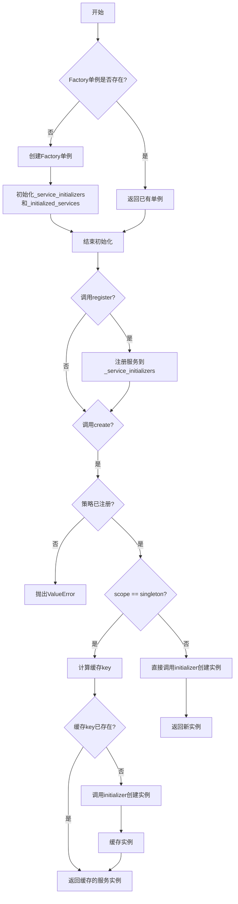
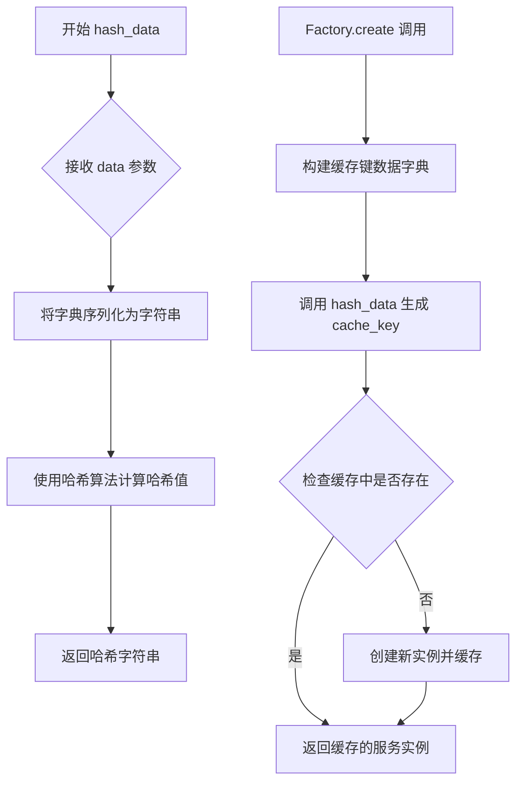
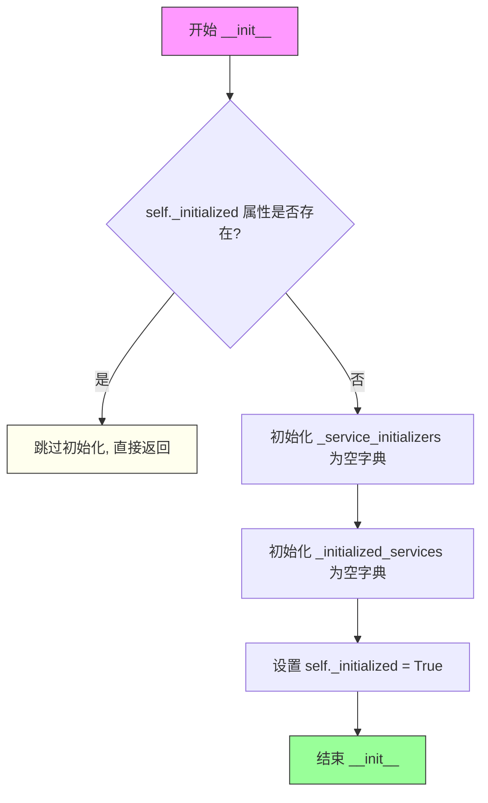
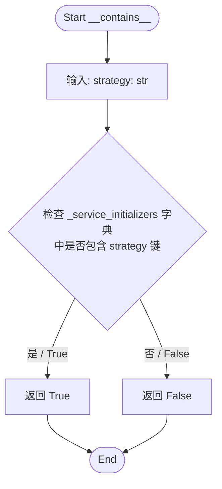
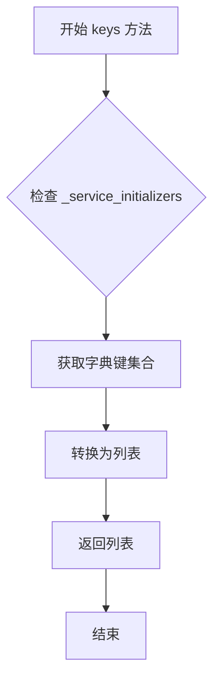
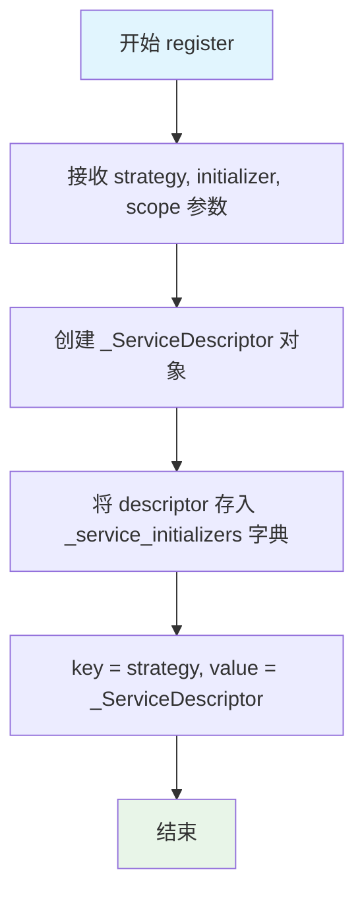
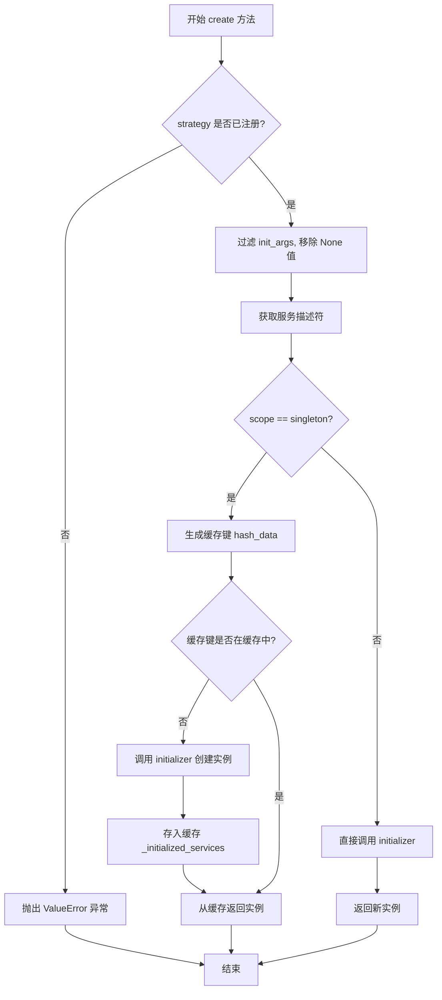

# `graphrag\packages\graphrag-common\graphrag_common\factory\factory.py` 详细设计文档

这是一个通用的工厂模式实现，提供了服务注册和创建功能，支持单例(singleton)和瞬态(transient)两种作用域。它使用泛型类型，支持策略模式，可以通过名称注册不同的服务创建器，并根据策略名称创建对应的服务实例。

## 整体流程



## 类结构

```
Factory (抽象基类)
└── _ServiceDescriptor (数据类/内部描述符)
```

## 全局变量及字段


### `T`
    
类型变量，用于协变泛型

类型：`TypeVar (covariant)`
    


### `ServiceScope`
    
字面量类型，定义服务作用域（单例或瞬态）

类型：`Literal['singleton', 'transient']`
    


### `hash_data`
    
从graphrag_common.hasher导入的哈希函数，用于生成缓存键

类型：`Callable`
    


### `Factory._instance`
    
类变量，单例实例，确保Factory类只有一个实例

类型：`ClassVar[Factory | None]`
    


### `Factory._service_initializers`
    
服务初始化器注册表，存储策略名称到服务描述符的映射

类型：`dict[str, _ServiceDescriptor[T]]`
    


### `Factory._initialized_services`
    
已初始化的单例服务缓存，基于哈希键存储实例

类型：`dict[str, T]`
    


### `Factory._initialized`
    
初始化标志，防止重复初始化工厂

类型：`bool`
    


### `_ServiceDescriptor.scope`
    
服务作用域，指定服务为singleton或transient

类型：`ServiceScope`
    


### `_ServiceDescriptor.initializer`
    
服务初始化器，用于创建服务实例的可调用对象

类型：`Callable[..., T]`
    
    

## 全局函数及方法


### `hash_data`

`hash_data` 是一个从外部模块 `graphrag_common.hasher` 导入的哈希函数，用于根据传入的字典数据生成唯一的哈希值字符串。在此代码中，它被用于为单例服务生成缓存键，以确保相同策略和相同初始化参数的组合始终返回相同的实例。

参数：

-  `data`：`dict`，包含策略名称和初始化参数的字典，结构为 `{"strategy": str, "init_args": dict | None}`

返回值：`str`，基于输入字典生成的唯一哈希字符串，用作单例服务的缓存键

#### 流程图



#### 带注释源码

```python
# 该函数从外部模块导入，未在此文件中定义
# 使用方式如下（在 Factory.create 方法中）：

# 为单例服务生成缓存键
cache_key = hash_data({
    "strategy": strategy,      # 策略名称字符串
    "init_args": init_args,   # 初始化参数字典（已过滤None值）
})

# 生成的 cache_key 用于：
# 1. 检查 _initialized_services 字典中是否已存在对应实例
# 2. 如果存在，直接返回缓存的实例
# 3. 如果不存在，创建新实例并以此 key 存储到缓存中
# 这样可以确保相同策略+相同参数组合始终返回同一个实例
```


### `Factory.__new__`

创建或返回 Factory 类的单例实例，确保在整个程序生命周期内只有一个 Factory 实例存在。

参数：

- `cls`：类型，用于表示调用 `__new__` 方法的类本身（隐式参数）
- `*args`：`Any`，可变位置参数，用于传递额外的位置参数（当前未被使用，但保留以支持未来扩展）
- `**kwargs`：`Any`，可变关键字参数，用于传递额外的关键字参数（当前未被使用，但保留以支持未来扩展）

返回值：`"Factory[T]"`，返回 Factory 类的单例实例。如果实例不存在则创建，否则返回已有实例。

#### 流程图

```mermaid
flowchart TD
    A[开始 __new__] --> B{cls._instance is None?}
    B -->|是| C[调用 super().__new__ 创建新实例]
    C --> D[将新实例赋值给 cls._instance]
    D --> E[返回 cls._instance]
    B -->|否| E
    E[结束 __new__]
```

#### 带注释源码

```python
def __new__(cls, *args: Any, **kwargs: Any) -> "Factory[T]":
    """Create a new instance of Factory if it does not exist."""
    # 检查类变量 _instance 是否已存在 Factory 实例
    if cls._instance is None:
        # 如果不存在，调用父类的 __new__ 方法创建新实例
        # 并将其存储在类变量 _instance 中，实现单例模式
        cls._instance = super().__new__(cls, *args, **kwargs)
    # 返回单例实例（无论新创建还是已存在的）
    return cls._instance
```


### `Factory.__init__`

初始化工厂实例，创建服务注册字典和服务缓存字典，确保单例工厂只初始化一次。

参数：

- `self`：`Factory[T]`，隐式参数，工厂实例本身

返回值：`None`，无返回值，仅执行初始化操作

#### 流程图



#### 带注释源码

```python
def __init__(self):
    """初始化工厂实例."""
    # 检查是否已经初始化过（实现单例模式的多次实例化保护）
    if not hasattr(self, "_initialized"):
        # 创建服务初始化器注册表：存储策略名称到服务描述符的映射
        # 键: 策略名称(str), 值: _ServiceDescriptor[T] 包含作用域和初始化器
        self._service_initializers: dict[str, _ServiceDescriptor[T]] = {}
        
        # 创建已初始化服务的缓存字典：用于存储单例模式下的服务实例
        # 键: 缓存键(由策略名和初始化参数生成的哈希值), 值: 服务实例 T
        self._initialized_services: dict[str, T] = {}
        
        # 标记已初始化，防止重复初始化
        self._initialized = True
```


### `Factory.__contains__`

该方法实现了 Python 的魔术方法 `__contains__`，用于支持 `in` 操作符。它检查传入的策略名称是否存在于工厂内部维护的服务初始化器字典中，从而判断某个策略是否已经被注册。

参数：

-  `strategy`：`str`，要检查是否已注册的策略名称。

返回值：`bool`，如果策略已注册返回 `True`，否则返回 `False`。

#### 流程图



#### 带注释源码

```python
def __contains__(self, strategy: str) -> bool:
    """Check if a strategy is registered."""
    # 直接利用字典的 in 操作符检查键是否存在
    # self._service_initializers 存储了所有已注册的策略映射
    return strategy in self._service_initializers
```


### Factory.keys

获取已注册的策略名称列表，返回所有当前已在工厂中注册的策略名称。

参数：无

返回值：`list[str]`，返回已注册策略名称的列表

#### 流程图



#### 带注释源码

```python
def keys(self) -> list[str]:
    """Get a list of registered strategy names."""
    # 从 _service_initializers 字典中获取所有已注册的策略名称键
    # 并将其转换为列表返回
    # _service_initializers 是一个 dict[str, _ServiceDescriptor[T]] 类型
    # 存储了所有通过 register 方法注册的策略
    return list(self._service_initializers.keys())
```

---

**补充说明：**

- **调用场景**：此方法通常用于查询当前工厂中已注册的所有策略名称，可用于动态选择策略或展示可用策略列表
- **数据依赖**：依赖于 `_service_initializers` 字典，该字典在 `register` 方法被调用时填充
- **性能考量**：该方法时间复杂度为 O(n)，其中 n 为已注册策略的数量
- **线程安全**：非线程安全，如果多线程同时操作可能需要外部同步机制


### `Factory.register`

注册新的服务到工厂实例中，将策略名称、初始化器和作用域关联起来并存储到内部服务描述符字典中。

参数：

- `strategy`：`str`，服务的名称/标识符，用于后续通过 `create` 方法请求创建实例
- `initializer`：`Callable[..., T]`，一个可调用对象（工厂函数或类），用于创建类型 T 的服务实例
- `scope`：`ServiceScope`（默认值：`"transient"`），服务的生命周期作用域，可选 `"singleton"`（单例）或 `"transient"`（临时）

返回值：`None`，该方法无返回值，仅执行注册逻辑

#### 流程图



#### 带注释源码

```python
def register(
    self,
    strategy: str,
    initializer: Callable[..., T],
    scope: ServiceScope = "transient",
) -> None:
    """
    Register a new service.

    Args
    ----
        strategy: str
            The name of the strategy.
        initializer: Callable[..., T]
            A callable that creates an instance of T.
        scope: ServiceScope (default: "transient")
            The scope of the service ("singleton" or "transient").
            Singleton services are cached based on their init args
            so that the same instance is returned for the same init args.
    """
    # 将策略名称作为 key，服务描述符（包含作用域和初始化器）作为 value
    # 存入内部字典 _service_initializers，供后续 create 方法查询使用
    self._service_initializers[strategy] = _ServiceDescriptor(scope, initializer)
```


### `Factory.create`

根据策略名称创建服务实例，支持单例和瞬态两种作用域。单例作用域会根据策略名和初始化参数生成缓存键，实现相同参数下的实例复用；瞬态作用域则每次调用都创建新实例。

参数：

- `self`：`Factory[T]`，Factory 类的实例本身
- `strategy`：`str`，策略名称，用于从已注册的服务中查找对应的服务描述符
- `init_args`：`dict[str, Any] | None`，可选的初始化参数字典，会过滤掉值为 None 的键，以便服务使用默认值

返回值：`T`，返回创建的服务实例，类型由泛型 T 决定

#### 流程图



#### 带注释源码

```python
def create(self, strategy: str, init_args: dict[str, Any] | None = None) -> T:
    """
    Create a service instance based on the strategy.

    Args
    ----
        strategy: str
            The name of the strategy.
        init_args: dict[str, Any] | None
            A dictionary of keyword arguments to pass to the service initializer.

    Returns
    -------
        An instance of T.

    Raises
    ------
        ValueError: If the strategy is not registered.
    """
    # 检查策略是否已在工厂中注册，未注册则抛出详细的错误信息
    if strategy not in self._service_initializers:
        msg = f"Strategy '{strategy}' is not registered. Registered strategies are: {', '.join(list(self._service_initializers.keys()))}"
        raise ValueError(msg)

    # 删除值为 None 的参数
    # 这样服务就可以使用默认值，而不会覆盖为 None
    init_args = {k: v for k, v in (init_args or {}).items() if v is not None}

    # 获取对应策略的服务描述符
    service_descriptor = self._service_initializers[strategy]
    
    # 根据作用域决定创建方式
    if service_descriptor.scope == "singleton":
        # 单例模式：使用策略名和初始化参数生成缓存键
        cache_key = hash_data({
            "strategy": strategy,
            "init_args": init_args,
        })

        # 如果缓存中没有该实例，则创建并缓存
        if cache_key not in self._initialized_services:
            self._initialized_services[cache_key] = service_descriptor.initializer(
                **init_args
            )
        # 返回缓存的实例
        return self._initialized_services[cache_key]

    # 瞬态模式：每次都创建新实例
    return service_descriptor.initializer(**(init_args or {}))
```

## 关键组件


### Factory

抽象工厂基类，提供了服务注册和创建的通用机制，支持单例和瞬态作用域，使用单例模式确保全局唯一实例，并通过哈希缓存实现单例服务的实例复用。

### _ServiceDescriptor

服务描述器数据结构，用于存储服务的Scope（作用域）和初始化器（Callable），是内部数据结构，用于封装服务的元信息。

### 服务注册机制

通过`register`方法实现，允许根据策略名称注册服务初始化器，支持指定作用域（singleton或transient），为策略模式提供基础设施。

### 服务创建机制

通过`create`方法实现，根据策略名称创建服务实例，自动过滤None值的初始化参数，单例模式下使用哈希缓存键实现实例复用。

### 单例模式实现

通过`__new__`方法实现，确保Factory类全局只有一个实例，使用类变量`_instance`保存单例引用。

### 缓存机制

使用`hash_data`函数基于策略名和初始化参数生成缓存键，实现单例服务的按需缓存和实例复用。


## 问题及建议


### 已知问题

- **单例模式线程不安全**：类变量`_instance`在多线程环境下可能导致竞态条件，`create`方法在创建singleton服务时没有同步保护
- **单例缓存无清理机制**：`_initialized_services`字典会无限增长，缺乏缓存过期或手动清理机制，可能导致内存泄漏
- **缓存键碰撞风险**：使用`hash_data`生成缓存键，依赖外部`graphrag_common.hasher`模块，若hash函数产生碰撞会导致返回错误的服务实例
- **异常处理不完善**：当`singleton`服务的`initializer`抛出异常时，已创建的缓存条目不会回滚，导致后续调用持续失败
- **单例继承问题**：`_instance`作为`ClassVar`在所有子类间共享，父类的单例会覆盖子类的实例，破坏子类独立单例的能力
- **类型安全缺陷**：`TypeVar("T", covariant=True)`使用了协变，但T并未在只读位置使用；`Callable[..., T]`过于宽松，应使用`Callable[[...], T]`
- **API设计不一致**：`keys()`返回`list`而非`KeysView`，且`__contains__`与`keys()`的组合使用不够高效

### 优化建议

- 为`create`方法添加线程锁（`threading.Lock`），或在singleton创建时使用双重检查锁定模式
- 为Factory添加缓存清理方法（如`clear_cache`）或基于LRU的缓存策略
- 使用更安全的缓存键生成方式，如JSON序列化或pickle组合唯一标识符
- 在singleton创建失败时回滚缓存，或使用哨兵值标记失败状态
- 重新设计单例模式，考虑使用元类或依赖注入容器替代当前实现
- 修正类型提示为`TypeVar("T")`和`Callable[[...], T]`
- 将`keys()`改为返回`KeysView[str]`，或直接返回`dict.keys()`视图

## 其它


### 设计目标与约束

**设计目标**：提供一种通用的服务实例创建机制，支持多种策略（服务类型）的注册和动态创建，同时通过单例和瞬态两种作用域控制实例的生命周期。

**设计约束**：
1. 泛型类型 T 支持协变（covariant）
2. 单例服务基于初始化参数哈希缓存，相同参数返回相同实例
3. 使用 `__new__` 实现单例模式，确保全局只有一个 Factory 实例
4. 依赖外部模块 `graphrag_common.hasher` 进行数据哈希

### 错误处理与异常设计

**主要异常**：
- `ValueError`：当请求创建未注册的服务策略时抛出，错误消息包含可用策略列表
- `KeyError`：当访问不存在的服务键时可能触发（由字典操作引发）

**错误处理策略**：
- `create` 方法显式检查策略是否注册，未注册时抛出带详细信息的 ValueError
- `__contains__` 和 `keys` 方法提供安全的服务查询接口
- 初始化参数过滤：移除值为 None 的键，支持可选参数的默认值

### 数据流与状态机

**数据流**：
1. 用户调用 `register(strategy, initializer, scope)` 注册服务
2. 服务描述符 `_ServiceDescriptor` 存储初始化器和作用域信息
3. 用户调用 `create(strategy, init_args)` 创建实例
4. 对于单例服务：计算哈希缓存键，检查缓存，存在则返回，否则创建并存入缓存
5. 对于瞬态服务：每次调用都执行初始化器创建新实例

**状态转换**：
- 初始状态：`_initialized_services` 为空
- 注册后：`_service_initializers` 包含策略映射
- 创建单例后：`_initialized_services` 填充缓存条目
- 瞬态服务无状态保持，每次调用独立

### 外部依赖与接口契约

**外部依赖**：
- `abc.ABC`：抽象基类
- `collections.abc.Callable`：类型提示
- `dataclasses.dataclass`：数据类装饰器
- `typing`：类型提示（Any, ClassVar, Generic, Literal, TypeVar）
- `graphrag_common.hasher.hash_data`：数据哈希函数

**接口契约**：
- `register(strategy, initializer, scope)`：strategy 需为非空字符串，initializer 需为可调用对象，scope 需为 "singleton" 或 "transient"
- `create(strategy, init_args)`：strategy 需已注册，init_args 需与 initializer 参数匹配
- 返回值类型为泛型 T

### 性能考虑与并发处理

**性能优化**：
- 单例缓存避免重复创建复杂对象
- 使用哈希快速查找缓存键
- 瞬态服务直接调用初始化器，无额外查找开销

**并发注意事项**：
- 当前实现非线程安全
- `_initialized_services` 字典在多线程环境下可能出现竞态条件
- 建议在高并发场景下使用线程锁保护缓存读写

### 安全性考虑

**安全措施**：
- 初始化参数过滤防止 None 值传递
- 策略名称验证依赖调用方保证
- 泛型类型安全由 TypeVar 保障

**潜在风险**：
- 外部传入的 initializer 可能执行任意代码
- 哈希函数依赖外部实现，需确保 `hash_data` 的可靠性

### 测试策略

**测试用例建议**：
1. 测试单例模式：多次创建相同策略和参数应返回同一实例
2. 测试瞬态模式：每次创建应返回新实例
3. 测试未注册策略：应抛出 ValueError
4. 测试空 init_args 和 None 值过滤
5. 测试 keys() 和 __contains__() 方法
6. 测试泛型类型协变

### 使用示例

```python
# 注册服务
factory = Factory()
factory.register("service_a", lambda: ServiceA(), "singleton")
factory.register("service_b", lambda x, y: ServiceB(x, y), "transient")

# 检查注册
if "service_a" in factory:
    print(factory.keys())

# 创建实例
instance_a = factory.create("service_a")
instance_b = factory.create("service_b", {"x": 1, "y": 2})
```

### 版本兼容性与配置管理

**Python 版本要求**：3.9+（支持 typing.Literal 和泛型语法）

**配置管理**：
- 作用域默认为 "transient"
- 支持通过 init_args 动态传递配置参数
- 单例缓存键由策略名和参数哈希决定

    