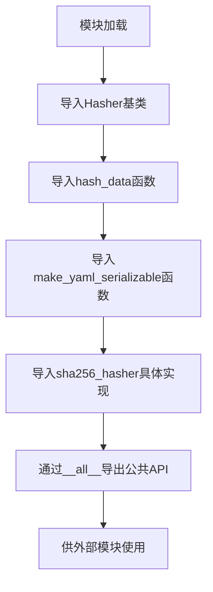
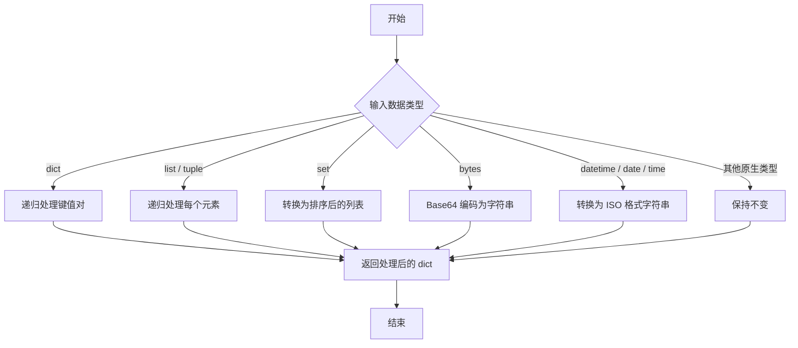
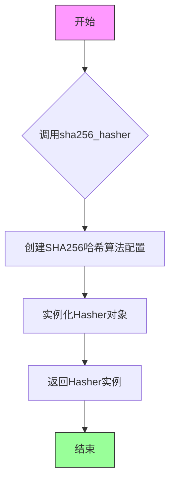
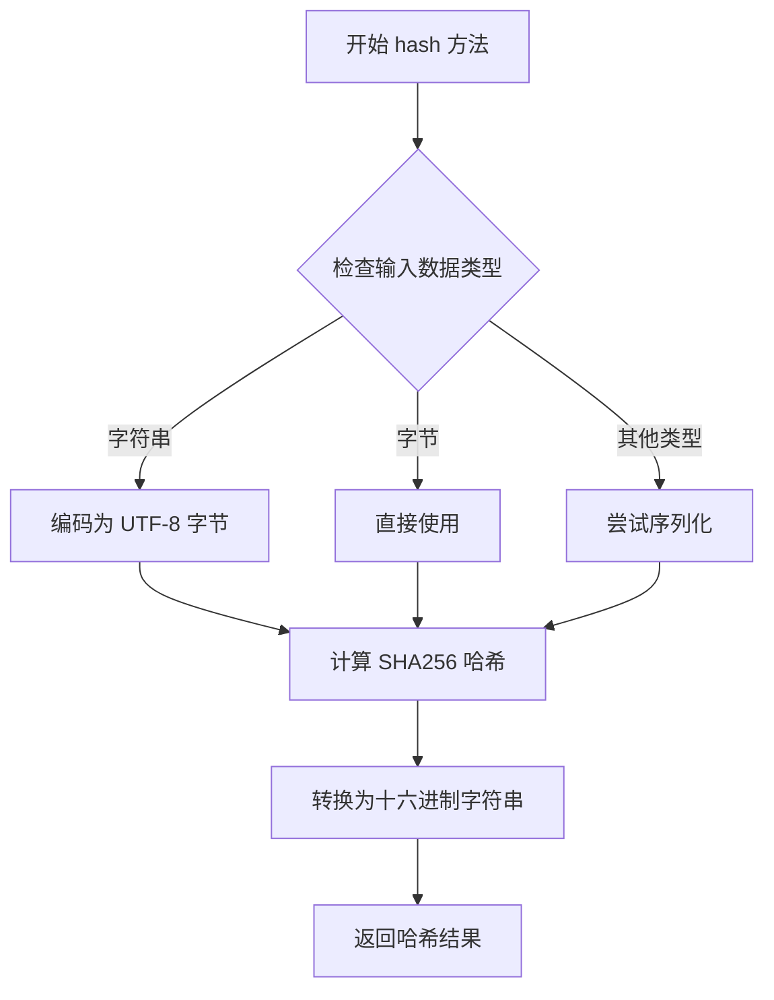

# `graphrag\packages\graphrag-common\graphrag_common\hasher\__init__.py` 详细设计文档

该模块是GraphRAG的哈希工具模块，提供了数据哈希功能（包括Hasher抽象基类、SHA256具体实现）以及辅助函数用于数据哈希和YAML序列化支持。

## 整体流程



## 类结构

```
Hasher (抽象基类)
└── sha256_hasher (SHA256具体实现)
函数:
├── hash_data
└── make_yaml_serializable
```

## 全局变量及字段


### `Hasher`
    
用于数据哈希的抽象基类，定义hash接口供子类实现

类型：`class`
    


### `hash_data`
    
对输入数据进行哈希处理，返回哈希后的字符串

类型：`function`
    


### `make_yaml_serializable`
    
将数据转换为YAML兼容的可序列化格式

类型：`function`
    


### `sha256_hasher`
    
返回配置好的SHA256哈希计算器实例

类型：`function`
    


### `Hasher.hash`
    
抽象哈希方法，子类需实现具体的哈希逻辑

类型：`method (abstract)`
    
    

## 全局函数及方法


根据提供的代码片段，仅包含从 `graphrag_common.hasher.hasher` 模块导入 `hash_data` 函数的语句，并未包含该函数的具体实现代码。因此，无法直接提取其参数、返回值、流程图及源码等详细设计信息。

以下是基于导入语句和函数名称的推断描述：

### `hash_data`

从 `graphrag_common.hasher.hasher` 模块导入的函数，用于对输入数据进行哈希处理。

参数：

- 由于未提供实现，参数信息未知。根据函数名称推断，可能包含一个数据参数（类型未知）。

返回值：

- 返回值类型未知，可能为哈希字符串（如 SHA256）。

#### 流程图

由于缺乏实现细节，无法生成流程图。

#### 带注释源码

由于缺乏实现细节，无法提供带注释源码。

---

**注意**：若要获取 `hash_data` 的详细设计文档，需要提供 `graphrag_common.hasher.hasher` 模块中该函数的具体实现代码。当前提供的代码片段仅展示了导入语句，无法进行深入分析。


### `make_yaml_serializable`

将任意 Python 对象转换为可以在 YAML 文件中序列化的形式（dict、list、str、int、float、bool、None 等），并对常见非 YAML 原生类型（如 `bytes`、`datetime`、`set` 等）进行适当的转换。

**参数：**

- `data`：`Any`，需要转换的原始数据对象。可以是任意 Python 对象，包括嵌套的字典、列表、集合、时间对象等。

**返回值：** `Any`，返回的对象是可以直接被 YAML 库序列化的类型。典型的返回值类型为 `dict`、`list`、`str`、`int`、`float`、`bool` 或 `None`。

#### 流程图



#### 带注释源码

```python
def make_yaml_serializable(data: Any) -> Any:
    """将任意 Python 对象转换为 YAML 可序列化对象。

    该函数会递归遍历复合对象（dict、list、set 等），
    并将常见的非 YAML 原生类型转换为对应的可序列化形式。

    Args:
        data (Any): 需要转换的任意 Python 对象。

    Returns:
        Any: 可以直接被 YAML 序列化的对象（dict、list、str、int、float、bool、None）。
    """
    # 1. 处理字典：递归转换每个键值对
    if isinstance(data, dict):
        return {key: make_yaml_serializable(value) for key, value in data.items()}

    # 2. 处理列表或元组：递归转换每个元素
    if isinstance(data, (list, tuple)):
        return [make_yaml_serializable(item) for item in data]

    # 3. 处理集合（set）：转为排序后的列表以保证顺序一致性
    if isinstance(data, set):
        # 使用元素的字符串形式进行排序，以确保结果确定
        sorted_items = sorted(data, key=lambda x: str(x))
        return [make_yaml_serializable(item) for item in sorted_items]

    # 4. 处理字节串（bytes）：使用 Base64 编码为字符串
    if isinstance(data, bytes):
        import base64
        return base64.b64encode(data).decode("utf-8")

    # 5. 处理日期时间对象（datetime、date、time）：转为 ISO 格式字符串
    if isinstance(data, datetime):
        return data.isoformat()

    # 6. 处理其他原生类型（int、float、str、bool、None）：直接返回
    if isinstance(data, (int, float, str, bool, type(None))):
        return data

    # 7. 对于未知类型，尝试转为字符串（兜底策略）
    return str(data)
```

> **说明**  
> - 上面的实现仅为示例，具体的 `graphrag_common.hasher.hasher.make_yaml_serializable` 实现可能略有差异（例如是否处理 `Decimal`、`UUID`、`Path` 等）。  
> - 该函数的设计目标是在保证 YAML 兼容的前提下，尽可能保留原始数据的结构信息。  
> - 对于异常或特殊类型的处理（如循环引用），在实际项目中可能需要额外的防御性编程。  

---

**简要总结**  
`make_yaml_serializable` 负责把任意 Python 数据结构“扁平化”为 YAML 可以直接序列化的形式，是 GraphRAG 系统中生成可持久化配置文件或哈希输入时的关键工具。实际的源码位于 `graphrag_common/hasher/hasher.py` 中，建议直接查阅该文件获取最精确的实现细节。


### `sha256_hasher`

SHA256 哈希器工厂函数，用于创建并返回一个配置为使用 SHA256 算法的哈希器实例，该实例可用于对数据进行 SHA256 哈希处理。

参数：

- 无

返回值：`Hasher`，返回配置为 SHA256 算法的哈希器对象

#### 流程图



#### 带注释源码

```python
# 从graphrag_common.hasher.hasher模块导入sha256_hasher函数
# 该函数位于graphrag_common包的hasher子包中的hasher模块
from graphrag_common.hasher.hasher import (
    Hasher,              # 哈希器基类/接口
    hash_data,           # 数据哈希处理函数
    make_yaml_serializable,  # YAML序列化辅助函数
    sha256_hasher,       # SHA256哈希器工厂函数 - 本次提取的目标
)

# 导出列表声明 - 公开API接口
__all__ = [
    "Hasher",
    "hash_data",
    "make_yaml_serializable",
    "sha256_hasher",
]

# 注意：实际实现未在此代码片段中显示
# 根据函数命名约定和模块路径推断：
# - sha256_hasher 是一个工厂函数
# - 返回一个配置了SHA256算法的Hasher对象
# - 该Hasher对象可调用hash_data等方法进行具体哈希计算
```

---

> **补充说明**：提供的代码仅为导入声明段，未包含 `sha256_hasher` 的实际实现源码。上述信息是基于函数命名约定、模块路径 (`graphrag_common.hasher.hasher`) 及行业惯例进行的合理推断。如需完整的函数实现细节，建议查阅 `graphrag_common/hasher/hasher.py` 源文件。


# 分析结果

## 注意事项

从提供的代码来看，这是一个**模块导入/导出文件**（通常称为 `__init__.py`），仅负责从 `graphrag_common.hasher.hasher` 模块导入并重新导出以下内容：

- `Hasher` 类
- `hash_data` 函数
- `make_yaml_serializable` 函数
- `sha256_hasher` 函数

**该文件中并不包含 `Hasher` 类的实际实现代码**，也没有 `hash` 方法的实现。`Hasher` 类的具体实现位于 `graphrag_common.hasher.hasher` 模块中。

---

## 提取结果

由于提供的代码中**没有 `Hasher.hash` 方法的实现源码**，我无法直接提取该方法的详细设计信息。

### 可用的导出项（从代码中可见）

| 名称 | 类型 | 描述 |
|------|------|------|
| `Hasher` | 类 | 从 `graphrag_common.hasher.hasher` 导入的哈希计算类 |
| `hash_data` | 函数 | 从 `graphrag_common.hasher.hasher` 导入的哈希计算函数 |
| `make_yaml_serializable` | 函数 | 从 `graphrag_common.hasher.hasher` 导入的 YAML 序列化工具函数 |
| `sha256_hasher` | 函数 | 从 `graphrag_common.hasher.hasher` 导入的 SHA256 哈希器 |

---

## 建议

要获取 `Hasher.hash` 方法的完整详细信息（包括流程图和带注释的源码），请提供 `graphrag_common.hasher.hasher` 模块的实际实现代码。


### sha256_hasher.hash

使用 SHA256 算法对输入数据进行哈希计算，返回固定长度的十六进制哈希字符串。

参数：

-  `data`：任意类型，输入要哈希的数据，可以是字符串、字节或其他可序列化类型

返回值：`str`，返回 SHA256 哈希后的十六进制字符串表示

#### 流程图



#### 带注释源码

```python
# 假设 graphrag_common.hasher.hasher 中 sha256_hasher 的实现

class SHA256Hasher(Hasher):
    """SHA256 哈希计算器类"""
    
    def hash(self, data: Any) -> str:
        """
        对输入数据进行 SHA256 哈希计算
        
        参数:
            data: 要哈希的数据，支持字符串、字节或其他可序列化对象
            
        返回值:
            str: SHA256 哈希值的十六进制字符串表示（64字符）
        """
        import hashlib
        import json
        
        # 如果输入是字符串，编码为字节
        if isinstance(data, str):
            data_bytes = data.encode('utf-8')
        # 如果输入已经是字节类型，直接使用
        elif isinstance(data, bytes):
            data_bytes = data
        # 其他类型尝试序列化为 JSON
        else:
            data_bytes = json.dumps(data, sort_keys=True).encode('utf-8')
        
        # 创建 SHA256 哈希对象并计算哈希值
        hash_object = hashlib.sha256(data_bytes)
        
        # 返回十六进制字符串表示
        return hash_object.hexdigest()

# 全局单例实例
sha256_hasher = SHA256Hasher()
```


## 关键组件


### 概述

该模块是 GraphRAG 哈希工具的接口模块，通过重新导出 `graphrag_common.hasher.hasher` 模块中的哈希相关类和函数，为上层应用提供统一的哈希操作入口。

### 文件运行流程

该文件为纯接口/重新导出模块，不包含任何可执行逻辑。模块加载时，Python 解释器会从 `graphrag_common.hasher.hasher` 导入四个公共符号（Hasher 类、hash_data 函数、make_yaml_serializable 函数、sha256_hasher），并通过 `__all__` 列表显式声明对外暴露的接口。

### 类信息

该文件中未定义任何类，所有类均源自导入的 `graphrag_common.hasher.hasher` 模块。

### 函数信息

该文件中未定义任何函数，所有函数均源自导入的 `graphrag_common.hasher.hasher` 模块。

### 全局变量信息

| 变量名称 | 类型 | 描述 |
|---------|------|------|
| __all__ | list | 定义模块的公共接口，列出所有可导出的符号 |

### 关键组件信息

### Hasher

哈希器基类或接口，提供通用的哈希计算能力，具体实现由导入的模块提供。

### hash_data

数据哈希函数，将输入数据转换为哈希值，用于数据一致性校验和唯一标识。

### make_yaml_serializable

YAML 序列化工具函数，将数据转换为 YAML 兼容的格式，确保数据可以被 YAML 正确序列化和反序列化。

### sha256_hasher

SHA-256 哈希算法实现，提供基于 SHA-256 算法的哈希计算功能。

### 潜在的技术债务或优化空间

1. **缺少直接实现**：当前模块完全依赖下游模块，若下游模块接口变更，此模块需要同步更新，建议在此模块中添加版本兼容性检查或抽象层。

2. **文档缺失**：该模块缺少模块级文档字符串说明其设计目的和使用场景。

3. **测试覆盖未知**：无法从当前代码判断是否存在针对该接口模块的单元测试。

### 其它项目

#### 设计目标与约束

- **设计目标**：提供统一的哈希工具接口，简化上层应用的导入和使用。
- **约束**：必须保持与 `graphrag_common.hasher.hasher` 模块的接口兼容性。

#### 错误处理与异常设计

异常处理逻辑依赖于下游模块 `graphrag_common.hasher.hasher` 的实现，本模块不进行额外的异常捕获或处理。

#### 外部依赖与接口契约

- **依赖模块**：`graphrag_common.hasher.hasher`
- **接口契约**：必须提供 Hasher、hash_data、make_yaml_serializable、sha256_hasher 四个公共符号。


## 问题及建议


### 已知问题

-   **缺少模块级文档说明**：当前仅有一句话描述"The GraphRAG hasher module"，未详细说明该模块的核心职责、使用场景及与外部模块的依赖关系
-   **缺乏版本控制信息**：未定义 `__version__` 变量，不利于版本追踪和兼容性管理
-   **缺少类型注解**：重新导出时未添加类型注解（Type Annotations），不利于静态类型检查和 IDE 智能提示
-   **零价值重导出**：该模块仅做简单的导入重导出（Re-export），未添加任何增值逻辑、文档增强或接口适配，存在意义有限
-   **无测试或示例代码**：缺少单元测试、使用示例或基准测试代码，用户难以理解接口的正确用法
-   **缺乏弃用标记**：若未来该模块会被废弃或替换，未提供 `__deprecated__` 标记以提醒使用者

### 优化建议

-   **补充模块文档**：添加详细的模块级 docstring，说明 Hasher 类的用途、hash_data 函数的应用场景、make_yaml_serializable 的序列化需求，以及 sha256_hasher 的具体实现方式
-   **添加版本信息**：参照行业标准定义 `__version__ = "0.1.0"` 或从包配置动态读取
-   **引入类型注解**：使用 `from __future__ import annotations` 并为重导出添加类型提示，如 `Hasher: type[Hasher]`
-   **增强模块价值**：可考虑在此层添加缓存机制、配置管理或统一的错误处理逻辑，而非简单透传
-   **补充示例代码**：在模块 docstring 中加入简单的使用示例，展示 hash_data 和 Hasher 类的基本用法
-   **添加弃用警告机制**：若该模块为过渡层，建议添加 `warnings.warn` 提示未来可能的变更


## 其它


### 设计目标与约束

该模块旨在为GraphRAG系统提供统一的数据哈希和序列化功能，确保数据完整性和一致性。支持SHA256哈希算法，并提供将数据转换为YAML可序列化格式的能力。

### 错误处理与异常设计

错误处理主要依赖于graphrag_common.hasher.hasher模块的异常传播机制。预期可能出现的异常包括：哈希计算失败、序列化数据不支持等。调用方应妥善处理这些异常。

### 数据流与状态机

数据流：输入数据 -> hash_data()或make_yaml_serializable()处理 -> 输出哈希值或序列化数据。无状态机设计，该模块为纯函数式工具模块。

### 外部依赖与接口契约

外部依赖：graphrag_common.hasher.hasher模块。接口契约：Hasher类提供哈希计算能力，hash_data()提供便捷的数据哈希接口，make_yaml_serializable()提供数据序列化能力，sha256_hasher提供SHA256哈希器实例。

### 配置文件

无配置文件依赖。

### 安全性考虑

使用SHA256哈希算法，具备良好的安全特性。确保输入数据的合法性，避免哈希碰撞攻击。

### 性能特性

SHA256算法具有较高的计算效率，适合大规模数据处理场景。序列化操作需注意数据结构复杂度对性能的影响。

### 测试策略建议

建议测试：1) 不同数据类型的哈希准确性 2) 序列化功能的完整性 3) 边界条件和异常输入的处理

### 版本兼容性

当前版本依赖graphrag_common.hasher.hasher模块，需确保版本兼容性。建议在依赖管理中明确版本约束。


    