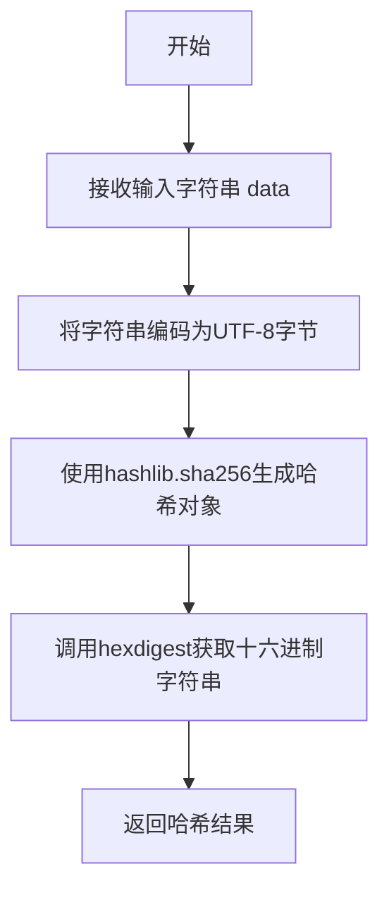
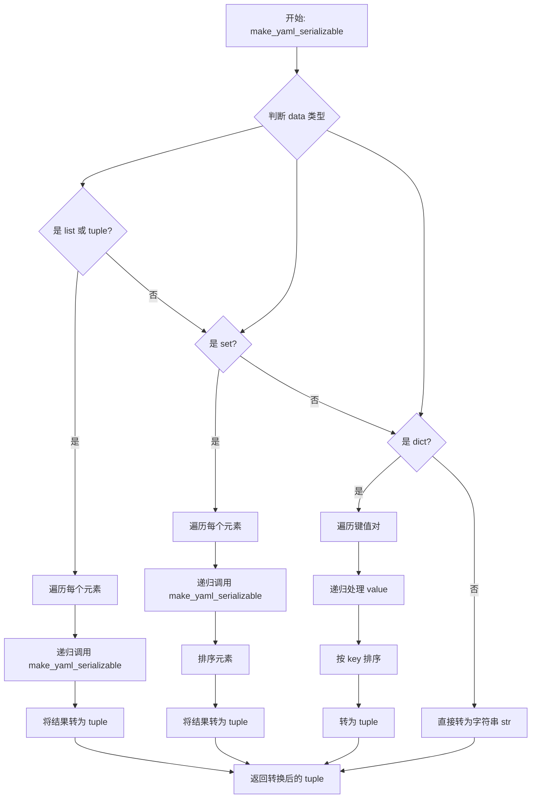
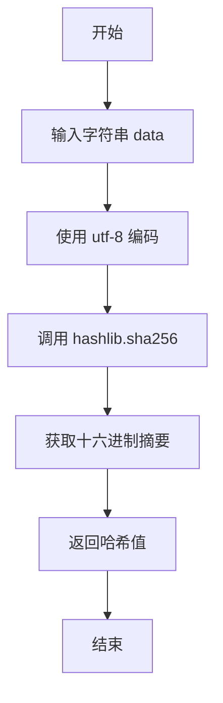
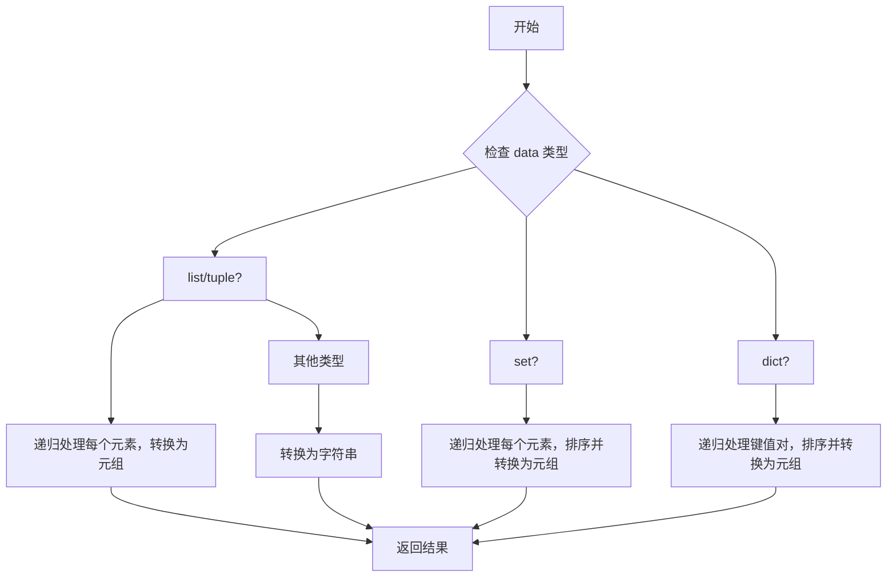
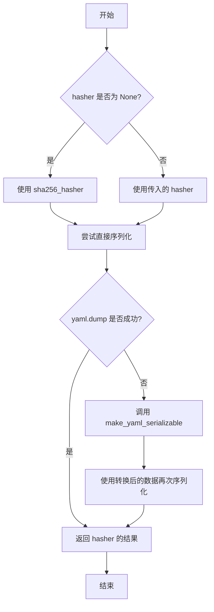

# `graphrag\packages\graphrag-common\graphrag_common\hasher\hasher.py` 详细设计文档

GraphRAG哈希工具模块，提供数据哈希功能，包括SHA-256哈希算法实现、数据序列化转换（支持复杂数据结构如类和函数），以及通用的hash_data函数用于对任意数据进行哈希处理。

## 整体流程

```mermaid
graph TD
    A[开始 hash_data] --> B{指定了hasher?}
    B -- 是 --> C[使用指定的hasher]
    B -- 否 --> D[使用默认sha256_hasher]
    C --> E[调用yaml.dump序列化数据]
    D --> E
    E --> F{序列化成功?}
    F -- 是 --> G[返回hasher(序列化结果)]
    F -- 否 --> H[调用make_yaml_serializable转换数据]
    H --> I[再次调用yaml.dump]
    I --> J[返回hasher(序列化结果)]
```

## 类结构

```
该文件为工具模块，不包含类定义
仅包含全局函数和类型别名
```

## 全局变量及字段


### `Hasher`
    
类型别名，表示一个接收字符串并返回字符串哈希值的哈希函数类型

类型：`Callable[[str], str]`
    


### `sha256_hasher`
    
使用 SHA-256 算法对输入字符串进行哈希计算的函数

类型：`Callable[[str], str]`
    


### `make_yaml_serializable`
    
将任意数据转换为 YAML 可序列化格式的递归函数，处理列表、元组、集合和字典等复杂数据结构

类型：`Callable[[Any], Any]`
    


### `hash_data`
    
对输入数据字典使用指定哈希函数进行哈希的主函数，支持通过 YAML 序列化复杂数据结构

类型：`Callable[[Any, ...], str]`
    


    

## 全局函数及方法


### `sha256_hasher`

SHA-256哈希生成函数，接收字符串输入并返回其SHA-256十六进制哈希值。

参数：

-  `data`：`str`，需要生成哈希值的输入数据

返回值：`str`，输入数据的SHA-256哈希值的十六进制字符串表示

#### 流程图



#### 带注释源码

```python
def sha256_hasher(data: str) -> str:
    """Generate a SHA-256 hash for the input data.
    
    该函数是GraphRAG项目的哈希工具模块中的核心哈希函数，
    用于将任意字符串数据转换为SHA-256哈希值。
    
    Args:
        data: str - 输入的字符串数据，需要对其进行哈希处理
        
    Returns:
        str - 输入数据的SHA-256哈希值的十六进制表示形式
    """
    # 使用hashlib库的sha256算法对输入数据进行哈希处理
    # 步骤1: 使用encode("utf-8")将字符串转换为UTF-8编码的字节序列
    # 步骤2: 将字节数据传递给sha256构造函数创建哈希对象
    # 步骤3: 调用hexdigest()方法获取十六进制格式的哈希字符串
    return hashlib.sha256(data.encode("utf-8")).hexdigest()
```

---

#### 关键组件信息

| 组件名称 | 一句话描述 |
|---------|-----------|
| `hashlib.sha256` | Python标准库提供的SHA-256哈希算法实现 |
| `hexdigest()` | 将哈希对象转换为十六进制字符串的方法 |

---

#### 潜在的技术债务或优化空间

1. **缺少输入验证**：函数未对输入数据进行空值检查或类型验证，可能在接收非字符串类型时抛出AttributeError
2. **性能优化考虑**：对于大量频繁调用场景，可考虑使用`usedforsecurity=False`参数（在非加密场景下可提升性能）
3. **缺少缓存机制**：对于重复数据的哈希计算，可引入缓存层避免重复计算

---

#### 其它项目

**设计目标与约束**：
- 作为GraphRAG项目中数据哈希的默认实现
- 遵循简洁高效的原则，提供基础的哈希功能
- 与`hash_data`函数配合使用，支持复杂数据结构的序列化哈希

**错误处理与异常设计**：
- 当输入为非字符串类型时，会抛出`AttributeError`（因为`data.encode()`需要字符串类型）
- 依赖调用方确保输入数据类型正确

**数据流与状态机**：
- 输入：任意字符串
- 处理流程：字符串→UTF-8字节→SHA-256哈希对象→十六进制字符串
- 输出：64位十六进制字符串（SHA-256固定输出长度）

**外部依赖与接口契约**：
- 依赖Python标准库`hashlib`
- 实现`Hasher`类型别名接口：`Callable[[str], str]`
- 返回值格式：64字符的小写十六进制字符串


### `make_yaml_serializable`

将任意数据转换为 YAML 可序列化格式的递归转换函数，通过将复杂数据结构（列表、元组、集合、字典）转换为有序元组，并将非字符串类型转换为字符串，确保数据能够被 YAML 正确序列化和哈希处理。

参数：

- `data`：`Any`，需要转换为 YAML 可序列化格式的任意数据

返回值：`Any`，转换后的数据，复杂类型会被转换为元组，基本类型会被转换为字符串

#### 流程图



#### 带注释源码

```python
def make_yaml_serializable(data: Any) -> Any:
    """将数据转换为 YAML 可序列化格式。
    
    递归处理复杂数据结构：
    - 列表/元组 -> 元组
    - 集合 -> 排序后的元组
    - 字典 -> 排序后的元组
    - 其他类型 -> 字符串
    
    Args:
        data: 任意类型的数据
        
    Returns:
        转换后的数据，复杂类型转为元组，基本类型转为字符串
    """
    # 处理列表和元组：递归转换每个元素，转换为不可变元组
    if isinstance(data, (list, tuple)):
        return tuple(make_yaml_serializable(item) for item in data)

    # 处理集合：排序并递归转换每个元素，确保哈希一致性
    if isinstance(data, set):
        return tuple(sorted(make_yaml_serializable(item) for item in data))

    # 处理字典：递归转换值，按键排序确保一致性
    if isinstance(data, dict):
        return tuple(
            sorted((key, make_yaml_serializable(value)) for key, value in data.items())
        )

    # 其他类型直接转换为字符串（如 int、float、bool、None 等）
    return str(data)
```


### `hash_data`

主哈希函数，用于对复杂数据结构进行哈希处理。该函数接受任意类型的数据，通过 YAML 序列化后使用指定的哈希函数生成哈希值，支持嵌套字典、列表、集合等复杂 Python 数据结构。

**参数：**

- `data`：`Any`，待哈希的输入数据，可以是任意类型，支持复杂数据结构如类、函数、字典、列表、集合等
- `hasher`：`Hasher | None`，可选的哈希函数，默认为 `sha256_hasher`，签名应为 `(data: str) -> str`

**返回值：**`str`，输入数据的哈希结果字符串

#### 流程图

```mermaid
flowchart TD
    A[开始 hash_data] --> B{hasher 参数是否为 None}
    B -->|是| C[使用默认 sha256_hasher]
    B -->|否| D[使用传入的 hasher]
    C --> E{尝试 yaml.dump 序列化}
    D --> E
    E --> F{序列化是否成功}
    F -->|成功| G[返回 hasher(yaml_string)]
    F -->|失败 TypeError| H[调用 make_yaml_serializable 预处理数据]
    H --> I[再次尝试 yaml.dump]
    I --> J[返回 hasher(yaml_string)]
```

#### 带注释源码

```python
def hash_data(data: Any, *, hasher: Hasher | None = None) -> str:
    """Hash the input data dictionary using the specified hasher function.

    Args
    ----
        data: dict[str, Any]
            The input data to be hashed.
            The input data is serialized using yaml
            to support complex data structures such as classes and functions.
        hasher: Hasher | None (default: sha256_hasher)
            The hasher function to use. (data: str) -> str

    Returns
    -------
        str
            The resulting hash of the input data.

    """
    # 如果未提供 hasher，使用默认的 sha256_hasher
    hasher = hasher or sha256_hasher
    
    try:
        # 尝试直接使用 yaml.dump 序列化数据
        # sort_keys=True 确保字典按键排序，生成一致的哈希
        return hasher(yaml.dump(data, sort_keys=True))
    except TypeError:
        # 如果序列化失败（如包含无法序列化的对象如函数或类）
        # 则先调用 make_yaml_serializable 转换为可序列化格式
        return hasher(yaml.dump(make_yaml_serializable(data), sort_keys=True))
```

#### 相关函数依赖

| 名称 | 描述 |
|------|------|
| `sha256_hasher` | 默认哈希函数，使用 SHA-256 算法生成哈希 |
| `make_yaml_serializable` | 辅助函数，将复杂数据（集合、嵌套结构）转换为 YAML 可序列化的元组格式 |
| `Hasher` | 类型别名，定义哈希函数的签名 `(str) -> str` |

## 关键组件


## 核心功能概述

该代码是 GraphRAG 的哈希模块，提供数据哈希功能，支持将任意复杂数据（字典、列表、集合、类等）序列化为 YAML 格式后使用指定哈希函数（默认 SHA-256）生成哈希值，并包含容错机制处理无法直接序列化的数据类型。

## 文件整体运行流程

1. 导入所需模块（hashlib、typing、yaml、collections.abc）
2. 定义 Hasher 类型别名
3. 定义 sha256_hasher 函数实现 SHA-256 哈希
4. 定义 make_yaml_serializable 辅助函数将数据转换为 YAML 可序列化格式
5. 定义 hash_data 主函数，内部调用 hasher 或 sha256_hasher 进行数据哈希

## 全局变量和全局函数详细信息

### 全局变量

#### Hasher

- **类型**: `Callable[[str], str]`
- **描述**: 类型别名，表示哈希函数类型，接收字符串返回字符串

## 函数详细信息

### sha256_hasher

- **参数**: 
  - data: str - 要哈希的输入数据
- **参数类型**: 
  - data: str
- **参数描述**: 需要生成 SHA-256 哈希的字符串数据
- **返回值类型**: str
- **返回值描述**: 输入数据的 SHA-256 哈希值（64位十六进制字符串）



```python
def sha256_hasher(data: str) -> str:
    """Generate a SHA-256 hash for the input data."""
    return hashlib.sha256(data.encode("utf-8")).hexdigest()
```

---

### make_yaml_serializable

- **参数**: 
  - data: Any - 任意类型的输入数据
- **参数类型**: 
  - data: Any
- **参数描述**: 需要转换为 YAML 可序列化格式的任意数据
- **返回值类型**: Any
- **返回值描述**: 转换为 YAML 可序列化格式后的数据（字典转为元组，列表/集合转为排序后的元组，原始类型转为字符串）



```python
def make_yaml_serializable(data: Any) -> Any:
    """Convert data to a YAML-serializable format."""
    if isinstance(data, (list, tuple)):
        return tuple(make_yaml_serializable(item) for item in data)

    if isinstance(data, set):
        return tuple(sorted(make_yaml_serializable(item) for item in data))

    if isinstance(data, dict):
        return tuple(
            sorted((key, make_yaml_serializable(value)) for key, value in data.items())
        )

    return str(data)
```

---

### hash_data

- **参数**: 
  - data: Any - 要哈希的输入数据
  - hasher: Hasher | None - 可选的哈希函数，默认使用 sha256_hasher
- **参数类型**: 
  - data: Any
  - hasher: Hasher | None (关键字参数)
- **参数描述**: 
  - data: 任意类型的输入数据，会被序列化为 YAML 格式
  - hasher: 哈希函数，默认为 sha256_hasher
- **返回值类型**: str
- **返回值描述**: 输入数据的哈希字符串



```python
def hash_data(data: Any, *, hasher: Hasher | None = None) -> str:
    """Hash the input data dictionary using the specified hasher function.

    Args
    ----
        data: dict[str, Any]
            The input data to be hashed.
            The input data is serialized using yaml
            to support complex data structures such as classes and functions.
        hasher: Hasher | None (default: sha256_hasher)
            The hasher function to use. (data: str) -> str

    Returns
    -------
        str
            The resulting hash of the input data.

    """
    hasher = hasher or sha256_hasher
    try:
        return hasher(yaml.dump(data, sort_keys=True))
    except TypeError:
        return hasher(yaml.dump(make_yaml_serializable(data), sort_keys=True))
```

## 关键组件信息

### 数据序列化与哈希管道

负责将任意复杂数据转换为可哈希的字符串表示，是整个模块的核心数据流。

### 容错性序列化机制

当直接序列化失败时，自动调用 make_yaml_serializable 进行类型转换，确保大多数数据类型都能被处理。

## 潜在技术债务或优化空间

1. **错误处理过于宽泛**: 捕获所有 TypeError 并使用 fallback 机制，可能隐藏潜在的真实错误，建议区分不同错误类型进行针对性处理
2. **序列化性能**: 每次调用都进行 YAML 序列化，对于高频调用场景可能存在性能瓶颈，可考虑缓存机制或使用更高效的序列化库
3. **哈希冲突风险**: 使用 sort_keys=True 进行字典排序，当数据量较大时排序操作有性能开销，且不同的排序实现可能影响哈希一致性
4. **类型转换丢失精度**: make_yaml_serializable 将所有非基本类型转为字符串，可能丢失对象的具体类型信息

## 其他项目

### 设计目标与约束

- 目标：提供通用的数据哈希功能，支持复杂数据结构
- 约束：依赖 Python 标准库（hashlib、yaml），需处理 YAML 序列化限制

### 错误处理与异常设计

- 使用 try-except 捕获 TypeError，表示数据无法直接序列化
- 静默处理异常并使用 fallback 方案，不抛出异常给上层调用者

### 数据流与状态机

输入数据 → YAML 序列化尝试 → 成功则哈希 → 返回结果
                    ↓ 失败
            make_yaml_serializable 转换 → 再次序列化 → 哈希 → 返回结果

### 外部依赖与接口契约

- hashlib: SHA-256 哈希计算
- yaml: 数据序列化
- typing: 类型注解
- collections.abc: Callable 类型


## 问题及建议


### 已知问题

-   **递归深度风险**：`make_yaml_serializable` 函数使用递归处理嵌套数据结构，对于深层嵌套的数据可能导致 Python 递归深度溢出（RecursionError）
-   **错误处理不完善**：`hash_data` 函数仅捕获 `TypeError`，其他异常（如 YAML 库异常）可能导致程序中断，且异常被静默处理，调用者无法感知错误原因
-   **性能开销**：`make_yaml_serializable` 对集合类型进行多次遍历和转换，对于已经是可序列化类型的数据也进行不必要的处理；`yaml.dump` 的 `sort_keys=True` 对大型字典有额外排序开销
-   **类型信息丢失**：`make_yaml_serializable` 将所有非基础类型转换为字符串，可能导致原始数据类型信息丢失，影响后续反序列化
-   **排序可能失败**：将 `set` 转换为 `tuple` 并排序时，如果集合元素是复杂对象（如字典），排序操作可能抛出 `TypeError`

### 优化建议

-   **增加递归深度保护**：在 `make_yaml_serializable` 中添加深度限制参数，超出阈值时抛出明确异常或采用迭代方式重写
-   **完善错误处理**：捕获更广泛的异常类型，添加日志记录或返回错误标识，使调用者能够感知和处理异常情况
-   **性能优化**：添加类型检查，跳过已经是可序列化类型的数据；考虑使用 `yaml.safe_dump` 替代默认的 `dump`；对于大型数据考虑缓存机制
-   **类型保留方案**：考虑使用 YAML 的自定义 Representer 保留类型信息，或返回包含类型元数据的哈希结果
-   **集合排序容错**：在排序前添加类型检查，对于不支持排序的元素使用稳定的哈希顺序而非排序

## 其它


### 设计目标与约束

该模块的核心设计目标是提供统一的数据哈希功能，支持复杂数据结构的序列化与哈希生成。主要约束包括：1) 仅支持可序列化为YAML的数据结构；2) 哈希函数默认为SHA-256；3) 保持输出的一致性（sort_keys=True）。

### 错误处理与异常设计

代码中的异常处理主要体现在`hash_data`函数中：当直接YAML序列化失败时，调用`make_yaml_serializable`进行数据转换后再次尝试序列化。TypeError异常被捕获并降级处理。当前设计未区分不同类型的异常，后续可考虑更细粒度的异常处理策略。

### 外部依赖与接口契约

该模块依赖以下外部包：1) `hashlib` - Python标准库，提供哈希算法实现；2) `yaml` - PyYAML库，用于数据序列化；3) `typing` - Python类型提示标准库。接口契约：Hasher类型为`(str) -> str`函数，接收字符串返回哈希值字符串；`hash_data`接收任意类型data和可选hasher函数，返回哈希字符串。

### 使用示例

```python
# 基本用法
data = {"key": "value", "number": 123}
result = hash_data(data)  # 返回SHA-256哈希值

# 使用自定义哈希函数
custom_hasher = lambda x: hashlib.md5(x.encode()).hexdigest()
result = hash_data(data, hasher=custom_hasher)

# 复杂数据结构
nested_data = {"list": [1, 2, 3], "nested": {"a": "b"}}
result = hash_data(nested_data)
```

### 性能考虑

当前实现存在两个潜在性能瓶颈：1) YAML序列化在数据量大时可能较慢；2) `make_yaml_serializable`对集合类型的递归转换可能产生额外开销。优化方向：可考虑缓存序列化结果、对大数据采用流式处理、添加可选的快速失败模式。

### 安全考虑

1) 输入数据需注意敏感信息泄露风险（哈希值可被彩虹表攻击）；2) 默认SHA-256相对安全但非加密用途；3) 建议在生产环境中对敏感数据使用加盐哈希。

### 配置说明

该模块无显式配置项。行为通过函数参数控制：`hash_data`的`hasher`参数允许注入自定义哈希函数，默认使用`sha256_hasher`。

### 测试策略建议

建议添加以下测试用例：1) 基本数据类型哈希一致性测试；2) 复杂嵌套结构（字典、列表、集合）序列化测试；3) 异常场景测试（不可序列化对象）；4) 哈希碰撞检测；5) 性能基准测试。


    