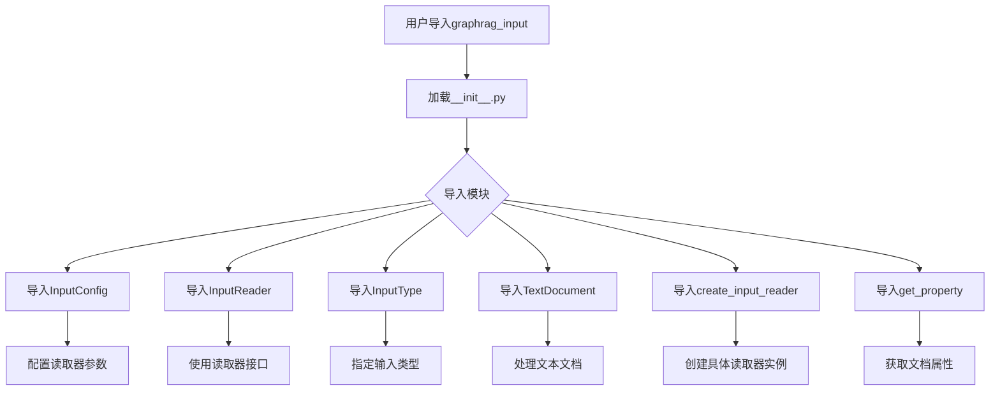
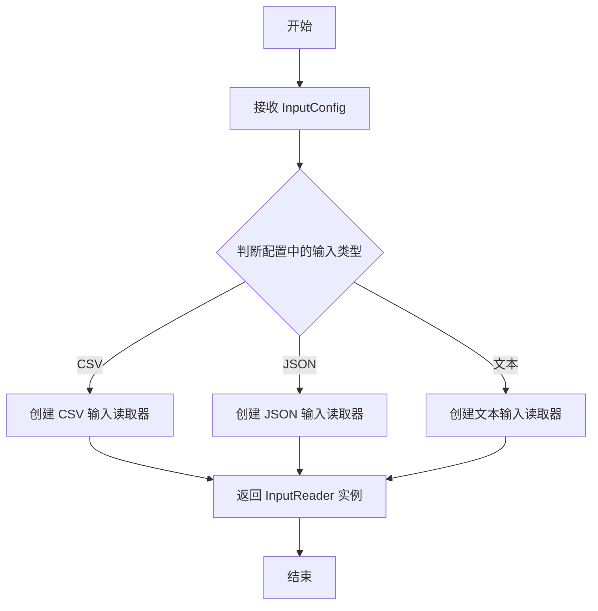

# `graphrag\packages\graphrag-input\graphrag_input\__init__.py` 详细设计文档

GraphRAG输入文档加载包的公共API入口模块，通过重导出方式暴露文档读取器配置、文档类型、文本文档模型及工厂函数等核心接口，供上层应用进行数据导入和处理。

## 整体流程



## 类结构

```
graphrag_input (包)
├── __init__.py (公共API入口)
├── get_property (属性获取工具)
├── input_config (配置类)
├── input_reader (读取器基类/接口)
├── input_reader_factory (工厂函数)
├── input_type (输入类型枚举)
└── text_document (文档模型)
```

## 全局变量及字段


### `InputConfig`
    
配置输入源和读取参数的配置类

类型：`class`
    


### `InputReader`
    
读取各种格式输入文档的抽象基类

类型：`class`
    


### `InputType`
    
定义支持的不同输入类型枚举

类型：`type/enum`
    


### `TextDocument`
    
表示加载的文本文档及其元数据的类

类型：`class`
    


### `create_input_reader`
    
工厂函数，根据输入类型创建相应的InputReader实例

类型：`function`
    


### `get_property`
    
从配置或文档中获取特定属性的工具函数

类型：`function`
    


    

## 全局函数及方法


### `create_input_reader`

该函数是 GraphRAG 输入文档加载包的工厂函数，用于根据输入配置创建相应的输入读取器实例。

参数：

- `config`：`InputConfig`，输入配置对象，包含配置参数用于创建合适的读取器

返回值：`InputReader`，返回具体的输入读取器实例，用于读取不同类型的输入文档

#### 流程图



#### 带注释源码

```python
# 从 input_reader_factory 模块导入 create_input_reader 工厂函数
# 该工厂函数负责根据配置创建相应类型的输入读取器
from graphrag_input.input_reader_factory import create_input_reader

# 其他导入...
from graphrag_input.input_config import InputConfig
from graphrag_input.input_reader import InputReader
# ...
```

---

**注意**：由于提供的代码仅为包的 `__init__.py` 文件，`create_input_reader` 的具体实现位于 `graphrag_input.input_reader_factory` 模块中。从代码结构和命名约定来看：

- 该函数接受 `InputConfig` 类型的配置参数
- 返回 `InputReader` 抽象类型的实例
- 属于工厂方法模式（Factory Pattern），用于解耦具体输入读取器的创建逻辑


# 关于 get_property 函数提取的说明

我注意到用户提供的代码是 `__init__.py` 文件，其中只是导入了 `get_property` 函数，但并没有包含该函数的具体实现代码。

```python
from graphrag_input.get_property import get_property
```

要生成完整的详细设计文档，包括：
- 参数名称、类型、描述
- 返回值类型、描述
- Mermaid 流程图
- 带注释的源码

我需要知道 `get_property` 函数的实际实现代码。

## 请问

您能否提供 `graphrag_input/get_property.py` 文件的内容，或者 `get_property` 函数的完整源代码？

一旦您提供了具体的实现代码，我将立即按照您要求的格式生成详细的设计文档，包含：

1. 函数的核心功能描述
2. 参数详细信息
3. 返回值详细信息
4. Mermaid 流程图
5. 带注释的源代码
6. 潜在的技术债务和优化建议
7. 其它相关项目信息

请提供代码后，我将为您完成完整的文档。

## 关键组件


### InputConfig

输入配置类，用于配置文档加载器的相关参数

### InputReader

输入读取器抽象基类，定义了读取输入文档的接口

### InputType

输入类型枚举，定义支持的输入数据类型（如文本、JSON、XML等）

### TextDocument

文本文档类，表示加载后的文档对象，包含文档内容和元数据

### create_input_reader

工厂函数，根据配置创建相应的输入读取器实例

### get_property

属性获取工具函数，用于从配置或文档中提取特定属性


## 问题及建议


### 已知问题

-   **缺少包级文档字符串**：整个包没有模块级别的docstring描述该包的核心功能和使用场景
-   **__all__列表不完整**：导入了`input_reader_factory`模块但未在`__all__`中导出，导致该模块的访问受限
-   **导入顺序不规范**：导入语句未按照Python标准（标准库→第三方库→本地库）进行分组
-   **缺少版本信息**：未定义`__version__`变量来标识包版本
-   **未导出的实用模块**：`input_reader_factory`被导入使用但未对外部公开，可能导致功能访问受限
-   **缺少类型提示导出**：未导出`typing`相关类型或使用`from __future__ import annotations`
-   **公开接口定义模糊**：未明确区分哪些是公开API、哪些是内部实现细节

### 优化建议

-   添加包级文档字符串，说明GraphRAG输入文档加载包的核心功能、用途和主要组件
-   完善`__all__`列表，包含所有需要公开的接口：`"InputConfig", "InputReader", "InputType", "TextDocument", "create_input_reader", "get_property", "input_reader_factory"`
-   按照标准格式组织导入顺序，增加代码可读性和可维护性
-   添加`__version__ = "x.x.x"`版本声明，便于版本管理和依赖追踪
-   考虑添加`from __future__ import annotations`以支持延迟类型注解
-   补充详细的API文档注释，说明各导出模块的职责和使用方式
-   评估是否需要将`input_reader_factory`加入公开接口，或在文档中说明其内部使用性质
-   考虑添加`__author__`、`__license__`等元数据信息


## 其它


### 设计目标与约束

该包的核心设计目标是提供一个统一的输入文档读取接口，支持多种输入类型（Text、JSON、CSV等），通过工厂模式实现输入读取器的灵活扩展。设计约束包括：依赖graphrag_input模块下的各个子模块，必须保持接口的向后兼容性。

### 错误处理与异常设计

该包本身不包含异常处理逻辑，异常处理依赖于各子模块实现。当使用create_input_reader创建读取器时，若输入类型不支持或配置错误，应由底层实现抛出相应的ValueError或NotImplementedError。建议在调用方进行异常捕获。

### 外部依赖与接口契约

该包依赖以下内部模块：
- graphrag_input.get_property：属性获取工具
- graphrag_input.input_config：输入配置类
- graphrag_input.input_reader：输入读取器基类
- graphrag_input.input_reader_factory：输入读取器工厂
- graphrag_input.input_type：输入类型枚举
- graphrag_input.text_document：文本文档类

外部依赖为Python标准库，无第三方依赖。接口契约：create_input_reader函数接受InputConfig参数，返回InputReader实例。

### 性能考虑

该文件为包入口文件，不涉及具体业务逻辑，性能开销可忽略。性能优化应关注各子模块的实现，如大数据量读取时的流式处理、缓存机制等。

### 安全性考虑

该包不直接处理用户输入验证，安全性取决于底层InputReader的实现。建议在InputConfig阶段对文件路径、文件大小等进行校验，防止路径遍历攻击和资源耗尽。

### 测试策略

该包作为导出模块，主要测试应覆盖：
- 各子模块单元测试
- create_input_reader工厂函数的集成测试
- 不同InputType下的读取器创建测试
- 边界条件测试（如空配置、非法类型等）

### 版本兼容性

该包遵循语义化版本规范。__init__.py中的导出接口应保持稳定，若有新版本变更，需在CHANGELOG中记录。建议使用版本号管理依赖关系。

### 配置管理

该包通过InputConfig类进行配置管理。配置项包括：
- 输入类型（InputType）
- 文件路径或数据源
- 编码格式
- 自定义读取参数

配置应在应用启动阶段完成初始化，避免运行时动态修改。

    