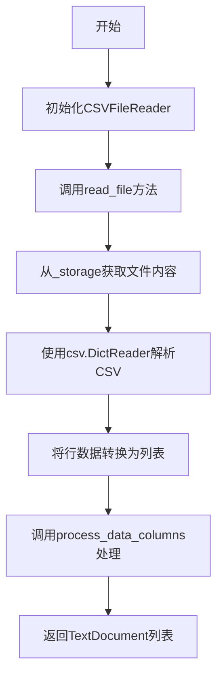
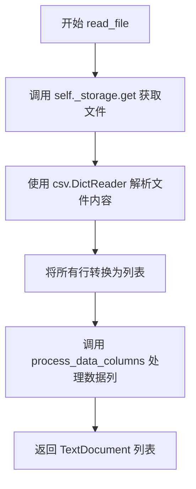
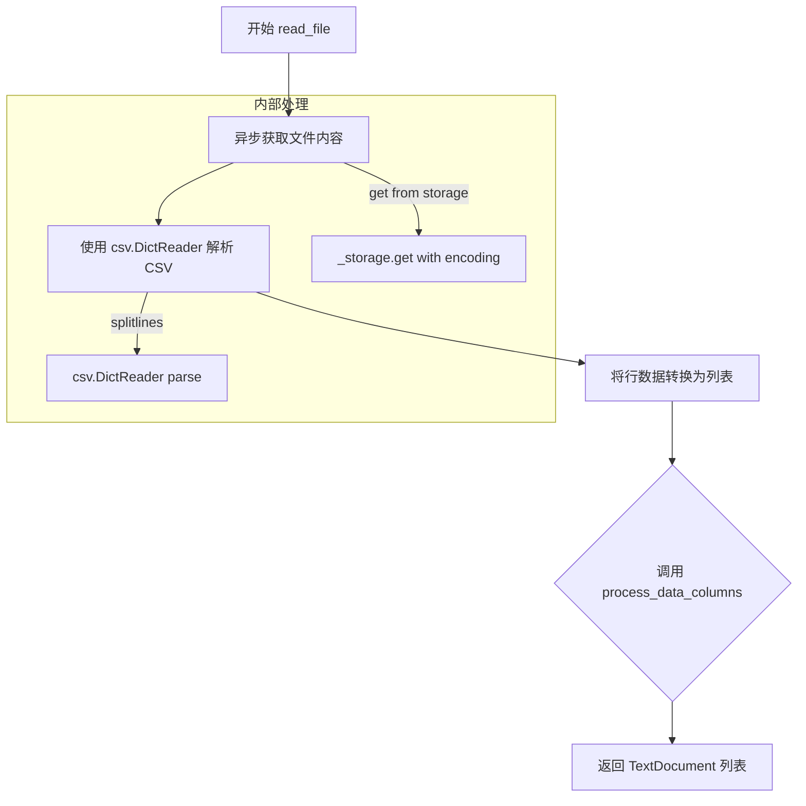
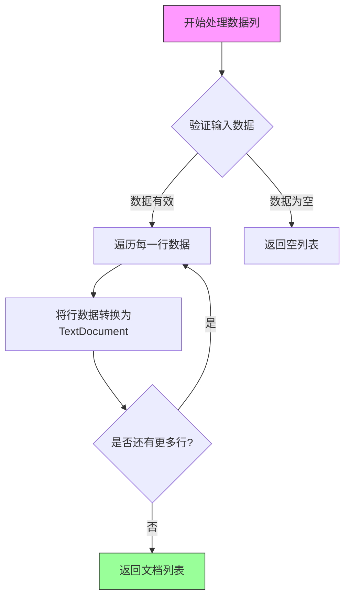

# `graphrag\packages\graphrag-input\graphrag_input\csv.py` 详细设计文档

一个CSV文件读取器实现类，继承自StructuredFileReader，用于异步读取CSV文件并将其转换为TextDocument列表。

## 整体流程



## 类结构

```
StructuredFileReader (抽象基类)
└── CSVFileReader (CSV文件读取实现类)
```

## 全局变量及字段


### `logger`
    
模块级日志记录器，用于记录类运行时的日志信息

类型：`logging.Logger`
    


### `csv.field_size_limit`
    
全局CSV字段大小限制设置，防止CSV字段值过大导致解析错误

类型：`int`
    


### `CSVFileReader.file_pattern`
    
文件匹配模式，默认为.*\.csv$，用于过滤需要读取的CSV文件

类型：`str | None`
    


### `CSVFileReader._encoding`
    
文件编码格式(继承自父类)，用于指定读取文件时使用的字符编码

类型：`str`
    


### `CSVFileReader._storage`
    
文件存储接口(继承自父类)，用于异步读取文件内容

类型：`Storage`
    
    

## 全局函数及方法


### `CSVFileReader.__init__`

构造函数，初始化CSV文件读取器的文件模式，默认匹配CSV格式文件，并继承父类的初始化逻辑。

参数：

- `file_pattern`：`str | None`，可选参数，用于匹配要读取的文件路径的正则表达式模式，默认为".*\\.csv$"
- `**kwargs`：可变关键字参数，传递给父类StructuredFileReader的额外参数

返回值：`None`，该方法不返回值，直接初始化对象状态

#### 流程图

```mermaid
flowchart TD
    A[开始 __init__] --> B{file_pattern是否为None}
    B -->|是| C[使用默认正则 ".*\\.csv$"]
    B -->|否| D[使用传入的file_pattern]
    C --> E[调用父类__init__]
    D --> E
    E --> F[完成初始化]
    
    style A fill:#f9f,color:#333
    style F fill:#9f9,color:#333
```

#### 带注释源码

```python
def __init__(self, file_pattern: str | None = None, **kwargs):
    """初始化CSVFileReader实例。

    Args:
        file_pattern: 可选的文件路径匹配模式，正则表达式格式。
                     当为None时使用默认值".*\\.csv$"匹配所有CSV文件。
        **kwargs: 传递给父类StructuredFileReader的其他关键字参数。

    Returns:
        None: 此方法不返回值，直接初始化对象属性。

    Example:
        # 使用默认CSV模式
        reader = CSVFileReader()

        # 使用自定义文件模式
        reader = CSVFileReader(file_pattern=".*\\.tsv$")

        # 传递额外参数给父类
        reader = CSVFileReader(file_pattern=".*\\.csv$", encoding="utf-8")
    """
    super().__init__(
        file_pattern=file_pattern if file_pattern is not None else ".*\\.csv$",
        **kwargs,
    )
```


### `CSVFileReader.read_file`

异步读取CSV文件并将其转换为`TextDocument`对象列表。该方法从存储中获取CSV文件，使用`csv.DictReader`解析每一行数据，然后调用`process_data_columns`方法将行数据转换为文档对象。

参数：

- `path`：`str`，要读取的CSV文件的路径

返回值：`list[TextDocument]`，CSV文件中每一行对应的`TextDocument`对象列表

#### 流程图



#### 带注释源码

```python
async def read_file(self, path: str) -> list[TextDocument]:
    """Read a csv file into a list of documents.

    Args:
        - path - The path to read the file from.

    Returns
    -------
        - output - list with a TextDocument for each row in the file.
    """
    # 从存储中异步获取文件内容，使用配置的编码格式
    file = await self._storage.get(path, encoding=self._encoding)

    # 使用 csv.DictReader 按行读取 CSV 文件，每行作为一个字典
    reader = csv.DictReader(file.splitlines())
    
    # 将 reader 转换为行列表
    rows = list(reader)
    
    # 调用父类方法处理数据列，转换为 TextDocument 对象列表并返回
    return await self.process_data_columns(rows, path)
```


### `CSVFileReader.read_file`

读取 CSV 文件并将其内容转换为 TextDocument 对象列表

参数：

- `path`：`str`，要读取的 CSV 文件路径

返回值：`list[TextDocument]` ，返回包含文件中每行数据的 TextDocument 列表

#### 流程图



#### 带注释源码

```python
async def read_file(self, path: str) -> list[TextDocument]:
    """Read a csv file into a list of documents.

    Args:
        - path - The path to read the file from.

    Returns
    -------
        - output - list with a TextDocument for each row in the file.
    """
    # 从存储中异步读取文件内容，使用配置的编码方式
    file = await self._storage.get(path, encoding=self._encoding)

    # 使用 csv.DictReader 解析文件内容（按行分割）
    # DictReader 会将每行转换为字典，键为 CSV 列名
    reader = csv.DictReader(file.splitlines())
    
    # 将reader转换为列表（加载所有行到内存）
    rows = list(reader)
    
    # 调用父类方法处理数据列，转换为 TextDocument 列表
    # 该方法负责将每行数据包装成 TextDocument 对象
    return await self.process_data_columns(rows, path)
```


### `StructuredFileReader.process_data_columns`

处理数据列的抽象方法，由子类实现，用于将原始行数据转换为 TextDocument 列表。

参数：

- `rows`：`list[dict]`，CSV 文件解析后的行数据列表，每行是一个字典（键为列名，值为单元格内容）
- `path`：`str`，被读取的 CSV 文件路径

返回值：`list[TextDocument]`，转换后的文档列表

#### 流程图



#### 带注释源码

```python
async def process_data_columns(self, rows: list[dict], path: str) -> list[TextDocument]:
    """处理CSV数据列，将行数据转换为TextDocument列表。
    
    这是一个抽象方法，由子类（如CSVFileReader）实现。
    子类需要将原始的行数据转换为结构化的文档对象。
    
    Args:
        rows: CSV文件解析后的行数据列表，每个元素是一个字典，
              键为列名，值为该列的单元格内容
        path: 被读取的CSV文件的路径，用于文档标识和追踪
    
    Returns:
        list[TextDocument]: 转换后的文档列表，每个TextDocument
                           代表CSV中的一行数据
    
    Note:
        - 该方法为抽象方法，子类必须实现具体逻辑
        - 实现时应处理编码转换、列映射、文档元数据设置等
        - 应处理可能的异常情况，如空行、格式错误等
    """
    raise NotImplementedError("Subclasses must implement process_data_columns method")
```

## 关键组件


### CSVFileReader 类

继承自 StructuredFileReader 的 CSV 文件读取器实现，用于将 CSV 文件内容转换为 TextDocument 列表。

### 异步文件读取 (read_file 方法)

异步读取指定路径的 CSV 文件，使用 csv.DictReader 解析行数据，然后调用 process_data_columns 处理数据列。

### 字段大小限制处理

通过 csv.field_size_limit 设置 CSV 字段大小限制，优先使用 sys.maxsize，若溢出则设置为 100MB。

### CSV 解析依赖

使用 Python 标准库 csv 模块的 DictReader 进行 CSV 解析，将每行转换为字典格式。

### 存储抽象 (_storage)

通过父类 StructuredFileReader 继承的异步存储接口，用于从指定路径获取文件内容。

### 编码支持 (_encoding)

从父类继承的编码参数，用于指定文件读取时的字符编码方式。


## 问题及建议


### 已知问题

-   **异常处理不完善**：csv.field_size_limit设置失败时使用硬编码值（100MB），但未记录警告日志，可能导致后续排查困难
-   **内存效率低下**：使用`file.splitlines()`将整个文件加载到内存后再处理，对于大型CSV文件可能导致内存溢出或性能问题
-   **缺乏输入验证**：未对path参数进行有效性检查（如空路径、路径不存在等），可能引发底层异常
-   **编码处理风险**：虽然接收encoding参数，但在调用`self._storage.get`时直接使用，如果存储后端不支持指定编码可能失败
-   **未处理空文件场景**：当CSV文件为空或仅含表头时，rows为空列表，process_data_columns的行为未定义
-   **同步操作在异步上下文中**：csv.DictReader是同步操作，在异步方法中直接调用可能阻塞事件循环
-   **缺少资源管理**：文件读取后未显式关闭资源，依赖垃圾回收

### 优化建议

-   **增加日志记录**：在csv.field_size_limit异常处理中添加warning级别日志，记录降级原因和降级后的值
-   **支持流式处理**：考虑使用生成器模式或流式读取替代splitlines()，减少内存占用
-   **添加输入验证**：在方法开始时验证path参数非空、符合预期格式，可考虑添加文件存在性检查
-   **完善异常处理**：为常见异常（如UnicodeDecodeError、FileNotFoundError）添加具体捕获和处理逻辑
-   **空文件处理**：明确空文件或仅表头文件的处理策略，返回空列表或抛出明确异常
-   **资源清理**：使用async with或try-finally确保资源正确释放
-   **考虑大文件优化**：对于超大型CSV，可考虑分批处理或使用pandas等支持分块读取的库


## 其它


### 设计目标与约束

该模块旨在提供一种高效、异步的方式读取CSV文件，并将每行数据转换为TextDocument对象，支持自定义文件模式匹配和编码格式。设计约束包括：仅支持UTF-8等常见编码、依赖父类StructuredFileReader的存储抽象、不处理大型CSV文件的流式读取。

### 错误处理与异常设计

代码中通过try-except捕获OverflowError来设置csv.field_size_limit，但read_file方法缺乏显式的异常处理。当文件不存在、编码错误或CSV格式异常时，异常将向上传播至调用者。建议在read_file中添加try-except块处理FileNotFoundError、UnicodeDecodeError、csv.Error等常见异常，并返回空列表或抛出自定义异常。

### 数据流与状态机

数据流为：调用方传入文件路径 → _storage.get()异步读取文件内容 → csv.DictReader解析CSV行 → process_data_columns()转换为TextDocument列表 → 返回结果。无复杂状态机，仅包含读取中、读取完成两种状态。

### 外部依赖与接口契约

主要依赖包括：graphrag_input.structured_file_reader.StructuredFileReader（父类，提供_storage和_encoding）、graphrag_input.text_document.TextDocument（文档模型）、csv标准库。接口契约：read_file(path: str) -> list[TextDocument]，调用方需确保path指向有效CSV文件且具有读取权限。

### 性能考虑

当前实现将整个文件内容加载到内存后splitlines()再传给DictReader，对于大文件可能导致内存占用过高。建议改进：1)流式读取避免一次性加载；2)考虑使用pandas的chunksize参数分块处理；3)当前为同步解析CSV，可考虑使用多进程加速。

### 资源管理

_storage使用异步上下文管理器，代码未显式关闭文件句柄（依赖父类管理）。建议添加finally块确保资源释放，或使用async with语法明确生命周期。

### 配置参数说明

file_pattern: str | None = None，默认值为".*\\.csv$"，支持正则表达式匹配文件路径。**kwargs传递给父类，可包含encoding、storage等参数。encoding继承自父类，默认UTF-8。

### 使用示例

```python
reader = CSVFileReader(file_pattern=".*\\.csv$")
documents = await reader.read_file("/path/to/data.csv")
for doc in documents:
    print(doc.content)
```

### 测试策略建议

1. 单元测试：测试正常CSV读取、空CSV文件、含特殊字符的CSV；2. 边界测试：大文件（>100MB）、空路径、无权限文件；3. 集成测试：配合不同Storage实现（本地文件、Azure Blob等）验证兼容性。

### 安全性考虑

1. 文件路径未做安全校验，可能存在路径遍历攻击风险；2. CSV注入风险：若内容直接用于数据库查询或动态生成Excel，需对公式注入进行转义处理；3. 敏感信息泄露：日志中可能记录文件路径，建议脱敏处理。

    