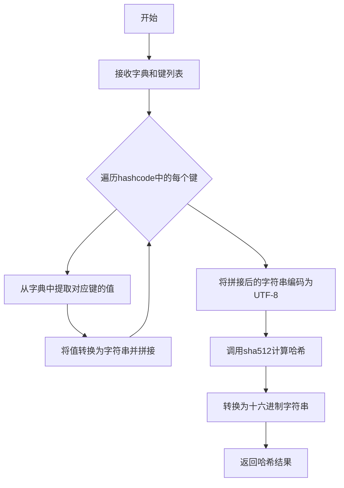
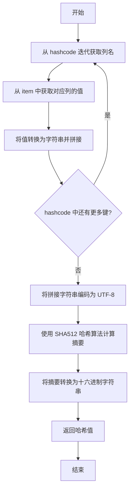

# `graphrag\packages\graphrag-input\graphrag_input\hashing.py` 详细设计文档

一个哈希工具模块，提供基于SHA512算法的字典数据哈希功能，通过提取字典中指定键的值并进行字符串拼接后计算SHA512哈希，返回十六进制格式的哈希字符串。

## 整体流程



## 类结构

```
该文件为纯工具模块，无类定义
```

## 全局变量及字段


### `gen_sha512_hash`
    
根据指定的键从字典中提取值并生成SHA512哈希值

类型：`function`
    


    

## 全局函数及方法


### `gen_sha512_hash`

生成给定字典中指定键对应的值的 SHA512 哈希值。

参数：

- `item`：`dict[str, Any]`，包含要哈希的值的字典
- `hashcode`：`Iterable[str]`，要包含在哈希中的键集合

返回值：`str`，SHA512 哈希的十六进制字符串

#### 流程图



#### 带注释源码

```python
def gen_sha512_hash(item: dict[str, Any], hashcode: Iterable[str]) -> str:
    """Generate a SHA512 hash.

    Parameters
    ----------
    item : dict[str, Any]
        The dictionary containing values to hash.
    hashcode : Iterable[str]
        The keys to include in the hash.

    Returns
    -------
    str
        The SHA512 hash as a hexadecimal string.
    """
    # 步骤1: 从 item 字典中提取 hashcode 指定的键对应的值
    # 步骤2: 将每个值转换为字符串并拼接在一起
    # 注意: 如果 item 中不存在 hashcode 中的键，会抛出 KeyError
    hashed = "".join([str(item[column]) for column in hashcode])
    
    # 步骤3: 将拼接的字符串编码为 UTF-8 字节
    # 步骤4: 使用 SHA512 算法计算哈希值
    # usedforsecurity=False 表示不用于安全目的（如密钥派生），可在某些环境中优化性能
    # 步骤5: 将哈希值转换为十六进制字符串格式返回
    return f"{sha512(hashed.encode('utf-8'), usedforsecurity=False).hexdigest()}"
```

## 关键组件


### gen_sha512_hash 函数

生成SHA512哈希值的核心函数，通过将字典中指定键对应的值连接后进行SHA512哈希运算，返回十六进制字符串形式的哈希值。

### sha512 哈希算法

使用hashlib模块的sha512函数进行哈希计算，usedforsecurity=False参数表明该哈希不用于安全敏感场景。

### 参数字典处理机制

通过字典推导式和列表推导式将指定键的值转换为字符串并连接，形成待哈希的原始字符串。

### UTF-8 编码处理

在哈希前将字符串编码为UTF-8格式，确保跨平台的字符串处理一致性。


## 问题及建议


### 已知问题

- **缺少输入验证**：当 `hashcode` 中包含的键在 `item` 字典中不存在时，会抛出 `KeyError` 异常，缺乏友好的错误提示。
- **未处理空输入**：当 `item` 为空字典或 `hashcode` 为空时，会对空字符串进行哈希，产生固定结果，可能导致哈希碰撞风险。
- **None 值处理不当**：如果 `item` 中的值为 `None`，`str(None)` 会返回字符串 `"None"`，可能与业务预期不符。
- **缺少类型检查**：参数类型声明与实际使用存在潜在不一致，如 `Iterable[str]` 未明确排除非字符串类型。

### 优化建议

- **添加输入验证逻辑**：在函数开头检查 `hashcode` 中的键是否都存在于 `item` 中，对不存在的键抛出明确的 `ValueError` 异常。
- **显式处理空值情况**：对 `None` 值进行特殊处理或提供参数控制行为，并添加空输入的边界情况处理。
- **优化字符串拼接**：当前使用列表推导式创建中间列表，可考虑直接使用生成器表达式以减少内存开销。
- **增强文档说明**：补充异常情况的说明，包括可能抛出的异常类型。
- **考虑性能优化**：对于频繁调用相同输入的场景，可添加缓存机制（如 `lru_cache`）避免重复计算。

## 其它


### 设计目标与约束

本模块的核心目标是为字典数据提供确定性的SHA512哈希生成功能，支持指定键进行选择性哈希。设计约束包括：仅支持Python 3.9+，依赖标准库hashlib，不涉及安全加密用途（usedforsecurity=False），输入必须是可JSON序列化的字典结构。

### 错误处理与异常设计

当访问item中不存在的hashcode键时，会抛出KeyError异常。空hashcode参数会导致返回空字符串的哈希值。当前设计采用显式错误传播策略，调用方需自行处理KeyError。若item值为None或不可转换为字符串，会抛出TypeError。

### 外部依赖与接口契约

本模块无外部依赖，仅使用Python标准库。接口契约如下：item参数必须为dict类型且包含hashcode中指定的所有键；hashcode参数必须为可迭代字符串集合；返回值始终为64字符的十六进制字符串。

### 性能考虑与资源使用

哈希计算的时间复杂度为O(n)，其中n为所有字段值拼接后的总长度。空间复杂度为O(m)，m为拼接字符串长度。适合中等规模数据集的哈希处理，大规模数据流式处理需考虑分块策略。

### 安全性考虑

使用usedforsecurity=False标志，明确表示此哈希不用于安全敏感场景（如密码存储）。建议在文档中明确标注此函数仅用于数据去重、完整性校验等非安全用途。

### 兼容性说明

本模块兼容Python 3.9+版本（支持dict[str, Any]类型注解）。与Python 3.6-3.8兼容需移除类型注解或使用typing模块。依赖的hashlib.sha512在所有Python版本中均可用。

### 使用示例与测试场景

基础用法：hash_value = gen_sha512_hash({"name": "test", "version": "1"}, ["name"])。多键哈希：gen_sha512_hash({"a": "1", "b": "2"}, ["a", "b"])。空键测试：gen_sha512_hash({"x": 1}, [])应返回固定空字符串哈希值。性能测试：使用10000+条记录的字典列表进行批量哈希压测。

    