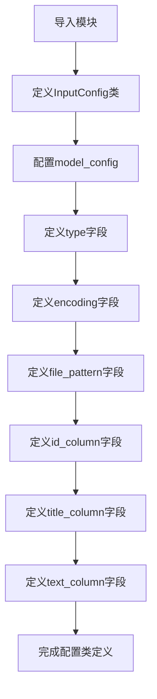
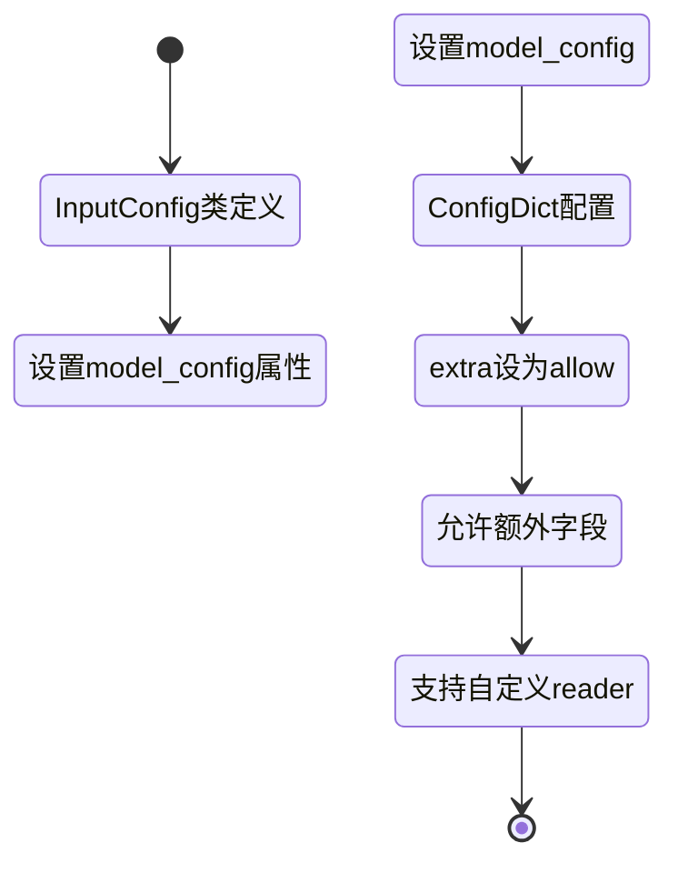

# `graphrag\packages\graphrag-input\graphrag_input\input_config.py` 详细设计文档

这是一个基于Pydantic的配置类定义文件，用于定义GraphRAG系统的输入配置参数，包括输入文件类型、编码方式、文件匹配模式、以及CSV/JSON等表格数据的列映射（ID列、标题列、文本列），支持自定义扩展以适应不同的数据源和读取器实现。

## 整体流程



## 类结构

```
InputConfig (Pydantic BaseModel)
└── 字段: type, encoding, file_pattern, id_column, title_column, text_column
```

## 全局变量及字段


### `InputType`
    
从graphrag_input模块导入的输入类型枚举

类型：`InputType enum`
    


### `InputConfig.type`
    
输入文件类型

类型：`str`
    


### `InputConfig.encoding`
    
输入文件编码

类型：`str | None`
    


### `InputConfig.file_pattern`
    
输入文件匹配模式

类型：`str | None`
    


### `InputConfig.id_column`
    
输入ID列名

类型：`str | None`
    


### `InputConfig.title_column`
    
输入标题列名

类型：`str | None`
    


### `InputConfig.text_column`
    
输入文本列名

类型：`str | None`
    


### `InputConfig.model_config`
    
Pydantic模型配置属性

类型：`ConfigDict`
    
    

## 全局函数及方法


### `InputConfig.model_config`

Pydantic 模型配置属性，通过 `ConfigDict` 设置模型行为，允许接收额外字段以支持自定义读取器实现。

参数：
- 无

返回值：`ConfigDict`，返回 Pydantic 模型配置字典，当前配置 `extra="allow"` 允许模型接受额外的字段。

#### 流程图



#### 带注释源码

```python
class InputConfig(BaseModel):
    """The default configuration section for Input."""

    model_config = ConfigDict(extra="allow")
    """Allow extra fields to support custom reader implementations."""

    type: str = Field(
        description="The input file type to use.",
        default=InputType.Text,
    )
    encoding: str | None = Field(
        description="The input file encoding to use.",
        default=None,
    )
    file_pattern: str | None = Field(
        description="The input file pattern to use.",
        default=None,
    )
    id_column: str | None = Field(
        description="The input ID column to use.",
        default=None,
    )
    title_column: str | None = Field(
        description="The input title column to use.",
        default=None,
    )
    text_column: str | None = Field(
        description="The input text column to use.",
        default=None,
    )
```

**关键点说明**：

1. **`model_config`**：这是 Pydantic v2 中的模型配置方式，替代了 v1 中的 `Config` 类
2. **`ConfigDict(extra="allow")`**：
   - `extra="allow"` 表示允许模型接收未在类中定义的额外字段
   - 这为自定义数据读取器实现提供了灵活性
3. **设计目的**：使 `InputConfig` 能够适配不同的输入源和数据格式，同时保持基础配置的完整性

## 关键组件


### InputConfig 类

主配置类，继承自 Pydantic BaseModel，用于定义输入数据的配置参数，包括文件类型、编码、文件模式以及列映射等。

### type 字段

指定输入文件的类型，默认为 InputType.Text，使用 Pydantic Field 定义，支持自定义描述。

### encoding 字段

指定输入文件的字符编码，默认为 None（使用系统默认编码），支持配置自定义编码。

### file_pattern 字段

指定输入文件的匹配模式（glob 模式），用于过滤需要处理的文件，默认为 None。

### id_column 字段

指定输入数据中 ID 列的名称，用于唯一标识每条记录，默认为 None。

### title_column 字段

指定输入数据中标题列的名称，用于提取文档标题，默认为 None。

### text_column 字段

指定输入数据中文本列的名称，用于提取主要内容，默认为 None。

### Pydantic BaseModel 配置

使用 model_config = ConfigDict(extra="allow") 允许额外字段，以支持自定义读取器实现。

### InputType 枚举依赖

通过 from graphrag_input.input_type import InputType 导入输入类型枚举，提供了类型安全的输入类型约束。


## 问题及建议


### 已知问题

-   `type` 字段类型声明为 `str`，但默认值使用 `InputType.Text` 枚举值，存在类型不一致风险
-   `file_pattern` 使用通用字符串类型，缺乏具体的模式验证
-   `encoding` 默认为 `None`，但未提供编码自动检测或回退机制
-   `extra="allow"` 允许额外字段，可能导致配置膨胀和不可预期的行为
-   缺少字段间互斥关系验证（如 `id_column` 与其他列的依赖关系）
-   未定义默认值加载优先级机制，无法支持多层配置覆盖

### 优化建议

-   将 `type` 字段类型改为 `InputType` 枚举类型，确保类型安全
-   为 `file_pattern` 添加正则表达式验证器或使用专用模式类型
-   实现编码自动检测逻辑或提供合理的默认编码（如 utf-8）
-   考虑将 `extra="allow"` 改为 `extra="forbid"` 或明确文档化允许的扩展字段
-   添加 Pydantic 验证器检查字段间的互斥和依赖关系
-   引入配置层级机制，支持环境变量/配置文件/代码默认值的优先级覆盖

## 其它


### 设计目标与约束

该代码旨在为 GraphRAG 输入模块提供可配置的参数化设置，目标是通过 Pydantic 模型定义标准化的输入配置接口，支持多种输入类型（文本、CSV、JSON 等），同时允许自定义读者实现扩展。设计约束包括：必须继承自 Pydantic BaseModel 以利用其验证和序列化能力；支持额外字段以适应自定义实现；所有字段均为可选或具有默认值，以提供灵活的配置能力。

### 错误处理与异常设计

该配置类本身不包含显式的错误处理逻辑，而是依赖 Pydantic 框架的内置验证机制。当传入无效的配置值时，Pydantic 会自动抛出 ValidationError 异常，包括类型错误、值域错误等。设计建议：在实际使用处添加 try-except 块捕获 ValidationError，提供用户友好的错误提示信息。

### 外部依赖与接口契约

该模块依赖两个外部组件：1) pydantic 库（版本 2.x），提供 BaseModel、ConfigDict、Field 等核心功能；2) graphrag_input.input_type 模块中的 InputType 枚举，用于定义支持的输入类型。接口契约方面：type 字段必须为有效的 InputType 枚举值或字符串；encoding 字段应为有效的字符编码名称；其他字段（file_pattern、id_column、title_column、text_column）仅在特定输入类型下生效。

### 数据流与状态机

该配置类作为只读的数据传输对象（DTO），不涉及复杂的状态机逻辑。数据流为：用户提供配置字典或关键字参数 → Pydantic 验证并创建 InputConfig 实例 → 实例被传递至输入读取器使用。整个过程为单向流动，配置对象在创建后保持不可变状态。

### 使用示例

```python
# 示例1：使用默认配置
config = InputConfig()

# 示例2：指定输入类型和编码
config = InputConfig(
    type=InputType.Text,
    encoding="utf-8",
    file_pattern="*.txt"
)

# 示例3：从字典创建（常用于配置文件加载）
config = InputConfig.model_validate({
    "type": "csv",
    "encoding": "utf-8",
    "id_column": "doc_id",
    "title_column": "title",
    "text_column": "content"
})
```

### 测试策略

该类的测试应覆盖：1) 默认值验证，确保各字段的默认值符合预期；2) 有效配置验证，正确创建配置对象；3) 无效配置验证，确保 Pydantic 能正确捕获类型错误、必填字段缺失等；4) 额外字段支持验证，确认 extra="allow" 配置生效；5) 序列化/反序列化验证，确保模型可以正确转换为 JSON 或字典。

### 安全考虑

该配置类涉及的安全性考虑包括：1) encoding 字段允许指定文件编码，应限制为已知的安全编码列表，防止恶意编码导致解析漏洞；2) file_pattern 字段可能涉及路径遍历风险，应在后续使用时进行路径验证；3) 由于支持 extra="allow"，需注意避免配置注入攻击。

### 性能考虑

作为轻量级配置类，性能影响可忽略。但在大量实例创建场景下，可考虑使用 Pydantic 的 model_*** 构建模式（如 model_validate）替代实例化，以利用缓存机制。

### 可扩展性设计

该类通过以下方式支持扩展：1) ConfigDict(extra="allow") 允许添加未声明的字段，支持自定义读者实现；2) type 字段设计为字符串类型，可通过 InputType 枚举扩展新的输入类型；3) 字段设计遵循开闭原则，新增配置项只需扩展类定义而不影响现有逻辑。


    