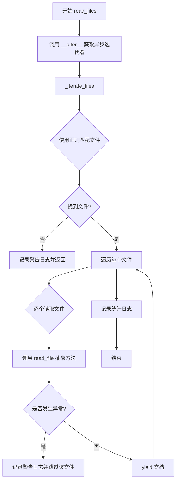
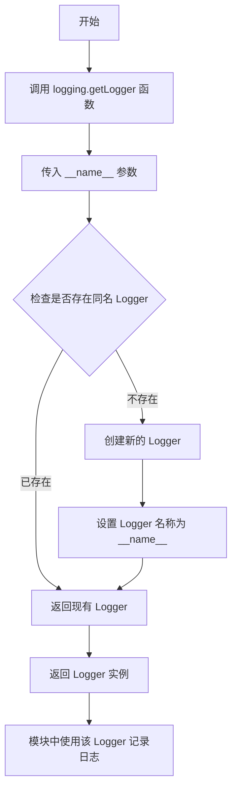
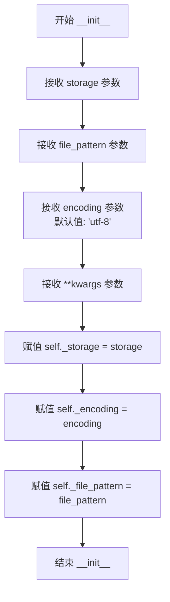
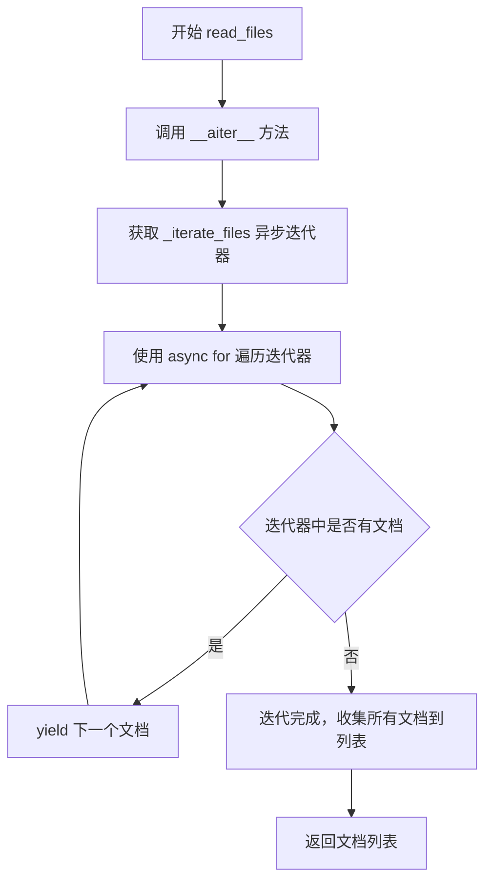
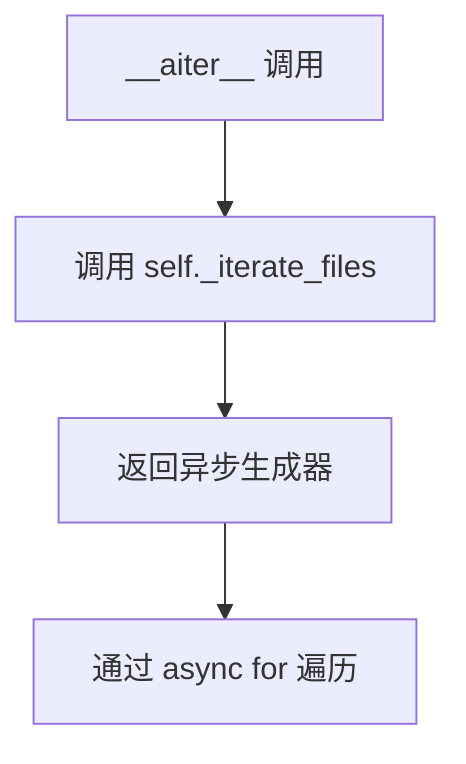

# `graphrag\packages\graphrag-input\graphrag_input\input_reader.py` 详细设计文档

一个异步文件读取器抽象基类，用于从存储中读取文本文件并将其转换为文档列表，支持通过正则表达式匹配文件模式，具备错误处理和日志记录功能。

## 整体流程



## 类结构

```
InputReader (抽象基类)
    ├── _storage: Storage - 存储实例
    ├── _encoding: str - 文件编码
    ├── _file_pattern: str - 文件匹配模式
    ├── read_files() - 异步方法
    ├── __aiter__() - 异步迭代器协议
    ├── _iterate_files() - 异步生成器
    └── read_file() - 抽象方法(需子类实现)
```

## 全局变量及字段


### `logger`
    
模块级日志记录器，用于记录类运行过程中的日志信息

类型：`logging.Logger`
    


### `InputReader._storage`
    
存储后端实例，用于访问和查找文件

类型：`Storage`
    


### `InputReader._encoding`
    
文件编码格式，默认为utf-8

类型：`str`
    


### `InputReader._file_pattern`
    
文件匹配正则表达式，用于筛选需要读取的文件

类型：`str`
    
    

## 全局函数及方法


### `logging.getLogger(__name__)`

获取当前模块的日志记录器，用于在该模块中记录日志信息。通过传入 `__name__` 作为日志记录器名称，可以清晰地标识日志来源，便于追踪日志输出位置。

参数：

- `name`：`str`，Python 内置变量，表示当前模块的完全限定名（如 `graphrag_input.input_reader`）

返回值：`logging.Logger`，返回与当前模块关联的日志记录器实例，用于记录该模块的日志信息

#### 流程图



#### 带注释源码

```python
# 导入 logging 模块以使用日志功能
import logging

# 获取当前模块的日志记录器
# __name__ 是 Python 内置变量，表示当前模块的完全限定名
# 例如：如果此文件是 graphrag_input/input_reader.py，则 __name__ 为 "graphrag_input.input_reader"
# logging.getLogger() 会返回一个 Logger 对象：
#   - 如果同名 Logger 已存在，则返回现有实例
#   - 如果不存在，则创建新的 Logger 实例
logger = logging.getLogger(__name__)
```


### `InputReader.__init__`

初始化 InputReader 抽象基类，设置存储后端、文件匹配模式和编码格式等基础配置，为后续文件读取操作准备环境。

参数：

- `storage`：`Storage`，存储后端对象，用于访问和查找文件
- `file_pattern`：`str`，正则表达式模式字符串，用于匹配需要读取的文件
- `encoding`：`str`，文件编码格式，默认为 "utf-8"
- `**kwargs`：可变关键字参数，用于接收额外的配置选项（当前未使用，保留扩展性）

返回值：`None`，__init__ 方法不返回任何值

#### 流程图



#### 带注释源码

```python
def __init__(
    self,
    storage: Storage,
    file_pattern: str,
    encoding: str = "utf-8",
    **kwargs,
):
    """初始化 InputReader 实例的基础配置。

    Args:
        storage: 存储后端对象，提供文件查找和读取能力
        file_pattern: 文件名匹配模式（正则表达式）
        encoding: 文件编码格式，默认为 utf-8
        **kwargs: 额外的关键字参数，用于未来扩展
    """
    # 将存储后端赋值给实例变量，供后续方法使用
    self._storage = storage
    # 设置文件编码格式，用于文件读取时的解码
    self._encoding = encoding
    # 保存文件匹配模式，用于在文件迭代时过滤文件
    self._file_pattern = file_pattern
```


### InputReader.read_files

该方法是 `InputReader` 类的核心公共接口，通过异步迭代器机制从存储中加载所有匹配文件模式的文件，并将它们聚合为 `TextDocument` 对象列表返回。

参数：此方法无显式参数（仅包含隐式参数 `self`）

返回值：`list[TextDocument]`，返回从存储中加载的所有文档对象列表

#### 流程图



#### 带注释源码

```python
async def read_files(self) -> list[TextDocument]:
    """Load all files from storage and return them as a single list.
    
    该方法是 InputReader 类的主要公共接口，利用 Python 的异步列表推导式
    语法，通过 async for 遍历异步迭代器来收集所有文档到一个列表中返回。
    
    Returns
    -------
        list[TextDocument]
            从存储中加载的所有文档对象列表
    """
    # 使用异步列表推导式遍历 __aiter__ 返回的异步迭代器
    # __aiter__ 返回 _iterate_files() 异步生成器
    # async for 会逐个从生成器中获取文档并组成列表
    return [doc async for doc in self]
```


### `InputReader.__aiter__`

返回异步迭代器，使 `InputReader` 实例支持 `async for` 语法进行异步遍历，实现 Python 异步迭代器协议。

参数：

- `self`：`InputReader`，隐式参数，类的实例本身，用于访问 `_iterate_files()` 方法

返回值：`AsyncIterator[TextDocument]`，异步迭代器，可用于 `async for doc in reader` 语法逐个遍历 `TextDocument` 对象

#### 流程图



#### 带注释源码

```python
def __aiter__(self) -> AsyncIterator[TextDocument]:
    """Return the async iterator, enabling `async for doc in reader`."""
    # 直接返回内部方法 _iterate_files() 的结果
    # _iterate_files 是一个异步生成器，实现了 AsyncIterator 协议
    return self._iterate_files()
```


### `InputReader._iterate_files()`

异步生成器方法，用于遍历存储中的文件，依次 yield 每个文件中的 TextDocument 对象。

参数：
- 无显式参数（隐式参数 `self`：InputReader 实例）

返回值：`AsyncIterator[TextDocument]`，异步迭代器，逐个 Yield TextDocument 对象

#### 流程图

```mermaid
flowchart TD
    A[开始 _iterate_files] --> B{检查文件匹配}
    B -->|找到文件| C[获取文件列表]
    B -->|未找到文件| D[记录警告日志]
    D --> E[返回/结束]
    C --> F[初始化 file_count = len(files)<br/>doc_count = 0]
    F --> G[遍历文件列表]
    G --> H{还有文件未处理?}
    H -->|是| I[尝试读取当前文件]
    I --> J{读取成功?}
    J -->|是| K[遍历文件中的文档]
    K --> L{Yield 单个文档}
    L --> M[doc_count += 1]
    M --> K
    K --> N[文档遍历结束]
    N --> H
    J -->|否| O[记录警告日志<br/>文件加载失败]
    O --> H
    H -->|否| P[记录信息日志<br/>文件总数和文档总数]
    P --> Q[结束]
```

#### 带注释源码

```python
async def _iterate_files(self) -> AsyncIterator[TextDocument]:
    """Async generator that yields documents one at a time as files are loaded."""
    # 从存储中查找匹配文件模式的所有文件，返回文件路径列表
    files = list(self._storage.find(re.compile(self._file_pattern)))
    
    # 如果没有找到匹配的文件，记录警告日志并提前返回
    if len(files) == 0:
        msg = f"No {self._file_pattern} matches found in storage"
        logger.warning(msg)
        return

    # 记录找到的文件数量
    file_count = len(files)
    # 已加载的文档计数
    doc_count = 0

    # 遍历所有找到的文件
    for file in files:
        try:
            # 异步读取单个文件，返回文档列表
            for doc in await self.read_file(file):
                # 文档计数 +1
                doc_count += 1
                # Yield 单个文档给调用者
                yield doc
        except Exception as e:  # noqa: BLE001 (catching Exception is fine here)
            # 捕获读取文件时的异常，记录警告并跳过该文件
            logger.warning("Warning! Error loading file %s. Skipping...", file)
            logger.warning("Error: %s", e)

    # 记录加载完成的信息：找到的文件数、匹配模式、加载的文档数
    logger.info(
        "Found %d %s files, loading %d",
        file_count,
        self._file_pattern,
        doc_count,
    )
    # 记录未过滤的文档总数
    logger.info(
        "Total number of unfiltered %s rows: %d",
        self._file_pattern,
        doc_count,
    )
```


### `InputReader.read_file`

抽象方法，定义文件读取的接口规范。子类需实现此方法以从指定路径读取文件，并将文件内容转换为 TextDocument 对象列表。

参数：

- `path`：`str`，要读取的文件的路径

返回值：`list[TextDocument]`，包含文件中每个文档的列表

#### 流程图

```mermaid
flowchart TD
    A[开始 read_file] --> B{子类实现}
    B --> C[接收文件路径 path: str]
    C --> D[读取文件内容]
    D --> E[解析并转换为 TextDocument 对象]
    E --> F[返回 list[TextDocument]]
    
    style B fill:#f9f,stroke:#333,stroke-width:2px
    style F fill:#9f9,stroke:#333,stroke-width:2px
```

#### 带注释源码

```python
@abstractmethod
async def read_file(self, path: str) -> list[TextDocument]:
    """Read a file into a list of documents.

    Args:
        - path - The path to read the file from.

    Returns
    -------
        - output - List with an entry for each document in the file.
    """
```

## 关键组件


### InputReader 抽象类

提供缓存接口的抽象基类，用于从存储中异步读取文件并将其转换为 TextDocument 列表，支持迭代器协议。

### 文件迭代机制 (_iterate_files 方法)

异步生成器，遍历存储中所有匹配文件模式的文件，逐一yield文档，支持流式处理大文件集合。

### 模式匹配 (file_pattern + 正则表达式)

使用正则表达式编译文件模式，从存储中查找匹配的文件，支持灵活的文件过滤。

### 错误处理与容错

捕获文件加载过程中的异常，记录警告日志并跳过失败文件，确保部分文件加载失败不影响整体流程。

### 文档计数统计

跟踪加载的文件数量和文档总数，并在日志中输出统计信息，用于监控数据加载状态。


## 问题及建议


### 已知问题

-   `__init__` 方法接收 `**kwargs` 参数但从未使用，造成接口不清晰且容易引起混淆
-   `read_files()` 方法使用列表推导式将所有文档一次性加载到内存中，对于大规模文件场景可能导致内存溢出风险
-   `_iterate_files()` 中使用 `list(self._storage.find(...))` 一次性将所有匹配文件路径加载到内存，未实现流式处理或分批加载
-   异常处理使用 `except Exception` 捕获所有异常并仅记录警告日志后继续执行，可能导致部分文件加载失败但调用方无法感知具体哪些文件失败
-   `doc_count` 变量在文件循环内递增，但如果读取过程中发生异常，计数可能不准确，且无法区分成功加载和失败的文档数量
-   未对 `file_pattern` 参数进行有效性验证，空模式或无效正则表达式可能导致意外行为
-   抽象方法 `read_file` 仅定义了接口约束，缺乏默认实现或更详细的文档指导

### 优化建议

-   移除未使用的 `**kwargs` 参数或在文档中明确说明其预留用途
-   考虑为 `read_files()` 添加可选的批量处理参数，支持分批返回而非一次性加载全部
-   考虑实现惰性迭代或分页机制，避免在 `_iterate_files()` 初期一次性加载所有文件路径
-   异常处理可考虑增加失败文件的记录机制（如返回失败文件列表），或提供配置选项决定遇到错误时是否中断执行
-   在 `_iterate_files()` 开始前对 `file_pattern` 进行预验证，确保其为有效的正则表达式
-   考虑为 `read_file` 方法添加更详细的文档说明或基类默认实现，降低子类实现难度
-   可考虑添加类型注解增强（如 `files` 变量的具体类型），提升代码可读性和类型安全

## 其它


### 设计目标与约束

本模块的设计目标是为图形处理管道提供统一的异步文件读取抽象接口，支持从不同存储后端读取文本文件并转换为 TextDocument 对象。核心约束包括：1）必须实现异步迭代器模式以支持大规模文件处理；2）文件匹配依赖正则表达式模式；3）编码默认采用 UTF-8；4）错误处理采用静默跳过策略，记录日志但不中断执行。

### 错误处理与异常设计

本类采用分层异常处理策略：1）文件迭代阶段的异常被捕获并记录为警告，单个文件读取失败不影响其他文件处理；2）抽象方法 `read_file` 由子类实现，需自行处理文件解析异常；3）无匹配文件时记录警告并正常返回空列表；4）异常捕获使用宽泛的 Exception 类型，遵循代码注释说明（BLE001 规则在此场景下合理）。错误信息通过 Python logging 模块输出，包含文件路径和具体异常内容。

### 数据流与状态机

数据流遵循以下路径：存储对象 → 文件匹配（正则过滤）→ 文件迭代 → 单文件读取（子类实现）→ 文档yield → 聚合为列表。状态转换包括：初始化状态（接收配置）→ 迭代状态（遍历文件）→ 文档生成状态（yield单个文档）→ 完成状态（汇总日志）。迭代器支持惰性计算，仅在 `async for` 循环时触发实际读取操作。

### 外部依赖与接口契约

本模块依赖以下外部组件：1）`Storage` 抽象类（graphrag_storage 包），提供 `find()` 方法支持正则匹配文件；2）`TextDocument` 数据模型（graphrag_input.text_document 包），表示文档实体；3）Python 标准库 `re`（正则表达式）、`logging`（日志）、`abc`（抽象基类）。子类必须实现 `read_file` 抽象方法，契约规定：输入为文件路径字符串，输出为 TextDocument 列表。

### 性能考虑与优化空间

当前实现存在以下性能特征：1）文件列表在迭代前一次性加载到内存（`list(self._storage.find(...))`），大文件系统可能存在内存压力；2）文件逐个顺序处理，未利用并发；3）日志在循环内多次输出可能影响性能。优化方向：1）考虑流式文件列表或分批处理；2）可选引入 asyncio.gather 并发读取多个文件；3）日志级别调整以减少 I/O 开销。

### 安全性考虑

安全层面主要涉及文件路径处理和编码处理：1）文件路径直接来自存储返回，未做额外校验，依赖下游 Storage 实现的安全性；2）编码参数默认 UTF-8，若文件编码不匹配可能导致解码错误（被异常处理捕获）；3）未实现文件大小限制，大文件可能导致内存问题。建议在子类实现中添加文件大小检查和路径遍历攻击防护。

### 并发与异步处理设计

本类完全基于 asyncio 构建：1）`_iterate_files` 为异步生成器，实现异步迭代器协议；2）`read_files` 方法使用异步列表推导式聚合文档；3）单线程协作式并发，文件顺序处理。注意事项：1）子类 `read_file` 必须为 async 方法；2）迭代过程中不可进行阻塞 I/O 操作；3）当前设计为串行，如需真正并发需在调用层使用 asyncio.create_task。

### 资源管理与生命周期

资源管理采用以下模式：1）Storage 对象在初始化时注入，生命周期由调用方管理；2）文件句柄资源由子类 `read_file` 方法负责释放；3）正则表达式编译对象未缓存，每次调用 `find` 时重新编译。改进建议：将 `re.compile(self._file_pattern)` 结果缓存为实例变量，避免重复编译开销。

### 配置与扩展性设计

扩展性设计体现在：1）抽象基类模式便于扩展不同文件格式支持；2）支持任意关键字参数 `**kwargs` 传递给子类；3）文件模式、编码均可配置。扩展建议：1）可通过子类实现支持不同文件格式（JSON、CSV、Markdown 等）；2）可添加文件过滤回调机制；3）可配置错误处理策略（严格模式 vs 宽松模式）。

### 测试策略建议

测试应覆盖以下场景：1）正常文件读取流程验证；2）空文件列表处理；3）文件匹配模式测试（包括无匹配情况）；4）异常处理验证（模拟读取失败）；5）异步迭代器协议测试；6）编码异常处理。建议使用 pytest-asyncio 进行异步测试，使用 unittest.mock 模拟 Storage 和 TextDocument。

### 日志与监控设计

日志记录包含三个级别：1）WARNING 级别：无匹配文件、单个文件读取失败；2）INFO 级别：文件总数统计、文档总数统计；3）DEBUG 级别（未使用）：可添加详细迭代过程日志。建议：1）可添加性能指标日志（开始时间、结束时间）；2）可暴露文档计数器的 Prometheus 指标；3）日志消息应包含足够的上下文信息便于问题排查。

### 版本兼容性与迁移考虑

代码使用 `from __future__ import annotations` 延迟注解求值，确保 Python 3.9+ 兼容性（类型提示语法）。依赖的外部类型 `Storage` 和 `TextDocument` 通过 TYPE_CHECKING 条件导入，避免运行时依赖问题。迁移建议：1）若需支持 Python 3.8，需将类型注解改为字符串形式；2）抽象方法签名变更应作为破坏性变更版本更新。


    