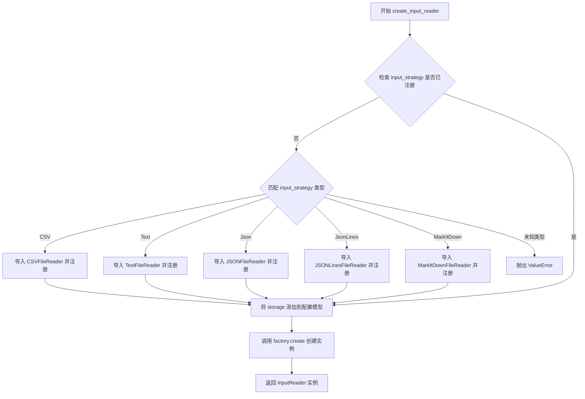
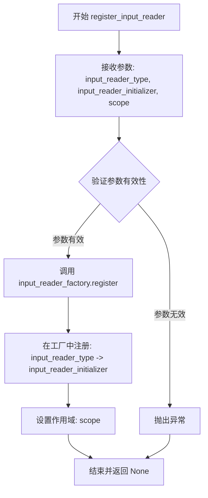
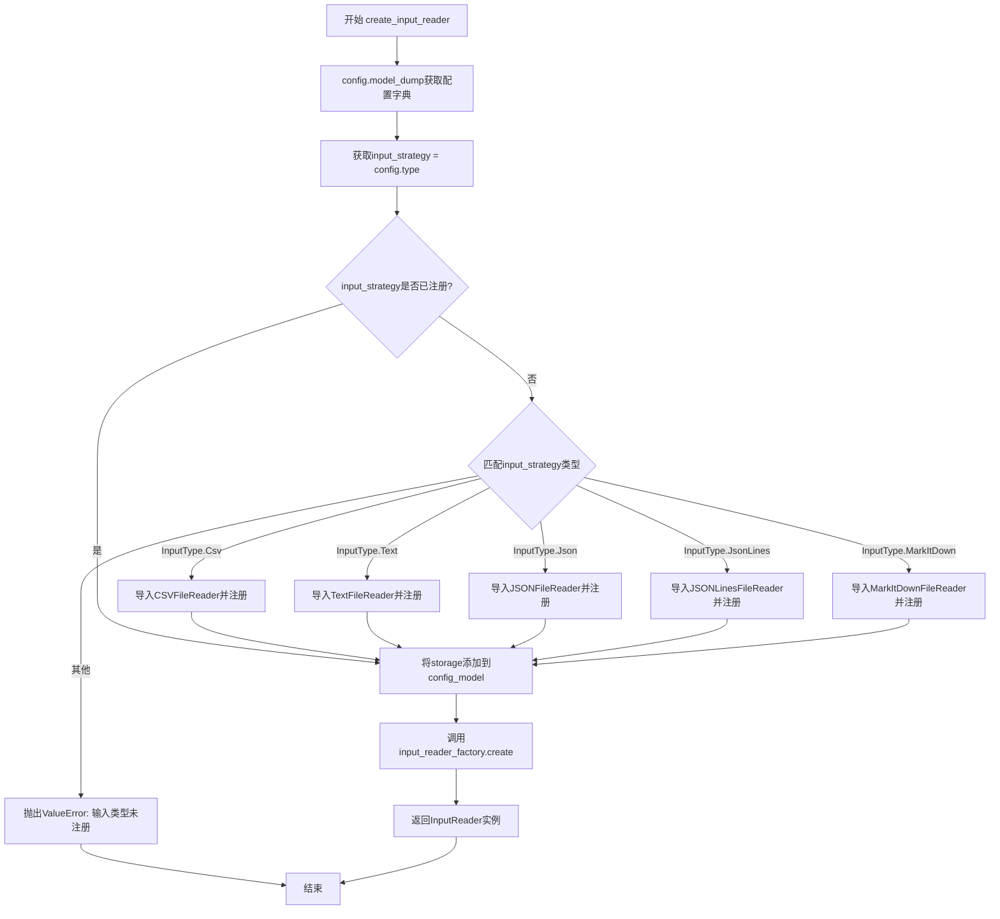
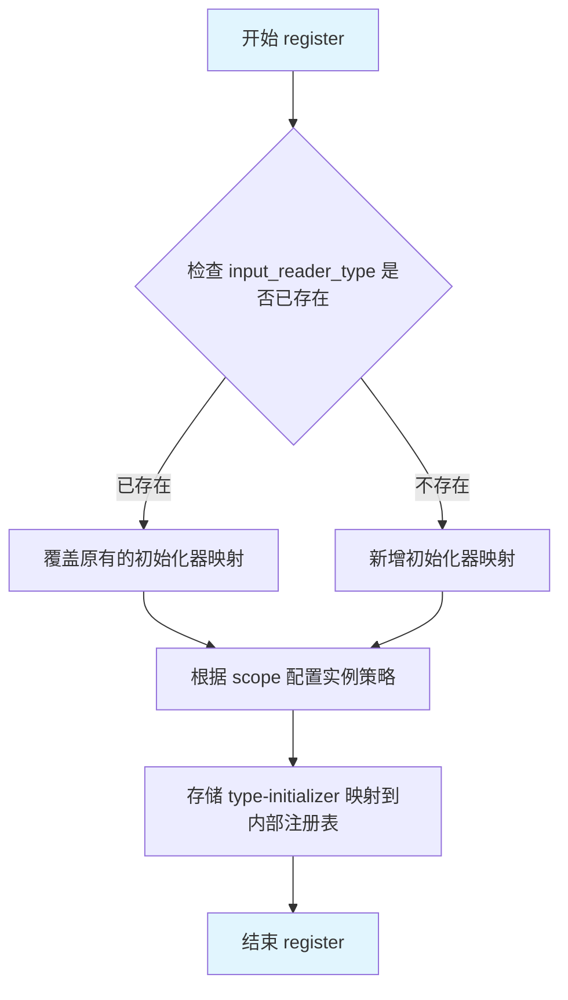
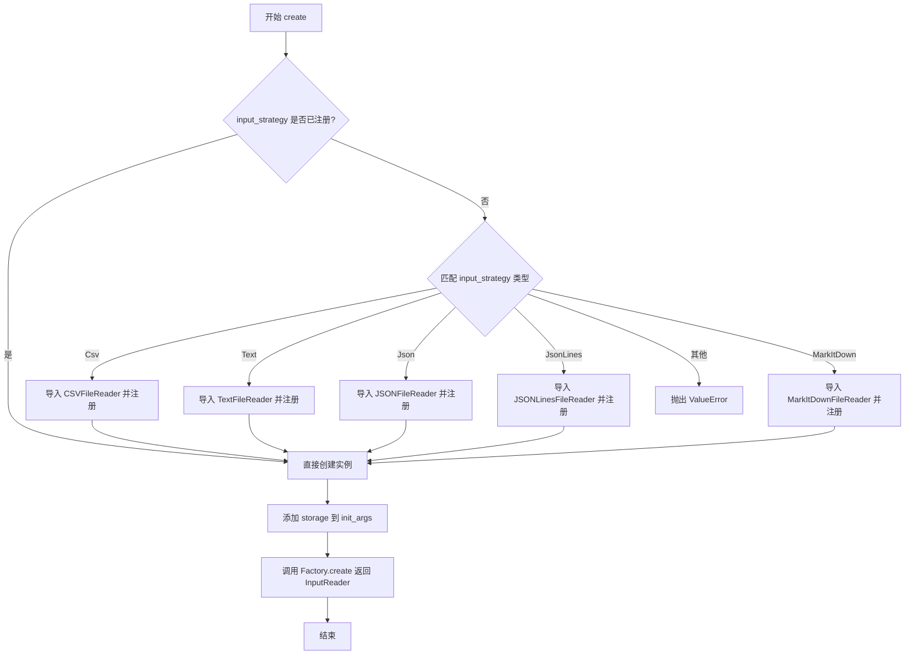
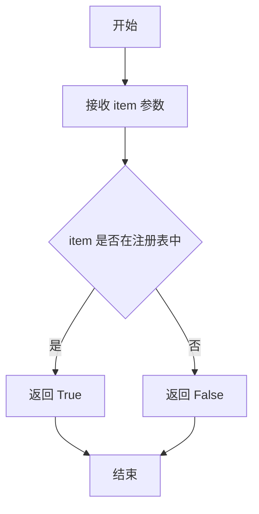

# `graphrag\packages\graphrag-input\graphrag_input\input_reader_factory.py` 详细设计文档

这是一个输入读取器工厂模块，用于根据配置动态创建不同类型（CSV、Text、JSON、JSONLines、MarkItDown）的输入读取器实例，并支持自定义输入读取器的注册。

## 整体流程



## 类结构

```
Factory<T> (泛型工厂基类)
└── InputReaderFactory (输入读取器工厂类)
```

## 全局变量及字段


### `input_reader_factory`
    
全局工厂实例，用于注册和创建各种类型的输入读取器

类型：`InputReaderFactory`
    


    

## 全局函数及方法


### `register_input_reader`

该函数用于将自定义的输入读取器实现注册到全局的 `InputReaderFactory` 工厂中，以便根据配置动态创建相应的输入读取器实例。

参数：

- `input_reader_type`：`str`，输入读取器的唯一类型标识符
- `input_reader_initializer`：`Callable[..., InputReader]`，用于创建 InputReader 实例的可调用对象（初始化器）
- `scope`：`ServiceScope` = "transient"，服务作用域，指定注册的生命周期类型（默认为 transient）

返回值：`None`，无返回值

#### 流程图



#### 带注释源码

```python
def register_input_reader(
    input_reader_type: str,                              # 输入读取器的唯一类型标识符
    input_reader_initializer: Callable[..., InputReader], # 创建输入读取器的初始化函数
    scope: ServiceScope = "transient",                    # 服务作用域，默认为瞬态
) -> None:
    """Register a custom input reader implementation.

    Args
    ----
        - input_reader_type: str
            The input reader id to register.
        - input_reader_initializer: Callable[..., InputReader]
            The input reader initializer to register.
    """
    # 调用全局 input_reader_factory 的 register 方法进行注册
    # 将输入读取器类型和初始化器映射关系注册到工厂中
    input_reader_factory.register(input_reader_type, input_reader_initializer, scope)
```


### `create_input_reader`

该函数是工厂方法的核心实现，根据 `InputConfig` 中指定的输入类型动态创建相应的 `InputReader` 实例。对于未注册的输入类型，函数会自动导入对应的读取器类（如 CSV、Text、JSON、JSONLines、MarkItDown 等）并注册到工厂中，最终返回配置好的输入读取器。

**参数：**

- `config`：`InputConfig`，输入读取器的配置对象，包含输入类型和其他相关配置
- `storage`：`Storage`，用于读取文件的存储实现

**返回值：** `InputReader`，根据配置创建的具体输入读取器实现实例

#### 流程图



#### 带注释源码

```python
def create_input_reader(config: InputConfig, storage: Storage) -> InputReader:
    """Create an input reader implementation based on the given configuration.

    Args
    ----
        - config: InputConfig
            The input reader configuration to use.
        - storage: Storage | None
            The storage implementation to use for reading the files.

    Returns
    -------
        InputReader
            The created input reader implementation.
    """
    # 将配置对象转换为字典，用于后续传递参数
    config_model = config.model_dump()
    
    # 从配置中获取输入策略类型（如 csv, text, json 等）
    input_strategy = config.type

    # 检查该输入策略是否已经在工厂中注册
    if input_strategy not in input_reader_factory:
        # 未注册时，根据策略类型动态导入并注册相应的读取器实现
        match input_strategy:
            case InputType.Csv:
                from graphrag_input.csv import CSVFileReader
                register_input_reader(InputType.Csv, CSVFileReader)
            case InputType.Text:
                from graphrag_input.text import TextFileReader
                register_input_reader(InputType.Text, TextFileReader)
            case InputType.Json:
                from graphrag_input.json import JSONFileReader
                register_input_reader(InputType.Json, JSONFileReader)
            case InputType.JsonLines:
                from graphrag_input.jsonl import JSONLinesFileReader
                register_input_reader(InputType.JsonLines, JSONLinesFileReader)
            case InputType.MarkItDown:
                from graphrag_input.markitdown import MarkItDownFileReader
                register_input_reader(InputType.MarkItDown, MarkItDownFileReader)
            case _:
                # 输入策略不支持，抛出详细的错误信息
                msg = f"InputConfig.type '{input_strategy}' is not registered in the InputReaderFactory. Registered types: {', '.join(input_reader_factory.keys())}."
                raise ValueError(msg)

    # 将存储实现注入到配置模型中，供读取器使用
    config_model["storage"] = storage

    # 调用工厂的 create 方法，传入策略类型和初始化参数，创建具体的输入读取器实例
    return input_reader_factory.create(input_strategy, init_args=config_model)
```


### `InputReaderFactory.register`

注册输入读取器类型及其初始化器到工厂，以便根据配置动态创建相应的输入读取器实例。

参数：

- `input_reader_type`：`str`，要注册的输入读取器的唯一标识符（如 "csv"、"text"、"json" 等）
- `input_reader_initializer`：`Callable[..., InputReader]`，用于创建 InputReader 实例的可调用对象（通常是类构造函数）
- `scope`：`ServiceScope`，服务作用域，默认为 "transient"，决定实例的生命周期管理方式

返回值：`None`，该方法直接在工厂内部注册映射关系，无返回值

#### 流程图



#### 带注释源码

```python
# InputReaderFactory 继承自 Factory 泛型类，专门用于管理 InputReader 实例的创建
class InputReaderFactory(Factory[InputReader]):
    """Factory for creating Input Reader instances."""
    
    # 继承自 Factory 基类，包含以下核心方法：
    # - register(type_name, initializer, scope): 注册类型及其初始化器
    # - create(type_name, **kwargs): 根据类型创建实例
    # - __contains__(type_name): 检查类型是否已注册
    # - keys(): 获取所有已注册的类型的键

# 全局工厂实例，供 register_input_reader 函数使用
input_reader_factory = InputReaderFactory()


def register_input_reader(
    input_reader_type: str,
    input_reader_initializer: Callable[..., InputReader],
    scope: ServiceScope = "transient",
) -> None:
    """Register a custom input reader implementation.

    Args
    ----
        - input_reader_type: str
            The input reader id to register.
        - input_reader_initializer: Callable[..., InputReader]
            The input reader initializer to register.
    - scope: ServiceScope
            The service scope for the reader instance (default: "transient").
    """
    # 调用工厂实例的 register 方法，将类型和初始化器注册到工厂
    # register 方法内部会：
    # 1. 将 input_reader_type 作为 key
    # 2. 将 input_reader_initializer 作为 value 存储
    # 3. 根据 scope 配置实例化策略（transient/singleton 等）
    input_reader_factory.register(input_reader_type, input_reader_initializer, scope)
```

#### 实际使用示例

在 `create_input_reader` 函数中，当遇到未注册的输入类型时，会自动注册内置的读取器：

```python
# 例如：首次遇到 InputType.Csv 时
if input_strategy not in input_reader_factory:  # 检查是否已注册
    match input_strategy:
        case InputType.Csv:
            from graphrag_input.csv import CSVFileReader
            # 调用 register 方法注册 CSV 读取器
            register_input_reader(InputType.Csv, CSVFileReader)
        # ... 其他类型类似
```


### `InputReaderFactory.create`

该方法是工厂类的核心方法，根据输入配置中的类型（CSV、Text、Json 等）动态创建相应的输入读取器实例，并在首次调用时按需注册内置的读取器实现。

参数：

- `input_strategy`：`str`，输入策略类型标识符（如 "csv"、"text"、"json" 等），对应 `InputConfig.type`
- `init_args`：`dict[str, Any]`，包含输入读取器初始化参数的字典，包含从 `InputConfig` 序列化的配置以及 `storage` 对象

返回值：`InputReader`，创建的输入读取器实例

#### 流程图



#### 带注释源码

```python
def create_input_reader(config: InputConfig, storage: Storage) -> InputReader:
    """Create an input reader implementation based on the given configuration.

    Args
    ----
        - config: InputConfig
            The input reader configuration to use.
        - storage: Storage | None
            The storage implementation to use for reading the files.

    Returns
    -------
        InputReader
            The created input reader implementation.
    """
    # 将配置对象序列化为字典
    config_model = config.model_dump()
    # 获取输入策略类型（csv/text/json等）
    input_strategy = config.type

    # 检查该策略是否已在工厂中注册
    if input_strategy not in input_reader_factory:
        # 未注册则按需动态注册内置的读取器实现
        match input_strategy:
            case InputType.Csv:
                # 延迟导入避免循环依赖
                from graphrag_input.csv import CSVFileReader
                # 注册到工厂，scope='transient' 表示每次创建新实例
                register_input_reader(InputType.Csv, CSVFileReader)
            case InputType.Text:
                from graphrag_input.text import TextFileReader
                register_input_reader(InputType.Text, TextFileReader)
            case InputType.Json:
                from graphrag_input.json import JSONFileReader
                register_input_reader(InputType.Json, JSONFileReader)
            case InputType.JsonLines:
                from graphrag_input.jsonl import JSONLinesFileReader
                register_input_reader(InputType.JsonLines, JSONLinesFileReader)
            case InputType.MarkItDown:
                from graphrag_input.markitdown import MarkItDownFileReader
                register_input_reader(InputType.MarkItDown, MarkItDownFileReader)
            case _:
                # 策略类型不支持，抛出明确错误信息
                msg = f"InputConfig.type '{input_strategy}' is not registered in the InputReaderFactory. Registered types: {', '.join(input_reader_factory.keys())}."
                raise ValueError(msg)

    # 将 storage 实例注入到初始化参数中
    config_model["storage"] = storage

    # 调用工厂基类的 create 方法创建具体读取器实例
    # Factory.create 内部会调用注册时指定的 initializer (如 CSVFileReader)
    # 并传入 init_args 作为关键字参数
    return input_reader_factory.create(input_strategy, init_args=config_model)
```


### InputReaderFactory.__contains__

检查指定的输入读取器类型是否已在工厂中注册。

参数：

- `item`：`str`，要检查的输入读取器类型标识符

返回值：`bool`，如果指定的类型已在工厂中注册返回 `True`，否则返回 `False`

#### 流程图



#### 带注释源码

```python
def __contains__(self, item: str) -> bool:
    """检查指定的输入读取器类型是否已注册。
    
    此方法支持使用 'in' 和 'not in' 运算符检查工厂中是否已存在
    特定的输入读取器类型。在代码中的使用方式:
    
        if input_strategy not in input_reader_factory:
            # 注册新的输入读取器
    
    Args:
        item: str - 要检查的输入读取器类型标识符
        
    Returns:
        bool - 如果类型已注册返回 True，否则返回 False
    """
    # 调用父类 Factory 的注册表检查方法
    # 注册表是一个字典，存储了已注册的输入读取器类型
    return item in self._registry
```


### `InputReaderFactory.keys`

返回当前已注册在工厂中的所有输入读取器类型的键列表，用于检查或展示已支持的输入类型。

参数： 无

返回值：`list[str]`，返回已注册在工厂中的所有 input reader 类型的键（字符串列表），例如 `["csv", "text", "json", "jsonlines", "markitdown"]`。

#### 流程图

```mermaid
flowchart TD
    A[调用 input_reader_factory.keys()] --> B{检查工厂内部注册表}
    B -->|有已注册的读取器| C[返回所有已注册类型的键列表]
    B -->|无已注册的读取器| D[返回空列表]
    C --> E[流程结束]
    D --> E
```

#### 带注释源码

```python
# 注意：此方法定义在父类 Factory 中，此处为推断的实现逻辑
# keys 方法继承自 Factory 基类，用于获取所有已注册的 input_reader_type 键

# 使用示例（在 create_input_reader 函数中）：
# ', '.join(input_reader_factory.keys())
# 上述代码获取所有已注册的输入类型并拼接成字符串，用于错误信息展示

# 方法签名（推断自父类 Factory）：
# def keys(self) -> list[str]:
#     """返回工厂中已注册的所有键列表"""
#     ...
```

## 关键组件


### InputReaderFactory 工厂类

负责创建和管理 InputReader 实例的泛型工厂类，继承自 Factory 基类，提供输入读取器的注册和创建功能。

### register_input_reader 全局函数

用于注册自定义输入读取器实现的函数，接受输入读取器类型标识符、初始化器和作用域参数，支持动态扩展支持的输入格式。

### create_input_reader 全局函数

根据给定的 InputConfig 配置和 Storage 存储实现，创建相应类型的输入读取器实例。包含延迟导入逻辑，当请求的输入类型未注册时自动导入对应的读取器类。

### InputType 枚举

定义支持的输入类型枚举，包括 CSV、Text、Json、JsonLines 和 MarkItDown 五种类型，用于配置和识别不同的输入格式。

### 输入读取器自动注册机制

当 create_input_reader 被调用且对应输入类型未注册时，通过 match-case 语句自动导入并注册对应的 CSVFileReader、TextFileReader、JSONFileReader、JSONLinesFileReader 或 MarkItDownFileReader 类。


## 问题及建议


### 已知问题

-   **重复注册逻辑**：每次调用 `create_input_reader` 时，如果 `input_strategy` 不在工厂中，都会执行导入和注册逻辑，即使已经注册过，下一次调用仍会执行 `if input_strategy not in input_reader_factory` 检查，存在性能开销
-   **缺少缓存机制**：对于已经创建的 InputReader 实例没有缓存，对于相同配置多次创建 reader 的场景，会重复创建新实例，增加资源消耗
-   **配置验证不足**：`config.model_dump()` 后直接传递给初始化器，没有对配置参数进行预验证，可能导致运行时错误
-   **日志记录缺失**：创建 InputReader 时没有记录日志，无法追踪到底创建了哪种类型的 reader，不利于调试和问题排查
-   **动态导入位置不当**：导入语句放在函数内部的条件分支中，虽然是延迟加载，但多次调用时会重复执行导入检查
-   **缺少初始化入口**：没有在模块级别预先注册内置的 InputReader 类型（如 CSV、Text、Json 等），而是依赖运行时动态注册

### 优化建议

-   **添加缓存机制**：在 `create_input_reader` 中实现缓存逻辑，对于相同配置的请求返回已缓存的实例，减少重复创建开销
-   **预注册内置类型**：在模块初始化时（模块级别）预先注册所有内置的 InputReader 类型，避免运行时动态检查和注册
-   **加强配置验证**：在调用工厂创建实例前，对 `config_model` 进行预验证，确保必填参数存在且类型正确
-   **添加日志记录**：在创建 InputReader 时记录日志，包括 input_strategy 类型、配置信息等，便于调试和监控
-   **优化注册检查**：使用 `input_reader_factory.try_register` 或类似方法一次性完成检查和注册，减少锁竞争和重复检查
-   **考虑工厂单例模式**：当前的全局单例 `input_reader_factory` 可以考虑改为单例模式，确保整个应用只有一个工厂实例


## 其它


### 设计目标与约束

该模块采用工厂模式设计，旨在解耦输入读取器的创建与使用逻辑，支持动态注册和延迟加载不同的输入读取器实现。设计约束包括：1) 必须继承自InputReader基类；2) 注册时需指定scope（transient/singleton）；3) 支持运行时动态添加新类型；4) 配置与实现分离，通过InputConfig统一管理。

### 错误处理与异常设计

当传入的input_strategy未在工厂中注册时，代码会检查是否为内置类型（CSV/Text/JSON/JsonLines/MarkItDown），若仍不匹配则抛出ValueError异常，错误信息包含当前策略名称及已注册类型列表。建议捕获ValueError并向用户提供友好的错误提示。工厂创建失败时可能抛出工厂内部异常。

### 数据流与状态机

数据流：InputConfig → InputReaderFactory.create() → 具体InputReader实例。状态转换：初始状态（空工厂）→ 注册内置类型 → 根据config.type查找并创建对应Reader → 返回配置好的Reader实例。配置通过model_dump()序列化后注入storage参数。

### 外部依赖与接口契约

主要依赖：1) graphrag_common.factory.Factory - 工厂基类；2) graphrag_storage.storage.Storage - 存储接口；3) graphrag_input.input_config.InputConfig - 配置模型；4) graphrag_input.input_reader.InputReader - 读取器基类接口；5) graphrag_input.input_type.InputType - 输入类型枚举。Storage接口需实现基本的文件读取能力。

### 扩展性设计

通过register_input_reader函数可动态注册新的输入类型。扩展步骤：1) 实现InputReader子类；2) 调用register_input_reader注册；3) 在InputType枚举中添加新类型（可选）。支持自定义scope控制实例生命周期。

### 配置管理

InputConfig包含type字段指定输入策略，model_dump()生成字典后注入storage对象。内置支持的类型：CSV、Text、JSON、JsonLines、MarkItDown。每种类型可能有特定的配置字段（如分隔符、编码等）存储在config中。

### 性能考虑

采用延迟导入策略，仅在首次使用某类型时导入对应模块，减少启动时间。工厂内部维护类型注册表，查找效率为O(1)。scope为transient时每次create创建新实例，scope为singleton时复用实例。

### 并发与线程安全

Factory基类需保证线程安全。register操作应考虑同步机制。transient scope每次create可能并发执行，singleton scope需注意实例化过程中的竞态条件。建议在多线程环境下使用前预注册所有类型。

### 使用示例

```python
# 方式1：使用内置类型
config = InputConfig(type=InputType.Csv, encoding="utf-8")
reader = create_input_reader(config, storage)

# 方式2：注册自定义类型
class CustomReader(InputReader):
    def read(self, path):
        pass

register_input_reader("custom", CustomReader, scope="singleton")
```

### 测试策略

建议测试：1) 内置类型创建成功；2) 未注册类型抛出ValueError；3) 自定义注册功能；4) 不同scope的实例生命周期；5) 配置正确传递；6) 并发注册/创建安全性。

    