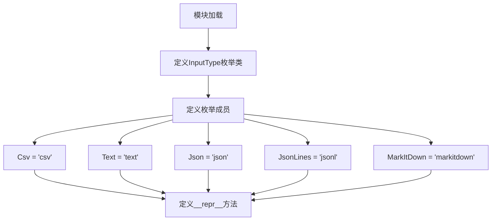

# `graphrag\packages\graphrag-input\graphrag_input\input_type.py` 详细设计文档

该模块定义了一个InputType字符串枚举类，用于表示数据处理管道支持的多种输入文件类型，包括CSV、文本、JSON、JSON Lines和MarkItDown格式，并提供了友好的字符串表示方法。

## 整体流程



## 类结构

```
InputType (StrEnum)
├── Csv (枚举成员)
├── Text (枚举成员)
├── Json (枚举成员)
├── JsonLines (枚举成员)
└── MarkItDown (枚举成员)
```

## 全局变量及字段


### `InputType`
    
输入文件类型的枚举类，支持 CSV、Text、Json、JsonLines、MarkItDown 等格式

类型：`StrEnum`
    


### `InputType.Csv`
    
CSV文件输入类型，值为'csv'

类型：`str`
    


### `InputType.Text`
    
纯文本文件输入类型，值为'text'

类型：`str`
    


### `InputType.Json`
    
JSON文件输入类型，值为'json'

类型：`str`
    


### `InputType.JsonLines`
    
JSON Lines文件输入类型，值为'jsonl'

类型：`str`
    


### `InputType.MarkItDown`
    
MarkItDown格式输入类型，值为'markitdown'

类型：`str`
    
    

## 全局函数及方法


### `InputType.__repr__`

返回枚举值的字符串表示形式，格式为双引号包裹的值。

参数：

- `self`：`InputType`，表示枚举实例本身

返回值：`str`，返回带双引号的枚举值字符串表示形式

#### 流程图


#### 带注释源码

```python
def __repr__(self):
    """Get a string representation."""
    # 获取枚举成员的值（如 "csv", "text", "json" 等）
    # self.value 继承自 StrEnum，返回枚举成员的字符串值
    value = self.value
    
    # 将值格式化为双引号包裹的字符串形式
    # 例如：self.value = "csv" -> 返回 "csv"（外层引号表示字符串边界）
    return f'"{self.value}"'
```

## 关键组件


### InputType 类

一个基于 StrEnum 的输入文件类型枚举类，用于定义管道支持的各种输入文件格式，包含 CSV、文本、JSON、JSON Lines 和 MarkItDown 五种类型，并通过重写 __repr__ 方法提供字符串表示形式。

### 枚举成员

InputType 类的五个枚举成员，分别对应不同的输入文件类型：
- **Csv**：CSV 文件输入类型，值为 "csv"
- **Text**：文本文件输入类型，值为 "text"
- **Json**：JSON 文件输入类型，值为 "json"
- **JsonLines**：JSON Lines 文件输入类型，值为 "jsonl"
- **MarkItDown**：MarkItDown 输入类型，值为 "markitdown"

### __repr__ 方法

重写的字符串表示方法，返回带引号的枚举值字符串，用于提供标准化的输出格式。


## 问题及建议


### 已知问题

-   **`__repr__` 方法覆盖了默认行为但可能不符合预期**：`StrEnum` 继承自 `str`，默认的 `__repr__` 已返回字符串值，当前实现返回带引号的格式 `"{value}"`（如 `"csv"`），这可能导致与标准字符串行为不一致，且覆盖了更有用的默认表示。
-   **枚举成员文档字符串冗余且价值有限**：所有枚举成员使用相同的文档字符串 `"""The {name} input type."""`，无法提供实际额外信息，可读性欠佳。
-   **缺少类型验证和转换方法**：作为输入类型枚举，缺乏静态方法（如 `from_extension()` 或 `is_valid()`）来验证或转换文件扩展名到枚举值。
-   **命名规范不一致**：`JsonLines` 使用全大写缩写 `JSON` 而非 Python 推荐的 `JsonLines`（虽然可接受），但 `MarkItDown` 风格不一致。
-   **缺少 `__slots__` 优化**：作为简单的数据类，未定义 `__slots__`，在大量实例化场景下会有轻微的内存开销（虽然对枚举类型影响较小）。
-   **未实现序列化辅助方法**：缺乏与 JSON/配置文件直接交互的方法，在实际使用中可能需要额外的转换逻辑。

### 优化建议

-   **移除或改进 `__repr__` 方法**：考虑移除自定义 `__repr__`，或使其行为与标准 `str` 一致（返回不带引号的值），或提供 `__str__` 方法来区分显示和调试用途。
-   **增强文档字符串**：为每个枚举成员提供更有意义的文档说明（如说明支持的文件扩展名），或如果文档无实质意义则完全移除。
-   **添加实用类方法**：
  ```python
  @classmethod
  def from_extension(cls, ext: str) -> "InputType":
      """从文件扩展名获取对应的输入类型。"""
      ext_map = {".csv": cls.Csv, ".txt": cls.Text, ...}
      return ext_map.get(ext.lower())
  ```
-   **统一命名风格**：考虑使用更一致的命名规范，或添加类型别名以保持兼容性。
-   **考虑添加 `__slots__`**：虽然枚举类型通常已有优化，但显式声明可以明确意图。
-   **添加序列化辅助**：如 `to_json()` 方法或 `from_value()` 类方法，方便配置文件使用。

## 其它


### 设计目标与约束

该枚举类的设计目标是定义pipeline支持的输入文件类型，使用StrEnum而非传统Enum是为了提供字符串类型的值，便于直接比较和序列化。约束包括：仅支持预定义的输入类型，扩展新类型需修改源码。

### 错误处理与异常设计

该模块为纯数据定义模块，不涉及复杂业务逻辑，无需额外错误处理。StrEnum本身会阻止非法值赋值。调用方在使用时应处理可能的ValueError（当尝试使用未定义值时）。

### 外部依赖与接口契约

依赖Python标准库`enum.StrEnum`（Python 3.11+），若在更低版本运行需降级为`Enum`并手动实现`__str__`。接口契约：所有成员值为小写字符串，具名引用优先于字面量使用。

### 使用示例与场景

```python
from input_type import InputType

# 类型检查
if file_type == InputType.Csv:
    process_csv(file_path)

# 序列化
json.dump({"type": InputType.Json.value}, f)

# 反序列化
file_type = InputType(file_type_str)
```

### 测试策略

建议测试用例：验证所有枚举成员值正确、__repr__输出格式正确、继承的StrEnum行为（值比较、字符串强制转换）、枚举成员数量与预期一致。

### 版本兼容性说明

StrEnum为Python 3.11新增特性。若需兼容更早版本，可替换为：
```python
class InputType(str, Enum):
    Csv = "csv"
    # ...
```

### 扩展性分析

当前设计为封闭枚举，扩展需修改类定义。若需运行时动态扩展，可考虑改用字典或注册模式，但会增加复杂度。当前设计符合开闭原则，对修改封闭、对扩展需改源码。

    