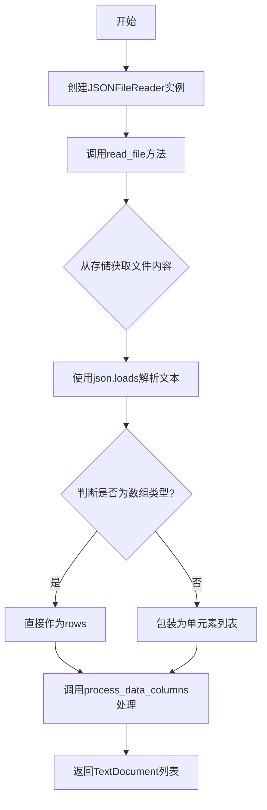

# `graphrag\packages\graphrag-input\graphrag_input\json.py` 详细设计文档

一个JSON文件读取器实现类，继承自StructuredFileReader，用于将JSON文件解析为TextDocument列表，支持单个对象或对象数组格式的JSON文件处理。

## 整体流程



## 类结构

```
StructuredFileReader (基类)
└── JSONFileReader (实现类)
```

## 全局变量及字段


### `logger`
    
模块级日志记录器实例，用于记录该模块的运行信息和错误调试

类型：`logging.Logger`
    


    

## 全局函数及方法


### `JSONFileReader.__init__`

这是 `JSONFileReader` 类的构造函数，用于初始化 JSON 文件读取器。该类继承自 `StructuredFileReader`，设置默认的文件匹配模式为 JSON 文件（`.*\.json$`）。

#### 参数

- `file_pattern`：`str | None`，文件匹配模式，默认为 `None`（此时使用 `".*\\.json$"` 作为默认值）
- `**kwargs`：可变关键字参数，传递给父类 `StructuredFileReader` 的额外参数

#### 返回值

`None`，构造函数无显式返回值

#### 流程图

```mermaid
flowchart TD
    A[开始 __init__] --> B{file_pattern 是否为 None?}
    B -->|是| C[使用默认模式 .*\.json$]
    B -->|否| D[使用传入的 file_pattern]
    C --> E[调用 super().__init__]
    D --> E
    E --> F[结束]
```

#### 带注释源码

```python
def __init__(self, file_pattern: str | None = None, **kwargs):
    """初始化 JSONFileReader 实例。

    Args:
        - file_pattern: str | None, 文件匹配模式，默认为 None，
                        此时使用 ".*\\.json$" 匹配所有 JSON 文件
        - **kwargs: 可变关键字参数，传递给父类 StructuredFileReader
    """
    # 调用父类构造函数，传入文件模式参数
    # 如果未提供 file_pattern，则使用默认的 JSON 文件匹配模式
    super().__init__(
        file_pattern=file_pattern if file_pattern is not None else ".*\\.json$",
        **kwargs,
    )
```


### `JSONFileReader.read_file`

该方法是一个异步方法，负责读取指定路径的 JSON 文件，将其内容解析为 JSON 对象，并根据是否为数组格式进行相应处理，最终通过 `process_data_columns` 方法将数据转换为 `TextDocument` 对象列表返回。

**参数：**

- `path`：`str`，要读取的 JSON 文件的路径

**返回值：** `list[TextDocument]`，包含文件中每一行（或每个对象）的 `TextDocument` 对象列表

#### 流程图

```mermaid
flowchart TD
    A[开始 read_file] --> B[调用 _storage.get 读取文件]
    B --> C[使用 json.loads 解析文本为 JSON]
    C --> D{判断 JSON 类型}
    D -->|是列表| E[rows = as_json]
    D -->|不是列表| F[rows = [as_json]]
    E --> G[调用 process_data_columns 处理 rows]
    F --> G
    G --> H[返回 TextDocument 列表]
    H --> I[结束]
```

#### 带注释源码

```python
async def read_file(self, path: str) -> list[TextDocument]:
    """Read a JSON file into a list of documents.

    Args:
        - path - The path to read the file from.

    Returns
    -------
        - output - list with a TextDocument for each row in the file.
    """
    # 从存储中异步读取文件内容，使用指定的编码格式
    text = await self._storage.get(path, encoding=self._encoding)
    
    # 将 JSON 字符串解析为 Python 对象
    as_json = json.loads(text)
    
    # JSON 文件可能是一个单独的对象，也可能是一个对象数组
    # 如果是数组直接使用，否则包装为单元素列表
    rows = as_json if isinstance(as_json, list) else [as_json]
    
    # 调用父类方法处理数据列，转换为 TextDocument 对象列表
    return await self.process_data_columns(rows, path)
```

## 关键组件


### JSONFileReader 类

JSONFileReader 是一个异步文件读取器，用于解析 JSON 格式的文本文件并将其转换为 TextDocument 对象列表，支持单个 JSON 对象或 JSON 数组两种格式的自动识别与处理。

### 文件的整体运行流程

1. 初始化时设置文件匹配模式（默认为 `.*\.json$`）
2. 调用 `read_file(path)` 时，通过存储层异步读取文件内容
3. 使用 `json.loads` 解析文本为 Python 对象
4. 判断是否为数组类型，如果不是则包装为单元素数组
5. 调用父类 `process_data_columns` 方法将行数据转换为 TextDocument 列表

### 类的详细信息

#### 类字段

| 名称 | 类型 | 描述 |
|------|------|------|
| file_pattern | str \| None | 文件匹配正则表达式，默认匹配 .json 文件 |

#### 类方法

##### __init__

```python
def __init__(self, file_pattern: str | None = None, **kwargs):
```

| 参数名称 | 参数类型 | 参数描述 |
|----------|----------|----------|
| file_pattern | str \| None | JSON 文件匹配模式，默认 ".*\\.json$" |
| **kwargs | Any | 传递给父类的额外关键字参数 |

| 返回值类型 | 返回值描述 |
|------------|------------|
| None | 构造函数无返回值 |

**mermaid 流程图：**

```mermaid
flowchart TD
    A[开始 __init__] --> B{file_pattern 是否为 None}
    B -->|是| C[使用默认模式 ".*\\.json$"]
    B -->|否| D[使用传入的 file_pattern]
    C --> E[调用 super().__init__]
    D --> E
    E --> F[结束]
```

---

##### read_file

```python
async def read_file(self, path: str) -> list[TextDocument]:
```

| 参数名称 | 参数类型 | 参数描述 |
|----------|----------|----------|
| path | str | 要读取的 JSON 文件路径 |

| 返回值类型 | 返回值描述 |
|------------|------------|
| list[TextDocument] | 包含文件中每行数据对应的 TextDocument 对象列表 |

**mermaid 流程图：**

```mermaid
flowchart TD
    A[开始 read_file] --> B[异步读取文件内容]
    B --> C[json.loads 解析文本]
    C --> D{as_json 是否为 list}
    D -->|是| E[rows = as_json]
    D -->|否| F[rows = [as_json]]
    E --> G[调用 process_data_columns]
    F --> G
    G --> H[返回 TextDocument 列表]
```

**带注释源码：**

```python
async def read_file(self, path: str) -> list[TextDocument]:
    """Read a JSON file into a list of documents.

    Args:
        - path - The path to read the file from.

    Returns
    -------
        - output - list with a TextDocument for each row in the file.
    """
    # 从存储层异步读取文件内容，支持指定编码
    text = await self._storage.get(path, encoding=self._encoding)
    # 使用 json.loads 将文本解析为 Python 对象
    as_json = json.loads(text)
    # json 文件可能是单个对象或对象数组，统一处理为数组
    rows = as_json if isinstance(as_json, list) else [as_json]
    # 调用父类方法处理数据列，转换为 TextDocument
    return await self.process_data_columns(rows, path)
```

### 关键组件信息

| 名称 | 一句话描述 |
|------|------------|
| StructuredFileReader 基类 | 抽象文件读取基类，定义文件读取接口和数据处理框架 |
| JSON 解析器 | 使用 json.loads 将 JSON 文本转换为 Python 对象 |
| 文件模式匹配 | 正则表达式匹配，支持自定义文件过滤规则 |
| 异步存储层 | 通过 self._storage 异步读取文件内容 |
| 数据列处理 | 通过 process_data_columns 将原始数据转换为文档对象 |

### 潜在的技术债务或优化空间

1. **错误处理缺失**：未对 JSON 解析失败（如格式错误）进行异常捕获和处理
2. **编码假设固定**：依赖 `self._encoding` 但未在文档中明确支持的编码类型
3. **无流式处理**：大文件会一次性加载全部内容到内存，可能导致内存压力
4. **缺少验证机制**：未对解析后的 JSON 结构进行验证，无法保证数据格式一致性

### 其它项目

#### 设计目标与约束

- **设计目标**：提供统一的结构化文件读取接口，将 JSON 数据转换为标准文档格式
- **约束**：必须继承自 StructuredFileReader，文件匹配默认仅限 .json 扩展名

#### 错误处理与异常设计

- JSON 解析错误会直接抛出 json.JSONDecodeError
- 文件读取错误由存储层（self._storage）抛出
- 缺少对空文件或空 JSON 对象的特殊处理

#### 数据流与状态机

```
文件路径 → 异步读取 → JSON解析 → 类型判断 → 数据转换 → TextDocument列表
```

#### 外部依赖与接口契约

- **依赖模块**：json (标准库)、logging (标准库)、graphrag_input.structured_file_reader、graphrag_input.text_document
- **接口契约**：read_file(path) 返回 list[TextDocument]，process_data_columns 由父类定义


## 问题及建议


### 已知问题

-   **错误处理缺失**：`json.loads(text)` 可能抛出 `json.JSONDecodeError` 异常，但没有进行 try-except 捕获和适当处理
-   **编码属性依赖未明确**：使用 `self._encoding` 但当前类中未定义该属性，依赖父类实现，父类定义不明确可能导致运行时错误
-   **空数据边界情况未处理**：当 JSON 文件为空对象 `{}` 或空数组 `[]` 时，`process_data_columns(rows, path)` 的行为不明确，可能返回空列表或引发异常
-   **文件读取异常未捕获**：`await self._storage.get(path, encoding=self._encoding)` 可能抛出存储访问异常（如文件不存在、权限错误等），缺少错误处理和日志记录
-   **缺少日志记录**：读取文件过程没有日志输出，排查问题时缺少关键信息
-   **大文件性能风险**：使用 `json.loads()` 同步解析整个文件内容，对于大型 JSON 文件可能导致内存问题和性能瓶颈

### 优化建议

-   **添加 JSON 解析异常处理**：捕获 `json.JSONDecodeError`，记录错误日志并返回空列表或抛出更明确的业务异常
-   **显式定义编码属性**：在类中显式定义 `_encoding` 属性或添加类型注解，提高代码可读性和维护性
-   **处理空数据边界情况**：在处理前检查 `rows` 是否为空，明确空文件/空数据的处理策略并添加日志记录
-   **完善文件读取错误处理**：捕获存储层异常，添加文件路径、错误原因等上下文信息的日志记录
-   **添加操作日志**：在读取文件开始和成功完成时记录日志，包括文件路径、记录数量等信息
-   **考虑大文件优化**：对于大型 JSON 文件，考虑使用 `ijson` 等流式解析库或实现分块处理机制

## 其它


### 设计目标与约束

设计目标：实现一个高效的JSON文件读取器，将JSON文件内容转换为TextDocument列表，支持单个对象和数组两种JSON格式。约束：必须继承自StructuredFileReader基类，支持异步文件读取，遵循graphrag_input模块的接口规范。

### 错误处理与异常设计

主要异常场景包括：JSON解析失败（json.JSONDecodeError）、文件不存在或读取失败（由_storage引发）、编码问题（由encoding参数控制）。当JSON格式错误时，会向上抛出JSONDecodeError；当文件不存在时，由底层_storage组件处理并抛出相应异常。方法通过try-except块捕获JSON解析异常并重新抛出。

### 数据流与状态机

数据流：1）调用get方法读取文件内容 → 2）使用json.loads解析JSON字符串 → 3）判断是否为数组类型 → 4）如果不是数组则包装为单元素数组 → 5）调用process_data_columns处理行数据 → 6）返回TextDocument列表。状态机包含IDLE（等待读取）、LOADING（读取中）、PARSING（解析中）、PROCESSING（处理中）、COMPLETED（完成）五种状态。

### 外部依赖与接口契约

依赖外部模块： StructuredFileReader（基类，提供文件模式和process_data_columns方法）、json（标准库）、logging（标准库）。接口契约：read_file方法接收path: str参数，返回list[TextDocument]，必须为异步方法。_storage.get方法必须支持path和encoding参数，返回文件内容字符串。

### 性能考虑

由于采用异步IO设计，可以并发处理多个文件读取任务。JSON解析在内存中完成，对于大型JSON文件可能存在内存压力，建议后续优化支持流式解析。process_data_columns方法的性能取决于子类实现和数据集大小。

### 安全性考虑

path参数未做路径遍历安全检查，可能存在路径注入风险。encoding参数默认使用父类定义的值，需确保不被恶意篡改。JSON解析可能受到畸形JSON的拒绝服务攻击，建议添加解析超时机制。

### 并发处理

该类本身不维护并发状态，但支持并发调用。多个read_file调用可以同时进行，由底层_storage实现决定并发级别。需确保process_data_columns的线程安全性。

### 资源管理

使用async/await模式确保异步资源正确释放。_storage资源的生命周期由父类管理。JSON解析产生的临时对象由Python垃圾回收机制自动管理。

### 测试策略

应包含单元测试验证：正常JSON数组解析、单个JSON对象解析、无效JSON格式异常处理、文件不存在异常处理、空JSON对象处理、特殊字符编码处理。集成测试需验证与基类StructuredFileReader的协作。

### 配置管理

file_pattern参数支持通过构造函数注入，默认值为".*\.json$"。encoding参数继承自父类。additional kwargs传递给父类构造函数，支持灵活配置。所有配置在初始化时确定，运行期间不可变。

### 日志和监控

使用模块级logger记录关键操作，建议添加：文件读取开始日志、JSON解析成功日志、异常发生时的详细错误日志。监控指标可包括：读取文件数量、解析失败次数、平均处理时间。

### 兼容性考虑

支持Python 3.9+（使用str | None类型提示语法）。与graphrag_input模块的其他Reader实现保持一致接口。JSON格式兼容性：支持JSON标准规范定义的所有数据类型。

### 扩展性设计

可扩展方向：1）添加自定义JSON解析器支持非标准JSON格式；2）实现流式处理大型JSON文件；3）添加缓存机制减少重复读取；4）支持自定义Document转换逻辑。通过继承和覆盖方法可以方便地扩展功能。

    