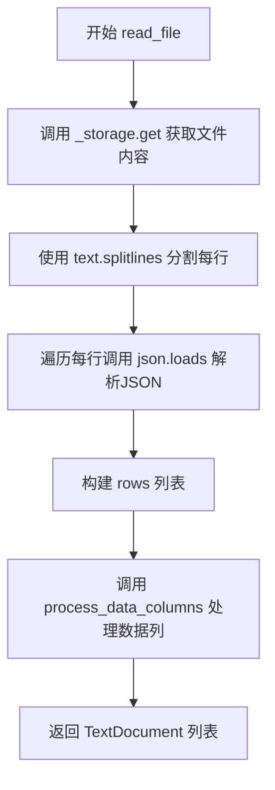
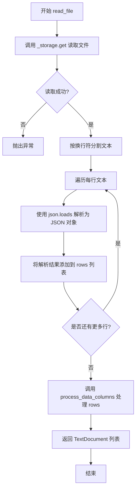

# `graphrag\packages\graphrag-input\graphrag_input\jsonl.py` 详细设计文档

该文件实现了JSONLinesFileReader类，用于读取JSON Lines格式文件，将每行作为一个独立的JSON对象解析为TextDocument文档对象。

## 整体流程



## 类结构

```
StructuredFileReader (抽象基类)
└── JSONLinesFileReader
```

## 全局变量及字段


### `JSONLinesFileReader._storage`
    
继承自父类 - 存储访问对象

类型：`Storage`
    


### `JSONLinesFileReader._encoding`
    
继承自父类 - 编码格式

类型：`str`
    
    

## 全局函数及方法


### `JSONLinesFileReader.__init__`

该方法是 JSONLinesFileReader 类的初始化方法，负责配置 JSON 行文件的读取参数。如果没有提供文件匹配模式，则使用默认的 `.jsonl$` 正则表达式来匹配 JSON 行文件，并将配置传递给父类 StructuredFileReader。

参数：

- `file_pattern`：`str | None`，可选的文件名匹配模式，用于指定要读取的文件类型，默认为 None（使用 ".*\\.jsonl$"）
- `**kwargs`：可变关键字参数，用于传递给父类 StructuredFileReader 的其他配置参数

返回值：`None`，构造函数不返回任何值

#### 流程图

```mermaid
flowchart TD
    A[开始 __init__] --> B{file_pattern 是否为 None?}
    B -->|是| C[使用默认模式 ".*\\.jsonl$"]
    B -->|否| D[使用传入的 file_pattern]
    C --> E[调用 super().__init__]
    D --> E
    E --> F[结束 __init__]
```

#### 带注释源码

```python
def __init__(self, file_pattern: str | None = None, **kwargs):
    """初始化 JSONLinesFileReader 实例。

    构造方法接收一个可选的文件匹配模式参数，如果未提供，
    则使用默认的 ".*\\.jsonl$" 模式来匹配 .jsonl 结尾的文件。
    剩余的参数会传递给父类 StructuredFileReader。

    Args:
        file_pattern: Optional[str], 文件名正则表达式模式，
                      用于过滤要读取的文件，默认为 None。
        **kwargs: 可变关键字参数，传递给父类构造函数。

    Returns:
        None: 此构造函数不返回值。
    """
    # 调用父类 StructuredFileReader 的构造方法
    # 如果 file_pattern 为 None，则使用默认的 ".*\\.jsonl$" 正则表达式
    # 该模式匹配所有以 .jsonl 结尾的文件
    super().__init__(
        file_pattern=file_pattern if file_pattern is not None else ".*\\.jsonl$",
        **kwargs,
    )
```


### `JSONLinesFileReader.read_file`

异步方法，用于读取 JSON Lines 格式的文件，将文件中的每一行解析为独立的 JSON 对象，并将其转换为 `TextDocument` 对象列表返回。

参数：

- `path`：`str`，要读取的 JSON Lines 文件路径

返回值：`list[TextDocument]`，包含文件中每行数据对应的 `TextDocument` 对象列表

#### 流程图



#### 带注释源码

```python
async def read_file(self, path: str) -> list[TextDocument]:
    """Read a JSON lines file into a list of documents.

    This differs from standard JSON files in that each line is a separate JSON object.

    Args:
        - path - The path to read the file from.

    Returns
    -------
        - output - list with a TextDocument for each row in the file.
    """
    # 从存储中读取文件内容，使用指定的编码格式
    text = await self._storage.get(path, encoding=self._encoding)
    
    # 将文本按行分割，每行是一个独立的 JSON 对象
    rows = [json.loads(line) for line in text.splitlines()]
    
    # 调用父类方法处理数据列，转换为 TextDocument 对象列表
    return await self.process_data_columns(rows, path)
```

## 关键组件


### JSONLinesFileReader 类

负责读取 JSON Lines (.jsonl) 格式文件的文档读取器实现类，继承自 StructuredFileReader，每行作为独立 JSON 对象解析并转换为 TextDocument 列表。

### read_file 方法

异步方法，接收文件路径，读取文件内容后将每行解析为 JSON 对象，调用 process_data_columns 处理数据列并返回 TextDocument 列表。

### JSON 解析逻辑

使用 json.loads 对文本每行进行解析，将字符串转换为 Python 字典对象，支持处理多行独立的 JSON 数据。

### 文件模式匹配

通过正则表达式 ".*\\.jsonl$" 默认匹配 .jsonl 扩展名文件，支持自定义文件模式覆盖默认行为。

### 存储抽象层

通过 self._storage.get 方法抽象文件读取，支持不同存储后端（本地文件系统、云存储等），并支持指定编码格式读取。


## 问题及建议


### 已知问题

-   **JSON 解析无错误处理**：`json.loads(line)` 在遇到无效 JSON 时会直接抛出 `json.JSONDecodeError` 异常，导致整个文件读取失败，没有对单行解析错误进行隔离和容错处理
-   **空文件/空行未处理**：当文件为空或包含空行时，`text.splitlines()` 可能产生空字符串元素，`json.loads("")` 会抛出异常
-   **内存占用问题**：使用列表推导式 `[json.loads(line) for line in text.splitlines()]` 一次性将所有行加载到内存，对于大型 JSONL 文件可能导致内存溢出
-   **返回值类型不一致**：方法签名声明返回 `list[TextDocument]`，但实际 `process_data_columns` 返回值的类型未在代码中明确验证，可能存在类型不一致风险
-   **日志记录缺失**：关键操作（如文件读取、解析错误）没有日志记录，不利于问题排查和监控

### 优化建议

-   **添加 JSON 解析错误处理**：在解析每行时添加 try-except 块，跳过无效行并记录警告日志，同时增加 `skip_bad_rows` 参数供调用方控制行为
-   **处理空行和空文件**：在解析前过滤空行，或在循环中跳过空字符串
-   **考虑流式处理**：对于大文件，采用异步生成器或分块读取方式，避免一次性加载全部内容到内存
-   **增加日志记录**：在文件读取、解析完成、错误发生等关键节点添加适当的日志记录
-   **添加类型注解验证**：确保 `process_data_columns` 的返回类型明确为 `list[TextDocument]`，或添加运行时类型检查

## 其它


### 设计目标与约束

本模块旨在提供对JSON Lines格式文件的读取能力，将每行JSON转换为TextDocument对象。设计约束包括：仅支持UTF-8编码（通过encoding参数指定）、假设输入文件符合JSON Lines规范（即每行一个有效的JSON对象）、文件路径必须为有效的文件系统路径、支持异步读取操作以提高性能。

### 错误处理与异常设计

主要异常场景包括：文件不存在或无法访问时抛出FileNotFoundError；JSON解析失败时抛出json.JSONDecodeError；编码不支持时抛出UnicodeDecodeError；storage读取失败时传播原始异常。方法返回值采用空列表而非抛出异常处理读取为空的情况。日志记录采用Python标准logging模块，异常信息包含文件路径以便问题定位。

### 数据流与状态机

数据流为：调用read_file(path) → _storage.get()读取原始文本 → splitlines()按行分割 → json.loads()逐行解析为字典列表 → process_data_columns()转换为TextDocument列表 → 返回结果。状态机简单明确：初始状态（就绪）→ 读取中（异步操作）→ 完成（返回结果）或异常（错误状态）。

### 外部依赖与接口契约

依赖项包括：json（标准库）、logging（标准库）、graphrag_input.structured_file_reader.StructuredFileReader（父类）、graphrag_input.text_document.TextDocument（返回类型）。接口契约：read_file(path: str) -> list[TextDocument]，path必须为字符串类型且指向有效文件，返回非空list（无数据时返回空列表）。

### 性能考虑

使用异步IO操作提高并发读取效率；json.loads为同步解析，大文件场景可考虑流式解析或使用orjson等高性能库；splitlines()一次性加载整个文件内容，超大文件（GB级别）需评估内存占用；可考虑添加缓存机制避免重复读取。

### 安全性考虑

路径遍历攻击防护需由上层调用者保证；JSON解析需警惕恶意构造的JSON导致内存溢出或计算资源耗尽（建议添加单行大小限制）；文件读取权限由操作系统和上层应用控制；日志输出需避免敏感信息泄露。

### 配置参数说明

file_pattern: str | None = None，正则表达式模式，用于匹配目标文件扩展名，默认值为".*\\.jsonl$"，支持通过kwargs传递给父类；encoding: str，默认继承自父类，用于指定文件编码格式；kwargs: 传递给父类StructuredFileReader的其他可选参数。

### 使用示例

```python
# 基本用法
reader = JSONLinesFileReader()
documents = await reader.read_file("/path/to/data.jsonl")

# 自定义文件模式
reader = JSONLinesFileReader(file_pattern=".*\\.jsonl$")
documents = await reader.read_file("/path/to/custom.jsonl")

# 指定编码
reader = JSONLinesFileReader(encoding="utf-8")
documents = await reader.read_file("/path/to/utf8_data.jsonl")
```

### 版本历史

初始版本（v1.0.0）：支持JSON Lines文件读取，基本功能实现。

    