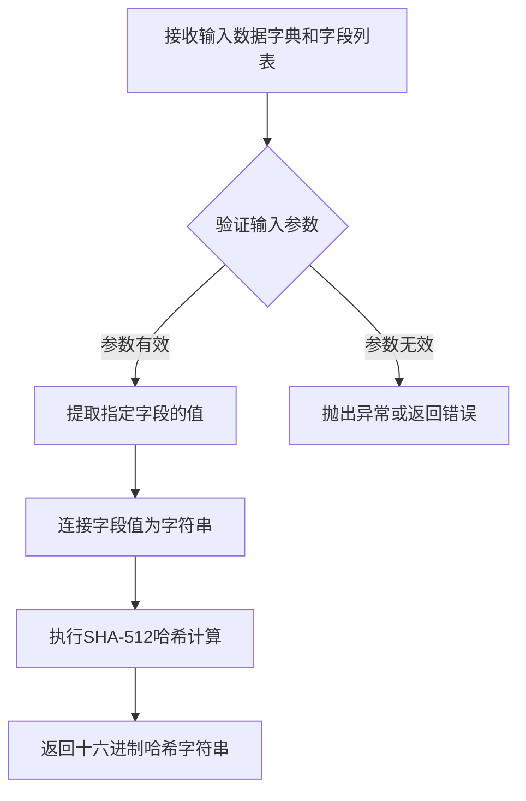
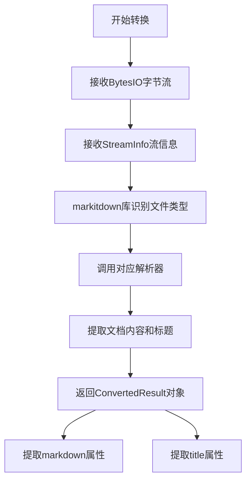
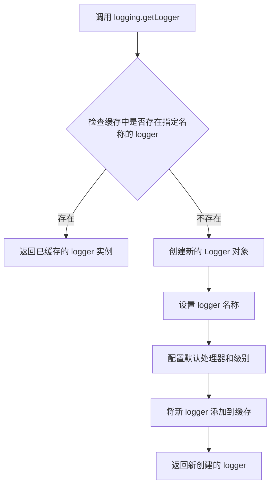
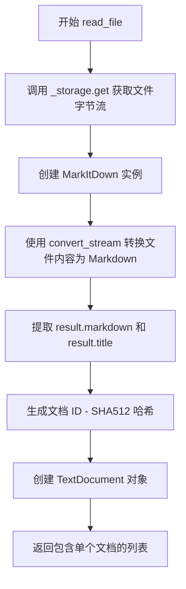
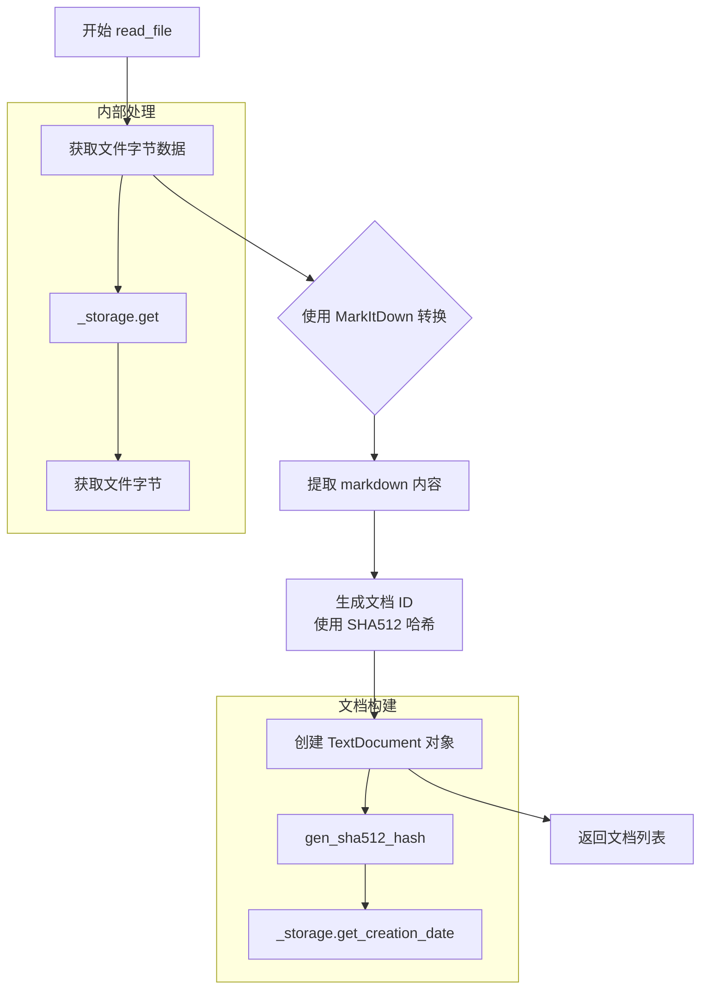
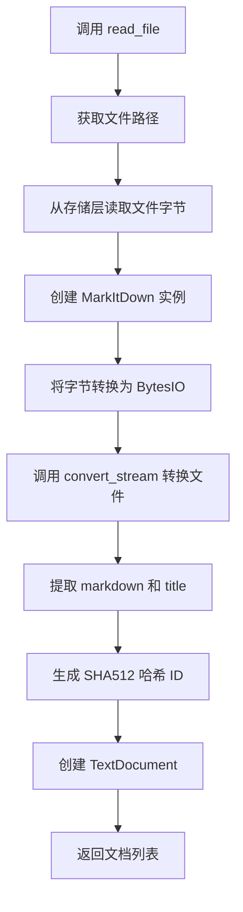

# `graphrag\packages\graphrag-input\graphrag_input\markitdown.py` 详细设计文档

该代码实现了一个基于markitdown库的文件读取器，能够将各种格式的文件（PDF、Word、Excel等）转换为TextDocument对象，支持异步读取文件并通过SHA512哈希生成文档ID。

## 整体流程

```mermaid
graph TD
A[开始 read_file] --> B[从存储获取文件内容]
B --> C[创建 MarkItDown 实例]
C --> D[将字节流转换为 Markdown]
D --> E[提取 markdown 文本和标题]
E --> F[生成文档 ID (SHA512)]
F --> G[创建 TextDocument 对象]
G --> H[返回文档列表]
```

## 类结构

```
InputReader (抽象基类)
└── MarkItDownFileReader (文件读取器实现类)
```

## 全局变量及字段


### `path`
    
文件路径字符串

类型：`str`
    


### `bytes`
    
从存储后端读取的文件的原始字节数据

类型：`bytes`
    


### `md`
    
MarkItDown库实例，用于将各种文件格式转换为Markdown

类型：`MarkItDown`
    


### `result`
    
MarkItDown转换结果，包含markdown文本和标题

类型：`StreamConvertResult`
    


### `text`
    
转换后的Markdown文本内容

类型：`str`
    


### `document`
    
创建的文本文档对象，包含id、title、text等信息

类型：`TextDocument`
    


### `MarkItDownFileReader._storage`
    
继承自InputReader的存储后端接口，用于获取文件内容

类型：`StorageBackend`
    


### `MarkItDownFileReader._encoding`
    
继承自InputReader的文本编码格式

类型：`str`
    


### `TextDocument.id`
    
文档的唯一标识符，由SHA512哈希生成

类型：`str`
    


### `TextDocument.title`
    
文档标题，来源于文件元数据或文件名

类型：`str`
    


### `TextDocument.text`
    
文档的文本内容，为Markdown格式

类型：`str`
    


### `TextDocument.creation_date`
    
文档的创建日期时间

类型：`datetime`
    


### `TextDocument.raw_data`
    
原始二进制数据，此处设置为None

类型：`Optional[bytes]`
    
    

## 全局函数及方法


### `gen_sha512_hash`

该函数是从 `graphrag_input.hashing` 模块导入的哈希生成函数，用于根据指定的字段列表对输入字典计算 SHA-512 哈希值，生成唯一的文档标识符。

参数：

-  `data`：`Dict[str, Any]`，包含需要哈希的数据的字典，键为字段名，值为对应的数据
-  `fields`：`List[str]`，字符串列表，指定要对字典中哪些字段进行哈希计算

返回值：`str`，返回 SHA-512 哈希算法的十六进制字符串摘要，用作文档的唯一标识符

#### 流程图



#### 带注释源码

```python
# 该函数定义在 graphrag_input.hashing 模块中
# 以下为基于调用方式的推断实现

from hashlib import sha512
import json

def gen_sha512_hash(data: dict, fields: list[str]) -> str:
    """生成SHA-512哈希值
    
    Args:
        data: 包含需要哈希的数据的字典
        fields: 指定要哈希的字段名列表
    
    Returns:
        SHA-512哈希的十六进制字符串
    """
    # 根据fields列表提取对应字段的值
    hash_input = ""
    for field in fields:
        if field in data:
            hash_input += str(data[field])
    
    # 创建SHA-512哈希对象并计算哈希值
    hash_object = sha512(hash_input.encode('utf-8'))
    
    # 返回十六进制格式的哈希字符串
    return hash_object.hexdigest()

# 在代码中的实际使用方式：
document = TextDocument(
    id=gen_sha512_hash({"text": text}, ["text"]),  # 对text字段生成哈希作为文档ID
    title=result.title if result.title else str(Path(path).name),
    text=text,
    creation_date=await self._storage.get_creation_date(path),
    raw_data=None,
)
```

#### 备注

- 该函数的具体实现源代码未在当前文件中给出，仅通过导入语句引用
- 调用时传入包含文本内容的字典和需要哈希的字段列表（此处为 `["text"]`）
- 返回的哈希值用作 `TextDocument` 的唯一标识符 `id`


### `MarkItDown.convert_stream`

将输入的字节流（支持多种文件格式）转换为 Markdown 格式的核心方法，通过 markitdown 库实现文档内容的统一输出。

参数：

-  `stream`：`BytesIO`，要转换的输入字节流对象，包含待转换的原始文件内容
-  `stream_info`：`StreamInfo`，文件的流信息，包含文件扩展名等元数据，用于确定文件类型和相应的解析策略

返回值：`ConvertedResult`，转换结果对象，包含以下属性：

-  `markdown`：转换后的 Markdown 格式文本内容
-  `title`：从文档中提取的标题（如果存在），否则为 `None`

#### 流程图



#### 带注释源码

```python
# 创建MarkItDown实例
md = MarkItDown()

# 将字节数据包装为BytesIO流对象
# bytes: 从存储中读取的原始文件字节内容
bytes_io_stream = BytesIO(bytes)

# 创建StreamInfo对象，指定文件扩展名
# Path(path).suffix 从文件路径中提取扩展名（如 .pdf, .docx 等）
# StreamInfo用于告诉markitdown如何解析该文件
stream_info = StreamInfo(extension=Path(path).suffix)

# 调用convert_stream方法进行格式转换
# 输入: BytesIO格式的字节流 + 文件扩展名信息
# 输出: 包含转换结果的ConvertedResult对象
result = md.convert_stream(bytes_io_stream, stream_info=stream_info)

# 从结果中提取Markdown文本
# result.markdown: 转换后的Markdown格式字符串
text = result.markdown

# 从结果中提取文档标题
# result.title: 文档标题，如果不存在则为None
# 备用逻辑: 如果title为空，使用文件名作为标题
title = result.title if result.title else str(Path(path).name)
```


### `logging.getLogger`

获取或创建一个与指定名称关联的 logger 对象。`logging.getLogger` 是 Python 标准库 logging 模块的核心函数，用于获取命名的 logger，如果指定名称的 logger 不存在则创建一个新的。

参数：

-  `name`：`str`，logger 的名称，通常使用 `__name__` 传入当前模块的路径，用于标识日志来源

返回值：`logging.Logger`，返回一个 Logger 实例，可用于记录日志

#### 流程图



#### 带注释源码

```python
# 从提供的代码中提取的 logging.getLogger 使用方式
logger = logging.getLogger(__name__)
# 导入 logging 模块后，通过 __name__ 获取当前模块的 logger
# __name__ 是 Python 内置变量，表示当前模块的完全限定名
# 例如：当此模块被导入时，__name__ 的值是 'graphrag_input.markitdown_file_reader'
# 该调用返回一个 logging.Logger 实例，赋值给 logger 变量
# 此 logger 将用于记录该模块内的日志信息
```

#### 说明

`logging.getLogger(__name__)` 是 Python 项目中推荐的最佳实践，原因如下：

1. **模块级 logger**：每个模块使用独立的 logger，便于按模块过滤日志
2. **自动命名**：使用 `__name__` 自动获取有意义的名称，无需手动指定
3. **单例模式**：相同名称的 logger 只会创建一次，后续调用返回同一实例
4. **层级结构**：支持点分隔的层级命名，如 `parent.child`，形成 logger 树结构


### `MarkItDownFileReader.read_file`

异步读取指定路径的文件，使用 MarkItDown 库将文件内容转换为 Markdown 格式，并封装为 TextDocument 对象列表返回。

参数：

- `path`：`str`，要读取的文件路径

返回值：`list[TextDocument]`，包含转换后的 Markdown 文档列表

#### 流程图



#### 带注释源码

```python
async def read_file(self, path: str) -> list[TextDocument]:
    """Read a text file into a DataFrame of documents.

    Args:
        - path - The path to read the file from.

    Returns
    -------
        - output - list with a TextDocument for each row in the file.
    """
    # 步骤1: 从存储中异步获取文件的字节内容
    # encoding 参数用于指定文本编码，as_bytes=True 表示返回字节流而非字符串
    bytes = await self._storage.get(path, encoding=self._encoding, as_bytes=True)
    
    # 步骤2: 创建 MarkItDown 实例，用于将各种文件格式转换为 Markdown
    md = MarkItDown()
    
    # 步骤3: 使用 MarkItDown 的流式转换功能
    # BytesIO(bytes) 将字节数据包装为二进制流
    # StreamInfo(extension=Path(path).suffix) 根据文件扩展名确定文件类型
    result = md.convert_stream(
        BytesIO(bytes), stream_info=StreamInfo(extension=Path(path).suffix)
    )
    
    # 步骤4: 从转换结果中提取 Markdown 文本
    text = result.markdown

    # 步骤5: 构建 TextDocument 对象
    # id: 使用 SHA512 哈希算法对文本内容生成唯一标识
    # title: 优先使用转换结果中的标题，否则使用文件名
    # creation_date: 从存储中获取文件的创建时间
    # raw_data: 设为 None，表示不保留原始二进制数据
    document = TextDocument(
        id=gen_sha512_hash({"text": text}, ["text"]),
        title=result.title if result.title else str(Path(path).name),
        text=text,
        creation_date=await self._storage.get_creation_date(path),
        raw_data=None,
    )
    
    # 步骤6: 返回包含单个文档的列表
    return [document]
```


### `InputReader.read_file`

读取文件并将其转换为 TextDocument 列表的异步抽象方法，由具体实现类（如 MarkItDownFileReader）实现，用于从指定路径读取文件内容并返回结构化的文档对象。

参数：

- `path`：`str`，要读取的文件路径

返回值：`list[TextDocument]`，包含文件中每个文档对应的 TextDocument 对象列表

#### 流程图



#### 带注释源码

```python
async def read_file(self, path: str) -> list[TextDocument]:
    """Read a text file into a DataFrame of documents.

    Args:
        - path - The path to read the file from.

    Returns
    -------
        - output - list with a TextDocument for each row in the file.
    """
    # 从存储中异步获取文件内容，以字节形式返回
    bytes = await self._storage.get(path, encoding=self._encoding, as_bytes=True)
    
    # 创建 MarkItDown 实例用于文件格式转换
    md = MarkItDown()
    
    # 根据文件扩展名确定格式，使用流式转换将字节内容转换为 Markdown
    result = md.convert_stream(
        BytesIO(bytes),  # 将字节数据包装为 BytesIO 流
        stream_info=StreamInfo(extension=Path(path).suffix)  # 根据文件扩展名推断格式
    )
    
    # 提取转换后的 Markdown 文本内容
    text = result.markdown

    # 构建 TextDocument 对象
    document = TextDocument(
        id=gen_sha512_hash({"text": text}, ["text"]),  # 使用文本内容生成 SHA512 哈希作为文档 ID
        title=result.title if result.title else str(Path(path).name),  # 优先使用标题，否则使用文件名
        text=text,  # Markdown 格式的文本内容
        creation_date=await self._storage.get_creation_date(path),  # 获取文件创建日期
        raw_data=None,  # 原始数据设为 None，因为已转换为 Markdown
    )
    
    # 返回包含单个文档的列表（当前实现每文件返回一个文档）
    return [document]
```

## 关键组件


### MarkItDownFileReader

该类是一个异步文件读取器实现，利用 markitdown 库将各种类型的文件（PDF、Word、PowerPoint 等）转换为 Markdown 格式的 TextDocument 对象，支持通过存储抽象层读取文件并生成包含 SHA512 哈希 ID、标题、文本内容和创建日期的文档。

### 文件的整体运行流程

1. 客户端调用 `read_file(path)` 方法，传入文件路径
2. 方法通过 `self._storage.get()` 从存储层异步获取文件字节内容
3. 使用 markitdown 库的 `MarkItDown` 类和 `convert_stream` 方法将字节流转换为 Markdown
4. 使用 `gen_sha512_hash` 函数基于文本内容生成文档唯一 ID
5. 创建 TextDocument 对象，包含 ID、标题、文本、创建日期和原始数据
6. 返回包含单个文档的列表

### 类的详细信息

#### MarkItDownFileReader 类

**类字段：**
- `_storage` - 存储抽象对象，负责文件读取
- `_encoding` - 字符串，文件编码格式

**类方法：**

##### read_file



```python
async def read_file(self, path: str) -> list[TextDocument]:
    """Read a text file into a DataFrame of documents.

    Args:
        - path - The path to read the file from.

    Returns
    -------
        - output - list with a TextDocument for each row in the file.
    """
    bytes = await self._storage.get(path, encoding=self._encoding, as_bytes=True)
    md = MarkItDown()
    result = md.convert_stream(
        BytesIO(bytes), stream_info=StreamInfo(extension=Path(path).suffix)
    )
    text = result.markdown

    document = TextDocument(
        id=gen_sha512_hash({"text": text}, ["text"]),
        title=result.title if result.title else str(Path(path).name),
        text=text,
        creation_date=await self._storage.get_creation_date(path),
        raw_data=None,
    )
    return [document]
```

### 关键组件信息

1. **MarkItDown 库集成** - 将各种文件格式转换为 Markdown 的核心组件
2. **TextDocument 模型** - 标准化文档输出格式，包含 id、title、text、creation_date、raw_data 字段
3. **gen_sha512_hash 函数** - 基于文本内容生成唯一文档标识符
4. **存储抽象层 (_storage)** - 隔离文件读取实现，支持不同存储后端
5. **BytesIO 流处理** - 内存字节流转换，支持流式处理大文件
6. **Path.suffix 扩展名提取** - 用于识别文件类型并传递给 markitdown

### 潜在的技术债务或优化空间

1. **错误处理缺失** - read_file 方法未包含 try-except 块，markitdown 转换失败时会导致未捕获异常
2. **资源未显式释放** - MarkItDown 实例未显式关闭或使用上下文管理器
3. **哈希性能** - 大文档的 SHA512 哈希计算可能影响性能，可考虑增量哈希
4. **title 为空时的后备逻辑** - 使用 Path(path).name 作为后备标题可能暴露完整路径
5. **raw_data 硬编码为 None** - 原始数据被丢弃，可能影响后续处理需求

### 其它项目

**设计目标：**
- 提供通用的多格式文件读取能力
- 将非文本文件转换为统一的 Markdown 格式

**约束：**
- 依赖 markitdown 库支持的文件格式
- 异步设计，支持高并发场景

**错误处理与异常设计：**
- 当前实现缺少显式错误处理
- markitdown 库可能抛出转换异常
- 存储层可能抛出文件不存在或读取权限异常

**数据流与状态机：**
```
存储层 → 字节流 → MarkItDown 转换 → Markdown → TextDocument → 返回
```

**外部依赖与接口契约：**
- `InputReader` - 基类，定义 read_file 接口契约
- `markitdown` - 第三方库，文件格式转换
- `TextDocument` - 输出文档模型
- `gen_sha512_hash` - 哈希生成工具函数
- `_storage` - 存储抽象，需实现 get() 和 get_creation_date() 方法


## 问题及建议


### 已知问题

-   **变量名遮蔽内置类型**：使用 `bytes` 作为变量名会遮蔽Python内置的 `bytes` 类型，可能导致后续代码中出现类型混淆或意外的命名冲突。
-   **MarkItDown实例重复创建**：每次调用 `read_file` 方法都会创建新的 `MarkItDown()` 实例，增加了不必要的内存开销和初始化成本。
-   **缺少异常处理**：代码未对文件读取失败、MarkItDown转换异常（如不支持的文件格式）、以及可能的空值情况进行捕获和处理。
-   **资源未显式释放**：`BytesIO` 对象使用后未显式关闭，虽然依赖Python垃圾回收，但在大量文件处理场景下可能导致资源泄漏。
-   **硬编码的空值**：`raw_data=None` 被硬编码，缺少灵活性，无法支持需要保留原始数据的场景。
-   **文档字符串不准确**：docstring描述为"DataFrame of documents"，但实际返回的是 `list[TextDocument]`，存在误导性。
-   **缺少类型提示返回值描述**：docstring中未说明空列表或异常情况下的返回值行为。

### 优化建议

-   **重命名变量**：将 `bytes` 改为更具体的名称，如 `file_bytes`、`content_bytes` 或 `file_data`。
-   **缓存MarkItDown实例**：考虑在类初始化时创建 `MarkItDown` 实例并复用，或实现实例池机制。
-   **添加异常处理**：使用 try-except 捕获 `Exception`，记录日志并返回空列表或抛出自定义异常。
-   **使用上下文管理器**：利用 `try-finally` 或 `async with` 确保资源正确释放。
-   **修正文档字符串**：将docstring更新为准确的描述，如 "Read a file into a list of TextDocument objects"。
-   **增强配置灵活性**：允许通过参数或配置指定 `raw_data` 的处理方式。
-   **添加类型检查**：在处理 `result.markdown` 和 `result.title` 前进行空值检查，防止 None 值传播。

## 其它


### 设计目标与约束

该模块旨在提供一个通用的文件读取器，能够将各种格式的文件（PDF、Word、Excel等）通过MarkItDown库转换为统一的Markdown格式，以便后续处理。设计约束包括：必须支持异步读取、必须继承InputReader接口、必须返回TextDocument列表、依赖MarkItDown库进行文件转换。

### 错误处理与异常设计

可能的异常情况包括：文件不存在或路径无效、文件读取失败、MarkItDown转换失败、编码问题导致的解码错误、存储层异常等。处理策略：文件不存在时抛出FileNotFoundError；转换失败时记录日志并返回空列表；编码错误时使用默认编码或抛出EncodingError。所有异常都应记录详细的日志信息以便调试。

### 数据流与状态机

数据流：输入文件路径 → 存储层读取文件字节 → MarkItDown转换流 → 提取Markdown文本和标题 → 生成TextDocument对象 → 返回文档列表。状态机转换：IDLE → READING（读取中）→ CONVERTING（转换中）→ PROCESSING（处理中）→ COMPLETED（完成）或ERROR（错误）。

### 外部依赖与接口契约

外部依赖包括：markitdown库（文件格式转换）、graphrag_input.hashing模块（SHA512哈希生成）、graphrag_input.input_reader模块（InputReader基类）、graphrag_input.text_document模块（TextDocument模型）、io.BytesIO和pathlib.Path（标准库）。接口契约：read_file方法接受字符串path参数，返回List[TextDocument]，必须为异步方法，抛出异常时应有明确的错误信息。

### 配置参数说明

主要配置参数：_encoding（文件编码，默认UTF-8）、_storage（存储层实例，负责实际文件读取）。这些参数在父类InputReader中定义，通过构造函数注入。

### 性能考虑

性能优化点：MarkItDown转换可能耗时较长，建议对大文件进行流式处理；SHA512哈希计算可考虑缓存；异步处理可提高并发性能。潜在瓶颈：文件转换速度依赖MarkItDown库、哈希计算在大文档场景下可能成为瓶颈。

### 安全性考虑

安全措施：路径遍历攻击防护（需验证path参数）、文件类型验证（通过suffix检查）、大文件限制（防止内存溢出）、敏感信息日志脱敏。需确保path参数经过严格验证后再使用。

### 使用示例

```python
# 创建读取器实例
reader = MarkItDownFileReader(storage=some_storage)

# 异步读取文件
documents = await reader.read_file("/path/to/document.pdf")

# 处理返回的文档
for doc in documents:
    print(f"Title: {doc.title}")
    print(f"Content: {doc.text[:100]}...")
```

### 版本兼容性说明

依赖版本要求：Python 3.9+（支持async/await和类型注解）、markitdown库最新稳定版。该代码与graphrag_input框架其他组件保持接口一致。

    