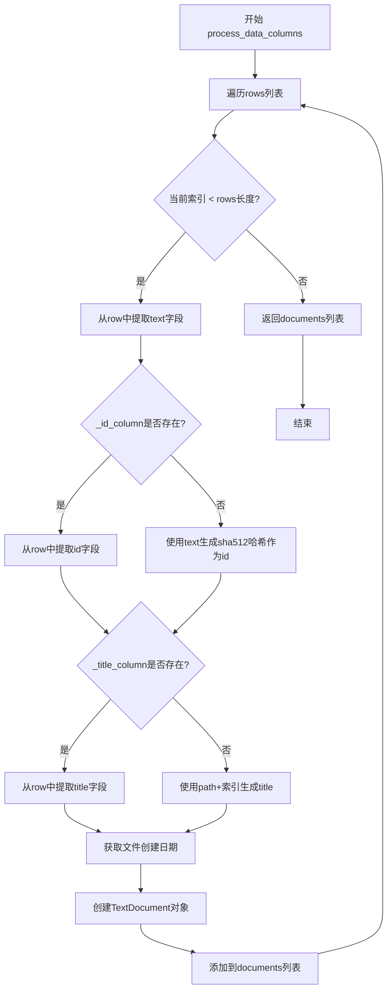
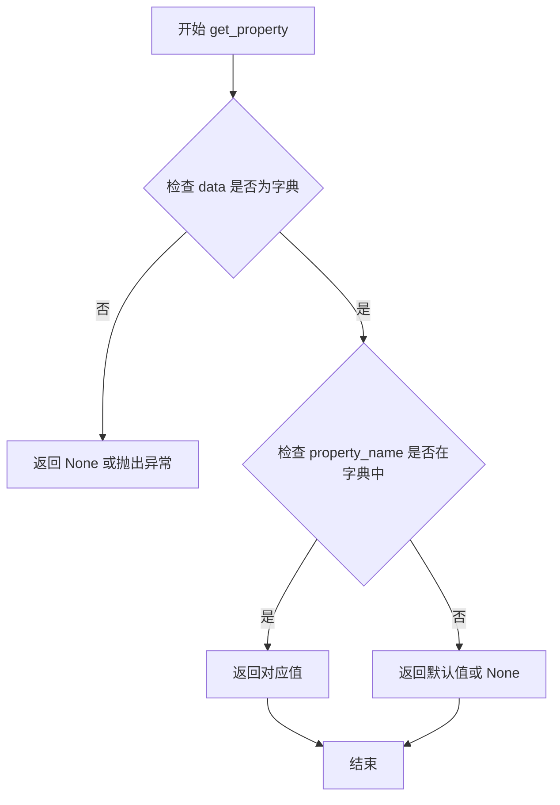
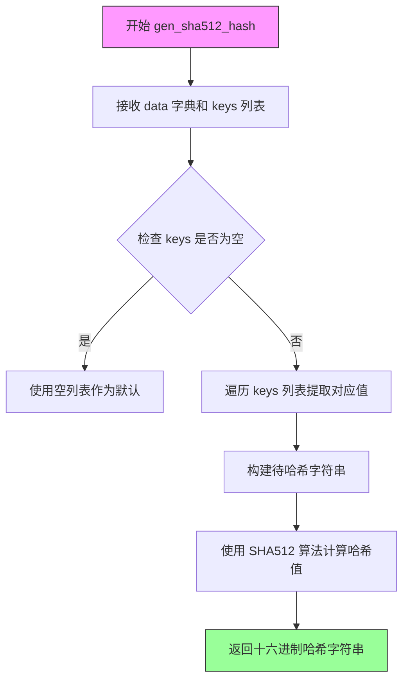
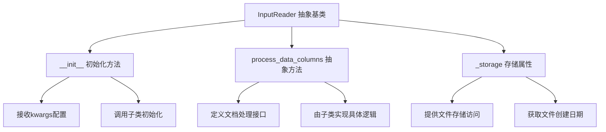
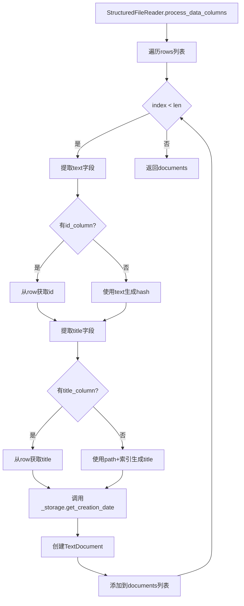
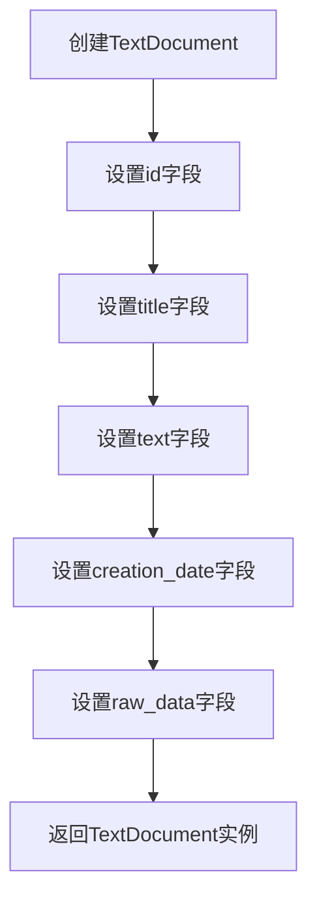
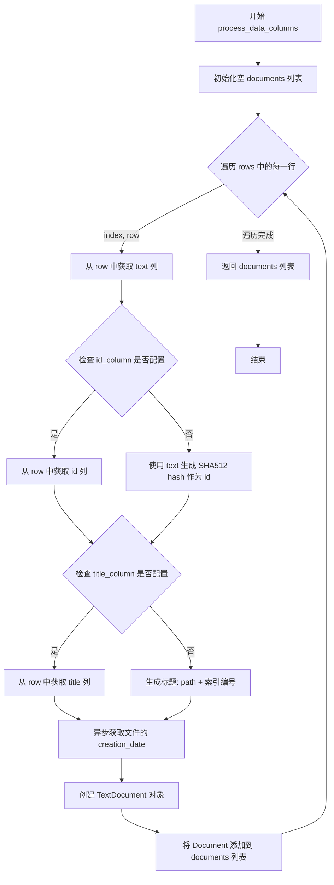

# `graphrag\packages\graphrag-input\graphrag_input\structured_file_reader.py` 详细设计文档

一个用于处理结构化文件（如CSV和JSON）的数据读取器类，支持自定义ID、标题和文本列，并将其转换为TextDocument对象

## 整体流程



## 类结构

```
InputReader (抽象基类/父类)
└── StructuredFileReader (结构化文件读取器)
```

## 全局变量及字段


### `logger`
    
模块级日志记录器，用于记录类运行过程中的日志信息

类型：`logging.Logger`
    


### `logging`
    
Python标准日志模块，提供日志记录功能

类型：`module`
    


### `Any`
    
Python类型注解类型，表示任意类型

类型：`type`
    


### `StructuredFileReader._id_column`
    
可选的ID列名，用于从数据行中获取文档ID

类型：`str | None`
    


### `StructuredFileReader._title_column`
    
可选的标题列名，用于从数据行中获取文档标题

类型：`str | None`
    


### `StructuredFileReader._text_column`
    
必需的文本列名，默认为'text'，用于从数据行中获取文档正文内容

类型：`str`
    
    

## 全局函数及方法


# 函数详细设计文档

由于提供的代码片段中没有 `get_property` 函数的实现源码，仅包含导入语句和使用示例，我将基于其使用方式和功能描述提供详细文档。

---

### `get_property`

从字典中获取属性值的工具函数，用于安全地从数据行（字典）中提取指定列的值。

参数：

- `data`：`dict[str, Any]`，要从中获取属性的字典对象（如 CSV 行或 JSON 对象）
- `property_name`：`str`，要获取的属性名称（列名）

返回值：`Any`，返回字典中指定键的值，如果键不存在可能返回 `None` 或抛出特定异常

#### 流程图



#### 带注释源码

```python
# 该函数定义位于 graphrag_input/get_property.py 模块中
# 以下是基于使用方式的推断实现

from typing import Any

def get_property(data: dict[str, Any], property_name: str) -> Any:
    """
    从字典中获取指定属性名的值。
    
    参数:
        data: 包含数据的字典对象，例如 CSV 行或 JSON 对象
        property_name: 要获取的属性名称（列名）
    
    返回:
        字典中指定键的值，如果键不存在则返回 None
    """
    # 检查数据是否为有效字典
    if not isinstance(data, dict):
        return None
    
    # 使用字典的 get 方法安全获取值，避免 KeyError
    # 如果键不存在，返回 None 作为默认值
    return data.get(property_name, None)
```

---

## 补充说明

### 在 `StructuredFileReader.process_data_columns` 中的使用方式

```python
# 1. 获取必填的 text 字段
text = get_property(row, self._text_column)

# 2. 获取可选的 id 字段（如果未配置则通过 hash 生成）
id = (
    get_property(row, self._id_column)
    if self._id_column
    else gen_sha512_hash({"text": text}, ["text"])
)

# 3. 获取可选的 title 字段（如果未配置则使用文件名）
title = (
    get_property(row, self._title_column)
    if self._title_column
    else f"{path}{num}"
)
```

### 设计意图

- **安全性**：使用 `dict.get()` 方法避免因键不存在导致的 `KeyError` 异常
- **灵活性**：支持从任意结构的字典中按名称提取字段
- **容错性**：当属性不存在时返回 `None`，允许调用方提供默认值或备选方案


### `gen_sha512_hash`

生成 SHA512 哈希值的工具函数，用于将输入数据转换为固定长度的 SHA512 哈希字符串，通常用于生成文档唯一标识符。

参数：

-  `data`：`Dict[Any, Any]`，包含要哈希数据的字典对象，键值对形式存储待哈希的内容
-  `keys`：`List[str]`，指定要参与哈希计算的字典键列表，用于从数据字典中选取特定字段进行哈希

返回值：`str`，返回由 SHA512 算法生成的 128 位十六进制哈希字符串

#### 流程图



#### 带注释源码

```python
def gen_sha512_hash(data: dict[Any, Any], keys: list[str]) -> str:
    """
    生成 SHA512 哈希值
    
    参数:
        data: 包含待哈希数据的字典，如 {"text": "内容"}
        keys: 指定从字典中取值的键列表，如 ["text"]
    
    返回:
        SHA512 哈希值的十六进制字符串表示
    """
    # 导入 hashlib 模块提供 SHA512 算法支持
    import hashlib
    
    # 根据 keys 列表从 data 字典中提取对应的值
    # 如果 keys 为空列表，则使用空字符串
    hash_input = "".join(str(data.get(k, "")) for k in keys) if keys else ""
    
    # 创建 SHA512 哈希对象并计算哈希值
    # encode() 将字符串编码为字节，hexdigest() 返回十六进制字符串
    hash_object = hashlib.sha512(hash_input.encode("utf-8"))
    
    # 返回 128 位的十六进制哈希字符串
    return hash_object.hexdigest()
```

#### 使用示例

```python
# 在 StructuredFileReader 中的调用方式
id = (
    get_property(row, self._id_column)
    if self._id_column
    else gen_sha512_hash({"text": text}, ["text"])
)
# 当没有指定 id_column 时，使用文本内容生成唯一标识
```


### `InputReader`

InputReader是graphrag_input模块中的抽象基类，定义了处理输入文件的标准接口和通用方法。它作为所有具体文件读取器（如StructuredFileReader）的父类，提供了存储访问、配置管理和文档处理的基础框架。

#### 流程图



#### 带注释源码

```
# InputReader 抽象基类定义
# 来源: graphrag_input.input_reader

class InputReader(ABC):
    """Abstract base class for input readers."""
    
    def __init__(self, **kwargs):
        """初始化InputReader基类。
        
        Args:
            **kwargs: 可变关键字参数，用于传递配置选项
        """
        # 存储对象，用于访问文件系统
        self._storage = kwargs.get("storage")
    
    @abstractmethod
    async def process_data_columns(
        self,
        rows: list[dict[str, Any]],
        path: str,
    ) -> list[TextDocument]:
        """处理数据列的抽象方法。
        
        Args:
            rows: 字典列表，每行数据
            path: 文件路径
            
        Returns:
            TextDocument对象列表
        """
        pass
```

### `StructuredFileReader`

StructuredFileReader是InputReader的子类实现，专门用于处理结构化文件（如CSV和JSON）。它从结构化数据中提取文本、ID和标题字段，并将其转换为TextDocument对象。

#### 流程图



#### 带注释源码

```
class StructuredFileReader(InputReader):
    """用于处理csv和json等结构化文件的基类读取器实现。"""

    def __init__(
        self,
        id_column: str | None = None,      # 可选的ID列名
        title_column: str | None = None,   # 可选的标题列名
        text_column: str = "text",         # 必需的文本列名，默认为"text"
        **kwargs,                          # 传递给父类的其他配置
    ):
        super().__init__(**kwargs)         # 调用父类初始化
        self._id_column = id_column         # 存储ID列名
        self._title_column = title_column   # 存储标题列名
        self._text_column = text_column     # 存储文本列名

    async def process_data_columns(
        self,
        rows: list[dict[str, Any]],         # 输入的字典列表数据
        path: str,                          # 文件路径
    ) -> list[TextDocument]:
        """从字典列表中处理配置的数据列。
        
        Args:
            rows: 从文件加载的字典列表
            path: 源文件路径
            
        Returns:
            TextDocument对象列表
        """
        documents = []
        
        # 遍历每一行数据
        for index, row in enumerate(rows):
            # 1. 必需：提取text列
            text = get_property(row, self._text_column)
            
            # 2. 可选：提取id列，否则使用text的hash
            id = (
                get_property(row, self._id_column)
                if self._id_column
                else gen_sha512_hash({"text": text}, ["text"])
            )
            
            # 3. 可选：提取title列，否则使用filename
            num = f" ({index})" if len(rows) > 1 else ""
            title = (
                get_property(row, self._title_column)
                if self._title_column
                else f"{path}{num}"
            )
            
            # 4. 获取文件创建日期
            creation_date = await self._storage.get_creation_date(path)
            
            # 5. 创建并添加TextDocument
            documents.append(
                TextDocument(
                    id=id,
                    title=title,
                    text=text,
                    creation_date=creation_date,
                    raw_data=row,
                )
            )
        
        return documents
```

### 参数信息

#### InputReader.__init__

- `**kwargs`：`dict`，可变关键字参数，用于传递存储配置和其他选项

#### StructuredFileReader.__init__

- `id_column`：`str | None`，可选，用于指定ID来源的列名
- `title_column`：`str | None`，可选，用于指定标题来源的列名
- `text_column`：`str`，必需，默认为"text"，指定文本内容来源的列名
- `**kwargs`：传递给父类的其他参数

#### StructuredFileReader.process_data_columns

- `rows`：`list[dict[str, Any]]`，从文件加载的字典列表
- `path`：`str`，源文件的完整路径

### 返回值

- `process_data_columns`：`list[TextDocument]`，包含处理后的文档对象列表


### `TextDocument`

文本文档数据模型类，用于表示处理后的文本数据实体，包含文档的唯一标识、标题、正文内容、创建日期和原始数据。

参数：

-  `id`：`str`，文档的唯一标识符，用于区分不同文档
-  `title`：`str`，文档标题，可选，默认为文件路径加序号
-  `text`：`str`，文档正文内容，必填字段
-  `creation_date`：`datetime | None`，文档创建日期，从文件系统获取
-  `raw_data`：`dict`，原始数据字典，包含输入文件中的完整数据

返回值：`TextDocument` 实例，文本文档对象

#### 流程图



#### 带注释源码

```python
# 从 graphrag_input.text_document 模块导入 TextDocument 类
from graphrag_input.text_document import TextDocument

# 在 StructuredFileReader.process_data_columns 方法中使用 TextDocument
documents.append(
    TextDocument(
        id=id,                              # 文档唯一标识（手动指定或SHA512哈希生成）
        title=title,                        # 文档标题（手动指定或从文件路径生成）
        text=text,                          # 文档正文内容（必填，从text_column提取）
        creation_date=creation_date,        # 创建日期（从存储系统获取）
        raw_data=row,                       # 原始数据（完整的输入行数据字典）
    )
)
```

#### 补充说明

由于 `TextDocument` 类的完整定义不在当前代码文件中，以上信息是从使用方式推断得出的。从代码中可以看到：

1. **TextDocument 的构造参数**：通过在 `StructuredFileReader.process_data_columns` 方法中的调用可以看出该类接受5个参数
2. **id 的生成逻辑**：如果提供了 `id_column` 则从行数据中提取，否则使用 `gen_sha512_hash` 对文本内容进行哈希生成
3. **title 的生成逻辑**：如果提供了 `title_column` 则从行数据中提取，否则使用文件路径加序号作为标题
4. **creation_date 的获取**：通过 `self._storage.get_creation_date(path)` 异步获取文件创建日期

该类主要用于将结构化文件（如CSV、JSON）中的每行数据转换为统一的文本文档对象，以便后续处理。


### `StructuredFileReader.__init__`

初始化 `StructuredFileReader` 读取器配置，用于从结构化文件（如 CSV、JSON）中读取数据，允许配置 ID 列、标题列和文本列，未指定的列将自动生成默认值。

参数：

- `id_column`：`str | None`，可选，用于从数据行中提取文档 ID 的列名，默认为 `None`（若未指定则根据文本内容生成哈希值）
- `title_column`：`str | None`，可选，用于从数据行中提取文档标题的列名，默认为 `None`（若未指定则使用文件路径）
- `text_column`：`str`，必需，用于从数据行中提取文档正文的列名，默认为 `"text"`
- `**kwargs`：任意关键字参数，传递给父类 `InputReader` 的初始化参数

返回值：`None`，此方法为构造函数，不返回任何值，仅完成对象初始化

#### 流程图

```mermaid
flowchart TD
    A[开始 __init__] --> B[接收参数: id_column, title_column, text_column, **kwargs]
    B --> C[调用 super().__init__**kwargs]
    C --> D[设置实例变量 self._id_column = id_column]
    D --> E[设置实例变量 self._title_column = title_column]
    E --> F[设置实例变量 self._text_column = text_column]
    F --> G[结束 __init__]
    
    style A fill:#e1f5fe
    style G fill:#e8f5e8
```

#### 带注释源码

```python
def __init__(
    self,
    id_column: str | None = None,
    title_column: str | None = None,
    text_column: str = "text",
    **kwargs,
):
    """初始化 StructuredFileReader 实例。
    
    创建一个用于读取结构化文件（CSV、JSON 等）的读取器配置对象。
    
    参数:
        id_column: 可选的列名，用于从数据行中提取文档的唯一标识符。
                   若为 None，则根据文本内容自动生成 SHA512 哈希值作为 ID。
        title_column: 可选的列名，用于从数据行中提取文档标题。
                      若为 None，则使用文件路径作为标题（多文档时附加序号）。
        text_column: 必需的列名，用于从数据行中提取文档正文内容。
                    默认为 "text"。
        **kwargs: 任意关键字参数，将传递给父类 InputReader 的初始化方法，
                 可能包含存储配置等其他参数。
    """
    # 调用父类 InputReader 的初始化方法，传递额外关键字参数
    super().__init__(**kwargs)
    
    # 存储 ID 列名配置，供后续 process_data_columns 方法使用
    self._id_column = id_column
    
    # 存储标题列名配置，供后续 process_data_columns 方法使用
    self._title_column = title_column
    
    # 存储文本列名配置，这是必需的列，用于提取文档正文
    self._text_column = text_column
```


### `StructuredFileReader.process_data_columns`

这是一个异步方法，用于将配置好的数据列从字典列表处理并转换为TextDocument列表，支持可选的ID、标题和文本列配置，同时为每个文档生成创建日期。

参数：

- `rows`：`list[dict[str, Any]]`，要处理的数据行列表，每行是一个包含列数据的字典
- `path`：`str`，源文件路径，用于生成文档标题和获取创建日期

返回值：`list[TextDocument]`转换后的TextDocument对象列表

#### 流程图



#### 带注释源码

```python
async def process_data_columns(
    self,
    rows: list[dict[str, Any]],
    path: str,
) -> list[TextDocument]:
    """Process configured data columns from a list of loaded dicts."""
    # 初始化用于存储转换后文档的列表
    documents = []
    
    # 遍历每一行数据，enumerate用于获取索引
    for index, row in enumerate(rows):
        # ========== 处理必填的 text 字段 ==========
        # 从当前行字典中获取配置好的文本列
        text = get_property(row, self._text_column)
        
        # ========== 处理可选的 id 字段 ==========
        # 如果配置了id_column，则从行数据中获取；否则使用text的hash值作为id
        id = (
            get_property(row, self._id_column)
            if self._id_column
            else gen_sha512_hash({"text": text}, ["text"])
        )
        
        # ========== 处理可选的 title 字段 ==========
        # 如果有多行数据，添加索引编号以区分文档
        num = f" ({index})" if len(rows) > 1 else ""
        # 如果配置了title_column则从行数据获取，否则使用文件路径+索引作为标题
        title = (
            get_property(row, self._title_column)
            if self._title_column
            else f"{path}{num}"
        )
        
        # ========== 获取文件创建日期 ==========
        # 异步调用存储层获取源文件的创建时间
        creation_date = await self._storage.get_creation_date(path)
        
        # ========== 构建 TextDocument 对象 ==========
        # 将处理好的各字段封装为TextDocument对象
        documents.append(
            TextDocument(
                id=id,              # 文档唯一标识
                title=title,        # 文档标题
                text=text,          # 文档内容
                creation_date=creation_date,  # 创建时间
                raw_data=row,       # 保留原始行数据
            )
        )
    
    # 返回转换后的文档列表
    return documents
```

## 关键组件


### StructuredFileReader 类

这是用于读取结构化文件（CSV、JSON等）的基础读取器实现，通过继承InputReader抽象类，实现了从结构化行数据中提取文本、ID和标题并转换为TextDocument对象的功能。

### 文件的整体运行流程

1. 初始化StructuredFileReader时指定id_column、title_column和text_column配置
2. 调用process_data_columns方法传入行数据列表和文件路径
3. 遍历每一行数据，使用get_property从字典中提取text、id、title字段
4. 若未指定id_column则使用gen_sha512_hash基于文本生成哈希作为ID
5. 若未指定title_column则使用文件路径加索引号作为标题
6. 获取文件创建时间，最后构建TextDocument对象返回文档列表

### 类详细信息

#### StructuredFileReader 类

- **类字段**：
  - `_id_column: str | None` - 用于提取文档ID的列名
  - `_title_column: str | None` - 用于提取文档标题的列名
  - `_text_column: str` - 用于提取文档正文的列名，默认为"text"

- **类方法**：
  - `__init__(id_column, title_column, text_column, **kwargs)` - 初始化读取器配置
    - 参数：id_column(str|None) - ID列名, title_column(str|None) - 标题列名, text_column(str) - 文本列名, **kwargs - 父类参数
    - 返回值：无
    - 流程图：
    ```mermaid
    flowchart TD
        A[开始初始化] --> B[调用父类__init__]
        B --> C[设置_id_column]
        C --> D[设置_title_column]
        D --> E[设置_text_column]
        E --> F[结束]
    ```
    - 源码：
    ```python
    def __init__(
        self,
        id_column: str | None = None,
        title_column: str | None = None,
        text_column: str = "text",
        **kwargs,
    ):
        super().__init__(**kwargs)
        self._id_column = id_column
        self._title_column = title_column
        self._text_column = text_column
    ```

  - `async process_data_columns(rows, path)` - 处理数据列并生成文档列表
    - 参数：rows(list[dict[str, Any]]) - 行数据字典列表, path(str) - 文件路径
    - 返回值：list[TextDocument] - TextDocument对象列表
    - 流程图：
    ```mermaid
    flowchart TD
        A[开始处理] --> B[遍历每一行]
        B --> C[提取text字段]
        C --> D{是否指定id_column?}
        D -->|是| E[从行数据获取id]
        D -->|否| F[使用text生成sha512哈希]
        E --> G{是否指定title_column?}
        F --> G
        G -->|是| H[从行数据获取title]
        G -->|否| I[使用path+索引生成title]
        H --> J[获取文件创建时间]
        I --> J
        J --> K[创建TextDocument]
        K --> L{是否还有更多行?}
        L -->|是| B
        L -->|否| M[返回文档列表]
    ```
    - 源码：
    ```python
    async def process_data_columns(
        self,
        rows: list[dict[str, Any]],
        path: str,
    ) -> list[TextDocument]:
        """Process configured data columns from a list of loaded dicts."""
        documents = []
        for index, row in enumerate(rows):
            # text column is required - harvest from dict
            text = get_property(row, self._text_column)
            # id is optional - harvest from dict or hash from text
            id = (
                get_property(row, self._id_column)
                if self._id_column
                else gen_sha512_hash({"text": text}, ["text"])
            )
            # title is optional - harvest from dict or use filename
            num = f" ({index})" if len(rows) > 1 else ""
            title = (
                get_property(row, self._title_column)
                if self._title_column
                else f"{path}{num}"
            )
            creation_date = await self._storage.get_creation_date(path)
            documents.append(
                TextDocument(
                    id=id,
                    title=title,
                    text=text,
                    creation_date=creation_date,
                    raw_data=row,
                )
            )
        return documents
    ```

### 关键组件信息

- **get_property 函数** - 从字典中安全获取指定属性的工具函数，处理属性不存在的情况
- **gen_sha512_hash 函数** - 使用SHA-512算法生成内容哈希值的哈希工具
- **TextDocument 模型** - 表示文本文档的数据模型，包含id、title、text、creation_date、raw_data字段
- **InputReader 抽象基类** - 定义文件读取器接口的抽象基类， StructuredFileReader 继承自此基类

### 潜在的技术债务或优化空间

1. **哈希生成性能问题**：每次处理无ID文档时都重新计算哈希，对于大量文档场景可能存在性能瓶颈，可考虑缓存机制
2. **文件创建时间获取**：process_data_columns方法为async但内部调用storage.get_creation_date是串行执行，对于多文件场景可考虑并行化
3. **缺少错误处理**：get_property调用时未处理属性缺失的异常情况，可能导致程序崩溃
4. **title生成逻辑**：当len(rows)>1时添加索引，但索引格式化逻辑硬编码，若需自定义格式需修改源码
5. **text字段为必需但无校验**：代码注释说明text为必需字段，但实际未对text为空进行校验

### 其它项目

- **设计目标与约束**：支持结构化文件（CSV、JSON）的读取，通过配置化方式灵活指定ID、Title、Text列，ID为可选字段，未指定时自动生成
- **错误处理与异常设计**：依赖get_property处理缺失属性，但未对text字段为空或row格式异常进行处理
- **数据流与状态机**：数据流为 行数据字典列表 → 字段提取 → 文档对象创建 → 返回文档列表，无复杂状态机
- **外部依赖与接口契约**：依赖InputReader基类、get_property工具函数、gen_sha512_hash哈希工具、TextDocument模型、storage存储接口（get_creation_date方法）


## 问题及建议


### 已知问题

-   **变量名覆盖内置函数**：`id` 变量名覆盖了Python内置的 `id()` 函数，可能导致后续代码中出现意外的引用错误
-   **缺少输入验证**：没有验证 `text_column` 对应的值是否存在或为空，如果文本列为空或不存在，程序可能产生无效的文档
-   **缺少错误处理**：`get_property`、`gen_sha512_hash`、`self._storage.get_creation_date` 等方法调用缺少异常捕获机制
-   **重复调用文件元数据**：`creation_date` 在循环中每次都调用 `get_creation_date(path)`，对于大文件会造成不必要的重复I/O操作
-   **缺少空行处理**：如果 `rows` 中包含空字典或无效数据，没有相应的过滤或跳过机制

### 优化建议

-   将变量名 `id` 重命名为 `doc_id` 或 `document_id`，避免覆盖内置函数
-   在处理前添加输入验证：检查 `text_column` 是否存在于行数据中，若不存在则记录警告并跳过该行
-   添加 try-except 块捕获可能的异常，如 `KeyError`、`TypeError` 等，并为每种异常提供明确的日志记录
-   将 `creation_date` 的获取移至循环外部，只在处理文档列表前获取一次，循环中重复使用该值
-   添加空行/无效数据过滤逻辑，跳过空字典或缺少必要字段的行，并记录跳过的行数
-   为 `gen_sha512_hash` 的输入添加空值检查，避免对 None 值进行哈希处理

## 其它


### 设计目标与约束

- **设计目标**：提供统一的方式读取结构化文件（CSV、JSON等），将不同格式的数据转换为标准化的TextDocument对象，支持自定义ID、标题和文本列的映射
- **约束条件**：
  - text_column为必填字段，默认值为"text"
  - id_column和title_column为可选字段
  - 当id_column未指定时，使用文本内容的SHA512哈希值作为文档ID
  - 当title_column未指定时，使用文件路径加索引号作为标题

### 错误处理与异常设计

- **缺失text列**：get_property函数返回None时可能导致问题
- **哈希冲突**：使用SHA512哈希作为ID时存在极低概率的哈希冲突风险
- **文件路径异常**：path参数为空或无效时的处理
- **行数据为空**：rows列表中包含空字典或关键字段缺失的情况
- **异常传播**：process_data_columns中的异常会向上传播到调用者

### 数据流与状态机

- 输入：rows（字典列表）、path（文件路径）
- 处理流程：
  1. 遍历每一行数据
  2. 提取text字段（必选）
  3. 提取或生成id字段
  4. 提取或生成title字段
  5. 获取文件创建时间
  6. 构建TextDocument对象
- 输出：TextDocument列表
- 状态转换：数据加载 → 列映射 → 字段提取 → 文档构建

### 外部依赖与接口契约

- **InputReader**：基类，提供_storage属性
- **get_property**：从字典中安全获取属性
- **gen_sha512_hash**：生成SHA512哈希值
- **TextDocument**：数据模型类
- **_storage.get_creation_date**：异步方法，获取文件创建时间

### 性能考虑

- 逐行处理文档，非流式处理
- 哈希计算在每行数据上执行
- 异步方法但无并发处理
- 大文件时可能导致内存占用较高

### 线程安全

- 无锁机制，不支持多线程并发调用同一实例
- _storage.get_creation_date为异步调用，需确保其线程安全性

### 配置管理

- 通过构造函数传入id_column、title_column、text_column参数
- 支持**kwargs传递给父类
- text_column有默认值"text"，其他列名无默认值

### 日志记录

- 使用模块级logger（__name__）
- 未在代码中显式记录日志

### 测试策略建议

- 测试不同列配置组合
- 测试缺失必选字段的场景
- 测试空rows列表和单行多行场景
- 测试哈希生成和文件名处理逻辑

### 版本兼容性

- Python 3.10+类型注解（str | None）
- asyncio异步支持
- 依赖typing.Any


    