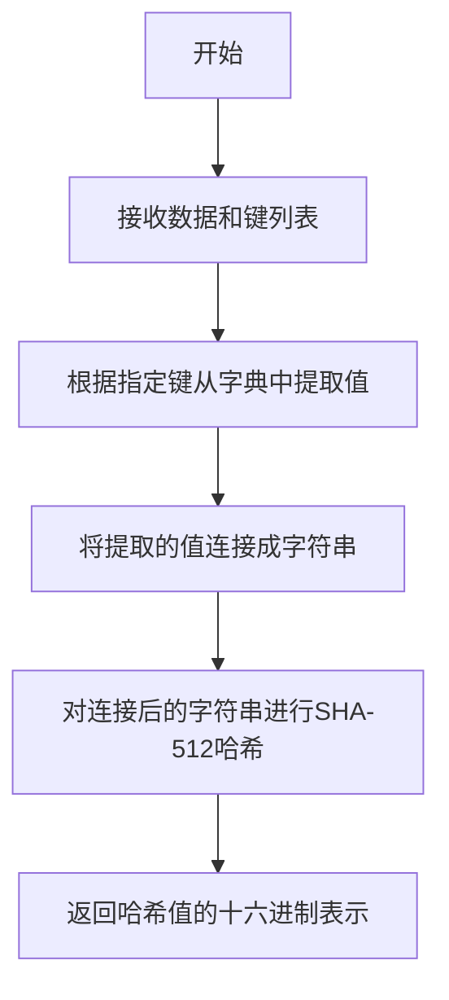
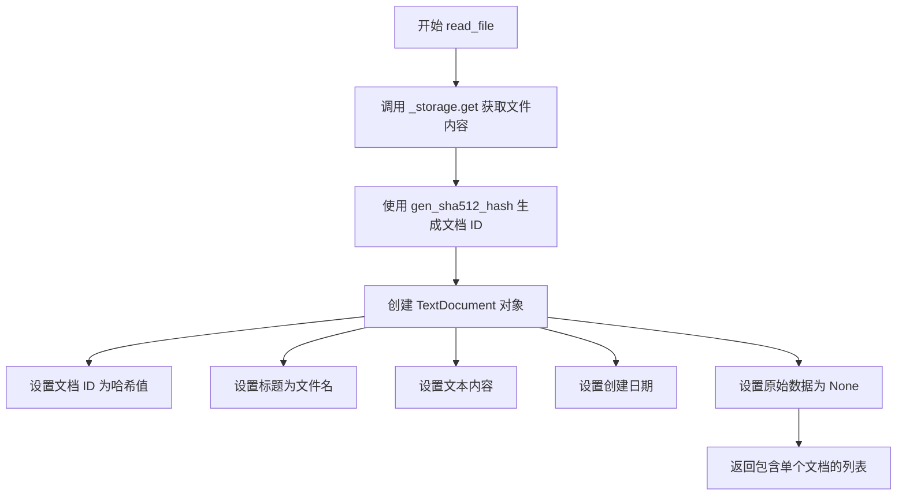
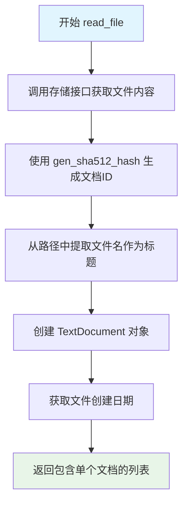

# `graphrag\packages\graphrag-input\graphrag_input\text.py` 详细设计文档

一个文本文件读取器实现类，继承自InputReader，用于读取文本文件并将每行内容转换为TextDocument对象，支持通过文件模式匹配特定文件。

## 整体流程

```mermaid
graph TD
    A[开始] --> B[初始化 TextFileReader]
    B --> C{调用 read_file(path)}
    C --> D[从存储读取文件内容]
    D --> E[生成 SHA512 哈希作为文档ID]
E --> F[提取文件名作为文档标题]
F --> G[获取文件创建日期]
G --> H[创建 TextDocument 对象]
H --> I[返回包含单个文档的列表]
```

## 类结构

```
InputReader (抽象基类)
└── TextFileReader (文本文件读取器实现)
```

## 全局变量及字段


### `logger`
    
模块级logger实例，用于记录类内部日志

类型：`logging.Logger`
    


### `TextFileReader.file_pattern`
    
文件匹配正则表达式模式，用于过滤要读取的文本文件，默认为.*\.txt$

类型：`str | None`
    


### `TextFileReader._storage`
    
存储适配器对象，继承自InputReader父类，用于异步读取文件内容

类型：`StorageAdapter (继承自父类)`
    


### `TextFileReader._encoding`
    
文件编码类型，继承自InputReader父类，用于解码文件文本内容

类型：`str (继承自父类)`
    
    

## 全局函数及方法


### `gen_sha512_hash`

生成给定数据的 SHA-512 哈希值，用于创建文档的唯一标识符。

参数：

- `data`：`Dict[str, Any]`，包含要哈希数据的字典
- `keys`：`List[str]`，用于生成哈希的键列表

返回值：`str`，返回 SHA-512 哈希值的十六进制字符串

#### 流程图



#### 带注释源码

```python
def gen_sha512_hash(data: dict, keys: list) -> str:
    """生成数据的SHA-512哈希值。
    
    Args:
        data: 包含要哈希数据的字典，例如 {"text": "内容"}
        keys: 要用于生成哈希的键列表，例如 ["text"]
        
    Returns:
        str: SHA-512哈希值的十六进制字符串
    """
    # 根据指定的键从字典中提取相应的值
    # 构建待哈希的字符串
    hash_input = "".join(str(data[k]) for k in keys)
    
    # 使用hashlib对输入进行SHA-512哈希
    hash_object = hashlib.sha512(hash_input.encode('utf-8'))
    
    # 返回哈希值的十六进制表示
    return hash_object.hexdigest()
```

> **注意**：由于源代码中仅展示了该函数的调用方式，以上源码为基于调用上下文的推断实现。实际实现可能包含额外的错误处理、编码处理或其他逻辑。


### `TextFileReader.read_file`

这是一个异步方法，用于将文本文件读取为 `TextDocument` 对象列表。方法通过存储接口获取文件内容，使用 SHA512 哈希算法生成文档 ID，并构建包含文件标题、文本内容、创建日期等元数据的 `TextDocument` 对象。

参数：

- `path`：`str`，要读取的文件的路径

返回值：`list[TextDocument]`，包含文件内容的 `TextDocument` 对象列表，每个文件对应一个文档对象

#### 流程图



#### 带注释源码

```python
async def read_file(self, path: str) -> list[TextDocument]:
    """Read a text file into a list of documents.

    Args:
        - path - The path to read the file from.

    Returns
    -------
        - output - list with a TextDocument for each row in the file.
    """
    # 使用异步存储接口获取文件内容，传入路径和编码格式
    text = await self._storage.get(path, encoding=self._encoding)
    
    # 创建 TextDocument 文档对象
    document = TextDocument(
        # 使用 SHA512 哈希算法对文本内容生成唯一标识符
        id=gen_sha512_hash({"text": text}, ["text"]),
        # 使用文件名作为文档标题
        title=str(Path(path).name),
        # 文档的完整文本内容
        text=text,
        # 异步获取文件的创建时间戳
        creation_date=await self._storage.get_creation_date(path),
        # 原始数据保留为空，可用于后续扩展
        raw_data=None,
    )
    # 返回包含单个文档对象的列表
    return [document]
```


### `TextDocument`

TextDocument 是 graphrag_input.text_document 模块中导入的数据类，用于表示文本文件的文档对象，包含文档的唯一标识、标题、文本内容、创建日期和原始数据等信息。

参数：

- `id`：str，通过 SHA512 哈希算法对文档内容生成的唯一标识
- `title`：str，文档标题，通常为文件名
- `text`：str，文档的完整文本内容
- `creation_date`：datetime | None，文档的创建日期时间
- `raw_data`：Any，原始数据字段，此处传入 None

返回值：`TextDocument`，返回构造完成的 TextDocument 实例对象

#### 流程图

```mermaid
flowchart TD
    A[开始创建 TextDocument] --> B[生成文档ID<br/>gen_sha512_hash]
    B --> C[提取文件名作为标题<br/>Path(path).name]
    C --> D[获取文件文本内容]
    D --> E[获取文件创建日期<br/>storage.get_creation_date]
    E --> F[设置raw_data为None]
    F --> G[构造TextDocument实例]
    G --> H[返回包含id/title/text/creation_date/raw_data的文档对象]
```

#### 带注释源码

```python
# 在 TextFileReader.read_file 方法中创建 TextDocument 的代码

# 1. 从文件路径读取文本内容
text = await self._storage.get(path, encoding=self._encoding)

# 2. 使用 SHA512 哈希生成文档唯一标识
document = TextDocument(
    # 对文本内容生成哈希值作为文档 ID
    id=gen_sha512_hash({"text": text}, ["text"]),
    # 使用文件名作为文档标题
    title=str(Path(path).name),
    # 完整的文本内容
    text=text,
    # 从存储获取文件的创建日期
    creation_date=await self._storage.get_creation_date(path),
    # 原始数据保留为空
    raw_data=None,
)

# 3. 返回包含单个文档的列表
return [document]
```

---

**补充说明**

- TextDocument 类是从 `graphrag_input.text_document` 模块导入的外部类，其完整定义未在本文件中展示
- 该类在 TextFileReader 中实例化，用于将文本文件转换为统一的文档对象格式
- 文档 ID 通过对文本内容进行 SHA512 哈希生成，确保相同内容生成相同的 ID
- creation_date 依赖于存储后端实现（self._storage.get_creation_date）
- 返回类型为 `list[TextDocument]`，即使只有一个文档也包装为列表返回


### `TextFileReader.__init__`

初始化 `TextFileReader` 类的实例，调用父类 `InputReader` 的构造函数，并设置默认的文件匹配模式为 `.txt$`（匹配所有文本文件）。

参数：

- `file_pattern`：`str | None`，可选参数，指定要读取的文件名匹配模式，默认为 `".*\\.txt$"`（匹配所有以 `.txt` 结尾的文件）
- `**kwargs`：可变关键字参数，用于传递其他可选参数给父类 `InputReader`

返回值：`None`，无返回值（构造函数）

#### 流程图

```mermaid
flowchart TD
    A[开始 __init__] --> B{file_pattern 是否为 None?}
    B -->|是| C[使用默认模式 ".*\\.txt$"]
    B -->|否| D[使用传入的 file_pattern]
    C --> E[调用父类 InputReader.__init__]
    D --> E
    E --> F[结束]
```

#### 带注释源码

```python
def __init__(self, file_pattern: str | None = None, **kwargs):
    """初始化 TextFileReader 实例。

    Args:
        file_pattern: 可选的文件名匹配正则表达式，默认为 ".*\\.txt$"
                     用于指定要读取的文件类型
        **kwargs: 传递给父类 InputReader 的其他关键字参数

    Returns:
        None
    """
    # 调用父类 InputReader 的构造函数
    # 如果 file_pattern 为 None，则使用默认的 ".*\\.txt$" 模式
    super().__init__(
        file_pattern=file_pattern if file_pattern is not None else ".*\\.txt$",
        **kwargs,
    )
```


### `TextFileReader.read_file`

该方法是一个异步文件读取方法，用于读取文本文件并将其转换为TextDocument对象列表。它通过存储接口获取文件内容，生成文档ID哈希，并返回包含文件元数据的TextDocument列表。

参数：

- `path`：`str`，要读取的文件的路径

返回值：`list[TextDocument]`，包含文件中每行文本的TextDocument列表（实际上整个文件作为一个文档返回）

#### 流程图



#### 带注释源码

```python
async def read_file(self, path: str) -> list[TextDocument]:
    """Read a text file into a list of documents.

    Args:
        - path - The path to read the file from.

    Returns
    -------
        - output - list with a TextDocument for each row in the file.
    """
    # 通过存储接口异步读取文件内容，指定编码格式
    text = await self._storage.get(path, encoding=self._encoding)
    
    # 创建TextDocument文档对象
    document = TextDocument(
        # 使用SHA512哈希算法对文本内容生成唯一文档ID
        id=gen_sha512_hash({"text": text}, ["text"]),
        # 从文件路径中提取文件名作为文档标题
        title=str(Path(path).name),
        # 文件的完整文本内容
        text=text,
        # 异步获取文件的创建日期时间戳
        creation_date=await self._storage.get_creation_date(path),
        # 原始数据设置为None，表示已处理过的数据
        raw_data=None,
    )
    # 返回包含单个文档的列表（注意：虽然文档描述说每行一个，但实际上整个文件作为一个文档）
    return [document]
```

## 关键组件


### TextFileReader 类

文本文件读取器实现，继承自InputReader基类，负责将文本文件异步读取为TextDocument对象列表

### read_file 异步方法

异步读取文本文件内容，通过_storage抽象获取文件数据，生成SHA512哈希作为文档ID，返回包含单个TextDocument的列表

### TextDocument 模型

文档数据模型，包含id、title、text、creation_date、raw_data等字段，用于表示读取后的文档结构

### InputReader 基类

抽象基类，定义了文件读取器的接口契约，包含_storage、_encoding等属性和read_file方法签名

### gen_sha512_hash 函数

哈希生成工具函数，根据文本内容生成SHA512哈希值，用于生成文档唯一标识符

### _storage 存储抽象

异步存储接口，负责实际的文件读取操作，支持get方法和get_creation_date方法

### _encoding 编码属性

文件编码格式配置，用于指定读取文本文件时使用的字符编码

### 文件模式匹配

通过file_pattern参数支持自定义文件过滤，默认匹配.txt结尾的文件


## 问题及建议


### 已知问题

-   **异常处理缺失**：`read_file`方法未捕获文件读取、编码、解码或存储访问可能抛出的异常（如FileNotFoundError、UnicodeDecodeError、IOError等），可能导致程序直接崩溃
-   **输入验证不足**：未对`path`参数进行有效性验证，空路径或非法路径可能导致未定义行为
-   **哈希计算性能隐患**：对整个文件内容调用`gen_sha512_hash`计算哈希，对于大文件会一次性加载全部内容到内存，可能导致内存溢出或性能瓶颈
-   **创建日期获取无容错**：`await self._storage.get_creation_date(path)`调用未做异常捕获，如果存储后端不支持或返回错误，将导致整个读取失败
-   **硬编码正则表达式**：`".*\\.txt$"`作为默认文件模式，但未考虑不同操作系统路径分隔符差异
-   **文档字符串不完整**：未说明可能抛出的异常、返回值可能为空的情况以及编码相关的约束

### 优化建议

-   添加try-except块包裹文件读取逻辑，为不同类型的异常提供具体的错误处理和日志记录
-   在`read_file`入口处验证path参数非空且符合路径规范，使用`Path`对象进行规范化处理
-   对于大文件考虑流式读取或分块计算哈希，避免一次性加载全部内容
-   为`get_creation_date`调用添加可选的异常处理，失败时使用备选方案（如当前时间或None）
-   考虑将文件模式配置化，或使用`pathlib`提供的跨平台路径匹配方式
-   完善文档字符串，添加`Raises`部分说明可能抛出的异常类型
-   考虑添加重试机制处理临时性存储故障


## 其它


### 设计目标与约束

本模块的设计目标是实现一个轻量级的文本文件读取器，用于将本地文本文件转换为系统内部统一的文档对象格式。约束条件包括：仅支持 .txt 文件（可通过 file_pattern 参数自定义），依赖异步 I/O 操作，必须配合 Storage 存储抽象层使用，且所有文件路径均需通过 Storage 接口访问。

### 错误处理与异常设计

本模块主要依赖上层 InputReader 基类处理异常，包括文件不存在、权限不足、编码错误等场景。read_file 方法未显式捕获异常，异常将向上传播至调用方。潜在的异常场景包括：Storage.get() 抛出文件读取异常、Storage.get_creation_date() 失败、gen_sha512_hash() 抛入异常等。调用方应准备处理 FileNotFoundError、PermissionError、UnicodeDecodeError 等异常。

### 数据流与状态机

数据流为：调用方传入文件路径 → read_file 调用 Storage.get() 读取文件内容 → 生成 SHA512 哈希作为文档 ID → 构建 TextDocument 对象 → 返回包含单个文档的列表。无状态机设计，本类为无状态工具类，每次调用独立。

### 外部依赖与接口契约

主要依赖包括：InputReader 基类（定义接口契约）、TextDocument 模型类（定义输出数据结构）、gen_sha512_hash 工具函数（生成文档 ID）、Storage 存储抽象（提供文件读取和元数据获取）。Storage 接口需实现 get(path, encoding) 和 get_creation_date(path) 方法。

### 性能考虑

文件内容整体读入内存后一次性处理，大文件场景需注意内存占用。哈希计算对大文件有一定性能开销，可考虑流式读取或缓存策略。当前实现为同步返回列表但方法声明为 async，内部的 Storage 调用应为异步实现。

### 安全性考虑

未对文件内容进行消毒处理，TextDocument.text 直接存储原始内容。文件路径需确保安全，避免路径遍历攻击（依赖 Storage 实现层防护）。SHA512 哈希使用文本内容生成，可用于去重但无法防止哈希碰撞攻击。

### 配置参数说明

file_pattern 参数用于匹配目标文件，默认为 ".*\\.txt$" 正则表达式。kwargs 参数透传至基类，可能包含 _storage（存储实例）、_encoding（文本编码，默认为 utf-8）等配置。

### 使用示例

```python
reader = TextFileReader()
documents = await reader.read_file("/data/sample.txt")
for doc in documents:
    print(f"ID: {doc.id}, Title: {doc.title}")
```

    