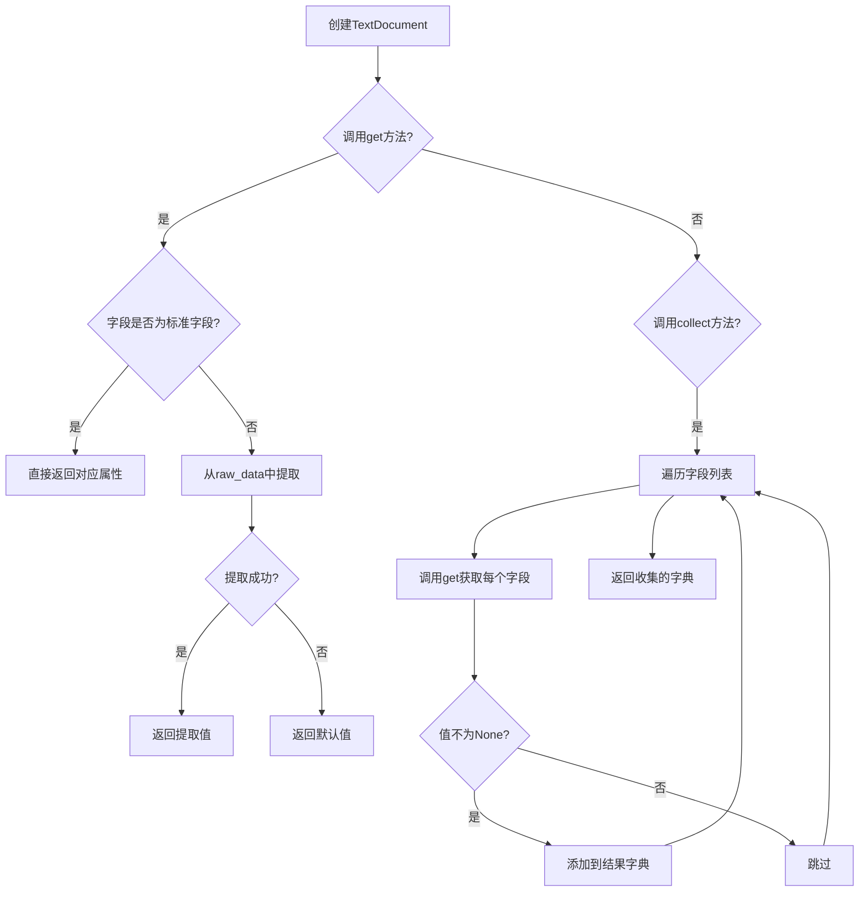
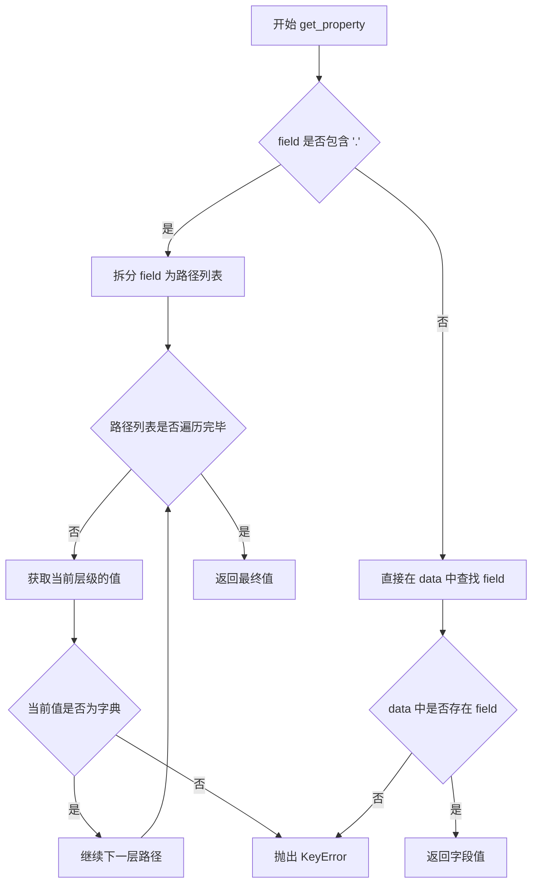
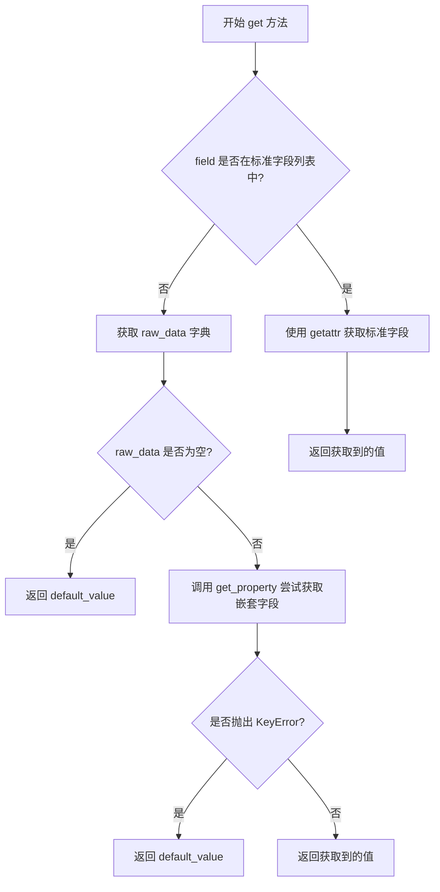
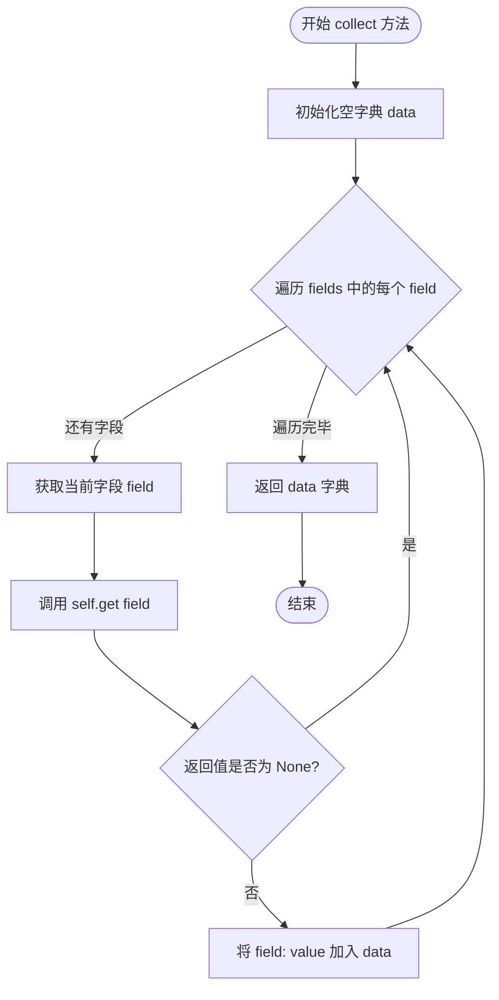
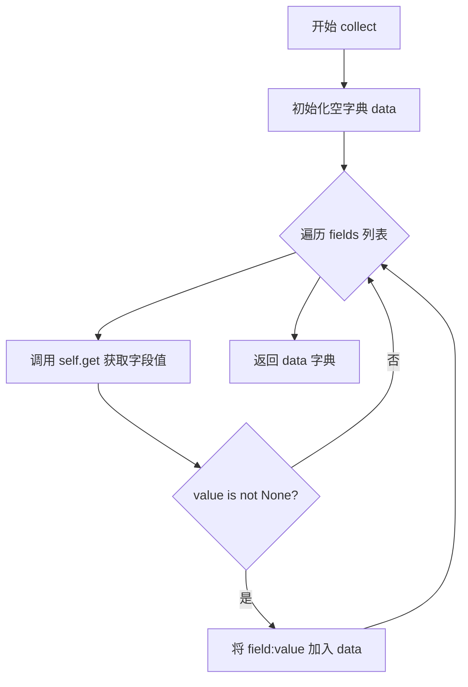

# `graphrag\packages\graphrag-input\graphrag_input\text_document.py` 详细设计文档

TextDocument是一个数据类，用于封装GraphRAG索引的文本文档内容，支持从标准字段和原始数据中提取字段值。

## 整体流程



## 类结构

```
TextDocument (数据类)
└── 字段: id, text, title, creation_date, raw_data
└── 方法: get, collect
```

## 全局变量及字段


### `logger`
    
模块级日志记录器，用于记录类和方法的日志信息

类型：`logging.Logger`
    


### `TextDocument.id`
    
文档唯一标识符

类型：`str`
    


### `TextDocument.text`
    
文档主要文本内容

类型：`str`
    


### `TextDocument.title`
    
文档标题

类型：`str`
    


### `TextDocument.creation_date`
    
文档创建日期，ISO-8601格式

类型：`str`
    


### `TextDocument.raw_data`
    
源文档的原始数据

类型：`dict[str, Any] | None`
    
    

## 全局函数及方法


### `get_property`

从原始数据字典中提取指定字段的值，支持嵌套字段的点号路径访问，当字段不存在时抛出 KeyError 异常。

参数：

- `data`：`dict[str, Any]`，原始数据字典
- `field`：`str`，要提取的字段名，支持点号分隔的嵌套路径（如 "user.name"）

返回值：`Any`，返回字段对应的值；如果字段不存在则抛出 KeyError

#### 流程图



#### 带注释源码

```python
def get_property(data: dict[str, Any], field: str) -> Any:
    """
    从 data 字典中提取指定 field 的值。
    
    支持嵌套字段访问，使用点号分隔路径。
    例如：field="user.profile.name" 会依次访问 data["user"]["profile"]["name"]
    
    参数:
        data: 原始数据字典
        field: 要提取的字段名，支持点号分隔的嵌套路径
    
    返回:
        字段对应的值
    
    异常:
        KeyError: 当指定的字段路径不存在时抛出
    """
    # 如果字段名中包含点号，表示是嵌套路径
    if "." in field:
        # 将路径拆分为列表，如 "a.b.c" -> ["a", "b", "c"]
        parts = field.split(".")
        # 逐层遍历字典
        current = data
        for part in parts:
            # 如果当前值是字典，继续深入一层
            if isinstance(current, dict):
                current = current[part]
            else:
                # 路径中的某个部分对应的值不是字典，抛出异常
                raise KeyError(field)
        # 返回最终找到的值
        return current
    
    # 非嵌套字段，直接从字典中获取
    return data[field]
```


### `TextDocument.get`

获取 TextDocument 对象中指定字段的值，支持标准字段和嵌套字段，若字段不存在则返回默认值。

参数：

-  `field`：`str`，要获取的字段名称，支持点号分隔的嵌套字段（如 "author.name"）
-  `default_value`：`Any`，可选，默认为 `None`，当字段不存在时返回的默认值

返回值：`Any`，返回指定字段的值，若不存在则返回默认值

#### 流程图



#### 带注释源码

```python
def get(self, field: str, default_value: Any = None) -> Any:
    """
    Get a single field from the TextDocument.

    Functions like the get method on a dictionary, returning default_value if the field is not found.

    Supports nested fields using dot notation.

    This takes a two step approach for flexibility:
    1. If the field is one of the standard text document fields (id, title, text, creation_date), just grab it directly. This accommodates unstructured text for example, which just has the standard fields.
    2. Otherwise. try to extract it from the raw_data dict. This allows users to specify any column from the original input file.

    """
    # 步骤1：检查是否为标准文档字段
    if field in ["id", "title", "text", "creation_date"]:
        # 使用 getattr 直接从对象属性获取值
        return getattr(self, field)

    # 步骤2：从 raw_data 中获取自定义字段
    # 获取原始数据字典，若为 None 则使用空字典
    raw = self.raw_data or {}
    try:
        # 使用 get_property 函数尝试获取嵌套字段
        return get_property(raw, field)
    except KeyError:
        # 若字段不存在，返回默认值
        return default_value
```


### `TextDocument.collect`

该方法接收一个字段名称列表，遍历调用内部 `get` 方法提取文档中的对应字段值，并将所有非空字段值打包成字典返回，实现从文档中批量提取指定数据的功能。

参数：

- `fields`：`list[str]`，需要提取的字段名称列表

返回值：`dict[str, Any]`，从文档中提取的字段字典

#### 流程图



#### 带注释源码

```python
def collect(self, fields: list[str]) -> dict[str, Any]:
    """Extract data fields from a TextDocument into a dict."""
    # 初始化结果字典，用于存储提取的字段
    data = {}
    
    # 遍历请求的每个字段名称
    for field in fields:
        # 调用 get 方法获取字段值（支持标准字段和 raw_data 中的嵌套字段）
        value = self.get(field)
        
        # 仅保存非 None 的值，跳过未找到的字段
        if value is not None:
            data[field] = value
    
    # 返回提取的字段字典
    return data
```

## 关键组件


## 一段话描述

TextDocument 是一个用于 GraphRAG 索引的数据类，封装了文档的核心元数据（id、text、title、creation_date）和原始数据，支持通过 get 方法灵活获取标准字段或从 raw_data 中提取任意嵌套属性，以及通过 collect 方法批量收集指定字段。

## 文件的整体运行流程

1. 定义 TextDocument 数据类及其五个字段
2. 提供 get 方法获取单个字段，支持标准字段直接访问和 raw_data 嵌套属性提取
3. 提供 collect 方法批量提取多个字段并返回字典
4. 外部通过实例化 TextDocument 并调用 get/collect 方法获取文档数据

## 类的详细信息

### TextDocument 类

**类字段：**
- `id: str` - 文档的唯一标识符
- `text: str` - 文档的主要文本内容
- `title: str` - 文档标题
- `creation_date: str` - 文档创建日期，ISO-8601 格式
- `raw_data: dict[str, Any] | None` - 源文档的原始数据字典

**类方法：**

#### get 方法

- **名称**: get
- **参数**: 
  - `field: str` - 要获取的字段名称，支持点号分隔的嵌套字段
  - `default_value: Any = None` - 字段不存在时返回的默认值
- **参数类型**: field: str, default_value: Any
- **参数描述**: 获取单个字段值，支持标准字段和 raw_data 中的嵌套属性
- **返回值类型**: Any
- **返回值描述**: 字段值或默认值
- **mermaid 流程图**:
```mermaid
flowchart TD
    A[开始 get] --> B{field in [id, title, text, creation_date]?}
    B -->|是| C[直接 getattr 获取]
    B -->|否| D[获取 raw_data]
    D --> E{raw_data 是否存在?}
    E -->|否| F[返回 default_value]
    E -->|是| G[调用 get_property 提取嵌套属性]
    G --> H{是否抛出 KeyError?}
    H -->|是| F
    H -->|否| I[返回属性值]
    C --> I
```
- **带注释源码**:
```python
def get(self, field: str, default_value: Any = None) -> Any:
    """
    Get a single field from the TextDocument.

    Functions like the get method on a dictionary, returning default_value if the field is not found.

    Supports nested fields using dot notation.

    This takes a two step approach for flexibility:
    1. If the field is one of the standard text document fields (id, title, text, creation_date), just grab it directly. This accommodates unstructured text for example, which just has the standard fields.
    2. Otherwise. try to extract it from the raw_data dict. This allows users to specify any column from the original input file.

    """
    # 步骤1: 检查是否为标准字段
    if field in ["id", "title", "text", "creation_date"]:
        return getattr(self, field)

    # 步骤2: 从 raw_data 中提取嵌套属性
    raw = self.raw_data or {}
    try:
        return get_property(raw, field)
    except KeyError:
        return default_value
```

#### collect 方法

- **名称**: collect
- **参数**: 
  - `fields: list[str]` - 要收集的字段名称列表
- **参数类型**: fields: list[str]
- **参数描述**: 批量提取指定字段列表中的非空值
- **返回值类型**: dict[str, Any]
- **返回值描述**: 包含所请求字段及其值的字典
- **mermaid 流程图**:

- **带注释源码**:
```python
def collect(self, fields: list[str]) -> dict[str, Any]:
    """Extract data fields from a TextDocument into a dict."""
    data = {}
    for field in fields:
        value = self.get(field)
        if value is not None:
            data[field] = value
    return data
```

### 全局函数

#### get_property 函数

- **名称**: get_property
- **参数**: 
  - `data: dict` - 数据字典
  - `field: str` - 字段名称，支持点号嵌套
- **参数类型**: data: dict, field: str
- **参数描述**: 从字典中按点号路径获取嵌套属性
- **返回值类型**: Any
- **返回值描述**: 嵌套属性的值
- **描述**: 外部导入的辅助函数，用于支持字典嵌套键访问

## 关键组件信息

### TextDocument 数据类

用于 GraphRAG 索引的文档数据结构，封装标准字段和原始数据

### get 方法

支持标准字段直接访问和 raw_data 嵌套属性提取的双阶段字段获取机制

### collect 方法

批量字段收集器，将多个字段聚合为字典返回

### get_property 函数

外部依赖的嵌套属性提取工具，支持点号 notation

## 潜在的技术债务或优化空间

1. **类型提示不完整**: get_property 函数未在文件中定义，依赖外部导入，类型安全性不足
2. **异常处理单一**: get 方法仅捕获 KeyError，其他异常（如属性访问错误）可能导致程序中断
3. **默认值处理**: collect 方法排除 None 值，但无法区分"字段不存在"和"字段值为 None"
4. **性能考虑**: 每次调用 get 都会重新解析嵌套字段，批量访问时效率较低
5. **文档字段硬编码**: 标准字段列表硬编码在方法中，扩展性受限

## 其它项目

### 设计目标与约束
- 目标：提供灵活的文档数据访问接口，支持标准字段和自定义字段
- 约束：依赖外部 get_property 函数处理嵌套属性

### 错误处理与异常设计
- get 方法捕获 KeyError 返回默认值，其他异常上抛
- collect 方法静默跳过 None 值

### 数据流与状态机
- 数据流：raw_data → get_property 解析 → 返回值
- 状态机：标准字段优先查询 → raw_data 降级查询

### 外部依赖与接口契约
- 依赖：graphrag_input.get_property.get_property 函数
- 接口契约：get_property 接收 dict 和 str，返回任意类型值，抛出 KeyError 表示字段不存在


## 问题及建议


### 已知问题

- **异常处理不完整**：`get_property` 函数可能抛出多种异常（除 KeyError 外，还可能有 AttributeError、TypeError 等），当前只捕获 KeyError，可能导致未捕获的异常传播
- **字段列表硬编码**：标准字段列表 `["id", "title", "text", "creation_date"]` 硬编码在 get 方法中，新增字段需要同步修改，否则可能导致不一致
- **类型验证缺失**：creation_date 声明为 str 类型但期望 ISO-8601 格式，没有运行时验证；raw_data 也没有结构验证
- **collect 方法优先级问题**：当 raw_data 中存在与标准字段同名的键时，会返回 raw_data 中的值而非标准属性值，可能导致意外行为
- **日志未充分利用**：定义了 logger 但未在任何地方使用，失去了调试和监控的能力

### 优化建议

- 完善异常处理，捕获更广泛的异常类型或使用更通用的异常处理
- 将标准字段列表提取为类常量或使用反射机制自动获取字段
- 添加 `__post_init__` 方法进行字段验证，特别是 creation_date 的 ISO-8601 格式验证
- 在 collect 方法中明确优先级逻辑，或添加参数控制是否覆盖
- 考虑添加日志记录，特别是在异常处理路径中
- 考虑添加类型验证库（如 pydantic）来替代 dataclass 以获得更强大的验证能力

## 其它


### 设计目标与约束

该代码的设计目标是提供一个轻量级的数据结构来存储和访问文本文档内容，支持从标准字段和原始数据中灵活提取字段。约束包括：1) 必须继承自dataclass以提供自动生成的__init__等方法；2) 依赖外部的get_property函数进行嵌套属性提取；3) raw_data字段为可选，默认为None。

### 错误处理与异常设计

代码中的错误处理主要体现在get()方法中：当字段不在标准字段列表中时，会尝试从raw_data中提取，如果抛出KeyError则返回default_value。这种设计采用静默失败策略，吞掉异常并返回默认值，可能导致调试困难。建议在日志级别启用debug模式以便追踪字段缺失情况。collect()方法不会抛出异常，只收集非None值。

### 数据流与状态机

TextDocument的数据流如下：1) 初始化时接收id、text、title、creation_date和可选的raw_data；2) get()方法根据字段名决定数据来源——标准字段直接返回属性值，自定义字段从raw_data字典中提取；3) collect()方法循环调用get()收集多个字段到字典中。状态机相对简单，主要状态是raw_data的存在与否，raw_data为None时get()方法的行为会不同。

### 外部依赖与接口契约

外部依赖包括：1) logging模块用于日志记录；2) dataclasses.dataclass装饰器；3) typing模块的Any类型；4) graphrag_input.get_property模块的get_property函数。接口契约方面：get_property函数签名应为get_property(data: dict, field: str) -> Any，会抛出KeyError异常；TextDocument的get()方法接受field: str和default_value: Any=None参数，返回Any类型；collect()方法接受fields: list[str]参数，返回dict[str, Any]。

### 性能考虑

潜在的性能问题：1) 每次调用get()方法时，如果field不在标准字段列表中，都会尝试调用get_property，可能导致频繁的字典查找和异常捕获；2) collect()方法在处理大量字段时会有多次get()调用。建议：对于频繁访问的字段，可以考虑缓存机制；get_property的调用结果可以缓存以避免重复解析。

### 安全性考虑

代码本身不直接处理用户输入，但get()和collect()方法接受外部传入的field参数，存在注入风险——恶意构造的field参数可能导致访问敏感数据或触发意外行为。建议对field参数进行验证，限制只能访问预定义的允许字段列表。

### 兼容性考虑

代码使用Python 3.10+的联合类型语法(dict[str, Any] | None)，不支持Python 3.9及更早版本。dataclass装饰器需要Python 3.7+。建议在项目requirements中明确Python版本要求，或使用typing.Union进行兼容。

### 使用示例

```python
# 创建TextDocument
doc = TextDocument(
    id="doc1",
    text="This is sample text content",
    title="Sample Document",
    creation_date="2024-01-15T10:30:00Z",
    raw_data={"author": "John Doe", "category": "tech"}
)

# 获取标准字段
doc.get("id")  # 返回 "doc1"
doc.get("title")  # 返回 "Sample Document"

# 获取自定义字段
doc.get("author")  # 返回 "John Doe"
doc.get("nonexistent", "N/A")  # 返回 "N/A"

# 使用嵌套字段（如果raw_data支持）
doc.get("metadata.page_count")  # 依赖get_property实现

# 批量收集字段
doc.collect(["id", "title", "author"])  # 返回 {"id": "doc1", "title": "Sample Document", "author": "John Doe"}
```

### 版本历史

无版本历史记录，建议在代码头部添加版本信息和变更日志。

    