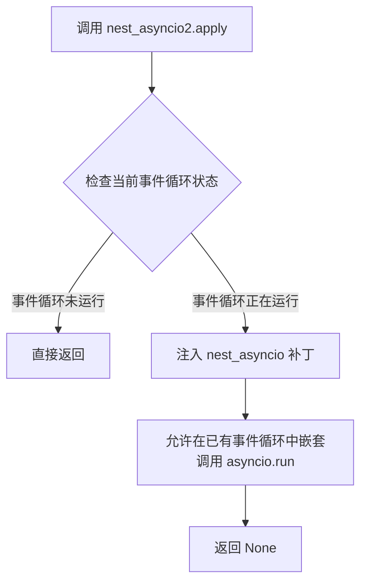

# `graphrag\packages\graphrag-llm\graphrag_llm\__init__.py` 详细设计文档

GraphRAG LLM 包的初始化模块，通过导入并应用 nest_asyncio2 库来解决 Python 异步事件循环的嵌套执行问题，使异步代码能够在已运行的事件循环中嵌套调用。

## 整体流程

```mermaid
graph TD
    A[模块导入] --> B[执行 nest_asyncio2.apply()]
B --> C[允许异步事件循环嵌套]
C --> D[包初始化完成]
```

## 类结构

```
无类层次结构（纯模块初始化文件）
```

## 全局变量及字段


### `nest_asyncio2`
    
异步嵌套补丁模块，用于在已运行的事件循环中嵌套调用 asyncio.run() 或 await

类型：`module`
    


    

## 全局函数及方法


### `nest_asyncio2.apply`

该函数是 `nest_asyncio2` 库的核心方法，用于在已运行的事件循环中嵌套应用新的事件循环，解决 Jupyter Notebook 等环境中重复调用 `asyncio.run()` 时出现的 "RuntimeError: This event loop is already running" 错误。

参数：

- 无参数

返回值：`None`，该函数直接修改事件循环的内部状态，无返回值。

#### 流程图



#### 带注释源码

```python
# 导入第三方库 nest_asyncio2
import nest_asyncio2

# 调用 apply 函数，注入补丁以支持嵌套事件循环
# noqa: RUF067 - 忽略 linter 对该调用的未使用返回值警告
nest_asyncio2.apply()
```

## 关键组件


### nest_asyncio2 异步事件循环配置

该模块是GraphRAG LLM包的初始化文件，通过应用nest_asyncio2库来解决Jupyter Notebook等环境中嵌套异步事件循环的限制问题。

### 版权与许可声明

包含MIT许可证的版权声明，表明该代码由Microsoft Corporation于2024年发布。

### 模块文档字符串

声明该模块为"GraphRAG LLM Package"，作为包的入口点和模块说明。

### nest_asyncio2.apply() 全局函数

应用nest_asyncio2补丁以允许在已有事件循环的环境中创建新的异步事件循环，解决Jupyter/ Notebook环境中asyncio的兼容性问题。


## 问题及建议


### 已知问题

-   **外部依赖风险**：代码依赖外部第三方库 `nest_asyncio2`，若该库存在安全漏洞或停止维护，将引入技术债务和安全风险
-   **隐藏的警告**：使用 `# noqa: RUF067` 忽略 RUF067 警告，该警告通常提示存在不必要的导入，可能掩盖了代码质量问题
-   **功能必要性存疑**：未说明为何需要调用 `nest_asyncio2.apply()`，该函数在某些场景下可能并非必需，造成不必要的运行时开销
-   **缺乏文档说明**：代码无任何注释或文档说明其用途、适用场景及调用原因，不利于后续维护和理解
-   **最小化代码却引入完整依赖**：仅使用一行实际代码却引入整个第三方包，依赖管理成本可能超过其带来的价值

### 优化建议

-   **移除不必要的依赖**：若 `nest_asyncio2` 的功能仅用于解决 Jupyter 环境下的事件循环问题，考虑使用条件导入或环境检测，仅在必要时应用
-   **移除 noqa 注释**：检查 RUF067 警告的具体内容，若确实不需要 `nest_asyncio2` 导入，应直接移除该导入语句
-   **添加文档注释**：在文件头部添加 docstring 说明该模块的用途、为何需要 `nest_asyncio2` 以及在何种场景下使用
-   **考虑替代方案**：评估是否可以使用 Python 标准库或其他更轻量的方案替代 `nest_asyncio2`
-   **条件化执行**：将 `nest_asyncio2.apply()` 调用包装在条件判断中，仅在检测到特定环境（如 Jupyter）时才执行，避免在非必要环境中引入开销


## 其它


### 设计目标与约束

本代码作为GraphRAG LLM包的初始化模块，主要目标是为整个包提供异步嵌套支持，使在已有事件循环的环境中能够运行新的异步任务。核心约束是依赖nest_asyncio2库，且必须兼容Python 3.x异步编程模型。

### 错误处理与异常设计

由于代码仅执行nest_asyncio2.apply()这一简单操作，异常处理主要依赖于nest_asyncio2库本身的异常抛出机制。若apply()失败，将传播ImportError或相关运行时异常。上层调用者需捕获这些异常以保证包的稳健加载。

### 数据流与状态机

本模块不涉及复杂的数据流或状态机。其核心流程为：导入nest_asyncio2模块 → 调用apply()函数 → 启用异步嵌套功能 → 模块加载完成。状态转换简单：初始化状态 → 应用状态 → 就绪状态。

### 外部依赖与接口契约

主要外部依赖为nest_asyncio2包，要求版本兼容。无显式API接口契约，仅通过模块导入产生副作用。调用方需确保在异步上下文中使用，且需容忍nest_asyncio2可能带来的事件循环行为变化。

### 性能考虑

本模块在包导入时执行一次apply()调用，性能开销极低。nest_asyncio2.apply()的调用会有轻微的初始化开销，但仅在包首次导入时发生，后续使用无额外性能成本。

### 安全性考虑

代码本身无直接安全风险。nest_asyncio2通过修改事件循环行为工作，需注意在多租户或高并发环境下可能产生的意外交互。RUF067警告表明需关注嵌套事件循环的潜在问题。

### 兼容性考虑

需兼容Python 3.8+版本，确保与主流Python异步生态兼容。nest_asyncio2需与asyncio内置模块版本匹配。Windows、Linux、macOS平台均支持。

### 版本管理

遵循Semantic Versioning。版本号由包管理工具维护。当前为初始版本，需在__version__变量中明确定义（当前缺失，建议添加）。

### 测试策略

建议添加基本导入测试，验证nest_asyncio2可正常加载和应用。测试应覆盖：正常导入场景、嵌套异步场景、事件循环冲突场景。

### 部署配置

作为GraphRAG包的初始化模块，随包一起部署。无特殊部署配置要求，但需确保依赖项nest_asyncio2在部署环境中可用。建议使用pip或poetry管理依赖。


    