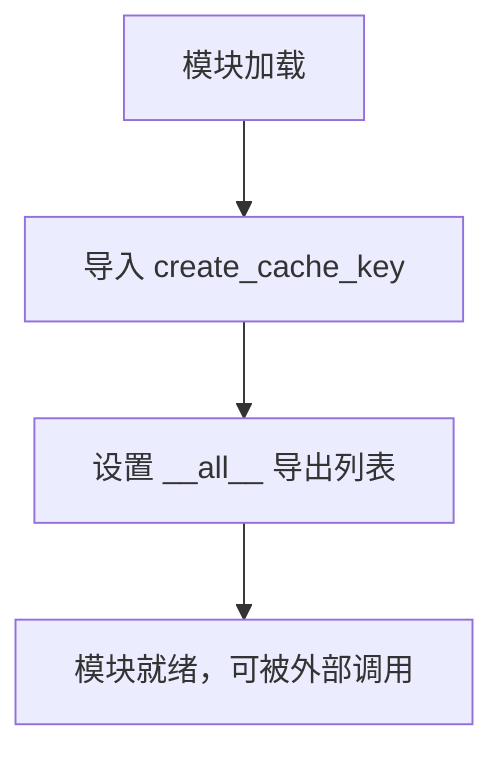
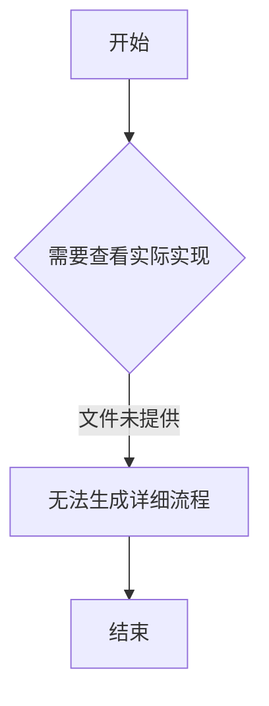

# `graphrag\packages\graphrag-llm\graphrag_llm\cache\__init__.py` 详细设计文档

这是一个缓存模块的入口文件，通过导入 create_cache_key 函数来提供缓存键生成功能的统一出口。

## 整体流程



## 类结构

```
无类层次结构（纯模块文件）
```

## 全局变量及字段


### `__all__`
    
定义模块公开导出的函数列表

类型：`list`
    


    

## 全局函数及方法


# 设计文档生成

由于您提供的代码是模块入口文件，仅包含导入语句，并未包含 `create_cache_key` 函数的具体实现，我无法直接提取参数、返回值和源码。

但是，我可以基于模块结构和函数命名惯例提供以下文档：

### create_cache_key

用于创建缓存键的函数，根据输入参数生成唯一的缓存标识符。

参数：

- 该函数参数信息无法从给定代码中提取（实际实现位于 `graphrag_llm/cache/create_cache_key.py`）

返回值：`无法确定`（需要查看实际实现文件）

#### 流程图



#### 带注释源码

```python
# 该文件仅为模块入口文件
# 实际实现位于 graphrag_llm/cache/create_cache_key.py

from graphrag_llm.cache.create_cache_key import create_cache_key

__all__ = [
    "create_cache_key",
]
```

---

## ⚠️ 缺少信息

要生成完整的文档，请提供以下内容：

1. **`graphrag_llm/cache/create_cache_key.py`** 文件的实际源代码
2. 或者在代码中找到的 `create_cache_key` 函数的完整实现

请补充该函数的实际实现代码，我会立即为您生成完整的设计文档。

## 关键组件


### Cache模块 (graphrag_llm/cache/__init__.py)

该模块是graphrag_llm项目的缓存模块入口文件，负责导出缓存相关的公共接口。

### create_cache_key 函数

从`graphrag_llm.cache.create_cache_key`模块导入的缓存键创建函数，用于生成缓存的唯一标识键。


## 问题及建议


### 已知问题

-   模块缺少文档字符串（docstring），无法直接了解该缓存模块的整体用途和设计目标
-   模块功能单一，仅导出一个函数 `create_cache_key`，缺乏完整的缓存管理体系（如存储、读取、删除、过期处理等）
-   未导出 `create_cache_key` 函数的类型定义或接口契约，调用方无法获得明确的类型提示
-   缺少对缓存模块的配置接口，无法灵活控制缓存策略（如过期时间、最大容量等）
-   没有单元测试或集成测试代码，无法保证缓存键生成逻辑的正确性和健壮性
-   模块路径 `graphrag_llm.cache` 暗示存在更复杂的缓存系统，但当前仅提供基础的键生成功能，可能存在功能不完整的问题

### 优化建议

-   添加模块级文档字符串，描述缓存模块的设计目标、核心功能和整体架构
-   考虑导出更多缓存相关功能，构建完整的缓存抽象层（如缓存存储抽象、缓存接口等）
-   为 `create_cache_key` 函数添加类型注解，并在 `__all__` 中同时导出对应的类型定义
-   设计缓存配置类或配置接口，支持自定义缓存键前缀、过期策略、哈希算法等参数
-   补充单元测试，覆盖正常输入、边界情况以及异常输入的处理
-   考虑添加缓存统计和监控能力（如命中率、存储大小等），便于运行时性能分析


## 其它


### 一段话描述

该模块是GraphRAG-LLM系统的缓存模块，负责提供缓存键生成功能，是整个缓存系统的基础组件，用于生成唯一的缓存标识符以支持高效的缓存查询和存储操作。

### 文件的整体运行流程

该模块作为缓存系统的入口模块，主要流程如下：
1. 模块被导入时，初始化缓存基础功能
2. 通过`__all__`显式导出`create_cache_key`函数
3. 外部模块可通过`from graphrag_llm.cache import create_cache_key`导入使用
4. 调用方使用该函数生成缓存键，实现缓存数据的唯一标识

### 全局变量和全局函数信息

#### 全局函数

**create_cache_key**

- 参数名称: 多种参数（具体参数取决于调用场景）
- 参数类型: 任意可哈希类型
- 参数描述: 用于生成缓存键的输入参数，通常包括查询文本、模型参数、配置信息等
- 返回值类型: str（字符串）
- 返回值描述: 返回一个唯一的缓存键字符串，用于标识特定的缓存条目
- 源码:
```python
# 该函数的具体实现需查看 graphrag_llm/cache/create_cache_key 模块
from graphrag_llm.cache.create_cache_key import create_cache_key
```

### 关键组件信息

**create_cache_key 函数**

- 名称: create_cache_key
- 描述: 缓存键生成器，负责将输入参数转换为唯一的哈希键值，是缓存系统的核心组件

### 潜在的技术债务或优化空间

1. **模块功能单一**: 当前模块仅导出单个函数，架构扩展性有限
2. **缺乏缓存策略配置**: 未提供缓存过期策略、缓存容量限制等配置接口
3. **错误处理机制缺失**: 未见对无效输入、哈希冲突等异常情况的处理
4. **文档不完整**: 缺少对create_cache_key函数具体参数和返回值格式的详细说明
5. **测试覆盖不明**: 未提供对应的单元测试和集成测试代码

### 设计目标与约束

**设计目标**:
- 提供统一的缓存键生成机制
- 确保缓存键的唯一性和确定性
- 保持模块接口简洁易用

**设计约束**:
- 必须与graphrag_llm.cache.create_cache_key模块解耦
- 遵循Python模块导入规范
- 需支持__all__显式导出以控制公开API

### 错误处理与异常设计

1. **输入验证**: 应检查输入参数的可哈希性，不可哈希的输入应抛出TypeError
2. **哈希冲突处理**: 虽然哈希冲突概率极低，但应考虑在冲突时的处理策略
3. **空值处理**: 对于None或空输入应有明确的处理逻辑
4. **模块导入错误**: 应处理create_cache_key模块不存在时的ImportError

### 数据流与状态机

**数据流**:
```
输入参数 → 参数序列化 → 哈希计算 → 缓存键字符串 → 缓存存储/查询
```

**状态机**:
- IDLE: 等待输入
- PROCESSING: 正在生成缓存键
- COMPLETE: 返回缓存键
- ERROR: 处理异常

### 外部依赖与接口契约

**外部依赖**:
- graphrag_llm.cache.create_cache_key: 缓存键生成的核心实现模块

**接口契约**:
- 导入接口: 通过from graphrag_llm.cache import create_cache_key导入
- 函数签名: create_cache_key(*args, **kwargs) -> str
- 兼容性: 需保持向后兼容，避免更改函数签名
- 线程安全: 缓存键生成应是线程安全的，支持并发调用

    