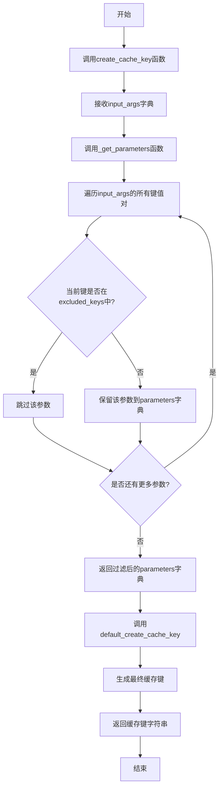
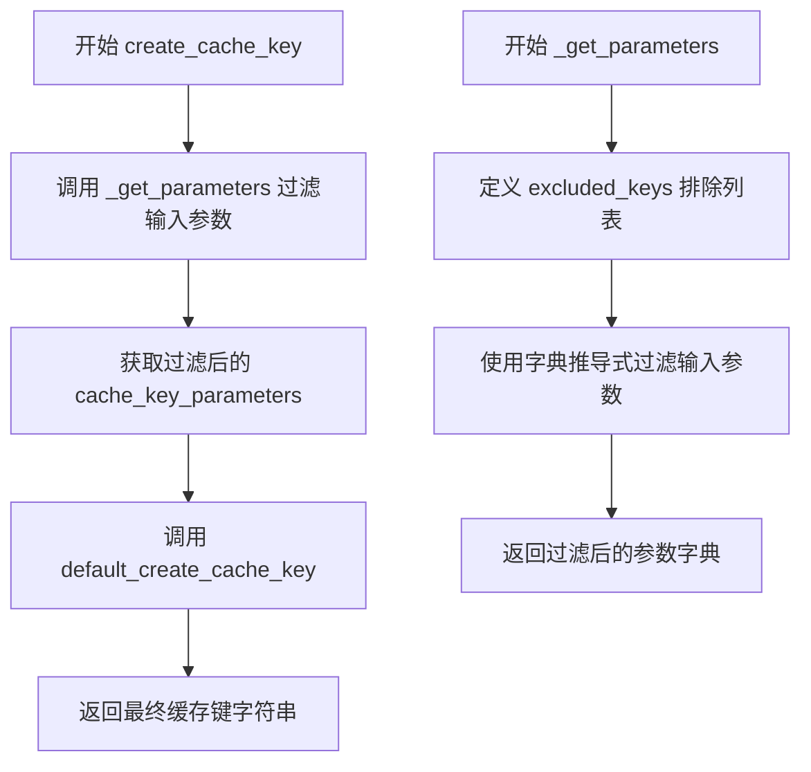
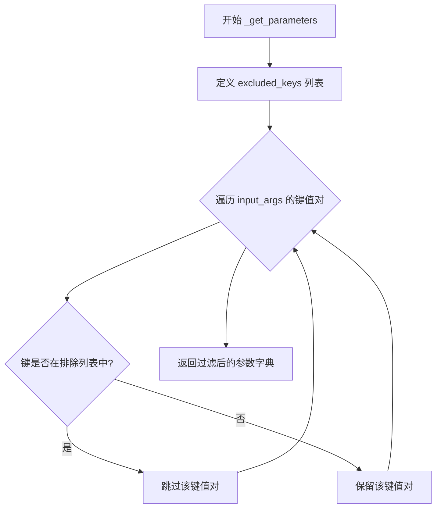
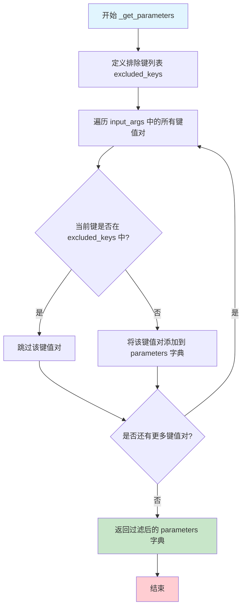

# `graphrag\packages\graphrag-llm\graphrag_llm\cache\create_cache_key.py` 详细设计文档

该代码模块是GraphRAG缓存系统的核心组件，通过过滤掉不影响结果的运行时参数（如API密钥、超时设置、流式选项等），结合缓存版本号和模型输入参数生成唯一的缓存键，以实现模型调用的缓存复用。

## 整体流程



## 类结构

```
create_cache_key.py (模块文件)
└── 无类定义，仅包含全局函数
```

## 全局变量及字段


### `_CACHE_VERSION`
    
缓存版本号，用于缓存失效控制，当前版本为4

类型：`int`
    


    

## 全局函数及方法


### `create_cache_key`

生成缓存键的主函数，基于模型配置和输入参数排除敏感或易变字段后，调用底层缓存键生成器生成统一的缓存标识。

参数：

- `input_args`：`dict[str, Any]`，模型调用的输入参数字典

返回值：`str`，生成的缓存键，格式为 `{prefix}_{data_hash}_v{version}`（如果提供了前缀）

#### 流程图



#### 带注释源码

```python
# 导入 typing 模块的 Any 类型，用于支持任意类型的注解
from typing import Any

# 从 graphrag_cache 库导入默认的缓存键生成函数
# 这是实际执行哈希和键生成的核心实现
from graphrag_cache import create_cache_key as default_create_cache_key

# 缓存版本号常量
# 当缓存内容发生破坏性变更时需要递增此版本号以使旧缓存失效
# 版本历史:
# - fnllm 使用版本 2
# - litellm 开始使用版本 3（因为缓存对象结构不同，无法兼容 fnllm）
# - graphrag-llm 当前使用版本 4（因 ModelConfig 变更及新增 metrics 缓存支持）
_CACHE_VERSION = 4


def create_cache_key(
    input_args: dict[str, Any],
) -> str:
    """Generate a cache key based on the model configuration and input arguments.

    Args
    ____
        input_args: dict[str, Any]
            The input arguments for the model call.

    Returns
    -------
        str
            The generated cache key in the format
            `{prefix}_{data_hash}_v{version}` if prefix is provided.
    """
    # 第一步：过滤输入参数，移除不应纳入缓存键计算的敏感或易变参数
    cache_key_parameters = _get_parameters(
        input_args=input_args,
    )
    # 第二步：调用底层默认实现生成缓存键
    # 该函数会根据传入的参数计算哈希值并拼接版本号生成最终键
    return default_create_cache_key(cache_key_parameters)


def _get_parameters(
    # model_config: "ModelConfig",  # 注释掉的参数，可能用于未来扩展
    input_args: dict[str, Any],
) -> dict[str, Any]:
    """Pluck out the parameters that define a cache key.
    
    从输入参数中提取用于构成缓存键的参数子集。
    通过排除特定键确保缓存键的稳定性和安全性。
    """
    # 定义需要排除的参数键列表
    # 这些参数通常具有以下特性：
    # - 每次请求都可能变化（如 stream, timeout）
    # - 包含敏感信息（如 api_key, base_url）
    # - 不影响实际模型输出（如 mock_response）
    excluded_keys = [
        "metrics",        # 指标数据，每次可能不同
        "stream",         # 流式响应标志
        "stream_options", # 流式响应选项
        "mock_response",  # 模拟响应，仅用于测试
        "timeout",        # 超时设置，每次请求可能不同
        "base_url",       # 基础 URL，可能包含环境特定信息
        "api_base",       # API 端点
        "api_version",    # API 版本
        "api_key",        # 敏感：API 密钥
        "azure_ad_token_provider",  # 敏感：Azure AD 令牌提供者
        "drop_params",    # 丢弃参数配置
    ]

    # 使用字典推导式过滤参数
    # 只保留不在排除列表中的键值对
    parameters: dict[str, Any] = {
        k: v for k, v in input_args.items() if k not in excluded_keys
    }

    # 返回过滤后的参数字典，用于后续缓存键生成
    return parameters
```

---

### 全局变量 `_CACHE_VERSION`

- **名称**：`_CACHE_VERSION`
- **类型**：`int`
- **描述**：缓存版本号常量，用于在缓存内容发生破坏性变更时使旧缓存失效。当前版本为 4，经历了从 fnllm 到 litellm 再到 graphrag-llm 的演进。

---

### 全局函数 `_get_parameters`

提取用于构成缓存键的参数子集，通过排除敏感或易变参数确保缓存键的稳定性和安全性。

参数：

- `input_args`：`dict[str, Any]`，模型调用的完整输入参数

返回值：`dict[str, Any]`，过滤后的参数字典，只包含应纳入缓存键计算的参数

#### 流程图



#### 带注释源码

```python
def _get_parameters(
    # model_config: "ModelConfig",  # 预留参数位置，可能用于未来根据配置进一步过滤
    input_args: dict[str, Any],
) -> dict[str, Any]:
    """Pluck out the parameters that define a cache key.
    
    该函数负责从完整的输入参数中筛选出与缓存键相关的参数。
    排除的字段主要分为几类：
    1. 每次请求都可能变化的时间/状态相关参数
    2. 包含环境或认证敏感信息的参数
    3. 仅影响请求方式而不影响模型输出的参数
    """
    # 定义排除列表
    # 这些键对应的值变化不应导致缓存命中失效
    excluded_keys = [
        "metrics",                    # 监控指标，每次请求可能不同
        "stream",                     # 流式响应标志
        "stream_options",            # 流式响应配置
        "mock_response",             # 测试用的模拟响应
        "timeout",                   # 超时设置
        "base_url",                  # 基础 URL（环境相关）
        "api_base",                  # API 基础路径
        "api_version",               # API 版本
        "api_key",                   # 敏感认证信息
        "azure_ad_token_provider",   # Azure AD 令牌提供者（敏感）
        "drop_params",               # 丢弃参数配置
    ]

    # 字典推导式：过滤输入参数
    # 保留所有不在排除列表中的键值对
    # 这种方式确保了缓存键只基于影响模型输出的核心参数生成
    parameters: dict[str, Any] = {
        k: v for k, v in input_args.items() if k not in excluded_keys
    }

    # 返回过滤后的参数字典
    # 后续将传递给 default_create_cache_key 生成最终缓存键
    return parameters
```

---

### 关键组件信息

| 组件名称 | 一句话描述 |
|---------|-----------|
| `graphrag_cache.create_cache_key` | 底层缓存键生成器，负责将参数字典转换为哈希键 |
| `_CACHE_VERSION` | 缓存版本控制常量，用于实现缓存失效机制 |

---

### 潜在技术债务或优化空间

1. **硬编码的排除列表**：`excluded_keys` 列表硬编码在函数内部，未来若需动态配置排除规则（如从配置文件读取）需要重构
2. **注释掉的 `model_config` 参数**：`_get_parameters` 中有注释掉的 `model_config` 参数，表明可能有扩展需求但尚未实现
3. **缺少参数验证**：未对 `input_args` 进行类型或格式验证，可能导致运行时错误
4. **版本号管理**：`_CACHE_VERSION` 的注释较为冗长，可考虑迁移至独立的版本管理文档或配置

---

### 其它项目

#### 设计目标与约束

- **目标**：为模型调用生成稳定且唯一的缓存键，确保相同输入参数能够命中缓存
- **约束**：缓存键生成不应包含每次请求都会变化或包含敏感信息的参数

#### 错误处理与异常设计

- 当前实现未包含显式的错误处理逻辑
- 潜在的异常情况（如 `input_args` 为 `None` 或 `default_create_cache_key` 抛出异常）未被捕获

#### 数据流与状态机

1. 外部调用 `create_cache_key(input_args)`
2. 调用 `_get_parameters` 过滤输入参数
3. 将过滤后的参数传递给 `default_create_cache_key`
4. 返回最终缓存键字符串

#### 外部依赖与接口契约

- **依赖**：`graphrag_cache` 包提供的 `create_cache_key` 函数
- **输入契约**：`input_args` 应为字典类型
- **输出契约**：返回符合 `{prefix}_{data_hash}_v{version}` 格式的字符串


### `_get_parameters`

这是一个内部函数，用于从输入参数字典中过滤出决定缓存键的参数。它通过排除特定的键（如 metrics、stream、timeout 等）来生成一个干净的参数字典，确保这些不影响缓存结果的参数不会被包含在缓存键的计算中。

参数：

- `input_args`：`dict[str, Any]` ，输入的参数字典，包含模型调用的所有参数

返回值：`dict[str, Any]` ，过滤后的参数字典，只包含决定缓存键的参数

#### 流程图



#### 带注释源码

```python
def _get_parameters(
    # model_config: "ModelConfig",  # 预留参数，暂时注释掉
    input_args: dict[str, Any],
) -> dict[str, Any]:
    """Pluck out the parameters that define a cache key."""
    
    # 定义需要排除的键列表，这些参数不影响缓存结果
    # metrics: 指标数据，每次调用可能不同，不应影响缓存
    # stream/stream_options: 流式响应相关，不影响缓存内容
    # mock_response: 仅用于测试的模拟响应
    # timeout: 超时设置属于运行时配置，不应影响缓存
    # base_url/api_base/api_version: 端点配置，属于环境设置
    # api_key: 认证信息，不应影响缓存逻辑
    # azure_ad_token_provider: 认证提供者，属于运行时配置
    # drop_params: 参数丢弃策略，属于调用配置而非数据本身
    excluded_keys = [
        "metrics",
        "stream",
        "stream_options",
        "mock_response",
        "timeout",
        "base_url",
        "api_base",
        "api_version",
        "api_key",
        "azure_ad_token_provider",
        "drop_params",
    ]

    # 使用字典推导式过滤参数：保留不在排除列表中的键值对
    # 这样确保只有影响缓存内容的核心参数才会被用于生成缓存键
    parameters: dict[str, Any] = {
        k: v for k, v in input_args.items() if k not in excluded_keys
    }

    # 返回过滤后的参数字典，用于后续缓存键的生成
    return parameters
```

## 关键组件


### 缓存版本管理 (_CACHE_VERSION)

定义缓存版本号，用于在缓存格式发生破坏性变更时使现有缓存失效。当前版本为 4，用于支持 ModelConfig 变更和新增的指标缓存功能。

### 缓存键生成主函数 (create_cache_key)

公开 API，接收输入参数字典，调用内部函数获取缓存参数字典，然后委托给默认的缓存键生成器创建最终缓存键。返回格式为 `{prefix}_{data_hash}_v{version}` 的字符串。

### 缓存参数过滤函数 (_get_parameters)

从输入参数中排除特定的键（如 metrics、stream、timeout、api_key 等），提取出用于定义缓存键的核心参数。返回一个仅包含相关参数的字典，确保相同业务含义的调用生成相同缓存键。

### 排除参数列表 (excluded_keys)

定义了在生成缓存键时需要过滤掉的参数列表，包括运行时参数（stream、timeout）、认证信息（api_key、azure_ad_token_provider）和特定 provider 配置（base_url、api_base 等），避免这些差异导致缓存键过于碎片化。

### 默认缓存键生成器 (default_create_cache_key)

从 graphrag_cache 包导入的外部依赖函数，接收参数字典并返回最终的缓存键字符串。这是实际执行哈希计算和键格式化的底层实现。


## 问题及建议


### 已知问题

-   **未使用的常量**：`_CACHE_VERSION` 常量被定义但在代码中从未被引用，失去意义且造成混淆
-   **魔法数字**：缓存版本号 `4` 是硬编码的魔法数字，缺乏明确说明其来源和变更历史（虽然注释解释了为什么是4，但代码中未实际使用）
-   **硬编码的排除键列表**：`excluded_keys` 列表被硬编码在函数内部，如果需要动态配置或扩展需要修改源代码
-   **不完整的类型注解**：参数 `input_args: dict[str, Any]` 使用了过于宽泛的 `Any` 类型，缺乏具体约束
-   **注释掉的代码残留**：`_get_parameters` 函数签名中保留着注释掉的 `# model_config: "ModelConfig",`，属于代码残留
-   **缺乏错误处理**：没有对 `input_args` 为空、`default_create_cache_key` 调用失败等情况进行异常处理

### 优化建议

-   将 `_CACHE_VERSION` 实际应用到缓存键生成逻辑中，或移除以避免混淆
-   将排除键列表提取为模块级常量或配置参数，提高可维护性和可测试性
-   考虑为 `input_args` 定义具体的类型或使用 TypedDict 提供更严格的类型检查
-   清理注释掉的代码残留，保持代码整洁
-   添加输入验证和异常处理逻辑，提高函数健壮性

## 其它


### 设计目标与约束

本模块的设计目标是为 GraphRAG-LLM 框架提供缓存键生成功能，通过对输入参数进行筛选和哈希处理，生成唯一且稳定的缓存键，以支持模型调用的缓存复用。核心约束包括：缓存版本管理机制（_CACHE_VERSION = 4）、明确的参数排除策略、以及对外部缓存库的依赖。

### 错误处理与异常设计

本模块主要依赖外部库 `graphrag_cache` 的 `create_cache_key` 函数进行实际的键生成，异常处理由调用方负责。当传入的 `input_args` 为空字典时，仍会生成有效的缓存键。若 `input_args` 包含非字符串类型的键，可能导致哈希计算异常。建议添加输入参数类型校验。

### 外部依赖与接口契约

- **导入依赖**: `graphrag_cache.create_cache_key as default_create_cache_key`
- **输入契约**: `create_cache_key` 函数接受 `dict[str, Any]` 类型的 `input_args` 参数
- **输出契约**: 返回 `str` 类型的缓存键，格式为 `{prefix}_{data_hash}_v{version}`
- **依赖版本要求**: 使用 litellm 模型提供商时，无法复用 fnllm 生成的缓存（版本不兼容）

### 性能考虑

参数筛选使用字典推导式，时间复杂度为 O(n)，其中 n 为 input_args 的键值对数量。对于大型输入参数场景，可考虑缓存筛选结果。由于缓存键生成是模型调用的前置操作，应保证其性能稳定。

### 安全性考虑

缓存键生成过程不涉及敏感信息处理，但需注意 input_args 中可能包含 api_key、azure_ad_token_provider 等敏感参数，这些参数已被排除在缓存键计算之外，符合安全最佳实践。

### 配置管理

缓存版本通过全局常量 `_CACHE_VERSION = 4` 集中管理，当缓存格式发生重大变更时需递增版本号以使旧缓存失效。当前版本号反映了从 fnllm 到 litellm 再到 graphrag-llm 的演进历程。

### 版本兼容性

该模块与 fnllm 缓存版本不兼容（fnllm 使用版本 2），从版本 3 开始支持 litellm，版本 4 增加了对 ModelConfig 变更和 metrics 缓存的支持。使用时需确保缓存版本与框架版本匹配。

### 测试策略建议

建议测试场景包括：空输入参数、包含所有排除键的参数、仅包含有效键的参数、重复调用一致性、以及跨版本缓存失效验证。

    