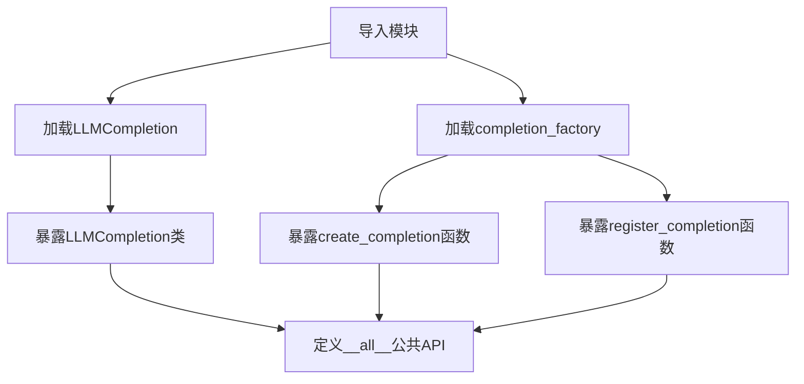
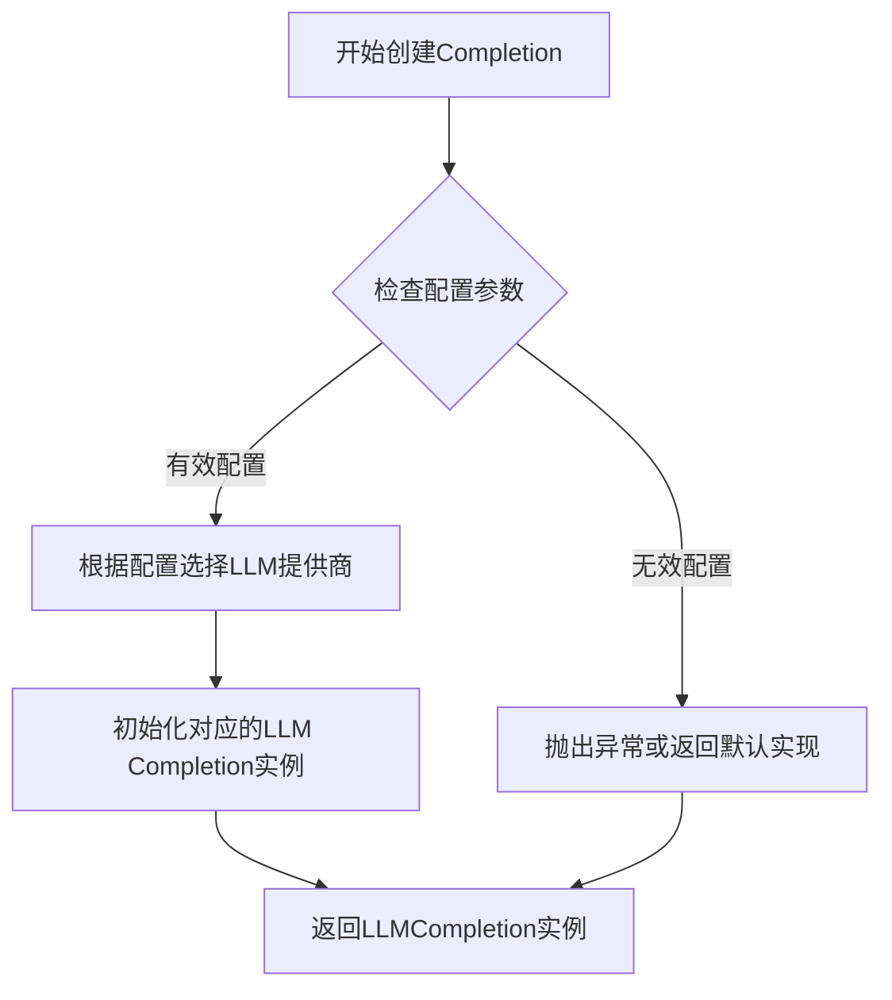
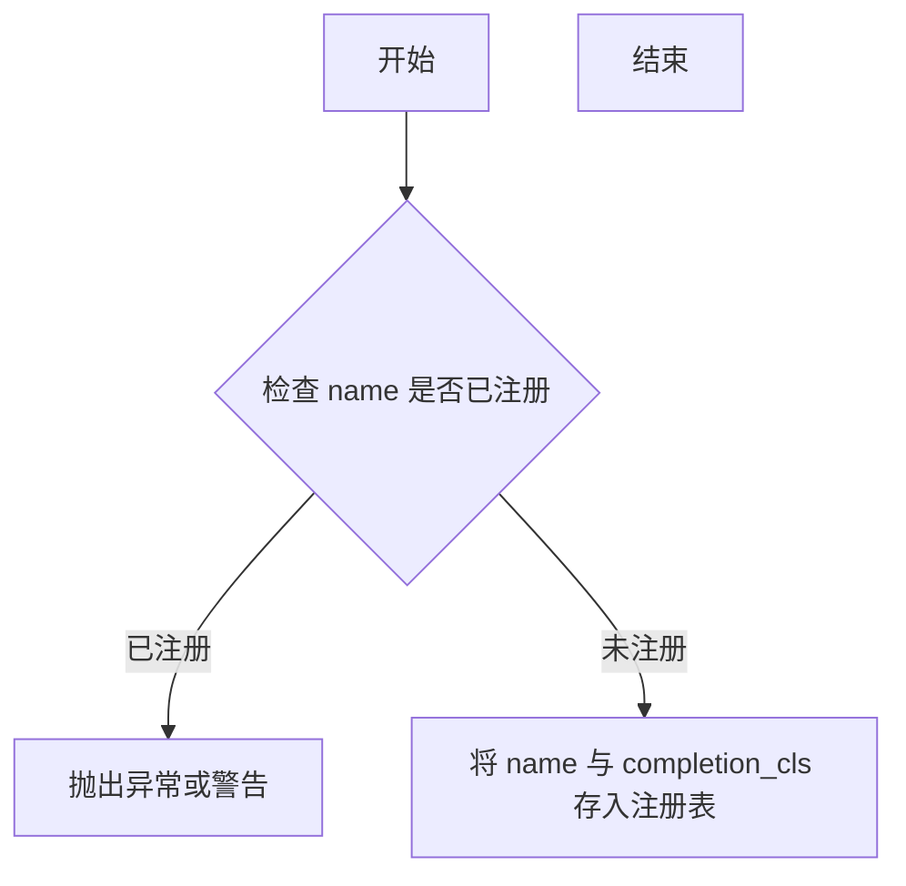

# `graphrag\packages\graphrag-llm\graphrag_llm\completion\__init__.py` 详细设计文档

这是graphrag-llm的completion模块的入口文件，主要负责导出LLMCompletion类以及completion工厂函数，用于创建和注册大语言模型的补全功能。

## 整体流程



## 类结构

```
graphrag_llm.completion (包)
├── __init__.py (模块入口)
├── completion.py (包含LLMCompletion类)
└── completion_factory.py (包含工厂函数)
```

## 全局变量及字段


### `__all__`
    
定义模块公开API的导出列表，控制from module import *时的导入内容

类型：`List[str]`
    


    

## 全局函数及方法


### `create_completion`

该函数是完成模块的工厂函数，用于根据配置或参数创建相应的 `LLMCompletion` 实例，支持动态加载不同的 LLM 提供商实现。

参数：

-  `config`：视具体实现而定，可能是字典配置或配置对象，用于指定 LLM 提供商类型、模型参数、API 密钥等
-  `*args`：可变位置参数，用于传递额外的创建参数
-  `**kwargs`：可变关键字参数，用于传递额外的命名参数

返回值：`LLMCompletion`，返回创建的 LLM 完成实例

#### 流程图



#### 带注释源码

```python
# 从completion_factory模块导入create_completion函数
# 该函数负责实例化LLMCompletion对象
from graphrag_llm.completion.completion_factory import (
    create_completion,
    register_completion,
)

# create_completion 是工厂函数，其典型实现可能如下：
# def create_completion(config: Dict[str, Any], *args, **kwargs) -> LLMCompletion:
#     """
#     根据配置创建LLM完成实例
#     
#     参数:
#         config: 包含provider类型、模型名称、API配置等的字典
#         *args: 额外位置参数
#         **kwargs: 额外关键字参数
#     
#     返回:
#         LLMCompletion: 配置好的完成实例
#     """
#     provider = config.get('provider', 'default')
#     completion_class = completion_registry.get(provider)
#     return completion_class(config, *args, **kwargs)
```

#### 备注

> **注意**：由于提供的代码仅为包的 `__init__.py` 导入文件，`create_completion` 的具体实现位于 `graphrag_llm.completion.completion_factory` 模块中。上述参数和返回值是基于函数命名约定和工厂模式的一般推断，实际签名需参考 `completion_factory` 模块的完整源码。


### `register_completion`

该函数用于将特定的完成（Completion）类注册到全局注册表中，以便通过 `create_completion` 工厂函数根据名称动态创建实例。

参数：

- `name`：`str`，Completion 的名称标识符，用于后续查找。
- `completion_cls`：`type`，要注册的 Completion 类，必须继承自 `LLMCompletion`。

返回值：`None`，无返回值（通常注册过程不返回数据）。

#### 流程图



#### 带注释源码

```python
# 假设的 completion_factory.py 中的实现

# 全局注册表，存储名称到类的映射
_COMPLETION_REGISTRY = {}

def register_completion(name: str, completion_cls: type):
    """
    注册一个 Completion 类到全局注册表。
    
    参数:
        name (str): Completion 的唯一名称。
        completion_cls (type): 继承自 LLMCompletion 的类。
    
    返回:
        None
    """
    if name in _COMPLETION_REGISTRY:
        # 如果已存在，可以选择抛出异常或覆盖
        raise ValueError(f"Completion with name '{name}' already registered.")
    
    # 注册到字典中
    _COMPLETION_REGISTRY[name] = completion_cls
```

**注意**：由于您提供的代码仅包含 `__init__.py` 导入语句，未提供 `completion_factory.py` 的实际实现，上述信息基于函数名称和常见注册模式进行的合理推测。如需精确详情，请提供 `completion_factory.py` 的完整源代码。

## 关键组件


### LLMCompletion

完成模块的核心抽象类，定义LLM补全接口的基类，用于处理语言模型的补全请求和响应。

### create_completion

工厂函数，根据配置创建相应的LLMCompletion实例，支持不同LLM提供商的动态加载。

### register_completion

注册函数，用于将自定义的LLM完成实现注册到工厂系统中，支持扩展不同的LLM后端。


## 问题及建议


### 已知问题

- **模块级异常处理缺失**：直接导入子模块（`from graphrag_llm.completion.completion import LLMCompletion`），若子模块不存在或存在语法错误，会导致整个包无法导入，缺乏错误边界隔离
- **模块文档字符串缺失**：`__init__.py` 没有模块级 docstring，无法说明该模块的用途、版本信息和依赖关系
- **公开API不完整**：`__all__` 仅导出3个成员，但未导出相关的类型注解、配置类或异常类，可能导致下游使用时类型提示不完整
- **隐式依赖暴露**：直接导入实现细节（如 `completion_factory` 中的函数），可能暴露内部架构，削弱未来重构的灵活性

### 优化建议

- 添加模块级 docstring，说明模块职责："提供大语言模型补全（Completion）功能的统一接口，支持多种 LLM 提供商的注册与创建"
- 考虑增加 `try-except ImportError` 捕获导入错误，提供更友好的错误信息或降级机制
- 补充 `__version__` 变量便于版本管理，并可在 docstring 中标注支持的 LLM 提供商列表
- 如有对应异常类或配置类，建议一并导出，提升类型安全性和使用体验
- 考虑使用延迟导入（lazy import）或重构为相对导入，提升模块解耦程度


## 其它


### 设计目标与约束

本模块作为graphrag-llm的补全（completion）模块，旨在提供统一的LLM补全接口，支持通过工厂模式动态创建和注册不同的补全实现。设计约束包括：必须遵循graphrag_llm包的导入规范，保持与现有模块的兼容性，支持插件化的补全实现扩展。

### 错误处理与异常设计

模块应定义基础的补全异常类（如CompletionError），并在factory方法中处理创建失败的情况。所有导入的异常应从completion模块重新导出，以便外部调用者统一处理。

### 外部依赖与接口契约

本模块依赖graphrag_llm.completion.completion和graphrag_llm.completion.completion_factory两个内部模块。接口契约包括：LLMCompletion类需提供统一的补全方法签名，create_completion和register_completion函数需遵循工厂模式的参数规范。

### 配置与参数说明

模块级别的配置主要通过factory函数的参数传递，包括模型类型、API密钥、端点URL等。具体的配置项应在LLMCompletion类和factory函数中详细定义。

### 性能考虑

由于本模块仅为导入入口，实际性能取决于具体实现类。建议在LLMCompletion的具体实现中考虑缓存机制、请求超时设置、并发控制等因素。

### 安全性考虑

模块中涉及API密钥等敏感信息，应确保不在日志中暴露。建议在factory函数中增加敏感参数的脱敏处理，并在文档中提醒用户妥善保管凭据。

### 使用示例

```python
from graphrag_llm import create_completion, register_completion, LLMCompletion

# 创建补全实例
completion = create_completion(model="gpt-4", api_key="your-key")

# 注册自定义补全实现
class CustomCompletion(LLMCompletion):
    def complete(self, prompt: str) -> str:
        return "custom result"

register_completion("custom", CustomCompletion)
```

### 版本历史与兼容性

当前版本为初始版本（2024），遵循MIT许可证。后续版本应保持对LLMCompletion基类接口的向后兼容，如需breaking change应在主版本号中体现。

### 文档与注释规范

模块级文档字符串应包含简短的模块用途说明。所有公开导出的类、函数应包含完整的docstring，遵循Google或NumPy文档风格。

### 测试策略

建议为每个具体的LLMCompletion实现类编写单元测试，重点测试factory模式的注册和创建流程，以及异常处理逻辑。集成测试应覆盖实际的API调用场景。

### 关键组件信息

- LLMCompletion：补全功能的抽象基类，定义补全接口规范
- create_completion：工厂函数，用于根据配置创建补全实例
- register_completion：工厂函数，用于注册自定义补全实现类

### 潜在技术债务与优化空间

当前模块为轻量级导入入口，技术债务较少。潜在的优化方向包括：增加更多内置补全实现支持、完善类型注解、添加异步支持、统一配置管理等。


    