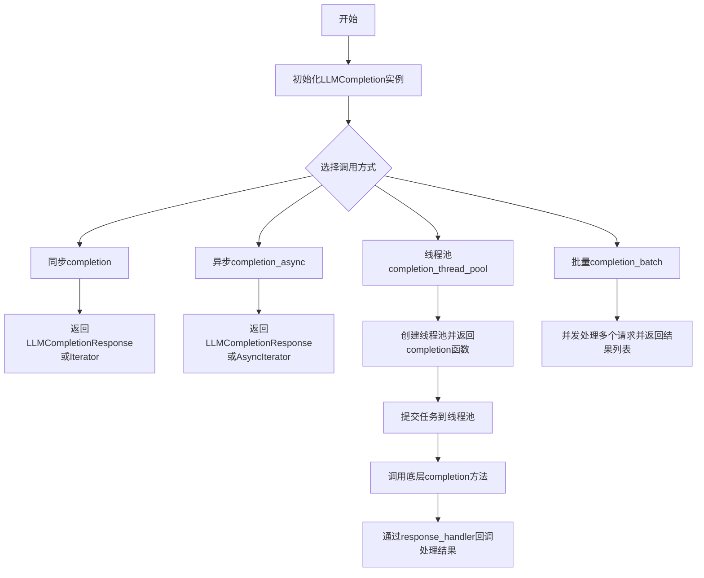
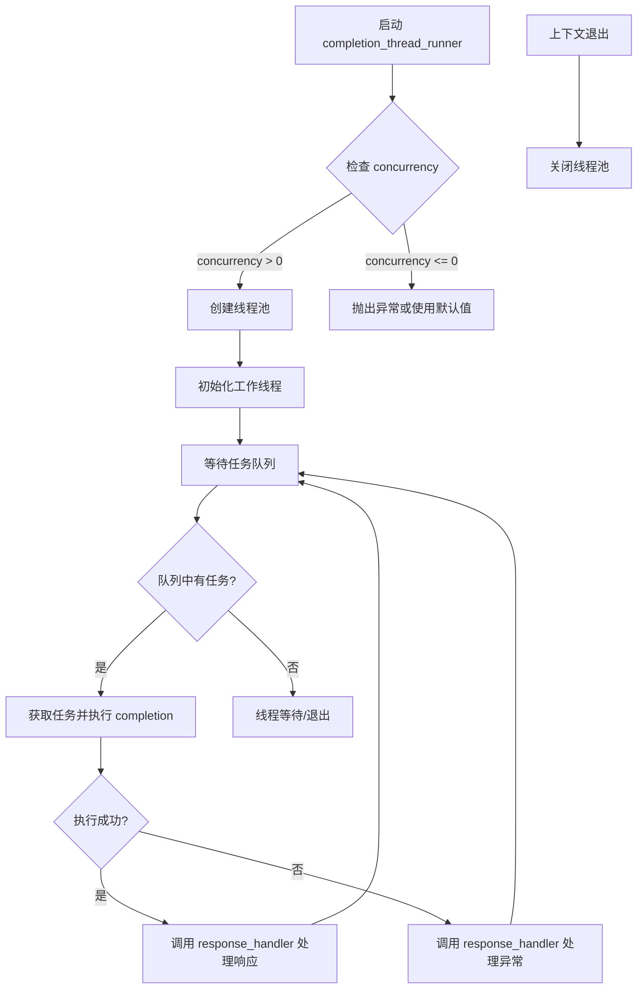
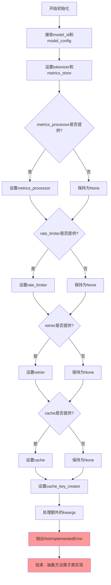
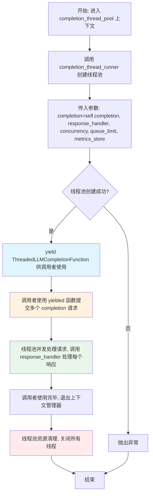
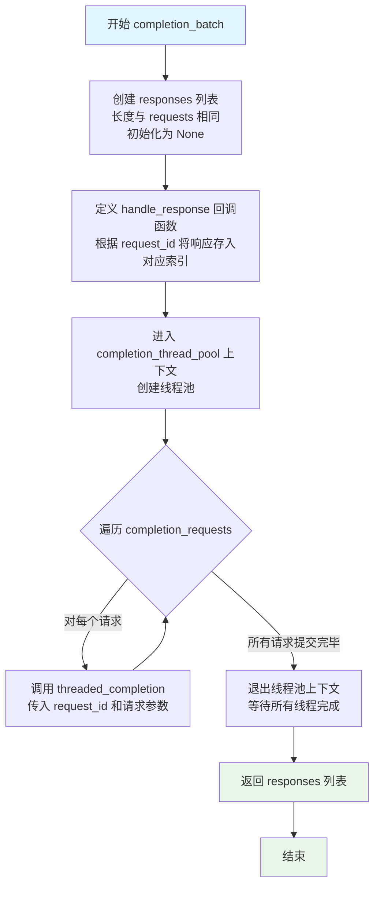
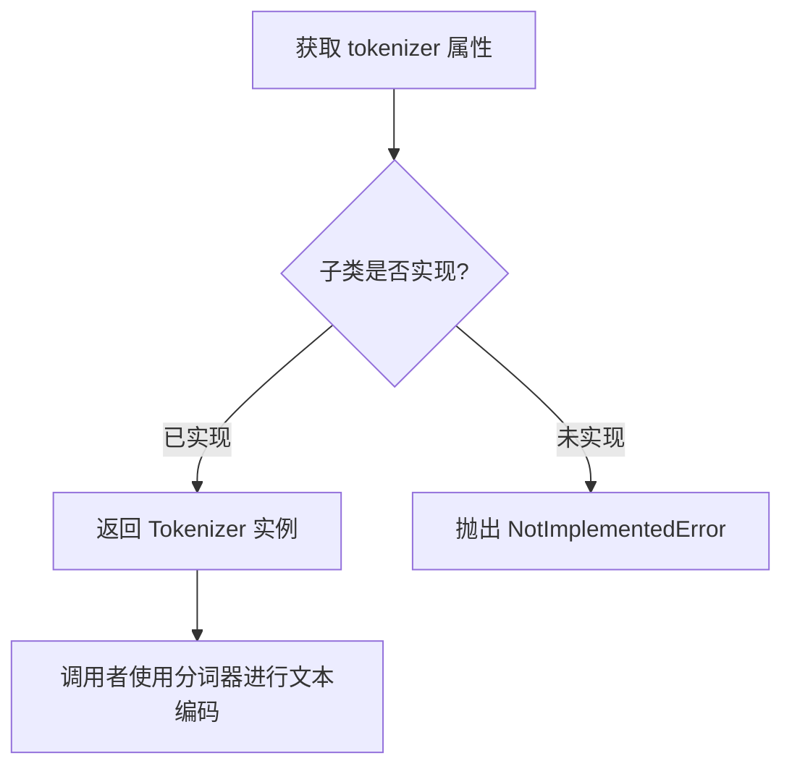

# `graphrag\packages\graphrag-llm\graphrag_llm\completion\completion.py` 详细设计文档

这是一个用于大语言模型（LLM）补全功能的抽象基类（Abstract Base Class），定义了同步补全、异步补全、线程池处理和批量处理等核心接口，支持流式输出、结构化响应、速率限制、重试机制和缓存功能，为具体实现类提供统一的编程规范。

## 整体流程



## 类结构

```
LLMCompletion (抽象基类)
└── 具体实现类（如GPTCompletion、ClaudeCompletion等）
```

## 全局变量及字段


### `LLMCompletion.model_id`
    
模型标识符，如'openai/gpt-4o'

类型：`str`
    


### `LLMCompletion.model_config`
    
语言模型的配置参数

类型：`ModelConfig`
    


### `LLMCompletion.tokenizer`
    
分词器实例

类型：`Tokenizer`
    


### `LLMCompletion.metrics_store`
    
指标存储实例

类型：`MetricsStore`
    


### `LLMCompletion.metrics_processor`
    
可选的指标处理器

类型：`MetricsProcessor | None`
    


### `LLMCompletion.rate_limiter`
    
可选的速率限制器

类型：`RateLimiter | None`
    


### `LLMCompletion.retrier`
    
可选的重试策略

类型：`Retry | None`
    


### `LLMCompletion.cache`
    
可选的缓存实例

类型：`Cache | None`
    


### `LLMCompletion.cache_key_creator`
    
缓存键创建函数

类型：`CacheKeyCreator`
    


### `LLMCompletion.__init__`
    
初始化方法（抽象方法）

类型：`abstractmethod`
    


### `LLMCompletion.completion`
    
同步补全方法（抽象方法）

类型：`abstractmethod`
    


### `LLMCompletion.completion_async`
    
异步补全方法（抽象方法）

类型：`abstractmethod`
    


### `LLMCompletion.completion_thread_pool`
    
线程池上下文管理器方法

类型：`contextmanager method`
    


### `LLMCompletion.completion_batch`
    
批量处理补全请求方法

类型：`method`
    


### `LLMCompletion.metrics_store`
    
指标存储属性（抽象属性）

类型：`abstract property`
    


### `LLMCompletion.tokenizer`
    
分词器属性（抽象属性）

类型：`abstract property`
    
    

## 全局函数及方法


### `completion_thread_runner`

线程运行器函数，用于在指定的并发级别下运行LLM完成请求的线程池，支持响应处理和指标收集。

参数：

-  `completion`：可调用对象，这是实际的LLM完成方法（`LLMCompletion.completion`）
-  `response_handler`：`ThreadedLLMCompletionResponseHandler`，处理completion响应的回调函数，签名为`(request_id, response|exception) -> Awaitable[None] | None`
-  `concurrency`：`int`，线程池中要启动的线程数量
-  `queue_limit`：`int`（默认=0），输入队列中允许的最大项目数，0表示无限制
-  `metrics_store`：`MetricsStore | None`（可选），指标存储对象

返回值：上下文管理器，返回一个可提交completion请求的函数`ThreadedLLMCompletionFunction`

#### 流程图



#### 带注释源码

```
# 注意：此函数定义未在提供的代码中显示，以下为基于使用的推断

def completion_thread_runner(
    *,
    completion: Callable[..., LLMCompletionResponse | Iterator[LLMCompletionChunk]],
    response_handler: ThreadedLLMCompletionResponseHandler,
    concurrency: int,
    queue_limit: int = 0,
    metrics_store: MetricsStore | None = None,
) -> Iterator[ThreadedLLMCompletionFunction]:
    """线程运行器函数，用于处理并发的LLM完成请求。
    
    参数:
        completion: LLM完成方法的可调用对象
        response_handler: 处理响应或异常的回调函数
        concurrency: 并发线程数量
        queue_limit: 输入队列限制，0表示无限制
        metrics_store: 可选的指标存储
    
    返回:
        上下文管理器，yield一个可提交任务的函数
    """
    # 创建线程池
    with ThreadPoolExecutor(
        max_workers=concurrency,
        thread_name_prefix="llm_completion"
    ) as executor:
        # 初始化任务队列
        queue = Queue(maxsize=queue_limit if queue_limit > 0 else float('inf'))
        
        # 提交任务到队列的函数
        def threaded_completion(request_id: str, **kwargs):
            queue.put((request_id, kwargs))
        
        # 启动工作线程
        futures = []
        for _ in range(concurrency):
            future = executor.submit(_worker_thread, ...)
            futures.append(future)
        
        yield threaded_completion
        
        # 等待所有任务完成
        queue.join()
```

#### 说明

**注意**：由于提供的代码中没有包含 `completion_thread_runner` 函数的完整定义（仅导入了该函数），以上信息是基于以下代码片段的推断：

```python
with completion_thread_runner(
    completion=self.completion,
    response_handler=response_handler,
    concurrency=concurrency,
    queue_limit=queue_limit,
    metrics_store=self.metrics_store,
) as completion:
    yield completion
```

要获取完整的函数定义，需要查看 `graphrag_llm/threading/completion_thread_runner.py` 源文件。


### `LLMCompletion.__init__`

初始化方法，用于创建LLMCompletion抽象基类的实例，配置模型相关的核心组件，包括模型配置、分词器、指标存储、缓存、速率限制器和重试策略等。

参数：

- `self`：隐式参数，表示实例本身
- `model_id`：`str`，模型标识符，例如 "openai/gpt-4o"
- `model_config`：`ModelConfig`，语言模型的配置对象
- `tokenizer`：`Tokenizer`，用于处理文本分词的对象
- `metrics_store`：`MetricsStore`，指标存储对象，用于记录和存储运行指标
- `metrics_processor`：`MetricsProcessor | None`，可选的指标处理器，默认为None
- `rate_limiter`：`RateLimiter | None`，可选的速率限制器，默认为None
- `retrier`：`Retry | None`，可选的重试策略，默认为None
- `cache`：`Cache | None`，可选的缓存对象，用于缓存嵌入结果，默认为None
- `cache_key_creator`：`CacheKeyCreator`，缓存键创建函数，用于生成缓存键
- `**kwargs`：`Any`，额外的关键字参数，用于扩展或传递额外配置

返回值：`None`，__init__ 方法不返回任何值

#### 流程图



#### 带注释源码

```python
@abstractmethod
def __init__(
    self,
    *,
    model_id: str,                      # 模型标识符，如 "openai/gpt-4o"
    model_config: "ModelConfig",        # 语言模型的配置对象
    tokenizer: "Tokenizer",             # 用于文本分词的处理对象
    metrics_store: "MetricsStore",      # 指标存储，记录运行时指标
    metrics_processor: "MetricsProcessor | None" = None,  # 可选的指标处理器
    rate_limiter: "RateLimiter | None" = None,  # 可选的速率限制器，控制API调用频率
    retrier: "Retry | None" = None,      # 可选的重试策略，处理失败请求
    cache: "Cache | None" = None,       # 可选的缓存对象，缓存嵌入结果
    cache_key_creator: "CacheKeyCreator",  # 缓存键创建函数，生成唯一缓存键
    **kwargs: Any,                       # 额外的关键字参数，用于扩展
):
    """Initialize the LLMCompletion.

    Args
    ----
        model_id: str
            The model ID, e.g., "openai/gpt-4o".
        model_config: ModelConfig
            The configuration for the language model.
        tokenizer: Tokenizer
            The tokenizer to use.
        metrics_store: MetricsStore | None (default=None)
            The metrics store to use.
        metrics_processor: MetricsProcessor | None (default: None)
            The metrics processor to use.
        rate_limiter: RateLimiter | None (default=None)
            The rate limiter to use.
        retrier: Retry | None (default=None)
            The retry strategy to use.
        cache: Cache | None (default=None)
            Optional cache for embeddings.
        cache_key_creator: CacheKeyCreator | None (default=None)
            Optional cache key creator function.
            (dict[str, Any]) -> str
        **kwargs: Any
            Additional keyword arguments.
    """
    # 抽象方法必须由子类实现，此处直接抛出异常
    raise NotImplementedError
```


### `LLMCompletion.completion`

同步补全方法（抽象方法），用于调用语言模型生成补全响应。该方法接收可变数量的参数，支持流式输出和结构化响应格式，具体功能由子类实现。

参数：

- `self`：`LLMCompletion`，抽象基类实例（隐式参数）
- `**kwargs`：`Unpack["LLMCompletionArgs[ResponseFormat]"]`，可变关键字参数，包含以下参数：
  - `messages`：`str | list[dict[str, str]] | list[ChatCompletionMessageParam]`，发送给语言模型的聊天消息
  - `response_format`：`BaseModel | None`，结构化响应格式，必须扩展 Pydantic BaseModel
  - `stream`：`bool`，是否流式传输响应，使用 response_format 时不支持流式传输
  - `max_completion_tokens`：`int | None`，生成的最大令牌数
  - `temperature`：`float | None`，控制响应的确定性/创造性
  - `top_p`：`float | None`，核采样参数，考虑累积概率达到 top_p 的令牌
  - `n`：`int | None`，为每个提示生成的补全数量
  - `tools`：`list[Tool] | None`，补全过程中使用的可选工具
  - `**kwargs`：`Any`，其他额外关键字参数

返回值：`LLMCompletionResponse[ResponseFormat] | Iterator[LLMCompletionChunk]`，语言模型补全响应；如果流式传输则为补全块迭代器。

#### 流程图

```mermaid
flowchart TD
    A[调用 completion 方法] --> B{子类实现?}
    B -->|否| C[抛出 NotImplementedError]
    B -->|是| D[执行子类实现逻辑]
    D --> E{流式响应?}
    E -->|是| F[返回 Iterator[LLMCompletionChunk]]
    E -->|否| G[返回 LLMCompletionResponse[ResponseFormat]]
```

#### 带注释源码

```python
@abstractmethod
def completion(
    self,
    /,
    **kwargs: Unpack["LLMCompletionArgs[ResponseFormat]"],
) -> "LLMCompletionResponse[ResponseFormat] | Iterator[LLMCompletionChunk]":
    """Sync completion method.

    Args
    ----
        messages: LLMCompletionMessagesParam
            The messages to send to the LLM.
            Can be str | list[dict[str, str]] | list[ChatCompletionMessageParam].
        response_format: BaseModel | None (default=None)
            The structured response format.
            Must extend pydantic BaseModel.
        stream: bool (default=False)
            Whether to stream the response.
            streaming is not supported when using response_format.
        max_completion_tokens: int | None (default=None)
            The maximum number of tokens to generate in the completion.
        temperature: float | None (default=None)
            The temperature to control how deterministic vs. creative the responses are.
        top_p: float | None (default=None)
             top_p for nucleus sampling, where the model considers tokens with
             cumulative probabilities up to top_p. Values range from 0 to 1.
        n: int | None (default=None)
            The number of completions to generate for each prompt.
        tools: list[Tool] | None (default=None)
            Optional tools to use during completion.
            https://docs.litellm.ai/docs/completion/function_call
        **kwargs: Any
            Additional keyword arguments.

    Returns
    -------
        LLMCompletionResponse[ResponseFormat] | Iterator[LLMCompletionChunk]:
            The completion response or an iterator of completion chunks if streaming.

    """
    raise NotImplementedError
```


### `LLMCompletion.completion_async`

异步补全方法的抽象接口，用于向语言模型发送请求并获取异步响应或流式响应。

参数：

- `self`：隐式参数，`LLMCompletion` 实例本身
- `/`：强制位置参数分隔符
- `**kwargs: Unpack["LLMCompletionArgs[ResponseFormat]"]`：解包 `LLMCompletionArgs` 类型的参数，包含以下参数：
  - `messages: LLMCompletionMessagesParam`：发送给 LLM 的消息，可以是 `str | list[dict[str, str]] | list[ChatCompletionMessageParam]`
  - `response_format: BaseModel | None`：结构化响应格式，必须扩展 pydantic BaseModel
  - `stream: bool`：是否流式传输响应，使用 response_format 时不支持流式传输
  - `max_completion_tokens: int | None`：生成的最大 token 数
  - `temperature: float | None`：控制响应的确定性 vs 创造性
  - `top_p: float | None`：核采样参数，考虑累积概率达到 top_p 的 token
  - `n: int | None`：每个提示生成的补全数量
  - `tools: list[Tool] | None`：补全期间使用的可选工具
  - `**kwargs: Any`：额外关键字参数

返回值：`LLMCompletionResponse[ResponseFormat] | AsyncIterator[LLMCompletionChunk]`，语言模型的完成响应或异步流式块迭代器（当 stream=True 时）

#### 流程图

```mermaid
flowchart TD
    A[开始 completion_async] --> B{子类实现}
    B --> C[接收 kwargs 参数]
    C --> D[解析 LLMCompletionArgs 参数]
    D --> E{stream=True?}
    E -->|是| F[返回 AsyncIterator[LLMCompletionChunk] 流式块迭代器]
    E -->|否| G[返回 LLMCompletionResponse 完整响应]
    F --> H[异步迭代流式块]
    G --> I[处理完整响应]
    H --> J[结束]
    I --> J
```

#### 带注释源码

```python
@abstractmethod
async def completion_async(
    self,
    /,
    **kwargs: Unpack["LLMCompletionArgs[ResponseFormat]"],
) -> "LLMCompletionResponse[ResponseFormat] | AsyncIterator[LLMCompletionChunk]":
    """Async completion method.

    Args
    ----
        messages: LLMCompletionMessagesParam
            The messages to send to the LLM.
            Can be str | list[dict[str, str]] | list[ChatCompletionMessageParam].
        response_format: BaseModel | None (default=None)
            The structured response format.
            Must extend pydantic BaseModel.
        stream: bool (default=False)
            Whether to stream the response.
            streaming is not supported when using response_format.
        max_completion_tokens: int | None (default=None)
            The maximum number of tokens to generate in the completion.
        temperature: float | None (default=None)
            The temperature to control how deterministic vs. creative the responses are.
        top_p: float | None (default=None)
             top_p for nucleus sampling, where the model considers tokens with
             cumulative probabilities up to top_p. Values range from 0 to 1.
        n: int | None (default=None)
            The number of completions to generate for each prompt.
        tools: list[Tool] | None (default=None)
            Optional tools to use during completion.
            https://docs.litellm.ai/docs/completion/function_call
        **kwargs: Any
            Additional keyword arguments.

    Returns
    -------
        LLMCompletionResponse[ResponseFormat] | Iterator[LLMCompletionChunk]:
            The completion response or an iterator of completion chunks if streaming.
    """
    raise NotImplementedError
```


### `LLMCompletion.completion_thread_pool`

线程池上下文管理器方法，用于创建一个线程池来并发处理多个 LLM completion 请求。该方法基于 `completion_thread_runner` 构建，提供了一个可提交完成请求的函数，并通过回调处理响应。

参数：

- `self`：`LLMCompletion`，上下文管理器所属的 LLM 完成类实例
- `response_handler`：`ThreadedLLMCompletionResponseHandler`，回调函数，用于处理完成请求的响应或异常，签名为 `(request_id, response|exception) -> Awaitable[None] | None`
- `concurrency`：`int`，线程池中要启动的线程数量
- `queue_limit`：`int`（默认值为 0），输入队列中允许的最大项数，0 表示无限制，用于为调用者创建背压

返回值：`Iterator[ThreadedLLMCompletionFunction]`，一个可提交完成请求到线程池的函数，签名为 `(messages, request_id, **kwargs) -> None`，线程池处理请求并使用响应调用提供的回调函数

#### 流程图



#### 带注释源码

```python
@contextmanager
def completion_thread_pool(
    self,
    *,
    response_handler: "ThreadedLLMCompletionResponseHandler",
    concurrency: int,
    queue_limit: int = 0,
) -> "Iterator[ThreadedLLMCompletionFunction]":
    """Run a completion thread pool.

    Args
    ----
        response_handler: ThreadedLLMCompletionResponseHandler
            The callback function to handle completion responses.
            (request_id, response|exception) -> Awaitable[None] | None
        concurrency: int
            The number of threads to spin up in a thread pool.
        queue_limit: int (default=0)
            The maximum number of items allowed in the input queue.
            0 means unlimited.
            Set this to a value to create backpressure on the caller.

    Yields
    ------
        ThreadedLLMCompletionFunction:
            A function that can be used to submit completion requests to the thread pool.
            (messages, request_id, **kwargs) -> None

            The thread pool will process the requests and invoke the provided callback
            with the responses.

            same signature as LLMCompletionFunction but requires a `request_id` parameter
            to identify the request and does not return anything.
    """
    # 使用 completion_thread_runner 创建线程池上下文
    # 传入: 
    #   - completion: 同步的 completion 方法引用 (self.completion)
    #   - response_handler: 响应处理回调函数
    #   - concurrency: 并发线程数
    #   - queue_limit: 队列限制值
    #   - metrics_store: 指标存储实例
    with completion_thread_runner(
        completion=self.completion,
        response_handler=response_handler,
        concurrency=concurrency,
        queue_limit=queue_limit,
        metrics_store=self.metrics_store,
    ) as completion:
        # 将线程池的完成函数 yield 给调用者
        # 调用者可以使用此函数提交请求，格式: threaded_completion(request_id=str(idx), **request)
        yield completion
```


### `LLMCompletion.completion_batch`

该方法用于批量处理多个补全请求，通过线程池并发执行这些请求，并收集所有响应或异常结果。

参数：

- `self`：`LLMCompletion`，LLMCompletion 抽象基类的实例，提供了 completion 方法和线程池管理能力
- `completion_requests`：`list[LLMCompletionArgs[ResponseFormat]]`，要并行处理的补全请求参数列表
- `concurrency`：`int`，线程池中要启动的线程数量，用于控制并发度
- `queue_limit`：`int`（默认值=0），输入队列中允许的最大项目数，0 表示无限制

返回值：`list[LLMCompletionResponse[ResponseFormat] | Iterator[LLMCompletionChunk] | Exception]`，包含所有请求对应响应的列表，每个元素可能是响应对象、流式迭代器或异常实例

#### 流程图



#### 带注释源码

```python
def completion_batch(
    self,
    completion_requests: list["LLMCompletionArgs[ResponseFormat]"],
    *,
    concurrency: int,
    queue_limit: int = 0,
) -> list[
    "LLMCompletionResponse[ResponseFormat] | Iterator[LLMCompletionChunk] | Exception"
]:
    """Process a batch of completion requests using a thread pool.

    Args
    ----
        completion_requests: list[LLMCompletionArgs]
            A list of completion request arguments to process in parallel.
        concurrency: int
            The number of threads to spin up in a thread pool.
        queue_limit: int (default=0)
            The maximum number of items allowed in the input queue.
            0 means unlimited.
            Set this to a value to create backpressure on the caller.

    Returns
    -------
        list[LLMCompletionResponse[ResponseFormat] | Iterator[LLMCompletionChunk] | Exception]:
            A list of completion responses or exceptions corresponding to all the requests.
    """
    # 1. 初始化响应列表，预分配与请求数量相同的长度的列表
    #    初始值为 None，后续由 handle_response 回调填充实际响应或异常
    responses: list[
        LLMCompletionResponse[ResponseFormat]
        | Iterator[LLMCompletionChunk]
        | Exception
    ] = [None] * len(completion_requests)  # type: ignore

    # 2. 定义响应处理回调函数，用于在线程池中处理完成的响应时将其存储到正确位置
    def handle_response(
        request_id: str,
        resp: "LLMCompletionResponse[ResponseFormat] | Iterator[LLMCompletionChunk] | Exception",
    ):
        # 将 request_id 转换为整数索引，将响应存入对应的列表位置
        responses[int(request_id)] = resp

    # 3. 使用 completion_thread_pool 上下文管理器创建线程池
    #    该上下文管理器会：
    #    - 根据 concurrency 参数创建指定数量的工作线程
    #    - 设置可选的队列限制以实现背压控制
    #    - 注入 metrics_store 用于指标收集
    with self.completion_thread_pool(
        response_handler=handle_response,  # 响应回调函数
        concurrency=concurrency,            # 并发线程数
        queue_limit=queue_limit,             # 队列限制
    ) as threaded_completion:
        # 4. 遍历所有补全请求，将每个请求提交到线程池
        #    使用从 0 开始的索引字符串作为 request_id，便于后续响应匹配
        for idx, request in enumerate(completion_requests):
            # threaded_completion 是由 completion_thread_pool 返回的函数
            # 它接受 request_id 和展开的请求参数 **request
            threaded_completion(request_id=str(idx), **request)

    # 5. 所有请求已提交且线程池已处理完毕，返回响应列表
    return responses
```


### `LLMCompletion.metrics_store`

获取指标存储对象，用于记录和访问LLM调用过程中的各种指标数据（如请求延迟、错误率、token使用量等）。

参数：此属性无参数（为类的抽象属性）

返回值：`MetricsStore`，指标存储接口实例，用于存储和检索LLM调用过程中的性能指标数据

#### 流程图

```mermaid
flowchart TD
    A[LLMCompletion 抽象类] -->|定义了| B[metrics_store 抽象属性]
    B -->|返回类型| C[MetricsStore]
    B -->|装饰器| D[@property + @abstractmethod]
    
    C --> E[指标存储接口]
    E --> F[记录指标数据]
    E --> G[查询指标数据]
    
    H[子类实现] -->|必须实现| I[提供具体的 MetricsStore 实例]
    I -->|用于| J[completion_thread_pool 方法]
    J -->|传递| K[metrics_store 参数]
```

#### 带注释源码

```python
@property
@abstractmethod
def metrics_store(self) -> "MetricsStore":
    """Metrics store."""
    raise NotImplementedError
```

**代码说明：**

- `@property`：将方法转换为类的属性，允许通过 `instance.metrics_store` 方式访问
- `@abstractmethod`：声明为抽象方法，要求子类必须实现此属性
- 返回类型 `MetricsStore`：指标存储的抽象接口类型
- `raise NotImplementedError`：由于是抽象属性，此处抛出异常，由子类实现具体逻辑


### `LLMCompletion.tokenizer`

这是一个抽象属性，用于获取与语言模型配合使用的分词器（Tokenizer）。该属性由子类实现，返回一个 Tokenizer 对象，用于对文本进行分词处理。

参数：无（除 `self` 外）

返回值：`Tokenizer`，返回分词器实例，用于文本编码/解码操作。

#### 流程图



#### 带注释源码

```python
@property
@abstractmethod
def tokenizer(self) -> "Tokenizer":
    """Tokenizer.
    
    抽象属性，子类必须实现此属性以提供分词器功能。
    分词器用于将文本转换为token序列，或将token序列转换回文本。
    
    Returns
    -------
    Tokenizer
        分词器实例，用于文本的编码和解码操作
        
    Raises
    ------
    NotImplementedError
        如果子类没有实现此属性则会抛出此异常
    """
    raise NotImplementedError
```

## 关键组件


### LLMCompletion 抽象基类

语言模型补全的抽象基类，定义了与各种语言模型交互的接口规范，支持同步/异步补全、线程池批处理、指标记录和缓存管理。

### completion 同步补全方法

抽象同步方法，用于执行语言模型的补全请求，支持流式输出和结构化响应格式。

### completion_async 异步补全方法

抽象异步方法，用于执行语言模型的异步补全请求，支持流式输出和结构化响应格式。

### completion_thread_pool 线程池上下文管理器

基于 contextlib 实现的线程池管理器，用于并发处理多个补全请求，支持背压控制。

### completion_batch 批量补全方法

使用线程池并行处理多个补全请求的方法，支持配置并发数和队列限制，返回响应列表或异常。

### metrics_store 指标存储属性

抽象属性，用于获取指标存储实例，支持补全请求的性能监控和数据记录。

### tokenizer 分词器属性

抽象属性，用于获取分词器实例，用于处理输入文本的 token 化。

### ModelConfig 模型配置组件

语言模型的配置参数，包含模型ID、端点、超参数等配置信息。

### RateLimiter 速率限制组件

可选的速率限制器，用于控制请求频率，避免超出API限制。

### Retry 重试策略组件

可选的重试策略配置，定义请求失败时的重试行为。

### Cache 缓存组件

可选的缓存实现，用于存储和复用补全结果，减少重复请求。

### CacheKeyCreator 缓存键创建器

用于生成缓存键的函数，将请求参数转换为唯一标识符。

### MetricsProcessor 指标处理器

可选的指标处理器，用于实时处理和聚合性能指标数据。

## 问题及建议


### 已知问题

- **抽象方法 `__init__` 设计不当**：`__init__` 被声明为 `@abstractmethod` 并在文档字符串中使用 `raise NotImplementedError`，这是不标准的做法。抽象类的构造函数不应该被定义为抽象方法，子类总是需要调用 `super().__init__()`。
- **抽象属性初始化逻辑分散**：`metrics_store` 和 `tokenizer` 被声明为 `@abstractmethod` 属性，但没有在 `__init__` 中作为实例属性初始化，导致子类必须在多处实现初始化逻辑，增加了不必要的复杂性。
- **类型注解不一致**：在 `__init__` 中使用了字符串形式的类型注解如 `"MetricsProcessor | None"` 和 `"MetricsStore | None"`，但在文档字符串中又写成 `MetricsProcessor | None`，这种不一致会导致类型检查工具和开发者的困惑。
- **文档字符串重复**：`completion` 和 `completion_async` 方法的文档字符串几乎完全相同，存在代码重复，增加了维护成本。
- **`completion_batch` 返回类型设计不佳**：返回类型中包含 `Exception` 作为有效值，这种设计允许方法返回异常对象而不是抛出异常，违背了 Python 的异常处理惯例，可能导致调用者忽略错误处理。
- **`handle_response` 闭包捕获可变对象**：`completion_batch` 方法中使用闭包捕获 `responses` 列表，在多线程环境下可能存在潜在的竞态条件风险（尽管在 thread pool 的上下文中可能经过同步处理）。
- **类型注解使用字符串形式的权衡**：大量使用 `TYPE_CHECKING` 和字符串类型注解，可能表明存在循环依赖问题，这是架构层面的技术债务。

### 优化建议

- **移除 `__init__` 的抽象方法声明**：将 `__init__` 改为普通方法，提供默认实现或完全移除其文档字符串中的 `raise NotImplementedError`。如果需要强制子类实现某些初始化逻辑，应使用 `__init_subclass__` 或其他模式。
- **重新设计属性初始化**：将 `metrics_store` 和 `tokenizer` 改为在 `__init__` 中作为实例属性初始化，而不是抽象属性。如果需要提供默认值或可选实现，可以在抽象基类中提供默认属性实现。
- **统一类型注解风格**：决定使用字符串形式还是直接类型注解，并保持一致性。如果类型在 `TYPE_CHECKING` 块中导入，应在类外部使用字符串注解，在类内部可使用实际类型。
- **提取公共文档字符串**：将 `completion` 和 `completion_async` 的共同文档部分提取为模块级常量或使用继承机制，减少重复。
- **改进错误处理机制**：`completion_batch` 应返回一个明确的结果对象（如 `Result[T, E]` 类型），而不是在结果列表中混入 `Exception`，这样可以提供更清晰的 API 契约。
- **显式声明线程安全**：如果 `handle_response` 闭包的使用方式是线程安全的，应添加注释说明；否则考虑使用线程安全的数据结构或显式同步机制。

## 其它


### 设计目标与约束

本类旨在为大型语言模型（LLM）提供统一的完成（completion）抽象接口，支持同步、异步、线程池和批处理多种调用模式。设计目标包括：1）通过抽象基类定义标准接口，允许不同LLM提供商实现定制化；2）内置缓存、速率限制、重试和指标收集等横切关注点；3）支持结构化响应格式（response_format）和流式输出。约束条件包括：流式模式不支持response_format参数、cache和cache_key_creator必须同时提供才能生效、线程池模式需要显式提供response_handler回调。

### 错误处理与异常设计

本类采用抽象方法设计，具体异常由实现类定义。预期异常类型包括：1）LLMProviderError - LLM提供商返回的错误（如认证失败、配额超限）；2）CacheError - 缓存相关错误（如连接失败、序列化错误）；3）RateLimitError - 速率限制触发时的异常；4）RetryExhaustedError - 重试次数耗尽后的异常。抽象基类本身通过raise NotImplementedError强制子类实现核心方法。线程池模式通过response_handler回调接收异常而非抛出，确保批处理任务的容错性。

### 数据流与状态机

数据流遵循以下路径：客户端调用completion/completion_async方法 → 检查缓存（如启用）→ 通过rate_limiter进行速率控制 → 调用底层LLM提供商API → 收集响应数据 → 更新metrics_store → 返回响应。状态机涉及：1）Idle状态 - 初始状态；2）Pending状态 - 请求已提交等待响应；3）Streaming状态 - 流式响应进行中；4）Completed状态 - 请求成功完成；5）Error状态 - 发生错误。线程池模式额外涉及Queueing→Processing→Completed/Error的状态转换。

### 外部依赖与接口契约

本类依赖以下外部组件（通过TYPE_CHECKING导入）：1）ModelConfig - 模型配置，包含模型ID、API密钥等；2）Tokenizer - 分词器，用于token计数和限制；3）MetricsStore/MetricsProcessor - 指标存储和处理；4）RateLimiter - 速率限制器；5）Retry - 重试策略；6）Cache/CacheKeyCreator - 缓存系统和键生成器。实现类必须实现所有abstractmethod，提供具体provider的适配逻辑。completion_thread_pool返回的ThreadedLLMCompletionFunction需要request_id参数以支持响应映射。

### 并发模型与线程安全

本类支持三种并发模式：1）同步模式 - 单线程调用，适合简单场景；2）异步模式 - 使用asyncio，适合高并发IO密集型任务；3）线程池模式 - 使用concurrent.futures.ThreadPoolExecutor，通过completion_thread_pool方法创建。线程池模式通过queue_limit参数实现背压（backpressure），防止任务积压过多。共享状态（metrics_store、cache等）的线程安全性依赖于各组件自身实现，本类不额外加锁。批处理completion_batch方法内部使用线程安全的方式存储响应结果。

### 缓存策略与键生成

缓存机制通过cache和cache_key_creator协同实现：1）cache对象负责实际的数据存取；2）cache_key_creator函数负责根据请求参数生成唯一键。缓存键生成逻辑由外部传入的cache_key_creator决定，通常基于messages、response_format、temperature等参数生成哈希值。缓存查找发生在实际LLM调用之前，若命中则直接返回缓存结果。缓存值类型为LLMCompletionResponse或Iterator[LLMCompletionChunk]。注意：流式响应模式下缓存策略需要特别处理，建议仅缓存完整响应。

### 速率限制与重试策略

速率限制通过RateLimiter组件实现，采用令牌桶（token bucket）或滑动窗口算法。速率限制发生在实际HTTP请求之前，若超出限制则阻塞或抛出RateLimitError。重试策略通过Retry组件配置，包括：1）max_attempts - 最大重试次数；2）backoff_factor - 退避因子；3）retry_on - 可重试的错误类型列表。重试通常与速率限制协同工作，在遇到429（Too Many Requests）错误时自动触发。线程池模式下，重试逻辑在worker线程内部执行，不影响主线程。

### 监控指标与可观测性

metrics_store用于记录以下指标：1）RequestCount - 请求总数；2）SuccessCount - 成功请求数；3）ErrorCount - 错误请求数；4）Latency - 请求延迟（毫秒）；5）TokenUsage - Token消耗量（prompt_tokens、completion_tokens、total_tokens）；6）CacheHit/CacheMiss - 缓存命中/未命中次数。MetricsProcessor负责指标的聚合和导出。线程池模式下还会记录：QueueSize、ThreadBusyCount、TaskProcessedCount等并发相关指标。所有指标均包含timestamp字段便于时序分析。

### 版本兼容性考虑

本类设计考虑了以下兼容性：1）Python版本 - 需要Python 3.10+以支持str | None联合类型语法；2）类型注解 - 使用TYPE_CHECKING条件导入避免运行时循环依赖；3）泛型支持 - 使用typing.Unpack支持可变参数解包；4）接口稳定性 - 抽象方法签名变更需要同时更新所有实现类。response_format参数要求pydantic v2+的BaseModel。AsyncIterator需要Python 3.10+的typing扩展。保持向后兼容性策略：新增可选参数使用**kwargs接收，实现类可通过kwargs透传。

### 序列化与反序列化

LLMCompletionResponse和LLMCompletionChunk类型需要支持序列化以便缓存：1）Response对象应实现dict()或model_dump()方法；2）流式Chunk迭代器无法直接缓存，需要特殊处理；3）自定义ResponseFormat类型需要实现JSON兼容的序列化方法。缓存键生成器cache_key_creator的输出必须是字符串类型，建议使用SHA256等哈希算法确保唯一性和固定长度。序列化格式采用JSON以保证跨进程兼容性。Cache接口的具体实现（如graphrag_cache）负责实际的序列化逻辑。

### 资源管理与生命周期

本类的资源管理策略：1）__init__方法接收所有依赖注入，便于单元测试和依赖替换；2）completion_thread_pool使用contextmanager确保线程池正确释放；3）cache、rate_limiter等资源由外部管理生命周期，本类不负责创建或销毁；4）metrics_store在每次请求后同步写入。长时间运行场景下需要注意：1）定期清理过期的缓存条目；2）监控线程池资源占用；3）重置rate_limiter状态（如需）。建议使用with语句管理completion_thread_pool的上下文。

### 安全考虑

安全相关设计点：1）ModelConfig中的API密钥应通过环境变量或密钥管理系统注入，避免硬编码；2）cache_key_creator设计需避免泄露敏感信息到缓存键；3）metrics_store可能记录prompt内容，需配置脱敏策略；4）response_format参数接受任意pydantic模型，需验证模型来源可信；5）线程池并发数需要限制防止资源耗尽（建议concurrency默认值设为CPU核心数）。LLM提供商可能返回包含敏感信息的响应，需根据业务需求过滤或脱敏。


    