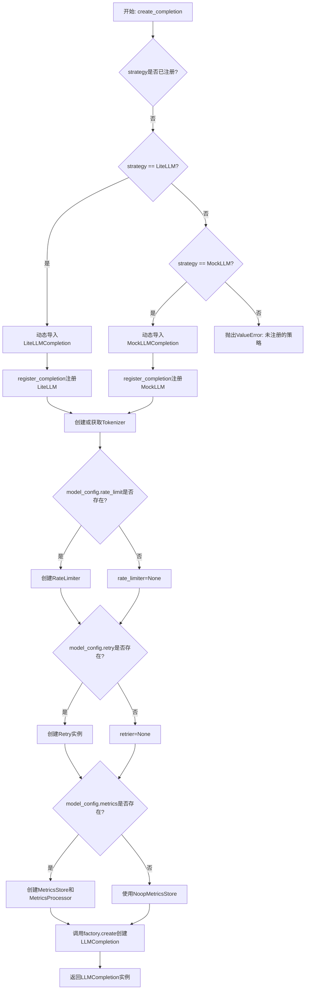
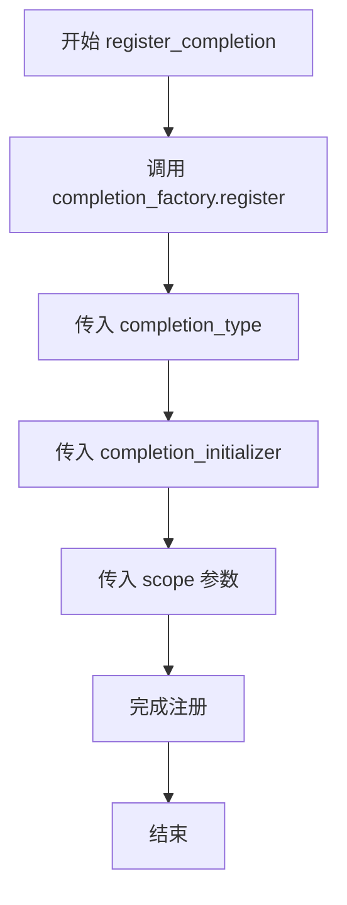
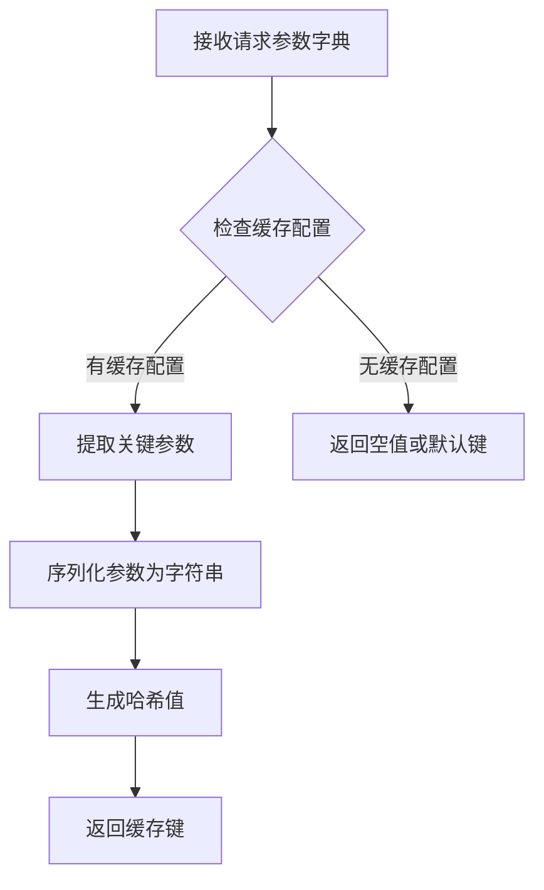
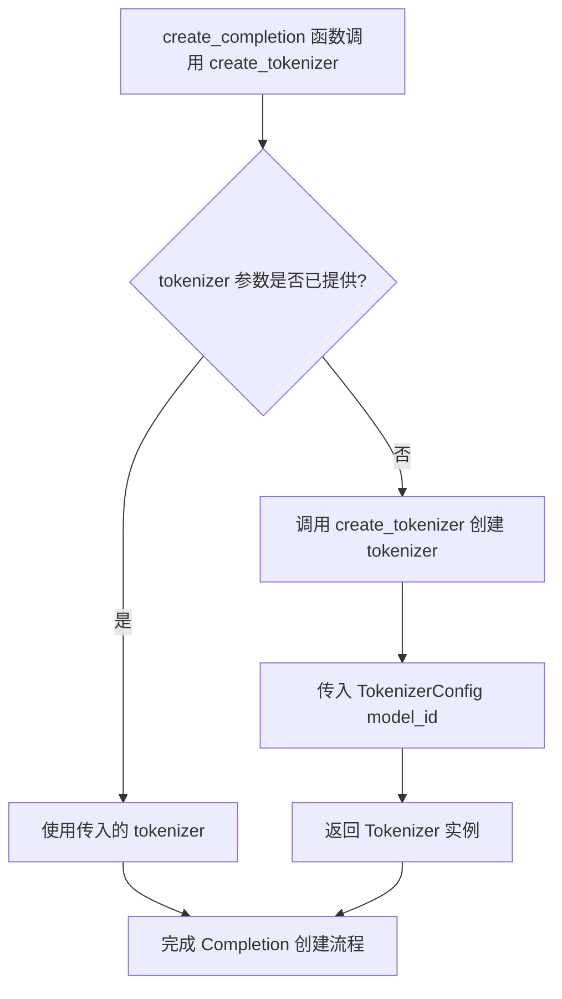
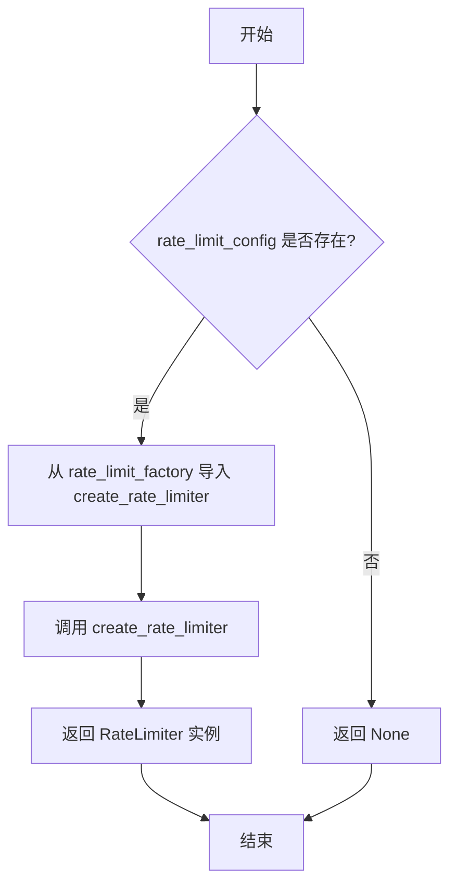
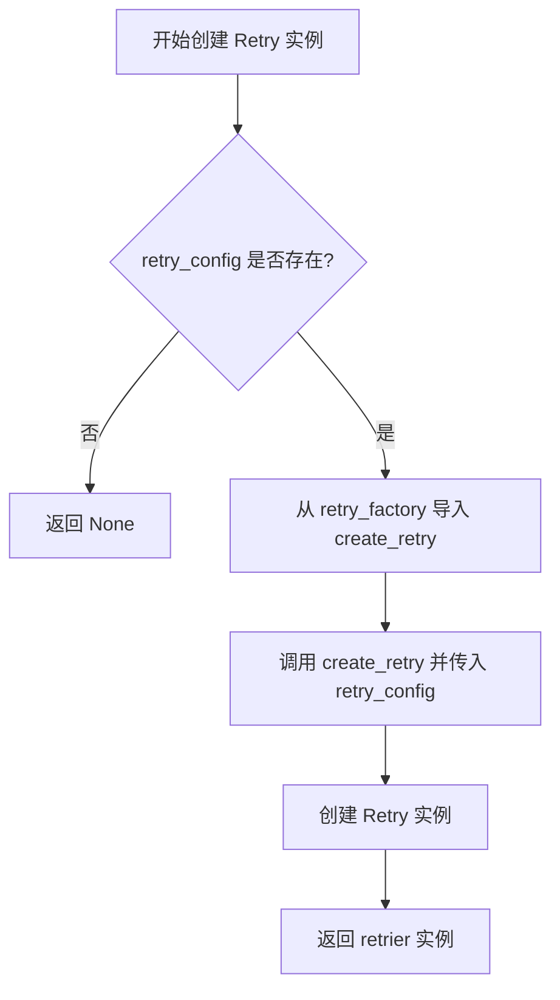
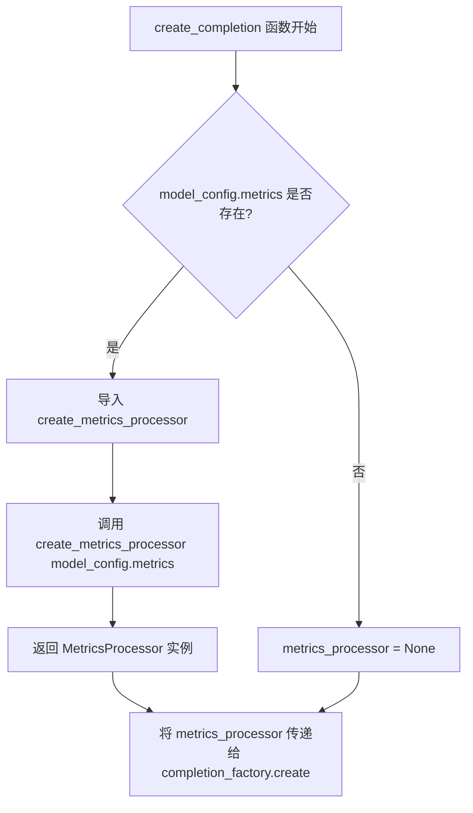
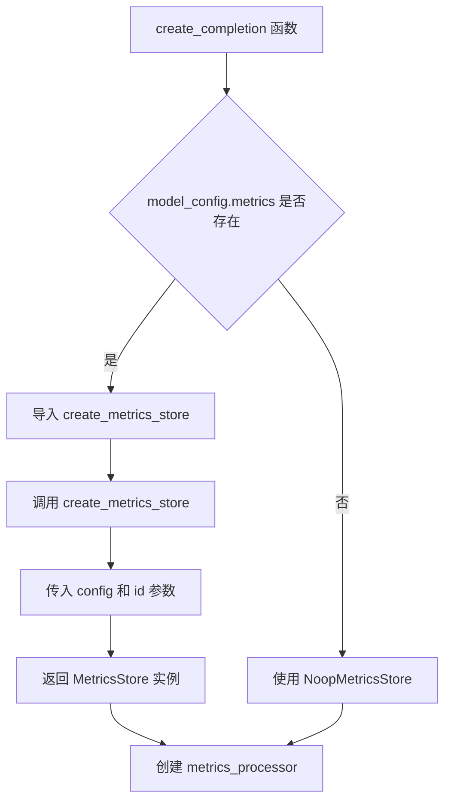
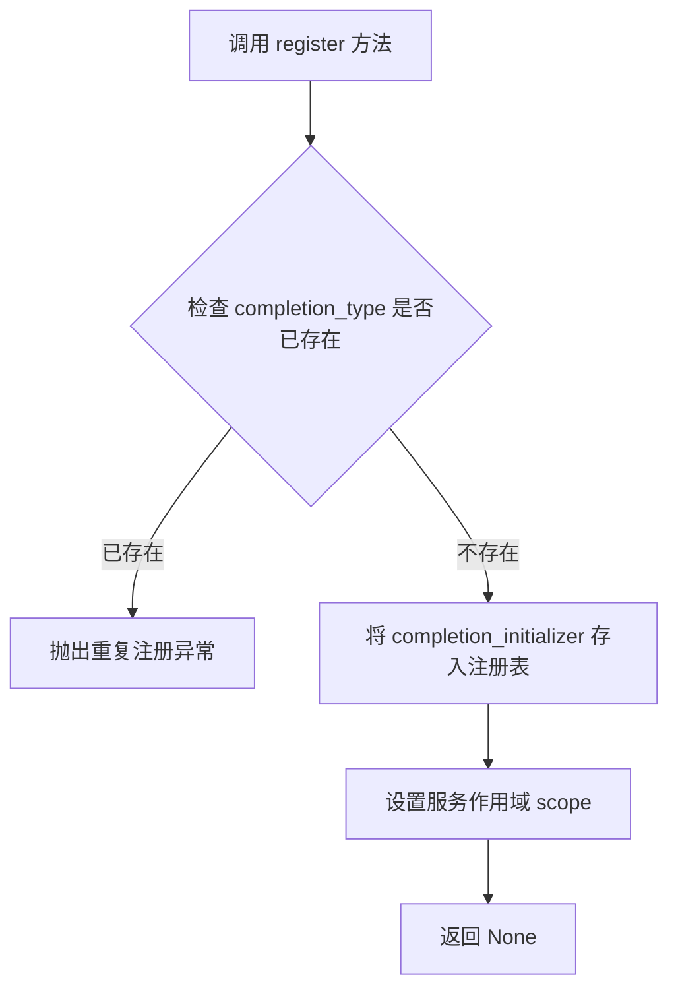
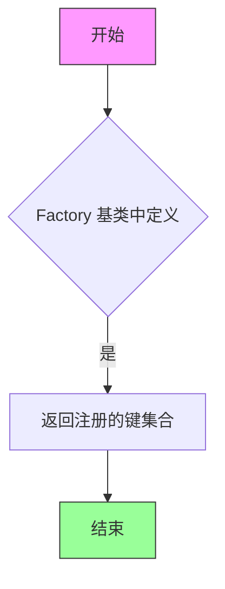

# `graphrag\packages\graphrag-llm\graphrag_llm\completion\completion_factory.py` 详细设计文档

这是一个LLM完成实例工厂模块，通过CompletionFactory工厂类根据模型配置动态创建不同的LLM完成实例（如LiteLLM、MockLLM），支持缓存、速率限制、重试机制和指标收集等功能的配置与管理。

## 整体流程



## 类结构

```
Factory (抽象基类 from graphrag_common)
└── CompletionFactory (继承Factory)
```

## 全局变量及字段


### `completion_factory`
    
用于创建LLMCompletion实例的工厂单例注册表

类型：`CompletionFactory`
    


    

## 全局函数及方法


### `register_completion`

用于将自定义的 LLMCompletion 实现注册到全局工厂中的函数，允许动态注册不同类型的 completion 实例。

参数：

- `completion_type`：`str`，要注册的 completion 类型标识符
- `completion_initializer`：`Callable[..., "LLMCompletion"]`，用于创建 LLMCompletion 实例的可调用对象
- `scope`：`"ServiceScope"`，服务作用域，默认为 "transient"（ transient | singleton | scoped）

返回值：`None`，无返回值

#### 流程图



#### 带注释源码

```python
def register_completion(
    completion_type: str,  # 字符串类型的completion标识符
    completion_initializer: Callable[..., "LLMCompletion"],  # 可调用对象,用于创建LLMCompletion实例
    scope: "ServiceScope" = "transient",  # 服务作用域,默认为transient
) -> None:
    """Register a custom completion implementation.

    Args
    ----
        completion_type: str
            The completion id to register.
        completion_initializer: Callable[..., LLMCompletion]
            The completion initializer to register.
        scope: ServiceScope (default: "transient")
            The service scope for the completion.
    """
    # 调用全局completion_factory的register方法进行注册
    completion_factory.register(completion_type, completion_initializer, scope)
```


### `create_completion`

该函数是 LLM 完成实例的工厂方法，根据模型配置动态创建相应的 LLMCompletion 实例，支持多种 LLM 提供商（如 LiteLLM、MockLLM），并可选地集成缓存、限流、重试和指标收集功能。

参数：

- `model_config`：`ModelConfig`，模型配置对象，包含模型提供商、模型名称、类型等信息
- `cache`：`Cache | None`，可选的缓存实例，用于存储和复用 LLM 响应
- `cache_key_creator`：`CacheKeyCreator | None`，可选的缓存键创建函数，默认为 `create_cache_key`
- `tokenizer`：`Tokenizer | None`，可选的分词器实例，默认为根据模型 ID 自动创建

返回值：`LLMCompletion`，返回 LLMCompletion 子类的实例

#### 流程图

```mermaid
flowchart TD
    A[开始 create_completion] --> B[设置默认 cache_key_creator]
    B --> C[构建 model_id: {model_provider}/{model}]
    C --> D{strategy 是否在 completion_factory 中?}
    D -->|否| E{strategy 类型}
    E -->|LiteLLM| F[导入并注册 LiteLLMCompletion]
    E -->|MockLLM| G[导入并注册 MockLLMCompletion]
    E -->|_| H[抛出 ValueError 异常]
    F --> I[重新检查 strategy]
    G --> I
    I -->|是| J{tokenizer 是否提供?}
    J -->|否| K[根据 model_id 创建 tokenizer]
    J -->|是| L{rate_limit 是否配置?}
    K --> L
    L -->|是| M[创建 rate_limiter]
    L -->|否| N{retry 是否配置?}
    M --> N
    N -->|是| O[创建 retrier]
    N -->|是| P{metrics 是否配置?}
    O --> P
    P -->|是| Q[创建 metrics_store 和 metrics_processor]
    P -->|否| R[使用 NoopMetricsStore]
    Q --> S[调用 completion_factory.create]
    R --> S
    S --> T[返回 LLMCompletion 实例]
    H --> U[结束]
    T --> U
```

#### 带注释源码

```python
def create_completion(
    model_config: "ModelConfig",
    *,
    cache: "Cache | None" = None,
    cache_key_creator: "CacheKeyCreator | None" = None,
    tokenizer: "Tokenizer | None" = None,
) -> "LLMCompletion":
    """Create a Completion instance based on the model configuration.

    Args
    ----
        model_config: ModelConfig
            The configuration for the model.
        cache: Cache | None (default: None)
            An optional cache instance.
        cache_key_creator: CacheKeyCreator | None (default: create_cache_key)
            An optional cache key creator function.
            (dict[str, Any]) -> str
        tokenizer: Tokenizer | None (default: litellm)
            An optional tokenizer instance.

    Returns
    -------
        LLMCompletion:
            An instance of a LLMCompletion subclass.
    """
    # 如果未提供 cache_key_creator，则使用默认的 create_cache_key 函数
    cache_key_creator = cache_key_creator or create_cache_key
    
    # 根据模型提供商和模型名称构建完整的 model_id
    model_id = f"{model_config.model_provider}/{model_config.model}"
    
    # 从模型配置中获取策略类型（即 LLM 提供商类型）
    strategy = model_config.type
    
    # 获取模型额外的配置参数
    extra: dict[str, Any] = model_config.model_extra or {}

    # 检查该策略是否已在工厂中注册
    if strategy not in completion_factory:
        # 根据策略类型动态导入并注册相应的 Completion 类
        match strategy:
            case LLMProviderType.LiteLLM:
                from graphrag_llm.completion.lite_llm_completion import (
                    LiteLLMCompletion,
                )

                register_completion(
                    completion_type=LLMProviderType.LiteLLM,
                    completion_initializer=LiteLLMCompletion,
                    scope="singleton",
                )
            case LLMProviderType.MockLLM:
                from graphrag_llm.completion.mock_llm_completion import (
                    MockLLMCompletion,
                )

                register_completion(
                    completion_type=LLMProviderType.MockLLM,
                    completion_initializer=MockLLMCompletion,
                )
            case _:
                # 如果策略类型未注册，抛出详细的错误信息
                msg = f"ModelConfig.type '{strategy}' is not registered in the CompletionFactory. Registered strategies: {', '.join(completion_factory.keys())}"
                raise ValueError(msg)

    # 如果未提供 tokenizer，则根据 model_id 自动创建
    tokenizer = tokenizer or create_tokenizer(TokenizerConfig(model_id=model_id))

    # 根据模型配置创建限流器（如果配置了限流）
    rate_limiter: RateLimiter | None = None
    if model_config.rate_limit:
        from graphrag_llm.rate_limit.rate_limit_factory import create_rate_limiter

        rate_limiter = create_rate_limiter(rate_limit_config=model_config.rate_limit)

    # 根据模型配置创建重试机制（如果配置了重试）
    retrier: Retry | None = None
    if model_config.retry:
        from graphrag_llm.retry.retry_factory import create_retry

        retrier = create_retry(retry_config=model_config.retry)

    # 默认使用 NoopMetricsStore（无操作指标存储）
    metrics_store: MetricsStore = NoopMetricsStore()
    metrics_processor: MetricsProcessor | None = None
    
    # 如果配置了指标，则创建相应的指标存储和处理器
    if model_config.metrics:
        from graphrag_llm.metrics import create_metrics_processor, create_metrics_store

        metrics_store = create_metrics_store(
            config=model_config.metrics,
            id=model_id,
        )
        metrics_processor = create_metrics_processor(model_config.metrics)

    # 通过工厂模式创建 LLMCompletion 实例，传入所有初始化参数
    return completion_factory.create(
        strategy=strategy,
        init_args={
            **extra,  # 展开模型额外的配置参数
            "model_id": model_id,
            "model_config": model_config,
            "tokenizer": tokenizer,
            "metrics_store": metrics_store,
            "metrics_processor": metrics_processor,
            "rate_limiter": rate_limiter,
            "retrier": retrier,
            "cache": cache,
            "cache_key_creator": cache_key_creator,
        },
    )
```


根据提供的代码，我需要说明一点：`create_cache_key` 函数是从 `graphrag_llm.cache` 模块导入的，其实际实现代码并未包含在当前提供的代码段中。但是，我可以根据代码中的使用方式、类型提示和上下文来提取相关信息。

### `create_cache_key`

生成缓存键的函数，用于将请求参数转换为唯一的缓存标识符。

参数：

-  `params`：`dict[str, Any]`（字典类型），包含模型名称、提供商、请求参数等用于生成缓存键的参数字典

返回值：`str`（字符串），返回生成的唯一缓存键标识符

#### 流程图



#### 带注释源码

```python
# 该函数定义在 graphrag_llm/cache 模块中
# 以下是根据代码中使用方式推断的函数签名和使用场景

from graphrag_llm.cache import create_cache_key

# 在 create_completion 函数中的使用方式：
def create_completion(
    model_config: "ModelConfig",
    *,
    cache: "Cache | None" = None,
    cache_key_creator: "CacheKeyCreator | None" = None,
    tokenizer: "Tokenizer | None" = None,
) -> "LLMCompletion":
    """创建Completion实例"""
    # 如果未提供 cache_key_creator，则使用默认的 create_cache_key 函数
    cache_key_creator = cache_key_creator or create_cache_key
    
    # ... 后续代码会将 cache_key_creator 传递给实际的 Completion 实现
    # Completion 实现会调用 cache_key_creator(dict) 来生成缓存键
```

---

## 补充说明

由于 `create_cache_key` 的实际实现代码不在当前提供的代码段中，以上信息是基于以下证据推断的：

1. **导入语句**：`from graphrag_llm.cache import create_cache_key`
2. **函数类型提示**：`cache_key_creator: "CacheKeyCreator | None"`，注释说明类型为 `(dict[str, Any]) -> str`
3. **默认参数**：`cache_key_creator or create_cache_key`

如需查看 `create_cache_key` 的完整实现，需要查看 `graphrag_llm/cache/__init__.py` 或相关模块的实际代码。


### `create_tokenizer`

根据提供的代码分析，`create_tokenizer` 是从外部模块 `graphrag_llm.tokenizer.tokenizer_factory` 导入的工厂函数，用于根据配置创建 tokenizer 实例。在当前代码中仅体现了其使用方式，但未提供完整实现源码。

参数：

-  `config`：`TokenizerConfig`，用于配置 tokenizer 的参数，当前传入 `TokenizerConfig(model_id=model_id)`

返回值：`Tokenizer`，返回配置好的 tokenizer 实例

#### 流程图



#### 带注释源码

```python
# 在 completion_factory.py 中的调用示例
# 导入 create_tokenizer 函数
from graphrag_llm.tokenizer.tokenizer_factory import create_tokenizer
from graphrag_llm.config.tokenizer_config import TokenizerConfig

# 在 create_completion 函数中使用
def create_completion(
    model_config: "ModelConfig",
    *,
    cache: "Cache | None" = None,
    cache_key_creator: "CacheKeyCreator | None" = None,
    tokenizer: "Tokenizer | None" = None,
) -> "LLMCompletion":
    # ... 其他逻辑 ...
    
    # 如果未提供 tokenizer，则使用 create_tokenizer 创建
    tokenizer = tokenizer or create_tokenizer(TokenizerConfig(model_id=model_id))
    
    # ... 后续逻辑 ...
```

> **注意**：当前提供的代码文件中仅包含 `create_tokenizer` 的导入和使用示例，未包含该函数的具体实现。要获取 `create_tokenizer` 的完整源码和详细设计文档，需要查看 `graphrag_llm/tokenizer/tokenizer_factory.py` 文件。


### `create_rate_limiter`

该函数是一个工厂函数，用于根据提供的速率限制配置创建并返回一个速率限制器（RateLimiter）实例。

参数：

-  `rate_limit_config`：`RateLimitConfig`，速率限制的配置对象

返回值：`RateLimiter | None`，返回创建的速率限制器实例，如果配置为 None 则返回 None

#### 流程图



#### 带注释源码

```python
# 在 create_completion 函数中调用 create_rate_limiter 的代码片段
rate_limiter: RateLimiter | None = None  # 初始化为 None
if model_config.rate_limit:  # 检查模型配置中是否指定了速率限制
    # 从速率限制工厂模块导入 create_rate_limiter 函数
    from graphrag_llm.rate_limit.rate_limit_factory import create_rate_limiter

    # 使用模型配置的 rate_limit 创建速率限制器实例
    rate_limiter = create_rate_limiter(rate_limit_config=model_config.rate_limit)
```


### `create_retry`

该函数是一个工厂函数，用于根据配置创建重试（Retry）策略的实例。它接收重试配置参数，实例化相应的重试处理器，并返回配置好的重试对象供 LLM 调用失败时使用。

参数：

- `retry_config`：`RetryConfig`，重试配置对象，包含重试次数、退避策略、最大延迟等参数

返回值：`Retry`，返回配置好的重试策略实例，用于在 LLM 调用失败时执行重试逻辑

#### 流程图



#### 带注释源码

```python
# 在 create_completion 函数中调用 create_retry
# 仅当 model_config.retry 配置存在时才创建重试器
retrier: Retry | None = None
if model_config.retry:
    # 动态导入 retry_factory 模块中的 create_retry 工厂函数
    from graphrag_llm.retry.retry_factory import create_retry

    # 使用模型配置中的重试配置创建重试策略实例
    # retry_config 包含重试次数、退避策略、最大/最小延迟等参数
    retrier = create_retry(retry_config=model_config.retry)
```

> **注意**：用户提供代码片段中仅包含 `create_retry` 函数的导入和调用语句，实际的函数定义位于 `graphrag_llm.retry.retry_factory` 模块中。该函数接收 `RetryConfig` 类型的配置对象，返回一个 `Retry` 类型的实例，用于封装重试逻辑（如指数退避、错误类型过滤等）。


### `create_metrics_processor`

从提供的代码文件中可以看到，`create_metrics_processor` 函数是从 `graphrag_llm.metrics` 模块导入的，其定义不在当前代码文件中。该函数在 `create_completion` 函数内部被调用，用于创建指标处理器实例。

参数：

-  `config`：从 `model_config.metrics` 传入，具体类型取决于 `ModelConfig` 的 `metrics` 字段定义，通常为指标配置对象。

返回值：`MetricsProcessor | None`，返回创建的指标处理器实例，如果没有配置指标则返回 `None`。

#### 流程图



#### 带注释源码

```python
# 在 create_completion 函数中调用 create_metrics_processor 的代码片段
# 注意：create_metrics_processor 函数的定义不在当前文件中

metrics_processor: MetricsProcessor | None = None
if model_config.metrics:  # 检查是否配置了指标
    # 从 graphrag_llm.metrics 模块导入 create_metrics_processor 函数
    from graphrag_llm.metrics import create_metrics_processor, create_metrics_store

    # 创建指标存储实例
    metrics_store = create_metrics_store(
        config=model_config.metrics,
        id=model_id,
    )
    
    # 创建指标处理器实例，传入指标配置
    # 参数: config - 模型指标配置
    # 返回值: MetricsProcessor 实例或 None
    metrics_processor = create_metrics_processor(model_config.metrics)
```

---

> **注意**：由于 `create_metrics_processor` 函数的完整定义不在提供的代码文件中，以上信息是基于代码中对其调用方式的推断。如需获取该函数的完整签名和实现细节，请参考 `graphrag_llm.metrics` 模块的源文件。


## 分析结果

根据提供的代码分析，`create_metrics_store` 函数并未在该代码文件中定义，而是从外部模块 `graphrag_llm.metrics` 导入的。代码中仅展示了该函数的使用方式。

以下是从代码中提取的关于 `create_metrics_store` 的相关信息：

---

### `create_metrics_store`

从 `graphrag_llm.metrics` 模块导入的函数，用于创建指标存储实例。

参数：

-  `config`：`MetricsConfig`（类型推断自 `model_config.metrics`），指标配置对象
-  `id`：`str`，模型标识符（这里传入的是 `model_id`，格式为 `{model_provider}/{model}`）

返回值：`MetricsStore`，指标存储实例

#### 流程图



#### 源码引用

```python
# 在 create_completion 函数中调用 create_metrics_store
metrics_store: MetricsStore = NoopMetricsStore()
metrics_processor: MetricsProcessor | None = None
if model_config.metrics:
    from graphrag_llm.metrics import create_metrics_processor, create_metrics_store

    metrics_store = create_metrics_store(
        config=model_config.metrics,  # 指标配置
        id=model_id,                   # 模型标识符 (例如: "openai/gpt-4")
    )
    metrics_processor = create_metrics_processor(model_config.metrics)
```

---

## 说明

由于 `create_metrics_store` 函数的实际定义位于 `graphrag_llm.metrics` 模块中（未在当前代码文件中提供），上述信息是基于代码中的调用方式推断得出的。如需获取完整的函数实现细节，请参考 `graphrag_llm.metrics` 模块的源代码。


### `CompletionFactory.register`

该方法是继承自 `Factory` 基类的注册方法，用于在工厂中注册 LLM 完成服务的实现类。

参数：

-  `completion_type`：`str`，要注册的完成服务类型标识符（如 `"LiteLLM"` 或 `"MockLLM"`）
-  `completion_initializer`：`Callable[..., LLMCompletion]`，用于创建 LLMCompletion 实例的可调用对象（通常是类构造函数）
-  `scope`：`ServiceScope`，服务作用域，默认为 `"transient"`，可设置为 `"singleton"`

返回值：`None`，无返回值（注册操作）

#### 流程图



#### 带注释源码

```python
# 该方法继承自 Factory 基类，源码如下：

def register(
    self,
    completion_type: str,  # 注册类型标识
    completion_initializer: Callable[..., "LLMCompletion"],  # 初始化器
    scope: "ServiceScope" = "transient",  # 作用域，默认瞬态
) -> None:
    """注册一个完成服务实现.
    
    参数:
        completion_type: 完成服务类型标识
        completion_initializer: 完成服务初始化回调
        scope: 服务作用域 (transient/singleton)
    """
    # 调用父类 Factory 的注册逻辑
    super().register(completion_type, completion_initializer, scope)
```


### `create_completion`

该函数根据模型配置创建一个 LLMCompletion 实例，支持动态注册不同的 Completion 实现（如 LiteLLM、MockLLM），并可选地配置缓存、令牌生成器、速率限制器、重试机制和指标收集。

参数：

- `model_config`：`ModelConfig`，模型的配置对象，包含模型提供商、模型名称、类型等信息
- `cache`：`Cache | None`，可选的缓存实例，用于缓存 LLM 响应
- `cache_key_creator`：`CacheKeyCreator | None`，可选的缓存键创建函数，默认为 `create_cache_key`
- `tokenizer`：`Tokenizer | None`，可选的令牌生成器实例，默认为根据 model_id 创建的令牌生成器

返回值：`LLMCompletion`，返回 LLMCompletion 子类的实例

#### 流程图

```mermaid
flowchart TD
    A[开始 create_completion] --> B{cache_key_creator 是否为 None?}
    B -->|是| C[使用 create_cache_key 作为默认值]
    B -->|否| D[使用传入的 cache_key_creator]
    C --> E[构建 model_id: {model_provider}/{model}]
    D --> E
    E --> F[获取 strategy: model_config.type]
    F --> G[获取 extra: model_config.model_extra]
    G --> H{strategy 是否在 completion_factory 中?}
    H -->|否| I{strategy 是 LiteLLM?}
    H -->|是| K
    I -->|是| J[导入并注册 LiteLLMCompletion]
    I -->|否| L{strategy 是 MockLLM?}
    J --> K
    L -->|是| M[导入并注册 MockLLMCompletion]
    L -->|否| N[抛出 ValueError 异常]
    M --> K
    N --> O[错误: ModelConfig.type 未注册]
    K{tokenizer 是否为 None?}
    K -->|是| P[根据 model_id 创建 Tokenizer]
    K -->|否| Q
    P --> Q{model_config.rate_limit 是否存在?}
    Q -->|是| R[创建 RateLimiter]
    Q -->|否| S{model_config.retry 是否存在?}
    R --> S
    S -->|是| T[创建 Retry 实例]
    S -->|否| U{model_config.metrics 是否存在?}
    T --> U
    U -->|是| V[创建 MetricsStore 和 MetricsProcessor]
    U -->|否| W[使用 NoopMetricsStore]
    V --> X
    W --> X
    X --> Y[调用 completion_factory.create 创建实例]
    Y --> Z[返回 LLMCompletion 实例]
```

#### 带注释源码

```python
def create_completion(
    model_config: "ModelConfig",
    *,
    cache: "Cache | None" = None,
    cache_key_creator: "CacheKeyCreator | None" = None,
    tokenizer: "Tokenizer | None" = None,
) -> "LLMCompletion":
    """Create a Completion instance based on the model configuration.

    Args
    ----
        model_config: ModelConfig
            The configuration for the model.
        cache: Cache | None (default: None)
            An optional cache instance.
        cache_key_creator: CacheKeyCreator | None (default: create_cache_key)
            An optional cache key creator function.
            (dict[str, Any]) -> str
        tokenizer: Tokenizer | None (default: litellm)
            An optional tokenizer instance.

    Returns
    -------
        LLMCompletion:
            An instance of a LLMCompletion subclass.
    """
    # 如果未提供 cache_key_creator，使用默认的 create_cache_key 函数
    cache_key_creator = cache_key_creator or create_cache_key
    # 构建模型标识符，格式为 {provider}/{model_name}
    model_id = f"{model_config.model_provider}/{model_config.model}"
    # 从模型配置中获取策略类型
    strategy = model_config.type
    # 获取额外的模型配置参数
    extra: dict[str, Any] = model_config.model_extra or {}

    # 检查策略是否已在工厂中注册，未注册则进行动态注册
    if strategy not in completion_factory:
        match strategy:
            case LLMProviderType.LiteLLM:
                # 动态导入 LiteLLMCompletion 并注册为单例
                from graphrag_llm.completion.lite_llm_completion import (
                    LiteLLMCompletion,
                )

                register_completion(
                    completion_type=LLMProviderType.LiteLLM,
                    completion_initializer=LiteLLMCompletion,
                    scope="singleton",
                )
            case LLMProviderType.MockLLM:
                # 动态导入 MockLLMCompletion 并注册（默认 transient 作用域）
                from graphrag_llm.completion.mock_llm_completion import (
                    MockLLMCompletion,
                )

                register_completion(
                    completion_type=LLMProviderType.MockLLM,
                    completion_initializer=MockLLMCompletion,
                )
            case _:
                # 策略未注册，抛出详细的错误信息
                msg = f"ModelConfig.type '{strategy}' is not registered in the CompletionFactory. Registered strategies: {', '.join(completion_factory.keys())}"
                raise ValueError(msg)

    # 如果未提供 tokenizer，根据 model_id 创建默认的 tokenizer
    tokenizer = tokenizer or create_tokenizer(TokenizerConfig(model_id=model_id))

    # 根据配置创建速率限制器（可选）
    rate_limiter: RateLimiter | None = None
    if model_config.rate_limit:
        from graphrag_llm.rate_limit.rate_limit_factory import create_rate_limiter

        rate_limiter = create_rate_limiter(rate_limit_config=model_config.rate_limit)

    # 根据配置创建重试机制（可选）
    retrier: Retry | None = None
    if model_config.retry:
        from graphrag_llm.retry.retry_factory import create_retry

        retrier = create_retry(retry_config=model_config.retry)

    # 初始化指标存储，默认为 NoopMetricsStore（无操作）
    metrics_store: MetricsStore = NoopMetricsStore()
    metrics_processor: MetricsProcessor | None = None
    # 如果配置了指标，则创建指标处理器和存储
    if model_config.metrics:
        from graphrag_llm.metrics import create_metrics_processor, create_metrics_store

        metrics_store = create_metrics_store(
            config=model_config.metrics,
            id=model_id,
        )
        metrics_processor = create_metrics_processor(model_config.metrics)

    # 调用工厂方法创建 LLMCompletion 实例，传入所有初始化参数
    return completion_factory.create(
        strategy=strategy,
        init_args={
            **extra,
            "model_id": model_id,
            "model_config": model_config,
            "tokenizer": tokenizer,
            "metrics_store": metrics_store,
            "metrics_processor": metrics_processor,
            "rate_limiter": rate_limiter,
            "retrier": retrier,
            "cache": cache,
            "cache_key_creator": cache_key_creator,
        },
    )
```


### `CompletionFactory.keys`

获取已注册在工厂中的所有 completion 类型的键列表。

参数：无

返回值：`list[str]`，返回已注册的所有 completion 类型的名称列表

#### 流程图



#### 带注释源码

```python
# 由于 keys 方法定义在父类 Factory 中（未在当前代码中显示）
# 以下是基于使用方式的推断实现

def keys(self) -> list[str]:
    """获取已注册的 completion 类型键列表。
    
    Returns
    -------
        list[str]
            已注册的所有 completion 类型标识符列表，
            例如 ['LiteLLM', 'MockLLM']
    """
    # 返回内部存储的策略注册表键集合
    return list(self._strategies.keys())
```

> **注意**：从代码中的使用方式 `', '.join(completion_factory.keys())` 可以看出，该方法返回一个可迭代的字符串集合，用于列出所有已注册的 completion 提供商类型。该方法继承自 `Factory` 基类，在当前代码文件中未直接定义其实现。

## 关键组件


### CompletionFactory

Factory 基类，提供通用工厂模式实现，用于创建 LLMCompletion 实例，支持注册和动态创建不同类型的完成服务。

### completion_factory

全局单例工厂实例，用于存储和管理已注册的 completion 实现，支持按策略类型创建对应的 LLMCompletion。

### register_completion 函数

注册自定义 completion 实现的函数，支持指定 completion_type、completion_initializer 和 scope（singleton/transient），实现惰性加载和按需实例化。

### create_completion 函数

核心函数，基于 ModelConfig 创建 LLMCompletion 实例，集成缓存、tokenizer、rate limiter、retry 和 metrics 等组件，支持动态加载 LiteLLM 和 MockLLM 提供商。

### 缓存机制 (Cache & CacheKeyCreator)

提供可选的缓存实例和缓存键生成器，用于缓存 LLM 响应结果，通过 create_cache_key 生成缓存键，支持模型级别的缓存策略。

### Tokenizer

文本分词器组件，由 create_tokenizer 根据 model_id 动态创建，用于对输入文本进行分词处理，支持不同模型的 TokenizerConfig 配置。

### RateLimiter

速率限制器，通过 RateLimitFactory 根据配置创建，用于控制 LLM 调用的频率，防止超出 API 限流。

### Retry

重试机制，通过 RetryFactory 根据配置创建，支持自动重试失败的 LLM 请求，提供指数退避等策略。

### MetricsStore & MetricsProcessor

指标存储和处理组件，MetricsStore 默认使用 NoopMetricsStore（空实现），MetricsProcessor 用于收集和上报 LLM 调用指标。


## 问题及建议


### 已知问题

-   **运行时动态导入导致性能开销和错误发现延迟**：在 `create_completion` 函数内部进行动态导入（如 `from graphrag_llm.completion.lite_llm_completion import LiteLLMCompletion`），每次调用都会执行导入检查，增加运行时开销且错误只在运行时才能发现。
-   **策略注册逻辑分散在工厂方法中**：LiteLLM 和 MockLLM 的注册逻辑内嵌在 `create_completion` 中，导致首次调用时需要额外的注册步骤，违背了工厂模式预先注册的标准做法。
-   **缺少线程安全保护**：`completion_factory` 作为模块级单例使用，但 `register_completion` 和 `create` 方法缺乏线程同步机制，在并发场景下可能导致竞态条件。
-   **重复的工厂键检查**：每次调用 `create_completion` 都执行 `if strategy not in completion_factory` 检查和 `completion_factory.keys()` 遍历，虽然影响较小但存在冗余。
-   **默认值处理不够健壮**：`cache_key_creator = cache_key_creator or create_cache_key` 直接使用函数引用，若 `create_cache_key` 导入失败，错误信息难以追踪。
-   **重复创建默认对象**：始终创建 `NoopMetricsStore()`，即使后续会创建真实的 `metrics_store`，造成不必要的对象创建开销。
-   **类型提示使用运行时字符串**：`"Cache | None"` 等字符串类型提示在运行时不会生效，可能导致 IDE 类型推断不准确。

### 优化建议

-   **将动态导入移至模块顶层或专门的注册模块**：在模块初始化时预先导入并注册所有内置 provider，避免在 `create_completion` 中进行条件导入。
-   **添加线程锁保护工厂注册和创建过程**：使用 `threading.Lock` 保护 `completion_factory` 的 `register` 和 `create` 操作。
-   **实现延迟注册模式**：在检测到未注册的 provider 时，先检查是否属于内置 provider，再决定是注册还是抛出异常，减少重复检查。
-   **优化默认值处理**：对 `cache_key_creator` 和 `tokenizer` 的默认值使用显式检查，提供更清晰的错误信息。
-   **合并 metrics store 创建逻辑**：仅在 `model_config.metrics` 存在时创建对应 store，避免创建不必要的 `NoopMetricsStore`。
-   **考虑使用泛型工厂模式**：利用 Python 3.12 的泛型类型参数或 `TypeVar` 增强类型安全。

## 其它


### 设计目标与约束

本模块的设计目标是提供一个统一的 LLM Completion 实例创建工厂，支持多种 LLM 提供商的动态注册和实例化。主要约束包括：1) 必须支持 LiteLLM 和 MockLLM 两种内置提供商；2) 支持可选的缓存、速率限制、重试和指标收集功能；3) 使用工厂模式实现服务定位和依赖注入；4) 遵循服务作用域（transient/singleton）管理生命周期。

### 错误处理与异常设计

代码中包含以下错误处理机制：1) 当 strategy 未注册时，抛出 ValueError 并包含已注册的策略列表信息；2) 条件导入时使用 try-except 处理 ImportError；3) 可选依赖（如 cache、rate_limiter、retrier）为空时不影响主流程；4) 异常信息包含上下文信息便于调试。潜在改进：可增加自定义异常类区分不同错误类型，添加重试失败后的具体异常信息。

### 数据流与状态机

数据流如下：1) 外部调用 create_completion(model_config) 传入模型配置；2) 根据 strategy 类型动态注册对应的 Completion 类；3) 创建或复用 tokenizer；4) 根据配置创建可选组件（rate_limiter、retrier、metrics）；5) 调用工厂的 create 方法实例化 LLMCompletion。状态机主要涉及：Factory 注册状态（已注册/未注册）、服务作用域（transient/singleton）。

### 外部依赖与接口契约

主要外部依赖包括：1) graphrag_common.factory.Factory 基类；2) graphrag_llm.cache.create_cache_key 缓存键创建函数；3) graphrag_llm.tokenizer.tokenizer_factory.create_tokenizer 分词器工厂；4) graphrag_llm.rate_limit.rate_limit_factory.create_rate_limiter 速率限制器工厂；5) graphrag_llm.retry.retry_factory.create_retry 重试机制工厂；6) graphrag_llm.metrics 度量处理模块。接口契约：ModelConfig 必须包含 model_provider、model、type、model_extra、rate_limit、retry、metrics 字段；返回的 LLMCompletion 必须实现标准Completion 接口。

### 配置管理

配置通过 ModelConfig 对象传入，关键配置项包括：1) model_provider 和 model 组合生成 model_id；2) type 字段确定使用的 LLM 提供商策略；3) model_extra 字典传递额外初始化参数；4) rate_limit、retry、metrics 分别控制速率限制、重试和度量收集。配置支持运行时动态注册新策略。

### 生命周期管理

CompletionFactory 支持两种服务作用域：1) transient：每次调用 create 创建新实例；2) singleton：共享同一实例。内置的 LiteLLMCompletion 使用 singleton 作用域，MockLLMCompletion 使用默认的 transient 作用域。工厂实例 completion_factory 为全局单例。

### 性能考虑

潜在性能优化点：1) 缓存已注册的 completion 类型避免重复导入；2) tokenizer 复用减少初始化开销；3) metrics_processor 可配置为 NoopMetricsStore 避免开销；4) 可考虑添加连接池复用机制。当前实现中，每次 create_completion 调用都会重新创建 rate_limiter、retrier 等组件。

### 安全性考虑

当前代码未包含敏感信息处理，但需注意：1) ModelConfig 可能包含 API 密钥等敏感信息，应确保安全传输和存储；2) cache_key_creator 函数生成的键不应包含敏感配置；3) 远程调用需考虑 TLS 加密和认证。生产环境建议使用安全配置管理方案。

### 测试策略

建议测试覆盖：1) 单元测试：测试 register_completion 和 create_completion 基本功能；2) 集成测试：测试完整流程与各 Provider 的交互；3) 错误场景测试：测试未注册策略、缺失依赖等异常情况；4) 性能测试：测试并发创建和大规模调用场景。可使用 MockLLMCompletion 进行隔离测试。

### 并发与线程安全性

CompletionFactory 本身是线程安全的（基于 graphrag_common.factory 实现），但需注意：1) 共享的 singleton 实例在多线程环境下需考虑状态同步；2) rate_limiter 和 metrics_processor 通常不是线程安全的，需要在调用方进行同步；3) 建议在高并发场景下使用 singleton 作用域以减少资源竞争。

### 版本兼容性

代码依赖项版本要求：1) graphrag_common：需实现 Factory 基类；2) graphrag_llm：各子模块版本需兼容；3) TYPE_CHECKING 导入用于类型检查，不影响运行时。建议在 requirements.txt 或 pyproject.toml 中明确版本约束。

    